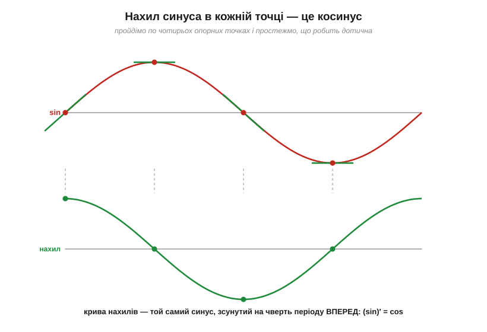
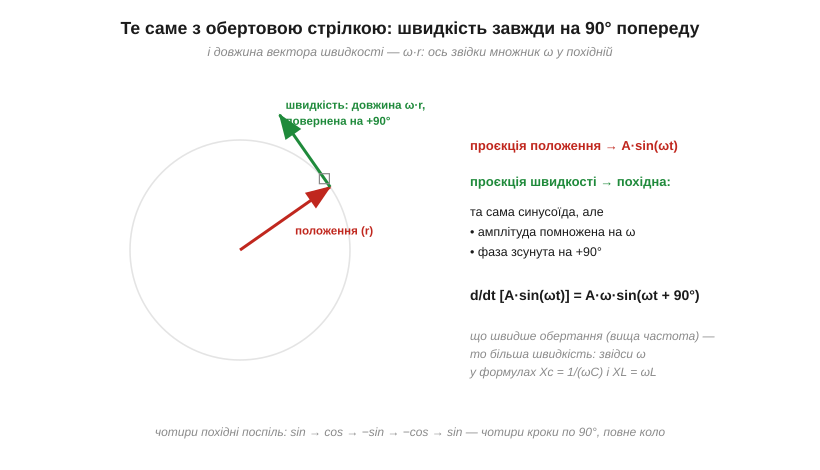

# 🧮 Похідні синуса й косинуса: чому зсув — рівно 90°

> На графіках змінного струму видно: струм конденсатора випереджає напругу на чверть періоду, у котушки — навпаки. Але «чверть періоду» на графіку — лише експериментальний факт. Тут — доказ: чому зсув **рівно** 90° на будь-якій частоті, звідки в реактивностях береться множник ω і чому синусоїда — єдина форма сигналу, якій так щастить.

### Похідна синуса — простеж за нахилом

Похідна — це миттєвий нахил кривої: наскільки круто вона йде вгору чи вниз у кожній точці. Тож питання «що таке похідна синуса» означає: як змінюється **нахил** синусоїди вздовж періоду? Простежмо по опорних точках. На старті, де синус перетинає нуль угору, крива найкрутіша — нахил максимальний. На вершині крива на мить горизонтальна — нахил нуль. На спадному перетині нуля — найкрутіший спуск, нахил максимальний від'ємний. У нижній точці — знову нуль. Тепер відкладімо ці нахили як окремий графік:


*Рис. Угорі — синус із дотичними в чотирьох опорних точках; внизу — значення цих нахилів, з'єднані в криву. Крива нахилів — той самий синус, зсунутий на чверть періоду вперед, тобто косинус: (sin)′ = cos. Жодних формул — сама геометрія.*

Отже, **похідна синусоїди — теж синусоїда**, лише зсунута на чверть періоду **вперед**: (sin)′ = cos, а cos x — це і є sin(x + 90°). Узяти похідну = повернути сигнал на +90°. І це можна повторювати: ще одна похідна — ще чверть оберту:

```
sin → cos → −sin → −cos → sin
```

Чотири похідні — чотири кроки по 90° — повне коло. Синусоїда відтворює саму себе.

### Звідки множник ω: погляд із кола

Геометрія пояснила «куди» зсувається похідна, але не «наскільки велика» вона. Тут найкраще працює обертова стрілка: синусоїду можна уявити як проєкцію точки, що біжить по колу радіуса A з кутовою швидкістю ω.


*Рис. Вектор швидкості точки на колі завжди перпендикулярний радіусу (повернений на +90°) і має довжину ω·r: що швидше обертання, то більша швидкість. Проєкція положення — сигнал; проєкція швидкості — його похідна. Обидві властивості похідної — зсув на 90° і множник ω — в одній картинці.*

Швидкість точки на колі має дві властивості, відомі ще з механіки: вона **перпендикулярна** радіусу (дивиться на 90° уперед по ходу) і має довжину **ω·r** — що швидше крутимося, то швидше летить точка. А похідна сигналу — це проєкція вектора швидкості. Разом:

```
d/dt [ A·sin(ωt) ] = A·ω · sin(ωt + 90°) = A·ω·cos(ωt)
```

Похідна синусоїди — та сама синусоїда, повернена на +90° і помножена на ω. Це повний зміст фрази «множення на jω», якою в комплексній (фазорній) алгебрі записують диференціювання: j дає поворот, ω — масштаб.

### Назад до конденсатора й котушки

Тепер обидва «дивні» факти виводяться одним рядком. Для [конденсатора](book:electronics/capacitor) i = C·dv/dt. Подамо v = V₀·sin(ωt):

```
i = C · d/dt[V₀·sin(ωt)] = C·V₀·ω · sin(ωt + 90°)
```

Читаємо: амплітуда струму I₀ = ωC·V₀ — отже, «опір» V₀/I₀ = **1/(ωC)**, точно формула [ємнісного реактансу](book:electronics/capacitive-reactance) Xc; і струм зсунутий на **+90°** — точно правило «ICE» (струм I веде перед напругою E на конденсаторі C). Для котушки v = L·di/dt усе дзеркально: напруга дістає множник ωL і випередження 90°, тобто струм **відстає** — «ELI». Модуль і фаза, які тема збирала з графіків, виявилися двома половинами однієї похідної.

І зверніть увагу, **чому зсув не залежить від частоти**: похідна повертає синусоїду на чверть **її власного** періоду. На 50 Гц чверть періоду — 5 мс, на 1 МГц — 250 нс, але в кутовій мірі це завжди ті самі 90°. Саме тому фазові співвідношення в реактивних колах такі надійні.

### Чому саме синусоїда

Наостанок — думка, що пояснює, чому весь аналіз змінного струму побудований на синусоїдах, а не на трикутниках чи прямокутниках. Синусоїда — **єдина** форма сигналу, яку похідна не спотворює: вона лише зсуває її й масштабує. Прямокутник після диференціювання стає голками, трикутник — прямокутником; і тільки синус лишається синусом. А оскільки конденсатори й котушки «беруть похідні» від усього, що крізь них тече, лише синусоїда проходить крізь лінійне коло, не змінивши форми, — міняються тільки амплітуда й фаза. Тому її і обрано «еталонним» сигналом: складніші сигнали розкладають на суми синусоїд, і кожну з них коло пропускає за тим самим простим правилом — зсув на 90° і масштаб на ω.

### Де це працює

Множник ω із цього доказу — це «2πf» у формулах [ємнісного](book:electronics/capacitive-reactance) та [індуктивного](book:electronics/inductive-reactance) реактансів; зсув 90° — це і є зміст фазового зсуву в реактивних колах, включно з нульовою середньою потужністю реактивностей. А правило «похідна = поворот на 90°» — місток між часовою картиною сигналу й фазорною алгеброю, якою рахують змінний струм.
