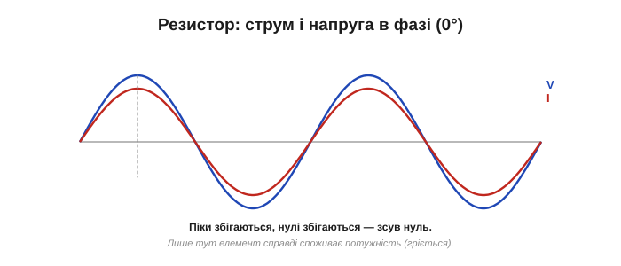
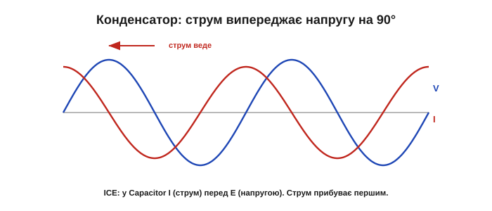
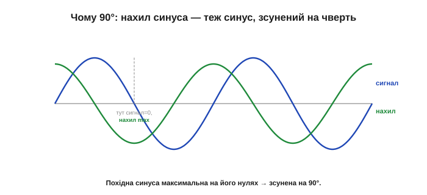
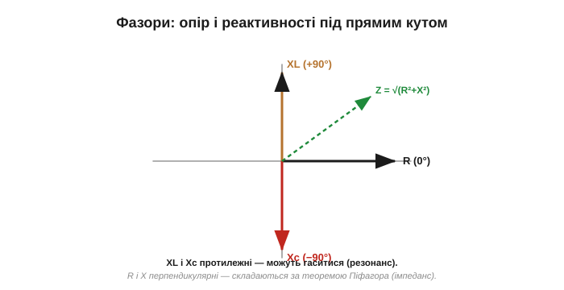

# Зсув фаз: струм і напруга «не в ногу»

Реактивний опір каже, у скільки разів струм менший за напругу (через X). Та реактивні елементи мають ще одну рису, важливішу за саму величину: у них струм і напруга **не збігаються в часі**. Коли напруга на піку, струм може бути нульовим, і навпаки. Цей зсув у часі називають **зсувом фаз** (*phase shift*, φ), і він — не дрібниця: саме через нього реактивність не гріється, саме він робить можливим резонанс, і саме він відрізняє реактивний елемент від резистора глибше за будь-яку формулу.

### У резисторі — в ногу

Найпростіший випадок — резистор, і він править за еталон для порівняння. У резисторі струм щомиті пропорційний напрузі ([закон Ома](topic:electronics/ohms-law)): більша напруга — одразу більший струм. Тож їхні синусоїди йдуть **синхронно**: разом досягають піків, разом перетинають нуль. Кажуть, що струм і напруга **у фазі** (зсув 0°).

*На резисторі струм повторює напругу мить у мить: піки збігаються, нулі збігаються. Зсув фаз — нуль. Це еталон для порівняння з реактивними елементами.*

Чому це важливо? Бо лише там, де струм і напруга **в фазі**, елемент справді **споживає** потужність (механізм цього розкриває добуток миттєвих струму й напруги — про нього окрема розмова). Резистор — у фазі, тож гріється; реактивності — ні. Уже сам зсув фаз без жодних обчислень підказує, дисипативний елемент чи ні.

### У конденсаторі струм випереджає

У конденсатора все інакше. Його струм залежить не від самої напруги, а від **швидкості її зміни** (i = C·dV/dt — це й лежить в основі [реактивного опору](topic:electronics/reactance)). А коли синусоїда напруги змінюється найшвидше? Не на піку (там вона на мить завмирає), а в момент **переходу через нуль** — там нахил найкрутіший. Тож струм конденсатора досягає максимуму саме тоді, коли напруга проходить нуль, — і виходить, що струм **випереджає** напругу на чверть періоду, тобто на 90°.

*Струм конденсатора (червоний) досягає піка тоді, коли напруга (синій) проходить нуль (там вона міняється найшвидше). Тож струм **випереджає** напругу на 90° — «прибуває першим». Англійська підказка: у Capacitor — ICE, тобто I (струм) перед E (напругою).*

Інтуїтивно: щоб напруга на конденсаторі **зросла**, спершу має притекти заряд — тобто струм біжить **попереду**, готуючи напругу, яка лише потім підіймається. Струм тут — як кур'єр, що прибуває раніше за вантаж: спершу рух заряду, а напруга — його наслідок. Тому в конденсаторі струм і веде.

### У котушці струм відстає

У котушки — дзеркально. Її напруга залежить від швидкості зміни **струму** (V = L·di/dt — друга половина того самого [реактивного опору](topic:electronics/reactance)). Тож тут навпаки: напруга на котушці максимальна, коли струм проходить нуль (міняється найшвидше). Виходить, що **напруга випереджає струм** на 90° — або, що те саме, **струм відстає** від напруги на 90°.

*Напруга котушки (синій) досягає піка, коли струм (червоний) проходить нуль. Тож струм **відстає** від напруги на 90° — «приходить пізніше». Англійська підказка: у котушці (inductor, L) — ELI, тобто E (напруга) перед I (струмом).*

Інтуїтивно тут навпаки: щоб у котушці потік струм, спершу до неї треба **прикласти** напругу, яка поборе її [інерцію](topic:electronics/inductance); струм наростає лише згодом, наздоганяючи. Напруга — поштовх, струм — повільна реакція маховика, що розкручується із запізненням. Тому струм і відстає.

### Чому саме 90°, а не якось інакше

Звідки береться рівно чверть періоду? Це пряма властивість синусоїди: її **швидкість зміни** (нахил, похідна) — це теж синусоїда, але зсунута на 90°. Нахил синуса максимальний там, де сам синус нульовий (на переході через нуль), і нульовий там, де синус на піку. А оскільки струм конденсатора — це нахил напруги (а напруга котушки — нахил струму), вони неминуче зсунені рівно на чверть періоду.

*Нахил (швидкість зміни) синусоїди максимальний на її переходах через нуль і нульовий на її піках. Тому «похідна» синуса — теж синус, але зсунений на 90°. Звідси й чверть періоду між струмом і напругою в C та L.*

Корисний образ — циферблат годинника. Якщо напруга «б'є» на 12-й годині, то струм конденсатора б'є на 3-й — на чверть кола раніше за наступний удар напруги (випереджає); а струм котушки — на 9-й, на чверть пізніше (відстає). Резистор же б'є точно разом із напругою, на 12-й. Чверть кола = 90° = чверть періоду; ось чому зсув саме такий, а не довільний. Цей зв'язок — між величиною та її швидкістю зміни — пронизує всю фізику коливань: він стоїть і за маятником (швидкість найбільша в нижній точці, де зміщення нульове), і за змінним струмом. Чверть періоду між «положенням» і «швидкістю» — універсальний підпис гармонічного руху, і реактивні елементи лише втілюють його в електриці.

### Мнемоніка: ELI the ICE man

Щоб не плутати, хто кого випереджає, інженери століттями користуються однією фразою-підказкою: **«ELI the ICE man»** (Елай — крижана людина).

*ELI: у котушці (L) напруга E випереджає струм I (струм відстає). ICE: у конденсаторі (C) струм I випереджає напругу E. Дві трибуквені «слова» — і ви ніколи не сплутаєте, хто веде.*

Розшифровка проста. **ELI**: літера L (котушка) — посередині, а навколо E…I, тобто **E** (напруга) перед **I** (струмом): у котушці напруга веде. **ICE**: літера C (конденсатор) — посередині, навколо I…E, тобто **I** (струм) перед **E** (напругою): у конденсаторі струм веде. Запам'ятали «ELI the ICE man» — і фази C та L назавжди на місці.

Це не педантизм. Переплутавши, хто веде, ви помилитеся зі знаком фази — а в колах зі зворотним зв'язком знак фази вирішує, працює схема чи **свистить** (самозбуджується). Тому цю коротку фразу інженери справді тримають у голові все життя.

### Фазори: реактивності під прямим кутом

Зручний спосіб тримати фази в голові — **[фазорна діаграма](topic:math/phasors)**: кожну величину малюють стрілкою (фазором), а кут між стрілками показує зсув фаз. Чому стрілки? Бо синусоїду зручно уявляти проєкцією точки, що обертається по колу. Фазор — це і є той радіус-стрілка: довжина = амплітуда, кут = фаза. Дві величини «не в ногу» — це дві стрілки під кутом, що обертаються разом; складати їх треба як **вектори**, а не як числа. Опір кладуть уздовж осі (0°), а реактивності — **перпендикулярно** до нього: котушку вгору (+90°), конденсатор униз (−90°).

*Фазорна діаграма: опір R — горизонтально (струм і напруга в фазі), реактивність котушки XL — під +90°, конденсатора Xc — під −90°. Реактивності спрямовані протилежно — тому вони можуть частково чи повністю **гасити** одна одну (звідси й резонанс).*

Ця картинка одразу пояснює дві важливі речі. По-перше, чому реактивності C і L **протилежні**: їхні фазори дивляться в різні боки (вгору й вниз), тож у колі вони частково віднімаються — а коли зрівняються, повністю погасяться (це й буде [резонанс](topic:electronics/lc-resonance)). По-друге, чому опір і реактивність не складаються просто числами: вони **перпендикулярні**, тож сумуються «за теоремою Піфагора» у **повний опір** (імпеданс) Z = √(R² + X²). Точну роботу з імпедансом ми тут не розгортатимемо — досить розуміти, що фази складаються геометрично, а не арифметично.

Звідси й важливий висновок: реальні кола рідко бувають чисто реактивними — у них завжди є й опір. Тоді зсув фаз не рівно 90°, а **десь між 0 і 90°**: що більша частка реактивності проти опору, то ближче до 90°; що більший опір — то ближче до 0°, до резисторної «синхронності». Цей проміжний кут і є фазою імпедансу, а його величину задає відношення X до R. Чистий конденсатор чи котушка — крайній випадок (рівно 90°), резистор — інший крайній (0°), а реальна схема — десь поміж.

Цей кут має й практичний слід. У RC- чи RL-фільтрі на частоті зрізу f_c [реактивність](topic:electronics/capacitive-reactance) дорівнює опору — і зсув фаз там рівно **45°**, посередині між 0° і 90° (через це f_c інколи й звуть «точкою 45°»). А загалом, проходячи крізь фільтр, фаза сигналу плавно «повзе» від 0° далеко за смугою до 90° глибоко в ній. Ця зміна фази буває не менш важливою за зміну амплітуди: зайвий зсув фаз у петлі [зворотного зв'язку](topic:electronics/negative-feedback) — і підсилювач самозбуджується.

### Чому реактивність не гріється

І нарешті — найважливіший наслідок зсуву фаз. [Потужність](topic:physics/electric-power) — це добуток миттєвих струму й напруги (P = V·i). У резисторі вони в фазі, тож добуток завжди додатний — резистор увесь час споживає енергію (гріється). А в чистій реактивності струм і напруга зсунені на 90°: коли одне додатне, інше якраз переходить нуль, тож їхній добуток половину періоду додатний, половину — від'ємний, і **в середньому за період дорівнює нулю**.

*Миттєва потужність P = V·i для реактивного елемента половину часу додатна (елемент бере енергію), половину — від'ємна (віддає назад). Середнє за період — нуль: ідеальна реактивність не споживає активної потужності, лише «гойдає» енергію туди-сюди. Тому вона майже не гріється (реальна — трохи, через втрати в ESR/DCR).*

Точніше, середня потужність дорівнює ½·V₀·I₀·cos(φ), де φ — зсув фаз: для резистора φ = 0 і cos = 1 (уся потужність гріє), для чистої реактивності φ = 90° і cos = 0 (нуль). Цей множник cos(φ) і звуть **коефіцієнтом потужності** — він каже, яка частка «видимої» потужності справді витрачається.

Ось чому конденсатор і котушка можуть «опиратися» струму, лишаючись холодними: половину періоду вони беруть енергію з кола (заряджаючи поле), половину — повертають (поле спадає), у середньому не витрачаючи нічого. Цю «холосту» потужність, що гойдається туди-сюди, не роблячи роботи, звуть **реактивною** (вимірюють у варах, VAR — на відміну від ватів активної). Вона не фікція: реактивний струм справді тече дротами, навантажуючи генератор і лінії та гріючи їх своїм проходженням, хоч і не перетворюється на корисну роботу. Тому її прагнуть звести до мінімуму. Це той самий «реактивний» характер, що його конденсатор тримає в [електричному полі](topic:electronics/capacitor-energy), а котушка — в [магнітному](topic:electronics/inductor-energy), тепер пояснений через фазу: енергія гойдається, бо струм і напруга зсунені в часі.

> 🧮 **Математична вставка:** [P, Q, S, cosφ — трикутник потужностей](topic:electronics/phase-shift/math-power-triangle.md). Активна (W), реактивна (VAR) і повна (VA) потужності складаються в прямокутний трикутник зі зв'язком S² = P² + Q² і cos φ = P/S; звідси й пояснення, чому трансформатори та UPS рейтингують у вольт-амперах, а не у ватах.

> 🔧 **Навіщо це.** Цей зсув фаз — головний клопіт великої енергетики. Мотори й трансформатори індуктивні, тож тягнуть із мережі струм, що **відстає** від напруги; через зсув частина струму гойдається туди-сюди, не роблячи корисної роботи, але гріючи проводи. Міру цього зсуву звуть **коефіцієнтом потужності**. Щоб його виправити, на заводах і підстанціях ставлять батареї конденсаторів: їхній випереджальний струм компенсує відстаючий струм моторів, і фаза вирівнюється. Дзеркальність C і L тут працює буквально — випередження одного гасить відставання іншого. На [осцилографі](topic:electronics/oscilloscope) цей зсув видно прямо очима: дві синусоїди, зсунені вбік.

У цьому зсуві ховається й найкрасивіше, що вміють робити C і L разом. Конденсатор тягне фазу в один бік (струм випереджає), котушка — в інший (струм відстає); поставивши їх разом, можна змусити ці протилежні зсуви **погасити** одне одного. А коли реактивності C і L при цьому ще й зрівняються за величиною, станеться щось особливе — [резонанс](topic:electronics/lc-resonance), де кола раптом стають гостро вибірковими до однієї частоти.

> 🧮 **Математична вставка:** [похідні синуса й косинуса — чому зсув рівно 90°](topic:math/sine-derivative). Геометричний доказ (sin)′ = cos через дотичні, обертова стрілка, що пояснює одразу і 90°, і множник ω у реактивностях, — і чому синусоїда — єдина форма, яку лінійне коло не спотворює.

> ⚙️ **Алгоритмічна вставка:** [фігури Ліссажу — побачити зсув фаз у режимі XY](topic:electronics/phase-shift/proj-lissajous.md). Режим XY перетворює фазу на форму петлі: пряма, еліпс чи коло читаються з одного погляду, sin φ = Y₀/B дає число, а напрям обходу показує, хто кого випереджає.

---
