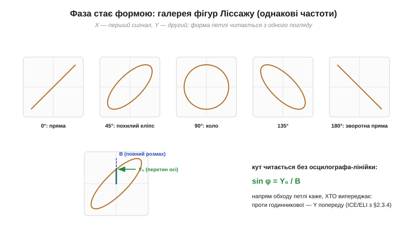
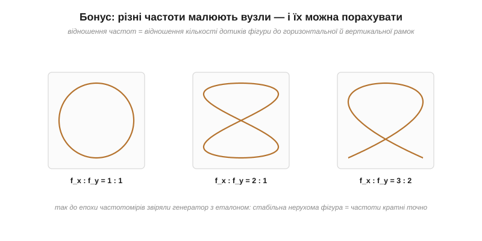

# ⚙️ Фігури Ліссажу: побачити зсув фаз у режимі XY

> Це алгоритмічна вставка про вимірювання [зсуву фаз](topic:electronics/phase-shift). На звичайному екрані осцилографа зсув фаз — це дві синусоїди, зсунуті вбік, і міряти його доводиться лінійкою по осі часу. Є спосіб елегантніший: режим XY перетворює фазу на **форму**. Пряма, еліпс чи коло — і кут видно з одного погляду. Ці криві звуть фігурами Ліссажу (*Lissajous figures*), на честь французького фізика Жуля Антуана Ліссажу, що вивчав їх ще на механічних камертонах.

### Задача

Виміряти зсув фаз φ між двома синусоїдами **однієї частоти** — наприклад, входом і виходом RC-кола або струмом і напругою реактивного елемента. Інструмент: осцилограф у режимі XY (перший сигнал відхиляє промінь по горизонталі, другий — по вертикалі; режим є майже в кожному [осцилографі](topic:electronics/oscilloscope)) — або мікроконтролер із двома каналами АЦП і побудовою точок.

### Ідея

Нехай X = A·sin(ωt), Y = B·sin(ωt + φ). Точка (X, Y) бігає по замкненій кривій, форма якої залежить лише від φ:


*Фаза стає формою: 0° — пряма, 90° — еліпс із осями по координатах (коло за рівних амплітуд), 180° — пряма з протилежним нахилом, проміжні кути — похилі еліпси. Унизу — як зчитати кут числом: sin φ = Y₀/B, де Y₀ — перетин петлі з вертикальною віссю, B — повний розмах по Y.*

Інтуїція проста: при φ = 0 сигнали ходять «в ногу» — точка гойдається по діагоналі; при φ = 90° один сигнал максимальний, коли другий нуль, — точка обходить еліпс; при 180° «в протифазі» — діагональ нахиляється в інший бік.

### Порахувати кут із відліків

На екрані кут читає око, але мікроконтролер має дійти до числа сам — із буфера пар відліків (x, y), знятих **одночасно** за кілька періодів. Уся хитрість — в одній точці: коли X переходить нуль угору, ωt = 0, а отже Y = B·sin(φ). Знаковий Y у цю саму мить, поділений на амплітуду B, одразу дає sin φ разом зі знаком — окремо визначати напрямок обходу вже не треба.

```c
#include <math.h>
#include <stddef.h>
#include <stdint.h>

// Пара одночасних відліків двох каналів АЦП.
typedef struct { int16_t x, y; } Sample;

// Кут між каналами у градусах (додатний — Y веде, від'ємний — Y відстає).
// Повертає NAN, якщо у вікні немає сигналу або висхідного перетину.
float phase_from_lissajous(const Sample *s, size_t n) {
    // 1. Прибрати постійні зміщення — центрувати кожен канал коло нуля.
    int32_t sx = 0, sy = 0;
    for (size_t i = 0; i < n; i++) { sx += s[i].x; sy += s[i].y; }
    const float mx = (float)sx / n, my = (float)sy / n;

    // 2. Амплітуда B — найбільше відхилення Y після центрування.
    float B = 0.0f;
    for (size_t i = 0; i < n; i++) {
        const float y = s[i].y - my;
        if (fabsf(y) > B) B = fabsf(y);
    }
    if (B == 0.0f) return NAN;                     // по Y немає сигналу

    // 3. Перший висхідний перетин нуля по X — і знаковий Y саме там.
    for (size_t i = 1; i < n; i++) {
        const float x0 = s[i - 1].x - mx, x1 = s[i].x - mx;
        if (x0 < 0.0f && x1 >= 0.0f) {             // перехід − → +
            const float t  = x0 / (x0 - x1);       // де саме між відліками X = 0
            const float y0 = (s[i - 1].y - my) + t * (s[i].y - s[i - 1].y);
            float sin_phi = y0 / B;                // = sin φ, уже зі знаком
            if (sin_phi >  1.0f) sin_phi =  1.0f;  // притиснути шум на межі
            if (sin_phi < -1.0f) sin_phi = -1.0f;
            return asinf(sin_phi) * 57.29578f;     // радіани → градуси
        }
    }
    return NAN;                                    // висхідного кросу не було — довше вікно
}
```

Три дрібниці, без яких код збреше. Постійні зміщення каналів прибираємо відніманням середнього — інакше «нуль» X виявиться не там, де треба. Момент перетину майже завжди падає **між** двома відліками, тож Y у ньому беремо лінійною інтерполяцією, а не з найближчого семпла — на грубій дискретизації це кілька градусів різниці. Метод чесний для |φ| ≤ 90° — саме діапазон RC-кіл і реактивних елементів; за цією межею синус уже не розрізняє кут однозначно, і тоді додають другу точку — перетин нуля по Y.

Цей знак — не дрібниця: він каже, **хто кого випереджає**, а на екрані читається як напрямок обходу петлі. Подавши на X напругу, а на Y струм конденсатора, ви побачите обхід в один бік; для котушки — у протилежний. Це [«ELI the ICE man»](topic:electronics/phase-shift), намальований приладом.

**Приклад (живий пошук частоти зрізу).** Подайте синус на RC-коло: X — вхід, Y — вихід. На частотах значно нижчих за зріз петля майже схлопнута в пряму (φ ≈ 0); крутіть частоту вгору — еліпс розкривається. Коли Y₀/B = 0.707, тобто φ = 45°, ви стоїте точно на [частоті зрізу](topic:electronics/capacitive-reactance) f_c = 1/(2πRC) — без жодних обчислень, просто за формою петлі.

### Бонус: звірка частот

Якщо частоти сигналів **не** рівні, але кратні, петля перетворюється на «вузлові» фігури — і відношення частот рахується оком: скільки разів крива торкається горизонтальної рамки проти вертикальної.


*1:1 — еліпс, 2:1 — «вісімка», 3:2 — складніший вузол. Стабільна нерухома фігура означає, що частоти кратні точно; «дихання» фігури — розладження. Так до епохи частотомірів звіряли генератори з еталоном.*

### Пастки

- **Нерівні масштаби каналів.** Різні підсилення X та Y нахиляють еліпс і без фази — перед виміром вирівняйте розмахи (A = B), тоді 90° дає чесне коло.
- **Постійні зміщення.** DC-складові зсувають фігуру з центру — увімкніть закритий вхід (AC) або відніміть середнє в даних.
- **Несинхронні вибірки на МК.** Якщо АЦП читає канали по черзі, лаг між x_i та y_i — це фальшива фаза. Семплити одночасно або компенсувати відомий зсув.
- **Різні шляхи сигналів.** Несхожі щупи чи фільтри в каналах додають власну затримку — на високих частотах вона помітна; перевірте, подавши один сигнал на обидва входи (має бути пряма).
- **Фігура «дихає».** Повільне обертання еліпса означає, що частоти не точно рівні — φ дрейфує зі швидкістю різниці частот. Для звірки генераторів це не вада, а вимірювання.

### Де це працює

Вимірювання кута для [коефіцієнта потужності](topic:electronics/phase-shift), живий пошук частоти зрізу й резонансу (на резонансі фаза проскакує нуль — чутливіший індикатор, ніж максимум амплітуди зі [свіпу](topic:electronics/lc-resonance/proj-resonance-sweep.md)), перевірка фазозсувних кіл і звірка частот. А головне — це найшвидший спосіб *побачити* абстрактний кут φ: одна петля на екрані замінює пару синусоїд і лінійку.
