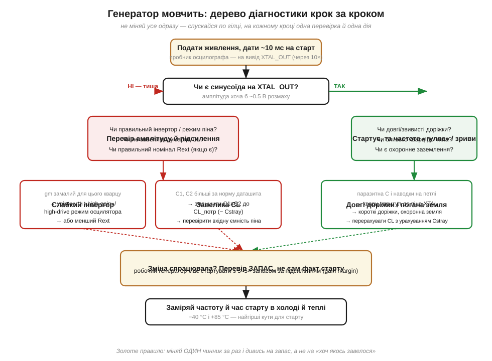
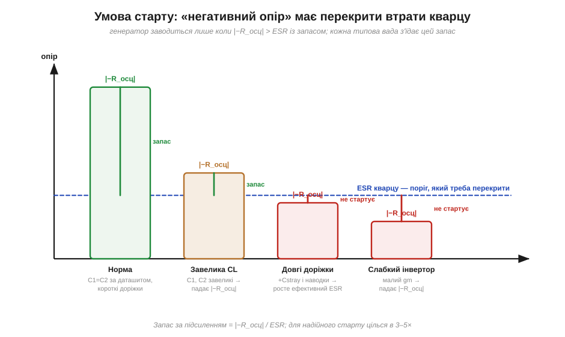

# ⚙️ Чому генератор не стартує: діагностика крок за кроком

> [Генератор П'єрса](book:electronics/pierce-oscillator) (*Pierce oscillator*) зібрано з трьох частин: кварц, інвертор-підсилювач і два конденсатори C1, C2, що задають навантажувальну ємність (*load capacitance*, CL). На папері він заводиться завжди. На живій платі — раз у раз мовчить або стартує мляво й «гуляє» частотою. Тут — **як саме** шукати причину, не міняючи все наосліп.

### Задача

Генератор не подає синусоїди (або вона є, але кволенька й нестабільна). Питання не «що замінити», а «чому петля не самозбуджується». Підступ у тому, що видимих причин три, вони дають схожий симптом, а лікуються по-різному: **завелика CL** (надмірні C1, C2), **довгі доріжки** до кварцу (паразитна ємність і наводки) і **слабкий інвертор** (замале підсилення для саме цього кварцу). Тицяти в них навмання — означає випадково «полагодити» одне, зламавши інше.

### Ідея: одна умова старту, три способи її порушити

Усе зводиться до одного. Інвертор з обв'язкою поводиться для кварцу як **від'ємний опір** (*negative resistance*, −R_осц) — джерело, що накачує енергію. Кварц має власні втрати — еквівалентний послідовний опір (*equivalent series resistance*, ESR) із [моделі Баттерворта–ван Дайка](book:electronics/quartz-rlc-model). Коливання наростають лише тоді, коли накачка перекриває втрати з **запасом**:

```
|−R_осц|  >  ESR × (запас 3…5)     # умова надійного старту
```

Тепер три причини читаються як три способи зменшити ліву частину або роздути праву:

- **завелика CL** → C1, C2 сильніше навантажують інвертор, |−R_осц| падає;
- **довгі доріжки** → додають паразитну ємність Cstray і вносять наводки, ефективний ESR росте;
- **слабкий інвертор** → мала крутизна gm, від'ємного опору бракує від народження.


*Рис. Спускаємося по одній гілці: «тиша» веде до підсилення й CL, «стартує, та гуляє» — до доріжок і землі. Гілки збігаються в одному висновку: перевіряти запас, а не сам факт старту.*

### Псевдокод діагностики

Тож порядок дій випливає з цієї одної умови: спершу подивитися, чи петля взагалі ожила, а тоді за характером симптому йти потрібною гілкою — звужувати CL і піднімати підсилення, якщо тиша, або вкорочувати доріжки, якщо синусоїда є, та частота гуляє.

```
подати живлення;  дати t ≈ 10 мс на старт
виміряти XTAL_OUT осцилографом через пробник 10×   # 1× глушить кварц своєю C

якщо синусоїди НЕМАЄ:
    звузити CL:  C1 = C2 = 2·(CL_потр − Cstray)      # часто це й рятує
    якщо тиша:   увімкнути режим high-gain/high-drive осцилятора
    якщо тиша:   зменшити зовнішній Rext (якщо стоїть)
інакше якщо синусоїда Є, але частота «гуляє» / зриви:
    кварц — упритул до піна; доріжки короткі; додати охоронну землю
    перерахувати CL з урахуванням реального Cstray плати

# головне: міняти ОДИН чинник за раз
перевірити ЗАПАС:  має стартувати з 3…5× за підсиленням
повторити вимір у холоді (−40 °C) і теплі (+85 °C)   # найгірші кути старту
```

Запас зручно оцінити **підстановочним методом** (*drive-level / negative-resistance test*): послідовно з кварцом тимчасово вмикають резистор Rt і нарощують його, доки генерація не зривається. Те граничне Rt додається до ESR — і відношення (ESR + Rt)/ESR показує наявний запас.


*Рис. Стовпчик — наявний |−R_осц|, пунктир — поріг ESR. «Норма» має товстий зелений запас; завелика CL і слабкий інвертор підрізають стовпчик, довгі доріжки піднімають поріг — і генерація зривається.*

### Складність і пастки на МК

Самого алгоритму мало: на живій платі є кілька місць, де легко обманути себе або «полагодити» одне, зламавши інше. Ось ті граблі, на які наступають найчастіше.

- **Не діагностуйте 1×-пробником.** Його 10…15 пФ додаються до вузла й самі гасять кволий генератор — побачите «тишу» там, де насправді все майже працює. Тільки 10× або активний пробник.
- **CL — це не C1.** Інвертор «бачить» C1 і C2 **послідовно**, плюс паразитна ємність піна й доріжок: CL ≈ C1·C2/(C1+C2) + Cstray. Тому формула вище ставить C1 = C2 = 2·(CL_потр − Cstray): забути Cstray (типово кілька пФ) — і частота сяде з [помилкою в десятки ppm](book:electronics/frequency-accuracy-ppm).
- **«Завелося» ≠ «працює».** Генератор може стартувати з нікчемним запасом — і зриватися на морозі, при просіданні живлення чи з часом, коли ESR кварцу підросте від старіння. Запас перевіряють, а не сподіваються на нього.
- **Слабкий інвертор лікують режимом, а не «більшим C».** Спокуса додати ємності, щоб «розгойдати», робить рівно навпаки — топить |−R_осц|. Якщо gm замалий, вмикають high-drive режим генератора в регістрах МК або беруть кварц із меншим ESR.
- **Старт іще пливе.** На самому старті частота й амплітуда ще «пливуть»; програмному коду не варто чіпати залежні від такту дільники (UART, таймери), доки прапор стабільності генератора не підніметься.

> 🔧 **Навіщо це.** Кварцовий генератор — [серцебиття всієї системи](book:electronics/reference-frequency): не завівся він — не завелося нічого, причому збій «плаваючий» і ловиться найгірше. Тримайте в голові одну умову — |−R_осц| мусить перекрити ESR із запасом 3–5× — і три способи її зламати: завелика CL, довгі доріжки, кволий інвертор. Тоді замість того, щоб навмання перепаювати конденсатори, ви за кілька хвилин звузите коло до однієї причини й полагодите її свідомо.
