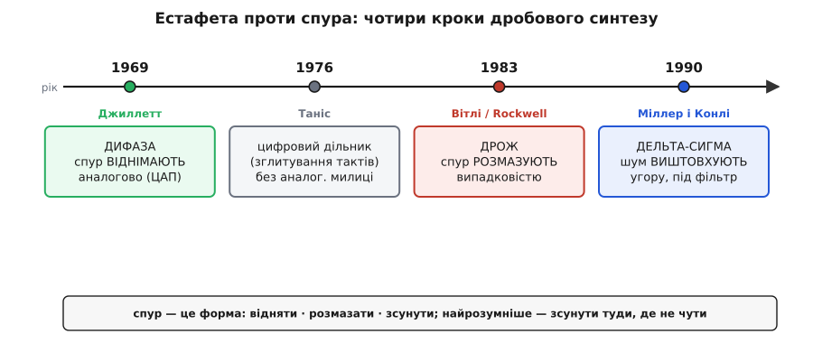

# 📜 Від «Дифази» до дельта-сигми: як вчилися ділити на неціле

Спершу здається, що дробове ділення частоти — це просто арифметична хитрість: «не вмію на 92.77, то чергуватиму 92 і 93». Хитрість і справді проста, та між першою думкою про неї і чистим синтезатором у вашій кишені лежать двадцять із гаком років упертої боротьби з однією-єдиною прикрістю — **спуром**. Бо щойно ви почали чергувати дільники, фаза на вході детектора пішла зубцями пилки, а пилка — це гострий побічний пік у спектрі. Уся історія fractional-N — це історія того, як інженери раз за разом вигадували, куди подіти цей пік: спершу його **віднімали наживо** аналоговою схемою, потім **розмазували** випадковістю, і нарешті навчилися **виштовхувати** його туди, де він нікому не заважає. Три способи — три епохи, три покоління залізяк. Розберімо їх по черзі, з іменами, датами й патентами, і відокремимо те, що було лиш **ідеєю**, від того, що стало **робочою схемою**, а потім — **цифровим стандартом**.

Одразу домовмося про слово, бо воно тут ключове. **Спур** *(англ. spur, від spurious — «несправжній, побічний»)* — це вузька стороння лінія в спектрі генератора, що стоїть близько до корисної частоти й не є ні гармонікою, ні шумом. Дробовий синтез **сам породжує** спури — це його родова вада, а не зовнішня завада. І саме навколо неї крутиться вся розповідь.

## Чому неціле ділення взагалі стало потрібне

Перш ніж говорити, хто перший, варто відчути, **чому за це бралися**. Бо інженери не вигадують складнощів від нудьги — їх жене конкретна стіна.

Стіна така. Простий синтезатор на петлі автопідстроювання множить опорний кварц на ціле число N, і сусідні досяжні частоти різняться рівно на одну опору. Хочеш сітку каналів із дрібним кроком — мусиш зробити опору такою ж дрібною, як крок. А **мала опора руйнує петлю**: фазовий детектор порівнює фази лише в моменти опорних імпульсів, рідші імпульси означають вужчу смугу фільтра, а вузька смуга — це повільний захват і кепське пригнічення власного шуму генератора. У радіоприймачі 1960-х це був не теоретичний клопіт, а щоденний біль: військові й професійні зв'язкові приймачі мусили перекривати мегагерци діапазону з кроком у сотні герців, лишаючись при цьому стабільними й чистими. Жоден цілий синтезатор так не вмів. Хтось мусив придумати, як дістати **дробове** множення, не опускаючи опору.

> 🔧 **Навіщо це.** Уся ця історія — не музейна цікавинка, а пояснення, **чому регістри сучасного радіочипа влаштовані саме так**. Коли ви вписуєте в синтезатор Bluetooth ціле N, чисельник, знаменник і **порядок дельта-сигма-модулятора**, ви натискаєте на важелі, які по черзі винайшли Джиллетт, Таніс, Вітлі та Міллер із Конлі. Розуміючи, від якої біди кожен із цих важелів рятує, ви налаштовуєте синтезатор свідомо, а не тицяєте числа навмання з апноти.

## Дифаза: ідея відняти помилку наживо (Джиллетт, 1969)

Перший задокументований публічний крок зробив американський інженер **Гаррі (Гаррі Сі.) Джиллетт** *(англ. Garry C. Gillette)*. У 1969 році на **23-му щорічному Симпозіумі з керування частотою** *(23rd Annual Frequency Control Symposium)* — конференції, яку традиційно проводили у Форт-Монмуті (штат Нью-Джерсі) під егідою армійських зв'язкових лабораторій — він представив доповідь із назвою, що сама стала ім'ям технології: **«The Digiphase Synthesizer»**, сторінки 25–29 збірника праць.

> 📌 Бібліографія звірена за кількома незалежними оглядами синтезу частоти: G. C. Gillette, «The Digiphase Synthesizer», Proc. 23rd Annual Frequency Control Symposium, 1969, pp. 25–29 (Fort Monmouth, NJ). Ім'я подають як Garry C. Gillette. Статус: **усталений факт**.

Слово «дифаза» *(Digiphase — стяг від digital + phase, «цифрова фаза»)* добре передає суть задуму. Ідея Джиллетта спиралася на спостереження, яке ми вже знаємо з основної теми: коли дільник чергує N і N+1, помилка фази на вході детектора не хаотична, а **строго передбачувана** — вона повзе вгору рівним нахилом, поки акумулятор накопичує дріб, і стрибком скидається при переповненні. Пилка. А якщо помилка передбачувана, міркував Джиллетт, то її **можна обчислити наперед і відняти**.

Ось у чому полягав хід. Той самий цифровий акумулятор, що вирішує, коли вставити зайвий період дільника, **знає величину накопиченої фази в кожен момент** — це ж буквально його вміст. Тож візьмемо цей цифровий код фази, проженемо його через цифро-аналоговий перетворювач і дістанемо **аналогову напругу, що точно повторює пилку помилки**. Тепер подамо цю напругу на вхід петлі з протилежним знаком — і вона **скомпенсує** ту саму пилку, яку породжує дільник. Помилка, що мала б вилізти спуром, гаситься ще до того, як петля її побачить. Залишковий спур падає на десятки децибел.

```
                цифровий код фази (вміст акумулятора)
                              │
                              ▼
        дільник N/N+1 ──► пилка помилки ──►(+)
                                            │  ← петля бачить майже нуль
            ЦАП ──► аналогова копія пилки ──►(−)
```

Це і є **аналогове скасування накопиченої фази** — серце дифази. Зверніть увагу на красу й на слабкість задуму водночас. Краса: спур не маскують, а **фізично віднімають** — у принципі його можна вибити в нуль. Слабкість: усе тримається на тому, що аналогова копія пилки **ідеально** збігається з цифровою помилкою. А вона ніколи не збігається ідеально — ЦАП має свою нелінійність, підсилювачі дрейфують від температури, форма пилки трохи «гуляє». Наскільки точно вдалося звести аналогову копію з цифровим оригіналом — настільки глибоко й провалився спур, ні на децибел більше. Дифаза перетворила задачу «прибрати спур» на задачу «точно підігнати аналогову схему під цифрову модель фази» — а це робота тонка, дорога й примхлива.

Тут важливо чесно розставити пріоритети, бо в історії техніки це постійна пастка. Джиллетт **не вигадав саму думку** про усереднення дільника — ідея «ділити то на N, то на N+1, щоб у середньому вийшов дріб» носилася в повітрі й проглядає в ранніх синтезаторних патентах ще початку 1960-х. Внесок Джиллетта конкретніший і вагоміший: він **публічно показав робочу архітектуру**, у якій накопичену фазу скасовують аналогово, і дав їй ім'я, під яким її підхопили. Тобто це крок від «можна було б усереднити» до «ось схема, що це робить і дає чистий вихід».

> 📌 Розрізнення «ідея усереднення дільника (носилася раніше, в патентах поч. 1960-х) ↔ конкретна архітектура з аналоговим скасуванням фази (Джиллетт, 1969)» узгоджене з оглядовою літературою з fractional-N. Статус: **усталено** щодо авторства архітектури Digiphase; «ідея усереднення» як така — **дифузна, без єдиного автора**.

## Racal: як дифаза стала залізом, що продавалося

Доповідь на симпозіумі — це ще не прилад на полиці. Дифазу довела до серії британська фірма **Racal** — один із провідних світових виробників професійних зв'язкових приймачів того часу. Саме Racal закріпила за схемою з аналоговим скасуванням накопиченої фази торгову назву **Digiphase** і поставила її в свої приймачі.

> 📌 Те, що Racal комерціалізувала дифазу й використовувала назву Digiphase у своїх зв'язкових приймачах, повторюють кілька незалежних оглядів історії синтезу. Канонічний приклад залізяки епохи — приймач **Racal RA1792** (синтезатор для нього проєктував інженер Найджел Кінг, англ. Nigel King) та споріднені моделі серії RA6790. Статус: **усталено** щодо ролі Racal і назви; точну прив'язку конкретної моделі до конкретного року варто вважати **ілюстрацією, а не реперною датою**.

Чому це важлива віха, а не просто «фірма випустила товар»? Бо тут уперше дробовий синтез **окупив свою складність на реальному ринку**. Зв'язковому приймачеві дифаза дала те, чого цілий синтезатор дати не міг: суцільне перекриття діапазону з дрібним кроком при високій опорі, тобто швидке й тихе перестроювання по сітці. Поки фахівці сперечалися, чи варта овчинка вичинки, Racal продавала прилади, у яких вона була варта. Це переломило ставлення: дробовий синтез перестав бути екзотикою з конференції і став інженерним інструментом, за який платять гроші.

Тут варто згадати й **Hewlett-Packard** — другу фірму, що незалежно й активно розробляла дробовий синтез у 1970-х. До кінця десятиліття HP випустила прилади, у яких фракційно-N-петля стала серцем, — зокрема синтезований генератор-функціональник **HP 3325A** (1979). Підхід HP теж спирався на аналогову компенсацію («аналогова інтерполяція фази», analog phase interpolation): той самий принцип, що в дифазі, — обчислити форму помилки й відняти її аналогово.

> 📌 HP як один із ранніх розробників дробового синтезу та поява fractional-N-петлі в приладах HP кінця 1970-х (зокрема HP 3325A, 1979) узгоджені з архівними матеріалами HP та оглядами. Статус: **усталено**. Назву «fractional-N» закріпили саме в цей період як загальніший термін, що поступово витіснив фірмову «Digiphase».

Зверніть увагу на ще одну річ, яку легко проґавити: **назва технології змінилася разом із її носієм**. Поки схема була фірмовим товаром Racal, її звали Digiphase. Коли нею почали користуватися всі, прижилася описова, нічия назва — **fractional-N**, «дробове N». Це типова доля вдалих винаходів: власне ім'я тоне, лишається загальне.

## Таніс: дроблення без аналогового милиці (патент 1976)

Паралельно визрівав інший підхід — спроба зробити дробове ділення **геть без** аналогового скасування, самою лише цифровою логікою дільника. Її закріпив патент американського інженера **Вільяма Дж. Таніса** *(англ. William J. Tanis)*.

> 📌 Патент США **3 959 737**, «Frequency synthesizer having fractional frequency divider in phase-locked loop», винахідник William J. Tanis, правонаступник Engelmann Microwave Co. **Подано 18 листопада 1974, видано 25 травня 1976.** (У стислих згадках його часто датують «1976» — це рік **видачі**; саму заявку подано 1974-го.) Статус: **усталений факт** (звірено за текстом патенту).

Що в ньому по суті. Таніс описав дробовий дільник на принципі **зглитування імпульсів** *(pulse swallowing / clock inhibition — «проковтування» тактових імпульсів)*. Замість того щоб перемикати лічильник між двома цілими коефіцієнтами, схема **викидає** окремі тактові імпульси з вхідного потоку за керованим розкладом: проковтнули імпульс — лічильник дорахував до тієї самої межі на один такт пізніше, тобто **видовжив** період. У середньому це підіймає ефективний коефіцієнт ділення на потрібний дріб. Цитуючи сам патент: вхідний потік тактів до дільника «періодично переривається вилученням, або забороною, тактового імпульсу».

Чому це окрема віха, а не варіація на тему дифази? Бо **філософія протилежна**. Дифаза каже: «нехай дільник породжує брудну пилку, а ми її акуратно віднімемо аналогово». Таніс каже: «організуймо саме ділення так, щоб милиця не знадобилася взагалі». Це поворот до **суто цифрового** дробового дільника як самодостатнього вузла. Він іще не розв'язує проблему спурів радикально — періодичність зглитувань так само дає побічні лінії, — але він закладає важливу думку: керування дробом має жити **всередині цифрової логіки дільника**, а не в зовнішній аналоговій підпорці. Саме цією дорогою через півтора десятиліття прийде дельта-сигма.

Дрібний, але показовий штрих про ідентичність і власника. Патент належить не гучному імені на кшталт HP чи Rockwell, а компанії **Engelmann Microwave** (згодом права перейшли до KDI Electronics) — невеликій спеціалізованій фірмі. Це нагадування, що рушієм техніки часто були не лише гіганти: вузькопрофільні мікрохвильові контори вносили в синтез частоти свої цеглини нарівні з великими.

## Вітлі й Rockwell: дрож проти спурів (патент 1983)

Наступний концептуальний стрибок — відмова від мрії **прибрати** спур і перехід до думки його **сховати**. Її втілив патент американського інженера **Чарльза Е. Вітлі III** *(англ. Charles E. Wheatley III)* з корпорації **Rockwell International**.

> 📌 Патент США **4 410 954**, «Digital frequency synthesizer with random jittering for reducing discrete spectral spurs», винахідник Charles E. Wheatley III, правонаступник Rockwell International Corp. **Подано 8 жовтня 1980, видано 18 жовтня 1983.** Статус: **усталений факт** (звірено за текстом патенту).

Хід думки Вітлі лягає в одну фразу: **гострий пік страшніший за тихий шум, тож обміняймо одне на інше**. Спур гострий саме тому, що пилка помилки **строго періодична** — переповнення акумулятора йдуть як по годиннику, а все строго періодичне збирається в спектрі у вузьку лінію. А якщо підмішати в керування дільником трохи **випадковості** — щоб переповнення траплялися не за залізним розкладом, а ледь урозбрід, — періодичність ламається. Енергія, що збиралася в гострий пік, **розсипається** у широкий пологий шумовий фон. Лінію видно здалеку; рівний фон — майже ні. Цей підмішаний шум і звуть **дрожем** *(англ. dither — «тремтіння»)*.

Ключове, що підкреслює сам патент: усе робиться **суто цифрово**, без жодних аналогових перетворювачів і таблиць. У потік приростів фази акумулятора в певні такти вкидають випадкові поправки — і дискретні спектральні лінії перетворюються на суцільну шумову підлогу, тоді як **середня** вихідна частота лишається точно тією, що треба. Жодного ЦАП, жодної аналогової копії пилки, жодної підгінки під температуру.

Тут і ховається історичний сенс цього патенту. Дифаза боролася зі спуром **аналогово** — і платила за це примхливою точною схемою. Вітлі показав, що зі спуром можна боротися **інформаційно, всередині цифри**: не віднімати помилку, а зробити її непомітною, перемішавши. Платня теж є, і чесна: дрож **підіймає загальний шумовий фон**. Ви проміняли один гострий пік на трохи вищий рівний шум скрізь. Для багатьох застосувань це чудова угода; але вона ще не ідеальна, бо шум підіймається **рівномірно**, зокрема й там, де він найшкідливіший, — упритул до несучої. Останній крок історії — навчитися підіймати шум **вибірково**, не там, де боляче.

> 🔧 **Навіщо це.** Дрож нікуди не подівся з сучасних синтезаторів — він живе поруч із дельта-сигмою. Коли дробова частина випадає на «погане» значення (близьке до 0 або 1/2, де переповнення майже періодичні й спури найгидкіші), у синтезатор досі підмішують трохи дрожу, щоб розбити цю періодичність. Розуміючи ідею Вітлі, ви знаєте, **навіщо** в даташиті є біт «dither enable» і чому його іноді варто ввімкнути ціною дрібного підняття фону.

## Міллер і Конлі: позичити розум у дельта-сигми (1990)

І ось остання, вирішальна ідея, що зробила дробовий синтез таким, яким він живе у вашій кишені. Її подали інженери **Браян Міллер** *(англ. Brian Miller)* та **Роберт Дж. Конлі** *(англ. Robert J. Conley)* у доповіді **«A Multiple Modulator Fractional Divider»** на Симпозіумі з керування частотою 1990 року.

> 📌 B. Miller, R. J. Conley, «A Multiple Modulator Fractional Divider», Proc. 44th Annual IEEE Frequency Control Symposium, 1990, pp. 559–568; розширена версія — IEEE Transactions on Instrumentation and Measurement, vol. 40, no. 3, June 1991, pp. 578–583. Робота лягла в основу патенту США **5 038 117** («Multiple-modulator fractional-N divider»). Статус: **усталений факт** (звірено за кількома незалежними посиланнями).

Геній цієї праці — не в новій схемі дільника, а в **запозиченні готового математичного апарату з геть іншої галузі**. На той час уже років десять буяла техніка передискретизаційних аналого-цифрових перетворювачів — **дельта-сигма** *(англ. delta-sigma, ΔΣ — «різниця-сума»)*. Її серцевина — **формування шуму** *(noise shaping)*: модулятор так влаштовує свою грубу (одно- чи кількабітну) послідовність, що неминучу похибку квантування він **виштовхує зі смуги корисного сигналу в область високих частот**, де її легко відфільтрувати. Міллер і Конлі побачили, що **керування дробовим дільником — це задача того самого роду**.

Логіка переносу гарна до прозорості. Дробовий дільник на кожному кроці мусить вибрати ціле значення (N або N+1, а в багатомодульній схемі — кілька сусідніх цілих), тоді як «правильне» значення дробове. Різниця між обраним цілим і бажаним дробом — це **похибка квантування**, точнісінько як у АЦП, коли він округлює неперервний відлік до сходинки. А раз так — нехай цією похибкою керує **дельта-сигма-модулятор**, який уміє цю похибку **формувати**: тримати її майже нульовою на низьких відступах від несучої й задирати на високих. Близько до несучої, де фільтр петлі безсилий, спурів і шуму стає дуже мало; вся «бруднота» переїжджає вгору, під ніж фільтра.

Порівняймо три способи в одному погляді — так видно, що кожен наступний не скасовує попередній, а **точніше прицілюється**:

```
дифаза (Джиллетт):  спур ВІДНІМАЮТЬ аналогово  → ідеально в теорії, примхливо на ділі
дрож (Вітлі):        спур РОЗМАЗУЮТЬ випадково   → фон росте РІВНОМІРНО, зокрема й коло несучої
дельта-сигма (М.&К.): шум ВИШТОВХУЮТЬ угору      → коло несучої тихо, бруд — туди, де фільтр його зрізає
```


*Естафета проти спура. Джиллетт почав із аналогового віднімання помилки (дифаза); Таніс переніс дроблення в чисту цифру; Вітлі замінив віднімання на розмазування дрожем; Міллер і Конлі навчилися виштовхувати шум угору дельта-сигмою — і дістали дробову петлю геть без спурів. Кожен крок не скасовує попередній, а точніше прицілюється в ту саму ціль.*

Слово «multiple modulator» («кілька модуляторів») у назві — теж не випадкове. Один каскад дельта-сигми формує шум помірно; **каскад із кількох ланок** (вищий порядок модулятора) задавлює шум коло несучої набагато сильніше, ціною крутішого його підйому вгорі. Саме звідси в сучасних чипах беруться «порядок 2-й / 3-й» — це і є кількість тих ланок. А чи не найважливіший практичний підсумок праці Міллера й Конлі: вони побудували повний дробовий синтезатор лише з цифрового дільника, дводільникового переддільника, **простого** фільтра петлі й генератора — і показали, що він **не має дробових спурів узагалі**. Не «має менше», а **не має** в звичному розумінні — там, де раніше стирчали гострі лінії, тепер рівна тиша, а весь шум акуратно зсунутий туди, де його не чути.

Це й був перелом. Дельта-сигма зробила головну перевагу дробового синтезу — чистоту коло несучої — **властивістю цифрового вузла**, який можна повторити мільйонними тиражами в кремнії без жодної аналогової підгінки. Відпала примхлива дифазна милиця; відпала потреба миритися з рівномірно піднятим фоном від дрожу. Лишилася маленька цифрова коробочка, що сама собі формує шум так, як вигідно.

> 🔧 **Навіщо це.** Коли ви в сучасному синтезаторі вмикаєте дельта-сигма-модулятор і вибираєте його порядок, ви натискаєте саме на важіль Міллера й Конлі. Вищий порядок — тихіше коло несучої, але крутіший шум угорі, тож трохи ширша смуга фільтра, щоб устигнути той шум зрізати. Це жива настройка радіоінженера; її логіка цілком виросла з ідеї 1990 року — позичити в дельта-сигма-АЦП уміння виштовхувати шум туди, де він безпечний.

## Чесна тонкість: лінійність вирішує, чи спрацює формування

Варто назвати й межу, об яку дельта-сигма спотикається, — бо без неї картина була б святковою напівправдою. Уся вигода формування шуму тримається на мовчазному припущенні, що **петля лінійна**: тоді шум, виштовхнутий угору, там і лишається, і фільтр його чесно зрізає. Та якщо десь у петлі є **нелінійність** (наприклад, зарядний насос детектора реагує не цілком однаково на різні значення фазової помилки), вона **змішує** високочастотний шум назад униз — і ретельно прибрані спури частково повертаються до несучої. Тому в дробових синтезаторах із дельта-сигмою особливо дбають про лінійність фазочастотного детектора й зарядного насоса: саме там формований шум легко «складається» назад. Це не вада ідеї Міллера й Конлі, а **умова**, за якої вона працює, — і знати її так само важливо, як саму ідею.

## Що з цього винести

Дробовий синтез народжувався не як одне осяяння, а як **естафета способів подолати спур**, де кожен наступний крок точніше прицілювався в ту саму ціль.

**Думку усереднити дільник** (ділити то на N, то на N+1) ніхто не запатентував як «свою» — вона визрівала в синтезаторних патентах ще початку 1960-х. Першу **робочу архітектуру** з конкретним рецептом проти спурів дав 1969 року **Гаррі Джиллетт**: його **дифаза** (Digiphase) брала цифровий код накопиченої фази, робила з нього аналогову копію пилки помилки й **віднімала** її наживо. Британська **Racal** довела дифазу до серійних зв'язкових приймачів і закріпила за нею назву; **Hewlett-Packard** незалежно йшла тим самим аналоговим шляхом і до кінця 1970-х поставила fractional-N у свої прилади (HP 3325A, 1979). Слабкість усієї цієї епохи — аналогова компенсація примхлива: спур провалюється рівно настільки, наскільки точно аналогова копія збіглася з цифровою помилкою.

**Вільям Таніс** (патент подано 1974, видано 1976) штовхнув розвиток у бік **суто цифрового** дробового дільника на зглитуванні тактів — без аналогової милиці, хоч іще й без радикального розв'язання спурів. **Чарльз Вітлі** з **Rockwell** (патент 1980/1983) змінив саму стратегію: не віднімати спур, а **сховати** його, підмішавши **дрож** — випадковість, що ламає періодичність пилки й розмазує гострий пік у шумовий фон, теж суто цифрово; ціна — рівномірно піднятий фон.

І нарешті **Браян Міллер та Роберт Конлі** (1990) позичили з передискретизаційних дельта-сигма-АЦП **формування шуму** й приклали його до керування дільником: похибку «округлення дробу до цілого» модулятор **виштовхує** з-під несучої вгору, під ніж фільтра петлі, а каскад із кількох ланок робить це тим різкіше, чим вищий порядок. Їхній синтезатор уперше показав дробову петлю **геть без спурів** — і зробив чистоту дробового синтезу властивістю крихітного цифрового вузла, який тиражується в кремнії без аналогової підгінки. Працює це доти, доки петля лишається **лінійною**: нелінійність змішує виштовхнутий шум назад до несучої.

Так із конференційної доповіді 1969 року й кількох патентів виросло те, що сьогодні мовчки тикає в кожному Wi-Fi- і Bluetooth-чипі: маленький дельта-сигма-модулятор, що накопичує дробову фазу й формує власну похибку так, аби найближче до несучої панувала тиша. Уся історія fractional-N зводиться до однієї настирливої думки, продуманої до кінця: **спур — це форма, а форму можна або відняти, або розмазати, або зсунути; найрозумніше — зсунути туди, де її однаково не чути.**
