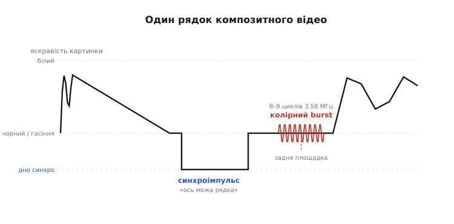
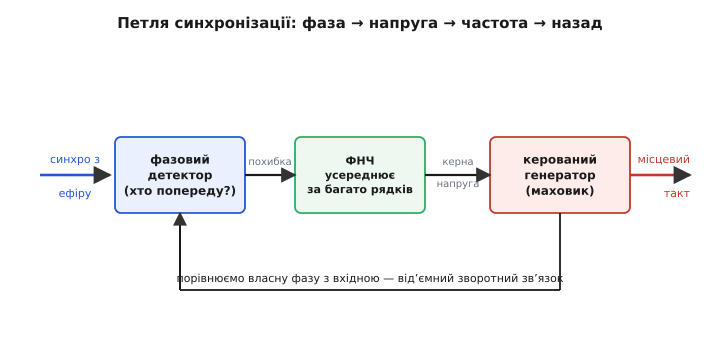
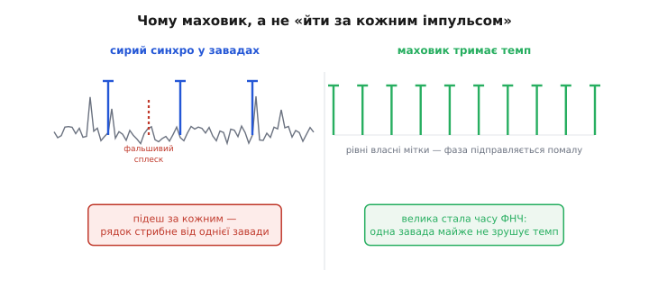
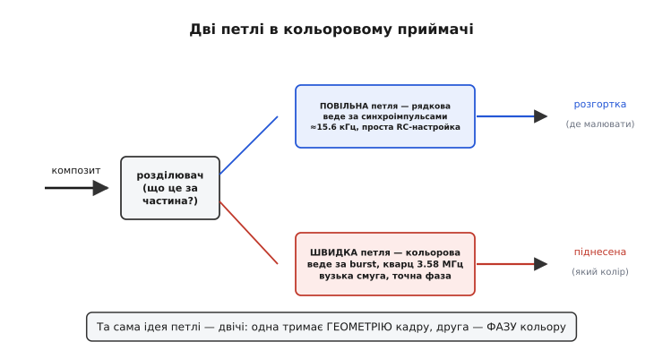

# PLL-синхронізація приймача у аналоговому відео: як телевізор вгадує, де початок рядка, коли сигнал тоне в завадах

Уявіть, що вам диктують довжелезний текст по телефону з тріском на лінії. Диктувальник час від часу каже «новий рядок» — і ви маєте з цього слова зрозуміти, де закінчити писати й перенести руку ліворуч-униз. А тепер уявіть, що кожне десяте «новий рядок» загубилося в шумі, ще кілька разів тріск сам пролунав схоже на цю команду, і пишете ви не олівцем, а малюєте картину — п'ятнадцять тисяч рядків щосекунди, де зсув бодай одного на півміліметра видно оком як розірваний кадр. Якби ви слухняно реагували на кожне почуте «новий рядок» і тільки на нього, картина розсипалася б від першої ж завади. Виходить, слухати команди буквально не можна. Треба робити щось розумніше: тримати в голові **власний рівний ритм** рядків і лише **підправляти** його за командами, не кидаючись за кожною.

Саме це й робить аналоговий телевізор. Передавач укладає в сигнал короткі мітки — **синхроімпульси** (гр. *syn-* + *chronos* — «разом у часі»), які кажуть «ось межа рядка», «ось межа кадру». Але приймач не йде за ними наосліп. Усередині нього крутиться власний генератор, налаштований приблизно на потрібну частоту, а спеціальна петля зворотного зв'язку **порівнює фазу** цього власного ритму з міткою з ефіру й помалу підкручує генератор так, щоб ритми збіглися. Коли мітка губиться в завадах — петля цього майже не помічає й веде розгортку далі за інерцією. Цей принцип — місцевий генератор, що тримає темп і лише підстроюється під рідкі точні підказки — і є фазове автопідстроювання, а в телевізійному фольклорі його влучно прозвали **маховиком**: важке колесо, яке крутиться рівно й не сіпається від кожного поштовху.

> 🔧 **Навіщо це.** Без маховика жоден приймач слабкого сигналу не працював би. Антена на горищі ловить ефір разом із тріском від холодильника, іскрами щіток дриля, відбиттями від сусідніх будинків — і «чисті» синхроімпульси приходять не всі. Якби розгортка кидалася за кожним фронтом, картинка рвалася б, кольори пливли б, рядки скакали. Та сама ідея живе далеко за межами старих телевізорів: будь-який приймач, що має відновити такт із зашумленого потоку — від зчитувача штрихкодів до гігабітного послідовного інтерфейсу, — будує всередині таку саму петлю, бо це єдиний спосіб не загубити ритм, коли окремі мітки тонуть у шумі. Хто розуміє, чому телевізор не йде за кожним імпульсом, той розуміє і як цифровий приймач «зачиняє око» діаграми.

## Що приймач має зловити: анатомія одного рядка

Перш ніж синхронізувати, треба знати, з чим маємо справу. Аналогове відео — це **один-єдиний дріт** (тому *композитне*, лат. *compositus* — складене докупи), де в одному коливанні напруги впаковано і яскравість картинки, і команди «де межа», і — у кольоровому варіанті — сам колір. Розкласти цю мішанину на складники, перш ніж її синхронізувати, докладно розбирає стаття про [композитний відеосигнал](topic:electronics/composite-video); тут нам досить однієї його частини — службової мітки на краю кожного рядка.

Подивімося на один рядок зблизька. Промінь біжить зліва направо, малюючи смужку зображення, тоді має згаснути й стрибнути назад ліворуч, щоб почати наступну. Передавач позначає цей момент так:


*Один рядок композитного відео зліва направо. Над рівнем гасіння — яскравість картинки; нижче — синхроімпульс, що пірнає під рівень чорного й каже «ось межа рядка». Одразу за ним, на задній площадці, сидить короткий пакет коливань — колірний burst, опорна фаза для кольору. Саме за синхроімпульсом ведеться рядкова петля, за burst — кольорова.*

Найважливіше тут — **синхроімпульс пірнає нижче за рівень чорного**. Це зроблено навмисно й хитро: яскравість картинки гуляє між «чорним» і «білим», але ніколи не опускається під рівень чорного. А синхро опускається. Отже, є проста межа за напругою: усе, що темніше за чорне, — це вже не зображення, а команда. Схема, яка відрізає цю нижню частину, зветься **відокремлювачем синхро** (англ. *sync separator*) і робить її звичайний компаратор: поставив поріг трохи нижче рівня чорного — і на виході маємо чисті прямокутні мітки, очищені від усієї яскравості. Як працює таке порівняння з порогом, докладно показує стаття про [компаратор](topic:electronics/comparator); нам зараз досить того, що після нього лишається рядок прямокутних імпульсів — по одному на кожен рядок зображення.

От тільки ці імпульси, відрізані від реального ефіру, **брудні**. Завада могла з'їсти вершину одного, фальшивий сплеск від іскри міг прикинутися зайвим імпульсом, край міг розмитися. Якби ми просто рахували ці імпульси як межі рядків, кожна завада зсувала б картинку. Тому між відокремлювачем і розгорткою стоїть петля.

## Серце: петля фази, що сама себе тримає

Петля складається з трьох частин, з'єднаних у кільце, і зрозуміти її найлегше, якщо йти за сигналом по колу.


*Кільце фазового автопідстроювання. Фазовий детектор питає «хто попереду — мітка з ефіру чи мій власний такт?» і видає похибку. Фільтр низьких частот усереднює її за багато рядків. Керована напругою частота генератора (маховик) підправляється так, щоб похибка зникла. Вихід генератора повертається у детектор — від'ємний зворотний зв'язок замикає кільце.*

**Перша частина — фазовий детектор.** Він має два входи: мітку з ефіру й такт від власного генератора. Його єдине питання — «хто з вас попереду?». Якщо власний такт відстає, детектор видає напругу одного знаку; якщо випереджає — протилежного; якщо йдуть нога в ногу — нуль. Це не «скільки імпульсів», а саме **різниця фаз** — наскільки зсунуті в часі два ритми.

**Друга частина — фільтр низьких частот** (ФНЧ). Ось де ховається весь маховик. Похибку від детектора не пускають прямо на генератор — її спершу **усереднюють за багато рядків**. Сенс простий: одна завада зсуне фазу одного імпульсу, детектор смикнеться — але після усереднення цей поодинокий смик майже не дійде до генератора, бо потоне серед сотень нормальних вимірів. А от справжній, повільний відхід частоти (передавач трохи поплив, чи приймач нагрівся) триматиметься багато рядків поспіль і крізь фільтр **пройде**. Фільтр відрізає швидке безладне тремтіння й пропускає повільний осмислений тренд. Як такий вузол будується на резисторі з конденсатором чи на підсилювачі, показує стаття про [інтегратор](topic:electronics/integrator-differentiator); тут важлива не схема, а наслідок: чим сильніше усереднення, тим спокійніший маховик — і тим повільніше він наздоганяє реальні зміни.

**Третя частина — керований генератор** (англ. *VCO*, voltage-controlled oscillator). Це власне колесо-маховик: генератор, чию частоту можна трохи підкрутити поданою напругою. Усереднена похибка з фільтра — і є та напруга. Відстаєш — фільтр підвищує напругу — генератор пришвидшується — наздоганяє. Випереджаєш — навпаки. Вихід генератора повертається у фазовий детектор, замикаючи кільце, і **знак підібрано так, щоб похибка гасила сама себе**: це від'ємний зворотний зв'язок, той самий принцип, що тримає в рівновазі будь-яку стежну систему.

Коли кільце збіглося — кажуть, що петля **захопила** (англ. *lock*) сигнал: власний такт іде точно у фазі з ефіром, похибка коло нуля, і петля лише дрібно її підправляє. Уся внутрішня механіка захоплення — наскільки далеко петля здатна піймати частоту, що таке смуга захоплення й утримання, як вона поводиться в перехідних режимах — це загальна властивість будь-якого фазового автопідстроювання, і її окремо розбирає стаття про [фазове автопідстроювання частоти (PLL)](topic:electronics/phase-locked-loop). Нам тут вистачить інтуїції кільця: зміряв різницю фаз → усереднив → підкрутив частоту → замкнув. А далі — головне питання саме для відео: **навіщо взагалі городити петлю, коли є готові мітки?**

## Чому маховик, а не «йти за кожним імпульсом»

Спокуса проста: ось вам синхроімпульси, кожен прямо каже «межа рядка» — беріть їх як команди й малюйте. Проблема в тому, що ефір — брудний, і ця наївна схема розсипається від першої серйозної завади.


*Ліворуч — сирий синхро у завадах: справжні імпульси (вниз) перемішані з фальшивими сплесками. Підеш за кожним фронтом — і фальшивий сплеск зсуне рядок, картинка смикнеться. Праворуч — маховик: генератор сам видає рівні мітки, велика стала часу фільтра майже не дає одній заваді зрушити темп. Фаза підправляється помалу, за згодою багатьох рядків, а не одного.*

Різниця тут не кількісна, а принципова. **Наївна схема довіряє кожному окремому виміру.** Прийшов фальшивий сплеск — вона негайно вважає його межею рядка й зсуває розгортку. Загубився справжній імпульс — вона взагалі не знає, де початок. Її пам'ять — нуль: що бачить цю мить, те й робить.

**Маховик довіряє не окремому виміру, а їхньому середньому за багато рядків.** Він знає свій темп і питає мітки лише «чи не пора трохи підправитись?». Одна фальшива мітка проти сотні справжніх — це слабкий голос, який усереднення майже глушить. Один загублений імпульс — теж не біда: генератор крутиться за інерцією й видає мітку сам, на своєму місці, бо його фаза набрана з історії, а не з останньої секунди. Саме звідси й образ маховика: важке колесо запасає **інерцію руху**, і щоб збити його з темпу, одного поштовху замало — треба багато поштовхів в один бік поспіль. А «багато в один бік поспіль» — це вже не випадкова завада, це справжня зміна частоти, і на неї маховик якраз має зреагувати.

Звідси — **головний компроміс усієї конструкції**, і він керується одним числом: сталою часу фільтра.

```
вузька смуга петлі (сильне усереднення):
    + глухий до завад, картинка стоїть як укопана
    − ліниво наздоганяє реальні зміни, довго входить у захоплення

широка смуга петлі (слабке усереднення):
    + швидко ловить і наздоганяє
    − пропускає завади всередину, картинка нервова
```

Інженер навмисно ставить петлю **повільнішою, ніж завади, але швидшою, ніж реальний дрейф** частоти. Між цими двома часами — вузька шпарина, і вся майстерність налаштування в тому, щоб у неї влучити. А коли задач кілька й кожна вимагає своєї ширини шпарини, петлю розводять на дві окремі — саме так і влаштовано кольоровий приймач.

> 🔧 **Навіщо це.** Стала часу фільтра — це ручка «довіра до міток проти інерції», і вона є в кожній стежній системі, не лише в телевізорі. Поставив надто інертно — система не встигає за справжніми змінами (картинка «їде» при перемиканні каналу). Поставив надто жваво — система ловить кожну заваду (картинка тремтить). Той самий вибір робить інженер, що налаштовує захоплення такту в модемі, систему стабілізації в моторі чи фільтр у навігаційному приймачі: завжди є завада, від якої треба відмежуватися інерцією, і є справжній сигнал, який крізь цю інерцію має пройти.

## Дві петлі в одному приймачі: геометрія й колір

Чорно-білому приймачеві вистачає синхроімпульсів: одна петля веде рядки, друга (повільніша) — кадри, і обидві потрібні лише для того, щоб **розгортка малювала в правильному місці**. Точність тут груба: око не помітить, якщо рядок зсунувся на тисячну частку своєї довжини.

Колір усе змінює. Щоб передати колір по тому самому одному дроту, не зіпсувавши сумісність зі старими телевізорами, інженери впакували інформацію про колір у **додаткове високочастотне коливання** — колірну піднесену (англ. *subcarrier* — піднесена частота). Сам колір закодований **фазою** цього коливання відносно опорного: зсув фази задає відтінок, амплітуда — насиченість. А отже приймач мусить знати опорну фазу з шаленою точністю — бо помилка фази тут це вже не зсув картинки, а **інший колір**: трава стане синьою, обличчя — зеленим.

Звідки взяти опору? Її надсилають окремо. На задній площадці кожного рядка, одразу за синхроімпульсом, передавач кладе короткий пакет коливань тієї самої піднесеної — **колірний burst** (англ. *burst* — спалах, пакет). Це еталон фази: «ось так виглядає нульовий кут, міряйте колір від нього». Але burst короткий — лічені цикли — і теж потоне в завадах, якщо ловити його буквально. Отже знову петля: окремий генератор піднесеної в приймачі, окрема петля, що тримає його фазу за burst.


*Розділювач витягає з композиту дві службові частини. Повільна петля веде за синхроімпульсами рядкову розгортку (де малювати) — широка частота, груба точність, проста RC-настройка. Швидка петля веде за burst генератор піднесеної (який колір) — вузька смуга, кварцова стабільність, надточна фаза. Та сама ідея кільця, але дві геть різні вимоги.*

Чому дві окремі петлі, а не одна? Бо в них **різні вимоги до тієї самої шпарини**.

Рядкова петля тримає **геометрію**: їй треба наздоганяти зміни жваво (перемкнули канал — нова частота рядків, увімкнули — підхопити з нуля), а точність фази достатня груба. Тому її роблять відносно широкою й невибагливою — часто звичайна RC-петля.

Кольорова петля тримає **фазу кольору**: тут точність має бути запаморочлива (градуси фази = відтінок), зате наздоганяти нічого — піднесена стабільна, треба лише не випустити її фазу. Тому її роблять дуже вузькою й будують навколо **кварцу** — резонатора, чия частота тримається на порядки точніше за будь-який RC-генератор. Як саме п'єзокристал дає таку стабільність, пояснює стаття про [кварцовий резонатор](topic:electronics/quartz-resonator); для нас важливо, що без кварцу кольорова петля просто не втримала б колір.

Ось числа, які роблять цю різницю наочною. Візьмімо систему NTSC — обидві частоти й зв'язок між ними [стандарт прив'язав одна до одної](topic:electronics/pll-sync/hist-flywheel-sync.md) не випадково:

```
рядкова частота:        fₕ ≈ 15 734 Гц     (рядки за секунду)
колірна піднесена:      fₛ ≈ 3.579545 МГц
зв'язок:                fₛ = (455 / 2) · fₕ
```

Піднесена — це **в 227.5 раза більше** за рядкову частоту. Точне співвідношення 455/2 (півцілий множник) обрано навмисно: завдяки йому колірна піднесена в спектрі лягає між гребінцями яскравості, і два сигнали по одному дроту менше заважають одне одному. Європейський PAL побудовано на тій самій ідеї з іншими числами (рядкова 15 625 Гц, піднесена ≈ 4.43361875 МГц), і його burst навіть «гойдає» фазу ±45° від рядка до рядка, щоб система сама виправляла похибки відтінку. Але механізм усюди один: **повільна петля на геометрію, швидка кварцова петля на колір.**

## Робочий розрахунок: наскільки інертним зробити маховик

Покажемо найважливіше число — як зі сталої часу фільтра випливає, скільки рядків петля **пам'ятає**, і чому це і є запас проти завад.

**Умова: рядкова петля NTSC, fₕ = 15 734 Гц. Хочемо, щоб поодинокі завади, що тривають частку рядка, петля гасила, але дрейф частоти за десяті частки секунди ще наздоганяла. Скільки рядків має «пам'ятати» фільтр?**

Стала часу фільтра τ задає, за який час петля реагує на зміну. Перерахуймо її в рядки — поділивши на тривалість одного рядка Tₕ:

```
тривалість рядка:     Tₕ = 1 / fₕ = 1 / 15734 ≈ 63.6 мкс
візьмімо сталу часу:  τ  = 1 мс  (типова для рядкової петлі)
скільки це рядків:    N  = τ / Tₕ = 1000 мкс / 63.6 мкс ≈ 15.7 рядка
```

Петля усереднює фазу приблизно за **16 рядків**. Це і є її інерція: щоб збити таку петлю з темпу, заваді треба тягнути фазу в один бік щонайменше десяток рядків поспіль — а поодинокий сплеск чи один загублений імпульс губиться серед шістнадцяти й майже не зрушує генератор. Водночас 16 рядків — це лише близько мілісекунди, тож повільний дрейф частоти (що триває соті частки секунди й довше) петля встигає спокійно відстежити. Шпарину влучено: швидше за дрейф, повільніше за завади.

У прошивці, де таку петлю роблять уже цифрово (відеоприймач у мікроконтролері, що ловить рядки в перерві кадру), ця сама інерція — звичайний згладжувач похибки фази:

:::tabs
```c
// Цифрова рядкова петля: на кожен виміряний синхроімпульс
// підправляємо період власної розгортки потроху, а не різко.
// Більший SHIFT  → інертніший маховик (глухіший до завад, ліниший).

#define SHIFT 4                 // інерція: усереднення за ~2^4 = 16 рядків

static int32_t period_q;        // період власної розгортки, фіксована кома
static int32_t phase_acc;       // фазовий накопичувач (де ми зараз у рядку)

void on_sync_edge(uint32_t t_measured, uint32_t t_expected)
{
    // фазовий детектор: наскільки мітка випередила/відстала від нашого такту
    int32_t err = (int32_t)(t_measured - t_expected);

    // груба, але дієва відсічка явних викидів:
    // завада, що дає величезну похибку, — не довіряємо їй зовсім
    if (err > MAX_SANE || err < -MAX_SANE)
        return;                 // фальшивий сплеск — пропускаємо рядок

    // ФНЧ-маховик: тягнемо період лише на err/16 — поодинокий смик майже не діє,
    // а стабільний відхід багатьох рядків поступово зрушує період у потрібний бік
    period_q += err >> SHIFT;
}
```
```python
# Цифрова рядкова петля: на кожен виміряний синхроімпульс
# підправляємо період власної розгортки потроху, а не різко.
# Більший SHIFT  → інертніший маховик (глухіший до завад, ліниший).

SHIFT = 4                       # інерція: усереднення за ~2^4 = 16 рядків

period_q = 0                    # період власної розгортки, фіксована кома
phase_acc = 0                   # фазовий накопичувач (де ми зараз у рядку)

def on_sync_edge(t_measured, t_expected):
    global period_q

    # фазовий детектор: наскільки мітка випередила/відстала від нашого такту
    err = t_measured - t_expected

    # груба, але дієва відсічка явних викидів:
    # завада, що дає величезну похибку, — не довіряємо їй зовсім
    if err > MAX_SANE or err < -MAX_SANE:
        return                  # фальшивий сплеск — пропускаємо рядок

    # ФНЧ-маховик: тягнемо період лише на err/16 — поодинокий смик майже не діє,
    # а стабільний відхід багатьох рядків поступово зрушує період у потрібний бік
    period_q += err >> SHIFT
```
:::

Логіка прямо повторює аналогову петлю. `err` — вихід фазового детектора. Зсув `err >> SHIFT` — це фільтр: ділимо похибку на 16, тож один вимір рухає період лише на свою шістнадцяту, і щоб реально зрушити маховик, потрібен узгоджений хор багатьох рядків. Відсічка викидів — груба, але рятівна: завада, що дає неправдоподібно велику похибку, відкидається повністю, бо такого зсуву за один рядок фізично бути не може. Збільшиш `SHIFT` — петля стане глухіша до завад, але лінивіша; зменшиш — навпаки. Це та сама ручка «довіра проти інерції», лише в цілих числах.

> 🔧 **Навіщо це.** Перерахунок сталої часу в «скільки міток пам'ятаю» — універсальний спосіб відчути будь-яку стежну петлю, не лізучи в передавальні функції. Скільки відліків усереднює ваш фільтр — стільки завад йому треба підряд, щоб збити його з пантелику, і стільки ж він відстає від справжньої зміни. Цей самий зсув-усереднювач (`acc += (x - acc) >> k`) сидить у тисячах прошивок — від згладжування показів давача до відстеження такту в приймачі; зрозумівши його тут, на маховику телевізора, ви впізнаєте його скрізь.

## Що лишається в голові

Уся стаття трималася на одному повороті думки: **не довіряй кожній окремій мітці — тримай власний ритм і лише підправляй його за згодою багатьох міток.** Передавач кладе в композитний сигнал службові мітки — синхроімпульси на межах рядків і кадрів, колірний burst як опору фази. Приймач відрізає їх компаратором від яскравості, але не йде за ними буквально: усередині крутиться власний генератор, а петля фазового автопідстроювання — фазовий детектор, фільтр-усереднювач, керований генератор у кільці зі зворотним зв'язком — тримає його темп. Фільтр і є маховик: велика стала часу глушить поодинокі завади й загублені імпульси, але пропускає повільний реальний дрейф. У кольоровому приймачі цих петель дві, бо в них різні вимоги: повільна груба веде геометрію кадру за синхроімпульсами, швидка надточна кварцова веде фазу кольору за burst. А число, що керує всім, — стала часу фільтра, перекладена в «скільки рядків петля пам'ятає»: достатньо багато, щоб не злякатися завади, достатньо мало, щоб устигнути за справжньою зміною.
