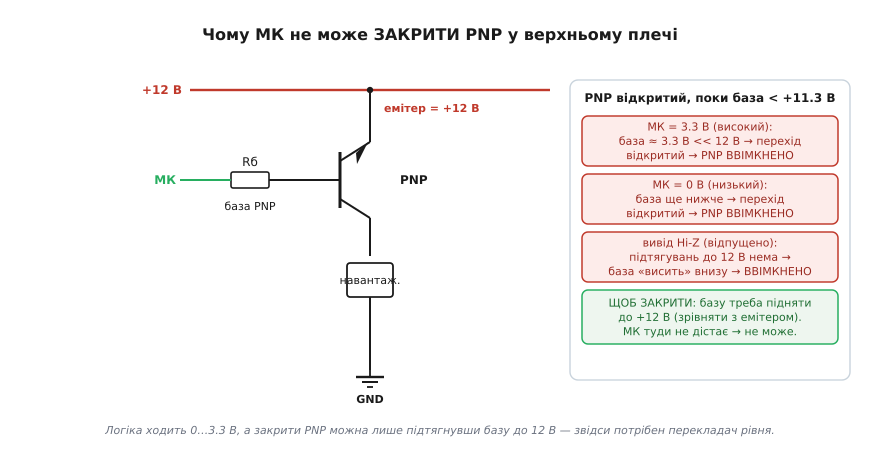
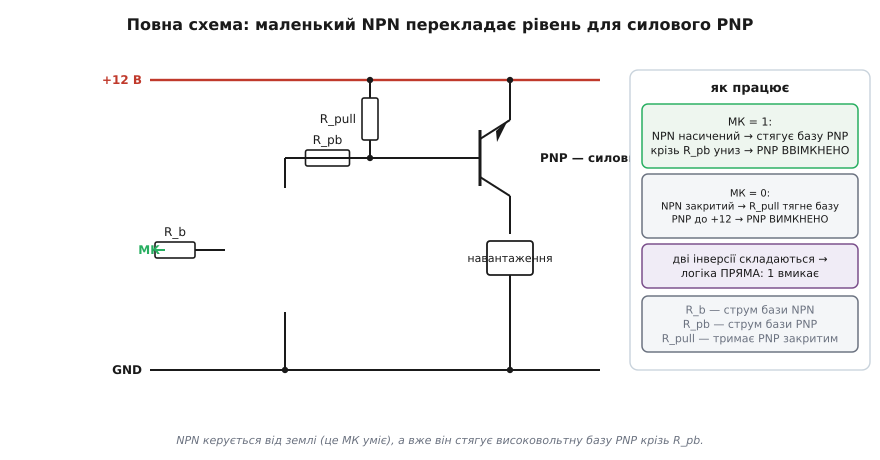
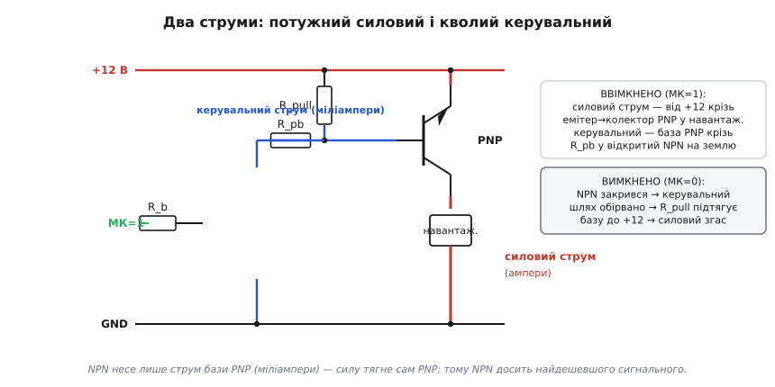
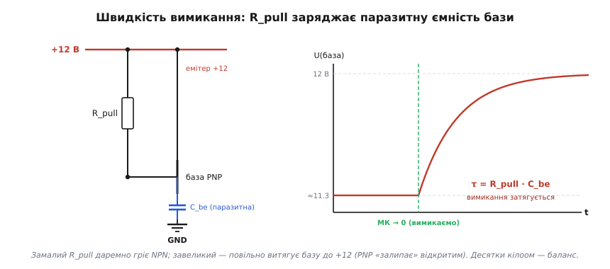

# PNP-ключ і схема high-side

Поставити транзистор-ключ у «мінусовий» провід — справа нехитра: NPN сидить між навантаженням і землею, мікроконтролер подає на базу плюс відносно землі, і ключ слухняно вмикається. А ось коли розривати треба **плюсовий** провід — той, що йде від джерела до навантаження, — проста заміна NPN на PNP несподівано не працює. Мікроконтролер просто не здатен **закрити** PNP у верхньому плечі. Розберімо, чому так виходить (а корінь — у самій арифметиці потенціалів), і чому правильна схема верхнього ключа майже завжди містить **два** транзистори, а не один.

### Навіщо взагалі розривати «плюс»

Спершу — навіщо нам узагалі лізти у верхнє плече, якщо нижнє таке зручне. Ключ у нижньому плечі (*англ.* low-side, «низький бік») комутує зворотний провід: навантаження висить між плюсом і транзистором, а транзистор з'єднує його нижній кінець із землею. Просто й надійно — але одна риса лишається завжди: коли ключ вимкнено, навантаження одним кінцем **усе ще під'єднане до плюса**. Для лампочки це байдуже. А от коли вимкнене коло має бути **повністю** знеструмлене, ця дрібниця стає важливою.

Уявіть давач, що має власну землю, спільну з рештою плати. Якщо живити його через нижній ключ, то навіть «вимкнений» давач лишається підключеним до плюса й може **паразитно живитися** манівцями — крізь свої входи, крізь захисні діоди, крізь землю. Він не вимикається по-справжньому. Або інша ситуація: навантаження раптом замкнуло на землю. У нижньому ключі плюс і далі прикладений до навантаження, тож крізь коротке тече необмежений струм — поки щось не згорить. Розірвати **плюс** означає прибрати напругу з навантаження зовсім: жодного паразитного живлення, жодного струму крізь випадкове замикання на землю. Саме тому в автомобільній електроніці кожну фару, помпу чи соленоїд комутують з боку плюса — щоб вимкнене навантаження було певно **мертве**, а замикання дроту на кузов (а кузов там і є земля) не палило проводку.

Розрив плюса й називають ключем **верхнього плеча** (*англ.* high-side, «високий бік»): транзистор стоїть між плюсом живлення й навантаженням, а навантаження певно сидить нижнім кінцем на спільній землі. Це не косметична переробка нижнього ключа догори дриґом — і вся складність ховається в одному-єдиному транзисторі.

### У верхнє плече просяться комплементарні полярності

Чому саме PNP, а не звичний NPN? Бо полярність ключа має пасувати до його місця в колі. У нижньому плечі NPN відкривають, **піднімаючи** базу вище емітера (а емітер там на землі) — це легко: мікроконтролер дає плюс відносно нуля. У верхньому плечі транзистор стоїть біля **плюса**, і відкривати його доведеться навпаки — стягуючи керувальний вивід **донизу** від плюса. Саме так працює PNP: дзеркальний близнюк NPN, у якого всі полярності перевернуті.

> 🔧 **Навіщо це.** PNP і NPN — комплементарна (*лат.* complementum — доповнення) пара: одна полярність зручна для нижнього плеча, друга — для верхнього. Знаючи, що ключ біля плюса хоче PNP, а ключ біля землі — NPN, ви відразу обираєте правильний транзистор під місце в колі, а не пробуєте втиснути NPN туди, де природніше працює PNP.

PNP вмикають так: емітер чіпляють до «плюса», колектор — до навантаження, а **відкривається** він, коли база стає **нижчою** за емітер приблизно на 0.7 В. Тоді з емітера в базу й колектор тече струм, і силовий шлях відкрито. Поки база дорівнює емітерові — перехід закритий, струму нема. Уся механіка PNP як приладу — у статті [про PNP-структуру й полярності](topic:electronics/bjt-structure); тут досить запам'ятати одне правило: **база нижча за емітер на ~0.7 В — відкрито; база зрівнялася з емітером — закрито**. Саме з цього простого правила й виросте вся проблема.

### Корінь проблеми: арифметика потенціалів

Тепер — найважливіше місце теми. Підставмо числа й подивімося, що вимагає це правило на ділі.

Хай навантаження живиться від 12 вольтів. Емітер PNP сидить на +12 В. Щоб **закрити** PNP, базу треба підняти теж до +12 В — зрівняти з емітером, аби перехід база–емітер перестав відкриватися. Щоб **відкрити** — опустити базу приблизно до 11.3 В. А типовий вивід мікроконтролера видає лише 0…3.3 В (чи 0…5 В). І ось у чому пастка: між «закрито» (база = 12 В) і потрібним сигналом лежить прірва, якої логіка не перестрибне.

Простежмо всі три стани виводу — і переконаймося, що жоден не закриває ключ.


*Емітер PNP сидить на +12 В; PNP відкритий, поки база нижча за ~11.3 В. Хоч би вивід давав високий рівень, низький чи відпускав базу в третій стан — база однаково лишається глибоко внизу, і перехід відкритий. Закрити PNP можна тільки підтягнувши базу до +12 В, а туди логіка не дістає.*

Високий рівень виводу — 3.3 В. Якщо завести його просто крізь резистор у базу, база опиниться десь біля 3.3 В — а це **на цілих вісім вольтів нижче** за емітер. Перехід глибоко відкритий, PNP **проводить**. Низький рівень — 0 В: база стає ще нижчою, перехід відкритий ще сильніше, PNP знов **проводить**. А якщо перевести вивід у третій, високоомний стан (Hi-Z, «відпустити» його)? Теж марно: підтягувань до 12 В у мікроконтролера немає, тож база крізь резистор просто «висить» десь унизу — і перехід знову відкритий. Хоч що роби виводом, **високовольтну базу до плюса він не підніме**, а отже й закрити PNP не зможе. Ключ застрягає ввімкненим назавжди (у кращому разі навантаження ледь жевріє, коли база випадково балансує біля самого порога).

Висновок жорсткий і простий: **прямо керувати PNP-ключем з логіки не можна щоразу, коли напруга навантаження вища за логічний плюс**. Сигнал мікроконтролера ходить між нулем і 3.3 В, а закрити ключ можна лише напругою близько 12 В — два світи не перетинаються. Потрібен посередник, що дотягнеться від низької логіки до високої бази. Цей посередник так і називають — **перекладач рівня** (*англ.* level shifter, «зсувач рівня»).

### Розв'язок: маленький NPN перекладає рівень

Найдешевший перекладач — це **другий, маленький транзистор**: звичайний NPN у нижньому плечі, яким мікроконтролер керує легко (від землі він це вміє чудово). Цей малий NPN **не комутує навантаження** — крізь нього не тече силовий струм. Його єдина робота — **стягувати високовольтну базу PNP донизу** за командою логіки. Сама ж сила лишається на силовому PNP.

Додаймо до схеми ще одну копійчану, але обов'язкову деталь — **підтягувальний резистор** (*англ.* pull-up, «той, що підтягує вгору») від бази PNP до +12 В. Він і вирішує проблему «закрито»: у спокої він певно тримає базу на рівні емітера. Виходить ось яка схема з трьох резисторів і двох транзисторів.


*Силовий PNP угорі: емітер на +12 В, колектор у навантаження. База PNP підтягнута резистором R_pull до +12 В (у спокої PNP закритий) і з'єднана крізь резистор R_pb з колектором маленького NPN. Мікроконтролер крізь R_b керує базою NPN. Дві інверсії складаються в пряму логіку: одиниця вмикає, нуль вимикає.*

Простежмо два стани кола.

**Спокій (вивід = 0).** Маленький NPN закритий, струму крізь нього нема. Підтягувальний резистор R_pull тягне базу PNP вгору — і, оскільки крізь нього не тече жодного струму (закритий PNP бази не споживає), на резисторі немає падіння напруги. За [законом Ома](topic:electronics/ohms-law) спад на резисторі дорівнює добутку струму на опір, а струм тут нульовий — отже, спаду нема зовсім, і база сидить **точно на +12 В**, рівно з емітером. Перехід база–емітер закритий, силовий PNP **закритий**, навантаження повністю знеструмлене. Ось чому R_pull незамінний: тільки він здатен підтягнути базу аж до самого плюса, чого мікроконтролер зробити не міг.

**Команда «увімкнути» (вивід = 1).** Мікроконтролер відкриває маленький NPN; той насичується й своїм колектором **стягує** нижній кінець резистора R_pb майже до землі. Тепер R_pull і R_pb утворюють [подільник напруги](topic:electronics/voltage-divider) між +12 В і майже-нулем, а база PNP висить у точці їхнього з'єднання. Підберемо опори так, щоб ця точка просіла нижче емітера більш ніж на 0.7 В, — і перехід база–емітер **відкривається**. Силовий PNP відкритий, навантаження під струмом.

Зверніть увагу на приємний наслідок: логіка виходить **неінвертована**. Маленький NPN сам по собі «перевертає» сигнал (одиниця на його базі — низький рівень на колекторі), і силовий PNP теж «перевертає» (низька база — ввімкнено). Дві інверсії складаються в пряму дію: одиниця вмикає навантаження, нуль вимикає — рівно так, як підказує здоровий глузд, без жодного «перевертання» у програмі. Ціна за це — другий транзистор і кілька резисторів замість одного ключа. Але інакше верхнє плече на біполярних транзисторах просто не збудувати.

### Скільки тече куди: два струми різної ваги

Щоб упевнено рахувати цю схему, корисно розділити в ній **два геть різні струми**. Вони течуть одночасно, але важать по-різному.


*У ввімкненому ключі товстим (червоним) іде силовий струм: від +12 В крізь емітер-колектор PNP у навантаження й на землю — ампери. Тонким (синім) — кволий керувальний: струм бази PNP витікає крізь R_pb у відкритий маленький NPN на землю — міліампери. Маленький NPN несе лише цей кволий струм, тож йому досить найдешевшого сигнального транзистора.*

**Силовий струм** — головний, потужний. Він виходить із +12 В, проходить крізь відкритий PNP (емітер → колектор) у навантаження й повертається на землю. Це можуть бути ампери — стільки, скільки вимагає навантаження. Весь він іде крізь PNP, оминаючи маленький NPN зовсім.

**Керувальний струм** — кволий, службовий. Це струм бази PNP: він витікає з бази вниз, крізь резистор R_pb у відкритий маленький NPN і теж на землю. Саме він тримає PNP відкритим. Його величина — одиниці міліампер, у багато разів менша за силовий.

Це розділення має пряму практичну вагу. Маленький NPN несе **лише** струм бази PNP — міліампери, — а не весь струм навантаження. Тому в перекладачі досить найдешевшого сигнального транзистора (на кшталт BC547 чи 2N3904), хоч би навантаження тягло амперами: усю силу везе сам PNP, а NPN лише «командує» його базою. Коли вивід стає нулем, маленький NPN замикається, керувальний шлях обривається — і R_pull за частки мікросекунди підтягує базу PNP назад до +12 В, гасячи силовий струм.

### Рахуємо три резистори

Тепер найкорисніше — як підібрати номінали. У схемі три резистори, і кожен рахують своїм законом кола. Підемо знизу вгору, за течією сигналу.

**Резистор бази PNP — R_pb.** Він задає струм бази силового PNP, а отже й глибину його насичення. Логіка та сама, що й для будь-якого ключа: щоб PNP сидів у насиченні твердо (малий спад емітер-колектор, мало тепла), базі дають струму **з запасом** — у багато разів більше, ніж вимагає паспортний коефіцієнт підсилення. Беремо так зване **примусове β** (*англ.* forced beta) близько 10: струм бази дорівнює струмові навантаження, поділеному на 10.

Коли маленький NPN насичений, його колектор сидить майже на нулі (спад насиченого транзистора ≈ 0.2 В). Уся напруга джерела, окрім падіння на переході база–емітер PNP, лягає на R_pb. За [законом Ома](topic:electronics/ohms-law):

```
Iб(PNP) = Iнавант / β_forced          (потрібний струм бази PNP)
R_pb    = (Vcc − Vбе(PNP) − Vce(sat,NPN)) / Iб(PNP)
```

**Приклад. Навантаження Iнавант = 1 А від Vcc = 12 В; β_forced = 10.**
```
Iб(PNP) = 1 А / 10                        = 100 мА
спад на R_pb = 12 − 0.7 − 0.2            = 11.1 В
R_pb = 11.1 В / 0.1 А                     = 111 Ом  →  беремо 100 Ом (ряд E12, униз)
```
Округлюють **униз**: менший резистор дає трохи більший струм бази, а зайва база лише глибше насичує PNP — це безпечно, тоді як завелика база лишила б ключ недотиснутим і гарячим. Чому саме примусове β ≈ 10 (а не паспортне), звідки взялося це число й як перевірити, що ключ справді насичений, — у [математичній вставці про резистор бази](topic:electronics/bjt-switch/math-base-resistor.md): там та сама арифметика, лише в нижньому плечі.

> 🔧 **Навіщо це.** R_pb — це «газ» для силового PNP: він задає, скільки струму затікає в базу, а отже наскільки глибоко відкритий ключ. Замало (завеликий R_pb) — PNP недотиснутий, гріється; з запасом (примусове β ≈ 10) — ключ насичений твердо, з мінімальним спадом і теплом, попри розкид β між екземплярами.

**Резистор бази NPN — R_b.** Тепер той самий струм треба «замовити» в маленького NPN: його колектор мусить просадити R_pb, тобто пропустити крізь себе ті самі 100 мА струму бази PNP. Це **колекторний** струм перекладача. За тим самим правилом примусового β ≈ 10 базі NPN треба десята частина цього:

```
Iб(NPN) = Iк(NPN) / β_forced = 100 мА / 10 = 10 мА
R_b     = (Vlog − Vбе(NPN)) / Iб(NPN)
```

**Приклад (продовження). Логіка Vlog = 3.3 В, Vбе(NPN) ≈ 0.7 В.**
```
Iб(NPN) = 10 мА
R_b = (3.3 − 0.7) / 0.010 = 2.6 / 0.010 = 260 Ом  →  220 Ом (E12, униз)
```
Тут спливає важлива перевірка: чи **витримає вивід** мікроконтролера ці 10 мА? Здебільшого так (типова межа — 20…40 мА). Та якщо схема веде дуже великий струм, ланцюжок β множиться, і струм бази NPN може вискочити за межу виводу — тоді або беруть NPN із вищим β, або переходять на польовий ключ, що струму на керування майже не просить.

**Підтягувальний резистор — R_pull.** Його роль подвійна, і обидві задають вибір номіналу. По-перше, у спокої він має певно тримати базу PNP на +12 В — а це він робить незалежно від величини, бо струму крізь закритий PNP нема (отже й спаду на R_pull нема). По-друге, у ввімкненому стані він висить між +12 В і просадженим вузлом бази, тож крізь нього **постійно тече марний струм** просто на землю крізь відкритий NPN. Цей струм — чисті втрати, і він додається до того, що мусить пропустити маленький NPN. Звідси компроміс: R_pull беруть **помірно великим**, зазвичай 10…47 кОм. Досить малим, щоб надійно й швидко витягувати базу до плюса, але досить великим, щоб не палити струм даремно й не вантажити NPN.

```
Iмарний = (Vcc − Vбаза(увімк)) / R_pull ≈ Vcc / R_pull   (груба оцінка, коли база просаджена)
```
**Приклад. R_pull = 22 кОм, Vcc = 12 В.**
```
Iмарний ≈ 12 / 22000 ≈ 0.55 мА
```
Пів міліампера марних втрат — мізер проти амперів навантаження, і водночас цей струм додає лише трохи до роботи NPN. Якби взяли R_pull = 1 кОм, марний струм підскочив би до 12 мА — і гріло б, і NPN довелося б тягти його разом зі струмом бази PNP. Десятки кілоом — золота середина.

У прошивці, коли всі три резистори вже пораховано й упаяно, керування зводиться буквально до смикання одного виводу — уся «розумна» частина схеми зроблена залізом:
:::tabs
```cpp
pinMode(HS_PIN, OUTPUT);
digitalWrite(HS_PIN, HIGH);   // 1 → NPN насичено → база PNP просіла → PNP відкрито, навантаження ввімкнено
digitalWrite(HS_PIN, LOW);    // 0 → NPN закрито → R_pull тягне базу PNP до +12 → PNP закрито
```
```python
from machine import Pin

hs = Pin(HS_PIN, Pin.OUT)
hs.value(1)   # 1 → NPN насичено → база PNP просіла → PNP відкрито, навантаження ввімкнено
hs.value(0)   # 0 → NPN закрито → R_pull тягне базу PNP до +12 → PNP закрито
```
:::

### Чому «майже» тут особливо небезпечне

Є тонкість, через яку прямо керований PNP небезпечніший за прямо керований NPN, — і вона теж випливає з арифметики потенціалів. Якщо в нападі економії ви викинете маленький NPN і заведете базу PNP просто на вивід крізь резистор, то в стані «вивід = 0» мікроконтролер тягне базу до нуля. PNP при цьому відкривається — це ще пів біди. Гірше інше: база PNP сама собою хоче сидіти приблизно на 11.3 В (емітер мінус 0.7 В). Вивід же тримає її біля нуля. Виходить, що крізь резистор бази **в вивід мікроконтролера тече струм назад** — з боку 12-вольтового кола в логіку, розраховану на 3.3 В.

Цей зворотний струм (*англ.* injection, «вприскування») лізе крізь захисні діоди виводу й може його **пошкодити** або підняти живлення логіки вище норми. Маленький NPN-перекладач цю біду усуває в корені: його база бачить лише акуратний сигнал 0…3.3 В від виводу, а високовольтну сторону тримає колектор, гальванічно відрізаний від логіки переходом транзистора. Отже, перекладач — не «зайвина для краси», а захист самого мікроконтролера: він не пускає 12 вольтів назад у тривольтову логіку.

### Швидкість вимикання: підтягувальний резистор проти паразитної ємності

Лишається тонкість, що визначає, **як швидко** ключ гасне, — і тут схема поводиться як знайоме коло з опору й ємності. У PNP, як у будь-якому транзисторі, між базою та емітером є невелика **паразитна ємність** (*гр.* parásitos — нахлібник): заряд, що його доводиться змінювати, аби змінити стан переходу. Вимикаючи ключ, ми мусимо цю ємність **зарядити** від просадженого рівня до +12 В — а зробити це може лише підтягувальний резистор R_pull.

Виходить класична [RC-ланка](topic:electronics/rc-time-constant): R_pull заряджає ємність бази, і напруга на базі повзе до +12 В не миттєво, а за експонентою зі сталою часу τ = R_pull · Cбе.


*Коли маленький NPN закривається, базу PNP до +12 В тягне лише R_pull, заряджаючи паразитну ємність переходу Cбе. Напруга бази підіймається за експонентою зі сталою часу τ = R_pull · Cбе; поки база не дотягнеться до ~11.3 В, PNP ще проводить — вимикання затягнуте. Завеликий R_pull робить цей «хвіст» довшим.*

Звідси видно другий бік компромісу для R_pull, уже не за струмом, а за **швидкістю**. Завеликий R_pull повільно заряджає ємність бази — вимикання затягується, PNP «залипає» відкритим на зайвий час. Замалий — швидко вимикає, але палить більше марного струму й важче вантажить NPN. Для повільних навантажень (лампа, реле, нагрівач) це геть неважливо: десятки кілоом дають вимикання за мікросекунди, а реле й так клацає мілісекундами. А якщо ключ мусить швидко клацати (широтно-імпульсне керування мотором, наприклад), R_pull беруть ближче до нижньої межі діапазону, свідомо доплачуючи марним струмом за різкість фронту. Це той самий вибір «швидше проти економніше», що пронизує всю аналогову схемотехніку: одна деталь майже ніколи не оптимальна за всіма критеріями заразом, і номінал ставлять на компроміс під конкретну задачу.

### Коли PNP поступається польовому

Біполярна пара «PNP плюс NPN-перекладач» гарна для дрібних і середніх струмів, де її дешевизна вирішує. Та коли струм відчутний, у PNP вилазить його природна вада: навіть насичений, він має спад емітер-колектор близько 0.2 В, і на амперах це означає помітне тепло (потужність — добуток спаду на струм). Тут на зміну приходить **P-канальний польовий транзистор** ([MOSFET](topic:electronics/field-control)) у верхньому плечі. Його відкритий канал поводиться як маленький опір, і на великих струмах він гріється менше за біполярний PNP.

Цікаво, що проблема рівня в P-MOSFET — **точнісінько та сама**: щоб його закрити, затвор треба підняти до повного плюса, а логіка туди не дістає. І розв'язок той самий — маленький NPN (або N-канальний MOSFET) як перекладач, що стягує затвор донизу, плюс підтягувальний резистор від затвора до плюса. Тобто вся логіка цієї статті переноситься на польовий ключ майже без змін; різниться лише те, що затвор MOSFET керується напругою, а не струмом, тож резистор у його колі обмежує не постійний струм, а лише кидок заряду ємного затвора. Через меншу теплову плату для відчутних струмів у верхньому плечі сьогодні частіше беруть саме P-MOSFET, а біполярну пару лишають дрібним і дешевим ключам.

А коли таких верхніх ключів треба багато або не хочеться плодити дискретні деталі, беруть готові мікросхеми — **інтелектуальні верхні ключі** (*англ.* smart high-side switch). Усередині — той самий принцип: силовий польовий ключ із вбудованим перекладачем рівня, плюс захист від перевантаження, короткого замикання й перегріву. Керують ними одним логічним сигналом, як звичайним виводом, а вся «арифметика потенціалів» сховалася в кристал. Саме такі ключі панують в автомобільній електроніці, де кожен плюс до фари чи помпи комутують з верхнього боку заради безпеки.

### Коротко про верхній ключ

Отже, верхній ключ розриває **плюс** — щоб вимкнене навантаження було певно мертве: жодного паразитного живлення, жодного струму крізь випадкове замикання на землю. На біполярних його не збудувати одним транзистором, бо мікроконтролер не дістає до повної напруги живлення, щоб зрівняти базу PNP з емітером і закрити ключ. Звідси канонічна схема: силовий **PNP** угорі, маленький **NPN-перекладач**, що стягує його базу за командою логіки, **підтягувальний резистор**, що тримає PNP закритим у спокої й тягне базу назад при вимиканні, та два резистори баз, пораховані за примусовим β ≈ 10. Схема дає правильну, неінвертовану логіку й захищає мікроконтролер від зворотного струму — мала плата за можливість чисто розривати «плюс». А коли струми ростуть, той самий каркас лишається, тільки силовий PNP поступається місцем P-канальному польовому ключу.
