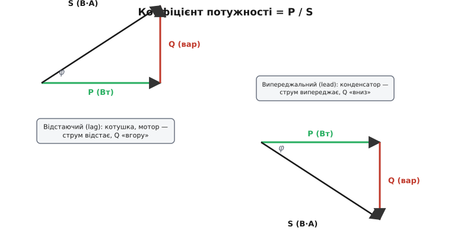
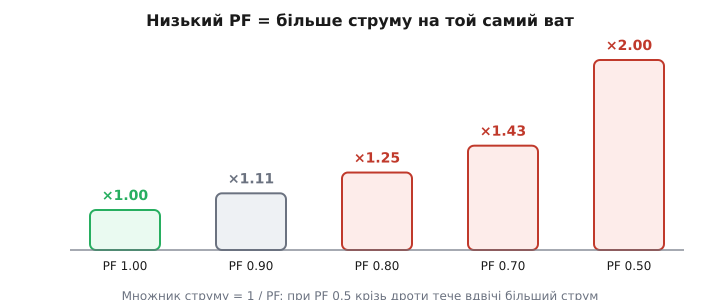
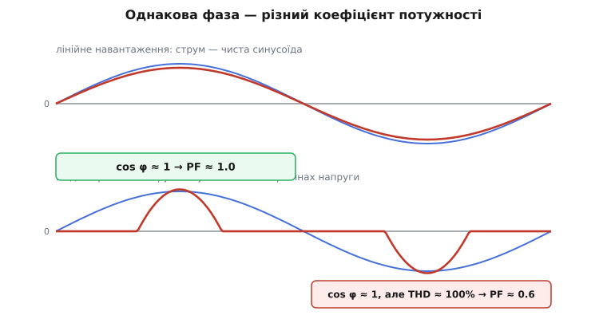

# Коефіцієнт потужності

Помножте показ вольтметра на показ амперметра — і ви отримаєте число у вольт-амперах, яке здається потужністю, але майже ніколи нею не є. Реальне навантаження бере з мережі менше, ніж цей добуток обіцяє. Скільки саме менше — каже єдине число від нуля до одиниці: **коефіцієнт потужності** (англ. *power factor*, «множник потужності»). Це частка того добутку, що справді перетворюється на роботу — на тепло, світло, обертання валу. Решта струму тече крізь дроти намарно: гріє їх, вантажить трансформатор, але корисної роботи не робить.

Коефіцієнт потужності — це не властивість приладу на кшталт ваги чи габариту, а **міра збігу струму з напругою в часі**. Якщо струм слухняно повторює форму й момент напруги, увесь добуток U·I працює, і коефіцієнт дорівнює одиниці. Щойно струм зсувається в часі або спотворюється формою — частина добутку «провисає», і число падає. Саме два способи зіпсувати цей збіг — зсув і спотворення — і є справжній зміст теми. Перший знають усі, хто чув про cos φ; другий, прихований у формі струму, у побутовій розмові про коефіцієнт потужності зазвичай випадає, хоч у сучасній електроніці він головний.

> 🔧 **Навіщо це.** Лічильник у заводському щиті часто рахує не лише спожиті кіловати, а й **повну** потужність у вольт-амперах. Якщо коефіцієнт потужності низький, підприємство платить за струм, якого «не спожило»: мережа мусила його прокачати, мідь грілася, трансформатор займала. Те саме число стоїть у паспорті кожного блока живлення й мотора — воно прямо каже, наскільки струм приладу перевищить «корисний мінімум». Розуміти його — значить розуміти, чому шафа з конденсаторами окупається, а дешевий імпульсний блок без корекції псує мережу цілому під'їзду.

## Одне число: частка корисного у видимому

Почнімо з означення, бо воно коротке й точне. Беремо потужність, що справді робить роботу, — її звуть **активною** (англ. *active*, або *real power*, P, вати). Беремо потужність «видиму» — простий добуток діючих значень напруги й струму, **повну** потужність (англ. *apparent power*, S, вольт-ампери). Коефіцієнт потужності — їхнє відношення:

```
PF = P / S = (потужність, що працює) / (потужність, що тече по дротах)
```

Чому S не дорівнює P — окрема велика тема про те, як реактивні елементи змушують енергію гойдатися туди-сюди, нічого по дорозі не залишаючи; вона розібрана в статті про [реактивну потужність](topic:electronics/reactive-power). Коротко: повна потужність S — це гіпотенуза прямокутного трикутника, активна P — один катет, а другий катет, реактивна потужність Q (вольт-ампери реактивні, вар), — це та частина, що лише гойдається. Звідси `S² = P² + Q²`, і коефіцієнт потужності — косинус кута при вершині цього трикутника. Тут нам важлива не сама будова трикутника, а те, що PF — це **готове число-присуд**: одиниця означає «увесь струм працює», нуль — «жоден ват не доходить».

Кілька меж, щоб відчути шкалу. Лампа розжарення чи нагрівач — чистий опір, струм точно в ногу з напругою, PF = 1.0. Навантажений асинхронний мотор — близько 0.8. Той самий мотор на холостому ходу, де майже все — намагнічування заліза, — лише 0.2. Трансформатор без навантаження може мати PF нижче 0.1: струм є, а роботи майже нема.


*Коефіцієнт потужності — це відношення активної потужності P (зелений катет) до повної S (гіпотенуза), тобто косинус кута φ. Ліворуч відстаючий випадок (індуктивне навантаження, реактивна потужність Q «вгору»), праворуч випереджальний (ємнісне, Q «вниз»). Що довша марна сторона Q, то менший коефіцієнт.*

## Чому низьке число дорого коштує

Якщо реактивна потужність у середньому нічого не споживає, чому за низький коефіцієнт узагалі беруть гроші? Бо платять не за середню потужність, а за **наслідки струму**, який ту реактивну частину переносить. А струм цілком реальний, навіть коли середня потужність нульова.

Простежмо ланцюжок. Навантаженню треба, скажімо, рівно 10 кВт активної потужності. При напрузі 230 В і коефіцієнті 1.0 струм був би P/U = 43 А. Але хай коефіцієнт 0.5 — тоді повна потужність S = P/PF = 20 кВ·А, і струм мережа мусить дати вже S/U = 87 А, удвічі більший. Та сама корисна робота — удвічі товщий струм у дротах. А втрати в проводах ростуть як **квадрат** струму (P_втр = I²·R), тож подвоєння струму вчетверо збільшує нагрів кабелів і обмоток. Звідси проста, але точна формула: множник струму над корисним мінімумом дорівнює `1/PF`.


*Той самий ват корисної потужності вимагає тим більшого струму, чим нижчий коефіцієнт. Множник дорівнює 1/PF: при 0.8 струм на чверть більший, при 0.5 — удвічі. Цей зайвий струм гріє дроти (втрати ростуть як його квадрат) і займає потужність трансформатора, тож енергопостачальник виставляє за нього рахунок.*

Ось чому енергопостачальники рейтингують трансформатори й кабелі у **вольт-амперах**, а не у ватах: залізо й мідь нагріваються від повного струму, байдуже, яка його частка корисна. І ось чому промислові тарифи штрафують за коефіцієнт нижче порогу (зазвичай 0.90–0.95): нижче нього мережа возить забагато «порожнього» струму, і за цю надлишкову пропускну здатність хтось має заплатити.

> 🔧 **Навіщо це.** Це пояснює дивний на перший погляд інженерний крок — поставити поряд із мотором конденсатор, який сам по собі нічого корисного не робить. Індуктивний мотор тягне відстаючий реактивний струм; конденсатор тягне рівно протилежний, випереджальний. Поставлені поряд, вони **обмінюються** цією гойданкою між собою, локально, не ганяючи її через усю мережу. Активна потужність до мотора доходить та сама, а повний струм у лінії падає — і рахунок разом із ним. Це і є корекція коефіцієнта потужності в найпростішому вигляді.

## Знак числа: відстає чи випереджає

Саме число PF знаком не наділене — воно завжди від 0 до 1. Але самого числа мало: 0.8 у мотора й 0.8 у перекомпенсованого конденсаторного банку — це протилежні ситуації, і плутати їх не можна. Тому до коефіцієнта додають слово про **напрям зсуву**: відстаючий чи випереджальний.

Домовленість проста, варто лише закріпити її за струмом. Дивимося, де опиняється **струм** відносно напруги. Якщо струм **відстає** від напруги (запізнюється в часі) — коефіцієнт **відстаючий** (англ. *lagging*); так поводиться все індуктивне: мотори, дроселі, трансформатори, довгі кабелі. Якщо струм **випереджає** напругу — коефіцієнт **випереджальний** (англ. *leading*); так поводиться ємність: батареї конденсаторів, недовантажені кабелі, перекомпенсовані установки. У трикутнику потужностей це той самий знак, лише вираженій реактивній потужності Q: відстаючий — Q «вгору», випереджальний — Q «вниз».

Чому це не педантизм, а практика: компенсація легко **перестрибує** мету. Поставили забагато конденсаторів — і відстаючий мотор перетворив усю установку на випереджальну. Коефіцієнт знову, скажімо, 0.9, але вже з іншого боку, і це власна проблема: випереджальний струм підіймає напругу в кінці лінії, а під час нічного спаду навантаження перекомпенсована мережа може видати небезпечний перенапруг. Тому грамотна корекція не женеться за рівно одиницею, а зупиняється трохи в індуктивному боці — десь на 0.95 відстаючого.

## Друга пастка: спотворена форма струму

Усе вище мовчки припускало, що струм — чиста синусоїда, лише зсунута в часі. Для мотора чи трансформатора це правда. Але ввімкніть у розетку звичайний імпульсний блок живлення — комп'ютер, зарядку, світлодіодну лампу — і струм перестає бути синусоїдою взагалі. Тоді з'являється другий, зовсім інший спосіб зіпсувати коефіцієнт потужності, і косинус кута тут уже безсилий.

Подивімося, що робить вхід дешевого імпульсного блока. Зразу за вилкою стоїть [випрямляч](topic:electronics/rectification) і великий конденсатор. Конденсатор заряджається лише тоді, коли миттєва напруга мережі **вища** за вже накопичену на ньому, — тобто короткими сплесками поблизу вершин синусоїди. Решту періоду діод закритий, і струм нульовий. Замість плавної синусоїди мережа бачить вузькі високі піки двічі за період.


*Угорі лінійне навантаження: струм (помаранчевий) повторює форму напруги (синій), фаза збігається, коефіцієнт близький до одиниці. Унизу вхід випрямляча з конденсатором: струм тече вузькими піками на вершинах напруги. Хоч ці піки симетричні відносно напруги — зсуву фаз майже нема, cos φ ≈ 1, — коефіцієнт потужності все одно низький, бо форма геть не синусоїдна.*

Ось де ламається звичне уявлення. Ці піки **симетричні** відносно вершини напруги — отже середній зсув фаз майже нульовий, cos φ ≈ 1. Здавалося б, коефіцієнт чудовий. А насправді він жахливий — близько 0.5–0.65. Звідки невідповідність? Бо повна потужність S рахується через **діюче значення** струму ([RMS](topic:electronics/true-rms)), а діюче значення вузького високого піка набагато більше за діюче значення синусоїди тієї самої корисної потужності. Струм є, він гріє дроти, він входить у S — але корисної роботи на основній частоті майже не додає, бо «зайва» його частина сидить у вищих гармоніках.

Щоб розв'язати цей вузол, коефіцієнт потужності розкладають на два множники. Перший — звичний косинус зсуву основної гармоніки; його звуть **коефіцієнтом зсуву** (англ. *displacement power factor*, DPF = cos φ). Другий ловить саме спотворення форми — **коефіцієнт спотворення** (англ. *distortion power factor*). Повний, або **істинний**, коефіцієнт потужності (англ. *true power factor*) — їхній добуток:

```
PF = (коеф. зсуву) × (коеф. спотворення) = cos φ × DF
```

Коефіцієнт спотворення прямо пов'язаний із тим, наскільки струм відхилився від синусоїди. Цю міру відхилення звуть [сумарним гармонічним спотворенням](topic:electronics/harmonic-distortion) (англ. *total harmonic distortion*, THD) — це відношення діючого значення всіх вищих гармонік до діючого значення основної. Через нього коефіцієнт спотворення такий:

```
DF = 1 / √(1 + THD²)
```

Логіка формули проста, якщо тримати в голові, що THD — це «зайвий» струм гармонік, складений із основним за теоремою Піфагора (гармоніки різних частот ортогональні, як і активна з реактивною). Корисну роботу несе лише основна гармоніка; повний струм більший за неї в `√(1 + THD²)` разів; відношення корисного до повного — обернена величина. Для типового входу імпульсного блока THD струму сягає 100% (вищі гармоніки за діючим значенням дорівнюють основній), і тоді:

```
DF = 1/√(1 + 1²) = 1/√2 ≈ 0.71
```

навіть при ідеальному cos φ = 1. Помножте на реальний косинус — і дістаєте ті самі 0.6 з гаком, що міряє прилад. Як саме виводяться обидва множники з означення через діюче значення й чому ортогональність гармонік дає піфагорову суму — розписано в окремій [математичній вставці](topic:electronics/power-factor/math-true-power-factor.md).

> 🔧 **Навіщо це.** Через цю другу пастку існує ціла галузь — активна корекція коефіцієнта потужності ([PFC](topic:electronics/pfc-basics)). Конденсаторами її не вилікувати: вони борються зі зсувом фаз, а не зі спотворенням форми. Потрібна окрема схема, що змушує вхідний струм блока **повторювати форму синусоїди напруги**, а не текти піками. Норми (як європейський стандарт EN 61000-3-2) прямо обмежують гармоніки струму, який пристрій має право вкидати в мережу, тож для всього понад кількадесят ватів PFC сьогодні обов'язковий. Інженер, що проєктує блок живлення, бачить коефіцієнт потужності насамперед саме з цього боку — як межу на гармоніки, а не як косинус.

## Як це число вимірюють

Коротко варто знати, звідки прилад бере коефіцієнт, бо тут легко обманутися. Найчесніший спосіб — поміряти **активну** потужність P (усереднити миттєвий добуток u·i за період) і **повну** S (перемножити діючі значення напруги й струму), а тоді поділити одне на одне: `PF = P/S`. Такий вимір ловить **обидві** пастки — і зсув, і спотворення, — бо діюче значення струму чесно враховує всі гармоніки. Саме так працюють сучасні цифрові аналізатори потужності й мікросхеми-лічильники.

Старий же стрілковий «косинусметр» міряє лише **зсув фаз основної гармоніки** — тобто cos φ, коефіцієнт зсуву, а не повний коефіцієнт. На синусоїдному струмі мотора це одне й те саме, і прилад правий. Але повісьте такий косинусметр на вхід імпульсного блока — він покаже близько одиниці, бо зсуву й справді майже нема, і пройде повз справжню проблему, яка вся у формі. Тому, читаючи «коефіцієнт потужності 0.99» у паспорті, варто знати, **який саме** з двох коефіцієнтів там стоїть і яким методом його одержали.

Прикладна формула на щодень одна й коротка — порахувати, який струм потягне навантаження з відомою активною потужністю й відомим коефіцієнтом:

**Умова.** Однофазний привод бере P = 2.2 кВт активної потужності від мережі 230 В і має повний коефіцієнт потужності PF = 0.82 (відстаючий). Який струм тече в лінії та яка повна потужність?

```c
// Струм лінії з активної потужності та коефіцієнта потужності.
// I = P / (U · PF);   S = U · I = P / PF.
float power_active_w   = 2200.0f;   // корисна потужність, Вт
float voltage_rms_v    = 230.0f;    // діюче значення напруги, В
float power_factor     = 0.82f;     // повний PF (зсув × спотворення)

float current_a        = power_active_w / (voltage_rms_v * power_factor);
float power_apparent_va = power_active_w / power_factor;

// current_a        = 2200 / (230 · 0.82) = 2200 / 188.6 ≈ 11.7 А
// power_apparent_va = 2200 / 0.82        ≈ 2683 В·А
```

**Висновок.** Корисні 2.2 кВт обертаються повними 2.68 кВ·А і струмом 11.7 А — на 22% більшим за «ідеальні» 9.6 А, які текли б при коефіцієнті 1.0. Саме на ці 22% доводиться розрахувати переріз кабелю, контакти й запас трансформатора, хоч роботи навантаження робить рівно стільки ж. Виправити це означає підняти коефіцієнт ближче до одиниці — компенсацією, якщо причина в зсуві, або PFC, якщо причина у формі.

## Звідки взялося це число

Поняття не з'явилося в один день і не має єдиного автора — воно вистигало разом із самою енергетикою змінного струму наприкінці XIX століття, коли інженери зіткнулися з тим, що генератор віддає більше «потужності», ніж навантаження начебто бере. Перші систематичні інструменти для цієї невідповідності дав німецько-американський інженер Чарлз Протеус Штайнмец (Charles Proteus Steinmetz), який у 1890-х звів аналіз кіл змінного струму до зручної алгебри й чітко розділив потужність, що працює, і потужність, що гойдається. Власне термінологію — у тому числі назву «коефіцієнт потужності» та одиницю «вольт-ампер» — у стандартах закріпив на початку XX століття Американський інститут інженерів-електриків (AIEE, попередник нинішнього IEEE). Докладніше, з іменами, датами й тим, як саме термін усталився, — в [історичній вставці](topic:electronics/power-factor/hist-power-factor-term.md); там же розібрано поширене, але слабко підтверджене приписування першості одній особі.

Що з усього цього варто винести. Коефіцієнт потужності — це одне число, яке відповідає на одне питання: яка частка струму, що тече по дротах, справді робить роботу. Зіпсувати його можна двома різними способами — **зсунути** струм у часі (тоді винен косинус кута, і лікують конденсатором) або **спотворити** його форму (тоді винні гармоніки, і лікують схемою корекції). Перший бік бачить енергетик біля мотора, другий — схемотехнік біля імпульсного блока, але число в обох випадках те саме й означає те саме: наскільки добре струм збігається з напругою, і скільки зайвого струму доводиться платити за неузгодженість.
