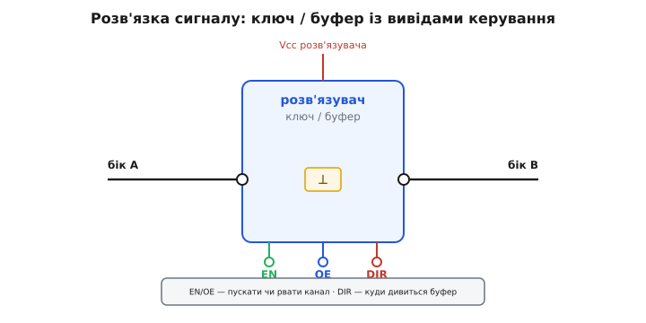
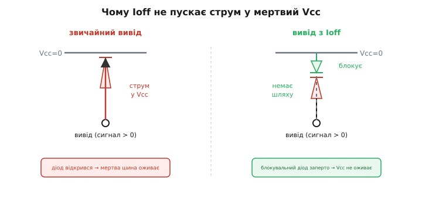
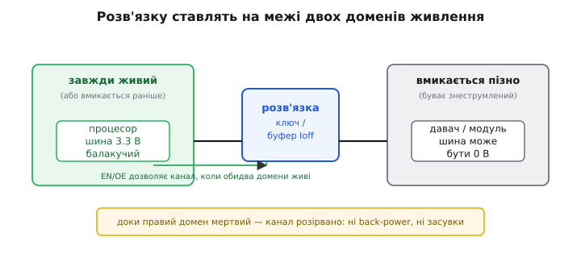

# 🔌 Розв'язка шин: ключі й буфери, що не живлять з чорного ходу

Уяви плату, де один чип уже працює, а сусідній ще лежить знеструмлений — його шина живлення на нулі. Між ними тягнеться сигнальний дріт. Живий чип виставляє на цьому дроті високий рівень, скажімо 3.3 В, бо для нього це звичайна логічна одиниця. А на тому кінці — мертвий вивід, чия шина живлення дорівнює нулю. І ось маємо напругу, яка не мала б існувати: 3.3 В стоять на виводі чипа, всередині якого все на нулі. Кремнію байдуже до наших намірів — він просто бачить різницю потенціалів і шукає, куди потекти струму. Знаходить: крізь захисний діод виводу, прямо в мертву шину живлення. Чип починає **оживати з чорного ходу** — не з власного перетворювача, а через сигнальний вивід.

Це і є та біда, яку треба розірвати фізично. Не «попросити чип не оживати» (він не вміє), не «понадіятися, що струму буде мало» (а він буває в десятки міліампер), а **поставити в розрив сигнального дроту деталь, яка тримає прохід закритим, доки обидва кінці не під живленням**. Такий клас деталей і є героєм цієї вставки: **аналогові ключі** й **буфери/перетворювачі напрямку з захистом від зворотного живлення** (англ. *back-power protection*, або *powered-off protection*, чи в даташитах — *Ioff*). Усі вони роблять одне: розв'язують сигнальний шлях між знеструмленим і ввімкненим кремнієм.

## Що це за клас деталей і чим вони різні всередині

Спершу варто розрізнити два споріднені, але різні за нутром пристрої — бо плутанина між ними дорого коштує.

**Аналоговий ключ** (англ. *analog switch*) — це електронно керований контакт. Усередині — польовий транзистор (а частіше пара з n- і p-каналом, увімкнених паралельно — *transmission gate*, «передавальна хвіртка»), що або з'єднує два виводи майже накоротко (опір у відкритому стані — одиниці-десятки ом), або розриває їх (опір у закритому — мегаоми й вище). Ключ **прозорий до сигналу**: він не знає, цифровий там рівень чи плавна аналогова напруга, не підсилює й не формує — просто пропускає те, що є, або не пропускає нічого. Тому ним розв'язують **будь-який** сигнальний шлях: лінію давача, тактовий дріт, аналоговий вихід, навіть невелику шину живлення.

**Буфер з контролем напрямку** (англ. *direction-controlled buffer*, часто поєднаний із *перетворювачем рівня*, *level translator*) — інший звір. Усередині — підсилювачі, що **перечитують** сигнал і видають його наново, своїми вихідними транзисторами, від власного живлення. Він не просто пропускає напругу — він її **відтворює**: бачить на вході «високо чи низько» й сам формує чистий рівень на виході. Це дає дві речі, яких ключ не вміє: по-перше, він **зсуває рівні** (вхід 1.8 В, вихід 3.3 В — бо кожен бік живиться своєю напругою), по-друге, він **підсилює** — заводить кволий сигнал у довгу або ємнісну лінію. Платня за це — буфер **однонапрямний у кожну мить**: він жене сигнал або з боку A в бік B, або навпаки, і йому треба сказати, куди саме.

Спільне в обох — і саме воно нас тут цікавить — це здатність **повністю від'єднатися від лінії**, перейшовши у стан високого опору (англ. *high impedance*, Hi-Z — «високий повний опір»), і, що головне, **не пускати струм у власну мертву шину живлення**, коли на виводі стоїть напруга, а живлення самого пристрою нема.


*Розв'язувач стоїть у розрив сигнального проходу між боком A і боком B. Виводи керування: EN/OE пускають або рвуть канал (Hi-Z), DIR (у буфера) задає напрямок A→B чи B→A. Ключ пропускає сигнал як є; буфер перечитує й відтворює його від власного живлення, тож може зсувати рівень і підсилювати.*

> 🔧 **Навіщо це.** Коли вибираєш деталь у розрив сигналу між доменами, перше питання — «мені просто розірвати лінію чи ще й зсунути рівень?». Якщо обидва кінці на одній напрузі й сигнал треба лише пускати/рвати — бери **ключ**: він дешевший, прозоріший, не вносить затримки формування й однаково працює з аналоговим сигналом. Якщо домени на **різних** напругах або лінія довга й кволий вихід її не тягне — бери **буфер-перетворювач**: він і рівень зведе, і сигнал освіжить. Поставити буфер там, де досить ключа, — переплата й зайва затримка; поставити ключ там, де треба зсув рівня, — кремній сусіда отримає або задослабкий, або задосильний рівень.

## Серцевина: чому без захисту струм тече, а із захистом — ні

Усе тримається на одній деталі будови — **захисному діоді від статики** (ESD), який є на кожному виводі будь-якої мікросхеми. Він з'єднує вивід із шиною живлення Vcc, вершиною (анодом) до виводу, основою (катодом) до Vcc. У нормальному житті, коли Vcc вище за сигнал, цей діод заперто й непомітно. Та щойно на вивід приходить напруга **вища за Vcc** — а саме це й стається, коли Vcc дорівнює нулю, — діод відкривається й пускає струм з виводу прямо в шину живлення.

Простежмо за струмом крок за кроком. Сигнал 3.3 В стоїть на виводі. Vcc розв'язувача — 0 В (він знеструмлений). Падіння на відкритому діоді — десь 0.6 В. Отже:

```
напруга на виводі      = 3.3 В
Vcc розв'язувача       = 0.0 В
падіння на ESD-діоді   ≈ 0.6 В
струм тече, бо         3.3 В > 0.0 В + 0.6 В  →  діод відкритий
шина «оживає» до       3.3 − 0.6 = 2.7 В      ← мертвий Vcc піднявся сам
```

Це руйнівно з трьох боків заразом. По-перше, мертва шина піднялася до 2.7 В — і чип, що мав спати, опинився **напівживим**: частина його логіки під напругою, частина ні, виводи в безладі. По-друге, увесь струм сигналу тече крізь **крихітний** ESD-діод, розрахований на короткі імпульси статики, а не на тривалий струм, — діод гріється й може **перегоріти**. По-третє, цей упорснутий у кремній струм — класичний запал **засувки** (паразитного тиристора), що замикає живлення на землю низькоомним каналом.

> 🔧 **Навіщо це.** Засувка — це той сценарій, де неправильна розв'язка не просто плутає логіку, а **вбиває чип фізично**: усередині КМОН ховається чотиришарова структура p-n-p-n, яка від упорснутого струму защіпується у відкритий стан і ллє в себе кілька ампер, доки не зніметься живлення. Як вона влаштована й чому струм у підкладку її будить — у статті [Черговість увімкнення шин живлення](book:electronics/power-sequencing), розділ про засувку. Розв'язувач із захистом обриває цей струм біля джерела, тож запал просто не доходить до тиристора.

Тепер — у чому фокус **захищеного** пристрою. Інженери додали на шляху від спільного катода ESD-діодів до Vcc ще один, **блокувальний діод** (англ. *blocking diode*), увімкнений так, що він **заперто** саме в напрямку «з виводу в Vcc». Спільний катод усіх захисних діодів тепер з'єднаний із Vcc не напряму, а через цей блокувальний діод, оберненим боком. Коли сигнал намагається штовхнути струм у мертвий Vcc, він доходить до блокувального діода — і впирається в нього, бо той у цьому напрямку не пропускає. Шлях обірвано; Vcc не оживає; струму нема.


*Зліва — звичайний вивід: сигнал > Vcc відкриває ESD-діод, струм тече вгору й оживляє мертву шину. Справа — вивід із Ioff: між спільним катодом захисних діодів і Vcc стоїть блокувальний діод, заперто в напрямку «у Vcc»; шлях для зворотного струму обірвано, мертва шина лишається мертвою.*

Саме цю властивість даташити й позначають загадковим **Ioff** — «струм при вимкненому живленні»: гарантія, що при Vcc = 0 струм у вивід і з виводу мізерний (одиниці мікроампер), а виводи стоять у Hi-Z і **не живлять шину**. Інші назви того самого — *powered-off protection*, *partial power-down* («часткове вимкнення» — коли частина системи жива, частина ні). Виробники класифікують цю властивість як **первинний рівень розв'язки** для гарячого встромляння плат (англ. *hot-swap*, *live insertion*): саме вона дозволяє витягати й вставляти карту в працюючий кошик, не оживляючи її через сигнали backplane і не гасячи систему.

> 🔧 **Навіщо це.** Між «звичайним» буфером і буфером «з Ioff» різниця в даташиті — один рядок, а в полі — між «працює завжди» і «час від часу палить діод сусіда й вішає шину». Тому коли деталь стоїть **на межі двох доменів живлення, де один буває знеструмлений раніше за інший**, шукай у даташиті саме `Ioff` / *powered-off protection* / *partial power-down* — без цього рядка деталь не для цього місця. Простий буфер без Ioff на такій межі сам стане джерелом back-power.

## Типова розпіновка: EN, OE, DIR — три виводи керування

Хоч моделей безліч, виводи керування в цього класу зводяться до трьох ролей. Розберімо кожну за тим, **що вона фізично робить**, а не за літерами.

**EN — дозвіл (англ. *enable*).** Найзагальніший: високий рівень — пристрій працює (канал відкритий або буфер жене сигнал), низький — пристрій **повністю від'єднується**, усі сигнальні виводи в Hi-Z. У ключа це прямо керує тим самим транзистором-контактом: EN високий — хвіртка відкрита, сигнал проходить. Саме EN — головний важіль розв'язки: знявши його, ти рвеш канал незалежно від того, що там на лінії.

**OE — дозвіл виходу (англ. *output enable*).** Те саме за суттю, але прицільно про **вихідні** виводи: OE активний — вихід жене рівень, OE неактивний — вихід у Hi-Z, наче його й нема, тож кілька пристроїв можуть ділити одну лінію без зіткнення. Часто цей вивід **активний низьким рівнем** і позначається з рискою — `/OE` чи `OE̅`: низько — вихід працює, високо — Hi-Z. Риска (або символ «не») — це не примха, а попередження: переплутаєш полярність — і там, де чекав робочий вихід, отримаєш Hi-Z, і навпаки.

**DIR — напрямок (англ. *direction*), лише в буфера.** Каже буферові, у який бік гнати сигнал: за усталеним правилом, високий рівень — потік з боку A в бік B, низький — з B в A. Ключеві такий вивід не потрібен — контакт симетричний, струм тече, куди є різниця потенціалів. А буфер активно **формує** вихід, тож мусить знати, який бік слухати, а який — вести.

Поєднання цих виводів і дає звичні підкласи. Буфер із **явним DIR** треба годувати окремим сигналом напрямку — зазвичай це GPIO мікроконтролера й трохи логіки навколо. Буфер **з автовизначенням напрямку** (англ. *auto-direction-sensing*) DIR не має взагалі: він сам стежить, який бік першим смикнувся, і відкривається в той бік, а керується лише через OE. Перший дає точний, передбачуваний контроль; другий рятує, коли вільного GPIO під напрямок просто нема, ціною трохи хитрішого внутрішнього механізму, що інколи плутається на повільних або слабко-підтягнутих лініях.

> 🔧 **Навіщо це.** Перш ніж розводити плату, з'ясуй за даташитом **полярність кожного виводу керування** — і запиши її просто в назву ланцюга в схемі (`/OE` з рискою, `EN` без). Половина «загадкових» відмов цього класу — це інвертована полярність OE: канал, який мав би в потрібну мить **рватися**, насправді **відкривається**, бо вивід виявився активним низьким, а його завели як активний високим. Одна риска в даташиті — і весь сенс розв'язки навиворіт.

## Підключення: куди це ставлять у схемі

Місце розв'язувача завжди одне — **на межі між двома доменами живлення**, де по один бік кремній уже (або завжди) живий, а по другий — буває знеструмлений. Сигнальний прохід ріжуть саме на цій межі й вставляють у розрив ключ або буфер.


*Розв'язувач стоїть точно на межі: ліворуч — домен, що завжди живий або вмикається раніше; праворуч — домен, що вмикається пізно й буває знеструмлений. Канал відкривають вивідом EN/OE лише тоді, коли живі обидва боки. Доки правий домен мертвий, прохід розірвано — ні зворотного живлення, ні засувки.*

Найважливіше у підключенні — **звідки керувати вивідом EN/OE**. Бо сама розв'язка має сенс лише тоді, коли її **вчасно зачиняють і відчиняють**. Логіка проста: канал має бути відкритий **лише коли живі обидва домени**, і закритий, щойно котрийсь із них знеструмлено. Найнадійніше завести на EN сигнал готовності того домену, що вмикається пізніше, — зазвичай це сигнал [Power-Good](book:electronics/power-sequencing) його перетворювача: піднявся PG — домен дійшов номіналу — можна відкривати канал. Тоді розв'язувач **сам** тримає прохід закритим увесь час, поки пізній домен ще не прокинувся, і відкриває рівно в мить його готовності.

Окремо варто подумати, **від чого живиться сам розв'язувач**. Ключ зазвичай має одне живлення; буфер-перетворювач — **два**, по одному на кожен бік (саме тому й зсуває рівні). І ось тонкість: щоб буфер захищав межу, його власне живлення має поводитися розумно щодо обох доменів. Зазвичай бік буфера живлять **від того ж домену**, який він обслуговує, — тоді коли домен мертвий, мертвий і відповідний бік буфера, і Ioff робить своє. Завести буфер від «завжди живого» 3.3 В, а він має захищати межу з доменом, що вмикається пізно, — і захист працює лише з боку Ioff пізнього домену, тоді як ранній бік усе одно під напругою.

Підтяжки (англ. *pull-up/pull-down* — резистори, що задають рівень за замовчуванням) на лінії теж рахуються в цій грі. Підтяжка з боку живого домену, прив'язана до **його** живлення, у мить, коли пізній домен ще спить, тримає на лінії рівень — і це той самий потенціал, що ломиться у виводи розв'язувача. Тому підтяжки на сигналах, які перетинають межу доменів, або вимикають разом із доменом, або заводять на бік, що гасне першим.

> 🔧 **Навіщо це.** Розв'язувач без правильного керування EN — це замок із ключем, залишеним у дверях: формально захист є, а фактично канал відкритий, коли не треба. Тому розводячи цей вузол, проведи лінію керування **в першу чергу**: звідки береться «дозвіл», у яку мить він з'являється й зникає, і чи справді він прив'язаний до готовності **правильного** домену. Деталь, поставлена ідеально, але з EN, прибитим до постійного «відкрито», не захищає ні від чого.

## Перший байт: як це поводиться при старті системи

«Перший байт» цього класу — не байт даних, а **послідовність напруг і дозволів** у перші мілісекунди живлення. Простежмо ідеальний сценарій на буфері між раннім доменом (живиться першим) і пізнім (живиться згодом).

У нульову мить нема нічого: обидві шини на нулі, EN буфера низький, канал у Hi-Z. Далі піднімається ранній домен. Його бік буфера оживає, але **другий бік ще мертвий**, а EN низький — і завдяки Ioff пізнього боку буфер **не пускає** струм у мертву шину пізнього домену. Канал стоїть розірваний; ранній чип може робити що завгодно на лінії — до пізнього сусіда не доходить нічого. Потім піднімається пізній домен; його бік буфера оживає теж. Аж **тепер**, коли обидві шини в нормі, керівна логіка піднімає EN — і канал нарешті відкривається. Сигнал починає ходити між доменами, обидва живі, ризику нема.

```
t0:  ранній Vcc = 0,  пізній Vcc = 0,  EN = 0   → канал Hi-Z, тиша
t1:  ранній Vcc ↑,    пізній Vcc = 0,  EN = 0   → Ioff тримає, у мертвий бік струму нема
t2:  ранній Vcc OK,   пізній Vcc ↑,    EN = 0   → пізній бік оживає, канал ще закритий
t3:  ранній Vcc OK,   пізній Vcc OK,   EN ↑     → канал відкритий, сигнал пішов
```

Ключова думка «першого байта»: **дозвіл (EN) піднімають ОСТАННІМ** — після того, як обидва домени дійшли номіналу. Не «коли зручно коду», не «одразу зі стартом раннього домену», а саме в мить, коли пізній бік підтвердив живлення. Дзеркально — при вимкненні: EN опускають **першим**, рвуть канал, і лише потім дають доменам гаснути, кожному у свій час. Так у жодну мить перехідного процесу на виводі мертвого боку не стоїть напруга з відкритим до нього каналом.

Якщо керувати з прошивки, це лягає в ту саму стартову послідовність, що задає й черговість шин:

```c
// Канал розв'язувача між раннім і пізнім доменами.
// EN: 1 — канал відкритий, 0 — Hi-Z (домени роз'єднані).
#define EN_ISO   GPIO_PIN(B, 4)   // дозвіл каналу розв'язувача
#define PG_LATE  GPIO_PIN(C, 2)   // Power-Good пізнього домену (вхід)

void open_isolation_when_ready(void) {
    gpio_low(EN_ISO);                 // старт: канал розірвано, домени нарізно

    power_up_late_domain();           // піднімаємо пізній домен

    // чекаємо, доки пізній бік справді дійде номіналу — не наосліп
    uint32_t t = 200;                 // сторож: 200 мс і не довше
    while (t-- && !gpio_read(PG_LATE)) delay_ms(1);
    if (!gpio_read(PG_LATE)) {        // не піднявся — несправність
        fault_shutdown();             // канал лишаємо розірваним
        return;
    }
    gpio_high(EN_ISO);                // ОБИДВА живі → лише тепер відкриваємо канал
}
```

Канал відкривається **за фактом** готовності пізнього домену, а не за сліпою паузою; а якщо домен за розумний час не встав — це несправність, і канал лишається розірваним. Таку прошивкову послідовність докладніше розбирає [Черговість увімкнення шин живлення](book:electronics/power-sequencing): там і про те, чому дозволи на обмін піднімають останніми, і чому за відсутності Power-Good ставлять сторожовий час.

> 🔧 **Навіщо це.** «Перший байт» цього класу — це не передані дані, а **дисципліна моменту**: канал відкривають, тільки коли живі обидва кінці, і закривають першим при гасінні. Зламаєш цей момент — отримаєш точно ту відмову, від якої деталь і ставили: сигнал крізь відкритий канал у мертву шину. Тому в коді чи в залізі дозвіл каналу завжди прив'язуй до **готовності пізнього домену**, ніколи — до зручності чи до сліпого таймера.

## Типові граблі класу

Кожна з цих помилок — не теоретична: усі вони регулярно ловляться в полі саме на цьому класі деталей.

**Полярність OE навиворіт.** Найчастіша. Вивід виявився активним низьким (`/OE`), а заведений як активний високим — і канал, що мав рватися в критичну мить, навпаки відкривається. Розв'язка стоїть, а захисту нема. Лік один — звіряти полярність кожного керівного виводу з даташитом і фіксувати її просто в назві ланцюга.

**EN прибитий до постійного «відкрито».** Деталь поставили, а керування полінували розвести — завели EN просто на живлення. Канал відкритий завжди, зокрема й тоді, коли один домен мертвий. Захист формально є, фактично нема: це замок, ніколи не замкнений.

**Деталь без Ioff на межі доменів.** Узяли звичайний ключ чи буфер, не глянувши на рядок `Ioff` / *powered-off protection*. На межі, де один бік буває знеструмлений, такий пристрій **сам** стає шляхом back-power: його власні ESD-діоди живлять мертвий Vcc. Контроль простий — на межі доменів деталь **без** явної powered-off-гарантії не ставлять.

**Буфер живиться не від свого домену.** Бік буфера завели від «завжди живого» живлення, хоча він має захищати межу з пізнім доменом. Тоді Ioff цього боку нічого не дає — бік під напругою, коли домен ще мертвий. Кожен бік буфера живлять **від того домену**, який він обслуговує.

**Підтяжка тримає лінію в мертвий домен.** Резистор-підтяжка з живого боку, прив'язаний до живого живлення, тримає на лінії рівень — і цей рівень ломиться у виводи пізнього (ще мертвого) домену повз будь-який EN. Підтяжки на лініях, що перетинають межу, заводять на бік, який гасне першим, або вимикають разом із доменом.

**Затримка буфера в ролі ключа.** Узяли буфер-перетворювач туди, де треба була проста швидка розв'язка ключем, — і дістали зайву затримку формування сигналу та обмеження смуги. Для аналогового сигналу буфер взагалі непридатний: він **перечитує** рівень як цифровий, тож плавну напругу спотворить. Аналог і швидкі вузькі імпульси — це територія ключа, не буфера.

**Автонапрямок плутається на слабкій лінії.** Буфер з автовизначенням напрямку покладається на те, що один бік помітно «сильніший» за інший у мить перемикання. На лінії зі слабкою підтяжкою або великою ємністю він може хибно визначити напрям і «битися» сам із собою. Де напрямок відомий і важливий — надійніший буфер із явним DIR.

## Варіації класу: чим вони бувають різні

Усередині спільної ідеї «розірвати прохід і не живити з чорного ходу» цей клас розпадається на кілька різновидів — корисно бачити осі, за якими вони різняться.

**За прозорістю до сигналу.** Ключ прозорий: пропускає будь-яку напругу як є, годиться для аналогу й двобічний без жодних налаштувань. Буфер непрозорий: перечитує сигнал як логічний, тож тільки для цифри, зате зсуває рівень і підсилює. Це найперший вододіл: природа сигналу диктує гілку.

**За напрямком (для буферів).** Однонапрямний — жене сигнал лише в один бік, найпростіший і найпередбачуваніший. З явним DIR — двобічний, напрямок задає окремий вивід. З автовизначенням — двобічний без виводу напрямку, керується лише через OE, ціною хитрішого нутра. Вибір — між точним контролем і економією виводів.

**За кількістю каналів.** Бувають одиночні (один прохід), а бувають по 2, 4, 8, 16 каналів в одному корпусі — для розв'язки цілих шин (наприклад, восьмибітної паралельної лінії чи кількох сигналів послідовного інтерфейсу поряд). Більше каналів — щільніше й дешевше на канал, але всі вони ділять спільний EN/OE, тож рвуться разом.

**За тим, що саме гарантує Ioff.** Тут є тонкі градації, і даташит варто читати уважно. Деякі деталі гарантують лише, що **самі** не оживлять свій Vcc (мінімальний Ioff). Інші додають **fail-safe** на вході — терплять напругу на виводі, вищу за власне живлення, без пошкодження. Ще інші — повноцінну **fault-protection**: витримують на виводі напругу аж до якоїсь межі незалежно від стану живлення, тобто захищають не лише межу доменів, а й від зовнішніх перенапруг. Що ширша гарантія — то спокійніше місце, але й то дорожча деталь; брати найзахищенішу всюди — переплачувати.

**За опором і смугою (для ключів).** Ключі різняться опором у відкритому стані (від часток ома в силових до десятків ом у сигнальних) і смугою пропускання. Силовий ключ із крихітним опором розв'язує невелику **шину живлення** (а не лише сигнал); швидкий сигнальний ключ із широкою смугою — високочастотну лінію. Опір і смуга — компроміс: широка смуга зазвичай коштує вищого опору, і навпаки.

> 🔧 **Навіщо це.** Добираючи конкретну деталь під своє місце, пройдися цими осями як чек-листом: природа сигналу (аналог/цифра) → ключ чи буфер; для буфера — потрібен зсув рівня? напрямок один чи обидва, є вільний GPIO під DIR? → однонапрямний / DIR / автонапрямок; скільки ліній разом → одно- чи багатоканальний; яка перенапруга можлива на виводі → мінімальний Ioff, fail-safe чи fault-protection; для ключа — який опір і смуга терпимі. Кожна вісь відкидає половину каталогу; пройшов усі — лишилася жменя придатних деталей, і вибір з-поміж них уже про корпус, ціну й доступність. Конкретні моделі з партномерами — не сюди: це територія книги-каталогу, де кожен пристрій описаний як окремий продукт; тут — лише клас і його закони.
