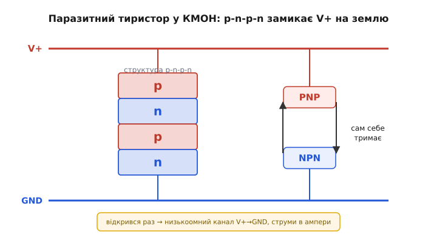
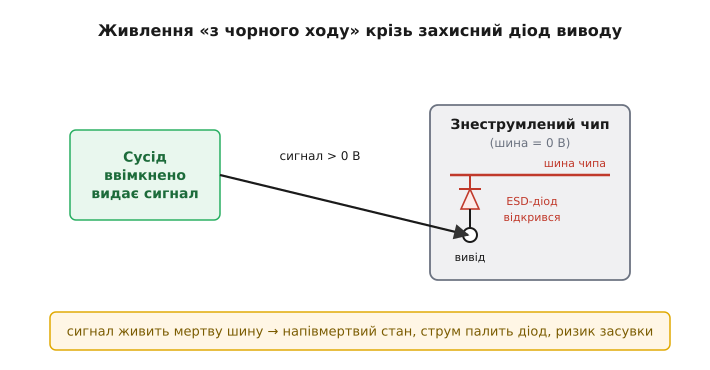
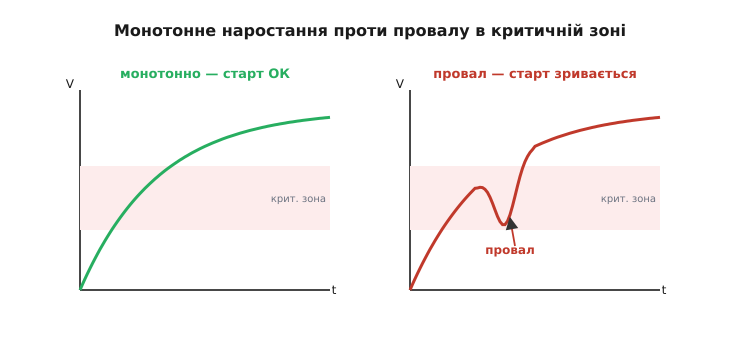
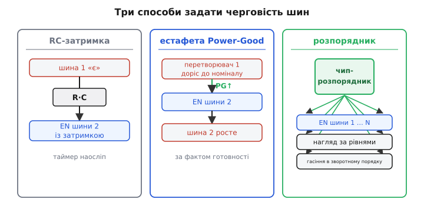

# Черговість увімкнення шин живлення

Сучасна мікросхема рідко живиться від однієї напруги. Усередині процесора, FPGA чи навіть скромного мікроконтролера з радіоблоком співіснують **кілька шин живлення** (англ. *power rail* — «рейка живлення»): ядро на 0.9 В, цифрові виводи на 1.8 чи 3.3 В, аналогова частина на 1.2 В, інколи окрема пам'ять. І виявляється, що цим шинам **не однаково, у якому порядку вмикатися**. Подаси напруги «абияк» — і чип може зависнути, нагрітися, а інколи й згоріти ще до того, як виконає бодай один такт. Черговість увімкнення (*power sequencing*) — це інженерна дисципліна, яка стежить, щоб напруги наростали в правильному порядку й правильно гасли.

Звучить як дрібниця: ну подали живлення, чого там перейматися порядком? Та за цією дрібницею стоять цілком фізичні механізми руйнування, і саме з них варто почати — бо коли побачиш, **чому** неправильний порядок небезпечний, правила перестануть бути магією.

### Чому одна напруга — це вже минуле

Колись логіка жила на одній шині: TTL — суто 5 В, і край. Та з кожним поколінням транзистори меншали, а тонкий підзатворний діелектрик уже не витримував 5 В — його довелося рятувати, знижуючи напругу ядра. Так ядро поповзло вниз: 3.3 → 2.5 → 1.8 → 1.2 → 0.9 В і нижче. А от **виводи** мусили лишатися сумісними із зовнішнім світом — пам'яттю, давачами, іншими чипами, що досі говорять мовою 1.8 чи 3.3 В. Звідси й розкол: одне **ядро** з низькою напругою (там мільйони транзисторів, там потрібна економність) і окремий **інтерфейс виводів** із вищою (там треба «дотягтися» до сусідів).

Дві напруги живлять **той самий кремній**, ті самі переходи між областями. І ось тут починається фізика: доки обидві шини в нормі, переходи зміщені як належить. Та в **перехідну мить** увімкнення, коли одна шина вже є, а друга ще ні, всередині чипа виникають напруги, на які його не розраховували. Саме ця асиметрія — корінь усіх бід черговості.

> 🔧 **Навіщо це.** Тримаючи в руках процесорну чи FPGA-плату, ви побачите біля головного чипа не один, а **три-п'ять перетворювачів** живлення. Це не примха розробника — це наслідок розколу на ядро й виводи. І щойно шин стало більше однієї, питання «хто перший» перестало бути риторичним: воно вписане в даташит чипа окремим розділом, і знехтувати ним — означає підписатися під загадковими відмовами, які потім місяцями ловлять у полі.

### Перша загроза: засувка (latch-up)

Найгрізніший механізм має назву **засувка** (*latch-up* — «защіпнутися»). Щоб його зрозуміти, треба зазирнути в структуру звичайної КМОН-логіки (CMOS).

Поряд лежать транзистор p-типу й транзистор n-типу — пара областей із чергуванням домішок: p-n-p-n. А чотиришарова структура p-n-p-n — це **тиристор** (точніше, паразитний SCR, *silicon controlled rectifier*): два біполярні транзистори, вкладені один в одного так, що колектор кожного живить базу іншого. У нормальному житті цей паразитний тиристор спить — обидва його транзистори закриті. Та він має лиху властивість: варто його **підпалити** (відкрити бодай один із транзисторів), як він **сам себе тримає відкритим** — колекторний струм одного підживлює базу другого, той ще дужче відкриває перший, і так по колу. Утворюється **низькоомний шлях прямо з плюса живлення на землю**, крізь який ллється струм у кілька ампер. Чип розжарюється й гине — а зняти засувку можна лише, **знявши живлення повністю**.


*У кожній КМОН-парі ховається паразитний тиристор — два біполярні транзистори, з'єднані регенеративно. У нормі він закритий, та зайва напруга на виводі чи неправильна черговість шин відкриває його, і він замикає V+ на землю низькоомним каналом. Зняти засувку можна лише повним вимкненням живлення.*

А що ж його підпалює? Найчастіше — **струм, упорснутий у підкладку** там, де його не мало бути. І неправильна черговість шин — пряма дорога до цього. Уяви: шина виводів (1.8 В) уже піднялася, а ядро (0.9 В) ще лежить на нулі. Захисні діоди й переходи всередині чипа з'єднують ці області; коли між ними виникає напруга «не в той бік», через перехід тече струм у підкладку — і це той самий запал, що відкриває паразитний тиристор. Тому даташит і вимагає: ядро вмикай **раніше** (або хоча б не пізніше) за виводи, щоб у перехідну мить переходи були зміщені безпечно.

> 📜 Засувку відкрили не вчора — вона переслідує КМОН-схеми від самого їх народження в 1960-х і свого часу мало не поховала цілу технологію. Як інженери приборкали паразитний тиристор охоронними кільцями та епітаксійною підкладкою, і чому ця боротьба триває й досі, — у вставці [Засувка: ворог, що ледь не вбив КМОН](topic:electronics/power-sequencing/hist-latchup.md).

### Друга загроза: живлення «з чорного ходу»

Друга біда тонша й підступніша. Коротко: **знеструмлений чип може ожити через власний вивід** — і це майже завжди погано.

Кожен цифровий вивід має **захисні діоди** від статики (ESD): один — на шину живлення, другий — на землю. У нормі вони закриті й непомітні. Та коли на вивід **знеструмленого** чипа приходить сигнал від сусіда, що **вже працює**, цей сигнал виявляється вищим за (нульову поки що) шину живлення. Верхній захисний діод відкривається — і сигнал **починає живити шину чипа крізь власний вивід**, з чорного ходу.


*Захисний діод виводу від статики в нормі закритий. Та якщо чип знеструмлено, а на його вивід приходить сигнал від ввімкненого сусіда, цей сигнал перевищує мертву шину живлення — діод відкривається й живить чип «з чорного ходу». Шина оживає частково, чип у напівмертвому стані, а струм крізь діод може його пошкодити чи відкрити засувку.*

Наслідки погані з усіх боків. По-перше, шина «оживає» частково — до напруги на одне діодне падіння нижчої за сигнал, — і чип опиняється в напівмертвому стані: ні ввімкнений, ні вимкнений, виводи в невизначеному стані, логіка в безладі. По-друге, увесь струм цього сигналу тече крізь крихітний захисний діод, не розрахований на тривалий струм, — діод може **перегоріти**, а сам струм здатен **відкрити засувку**. По-третє, коли шину нарешті ввімкнуть по-справжньому, чип може застрягнути в дивному стані, бо «прокинувся» не з нуля.

Звідси правило, дзеркальне до засувкового: **не подавай сигнал на виводи чипа раніше, ніж піднялася його шина живлення**. На рівні системи це означає, що порядок увімкнення кількох чипів на платі теж має значення — не можна ввімкнути «балакучого» сусіда до того, як прокинувся той, із ким він говорить. Найчастіше це зводять до простого: спершу всі шини живлення цілого вузла, **потім** дозвіл на роботу інтерфейсів (скидання знімають останнім).

> 🔌 Тримати знеструмлений чип ізольованим від ввімкнених сусідів допомагає окремий клас деталей — **аналогові ключі** та **буфери з контролем напрямку**, що розривають сигнальний шлях, доки живлення не в нормі. Як вони влаштовані й коли ставити саме їх — у вставці [Розв'язка шин: ключі й буфери, що не живлять з чорного ходу](topic:electronics/power-sequencing/comp-isolation-switch.md).

### Монотонність: рости рівно, без сходинок

Мало увімкнути шини в правильному **порядку** — кожна ще й має наростати **монотонно**: вгору й тільки вгору, без провалів і горбів на шляху. Чому це важить?

Усередині чипа є **схеми скидання** й **детектори живлення**: вони стежать за напругою ядра й у певний момент «відпускають» логіку в робочий стан. Зазвичай це відбувається на півдорозі — десь між 0.5 і 0.9 В на ядрі, де чип ініціалізує внутрішні тригери у визначений стан. Якщо напруга в цій зоні **просідає назад** (скажімо, через кидок струму, що перевантажив перетворювач), детектор бачить «то є живлення, то нема» — і логіка ініціалізується **двічі** або застрягає в half-стані. Чип може взагалі не запуститися, хоча шина зрештою й дійде до номіналу.


*Зліва — правильне монотонне наростання шини ядра: вгору без провалів. Справа — провал у критичній зоні (≈0.5–0.9 В), де чип ініціалізує логіку: детектор живлення бачить «впало–піднялося», ініціалізація зривається, чип не стартує. Шина мусить рости рівно крізь усю цю зону.*

Звідси два практичні наслідки. Перший: перетворювач має тримати напругу **під навантаженням**, без провалу від кидка струму при старті. Другий, ширший: монотонність — це причина, чому шини **рознесли в часі**. Якщо ввімкнути всі п'ять перетворювачів **одночасно**, їхні пускові струми (*inrush* — зарядка всіх вхідних конденсаторів) складуться в один велетенський кидок, просадять спільне вхідне живлення — і котрась шина просяде в критичній зоні. Рознесеш старти на десятки мілісекунд — кидки не накладаються, кожна шина наростає рівно. Тож черговість убиває двох зайців: і зміщує переходи безпечно, і приборкує пусковий струм.

### Як насправді задають черговість

Теорія зрозуміла; лишається інструментарій. Як змусити одну шину дочекатися іншої? Є кілька рівнів — від копійчаного до промислового.

**Найпростіше — затримка RC на дозволі.** Майже кожен перетворювач має вивід *Enable* (дозвіл): високий рівень — працюй, низький — спи. Заведи на цей вивід сигнал «живлення є» з попередньої шини через [ланку RC](topic:electronics/rc-time-constant) — і друга шина ввімкнеться з затримкою, рівною кільком сталим часу τ = R·C. Дешево й сходить для двох-трьох некритичних шин.

**Надійніше — за сигналом готовності (Power-Good).** Серйозні перетворювачі дають вивід *PG* (*Power-Good*): він піднімається, **коли вихід уже досяг номіналу**. З'єднай PG першої шини з Enable другої — і друга стартує не «через стільки-то часу», а **точно тоді, коли перша вже готова**. Це **естафета**: кожна шина, доростаючи, дозволяє наступну. Надійніше за RC, бо реагує на справжню напругу, а не на сліпий таймер.

**Промислово — окрема мікросхема-розпорядник.** Коли шин багато (а в серйозному FPGA їх буває з десяток) і потрібні точні затримки, нагляд за рівнями та правильне **гасіння**, ставлять [спеціалізований розпорядник живлення](topic:electronics/power-sequencing/comp-sequencer-ic.md) — окремий чип, що керує вивідами Enable усіх перетворювачів за заданою програмою, стежить за кожною шиною й при збої коректно все вимикає в зворотному порядку. Це багатоканальний диригент усього живлення плати.


*Від простого до промислового. RC-затримка на Enable: дешево, для кількох некритичних шин. Естафета Power-Good: PG першої шини дозволяє другу — реагує на справжню напругу. Розпорядник: окремий чип диригує вивідами Enable усіх перетворювачів за програмою й стежить за рівнями.*

> 🔧 **Навіщо це.** Вибір способу — це баланс ціни й контролю. Дві шини на простій платі — досить RC чи однієї лінії Power-Good, нічого не ускладнюй. Складна плата з процесором, пам'яттю й радіо — бери розпорядник: він не лише вмикає по черзі, а й **сторожить** кожну шину й гасить усе ладком, коли щось пішло не так. Головне — **не лишай порядок на волю випадку**: «само якось увімкнеться» працює, доки не працює, а тоді відмова плаває від плати до плати й від морозу до спеки, і шукати її — мука.

### Інколи порядок задає сам мікроконтролер

На платі з мікроконтролером часто саме він — диригент дрібного живлення: вмикає периферійні шини своїми вивідами в потрібному порядку вже з прошивки. Тоді черговість живе не в залізі, а в коді стартової послідовності.

Скажімо, спершу маємо ввімкнути шину давачів, зачекати, доки вона усталиться, тоді — шину радіо, і лише потім дозволити обмін. Кожна шина керується вивідом Enable свого перетворювача:

**Приклад. Послідовний пуск двох шин із паузами на усталення.**
:::tabs
```cpp
// Вивід EN кожного перетворювача керує його шиною: 1 — увімкнено.
#define EN_SENSORS  GPIO_PIN(B, 0)   // шина давачів, 1.8 В
#define EN_RADIO    GPIO_PIN(B, 1)   // шина радіо, 3.3 В

void power_up_sequence(void) {
    gpio_low(EN_SENSORS);
    gpio_low(EN_RADIO);              // старт: усе вимкнено

    gpio_high(EN_SENSORS);           // 1) перша шина
    delay_ms(5);                     //    пауза на усталення й inrush

    gpio_high(EN_RADIO);             // 2) друга шина — лише тепер
    delay_ms(5);

    radio_enable_interface();        // 3) дозвіл на обмін — останнім
}
```
```python
from machine import Pin
import time

# Вивід EN кожного перетворювача керує його шиною: 1 — увімкнено.
en_sensors = Pin('B0', Pin.OUT)      # шина давачів, 1.8 В
en_radio   = Pin('B1', Pin.OUT)      # шина радіо, 3.3 В

def power_up_sequence():
    en_sensors.value(0)
    en_radio.value(0)                # старт: усе вимкнено

    en_sensors.value(1)              # 1) перша шина
    time.sleep_ms(5)                 #    пауза на усталення й inrush

    en_radio.value(1)                # 2) друга шина — лише тепер
    time.sleep_ms(5)

    radio_enable_interface()         # 3) дозвіл на обмін — останнім
```
:::
Порядок дій тут — це і є черговість: спершу одна шина, пауза, тоді друга, і **наприкінці** дозвіл на роботу інтерфейсів. Пауза `delay_ms(5)` дає шині дорости до номіналу й розводить пускові струми в часі, щоб вони не наклалися.

Та сліпа пауза — це той самий «таймер наосліп», що й RC: вгадуєш час із запасом. Надійніше **дочекатися справжньої напруги** — почитати сигнал Power-Good перетворювача (або зміряти шину власним АЦП) і йти далі лише по факту готовності:

**Приклад. Чекати готовності шини за сигналом Power-Good, а не наосліп.**
:::tabs
```cpp
#define PG_SENSORS  GPIO_PIN(C, 0)   // Power-Good шини давачів (вхід)

// Чекати, доки шина підтвердить готовність; не зависати назавжди.
static bool wait_power_good(gpio_t pg, uint32_t timeout_ms) {
    while (timeout_ms--) {
        if (gpio_read(pg)) return true;   // шина дійшла номіналу
        delay_ms(1);
    }
    return false;                          // не піднялася — несправність
}

void power_up_sequence(void) {
    gpio_high(EN_SENSORS);
    if (!wait_power_good(PG_SENSORS, 50)) {
        fault_shutdown();                  // шина не встала — гасимо все
        return;
    }
    gpio_high(EN_RADIO);
    // ... далі за тією ж схемою
}
```
```python
from machine import Pin
import time

pg_sensors = Pin('C0', Pin.IN)       # Power-Good шини давачів (вхід)

# Чекати, доки шина підтвердить готовність; не зависати назавжди.
def wait_power_good(pg, timeout_ms):
    deadline = time.ticks_add(time.ticks_ms(), timeout_ms)
    while time.ticks_diff(deadline, time.ticks_ms()) > 0:
        if pg.value():                 # шина дійшла номіналу
            return True
        time.sleep_ms(1)
    return False                       # не піднялася — несправність

def power_up_sequence():
    en_sensors.value(1)
    if not wait_power_good(pg_sensors, 50):
        fault_shutdown()               # шина не встала — гасимо все
        return
    en_radio.value(1)
    # ... далі за тією ж схемою
```
:::
Тут пуск рухається **за фактом**: наступний крок настає, тільки коли попередня шина підтвердила номінал. А якщо за розумний час (50 мс) готовності нема — це **несправність** (коротке замикання, перевантаження), і правильна реакція — не йти далі, а **погасити все**. Сторожовий час (timeout) рятує від вічного зависання в циклі очікування.

> 🔧 **Навіщо це.** Прошивковий пуск — гнучкий і безкоштовний (жодних зайвих деталей), доки мікроконтролер сам живиться **першим** і встигає прокинутися раніше за все. Але є межа: він не вбереже шини в **перші мілісекунди**, поки не виконав код, і не погасить їх, якщо сам завис. Тому критичну черговість (особливо для процесора, що живить **сам** мікроконтролер) лишають апаратному розпорядникові, а прошивкою керують лише тим, що вмикається **після** і **під наглядом** уже живого мікроконтролера.

### Гасити — у зворотному порядку

Черговість — не лише про ввімкнення. **Вимикати** шини теж треба ладком, і здебільшого — **у зворотному порядку**: останньою ввімкнули — першою гаси.

Логіка та сама, що при пуску, лише навспак. Поки виводи ще під сигналом від сусідів, не можна першою знімати **їхню** шину — бо знов отримаєш живлення з чорного ходу й засувку, тепер уже на спаді. Тож спершу знімають дозвіл на обмін і шину виводів, а **ядро гасять останнім** — щоб до останньої миті переходи лишалися зміщені безпечно. На спаді ховається й окрема каверза: коли живлення зникає **раптово** (висмикнули штекер), шини сідають із різною швидкістю — залежно від ємності та навантаження кожної, — і на коротку мить можуть опинитися в забороненому порядку. Тому надійні розпорядники гасять шини **активно**, розряджаючи їх у заданій послідовності, а не лишають згасати самопливом.

Зведімо все докупи. Черговість шин живлення стоїть на двох фізичних страхах — **засувці** (паразитний тиристор, що замикає живлення на землю) і **живленні з чорного ходу** (сигнал оживляє мертвий чип крізь захисний діод) — плюс на вимозі **монотонного** наростання, без якого зривається внутрішнє скидання. Звідси троє правил: ядро — раніше за виводи; сигнал — не раніше за живлення приймача; а гасити — у зворотному порядку. Інструмент під це добирають за складністю: від RC-затримки на дозволі до естафети Power-Good й окремого чипа-розпорядника. Дотримався цих правил — чип щоразу прокидається чистим; знехтував — і ловитимеш привидів, що з'являються лише на одній платі з десяти й лише в певну погоду.
