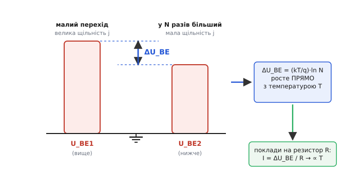
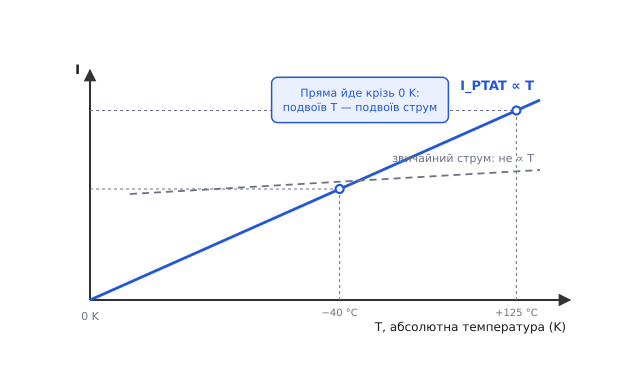

# PTAT-джерело струму

Майже всю свою інженерну кар'єру ви боретеся з температурою: струми «пливуть», падіння на переходах сповзають, опорна напруга гуляє від тепла. Тому дивно почути, що буває джерело струму, яке навмисне зроблено температурозалежним — і саме в цьому його цінність. Воно віддає струм, **точно пропорційний абсолютній температурі**: нагрів кристал удвічі за абсолютною шкалою — і струм став удвічі більшим, охолоди — упав так само рівно. Англійці позначають це абревіатурою **PTAT** (*proportional to absolute temperature* — пропорційний абсолютній температурі), і вона прижилася всюди.

Навіщо такий струм? Дві причини, і обидві серйозні. По-перше, струм, що лінійно йде за температурою, — це готовий **термометр** на кристалі: виміряв його — знаєш, наскільки гарячий чип. По-друге (і це головне для аналогового кремнію), цим струмом «підпирають» опорну напругу. Звичайне падіння на p-n-переході з нагрівом **спадає** — десь на 2 мілівольти на кожен градус. Якщо до нього додати щось, що з тією самою температурою **росте**, два сповзання гасять одне одного, і на виході — напруга, що майже не залежить від тепла. Це і є серце [бандгеп-опору](book:electronics/voltage-reference-sources): один доданок падає, PTAT-доданок піднімається, сума стоїть. Тож PTAT-джерело — не екзотика, а робочий вузол усередині кожного другого аналогового чипа.

Розберімо, звідки взагалі взяти струм, що так слухняно йде за температурою, — і чому це виходить майже задарма з пари звичайних транзисторів.


*Уся ідея на одній картинці. Женемо однаковий струм крізь малий перехід і крізь у N разів більший — у меншого щільність струму вища, тож і падіння U_BE вище. Різниця ΔU_BE між ними дорівнює (kT/q)·ln N і росте прямо з абсолютною температурою. Поклади цю різницю на резистор R — і дістанеш струм I = ΔU_BE / R, теж пропорційний температурі.*

## Звідки взяти «температуру» в чистому вигляді

Перший порух — узяти будь-що температурозалежне й зробити з нього струм. Але більшість «пливучих» речей пливуть **криво**: падіння на переході спадає майже лінійно, але з вигином і з розкидом від партії до партії; опір резистора міняється по-своєму. Нам же потрібен струм, що йде за температурою **чисто, передбачувано й однаково в кожному екземплярі** — інакше термометр бреше, а бандгеп не балансується.

І тут на допомогу приходить разюче чиста фізична величина — **тепловий потенціал** (англ. *thermal voltage*), який позначають U_T:

```
U_T = k·T / q
```

Тут k — стала Больцмана (1.38·10⁻²³ Дж/К), q — заряд електрона (1.6·10⁻¹⁹ Кл), T — **абсолютна** температура в кельвінах. Гляньте на формулу: у ній немає жодної властивості конкретного кремнію, жодного параметра, що гуляє від партії до партії, — лише дві світові сталі й температура. U_T **за визначенням** пропорційний абсолютній температурі; при кімнатних 300 K він дорівнює приблизно 25.85 мілівольта (на практиці кажуть «близько 26 мВ»). Ось ця величина — найчистіше «втілення температури» в електроніці: якби ми вміли просто взяти U_T і перетворити його на струм, проблему було б розв'язано.

> 🔧 **Навіщо це.** U_T — не абстракція з підручника, а число, яке інженер тримає в голові щодня. Воно сидить у рівнянні діода й транзистора (`I ≈ I_S·exp(U_BE/U_T)`), задає крутість підсилювального каскаду, визначає теплові шуми. А ще саме його пропорційність температурі дає нам безкоштовний еталон «скільки зараз градусів» прямо в кремнії — без жодного зовнішнього давача. PTAT-джерело — це і є машинка, що дістає U_T назовні у вигляді струму.

Біда лише в тім, що U_T голіруч не вхопиш: він захований **усередині** експоненти, що зв'язує струм транзистора з його напругою база-емітер. Виміряти саму U_BE — означає зловити не U_T, а ціле падіння переходу разом з усім кремнієвим «брудом» (струмом насичення I_S, що сам по собі дико залежить від температури й матеріалу). Потрібен хід, який **витягне з-під експоненти чистий U_T**, а весь кремнієвий бруд відкине.

## Головний фокус: різниця двох падінь

Хід цей напрочуд елегантний. Візьмемо **два** транзистори й проженемо крізь них струм так, щоб **щільність струму** (струм на одиницю площі переходу) у них була різна. Найпростіше — зробити їх різного розміру: один звичайний, другий у N разів більший за площею переходу, а струм у них **однаковий**. Тоді в більшого та сама кількість струму розмазана по в N разів більшій площі — щільність у нього в N разів менша.

Тепер пригляньмося до напруг. Кожен транзистор підкоряється експоненційному закону [робота BJT](book:electronics/bjt-operation): струм колектора експоненційно залежить від U_BE. Розгорнімо це навпаки — яка U_BE потрібна, щоб пропустити заданий струм:

```
U_BE = U_T · ln( I_C / I_S )
```

Тут I_S — струм насичення, той самий «кремнієвий бруд»: він залежить від площі переходу, від легування, і шалено від температури. У великого транзистора площа в N разів більша, отже і його I_S у N разів більший. А тепер — ключовий момент — порахуймо **різницю** U_BE двох транзисторів, крізь які тече **однаковий** струм I:

```
ΔU_BE = U_BE1 − U_BE2
      = U_T·ln(I / I_S1) − U_T·ln(I / I_S2)
      = U_T · ln( I_S2 / I_S1 )
```

Дивіться, що сталося. Однаковий струм I у чисельниках **скоротився**. Лишилося лише відношення струмів насичення — а воно дорівнює відношенню площ, тобто просто N. І весь жахливий температурний хвіст I_S теж скоротився: він входив **однаково** в обидва доданки (транзистори ж поруч, на одному кристалі, з тим самим процесом), тож у різниці зник без сліду. Те, що лишилося, — кришталево чисте:

```
ΔU_BE = U_T · ln(N) = (k·T / q) · ln(N)
```

Ось воно. Різниця двох падінь база-емітер дорівнює тепловому потенціалу, помноженому на сталий логарифм відношення площ. Кремнієвий бруд відкинуто, а пропорційність абсолютній температурі — у нас у руках, бо ln(N) — стале число, а U_T ∝ T. Фокус у тому, що ми ніколи не вимірювали жодну U_BE поодинці — ми взяли **різницю**, і в ній усе паразитне самознищилося, лишивши голу фізику.

> 🔧 **Навіщо це.** Прийом «бери різницю однакових падінь, щоб скоротити паразитне» — один з найпотужніших в аналоговому проєктуванні, далеко за межами PTAT. Так само працює [диференційна пара](book:electronics/opamp-input-stage) (скорочує синфазну заваду), так само вимірюють малі сигнали на тлі великих зсувів. Тут це дає головне: величину, що залежить **лише** від температури й геометрії, яку на чипі витримують з точністю до часток відсотка, — і ні від чого більше.

Чому саме логарифм, а не щось простіше? Бо експонента переходу невблаганна: щоб подвоїти струм, треба додати до U_BE лише крихітні ≈18 мВ (це U_T·ln2). Тож відмінність щільності навіть у 8 разів дає різницю U_BE усього близько 54 мВ при кімнатній температурі. ΔU_BE — величина **мала** (десятки мілівольтів), і це доведеться пам'ятати: на тлі шумів і зсувів її треба обробляти акуратно.

**Worked-приклад: яка виходить ΔU_BE.** Беремо відношення площ N = 8 — поширений вибір, бо вісім однакових транзисторів зручно розкласти на кристалі квадратом 3×3 з одним у центрі для гарного узгодження. Рахуємо різницю падінь при кімнатних 300 K:

```
U_T  = k·T/q = 1.38e-23 · 300 / 1.6e-19
U_T  ≈ 0.02585 В   (≈ 25.85 мВ)

ΔU_BE = U_T · ln(8)
ΔU_BE = 0.02585 · 2.079
ΔU_BE ≈ 0.0538 В    (≈ 53.8 мВ)
```

А головне — як ця різниця повзе з температурою. Її нахил:

```
d(ΔU_BE)/dT = (k/q)·ln(N) = (1.38e-23 / 1.6e-19) · 2.079
            ≈ 0.0862 мВ/К · 2.079
            ≈ 0.179 мВ на кожен градус
```

Тобто від −40 °C до +125 °C (діапазон 165 градусів) ΔU_BE виросте приблизно на 165 · 0.179 ≈ 29.6 мВ — рівно, лінійно, передбачувано. Ось цю поведінку ми й перетворимо на струм.

## Як зробити з різниці напруг струм

ΔU_BE — це різниця потенціалів. Щоб перетворити її на струм, є найпрямолінійніший спосіб у всій електроніці: **прикласти її до резистора**. За законом Ома струм крізь резистор дорівнює напрузі на ньому, поділеній на опір. Якщо влаштувати схему так, щоб саме ΔU_BE падало рівно на одному резисторі R, то крізь нього потече:

```
I = ΔU_BE / R = U_T·ln(N) / R = (k·T / q) · ln(N) / R
```

Сталі — k, q, ln(N), R — усі поза температурою (резистор теж дрейфує з теплом, і це окрема осторога). Лишається чистий множник T. **Струм пропорційний абсолютній температурі.** Ми дістали PTAT-струм.

Лишилося влаштувати схему, де ΔU_BE сама собою опиняється на резисторі. Робить це красива самозмикаюча конструкція, яку звуть **ΔU_BE-джерелом** (англ. *delta-V_BE current source*) — саме воно лежить в основі майже всіх PTAT-генераторів.


*Самозміщене ΔU_BE-джерело. Верхнє [дзеркало струмів](book:electronics/current-mirror) на P1, P2 силоміць тримає в обох гілках однаковий струм. Унизу — два NPN різного розміру: Q1 одиничний, Q2 у N разів більший. Більший транзистор за того самого струму просить меншу U_BE, тож надлишок ΔU_BE = (kT/q)·ln N лишається на резисторі R у його емітері. Це й задає струм I = ΔU_BE / R, який повторюється в обох гілках і який дзеркало роздає далі по чипу.*

## Чому схема сама знаходить потрібний струм

Простежмо логіку, бо саме в ній уся краса. Зверху стоїть [дзеркало струмів](book:electronics/current-mirror) — пара, що змушує **обидві** вертикальні гілки нести однаковий струм, хоч би що було під ними. Унизу — два NPN: лівий Q1 звичайний, правий Q2 у N разів більший. Між ними тільки одна несиметрія: у емітер Q2 врізаний резистор R, а Q1 сидить емітером прямо на землі.

Тепер уявімо, що крізь обидві гілки тече якийсь струм I (його однаковість гарантує дзеркало). Лівий Q1, маленький, щоб пропустити цей I, просить певну U_BE1. Правий Q2, великий, за того самого I має нижчу щільність струму — і просить меншу U_BE2. Але бази обох транзисторів зав'язані в один вузол, тобто **напруга на базах у них спільна**. Як це узгодити? Дуже просто: різницю компенсує резистор. На R падає рівно стільки, скільки не вистачає, — а не вистачає якраз ΔU_BE = U_BE1 − U_BE2. Схема **сама** встановлює такий струм I, за якого падіння на R дорівнює ΔU_BE, що цьому ж струмові відповідає. Інакше рівновага не зійдеться.

Це самоузгодження — серце конструкції. Ніхто не задає струм ззовні: дзеркало зверху каже «у двох гілках струм однаковий», транзистори знизу кажуть «тоді на резисторі мусить бути ΔU_BE», і єдина точка, де обидві умови виконуються, дає `I = U_T·ln(N) / R`. Схема ловить саме її. (Така петля має одну підступну рису: у неї є й друга рівновага — нульовий струм, коли все знеструмлено й нічого не запускається. Тому поряд завжди ставлять крихітну [старт-схему](book:electronics/bandgap-startup), що «штовхає» осередок з мертвої точки в робочу при ввімкненні живлення.)

**Worked-приклад: підбір резистора під заданий струм.** Хочемо PTAT-струм 10 мкА при кімнатній температурі з відношенням площ N = 8. При 300 K різниця падінь дає ΔU_BE ≈ 53.8 мВ (це U_T·ln 8). Тоді резистор:

```
R = ΔU_BE / I = 0.0538 / 10e-6
R ≈ 5380 Ом   →   беремо 5.4 кОм
```

Перевірити проєктну арифметику зручно прямо в коді прошивки — наприклад, коли калібруємо вузол або рахуємо очікуваний струм для самоперевірки:

:::tabs
```cpp
#include <cmath>

// Тепловий потенціал k*T/q при заданій абсолютній температурі (К), у вольтах.
double thermal_voltage(double T_kelvin)
{
    constexpr double k = 1.380649e-23;   // стала Больцмана, Дж/К
    constexpr double q = 1.602177e-19;   // заряд електрона, Кл
    return k * T_kelvin / q;             // U_T = k*T/q
}

// PTAT-струм ΔU_BE-джерела: I = U_T*ln(N)/R.
// N — відношення площ переходів, R — резистор у емітері (Ом).
double ptat_current(double T_kelvin, double N, double R_ohm)
{
    double u_t = thermal_voltage(T_kelvin);
    return u_t * std::log(N) / R_ohm;    // ∝ T, бо U_T ∝ T
}
// ptat_current(300.0, 8.0, 5400.0) -> ~9.96 мкА при 300 K (27 °C)
// ptat_current(398.0, 8.0, 5400.0) -> ~13.2 мкА при 398 K (125 °C)
```
```python
import math

# Тепловий потенціал k*T/q при заданій абсолютній температурі (К), у вольтах.
def thermal_voltage(T_kelvin):
    k = 1.380649e-23   # стала Больцмана, Дж/К
    q = 1.602177e-19   # заряд електрона, Кл
    return k * T_kelvin / q   # U_T = k*T/q

# PTAT-струм ΔU_BE-джерела: I = U_T*ln(N)/R.
# N — відношення площ переходів, R — резистор у емітері (Ом).
def ptat_current(T_kelvin, N, R_ohm):
    u_t = thermal_voltage(T_kelvin)
    return u_t * math.log(N) / R_ohm   # ∝ T, бо U_T ∝ T

# ptat_current(300.0, 8.0, 5400.0) -> ~9.96 мкА при 300 K (27 °C)
# ptat_current(398.0, 8.0, 5400.0) -> ~13.2 мкА при 398 K (125 °C)
```
:::

Зверніть увагу на два останні рядки: підняли температуру з 300 K до 398 K (на коефіцієнт 1.327) — і струм виріс рівно в стільки ж разів. Це і є PTAT у дії.

Повну строгу викладку — як скорочується струм насичення з усім його хитрим температурним хвостом, звідки береться рівно (k/q)·ln(N) і які доданки другого порядку трохи псують ідеальну лінійність (та сама «кривина», що змушує бандгеп робити поправку) — винесено в окремий [розбір математики ΔU_BE](book:electronics/ptat-current-source/math-ptat-derivation.md). Для робочого розуміння досить головного: різниця падінь дорівнює U_T·ln(N), а резистор робить з неї струм.

## «Пропорційний» — не те саме, що «росте»

Варто наголосити на слові в самій назві, бо тут ховається суть. PTAT-струм не просто **збільшується** з нагрівом — він збільшується **пропорційно**, тобто строго лінійно й так, що уявна пряма проходить **крізь нуль абсолютної шкали**. При 0 кельвінів струм був би нульовий; при подвоєнні абсолютної температури він точно подвоюється. Це принципово відрізняє його від «просто температурозалежного» струму, який теж міняється з теплом, але по своїй кривій і не через початок координат.


*Характеристика PTAT-струму — пряма крізь початок координат: подвоїв абсолютну температуру, подвоїв струм. У робочому діапазоні (−40…+125 °C, тобто 233…398 K) струм проходить дві позначені точки строго на цій прямій. Для контрасту — «звичайний» струм від резистора з живлення (пунктир): теж дрейфує з теплом, але по своїй пологій кривій, не через нуль і не пропорційно.*

Чому ця строгість важлива? Бо саме вона дає змогу **точно скомпенсувати** протилежний дрейф. Падіння на p-n-переході спадає з температурою майже лінійно — таку величину звуть **CTAT** (*complementary to absolute temperature* — додатна до абсолютної температури, тобто з протилежним знаком нахилу). Якщо до CTAT-доданка з нахилом близько −2 мВ/К додати PTAT-доданок з відповідним додатним нахилом, два лінійні дрейфи гасять один одного, і сума виходить майже плоскою. А «майже» лінійні криві так чисто не складаються — лишився б помітний залишок. Уся точність бандгеп-опору тримається на тому, що PTAT — саме **пропорційний**, а не абияк зростаючий.

> 🔧 **Навіщо це.** Коли проєктувальник балансує опорну напругу, він підганяє **нахил** PTAT-доданка (через відношення площ N і номінал резистора), щоб той точно дорівнював за модулем нахилу CTAT-падіння. Зійшлися нахили — температурний дрейф опорної напруги падає з тисяч до одиниць проміле на градус. Якби PTAT був «просто зростаючим», а не строго лінійним крізь нуль, така компенсація працювала б лише в одній точці, а поза нею знову розповзалася. Пропорційність — це те, що робить компенсацію дієвою в усьому діапазоні.

## Чого стерегтися на практиці

Картина проста, але чесний інженер знає її межі.

**Резистор сам дрейфує.** Струм у нас I = U_T·ln(N) / R, і якщо R теж міняється з температурою, то PTAT уже не такий чистий. Коли мета — рівний струм для термометра, це проблема: дрейф R домішується до сигналу. Та коли PTAT іде в бандгеп, природа часто рятує: PTAT-струм і CTAT-падіння часто розвивають на **тому самому типі** резистора, і його дрейф входить в обидва доданки, частково скорочуючись. Тому в бандгепі вибір типу резистора — не дрібниця, а частина балансу.

**ΔU_BE — мала величина.** Десятки мілівольтів на тлі зсувів дзеркала й транзисторів. Невеликий паразитний зсув у пару мілівольтів — це вже відчутна частка від 50 мВ, і він прямо лізе в похибку струму. Тому прецизійні PTAT-осередки роблять із симетричним розкладанням транзисторів і дбають про узгодження пар; груба збірка дасть струм з помітним відхиленням від ідеальної прямої.

**Узгодження пар — це все.** Уся магія трималася на тому, що струми насичення двох транзисторів скорочуються в різниці. Скоротяться вони чисто, лише якщо транзистори **справді однакові** (з точністю до запланованого N) і **в однаковій температурі**. На кристалі це досяжно: їх вирощують поруч тим самим процесом. Тому-то відношення площ беруть «гарними» цілими (часто 8), а більший транзистор збирають із N однакових одиничних, розкладених симетрично навколо меншого, — щоб дрібні градієнти легування й температури по пластині усереднилися. Двійко окремих транзисторів з крамниці так не спарити: їхні I_S надто різні, та й гріються вони нарізно. Тому PTAT-джерело, як і [дзеркало струмів](book:electronics/current-mirror), живе **всередині** мікросхеми, а не паяється розсипом.

**Ефект Ерлі підгризає точність.** Реальні транзистори трохи збільшують струм зі зростанням напруги колектора — [ефект Ерлі](book:electronics/early-effect). Якщо колектори двох гілок сидять під різною напругою, у різницю U_BE домішується паразитна добавка, не пов'язана з температурою. Тому в добрих PTAT-осередках обидві гілки тримають за напругою однаковими (інколи навіть додатковим каскодом), щоб ефект Ерлі скоротився так само чисто, як скоротився I_S.

## Де воно живе

Раз зрозумівши PTAT-джерело, ви впізнаватимете його в кожному другому аналоговому чипі — воно одне з тих непомітних вузлів, на яких усе тримається.

**Серцевина бандгеп-опору.** Найголовніше призначення. PTAT-струм (або похідну від нього PTAT-напругу) додають до CTAT-падіння переходу — і дістають опорну напругу близько 1.2 В, що майже не дрейфує з температурою. Це той самий вольтаж, що сидить усередині будь-якого мікроконтролера як еталон для його АЦП, у кожному стабілізаторі напруги, у кожному прецизійному [джерелі опорної напруги](book:electronics/voltage-reference-sources). Без PTAT-доданка бандгеп не зібрати — саме він підпирає падіння, що спадає.

**Температурний давач на кристалі.** Якщо PTAT-струм пустити крізь відомий резистор (або взяти саму PTAT-напругу) і виміряти АЦП, дістанемо число, що лінійно йде за абсолютною температурою кристала, — готовий термометр без жодного зовнішнього компонента. Саме так влаштовані вбудовані давачі температури в мікроконтролерах і процесорах: вони стежать за нагрівом ядра й дають команду скинути частоту, поки чип не перегрівся.

**Зміщення, що компенсує температуру.** Іноді каскад навмисне зміщують PTAT-струмом, щоб його власний температурний дрейф погасити. Наприклад, [крутість (gm)](book:electronics/transconductance) біполярного транзистора обернено пропорційна U_T; якщо живити такий каскад струмом, пропорційним U_T (тобто PTAT), то U_T у формулі крутості скорочується — і підсилення перестає «плисти» з температурою. Дрібний, але улюблений прийом схемотехніків.

PTAT-джерело народилося не саме по собі, а як невіддільна частина бандгеп-опору: коли [Боб Відлар](book:electronics/voltage-reference-sources) 1971 року зробив перший придатний до виробництва бандгеп (осередок LM113), він мусив десь узяти доданок, що **росте** з температурою, — і взяв його з різниці U_BE двох транзисторів різної площі. Те, що цю різницю можна зробити чистим PTAT, він показав ще раніше, у середині 1960-х. Кількома роками пізніше Пол Брокау (Paul Brokaw) у класичній праці 1974 року «A simple three-terminal IC bandgap reference» подав витонченіший варіант осередку, що став основою для безлічі прецизійних опорів і досі живе в каталогах. (Це усталена історія напівпровідникової техніки.)

> 🔧 **Навіщо це.** PTAT-джерело — це «термометр у вигляді струму»: воно дістає назовні чисту, пропорційну абсолютній температурі величину з пари звичайних транзисторів, не вимагаючи жодної екзотики. Побачивши в схемі два NPN різного розміру зі спільними базами й резистором в емітері більшого, поверх яких сидить дзеркало, — знайте: це ΔU_BE-осередок, і його струм іде за температурою. Він підпирає опорну напругу в бандгепі, служить вбудованим давачем тепла й стабілізує зміщення каскадів. Уся точність тримається на двох спарених на одному кристалі транзисторах, а вся фізика — на тому, що різниця двох падінь U_BE скорочує паразитний кремнієвий бруд і лишає голий тепловий потенціал k·T/q.

Найкрасивіше тут — як з найбанальнішого матеріалу (два звичайні транзистори, один резистор) народжується величина небаченої чистоти: струм, прив'язаний до температури двома світовими сталими й нічим більше. Усе складне — узгодження пар, ефект Ерлі, дрейф резистора, старт-схема — лише уточнює, **наскільки** ідеально витримана ця пропорційність. Сама ж ідея лишається тією простою картинкою, з якої ми почали: різна щільність струму дає проміжок напруги, що росте з теплом, а резистор робить з нього струм.
