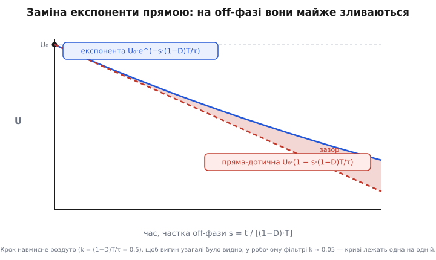
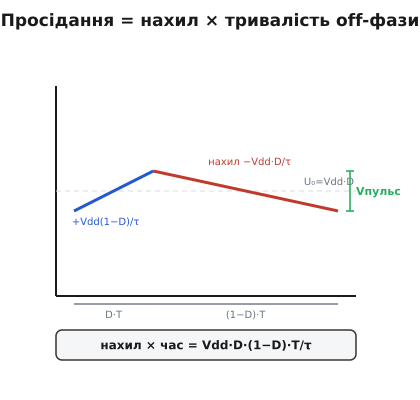

# 🧮 Розмах пульсацій із лінійного нахилу

Формула пульсацій ШІМ-ЦАП — Vпульс ≈ Vdd·D·(1−D)·T/τ — виглядає так, ніби її просто оголосили. Насправді за нею стоїть короткий, але точний хід думки, і в цьому ході ховається трюк, що його варто вміти робити руками: **там, де природа дає експоненту, на малому кроці її можна замінити прямою — і не помилитися навіть на десяту частку відсотка.** Розберімо це до дна. Спершу подивимося, чому чесний шлях через справжні експоненти заряду й розряду заводить у незугарну алгебру; тоді побачимо, що припущення τ ≫ T саме й існує, щоб ту алгебру не розв'язувати; виведемо компактну формулу з геометрії нахилу; і нарешті — найцікавіше — порахуємо точний розв'язок до кінця й переконаємося, що пряма дала практично той самий результат. Заразом стане видно, як те саме відношення T/τ ховається за ставленням частоти ШІМ до зрізу фільтра.

## Що саме ми міряємо

Спочатку домовмося, що таке «пульсації», щоб не плутати з перехідним процесом. Уявімо, що шпаруватість D давно стала й не змінюється. Конденсатор фільтра вже не «доходить» до якогось нового рівня — він **усівся в усталений цикл**: кожен період ШІМ напруга на ньому проходить рівно ту саму петлю. Поки імпульс увімкнено, конденсатор заряджається через резистор від живлення — напруга повзе вгору. Щойно імпульс вимикається, вхід падає до нуля, і конденсатор розряджається через той самий резистор назад до входу — напруга сповзає вниз. Через період усе повторюється тютілька в тютільку.

> 🔧 **Навіщо це.** Розрізняти усталену пульсацію й перехід — не педантизм, а різні числа для різних страхів. Пульсація — це **постійне** тремтіння, що сидить на виході завжди, поки ШІМ працює; його чують як гудіння в звуці, бачать як мерехтіння підсвітки, ловлять як заваду в АЦП. Перехід — це **разове** сповзання до нового рівня після зміни завдання; його міряють часом встановлення. Формула цієї вставки — про перше: про вічне тремтіння усталеного циклу, а не про те, як швидко вихід наздоганяє нову мету.

**Розмах пульсацій** (англ. *peak-to-peak ripple*) — це різниця між найвищою й найнижчою точкою цієї усталеної петлі: наскільки напруга піднялася за час «увімкнено» (вона ж — наскільки сповзла за «вимкнено», бо в усталеному циклі що набралося, те й стекло). Позначимо найвищу точку Uвис, найнижчу Uниз; шукаємо

```
Vпульс = Uвис − Uниз
```

Здавалося б, бери та й порахуй обидві точки чесно — через справжні криві заряду й розряду. Зробімо перший крок цим шляхом і подивимося, у що він виливається.

## Чесний шлях: дві експоненти, що зшиваються

Заряд і розряд конденсатора через резистор — це [експонента зі сталою часу τ = RC](topic:electronics/rc-time-constant): напруга не стрибає, а наближається до своєї цілі за законом 1 − e^(−t/τ) при заряді й e^(−t/τ) при розряді. Запишімо обидві фази усталеного циклу.

Нехай на початку фази «увімкнено» напруга дорівнює Uниз. Вхід тримає Vdd, тож конденсатор тягнеться до Vdd за час ввімкнення D·T:

```
Uвис = Vdd − (Vdd − Uниз) · e^(−D·T/τ)
```

Тепер фаза «вимкнено». На її початку напруга Uвис, вхід упав до нуля, конденсатор тягнеться до нуля за час (1−D)·T:

```
Uниз = Uвис · e^(−(1−D)·T/τ)
```

Це система двох рівнянь на дві невідомі Uвис і Uниз. Розв'язати її можна — підставити одне в одне й виразити кожну точку. Якщо протерпіти алгебру, точний розмах виходить такий (позначмо для стислості x = T/τ):

```
                 (1 − e^(−D·x)) · (1 − e^(−(1−D)·x))
Vпульс = Vdd · ───────────────────────────────────────
                          1 − e^(−x)
```

Ось вона, **точна** формула. Вона правильна за будь-якого τ і будь-якого D, але подивіться на неї: три експоненти, відношення, добуток — із неї голим оком не видно ні параболи від D, ні простої залежності від T/τ, ні де максимум. Щоб щось у ній розгледіти, її однаково доведеться спрощувати. І тут спадає на думку: а навіщо взагалі було розв'язувати точно, якщо все одно спрощувати? Чи не можна спростити **на самому початку** — і прийти до простої відповіді коротшим шляхом?

Можна. І ключ до цього — те саме припущення, на якому тримається весь ШІМ-ЦАП.

## Чому τ ≫ T дозволяє забути про вигин

Фільтр ШІМ-ЦАП завжди проєктують так, щоб **стала часу була набагато довша за період**: τ ≫ T. Причина проста — лише тоді конденсатор не встигає за період помітно розрядитися й тому тримає рівний середній рівень. Але та сама умова дарує нам подарунок для математики, і ось у чому він.

Експонента e^(−t/τ) гнеться повільно: помітно зігнутися вона встигає аж за час близько τ. А ми дивимося на неї лише протягом частки періоду — найдовше за час (1−D)·T, що **набагато менший за τ**. На такому короткому відрізку експонента ще навіть не почала вигинатися — вона йде майже **прямою лінією**, своєю ж дотичною на початку. Тут спрацьовує загальний факт: будь-яка гладка крива зблизька схожа на пряму, а саме — на свою дотичну; що коротший відрізок проти радіуса кривини (тут роль масштабу грає τ), то точніше пряма лягає на криву.


*Синя крива — справжня експонента розряду конденсатора; червоний штрих — пряма, її дотична на початку. Заштрихований зазор між ними — уся похибка лінійного наближення. Тут крок навмисне роздуто, щоб вигин узагалі було видно; у робочому фільтрі (τ ≫ T) криві лежать одна на одній, а зазор стискається в частки відсотка.*

Замінити криву прямою — означає замінити мінливий нахил сталим. У експоненти нахил весь час слабшає (що ближче до цілі, то повільніше повзе); пряма ж іде з **одним** нахилом — тим, що крива мала на самому початку фази. А початковий нахил порахувати легко, бо його диктує найперший закон конденсатора.

## Нахил конденсатора: dV/dt = i/C

Уся електрика конденсатора тримається на одному реченні: **заряд у ньому міняється рівно настільки, скільки втекло струму**. Заряд і напруга зв'язані як Q = C·U, тож якщо крізь конденсатор тече струм i, його напруга повзе зі швидкістю

```
dU/dt = i / C
```

Це не формула для запам'ятовування, а пряме означення ємності, перевернуте відносно часу: ємність — це скільки кулонів треба влити, щоб підняти напругу на вольт (C = Q/U); отже швидкість підняття напруги — це швидкість вливання заряду (струм), поділена на ємність. Чим товщий конденсатор (більша C), тим повільніше та сама цівка струму його піднімає — як ширше відро повільніше наповнюється тим самим струмком.

> 🔧 **Навіщо це.** Заміна «експонента» → «сталий нахил i/C» — це не лінь, а робочий інструмент, яким користуються щодня. Будь-яке коло, де конденсатор заряджають **майже сталим струмом** короткий час — генератор пилки, таймер, інтегратор, накачка заряду, — рахують саме так: ΔU = i·Δt/C, навпростець, без жодної експоненти. Експонента з'являється лише тому, що струм через резистор сам спадає з напругою; коли ж відрізок такий короткий, що струм не встиг помітно змінитися, лінійне наближення дає правильну відповідь у два множення замість логарифмів.

Лишилося застосувати це до нашої off-фази — порахувати початковий струм розряду й помножити нахил на час.

## Просідання за off-фазу: множимо нахил на час

Візьмімо фазу «вимкнено» — саме за неї напруга сповзає, і це сповзання і є розмах. На початку цієї фази напруга на конденсаторі дорівнює середньому рівню — а він, як ми знаємо, Vdd·D (середнє ШІМ і тримає фільтр). Вхід упав до нуля. Отже на резисторі тепер уся напруга конденсатора, Vdd·D, і вона жене струм розряду

```
i_розр = U_C / R = Vdd·D / R       (на початку off-фази)
```

Цей струм витікає з конденсатора, тож напруга падає з нахилом

```
dU/dt = − i_розр / C = − Vdd·D / (R·C) = − Vdd·D / τ
```

Ось де вигулькнула τ = RC — як знаменник нахилу. Тепер тримаємо цей нахил сталим (у цьому вся суть наближення) протягом усього часу «вимкнено», що триває (1−D)·T. Просідання за цей час — нахил, помножений на тривалість:

```
Vпульс ≈ |dU/dt| · t_off = (Vdd·D / τ) · (1−D)·T = Vdd · D·(1−D) · T/τ
```

І все. Формула зібралася з двох множень: нахилу (звідки взявся множник D) і часу (звідки множник 1−D). Парабола D·(1−D) народилася не з якоїсь глибокої симетрії, а буквально з добутку **двох змагань за період**: що більша шпаруватість D, то крутіший нахил розряду (бо вищий середній рівень жене більший струм), зате то коротша off-фаза (бо менше часу лишилося на сповзання). Один множник росте з D, другий спадає — їхній добуток і дає горб посередині.


*Один зуб пилки на виході. За «увімкнено» (D·T) напруга повзе вгору з нахилом +Vdd(1−D)/τ, за «вимкнено» ((1−D)·T) сповзає вниз із нахилом −Vdd·D/τ. Розмах Vпульс — це нахил, помножений на тривалість фази; добуток «нахил × час» і дає Vdd·D·(1−D)·T/τ.*

Варто перевірити себе з другого боку — порахувати ту саму петлю через фазу заряду й переконатися, що розмах вийде той самий (інакше усталений цикл не зшивався б). На початку фази «увімкнено» напруга теж біля Vdd·D, але вхід тепер Vdd, тож на резисторі різниця Vdd − Vdd·D = Vdd·(1−D), і струм заряду жене напругу **вгору** з нахилом +Vdd·(1−D)/τ. За час ввімкнення D·T напруга підніметься на

```
підйом ≈ (Vdd·(1−D)/τ) · D·T = Vdd · D·(1−D) · T/τ
```

— той самий вираз. Підйом за «увімкнено» дорівнює просіданню за «вимкнено», як і має бути в усталеному циклі: скільки набралося, стільки й стекло. Обидва шляхи дають однакову параболу D·(1−D), і це не випадковість — це сама умова, що цикл замкнений.

Звідси два наслідки, що читаються відразу. Множник D·(1−D) дорівнює нулю на краях (при D=0 і D=1 сигнал постійний — нема чому пульсувати) і досягає максимуму рівно посередині, при D=0.5, де D·(1−D) = 0.25:

```
Vпульс(макс) ≈ Vdd · 0.25 · T/τ = Vdd · T / (4τ)        (при D = 0.5)
```

Саме тому фільтр завжди рахують під найгірший випадок D=0.5: там пульсація найбільша, і якщо вона влізла в допуск там, то на будь-якій іншій шпаруватості буде лише менша.

## Скільки коштувало наближення: похибка проти точного

Тепер найчесніше — повернутися до точної формули з двома експонентами й перевірити, наскільки пряма від неї відхилилася. Це не формальність: без оцінки похибки лінійне наближення лишалося б вірою, а не знанням.

Візьмімо точний вираз і згадаймо, що при τ ≫ T показник x = T/τ малий, а тоді й D·x, і (1−D)·x — усі маленькі. Для малого аргументу експонента розкладається в добре відомий ряд: e^(−a) ≈ 1 − a + a²/2 − … Підставмо це в кожен з трьох множників точної формули, лишивши по два члени там, де треба. Чисельник:

```
1 − e^(−D·x)      ≈ D·x − (D·x)²/2 = D·x·(1 − D·x/2)
1 − e^(−(1−D)·x)  ≈ (1−D)·x·(1 − (1−D)·x/2)
```

Знаменник:

```
1 − e^(−x) ≈ x·(1 − x/2)
```

Складімо дріб. Степені x дають x² у чисельнику проти x у знаменнику: одне x скорочується, лишається множник x = T/τ. Тепер простежмо й за дужками-поправками — саме в них уся сіль. У чисельнику вони перемножуються в (1 − D·x/2)·(1 − (1−D)·x/2); розкриймо цей добуток до першого порядку по x, і перехресний член вийде −D·x/2 − (1−D)·x/2 = −x/2, бо D і (1−D) якраз складаються в одиницю. Отже дужка-поправка чисельника згортається в (1 − x/2 + …) — **точнісінько таку саму**, як у знаменнику:

```
            D·x·(1−…) · (1−D)·x·(1−…)        D·(1−D)·x² ·(1 − …)
Vпульс = Vdd ─────────────────────────── = Vdd ─────────────────────
                   x·(1 − x/2)                      x·(1 − x/2)

       = Vdd · D·(1−D)·x · (1 + O(x²))          (однакові дужки (1 − x/2) скорочуються між собою)
       = Vdd · D·(1−D)·T/τ · (1 + O((T/τ)²))
```

Ось головний висновок, заради якого варто було лічити до кінця: лінійний за x член поправки — той самий і в чисельнику, і в знаменнику (обидва −x/2), тож він **узаємно гаситься**. Пряма схибила не на величину порядку T/τ, як можна було злякатися, а лише на порядок її **квадрата** — (T/τ)². Головний член — **точнісінько** наша лінійна формула Vdd·D·(1−D)·T/τ, а вся відкинута прямою поправка тулиться в множнику (1 + щось порядку (T/τ)²).

Квадрат замість лінії — на практиці це велика різниця. Поправка порядку (T/τ)² означає, що коли зробити фільтр удесятеро повільнішим (T/τ менше в десять разів), похибка падає не в десять, а в **сто** разів. При τ удесятеро довшій за T (помірний, навіть скромний фільтр) T/τ = 0.1, квадрат дає 0.01, і поправка сидить на рівні **сотих** відсотка — не десятих; при τ у сто разів довшій T/τ = 0.01, квадрат — 0.0001, і поправка провалюється ще в сто разів, до **десятитисячних** відсотка (≈ 0.0002 %). Похибка наближення зникає **квадратично** швидше, ніж слабшає сама умова τ ≫ T, заради якої й будували фільтр, — тому на будь-якому пристойному фільтрі про неї можна просто забути.

Підставмо числа, щоб не вірити на слово. Візьмімо той самий приклад, що в темі: T = 1 мс, τ = 10 мс, тобто T/τ = 0.1, при D = 0.5 і Vdd = 3.3 В.

**Точно vs лінійно при T/τ = 0.1, D = 0.5.**

```
лінійно:  Vпульс ≈ Vdd·T/(4τ) = 3.3 · 0.1/4 = 0.08250 В = 82.50 мВ

точно:    x = 0.1,  D = 0.5
          чисельник = (1 − e^(−0.05))·(1 − e^(−0.05)) = 0.048771² = 0.0023786
          знаменник = 1 − e^(−0.1) = 0.095163
          Vпульс = 3.3 · 0.0023786 / 0.095163 = 0.08248 В = 82.48 мВ

похибка:  (82.50 − 82.48) / 82.48 ≈ +0.02 %
```

Дві сотих відсотка. Пряма завищила розмах на двадцять мікровольтів від вісімдесяти мілівольтів — різниця, якої не побачить жоден прилад на цьому фільтрі. І зверніть увагу на **знак**: лінійна оцінка трохи **завищує** пульсацію. Це видно й на фігурі — справжня експонента розряду гнеться й не доходить так низько, як її пряма-дотична, тож реальне сповзання трохи менше за лінійне. Завищення безпечне: воно дає невеликий запас, а не оманливо-оптимістичну цифру.

Подивімося, як похибка росте, коли умову τ ≫ T напружувати. Ось точне й лінійне поряд для кількох T/τ при D=0.5:

```
T/τ      лінійно        точно         похибка
0.05     41.25 мВ       41.25 мВ       +0.005 %
0.10     82.50 мВ       82.48 мВ       +0.02  %
0.20    165.0  мВ      164.9  мВ       +0.08  %
0.50    412.5  мВ      410.4  мВ       +0.52  %
1.00    825.0  мВ      808.2  мВ       +2.1   %
```

Поки фільтр справді повільний (T/τ ≤ 0.2 — стала часу хоч уп'ятеро довша за період), похибка лінійного наближення сидить **глибоко під десятою відсотка**. Вона вилазить до відчутних кількох відсотків лише там, де T/τ наближається до одиниці — тобто де τ вже не «набагато довша» за T, а сама умова, на якій тримається весь ШІМ-ЦАП, починає сипатися. Інакше кажучи, наближення стає неточним рівно тоді, коли й сам фільтр перестає бути добрим фільтром, — тож на робочому фільтрі ним користуються спокійно.

## T/τ — це насправді fpwm проти зрізу фільтра

Лишилося прив'язати безрозмірне відношення T/τ до того, чим інженер крутить насправді — до частот. Період і стала часу обидва зводяться до частот: період — це обернена частота ШІМ, T = 1/fpwm; а стала часу однополюсного RC задає частоту зрізу фільтра. У [фільтра нижніх частот](topic:electronics/rc-low-pass) частота зрізу (там, де сигнал слабшає в √2 раза) дорівнює

```
fc = 1 / (2π·τ)        ⟹      τ = 1 / (2π·fc)
```

Підставмо обидва вирази в наше відношення:

```
T/τ = (1/fpwm) / (1/(2π·fc)) = 2π · fc / fpwm
```

Ось переклад. **Відношення T/τ — це просто 2π, помножене на те, у скільки разів зріз фільтра нижчий за частоту ШІМ.** Перепишімо через нього максимальний розмах:

```
Vпульс(макс) = Vdd · T/(4τ) = Vdd · (2π·fc/fpwm)/4 = (π/2) · Vdd · fc/fpwm
```

Тепер формула каже річ, яку чують вухом і бачать оком: пульсація тим менша, у скільки разів частоту ШІМ відсунули **вгору від зрізу фільтра**. Це і є та сама думка, що в частотній мові звучить як «фільтр давить гармоніку ШІМ тим сильніше, чим вона далі за зрізом». Однополюсний фільтр слабшає на 6 дБ на октаву (вдвічі напруги на кожне подвоєння частоти), тож кожне подвоєння fpwm проти fc ріже пульсацію вдвічі — те саме, що каже множник fc/fpwm.

**Скільки октав треба для заданої пульсації.** Хочемо, щоб пульсація на D=0.5 не перевищувала 1 мВ при Vdd = 3.3 В. Яким має бути відрив fpwm від fc?

```
Vпульс(макс) = (π/2)·Vdd·fc/fpwm  ≤  1 мВ
fpwm/fc ≥ (π/2)·Vdd / Vпульс = (π/2)·3300 мВ / 1 мВ ≈ 5180
```

Частоту ШІМ треба підняти приблизно у п'ять тисяч разів вище за зріз фільтра — тобто десь на 12 октав (2¹² = 4096). Звідси відразу видно, **чому за гладкість ШІМ-ЦАП платять або високою fpwm, або низьким fc**: щоб придушити прямокутник до міллівольта, між ним і корисною смугою має лежати десяток октав фільтрового спаду. Підняти fpwm дешево (таймер і так є), опустити fc — означає сповільнити вихід; тому перший хід завжди один — гнати ШІМ якомога вище, аби набрати ці октави задарма.

## Де це працює в темі

Тепер уся ланцюжок видна наскрізь, без жодного оголошеного «на віру». Усталений ШІМ-ЦАП живе в циклі заряд-розряд; розмах пульсації — це сповзання за off-фазу; сповзання дорівнює нахилу на час; нахил диктує закон конденсатора dU/dt = i/C з початковим струмом Vdd·D/R, а час — це (1−D)·T. Перемноживши, дістаємо

```
Vпульс ≈ Vdd · D·(1−D) · T/τ        (за τ ≫ T)
```

з параболою від шпаруватості (нулі на краях, горб і максимум Vdd·T/(4τ) посередині, при D=0.5) і прямою пропорцією до T/τ = 2π·fc/fpwm. Заміна справжньої експоненти прямою коштувала похибки порядку (T/τ)² — двох сотих відсотка на типовому фільтрі, — і завжди в безпечний бік, з невеликим завищенням. Саме ця формула й перетворює абстрактне «конденсатор згладжує» на проєктну ручку: знаючи допустиму пульсацію, з Vпульс(макс) = Vdd·T/(4τ) одразу обчислюють потрібну τ (а отже R і C), а з fpwm/fc ≈ (π/2)·Vdd/Vпульс — на скільки октав підняти таймер. Те, що здавалося грубим наближенням, виявляється точним до часток відсотка інженерним інструментом — рівно тому, що умова τ ≫ T, заради якої будували фільтр, водночас і випрямляє експоненту в пряму.
