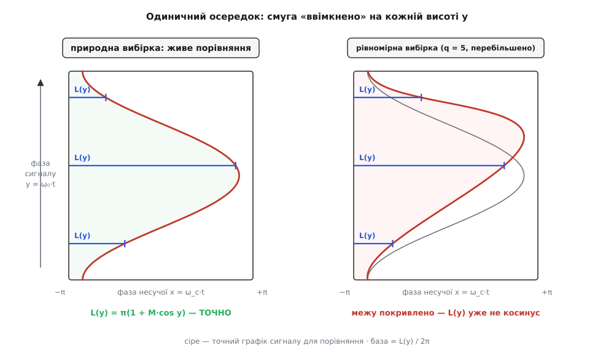
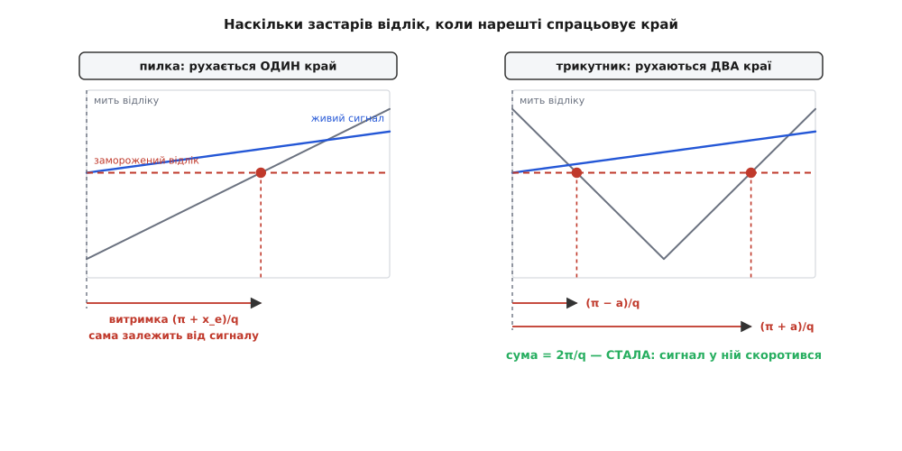
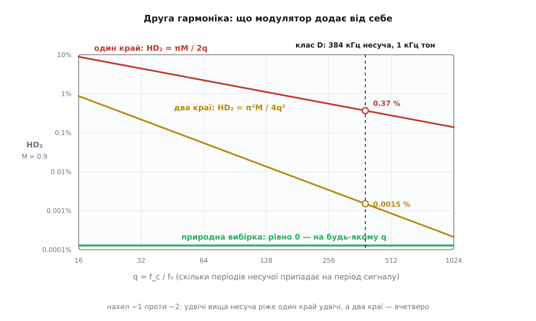

# 🧮 Природна вибірка: чому рвані імпульси несуть плавний сигнал точно

Компаратор із пиляком робить річ, яка з першого погляду не має права виходити. Він бере плавний сигнал, розтинає його на чергу прямокутників — грубих, двійкових, без жодного проміжного рівня, — і ця рвана черга, пропущена крізь фільтр, віддає назад той самий плавний сигнал. Не «майже той самий», не «на слух не відрізнити». Той самий: жодної зайвої гармоніки, амплітуда й фаза недоторкані. Модулятор, усередині якого немає нічого лінійного — самі лише стрибки з нуля на живлення й назад, — виявляється лінійним **точно**.

Це не наближення й не «на практиці достатньо добре». Це рівність, яку видно на пів сторінки, і за нею стоїть геометричний факт, який досить побачити раз. А коли той самий модулятор перекласти на лічильник із регістром — тобто зробити цифровим, — рівність ламається. Ламається передбачувано, з формулою на ціну й із простим правилом, як ту ціну збити у сотні разів.

## Дві вибірки: одне рівняння різниці

Уся розбіжність між аналоговим модулятором і цифровим сидить в одному рівнянні.

Аналоговий [компаратор](book:electronics/comparator) порівнює пиляк із **живим** сигналом. Момент перемикання t_e — це мить, коли похила лінія наздогнала сигнал:

```
пиляк(t_e) = s(t_e)        ← невідоме t_e стоїть з обох боків
```

Рівняння **неявне**, ба більше — трансцендентне: t_e сидить і ліворуч (як аргумент пиляка), і праворуч (як аргумент сигналу). Розв'язку в замкненому вигляді нема ні для якого цікавого s. Компаратор його, звісно, не розв'язує — він просто чекає, доки перетин станеться сам. Залізо тут швидше за будь-яку формулу, бо не рахує нічого.

Цифровий модулятор так не вміє. Лічильник рахує такти, а компаратор звіряє його з числом у регістрі порівняння — і число мусить лежати в регістрі **до того**, як лічильник до нього добіжить. Отже, сигнал доводиться заморозити: узяти відлік на початку періоду, покласти в регістр, і далі порівнювати вже з ним:

```
пиляк(t_e) = s(t_k)        ← t_k = k·T, початок періоду; права частина — стала
```

Рівняння стало **явним**: t_e видно одразу. Саме тому воно й прижилося — інакше довелося б розв'язувати трансцендентне рівняння швидше, ніж минає період.

Перше порівняння звуть **природною вибіркою** (англ. *natural sampling*), друге — **рівномірною** (англ. *uniform sampling*; у силовій електроніці кажуть *regular sampling*). Уся різниця — коли саме дивляться на сигнал: у мить перетину чи в мить, призначену наперед. Здавалося б, дрібниця на пів періоду. Дрібниця коштує відсотка спотворень.

> 🔧 **Навіщо це.** Цю розбіжність не обійти ні швидшим лічильником, ні кращим мікроконтролером — вона в самій **формі** рівняння. Регістр порівняння за означенням тримає число, яке вже там лежить, а сигнал змінюється й після того, як число записано. Тож коли даташит цифрового ШІМ-модулятора обіцяє «лінійність», варто питати: лінійність чого — самого лічильника чи всього перетворення «сигнал → ширина»? Це різні речі, і різниця між ними рахується.

## Чому воно взагалі мало би брехати

Перш ніж доводити, що природна вибірка не спотворює, варто відчути, наскільки це підозріло.

Ширина імпульсу має нести значення сигналу — але яке саме значення? Компаратор ловить сигнал у мить перетину, тобто в мить, коли імпульс **уже закінчується**. Виходить самопослання: ширина каже, яким був сигнал тоді, коли ця ширина скінчилася, а коли вона скінчилася — залежить від самої ширини. Змія кусає власний хвіст.

Гірше: чим більший сигнал, тим пізніше перетин, тим довше ми чекали — і тим далі сигнал відповз від того місця, де був на початку періоду. Виходить, **затримка вимірювання залежить від того, що вимірюють**. У будь-якому іншому приладі така конструкція — готовий рецепт нелінійності: щойно параметр залежить від входу, на виході з'являються гармоніки, яких на вході не було.

І все ж їх нема. Жодної. Щоб побачити чому, треба перестати дивитися на сигнал у часі й глянути на нього в правильних координатах.

## Осередок: два годинники — дві незалежні осі

У модулятора цокають два годинники з незмірно різними кроками: швидка несуча й повільний сигнал. Замість того щоб стежити за обома вздовж однієї осі часу, розчепимо їх і зробимо з кожного **окрему вісь**:

```
x = ω_c·t     фаза несучої  — оббігає 2π за кожен період ШІМ
y = ω₀·t      фаза сигналу  — оббігає 2π за період сигналу
```

Тепер вихід модулятора — не функція часу, а функція **двох** змінних f(x, y) на квадраті −π…π × −π…π; повертаючи на пряму x = ω_c·t, y = ω₀·t, дістаємо назад сигнал у часі.

Прийом цей не новий, і родовід у нього чіткий. Спосіб рахувати добутки модуляції кратним рядом Фур'є опублікував Вільям Р. Беннетт (W. R. Bennett, 1904–1983) — інженер Bell Labs, який усе життя займався теорією спотворень від небажаних добутків модуляції; стаття «New Results in the Calculation of Modulation Products» вийшла в *Bell System Technical Journal* (том 12, с. 228–243) у квітні 1933-го. *(Не плутати з його сином, фізиком W. R. Bennett Jr., співавтором першого газового лазера, — прізвище те саме, галузь інша.)* Систематичну теорію імпульсних модуляцій виклав Гарольд Блек у «Modulation Theory» (Van Nostrand, 1953) — той самий Блек, який 1927 року придумав від'ємний зворотний зв'язок і тим утримав на плаву всю аналогову схемотехніку. У силову електроніку метод перенесли в 1970-х Боуз і Буллоу (S. R. Bowes, R. Bullough); відтоді його так і звуть — подвійним рядом Фур'є. *(Вихідні дані обох першоджерел звірено за бібліографічними покажчиками — це факт. Атрибуція перенесення в перетворювачі саме Боузові й Буллоу спирається на оглядові статті, тобто на вторинні джерела: усталено, але не перевірено за первинними.)*

Візьмімо пиляк, що рівномірно повзе від −1 до +1 за період, і чистий тон s = M·cos y, де M — **глибина модуляції**, 0 < M < 1. Компаратор тримає вихід угорі, доки пиляк нижчий за сигнал:

```
f(x, y) = 1,  доки  x/π < M·cos y      тобто  x < πM·cos y
f(x, y) = 0,  далі
```

Ось воно. **Межа ввімкненої області — це рівняння x = πM·cos y, тобто графік самого сигналу, накреслений в осередку.** Не наближення сигналу, не його версія — він сам. Пиляк рівномірно проходить усю вісь напруги за кожен період, і саме ця рівномірність перетворює вісь напруги на вісь часу без жодного викривлення.


*Ліворуч природна вибірка: межа ввімкненої області збігається з графіком сигналу, тож смуга L(y) на кожній висоті y дорівнює π(1 + M·cos y) — точно, без залишку. Праворуч рівномірна: відлік заморожено, і межу зсунуто на величину, що залежить від неї самої, — графік покривило. Викривлення показано при q = 5 (перебільшено); у реальних модуляторів q — сотні, і крива відхиляється ледь помітно, але саме це відхилення й дає гармоніки.*

## Доведення на пів сторінки

Розкладімо f(x, y) у подвійний ряд:

```
f(t) = Σ Σ C_mn · e^{j(m·x + n·y)}                   (m, n — цілі)

C_mn = (1/4π²) · ∫∫ f(x, y) · e^{−j(m·x + n·y)} dx dy      межі: −π…π
```

Кожен доданок сидить на частоті m·ω_c + n·ω₀. Отже, **база** (англ. *baseband* — те, що лишиться після фільтра, бо живе біля нуля частот) — це рівно родина m = 0: доданки без несучої. Усе з m ≠ 0 тулиться довкола гармонік несучої, високо вгорі, і фільтр його зітре.

Тепер найголовніше. Підставмо m = 0 — і множник e^{−j·m·x} зникає. Внутрішній інтеграл по x перестає бути інтегралом і стає просто **довжиною** ввімкненого відтинка:

```
C_0n = (1/4π²) · ∫ e^{−j·n·y} · [ ∫ dx від −π до πM·cos y ] dy
     = (1/4π²) · ∫ e^{−j·n·y} · L(y) dy,        де  L(y) = π + πM·cos y
```

Тобто **база — це просто ряд Фур'є від L(y)/2π**: від смуги «ввімкнено», взятої як функція фази сигналу. Ніякої іншої інформації в базі нема — де саме всередині періоду стоїть імпульс, база не бачить узагалі, бо інтеграл по x на цю позицію не дивиться.

А L(y) ми знаємо точно:

```
L(y)/2π = 1/2 + (M/2)·cos y
```

Це вже готовий [ряд Фур'є](book:math/fourier-series) — у ньому рівно два доданки, n = 0 і n = ±1, і **всі гармоніки n ≥ 2 дорівнюють нулю тотожно**. Не «малі». Нуль:

```
база(t) = 1/2 + (M/2)·cos(ω₀·t)
```

Постійна складова плюс сигнал, як був. Ані другої гармоніки, ані третьої, ані фазового зсуву. Модулятор точно лінійний.

Тепер видно, де сховано фокус. Побоювання «затримка залежить від сигналу, отже, буде нелінійність» стосувалося **позиції** імпульсу — а на базу позиція не впливає. Впливає лише **ширина** як функція фази сигналу, і ця ширина виходить точно афінною, бо край імпульсу лягає рівно на графік сигналу. Обидва ефекти, яких ми боялися, — «сигнал утік, поки ми чекали» й «імпульс поїхав разом із ним» — це один і той самий ефект, зарахований двічі. Компаратор не вимірює сигнал у неправильну мить: він оголошує міттю ту, у яку сигнал було виміряно. Питання «а який був сигнал, коли ми його ловили?» безглузде — ловили саме тоді, коли він мав це значення.

## Що ж тоді сидить довкола несучої

Нуль у базі не означає, що спотворень нема ніде — вони просто поїхали вгору. Порахуймо m ≠ 0: тепер внутрішній інтеграл уже справжній, і після нього напрошується розклад Якобі — Ангера, e^{j·z·cos y} = Σ jᵏ·Jₖ(z)·e^{j·k·y}, де Jₖ — [функція Бесселя](book:math/bessel-functions) першого роду. Вона тут не з примхи: щойно щось коливається всередині показника експоненти, ряд Фур'є неминуче видає Бесселя — так само, як у частотній модуляції. Виходить:

```
амплітуда на частоті m·ω_c + n·ω₀ = |Jₙ(m·π·M)| / (π·m)        (m ≥ 1, n ≠ 0)
амплітуда на частоті m·ω_c        = |J₀(m·π·M) − (−1)ᵐ| / (π·m)  (n = 0)
```

Тобто довкола кожної гармоніки несучої висить симетрична гребінка **бічних складових**, віддалених на ω₀, 2ω₀, 3ω₀…, і саме туди пішла вся нелінійність модулятора. Формулу легко перевірити на краю: покладімо M = 0 — модуляції нема, лишається меандр. Тоді J₀(0) = 1, решта — нулі, бічних складових нема, а на самій несучій маємо |1 − (−1)ᵐ|/πm — нуль для парних m і 2/πm для непарних. Це рівно спектр меандра, з якого починається [розбір гребінки гармонік ШІМ](book:programming/pwm/math-pwm-spectrum.md). Формула зійшлася зі знайомим окремим випадком — добрий знак.

Практичний висновок звідси прозаїчний: бічні складові живуть **біля несучої**, а не біля сигналу, тож їх приберуть інерція навантаження чи фільтр. Але приберуть не всі: при малому відношенні несучої до сигналу нижні бічні складові першої гармоніки (m = 1, n від'ємне й велике за модулем) дотягуються вниз аж у робочу смугу. Рятує тут сам Бессель: Jₙ(z) при |n| ≫ z спадає швидше за будь-який степінь, тож для n у сотнях від цих складових не лишається практично нічого. «Практично» — саме те слово: у базі природної вибірки нуль **точний** лише для родини m = 0, а те, що спускається згори, мале, але не нульове.

## Ціна цифри: витримка, що несе сигнал

Тепер поставмо на місце компаратора лічильник — і подивімося, що зламається.

Відлік беруть на початку періоду, а край спрацьовує пізніше. Наскільки пізніше? Якщо край стоїть у фазі несучої x_e, то від миті відліку (фаза −π) до нього минуло (x_e + π) фази несучої, а за цей час фаза **сигналу** просунулася в q разів менше, де

```
q = f_c / f₀        скільки періодів несучої припадає на період сигналу
```

Отже, у мить спрацювання відлік уже застарів на (x_e + π)/q фази сигналу. Замість точного рівняння x_e = πM·cos(y) цифровий модулятор розв'язує зсунуте:

```
x_e = πM · cos( y − (x_e + π)/q )        ← сигнал беруть не «тут», а «трохи раніше»
```

Ось тепер погляньмо на цю витримку уважно — у ній два доданки, і вони цілком різні на вдачу:

```
(x_e + π)/q  =  π/q            стала частина — однакова щоперіоду
              + πM·cos y / q   частина, що ПОВТОРЮЄ САМ СИГНАЛ
```

Стала частина безневинна: однакова затримка для всього — це просто затримка, вона не творить нових частот. А от друга — отрута. Сигнал затримує сам себе на величину, пропорційну собі ж. Це самомодуляція, і вона обов'язково родить гармоніку: розкладімо косинус із малим зсувом (перші два члени [ряду Тейлора](book:math/taylor-series) вистачить, бо 1/q мале) і глянемо, що вилізе.

**Рівномірна вибірка, один рухомий край (пилка). Розкладаємо L(y) за малим 1/q.**

```
x_e ≈ πM·cos y + πM·sin y · (πM·cos y + π)/q
L(y) = π + x_e
     = π + πM·cos y + (π²M/q)·sin y + (π²M²/q)·sin y·cos y

sin y · cos y = ½·sin 2y                     ← ось вона, друга гармоніка

база = L(y)/2π = ½ + (M/2)·cos y  +  (πM/2q)·sin y  +  (πM²/4q)·sin 2y
                 └── сигнал ──┘     └─ затримка ─┘     └─ спотворення ─┘
```

Три доданки — три різні долі. Перший — сигнал. Другий пропорційний M у першому степені: складений із першим, він дає той самий косинус, зсунутий за фазою на arctg(π/q) — тобто **затримку рівно на пів періоду несучої**, T/2. Це в точності те, чого й чекають від замороженого відліку, і це не спотворення, а чесна плата за «спершу зміряй, потім дій». Третій доданок несе M², новий кутовий аргумент 2y — і оце вже спотворення, якого на вході не було. Поділивши його на амплітуду сигналу M/2:

```
HD₂ = (πM²/4q) / (M/2) = π·M / (2·q)
```

Друга гармоніка росте з глибиною модуляції й спадає **обернено до відношення частот**. Не до квадрата — просто обернено. Це кепсько: щоб збити спотворення вдесятеро, треба вдесятеро підняти несучу, а за неї платять [втратами перемикання](book:electronics/switching-losses).

## Два краї скорочують сигнал із витримки

І тут виявляється, що ту саму цифрову вибірку можна зробити майже задарма — коштом самої лише форми несучої.

Замінімо пиляк на трикутник, а відлік лишімо той самий, один на період. Тепер імпульс не притулений до початку періоду, а сидить **посередині**, симетрично: краї стоять у фазах −a і +a, де a = (π/2)(1 + M·cos y) — половина ширини. Обидва краї відпрацьовують той самий заморожений відлік, але застаріває він для них по-різному:

```
лівий край  спрацьовує через  (π − a)/q   після відліку
правий край спрацьовує через  (π + a)/q   після відліку
                                    ─────
сума                          =    2π/q    ← сигнал скоротився!
```


*Ліворуч пилка: рухається один край, і його витримка (π + x_e)/q сама залежить від сигналу — саме ця залежність і родить другу гармоніку. Праворуч трикутник: краї стоять симетрично, тож один із них чекає (π − a)/q, а другий (π + a)/q. Половина ширини a — а це і є сигнал — входить у ці витримки з різними знаками й у сумі зникає. Нахил сигналу тут сильно перебільшено, щоб краї розійшлися видимо.*

Чому важлива саме **сума**? Бо ширина — це різниця координат країв, а старіння зсуває правий край праворуч і лівий ліворуч; у різницю координат обидва зсуви входять із однаковим знаком, тобто **додаються**. Кожен зсув пропорційний своїй витримці, отже, зміна ширини пропорційна сумі витримок. А сума — стала, 2π/q, хоч який сигнал. Порахуймо те саме розкладання:

```
праворуч:  x₊ ≈  a + (πM/2)·sin y · (a + π)/q
ліворуч:   x₋ ≈ −a − (πM/2)·sin y · (π − a)/q

L(y) = x₊ − x₋ ≈ 2a + (πM/2q)·sin y · [ (a + π) + (π − a) ]
               = π(1 + M·cos y) + (π²M/q)·sin y
                                   └── знову сама лише затримка T/2 ──┘
```

Доданок з `a` — тобто з сигналом — скоротився дощенту. Лишився чистий `sin y`, лінійний по M: знову затримка на пів періоду несучої, і **жодного M²**. Спотворення нікуди не поділося, але поїхало на наступний порядок малості:

```
HD₂ ≈ (π²·M/4) / q²        два краї, симетрична вибірка
```

Обернено до **квадрата** відношення частот. Відношення цін двох схем — величина промовиста:

```
HD₂(один край) / HD₂(два краї) = [πM/2q] / [π²M/4q²] = 2q/π
```

При q у сотні це сотні разів. Ось скільки коштує вибір форми несучої — а платити за нього не треба нічим: той самий лічильник, той самий регістр, той самий відлік, лише рахує вгору-вниз замість «угору й скид» ([центрована ШІМ у таймері](book:programming/hardware-pwm/proj-pwm-alignment.md)).


*Природна вибірка тримає рівно нуль на будь-якому відношенні частот — це підлога, нижче нема куди. Рівномірна вибірка з одним рухомим краєм спадає з нахилом −1, із двома — з нахилом −2, і на робочих q розрив між ними сягає сотень разів. Обидві криві рахуються, а не вгадуються: досить знати глибину модуляції та відношення частот.*

**Клас D: несуча 384 кГц, тон 1 кГц, глибина 0.9 — тобто q = 384.**

```
один край:  HD₂ = π · 0.9 / (2 · 384)      = 3.68·10⁻³ = 0.37 %
два краї:   HD₂ = π² · 0.9 / (4 · 384²)    = 1.51·10⁻⁵ = 0.0015 %
відношення: 2 · 384 / π                    = 244 разів
```

Тридцять сім сотих відсотка — це рівень спотворень дешевого підсилювача, чутний на слух, і взявся він **не з ключів, не з живлення й не з фільтра**, а з самого способу брати відлік. Ті самі 384 кілогерци, той самий транзистор, той самий такт — і 0.0015 % замість 0.37 %, лише тому, що лічильник рахує вгору-вниз. Для привода мотора цифри інші, а мораль та сама: на 8 кГц несучої й 50 Гц вихідної синусоїди (q = 160) один край дає 0.88 %, два — 0.0087 %.

> 🔧 **Навіщо це.** Коли [підсилювач класу D](book:electronics/class-d-amplifier) чи інвертор показує другу гармоніку, що росте з амплітудою й падає рівно вдвічі, щойно несучу подвоїти, — це підпис рівномірної вибірки, а не поганого заліза. Шукати треба не кращий MOSFET, а вирівнювання ШІМ: чи центровані імпульси, чи скільки відліків на період. Діагностична ознака саме в **нахилі**: удвічі підняли несучу й спотворення впали вдвічі — один край; упали вчетверо — два краї, і тоді копати треба вже деінде.

## Як цифра відкуповується

Формула HD₂ = πM/2q каже й те, як із неї вирватися. Шляхів рівно чотири, і кожен цілить у своє місце.

**Підняти несучу.** Найлобовіший: q стоїть у знаменнику. Працює, але лінійно для одного краю й квадратично для двох, а стеля відома — втрати перемикання.

**Рахувати двома краями.** Задарма, з нахилом −2. Перше, що варто зробити.

**Оцінити перетин наперед.** Найцікавіше. Природна вибірка недосяжна для лічильника не тому, що трансцендентне рівняння нерозв'язне, а тому, що його ніколи не розв'язували — просто брали перший-ліпший відлік. Але якщо сигнал відомий заздалегідь (а в цифровому тракті він відомий: він лежить у буфері), перетин можна **знайти ітерацією** ще до того, як лічильник до нього добіжить. Відображення тут стискне — похідна правої частини за x_e не перевищує πM/q ≪ 1, — тож проста підстановка збігається за два-три кроки:

:::tabs
```cpp
#include <cmath>

// Оцінка природного відліку для крайового ШІМ.
// y      — фаза сигналу на початку періоду несучої, рад
// M      — глибина модуляції, 0…1
// q      — f_c / f0
// Повертає фазу краю x_e ∈ (−π, +π): саме те число, що йде в регістр порівняння.
double natural_edge(double y, double M, double q)
{
    double x = M_PI * M * std::cos(y);        // початкове наближення = рівномірна вибірка
    for (int i = 0; i < 3; ++i)               // стискне відображення: 3 кроки з запасом
        x = M_PI * M * std::cos(y - (x + M_PI) / q);
    return x;
}
```
```python
import math

def natural_edge(y: float, M: float, q: float) -> float:
    """Фаза краю x_e для природної вибірки: розв'язок x = πM·cos(y − (x+π)/q).

    y — фаза сигналу на початку періоду несучої; M — глибина модуляції; q = f_c/f0.
    Відображення стискне (|похідна| ≤ πM/q ≪ 1), тож вистачає трьох ітерацій.
    """
    x = math.pi * M * math.cos(y)             # старт = те, що дала б рівномірна вибірка
    for _ in range(3):
        x = math.pi * M * math.cos(y - (x + math.pi) / q)
    return x
```
:::

Ця дрібничка перетворює цифровий модулятор на аналоговий за характеристикою — і саме нею користуються серйозні цифрові підсилювачі, зазвичай у парі з [передискретизацією](book:electronics/oversampling-decimation) (сигнал підняли на вищу частоту відліків — і перетин ловиться точніше). Проти прямої дороги «нарощувати несучу» тут виграш чистий: ітерація коштує тактів, а не ватів.

**Замкнути зворотний зв'язок.** Модулятор усередині петлі — і його власна нелінійність ділиться на петльове підсилення разом із усіма іншими гріхами схеми. Так робить [sigma-delta ШІМ](book:electronics/sigma-delta-pwm): він не бореться зі спотвореннями природою модулятора, а виштовхує їх туди, де вони нікому не заважають. Плата — затримка петлі й зникла регулярність перемикань.

## Що з цього лишається

Природна вибірка — це не «майже лінійно, і на тому спасибі». Це рівність, і причина рівності геометрична: край імпульсу лягає рівно на графік сигналу, тож смуга «ввімкнено» на кожній фазі сигналу дорівнює самому сигналові, а більше базі нічого й не потрібно. Пиляк рівномірний — тому вісь напруги переходить на вісь часу без викривлення; компаратор дивиться на живий сигнал — тому питання «а в яку мить ми міряли?» не має сенсу: міряли саме тоді.

Цифра ламає це в одному місці й з однієї причини: відлік беруть наперед і заморожують. Витримка від відліку до краю розпадається на сталу частину — чесну затримку на пів періоду несучої, з якою можна жити, — і частину, що повторює сам сигнал. Оця друга й родить другу гармоніку, πM/2q. Симетрична пара країв скорочує сигнал із суми витримок і зсуває ціну на порядок малості нижче, π²M/4q². Обидві формули рахуються з двох чисел — глибини модуляції та відношення частот, — і обидві сходяться з виміром до третьої цифри.

А найважче тут — не арифметика, а звичка. Аналоговий модулятор із двох деталей дає точну лінійність і нульову затримку задарма; цифровий, із лічильником, тактовим генератором і регістром, платить і тим, і тим — і платить не через слабке залізо, а через порядок дій. Що не заважає цифрі перемагати: усе, чим вона бере — точність числа, повторюваність, довільні закони керування, — аналоговому пиляку недоступне, а програш у лінійності, як видно з ітерації на три рядки, при бажанні здебільшого відіграється назад.
