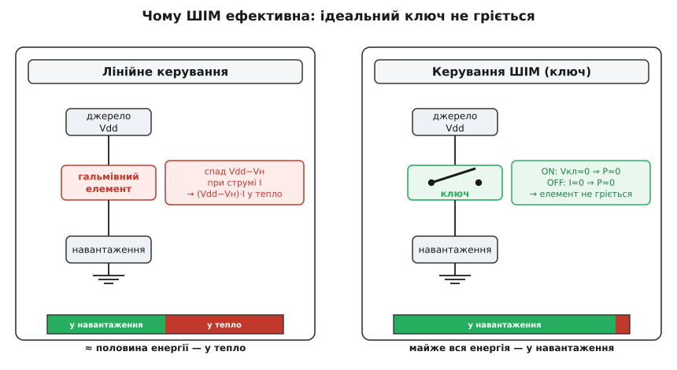
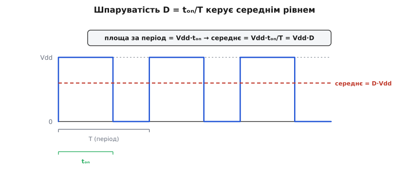
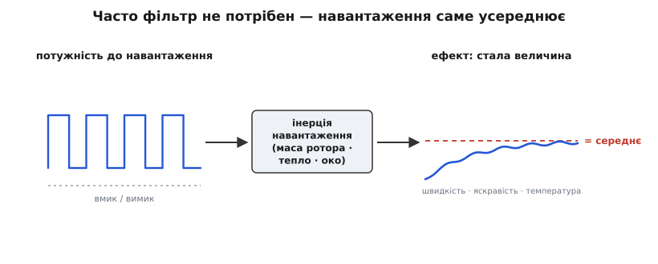
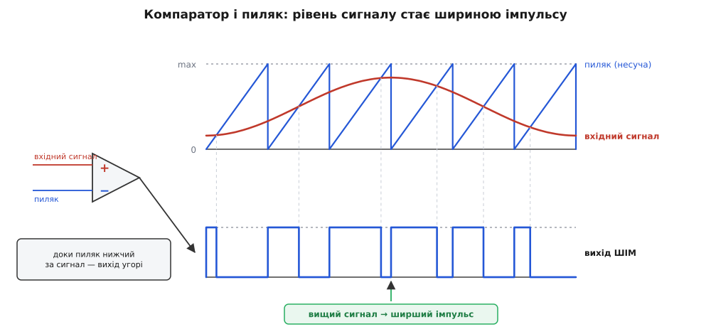

# Широтно-імпульсна модуляція (ШІМ)

<preknowlist>
- [Потужність](book:physics/electric-power) — P = V·I: скільки енергії за секунду з'їдає елемент, на якому впала напруга V при струмі I.
- [MOSFET як ключ](book:electronics/mosfet-switch) — два стани ключа: замкнений із малим опором R_ds(on) і розімкнений, крізь який струм не тече.
- [Час і частота](book:math/time-and-frequency) — період повторення й частота, T = 1/f.
- [Стала RC](book:electronics/rc-time-constant) — τ: за який час коло встигає відгукнутися на зміну; звідки в кола береться «інерція».
- [RC-ФНЧ](book:electronics/rc-low-pass) — фільтр нижніх частот пропускає повільне й глушить швидке.
</preknowlist>

Джерело живлення дає рівно те, що дає: 12 вольтів, і крапка. А моторові зараз треба пів ходу, світлодіодові — третину яскравості, нагрівачеві — десяту частку потужності. Між тим, що є, і тим, що потрібно, стоїть надлишок, і його треба кудись подіти. Уся ця тема — про те, що з ним робити, і про те, чому найкраща відповідь виявилася настільки неочевидною, що до неї йшли ціле століття.

## Ціна половини

Перша думка завжди однакова: **загальмувати**. Поставити між джерелом і навантаженням елемент, який «притисне» зайве, — реостат, резистор, транзистор, прочинений наполовину. Мотор побачить 6 вольтів замість 12 і крутитиметься вдвічі повільніше. Працює? Працює. Порахуймо, скільки це коштує.

**Мотор на 12 В, якому дали половину: 6 В при струмі 2 А.**

```
спад на гальмівному елементі = 12 − 6   = 6 В
струм крізь нього            =           = 2 А
P елемента                   = 6 · 2    = 12 Вт   ← у тепло
P мотора                     = 6 · 2    = 12 Вт   ← у роботу
ККД                          = 12/24    = 50 %
```

Дванадцять ватів. Не «трохи гріється» — дванадцять ватів у корпусі завбільшки з ніготь. Транзистор у TO-220 без радіатора має тепловий опір до середовища близько 62 °C/Вт: 12 Вт помножити на 62 — і кристал мав би нагрітися на сім із половиною сотень градусів понад кімнату. Він, звісно, просто згорить задовго до того. Тож або радіатор із вентилятором, або нічого не вийде.

І зауважте, звідки взялися ці 12 Вт. Вони не «втратилися» десь у дорозі — вони **дорівнюють корисним**. Стільки ж, скільки з'їв мотор, елемент перетворив на тепло, бо через нього тік той самий струм, і на ньому впала та сама напруга. Половина рахунку за електрику пішла на нагрівання деталі, яка й так найтендітніша в схемі. А якщо треба не половина, а десята частина ходу — стане ще гірше: на елементі впаде 10.8 В при тому ж струмі, і в тепло піде дев'ять десятих усього.

> Це не нове відкриття: реостат у театральній ложі гріли так само, а від його марнотратності тікали кілька поколінь інженерів — через автотрансформатор до тиристорного диммера. Ця гонитва варта окремої розповіді: [як приборкали яскравість](book:programming/pwm/hist-dimmer.md).

Причина такої ціни глибша за конкретну схему. Потужність на елементі — це **добуток** напруги на ньому й струму крізь нього. Гальмівний елемент за означенням стоїть у розриві: струм крізь нього тече повний (він же послідовно з навантаженням), і напруга на ньому не нульова (він же для того й стоїть, щоб «з'їсти» різницю). Обидва множники ненульові — отже, добуток ненульовий. Хоч як хитруй зі схемою, доки елемент **тримає** проміжну напругу, він її оплачує теплом. Проміжний стан коштує дорого — це не вада конструкції, а закон.

## Ключ не має середини — зате має час

Гляньмо на той самий добуток P = V·I з іншого боку. Чи є стани, у яких він дорівнює нулю?

Є, і рівно два. **Замкнений ключ**: напруга на ньому майже нульова (він же замкнений — на добрий MOSFET лишається якийсь десяток мілівольтів), струм повний. Нуль помножити на щось — нуль. **Розімкнений ключ**: напруга на ньому повна, а струму нема зовсім. Знову нуль. Обидва **крайні** стани для елемента безкоштовні; дорога тільки середина — та сама, у якій сидить гальмівний елемент, і сидить там завжди.

Звідси виростає весь фокус. Ключ не вміє «наполовину» — у нього немає такого положення. Але в нього є те, чого нема в жодного резистора: **час**. Ніхто не змушує ключ стояти в одному стані вічно. Хай стрибає між двома дешевими крайніми станами, а те, що нам потрібне — «половина», — хай виникне як **частка часу**, проведена ввімкненим. Не тримати середину, а бігати між краями так швидко, щоб середина вийшла сама.


*Ліворуч елемент тримає проміжну напругу: на ньому падає Vdd−Vн при повному струмі, і цей добуток іде в тепло — половина всієї енергії. Праворуч той самий струм пропускає ключ, який буває лише замкненим (напруга на ньому ≈ 0) або розімкненим (струм ≈ 0). В обох станах добуток V·I майже нульовий, тож у тепло не йде майже нічого — уся енергія дістається навантаженню.*

Порахуймо ту саму половину ходу мотора, але ключем. Реальний MOSFET у замкненому стані — це не ідеальний провідник, а маленький опір: хай 20 мОм. Половина ходу означає, що ключ замкнений половину часу.

**Той самий мотор, 2 А, керований ключем із R_ds(on) = 20 мОм при частці часу «ввімкнено» 0.5.**

```
P ключа, поки він замкнений = I²·R_ds(on) = 2² · 0.02  = 0.08 Вт
частка часу, коли він замкнений                        = 0.5
P ключа в середньому        = 0.08 · 0.5              = 0.04 Вт  ← у тепло
P мотора                    = 6 · 2                    = 12 Вт
```

Сорок міліватів проти дванадцяти ватів. У триста разів менше — на такому вже й радіатор ні до чого, транзистор лишається холодним на дотик. (Це ще не вся правда: самі перемикання теж чогось коштують, і до цього рахунку варто дійти окремо — але порядок величини вже видно.) Ту саму роботу — половину напруги на моторі — зроблено, а тепла нема. Різниця не в кращому транзисторі, а в тому, що елемент більше **ніколи не тримає** проміжну напругу.

> 🔧 **Навіщо це.** Саме тому логічний вихід мікроконтролера, розрахований на міліампери, керує мотором на кілька ампер без жодного радіатора: він не гальмує потужність, а лише **перемикає** її. Ключ, який гріється, майже завжди означає, що він десь застряг у середині — надто повільні фронти, недостатня напруга на затворі, — і шукати треба саме це, а не потужніший радіатор.

## Що саме модулюють

Тепер назвімо речі. Ключ стрибає з незмінним **періодом** T, і всередині кожного періоду тримається ввімкненим час tₒₙ. Частку періоду, яку сигнал провів угорі, звуть **шпаруватістю** (англ. *duty cycle*):

```
D = tₒₙ / T          D = 0 — завжди вимкнено, D = 1 — завжди ввімкнено
```

Період той самий, ширина ввімкненої частини — різна: саме тому це **широтно-імпульсна модуляція** (англ. *pulse-width modulation*, PWM — модуляція шириною імпульсу). Модуляція (лат. *modulatio* — розмірність, добір міри) — це коли одна величина керує якоюсь властивістю іншого сигналу. Тут керована властивість — **ширина**.

І ось що в цьому найважливіше й найменш очевидне. Величина, якою ми керуємо, більше не живе на осі напруги — на тій осі лишилися тільки два значення, нуль і Vdd, між ними немає нічого. Величина переїхала **на вісь часу**: тепер число — це момент, коли ключ вимкнеться. Напруга стала двійковою, а безперервність, яка нам потрібна, знайшлася там, де її досі не шукали.


*Сигнал має лише два рівні — 0 і Vdd, — а період T незмінний. Змінна тут одна: ширина ввімкненої частини. Площа під кривою за період дорівнює Vdd·tₒₙ, і, розмазана по всьому періоду, вона дає середнє Vdd·D. Тож шпаруватість — це ручка, що плавно веде середній рівень від нуля до повного живлення.*

Середнє за період рахується просто, бо фігура під кривою — прямокутник: висота Vdd протягом часу tₒₙ, нуль протягом решти.

```
середнє = (Vdd·tₒₙ + 0·(T − tₒₙ)) / T = Vdd · tₒₙ/T = Vdd · D
```

Лінійно, без жодних коефіцієнтів: **середня напруга дорівнює живленню, помноженому на шпаруватість**. Хочете 6 вольтів від 12 — задайте D = 0.5. Хочете 4 — задайте D = 1/3.

Варто помітити, що вибір «тримаємо період, міняємо ширину» — не єдиний можливий. Можна навпаки: тримати ширину імпульсу сталою, а міняти **частоту**, з якою вони йдуть, — і це вже [частотно-імпульсна модуляція](book:electronics/controller-fsw) (PFM), якою імпульсні перетворювачі живлять легке навантаження: чим менший струм, тим рідші імпульси. Правило тут загальне: **інформацію несе те, що змінюють, а те, що тримають сталим, її не несе**. ШІМ тримає сталою частоту — і саме тому має передбачуваний спектр, який легко фільтрувати, чого про PFM не скажеш.

## Чому навантаження бачить середнє

Тут ховається головна пастка розуміння. «Середнє» — це число, яке ми щойно порахували на папері. Але на дроті ніякого середнього нема! Там нема жодного моменту, коли на моторі стоїть 6 вольтів: там або 12, або 0. То чому ж мотор крутиться так, ніби йому дали рівно шість?

Бо мотор не встигає за стрибками. Ротор має масу, і щоб її розкрутити чи пригальмувати, треба час, якого за 50 мікросекунд немає. Обмотка має індуктивність, і струм у ній не може стрибнути миттєво. Нитка розжарення має теплову масу, око має власну інерцію. Кожне з цих навантажень **саме є фільтром нижніх частот** — не тому, що ми його таким зробили, а за своєю природою: повільне воно відпрацьовує, а швидке — розмазує. Фільтр не треба ставити: він уже там, усередині навантаження.


*Ліворуч у навантаження прилітає рвана потужність — то повна, то жодної. Але між нею й результатом стоїть інерція самого навантаження: маса ротора, теплова маса, інерція ока. Праворуч результат: швидкість, яскравість чи температура виходять на рівну полицю з ледь помітним тремтінням — на рівні, що відповідає середньому. Окремий фільтр для цього не потрібен.*

Отже, «навантаження бачить середнє» — це не метафора, а конкретне твердження про **реакцію кола на сигнал**, і воно правдиве лише за конкретної умови. Кожне інерційне навантаження має свою сталу часу τ: обмотка — електричну [L/R](book:electronics/rl-time-constant), ротор — механічну, нагрівач — теплову. Умова звучить так:

```
T ≪ τ          період ШІМ набагато коротший за сталу часу навантаження
```

Доки вона виконується, за один період навантаження встигає зрушити лише на крихту — і живе на середньому. Щойно вона ламається, навантаження починає **відпрацьовувати кожен імпульс окремо**, і ніякого середнього більше нема: є смикання. Порахуймо, де саме проходить ця межа для звичайного мотора.

**Обмотка мотора: R = 0.6 Ом, L = 1.5 мГн, живлення 12 В, D = 0.5 (середнє 6 В, струм 2 А).**

```
стала часу обмотки     τ = L/R = 1.5·10⁻³ / 0.6      = 2.5 мс

ШІМ на 20 кГц:  T = 50 мкс,  tₒₙ = 25 мкс,  T/τ = 0.02
  надлишок напруги, що жене струм угору = 12 − 6     = 6 В
  приріст струму за імпульс  ΔI = 6 · 25·10⁻⁶ / 1.5·10⁻³ = 0.1 А
  розмах на тлі середніх 2 А                          = 5 %

ШІМ на 1 кГц:   T = 1 мс,   tₒₙ = 500 мкс,  T/τ = 0.4
  приріст струму за імпульс  ΔI = 6 · 500·10⁻⁶ / 1.5·10⁻³ = 2 А
  струм гуляє від 1 до 3 А — розмах                   = 100 %
```

На двадцяти кілогерцях мотор справді «бачить» рівні два ампери: струм ледь брижиться. На одному кілогерці струм щоперіоду встигає впасти до ампера й підскочити до трьох — у піку він утричі більший, ніж у западині. Мотор гріється дужче, ніж мав би за тим самим середнім струмом, момент смикається, а обмотка на чутній частоті ще й починає скреготіти, бо струм у магнітному полі — це сила, і сила ця тепер пульсує тисячу разів на секунду.

> 🔧 **Навіщо це.** Ось звідки береться правило «ШІМ для мотора — від 16–20 кГц»: спершу дивишся на сталу часу навантаження (для обмотки це L/R із даташита), а тоді береш період у десятки разів коротший. Не навпаки: частоту диктує **навантаження**, а не звичка чи дефолт бібліотеки.

Ще одна річ, без якої на індуктивному навантаженні ШІМ не працює взагалі. Струм в обмотці не можна обірвати — котушка триматиметься за нього до останнього й видасть викид напруги, що проб'є ключ ([брикання котушки](book:electronics/inductor-kickback)). Тому щоразу, коли ключ розмикається, струмові **обов'язково дають замкнутися по колу** — крізь гасильний діод чи крізь протилежне плече мостової схеми. Саме цей замкнений шлях і дозволяє струмові плавно спадати замість того, щоб рватися: інерція навантаження працює лише тоді, коли їй не заважають.

А коли інерції навантаження бракує — або коли потрібна не «дія в середньому», а справжня рівна напруга, — усереднення доводиться робити самому: резистор і конденсатор перетворюють ШІМ на керовану постійну напругу, і тоді доводиться рахувати, скільки тремтіння лишиться на виході ([ШІМ як ЦАП: RC-фільтр і пульсації](book:electronics/pwm-dac-filter)).

## Частоту затиснуто з двох боків

Виходить, чим вища частота, тим краще? Задерімо її до мегагерца — і жодне навантаження нічого не помітить. Не так просто: угору штовхає одна сила, а вниз — інша, і робочу частоту завжди затиснуто між ними.

**Угору** штовхає все, про що вже йшлося: чим нижча частота, тим грубіше тремтіння. Мотор скрегоче, якщо ШІМ влучив у чутний діапазон (20 Гц — 20 кГц), — тому й беруть частоту вище за верхню чутну межу. А око виявилося прискіпливішим, ніж здається. Світлодіодний [димінг](book:electronics/backlight-dimming) — це стовідсоткова глибина модуляції: струм або повний, або жодного. Рекомендація IEEE 1789-2015 проводить дві межі як прямі, що залежать від частоти: «низький ризик» — коли глибина модуляції у відсотках не перевищує 0.08·f, «без спостережного впливу» — коли не перевищує 0.0333·f. Підставмо нашу стовідсоткову глибину:

```
низький ризик:            100 ≤ 0.08 · f    →  f ≥ 1250 Гц
без спостережного впливу: 100 ≤ 0.0333 · f  →  f ≥ 3000 Гц
```

Тобто ШІМ-димінг на 100 чи 200 Гц, який «на око не мигтить», за цією рекомендацією все одно нікуди не годиться: явного мерехтіння ви не побачите, але стробоскопічні сліди на рухомих предметах, утома й головний біль лишаються — саме тому пристойна підсвітка димить кілогерцями.

**Вниз** штовхають самі перемикання. Ключ переходить із замкненого стану в розімкнений не миттєво: якісь десятки наносекунд він проводить у тій самій дорогій середині, де напруга й струм ненульові водночас. Кожен перехід коштує ковтка енергії, і чим частіше перемикаєш, тим більше таких ковтків за секунду ([втрати перемикання](book:electronics/switching-losses) ростуть прямо пропорційно частоті).

**Той самий мотор (12 В, 2 А), фронт ключа 50 нс.**

```
енергія одного переходу  ≈ ½·V·I·t = 0.5 · 12 · 2 · 50·10⁻⁹ = 0.6 мкДж
переходів за період                                          = 2 (увімк. + вимк.)
на 20 кГц:  P = 1.2·10⁻⁶ · 20·10³                            = 0.024 Вт
на 200 кГц: P = 1.2·10⁻⁶ · 200·10³                           = 0.24 Вт
```

На двадцяти кілогерцях перемикання коштують 24 мВт — стільки ж порядку, скільки й 40 мВт провідності, разом менше десятої частки вата. На двохстах кілогерцях лише перемикання з'їдають чверть вата, а на двох мегагерцах — майже два з половиною, і транзистор знову проситься на радіатор. Ось і весь затиск: **знизу частоту підпирає інерція навантаження й чутливість вуха та ока, згори — втрати перемикання**. Робоче вікно між цими стінками зазвичай широке — від одиниць до сотень кілогерц, — але воно скінченне, і обидві його стінки рахуються, а не вгадуються.

## Як народжується ширина: компаратор і пиляк

Досі ми говорили про сигнал так, ніби він береться нізвідки. Звідки ж він береться насправді — і, головне, як **безперервна** величина перетворюється на ширину?

Механізм чудово простий і не потребує ні лічильників, ні коду. Візьмімо [компаратор](book:electronics/comparator) — елемент, що порівнює дві напруги й видає «вгору», якщо перша більша, і «вниз», якщо менша. На один його вхід подамо наш сигнал — той рівень, який ми хочемо передати. А на другий — **пиляк** (англ. *sawtooth*): напругу, що рівномірно повзе знизу вгору й миттєво падає, і так знову й знову з незмінним періодом ([релаксаційний генератор](book:electronics/relaxation-oscillator) робить її з конденсатора, який заряджають рівним струмом).


*Пиляк щоперіоду рівномірно повзе знизу вгору — це несуча. Доки він нижчий за вхідний сигнал, компаратор тримає вихід угорі; у момент перетину вихід падає. Що вищий сигнал, то пізніше настає перетин і то ширший імпульс: рівень напруги перетворився на ширину. Вхідний сигнал тут повільно змінюється — і ширина імпульсів слухняно йде за ним.*

Погляньмо, що відбувається за один період. Пиляк стартує з нуля — він нижчий за сигнал, компаратор тримає вихід угорі. Пиляк повзе й у якийсь момент переганяє сигнал — вихід падає. Далі пиляк добігає до верху, зривається на нуль, і все повторюється. Момент перетину — це і є момент вимикання, а що він визначений точкою, де рівна похила лінія перетинає рівень сигналу, то **ширина виходить прямо пропорційна цьому рівню**. Пиляк перетворив вісь напруги на вісь часу — тим, що рівномірно проходить її всю за кожен період.

Найкрасивіше те, що це працює й тоді, коли сигнал не стоїть на місці, а безперервно змінюється: щоперіоду компаратор ловить його на тій висоті, де стався перетин, і ширина йде за ним. Таке порівняння з живим сигналом звуть **природною вибіркою**, і воно має несподівано добру властивість: рвана послідовність імпульсів переносить плавний сигнал **без спотворень** — модулятор виходить точно лінійним, хоча всередині нього немає нічого лінійного. Чому саме так і чим за це платять цифрові модулятори, розібрано окремо: [природна вибірка і лінійність ШІМ](book:electronics/pwm/math-natural-sampling.md).

Цей вузол — компаратор із пиляком — і є серцем аналогової ШІМ: він стоїть у кожному контролері імпульсного живлення й у кожному [підсилювачі класу D](book:electronics/class-d-amplifier), де тим самим способом на ширину імпульсів перекладають звук. Ідея не молода: перемикальні підсилювачі малювали ще на початку 1930-х, а першим серійним був набір Sinclair X-10 1964 року — повчальний провал, бо транзистори тієї доби перемикалися надто мляво ([звідки взявся клас D](book:electronics/class-d-amplifier/detail)).

Цифровий двійник цього вузла влаштований так само, лише порівнює не напруги, а числа: лічильник рахує такти замість пиляка, а компаратор порівнює його з числом, яке ви записали в регістр. Звідси й головна властивість такої ШІМ: **роздільність задає відношення тактової частоти до частоти ШІМ** — на 20 кГц від 16 МГц лічильник устигає нарахувати лише 800 сходинок, і плавнішої за 1/800 шпаруватості не буде ([апаратний ШІМ](book:programming/hardware-pwm)). Аналоговий пиляк такої межі не має зовсім: він безперервний, і ширина може бути будь-якою.

## Де «середнє = D·Vdd» бреше

Формула Vdd·D чиста й лінійна, і саме тому варто знати, де вона розходиться з дійсністю.

По-перше, **рівень не дорівнює Vdd**. Замкнений ключ таки має свій опір, і на ньому падає I·R_ds(on); гасильний діод, коли струм тече крізь нього, віднімає своє падіння вже нижче нуля. Тож справжня «висота імпульсу» трохи менша за живлення й ще й **залежить від струму** — а отже, від навантаження. По-друге, **ширина не дорівнює замовленій**. У мостових схемах між вимиканням одного ключа й вмиканням другого лишають [мертвий час](book:electronics/dead-time), щоб вони не відкрилися разом і не закоротили живлення, — і цей час забирається просто з ширини імпульсу. Ще й найкуціші імпульси часом не встигають відкрити ключ як слід, тож шпаруватість біля самих країв поводиться інакше, ніж посередині.

Разом це означає, що передавальна характеристика «шпаруватість → результат» насправді трохи гнута й трохи плаває з навантаженням, температурою й живленням. Тому серйозні схеми не покладаються на неї наосліп: вони **міряють** те, що вийшло, і підправляють шпаруватість — саме так працює будь-який [buck-перетворювач](book:electronics/buck), де ШІМ керується від'ємним зворотним зв'язком, а не з таблиці.

І остання, найважливіша поправка: **на дроті лишається не лише середнє**. Прямокутний сигнал — це постійна складова Vdd·D **плюс** гребінка гармонік на частоті ШІМ і вище ([спектр ШІМ](book:programming/pwm/math-pwm-spectrum.md)). Інерція навантаження ці гармоніки притлумлює, але не знищує: вони й далі ганяють пульсаційний струм, який гріє обмотку й нічого не крутить, стікають у землю та живлення, випромінюються з петель на платі й лізуть у радіоприймач поруч. Найтихіший спосіб виторгувати з цим — розмити саму гребінку: [sigma-delta ШІМ](book:electronics/sigma-delta-pwm) навмисне робить перемикання нерегулярними, тож замість гострих піків на частоті ШІМ виходить рівний тихий шум, який уже нікуди не влучає.

## Дві роботи для однієї ширини

Наостанок — розрізнення, на якому спотикаються найчастіше. Усе, про що йшлося досі, — це **енергетична** ШІМ: ширина керує середнім, а сенс має саме середнє. Але тією самою шириною користуються й зовсім інакше.

Хобі-[сервомашинка](book:electronics/hobby-servo) чекає імпульс завдовжки 1–2 мілісекунди приблизно кожні 20 мс, і 1.5 мс означає «стань у нейтраль». Тут ширина — це **повідомлення**, число, яке вимірюють, а не усереднюють. Ніхто нічого не фільтрує: усередині серво сидить схема, що міряє тривалість імпульсу й порівнює її з поточним кутом вала. Шпаруватість тут узагалі ні до чого — імпульс 1.5 мс із 20 мс дає жалюгідні 7.5%, і ці 7.5% не означають нічого. Той самий формат успадкували [радіокеровані моделі](book:communications/rc-signal-protocol), де 1000–2000 мкс — валюта для кожного каналу.

> 🔧 **Навіщо це.** Плутанина цих двох сенсів дорого коштує на практиці. Поставите 50 Гц на мотор — отримаєте гуркіт і смикання замість плавного ходу. Поставите 20 кГц на серво — воно просто не зрозуміє нічого, бо чекає імпульси в мілісекундах, а не середнє. Питання, яке треба поставити першим, завжди те саме: **ширина тут годує чи говорить?**

Тож увесь фокус ШІМ тримається на одному спостереженні: середина дорога, а краї безкоштовні. Замість платити за проміжну напругу її склали з часу — і ця заміна виявилася настільки вигідною, що витіснила гальмування звідусіль, де важать ватти. Ціна відома й чесна: замість рівної напруги на дроті тепер б'ється прямокутник із цілою гребінкою гармонік, і кожен, хто працює з ШІМ, рано чи пізно платить саме за них — фільтром, частотою чи екраном.
