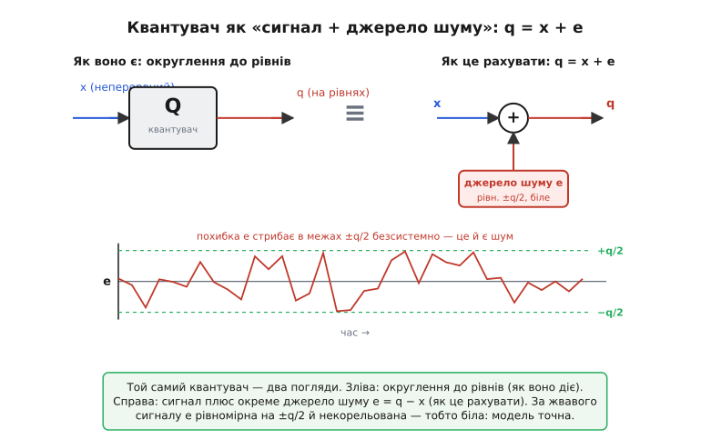
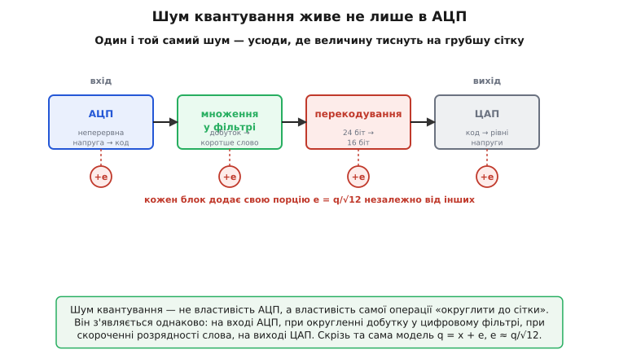
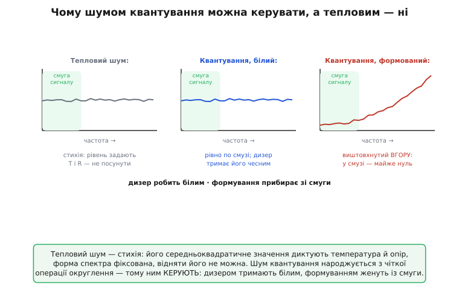

# Шум квантування: чому округлення до сітки поводиться як окреме джерело шуму

Візьміть будь-яку неперервну величину — напругу з давача, миттєву гучність звуку, координату — і спробуйте записати її **числом** зі скінченної розрядності. Одразу впираєтесь у стіну: неперервна величина має нескінченно багато можливих значень (1.7000…, 1.7001…, будь-скільки знаків), а число зі скінченним набором розрядів — лише скінченну сітку. Між сусідніми клітинками сітки — порожнеча, туди значення записати нема як. Тож кожне значення доводиться **підтягувати** до найближчої клітинки. І в цьому підтягуванні народжується похибка, якої в неперервному світі не було зовсім, — і що найдивніше, ця похибка поводиться не як акуратне округлення, а як **шум**: додається до сигналу, псує його, зменшує відношення сигнал/шум рівно так, як тепловий шум резистора.

**Шум квантування** (лат. *quantum* — порція, найменша неподільна частка) — це і є та похибка, з якою неперервна величина лягає на скінченну сітку рівнів, узята як окреме джерело шуму. Ключове слово тут — «окреме». Найпотужніша ідея всієї теми в тому, що квантувач — округлювач до рівнів — можна перестати уявляти як хитру нелінійну операцію, а натомість подати як **звичайний сигнал плюс окреме джерело шуму**, підмішане суматором. Це підмінює складну задачу простою: замість аналізувати сходинки, ми додаємо до сигналу шумову добавку з відомими властивостями — і далі рахуємо все тими самими інструментами, що й для теплового чи будь-якого іншого шуму.

> 🔧 **Навіщо це.** Ця підміна — робочий інструмент, а не філософія. Щойно квантувач стає «сигнал + джерело шуму», ви можете **вписати шум квантування у бюджет шуму тракту** нарівні з тепловим шумом давача й власним шумом підсилювача: скласти їх коренем із суми квадратів і побачити, хто головний. Вона ж підказує, коли нарощувати розрядність АЦП безглуздо (його шум квантування вже потонув під тепловим шумом входу), і де шум квантування вигулькує там, де його не чекали, — усередині цифрового фільтра, при зменшенні розрядності звуку, на виході ЦАП. Хто бачить квантування як джерело шуму, той знаходить його заздалегідь; хто бачить лише «округлення» — ловить його потім як загадкове шипіння.

## Похибка квантування: обмежена, але ще не шум

Почнімо з самого механізму й найпростішого — з однієї клітинки сітки. Квантувач ділить діапазон значень на рівні; відстань між сусідніми рівнями назвемо **кроком квантування** й позначимо q. Будь-яке значення між двома рівнями округлюється до найближчого. Звідси одразу випливає межа похибки: якщо ви ближче ніж на пів-q до якогось рівня, саме до нього й округлить; якщо далі — ближчим стане вже сусідній рівень. Отже, похибка ніколи не виходить за половину кроку:

```
e = x_квантоване − x_справжнє,     −q/2 ≤ e ≤ +q/2
```

Це чиста геометрія сходинок, без жодної статистики. Похибка обмежена ±пів-кроку, симетрична навколо нуля. Сама по собі вона виглядає радше як охайне округлення, ніж як шум, — і тут криється тонкість, об яку спотикаються найчастіше. **Обмеженість похибки ще не робить її шумом.** Округлення — операція строго визначена: тому самому входу завжди відповідає той самий вихід, нічого випадкового. Якщо на вхід подати повільну, рівну, передбачувану величину, що ледь повзе одним-двома рівнями, похибка йтиме гладкою, впорядкованою хвилею, жорстко прив'язаною до сигналу, — і це буде **спотворення**, а не шум: на спектрі воно сяде гострими гармоніками, а не рівним килимом.

Обертає похибку на шум одна-єдина умова — про те, як вона поводиться **від відліку до відліку**. Сигнал має бути досить жвавий і досить великий, щоб непередбачувано перестрибувати **багато рівнів**. Тоді на яку саме частку кроку ляже черговий відлік, стає по суті випадковим і рівномірно розкиданим у смузі [−q/2, +q/2]; сусідні похибки втрачають зв'язок одна з одною — стають **некорельованими** між собою й із сигналом. А некорельована величина з рівним розподілом — це і є білий шум (рівний на всіх частотах). Реальні сигнали майже завжди такі: вони несуть власний шум, гуляють діапазоном, їхня амплітуда — десятки й тисячі кроків. Тому в переважній більшості випадків похибка квантування чесно поводиться як шум — але пам'ятати про межу треба, бо саме об неї розбиваються тихі, чисті сигнали.

## Модель адитивного шуму: підміна, що все спрощує

Тепер — центральна ідея, заради якої існує вся тема. Поки похибка некорельована з сигналом, квантувач можна замінити на еквівалентну схему: **той самий сигнал плюс окреме джерело шуму**, додане суматором.

```
q = x + e
```

де q — квантований вихід, x — неперервний вхід, e — шумова добавка, рівномірна на [−q/2, +q/2], незалежна від x. Зверніть увагу, наскільки це змінює задачу. Округлення до найближчого рівня — операція **нелінійна** (сходинкова передавальна характеристика), а нелінійні речі аналізувати важко: до них не застосуєш ні суперпозицію, ні звичну реакцію кола на сигнал. Але щойно ми замінюємо квантувач на «додати шум e», операція стає **лінійною** — просто складання двох сигналів. А з лінійним складанням ми вміємо все: сигнал іде своєю дорогою, шум e — своєю, їхні внески в потужність додаються незалежно.


*Ліворуч — квантувач як чорна скринька: неперервний x на вході, квантований q на виході (як воно діє). Праворуч — той самий блок, розкладений у модель q = x + e: сигнал плюс окреме джерело шуму, підмішане суматором (як це рахувати). Унизу — сам сигнал похибки e у часі: за жвавого сигналу він стрибає в межах ±q/2 безсистемно, тобто справді поводиться як шум.*

Ця підміна — не наближення заради зручності, а **строгий результат**: за «жвавого» сигналу спектр похибки справді рівний (білий), і це не інженерне відчуття, а доведена теорема. Уперше її суворо довів Вільям Беннетт у Bell Labs 1948 року, показавши точно, за яких умов похибка квантування математично нерозрізненна з білим шумом — і де ця картина ламається. Уся практична сила моделі спирається саме на його доведення білості.

> Як народилося саме поняття шуму квантування — з телефонної імпульсно-кодової модуляції, де округлення почало «сичати», — чому Беннетт 1948 року довів рівність спектра похибки на жвавому сигналі й окреслив її межі, і як з цього виріс дизер, читайте в нарисі [хто і як зрозумів, що округлення — це шум](book:electronics/adc-quantization/hist-quantization-noise.md). Тут ми беремо білість похибки як готовий факт і будуємо на ньому модель.

## Скільки того шуму: q/√12

Маючи модель «сигнал + шум», лишається зміряти сам шум — звести розкидану похибку до одного числа, яке чесно відбиває її енергетичний внесок. Для будь-якого змінного коливання таким числом є [середньоквадратичне значення](book:electronics/signal-noise-ratio) (RMS, англ. *root mean square* — корінь із середнього квадрата): воно бере хаотичну форму й видає рівень, що грає ту саму потужність, що й еквівалентна стала напруга.

Похибка e рівномірно розмазана між −q/2 і +q/2. Середньоквадратичне значення такої рівномірної величини — це властивість самого рівномірного розподілу, і воно дорівнює ширині розподілу, поділеній на √12:

```
e_rms = q / √12 ≈ 0.289 · q
```

Ось звідки береться це дивне число. Воно не магічне й не підігнане — це чистий наслідок того, що похибка **рівномірна** на відрізку завширшки q: для будь-якого рівномірного розкиду шириною w його RMS навколо середини дорівнює w/√12, у нас w = q. Закарбувати варто саму цифру: середньоквадратичний шум квантування — це приблизно **0.29 кроку**, трохи менше за третину найменшого рівня. І тут — важлива різниця двох чисел, які легко сплутати. **Максимальна** похибка — це q/2 (пів-кроку, найгірший випадок). А **типова**, середньоквадратична — це q/√12 ≈ 0.29q, помітно менша, бо RMS усереднює по всьому відрізку, де більшість значень далекі від країв, а не бере найгірший випадок. Плутати їх — поширена помилка, що завищує оцінку шуму.

> Повне виведення e_rms = q/√12 з інтеграла рівномірного розподілу — крок за кроком, звідки падає та дванадцятка, — а також що змінюється при заміні округлення на відсікання розрядів, дає [математика шуму квантування](book:electronics/adc-quantization/math-quantization-noise.md). Тут ми користуємося результатом як готовим.

Головне для нашої моделі — те, чого в цій формулі **немає**. У ній немає ні температури, ні опору, ні смуги, ні підсилення. Рівень шуму квантування задає **тільки крок q** — тобто розмір найменшого рівня сітки. Дрібніша сітка (більше рівнів) — тихіший шум; грубша — гучніший. І все. Це різко відрізняє шум квантування від теплового: тепловий залежить від фізики (√4kTRB), а квантувальний — від чисто цифрового вибору, скільки рівнів завести. До цієї відмінності ми ще повернемось, бо з неї випливає найцікавіше.

## Той самий шум — не лише в АЦП

Тепер найважливіший практичний висновок моделі, який часто губиться. Формула q = x + e ніде не згадує «АЦП». Вона описує **будь-яку** операцію, що заганяє неперервну або точнішу величину на грубшу сітку рівнів. А таких операцій у реальному тракті багато — і в кожній народжується та сама шумова добавка e з тим самим RMS q/√12.

Найочевидніше місце — **вхід АЦП**: неперервна напруга округлюється до коду. Але рівно те саме діється й далі, вже всередині цифрового світу. Коли [ЦАП](book:electronics/dac) відтворює сигнал, він видає лише скінченний набір рівнів напруги — і між кодом та ідеальною неперервною напругою знову сидить похибка кроку, знову q/√12. Коли цифровий фільтр **перемножує** відліки на коефіцієнти, добуток має більше розрядів, ніж уміщає регістр, — зайві молодші розряди відкидаються, і це округлення додає свій шум квантування прямо в середину обчислення (його так і звуть — шум округлення, *roundoff noise*). Коли аудіо з 24-розрядного запису **перекодовують** у 16 розрядів для компакт-диска, вісім молодших розрядів зрізаються — і це знову квантування, знову e.


*Шум квантування — не властивість конкретної мікросхеми АЦП, а властивість самої операції «округлити до сітки». Він з'являється однаково: на вході АЦП, при округленні добутку в цифровому фільтрі, при скороченні розрядності слова (24→16 біт), на виході ЦАП. Скрізь та сама модель: сигнал плюс окреме джерело шуму e ≈ q/√12, і ці джерела в різних блоках незалежні.*

Практична вага цього — величезна. По-перше, шуми квантування різних блоків **незалежні**, тож складаються коренем із суми квадратів, як і належить некорельованим шумам: тракт із трьома точками округлення шумить не втричі, а в √3 разів гучніше за одну (якщо кроки однакові). По-друге, стає видно неочевидні джерела бруду: якщо ваш цифровий фільтр із фіксованою комою раптом підняв шумову підлогу, винне саме внутрішнє округлення добутків, і лік — рахувати з довшим проміжним словом. По-третє, ясно, чому скорочення розрядності звуку — не безневинне «відкинули зайве», а додавання чутного шуму, з яким треба поводитися обережно.

> Як саме шум квантування виникає при **скороченні розрядності слова** в цифровому тракті — і як його там приборкують округленням, дизером і формуванням шуму просто в коді на фіксованій комі — розібрано з робочим C у вставці [перекодування розрядності: шум квантування у цифрі](book:electronics/quantization-noise/proj-requantize.md). Це той самий шум, що на вході АЦП, але цілком усередині процесора.

## Worked-приклад: шум квантування у бюджеті тракту

Абстракція стає інструментом, щойно підставити цифри й спитати найпрактичніше питання: **чи варта розрядність АЦП свого шуму, чи він однаково потоне під тепловим шумом входу?** Саме модель «сигнал + шум» дозволяє поставити обидва шуми поряд і скласти їх чесно.

**Порівняти шум квантування 12-бітного АЦП із тепловим шумом давача.** Давач має вихідний опір 10 кОм, слухаємо смугу 20 кГц при кімнатній температурі; його оцифровує 12-бітний АЦП на діапазоні 3.3 В. Що шумить гучніше — квантування чи сам опір давача? І скільки шуму разом?

:::tabs
```cpp
#include <cstdio>
#include <cmath>

int main() {
    // --- шум квантування 12-бітного АЦП ---
    const int    N   = 12;
    const double Vfs = 3.3;
    double q       = Vfs / (double)(1u << N);    // крок: 3.3/4096 ≈ 0.806 мВ
    double e_quant = q / std::sqrt(12.0);        // q/√12 ≈ 0.233 мВ rms

    // --- тепловий шум опору давача √(4kTRB) ---
    const double k = 1.38e-23, T = 300.0, R = 10000.0, B = 20000.0;
    double e_therm = std::sqrt(4.0 * k * T * R * B);   // ≈ 1.82 мкВ rms

    // --- складаємо незалежні шуми коренем із суми квадратів ---
    double e_total = std::sqrt(e_quant*e_quant + e_therm*e_therm);

    std::printf("шум квантування = %.3f мВ rms\n", e_quant * 1e3);   // 0.233
    std::printf("тепловий шум    = %.4f мВ rms\n", e_therm * 1e3);   // 0.0018
    std::printf("разом           = %.3f мВ rms\n", e_total * 1e3);   // ≈ 0.233
    return 0;
}
```
```python
import math

# --- шум квантування 12-бітного АЦП ---
N   = 12
Vfs = 3.3
q       = Vfs / (1 << N)          # крок: 3.3/4096 ≈ 0.806 мВ
e_quant = q / math.sqrt(12.0)     # q/√12 ≈ 0.233 мВ rms

# --- тепловий шум опору давача √(4kTRB) ---
k, T, R, B = 1.38e-23, 300.0, 10000.0, 20000.0
e_therm = math.sqrt(4.0 * k * T * R * B)   # ≈ 1.82 мкВ rms

# --- складаємо незалежні шуми коренем із суми квадратів ---
e_total = math.hypot(e_quant, e_therm)

print(f"шум квантування = {e_quant * 1e3:.3f} мВ rms")   # 0.233
print(f"тепловий шум    = {e_therm * 1e3:.4f} мВ rms")   # 0.0018
print(f"разом           = {e_total * 1e3:.3f} мВ rms")   # ≈ 0.233
```
:::

Вивід:

```
шум квантування = 0.233 мВ rms
тепловий шум    = 0.0018 мВ rms
разом           = 0.233 мВ rms
```

Картина промовиста. Шум квантування 12-бітника (0.233 мВ) тут у **сто з гаком разів гучніший** за тепловий шум давача (0.0018 мВ), і в квадратурній сумі тепловий просто зникає — додати малий квадрат до великого майже не змінює корінь. Отже, у цьому тракті головний шум — квантування, і щоб зробити канал тихішим, треба брати **більше розрядів АЦП**, а не тихіший давач: слабша ланка — квантувач. Якби ж було навпаки (наприклад, давач із опором мегаом і 16-бітний АЦП), гучнішим став би тепловий шум, і нарощувати розрядність було б марно — зайві біти лише акуратно оцифровували б тепловий шум входу. Саме це порівняння модель «сигнал + шум» і дозволяє зробити на серветці: обидва джерела зведені до одного RMS, склади й дивись, хто більший.

> 🔧 **Навіщо це.** Це щоденне рішення при виборі АЦП: скільки розрядів реально треба. Правило коротке — розрядність добирають **під найслабшу ланку тракту**. Якщо тепловий шум давача вже дає, скажімо, 0.5 мВ rms, то АЦП із шумом квантування 0.03 мВ (десь 16 біт) — перебір: його тихі розряди тонуть у шумі давача, ви платите за точність, яку нема куди застосувати. І навпаки — тихий давач із гучним квантуванням просить більше розрядів. Модель адитивного шуму перетворює цей вибір із ворожіння по даташиту на одне порівняння двох чисел.

## Гранична якість: чому кожен розряд коштує 6 дБ

Модель дає й найвідоміший результат теми — стелю якості квантувача. Порівнявши шум квантування q/√12 із найбільшим сигналом, який сітка вміщає (повношкальною синусоїдою, що розмахується по всіх рівнях), дістаємо максимально можливе відношення сигнал/шум. Крок q при цьому чудово скорочується — і в чисельнику (розмах сигналу), і в знаменнику (шум) він стоїть однаково, — тож результат залежить **лише від числа рівнів**, тобто від розрядності N:

```
SNR[дБ] = 6.02 · N + 1.76
```

Логіку варто відчути, а не завчити. Головний доданок **6.02·N** каже: кожен зайвий розряд додає рівно 6.02 дБ. Чому саме стільки? Зайвий біт **подвоює** число рівнів — крок q меншає вдвічі — а вдвічі тихіший шум за напругою це і є +6 дБ (бо [децибели](book:electronics/decibels) напруги — це 20·log₁₀, а 20·log₁₀2 = 6.02). Дрібніші сходинки — тихіший шум округлення, по 6 дБ за кожне подвоєння роздільності. Другий доданок, **1.76 дБ**, — разовий зсув, що народжується з форми сигналу: ми порівнюємо синусоїду (її RMS = амплітуда/√2) з рівномірним шумом (його RMS = q/√12), і відношення цих двох коренів дає той сталий доданок. Він від розрядності не залежить.

Звідси одразу видно ціну розрядів у живих числах:

```
 8 біт:  6.02·8  + 1.76 ≈ 49.9 дБ
12 біт:  6.02·12 + 1.76 ≈ 74.0 дБ
16 біт:  6.02·16 + 1.76 ≈ 98.1 дБ
24 біт:  6.02·24 + 1.76 ≈ 146 дБ
```

Кожні чотири розряди — рівно 24 дБ. Це стеля **ідеального** квантувача: реальний завжди трохи нижче, бо додає власний тепловий шум, нелінійність, тремтіння моменту вибірки. Наскільки нижче — каже [ефективна кількість розрядів](book:electronics/adc-quantization) (ENOB): беруть реально виміряний SNR і обертають формулу, питаючи, скільки розрядів мав би ідеальний перетворювач, щоб дати таку якість. Якщо 16-бітний АЦП показує ENOB 13 — три його молодші розряди тонуть у власному шумі, і платити за них немає сенсу.

> Повне виведення SNR = 6.02·N + 1.76 з відношення двох RMS — із чесним скороченням кроку q й розбором обох доданків до кінця, — а також усе про ENOB і вибір розрядності під заданий SNR, дає стаття [квантування та шум АЦП](book:electronics/adc-quantization). Там цей результат виведено від першопричини саме для перетворювача; тут він — наслідок тієї самої моделі «сигнал + шум».

## Що робить цей шум особливим: ним можна керувати

Тепер — найглибша відмінність шуму квантування від усіх інших джерел шуму в тракті, і саме вона робить тему окремою. Тепловий шум резистора, дробовий шум переходу, власний шум підсилювача — це **стихія**: вони народжуються з фізики (теплового руху електронів, дискретності заряду), їхній рівень задають температура, опір, струм, а їхній спектр білий і незмінний. Ви не можете їх ні посунути, ні відняти, ні перерозподілити — тільки зменшити, охолодивши схему чи звузивши смугу. Вони приходять і сідають на сигнал, і все, що лишається, — терпіти.

Шум квантування — інший, бо він народжується не зі стихії, а з **детермінованої операції округлення**, яку ви самі виконуєте в коді чи в схемі. А те, що ви робите самі, ви можете й **змінити**. Звідси дві ручки керування, яких у теплового шуму немає в принципі.


*Тепловий шум (ліворуч) — стихія: його рівень диктують температура й опір, форма спектра фіксована, посунути його не можна. Шум квантування народжується з чіткої операції округлення, тож ним керують: дизером (посередині) тримають чесно білим навіть на тихому сигналі, а формуванням шуму (праворуч) виштовхують із корисної смуги у високі частоти — у смузі сигналу його майже не лишається.*

**Перша ручка — дизер.** Коли сигнал тихий і повільний, він застрягає між рівнями, похибка корелює з ним і лізе гострими гармоніками замість чесного шуму. Лік звучить як парадокс: підмішати до сигналу **трохи шуму навмисне**. Крихітна тремтяча добавка (буквально близько кроку розмахом) розхитує сигнал, збиває застрягання — і на яку частку рівня ляже черговий відлік, знову стає випадковим. Гармоніки розпливаються назад у рівну шумову підлогу. Ми навмисне виконуємо умову «жвавості», якої тихому сигналу бракувало, і платимо за це крихтою доданого шуму — а натомість прибираємо деренчання, яке вухо ловить куди гостріше за рівне шипіння. З тепловим шумом такий трюк неможливий: його не «домішаєш, щоб стало краще», бо він і так є, і корелювати з сигналом йому нема з чого.

> Чому саме додавання шуму рятує тихий сигнал, звідки в дизера воєнне коріння (вібрація збивала залипання механічних обчислювачів), і чому найкраще працює дизер із трикутним розподілом розмахом в один крок — усе це в тому ж нарисі про [історію шуму квантування й дизера](book:electronics/adc-quantization/hist-quantization-noise.md).

**Друга ручка — формування шуму** (*noise shaping*). Повний шум квантування q/√12 нікуди не подіти — але його можна **перерозподілити по частоті**. Замість рівного килима по всій смузі формувач штовхає шумову потужність угору, у високі частоти, майже звільняючи від неї корисну низькочастотну смугу. Сигнал сидить унизу, де шуму тепер майже нема; шум зіпхнутий туди, де сигналу нема, — і потім зрізається фільтром. Повна потужність шуму навіть **зростає**, але в **корисній** смузі його стає набагато менше, а важить лише вона. Знову те, чого з тепловим шумом не зробиш: його спектр білий і фіксований, перерозподілити його по частоті нізащо. На цьому прийомі стоять [сигма-дельта перетворювачі](book:electronics/sigma-delta-adc), що грубо квантують (іноді одним-єдиним бітом!), зате виштовхують шум зі смуги — і витискають 20 і більше ефективних розрядів із квантувача жалюгідної роздільності.

> Як саме формування шуму зворотним зв'язком виштовхує квантувальний шум із корисної смуги, чому це дає набагато крутіший виграш, ніж проста передискретизація, і де межа трюку — у темі [формування шуму](book:electronics/noise-shaping). Корінь у неї той самий: шум квантування — керована величина, а не стихія.

> 🔧 **Навіщо це.** Ці дві ручки — щоденний інструмент цифрового звуку, вимірювання й перетворювачів. Заводите тихий сенсорний сигнал в АЦП і бачите на спектрі паразитні гармоніки замість рівної підлоги — це квантування застрягло, лік дизер (часто його й так дає власний шум тракту, тоді він «безкоштовний»). Треба з грубого дешевого квантувача витиснути високу точність у вузькій смузі — формування шуму. Жодного з цих ходів немає проти теплового шуму, і саме тому шум квантування, попри те що він шум, — найкерованіший гість у тракті: він народжений вашою операцією, тож ви ж і диктуєте, яким йому бути.

## Що варто винести

Шум квантування — це похибка, з якою неперервна величина лягає на скінченну сітку рівнів, узята як **окреме джерело шуму**. Сама похибка обмежена ±пів-кроку й строго визначена, але за жвавого сигналу, що непередбачувано стрибає багатьма рівнями, вона стає рівномірною на [−q/2, +q/2], некорельованою й білою — і тоді квантувач можна замінити на просту й потужну модель **q = x + e**: сигнал плюс шум. Ця підміна обертає нелінійне округлення на лінійне складання й дозволяє рахувати шум квантування нарівні з тепловим. Рівень цього шуму — **e_rms = q/√12 ≈ 0.29 кроку** — задає **тільки** розмір кроку, ні температура, ні смуга сюди не входять. Модель показує, що той самий шум живе не лише на вході АЦП, а всюди, де величину тиснуть на грубшу сітку: на виході ЦАП, при округленні добутків у цифровому фільтрі, при скороченні розрядності слова. Порівнявши шум квантування з повношкальним синусом, дістаємо стелю ідеального квантувача **SNR = 6.02·N + 1.76 дБ** — по 6 дБ за розряд. А головна особливість цього шуму — те, що він народжений детермінованою операцією, а не стихією, тож на відміну від теплового ним **можна керувати**: дизером тримати чесно білим навіть на тихих сигналах, а формуванням шуму виганяти з корисної смуги у високі частоти. Хто бачить квантування як кероване джерело шуму, той вписує його в бюджет тракту, ловить у несподіваних місцях і приборкує там, де воно болить.

---
