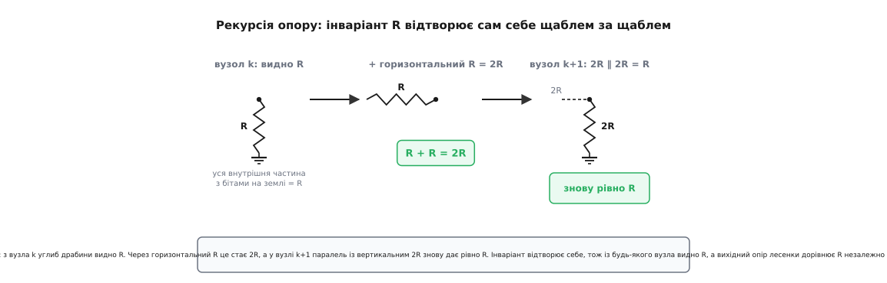

# 🧮 Виведення лесенки через Тевеніна

Інтуїцію за лесенкою R-2R легко прийняти на віру: «структура згортається сама в себе, тож вихідний опір завжди R, а кожен біт важить удвічі менше за сусіда». Гарно — але це твердження, а не доказ. Чесний інженер хоче бачити, **звідки** береться той R і **звідки** беруться степені двійки, та ще й мати під рукою формулу, яку можна перевірити числом. Тут ми це й зробимо: пройдемо лесенку на n щаблів **крок за кроком** через еквівалент Тевеніна, доведемо обидва результати з нуля й покажемо, чому наївний дільник 2R/R дає хибне Vref/3, а правильний інструмент — суперпозиція на всій мережі.

Працюватимемо з режимом напруги (ключі кидають низ кожного 2R між Vref і землею, вихід знімаємо з вузла старшого біта). Усе виведення спирається лише на закон Ома, послідовне й паралельне з'єднання та лінійність — нічого екзотичного.

## Два інструменти, на яких усе тримається

Перш ніж рахувати, домовмося про два знаряддя й про те, **чому** вони тут законні. Без цього виведення перетвориться на жонглювання символами.

Перше — **еквівалент Тевеніна (фр., на честь Léon Charles Thévenin, інженера телеграфу, який сформулював теорему 1883 року)**. Він каже: будь-яку лінійну ділянку з джерелами й опорами, на яку ми дивимося крізь два виводи, можна замінити **одним** джерелом напруги Vᵉ послідовно з **одним** опором Rᵉ — і для всього, що під'єднане до цих двох виводів, заміна непомітна. Саме це нам і потрібно: лесенка — то повторення однакових ділянок, і якщо кожну ділянку згорнути в пару (Vᵉ, Rᵉ), складна мережа стає коротким ланцюжком, який рахується усно.

> 🔧 **Навіщо це.** Еквівалент Тевеніна — то не абстракція з підручника, а спосіб **не потонути** в мережі з десятка вузлів. Замість писати систему рівнянь на всі вузли драбини ми згортаємо її щабель за щаблем у пару чисел і бачимо закономірність наочно. Той самий прийом рятує скрізь, де схема має повторювану структуру: матриці резисторів, сходи фільтрів, довгі лінії передачі.

Короткий конспект, що таке еквівалент Тевеніна й як його знаходять, — у статті [Теорема Тевеніна](book:electronics/thevenin): напругу Vᵉ беруть як напругу холостого ходу між виводами (нічого не під'єднано), опір Rᵉ — як опір тієї ж ділянки з боку виводів, коли всі **незалежні** джерела всередині занулено (джерела напруги замкнено накоротко, джерела струму розірвано).

Друге знаряддя — **суперпозиція**. Лесенка лінійна (самі резистори й ідеальні джерела), а в лінійному колі реакція на кілька джерел дорівнює сумі реакцій на кожне окремо. Тобто щоб знайти Vout за довільного коду, досить порахувати внесок **кожного** біта поодинці — увімкнути лише його ключ на Vref, решту лишити на землі — і скласти. Це різко спрощує задачу: замість одного складного кола з N джерелами ми розв'язуємо N простих кіл з одним джерелом кожне.

Конспект принципу — у статті [Суперпозиція](book:electronics/superposition): у лінійному колі (де струм пропорційний напрузі) відгук від суми джерел дорівнює сумі відгуків від кожного джерела окремо, а решту джерел при цьому занулюють. Лінійність кола, на яку це спирається, розбирає [Лінійність кола](book:electronics/linear-circuit).

А чому для опору і Vref, і земля — однакові? Бо обидва це **ідеальні джерела напруги** з нульовим внутрішнім опором. Коли ми рахуємо **опір** мережі (крок «занули незалежні джерела» в Тевеніні), будь-яке джерело напруги стає просто куском дроту. Тому з погляду опору низ кожного 2R, хоч на Vref, хоч на землі, ведеться в одну й ту саму точку нульового потенціалу. Це спостереження — ключ до того, чому R_вих **не залежить від коду**: топологія опорів однакова за будь-якого положення ключів.

## Крок 1: дальній кінець драбини

Почнімо з найдальшого від виходу краю — там, де лесенку замикає кінцевий («термінальний») резистор 2R. Занумеруймо вузли зсередини назовні: вузол 0 — найдальший (біля термінатора), вузол N−1 — вихідний (старший біт). Між сусідніми вузлами стоїть горизонтальний R; з кожного вузла вниз звисає вертикальний 2R на ключ свого біта.

Спершу знайдемо **опір** з боку виходу — для цього, за рецептом Тевеніна, занулюємо всі джерела (і Vref, і землю — у дріт). Дивимося у вузол 0. До нього під'єднані рівно два резистори по 2R, обидва ведуть на нульовий потенціал: кінцевий термінальний 2R і вертикальний 2R нульового біта. Два опори по 2R [паралельно](book:electronics/parallel-connection):

```
R₀ = 2R ∥ 2R = (2R · 2R) / (2R + 2R) = 4R² / 4R = R
```

Отримали R. Це наш **базовий випадок** — фундамент усієї рекурсії. Запам'ятаймо його: опір, яким дальня частина драбини «дивиться» з вузла 0 у бік термінатора, дорівнює R.

## Крок 2: рекурсія опору — чому згортання повторюється

Тепер ключовий хід — індуктивний. Припустімо, що з якогось вузла k, дивлячись углиб драбини (у бік менших номерів), ми бачимо опір рівно R. Для k = 0 це щойно доведено. Покажімо, що тоді й з наступного вузла k+1 теж буде R — і за індукцією це триматиметься до самого виходу.

Перейдемо від вузла k до вузла k+1. Між ними — горизонтальний R. Той опір R, що ми бачили з вузла k, тепер з'єднаний з вузлом k+1 **через** цей горизонтальний R, тобто послідовно:

```
R + R = 2R
```

А у вузлі k+1 цей шлях (2R) зустрічає вертикальний 2R **свого** біта k+1 — паралельно:

```
R_{k+1} = (R_k + R) ∥ 2R = (R + R) ∥ 2R = 2R ∥ 2R = R
```

Картина повторилася буква в букву. Накопичений опір R, плюс горизонтальний R дає 2R, який паралелиться з черговим 2R знову до R. Це і є **самоподібність** драбини: вона містить зменшену копію себе, тож згортання одне й те саме на кожному щаблі.


*Індуктивний крок рекурсії опору. Зліва: з вузла k углиб видно R (базовий випадок — дві паралельні 2R). Через горизонтальний R цей опір стає R+R=2R, що у вузлі k+1 паралелиться з вертикальним 2R і знову дає рівно R. Інваріант R відтворює сам себе, тож із будь-якого вузла вглиб драбини видно той самий опір незалежно від числа щаблів.*

Звідси два висновки. По-перше, з **будь-якого** вузла вглиб драбини видно рівно R. По-друге — і це те, заради чого все робилося, — [вихідний опір](book:electronics/internal-resistance) усієї лесенки з боку Vout теж дорівнює R, **незалежно від коду**. Чому незалежно? Бо в цьому розрахунку ми **занулили** джерела, і ключі бітів перестали мати значення: хоч на Vref, хоч на землю — низ кожного 2R веде в нульовий потенціал, тож топологія опорів та сама за будь-якого положення ключів. R_вих = R за будь-якого числа N. Ця сталість — окрема цінна властивість: буферу за драбиною джерело завжди здається однаковим, з тим самим внутрішнім опором R.

Тут варто на мить спинитися й оцінити, наскільки сильне це твердження. Опір складної мережі з 2N резисторів, що залежить від положення N ключів, мав би бути громіздкою функцією коду. А він — просто R. Уся складність скоротилася завдяки одному відношенню 2R до R, рівному двом. Якби це відношення було хоч трохи інше, рекурсія не замикалась би: накопичений опір не дорівнював би R, на кожному щаблі виходило б нове число, і опір таки залежав би від коду. Магія — саме в 1:2.

## Крок 3: внесок одного біта — і спокуса «дільника на R»

Опір знайдено. Тепер — друга половина, **двійкові ваги**. Скористаймося суперпозицією: увімкнемо лише один біт k (його ключ на Vref, решта на землі) і знайдемо, скільки він дає на виході. Це й буде «вага» біта k.

Подивімося у вузол k. До нього сходяться рівно три гілки: **углиб** (горизонтальний R до сусіда й уся внутрішня драбина), **щабель** (вертикальний 2R цього біта, низ якого зараз на Vref) і **назовні** (решта драбини до виходу, її поки відкладемо). Згорнімо внутрішній бік у пару Тевеніна — і тут чигає спокуса.

Ми щойно довели: з будь-якого вузла вглиб видно R. Рука сама тягнеться написати «углиб — опір R, щабель — 2R, отже [дільник напруги](book:electronics/voltage-divider) дає Vref·R/(R+2R) = Vref/3». Число Vref/3 виглядає переконливо — і воно **хибне**. Варто дуже чітко побачити чому, бо це рівно та сама пастка, що й наївний дільник 2R/R.

Помилка — в тому, **що саме** дорівнює R. Інваріант із кроку 2 — це опір вузла на землю **разом із його власним вертикальним 2R**: у рекурсії R_k = (…) ∥ 2R той доданок 2R і є заземлений щабель самого вузла. А зараз щабель вузла k **не** на землі — він на Vref, це наше джерело. Одну й ту саму вітку не можна рахувати одночасно і джерелом, і частиною «опору на землю». Заберімо її — і подивімося, що лишилось з боку землі.

Від вузла k до землі веде горизонтальний R до сусіднього вузла k−1; а вузол k−1 з усім, що за ним (його **заземлений** щабель, дальші вузли, термінатор), — це рівно інваріант з кроку 2, опір R. Послідовно:

```
R_углиб = R + R = 2R
```

Ключова різниця: щабель самого вузла k — джерело, ми його прибрали; щаблі вузла k−1 і всі глибші — на землі, вони й складають той інваріантний R. Тому знизу маємо 2R, а не R. (Для найдальшого вузла 0 внутрішнього сусіда немає — там углиб веде прямо термінальний 2R, і це теж 2R.)

Отже до вузла k під'єднані **два** опори по 2R: щабель 2R на Vref і шлях углиб 2R на землю. Це чесний дільник, але з **рівними** плечима 2R і 2R, а не R і 2R. Пара Тевеніна з боку вузла:

```
Vᵉ_k = Vref · 2R / (2R + 2R) = Vref / 2
Rᵉ_k = 2R ∥ 2R = R
```

Ось справжня напруга Тевеніна у вузлі k: Vref/2, з послідовним опором рівно R. Спокусливе Vref/3 бралося з того, що в нижнє плече помилково підставили R замість чесних 2R — «забули» горизонтальний R і мовчки лишили заземлений щабель за все нижнє плече. Різниця між Vref/2 і Vref/3 — не дрібниця, а межа між правильною й хибною моделлю.

І зверніть увагу на подарунок: **опір цієї пари — рівно R**. Саме ця обставина зробить дальший шлях до виходу кристально прозорим.

## Крок 4: проводимо джерело до виходу — звідки береться множник ½

Маємо у вузлі k джерело Vᵉ_k = Vref/2 з послідовним опором Rᵉ_k = R. Тепер проведімо цю пару **назовні**, вузол за вузлом, до вихідного вузла N−1, і подивімося, що робить із сигналом кожен пройдений щабель.

Один крок: від вузла k через горизонтальний R до вузла k+1. Біт k+1 зараз **вимкнений**, тож його вертикальний 2R сидить на землі. У вузлі k+1 наше джерело бачить дільник: зверху — послідовний шлях (опір джерела Rᵉ_k плюс горизонтальний R), знизу — вертикальний 2R на землю. Верхнє плече:

```
Rᵉ_k + R = R + R = 2R
```

Обидва плеча по 2R — і напруга ділиться **рівно навпіл**:

```
Vᵉ_{k+1} = Vᵉ_k · 2R / (2R + 2R) = Vᵉ_k / 2
```

А що з опором нової пари? Це (Rᵉ_k + R) паралельно з вертикальним 2R (джерело при обчисленні опору занулюємо):

```
Rᵉ_{k+1} = (Rᵉ_k + R) ∥ 2R = (R + R) ∥ 2R = 2R ∥ 2R = R
```

Опір **не змінився** — знову рівно R. Ось де вся суть множника ½: він береться не з туманної «симетрії взагалі», а з того, що опір пари тримається на R. Поки він R, верхнє плече наступного дільника — це R + R = 2R, точно як нижній вертикальний 2R; рівні плеча дають поділ надвоє. Той самий інваріант (R + R) ∥ 2R = R, що в кроці 2 давав сталий вихідний опір, тут ще й **утримує коефіцієнт передачі рівним ½ на кожному щаблі**.

Тепер видно, звідки в наївному підході бралися брудні дроби. Якби ми повірили в Vᵉ_k = Vref/3 з Rᵉ_k = (2/3)R (а саме так і виходить із хибного R у нижньому плечі), то перший же щабель дав би не ½: верхнє плече (2/3)R + R = (5/3)R проти нижнього 2R, тобто множник 2R / ((5/3)R + 2R) = 6/11, і далі опір поповз би на (10/11)R. Чисте ½ з'являється **лише** тоді, коли опір джерела точно R, — тобто рівно тоді, коли углиб узято правильно, 2R, а не R.

## Крок 5: індукція на всю драбину — загальна вага біта

Один щабель ми пройшли; тепер — уся драбина, для **будь-якого** N і будь-якого біта k. Ведемо пару Тевеніна (Vᵉ, Rᵉ) від вузла k назовні й доводимо індукцією по числу пройдених щаблів h.

**База (h = 0), вузол k.** З кроку 3: Vᵉ = Vref/2, Rᵉ = R.

**Крок індукції (h → h+1).** Нехай після h щаблів маємо пару з опором саме R і напругою Vᵉ. Наступний вузол на шляху вимкнений (його біт на землі), там вертикальний 2R на землю. З кроку 4: новий опір (R + R) ∥ 2R = R **той самий**, а нова напруга — Vᵉ/2. Опір відтворив себе, тож умова індукції виконується знову, і крок можна повторювати скільки завгодно разів.

Отже після h щаблів опір усе ще R, а напруга — Vref/2, поділена навпіл рівно h разів:

```
Vᵉ(h) = (Vref / 2) · (1/2)^h = Vref / 2^(h+1)
Rᵉ(h) = R
```

**Кінець драбини.** Від вузла k до виходу N−1 рівно h = N−1−k щаблів. У самому вихідному вузлі назовні вже **нічого немає** — вихід розімкнений (буфер із нескінченним входом струму не бере). Вантажити пару нікому, тож її напруга холостого ходу Vᵉ(h) — це і є справжній Vout. Підставмо h = N−1−k:

```
V_k = Vref / 2^(N−1−k+1) = Vref / 2^(N−k)
```

Ось вони, степені двійки — **доведені для драбини будь-якої довжини**, а не вгадані на одному прикладі. Старший біт k = N−1: h = 0, вага Vref/2. Молодший k = 0: h = N−1, вага Vref/2ᴺ. Кожен нижчий біт проходить на один щабель більше — і саме тому важить удвічі менше.

Один тонкий момент, щоб не сплутати. Напруга Vᵉ(h) на проміжному вузлі — це напруга холостого ходу **його** пари Тевеніна, а не справжній потенціал того вузла (справжній нижчий, бо далі висить решта драбини й підвантажує вузол). Рівність «Тевенін = справжня напруга» справджується **лише** на самому виході, де вантажити вже нічим. Тому вздовж шляху ділити навпіл коректно саме пари Тевеніна, а прочитати як Vout — останню з них.

## Крок 6: пряма перевірка — маленька драбина N = 2

Індукція — це доказ. Перевірмо його незалежно, розв'язавши найменшу нетривіальну драбину **точно**, методом вузлових потенціалів, без жодних Тевенінів. Візьмемо N = 2: два біти, молодший b0 у вузлі 0, старший b1 у вузлі 1 (= вихід). Топологія: термінальний 2R від вузла 0 на землю; вертикальний 2R(b0) від вузла 0; горизонтальний R між вузлами 0 і 1; вертикальний 2R(b1) від вузла 1.

**Старший біт.** Увімкнемо лише b1: низ 2R(b1) на Vref, решта — на землі. Вихід розімкнений. У вузлі 0 сходяться термінатор 2R на 0 В, щабель 2R(b0) на 0 В і горизонтальний R на вузол 1; у вузлі 1 — щабель 2R(b1) на Vref і горизонтальний R на вузол 0.

Рівняння для вузла 0 (сума струмів = 0):

```
V₀/2R + V₀/2R + (V₀ − V₁)/R = 0
```

Перші два члени дають V₀/R, тож:

```
V₀/R + (V₀ − V₁)/R = 0
2V₀ − V₁ = 0
V₀ = V₁ / 2
```

Рівняння для вузла 1, помножене на 2R, з підстановкою V₀ = V₁/2:

```
(V₁ − Vref)/2R + (V₁ − V₀)/R = 0
(V₁ − Vref) + 2(V₁ − V₀) = 0
3V₁ − 2V₀ = Vref
3V₁ − V₁ = Vref
V₁ = Vref / 2
```

Вихід Vout = V₁ = **Vref/2** — точно те, що дала індукція для старшого біта (h = 0). Чесний розрахунок підтверджує Vref/2, а не спокусливе Vref/3: підстановка «нижнє плече = R» справді хибна, бо, як ми бачили в кроці 3, чесний шлях углиб — 2R.

## Крок 7: молодший біт — Vref/4, і перевірка загальної формули

Повторімо точний розрахунок для **молодшого** біта тієї самої драбини N = 2 — щоб побачити поділ навпіл уже між сусідніми бітами. Тепер низ 2R(b0) на Vref, низ 2R(b1) і термінатор — на землю.

Рівняння вузла 1 (вихід; біт b1 на землі):

```
V₁/2R + (V₁ − V₀)/R = 0   →   V₁ + 2(V₁ − V₀) = 0   →   V₁ = (2/3)V₀
```

Рівняння вузла 0 (біт b0 на Vref), помножене на 2R:

```
V₀/2R + (V₀ − Vref)/2R + (V₀ − V₁)/R = 0
V₀ + (V₀ − Vref) + 2(V₀ − V₁) = 0
4V₀ − 2V₁ = Vref
```

Підставимо V₁ = (2/3)V₀:

```
4V₀ − (4/3)V₀ = Vref
(8/3)V₀ = Vref
V₀ = (3/8)Vref
```

А вихід:

```
V₁ = (2/3)V₀ = (2/3)·(3/8)Vref = Vref / 4
```

Маємо **Vout = Vref/4** для молодшого біта — рівно **вдвічі менше** за старший (Vref/2), точно як провіщає формула V_k = Vref/2^(N−k) для N = 2, k = 0. Молодший біт «програв» рівно один зайвий щабель драбини.

Обидві перевірки збіглися з індукцією до останньої цифри — і вони не обмежені двома бітами. Той самий точний метод для довшої драбини дає те саме: розв'язавши, наприклад, середній біт трибітної драбини (N = 3, k = 1), на виході дістанемо V₂ = Vref/4 = Vref/2^(3−1) — знову рівно за формулою. Загальний результат уже доведено індукцією кроку 5; ці числа лише дають його помацати руками. Підсумок ваг:

```
V_k = Vref · 2^(k − N) = Vref / 2^(N − k)
```

Старший = Vref/2, далі Vref/4, Vref/8, …, молодший = Vref/2ᴺ. Кожен нижчий біт важить удвічі менше — бо «програє» на один зайвий щабель драбини, а кожен щабель завдяки рівним плечима 2R ділить рівно навпіл.

## Крок 8: складаємо біти — повна формула виходу

Лишилося скласти. Коло лінійне, тож за суперпозицією повний вихід — сума ваг увімкнених бітів. Позначмо bₖ ∈ {0, 1} стан біта k (1 — ключ на Vref, 0 — на землю). Тоді:

```
Vout = Σ bₖ · V_k = Vref · Σ bₖ · 2^(k − N)
       k=0..N−1            k=0..N−1
```

Винесімо 2⁻ᴺ за дужки:

```
Vout = (Vref / 2ᴺ) · Σ bₖ · 2ᵏ = Vref · код / 2ᴺ
                      k=0..N−1
```

бо Σ bₖ·2ᵏ — це і є саме двійкове число «код», складене з бітів. Готово:

```
Vout = Vref · код / 2ᴺ
```

Лесенка **буквально обчислює** Vref·код/2ᴺ — двійкове зважування зроблене фізикою кола, без жодного підсумовувача. І зверніть увагу на найважливіше: у формулі **немає** абсолютного R. Він скоротився ще на кроці дільників — усюди ділення R на R чи 2R на R, і номінал випав. Вихід залежить лише від **відношення** 2R до R (яке має дорівнювати точно двом) і від Vref. Абсолютна величина опору може плисти від температури хоч на десятки відсотків — поки всі резистори пливуть разом, відношення тримається, і вихід не зрушить. Саме тому R-2R точніша за зважені резистори: вона ставить на **відповідність** елементів, а не на їхні абсолютні значення, а відповідність — найсильніша сторона інтегральної технології.

## Чому наївний дільник 2R/R дає Vref/3 — і де саме бреше

Зберімо в одне місце пастку, бо вона трапляється раз у раз. Дивлячись на старший біт, спокусливо сказати: «зверху щабель 2R, знизу — решта драбини, а її опір ми ж довели, що R, отже дільник Vref·R/(R+2R) = Vref/3». Ми вже бачили вище, де це ламається; зберімо механізм в одному місці.

Найперша тріщина — в тому, що «R» тут узято не те. Інваріант із кроків 1–2 — це опір вузла на землю **разом із його власним заземленим щаблем 2R**. Але коли цей біт увімкнений, його щабель — джерело на Vref, а не опір на землю; вилучивши щабель, з боку землі маємо горизонтальний R **плюс** внутрішню драбину R, тобто 2R, а не R. Чесний дільник тоді — 2R згори (щабель) проти 2R знизу (углиб), рівні плеча, Vref/2. Підстановка R замість 2R у нижнє плече — це рівно та сама помилка, що й наївний 2R/R, лише переодягнена.

Є й глибша причина, чому взагалі небезпечно зводити вузол до одного дільника. Дільник напруги чесний **лише** тоді, коли його нижнє плече одним кінцем сидить на жорсткому нулі й **весь** струм верхнього плеча тече крізь нього. А вузол драбини зазвичай має **більше двох** гілок, і внутрішні вузли **плавають** на ненульових потенціалах (ми порахували V₀ = V₁/2) — частина струму розходиться вбік і циркулює всередині мережі, тож жодне окреме плече не несе весь струм. Ось чому надійний шлях лише один: не різати мережу оком, а вести пару Тевеніна (як у кроках 3–5) або писати вузлові рівняння на всю мережу.

Правильний інструмент — **суперпозиція на всій лінійній мережі** (або, що те саме, повні вузлові рівняння / акуратний Тевенін, що веде пару Vᵉ і Rᵉ разом). Він і дав Vref/2, Vref/4, … Різниця між Vref/3 і Vref/2 — не дрібниця заокруглення, а різниця між хибною й правильною моделлю; для 8-бітного ЦАП це розбіжність у сотні мілівольтів, тобто десятки молодших розрядів. Мораль проста: складну лінійну мережу не можна різати на «локальний дільник» поглядом — або рахуй усю мережу, або не рахуй зовсім.

> 🔧 **Навіщо це.** Ця пастка — не екзотика для драбин. Щойно у схемі вузол має **більше двох** під'єднаних гілок (а так майже завжди), «дільник на око» бреше, бо забуває про бічні шляхи струму. Звичка зводити до Тевеніна або писати вузлові рівняння замість вгадування дільника рятує від цілого класу помилок у будь-якій аналоговій схемі — від зміщення транзистора до мереж зворотного зв'язку.

## Worked-приклад: перевіряємо формулу числом

**Умова.** 8-бітна лесенка, Vref = 3.3 В, код 200 (двійкове `11001000`, тобто увімкнено біти 7, 6 і 3). Порахуймо вихід двома способами — через суму ваг окремих бітів і через готову формулу — і переконаймося, що збігається.

Спершу через ваги. Біт 7 (старший) важить Vref/2¹, біт 6 — Vref/2², біт 3 — Vref/2⁵ (бо N−k = 8−3 = 5):

```
біт 7: Vref / 2 = 3.3 / 2     = 1.6500 В
біт 6: Vref / 4 = 3.3 / 4     = 0.8250 В
біт 3: Vref / 32 = 3.3 / 32   = 0.1031 В
сума                          = 2.5781 В
```

Тепер через формулу:

```
Vout = Vref · код / 2ᴺ = 3.3 · 200 / 256 = 660 / 256 = 2.5781 В
```

Збіглося до знака — підтвердження, що сума двійкових ваг і компактна формула — те саме. Крок між сусідніми кодами (вага молодшого біта) тут:

```
LSB = Vref / 2ᴺ = 3.3 / 256 = 0.0129 В = 12.9 мВ
```

тонше за 12.9 мВ ця драбина виставити не може. У прошивці й розрахунок ваг, і перевірку зручно тримати поряд із драйвером ЦАП:

:::tabs
```cpp
#include <cstdint>

// Внесок одного біта k у вихід ідеальної R-2R лесенки (режим напруги).
// k = 0 — молодший біт, k = bits-1 — старший. Вага = Vref / 2^(bits - k).
double r2r_bit_weight(double vref, uint8_t bits, uint8_t k)
{
    uint8_t shift = (uint8_t)(bits - k);     // N - k
    return vref / (double)((uint32_t)1 << shift);
}

// Вихід через суму ваг увімкнених бітів — пряме втілення суперпозиції.
// Має збігтися з компактною формулою vref*code/2^bits до похибки double.
double r2r_voltage_by_bits(double vref, uint8_t bits, uint32_t code)
{
    double v = 0.0;
    for (uint8_t k = 0; k < bits; ++k)
        if (code & ((uint32_t)1 << k))       // біт k увімкнений?
            v += r2r_bit_weight(vref, bits, k);
    return v;
}

// Та сама величина одним множенням — те, що довели на крокax 7-8.
double r2r_voltage(double vref, uint8_t bits, uint32_t code)
{
    return vref * (double)code / (double)((uint32_t)1 << bits);
}
// r2r_voltage_by_bits(3.3, 8, 200) -> ~2.578 В  (1.650 + 0.825 + 0.103)
// r2r_voltage       (3.3, 8, 200) -> ~2.578 В
```
```python
# Внесок одного біта k у вихід ідеальної R-2R лесенки (режим напруги).
# k = 0 — молодший біт, k = bits-1 — старший. Вага = Vref / 2^(bits - k).
def r2r_bit_weight(vref, bits, k):
    shift = bits - k                 # N - k
    return vref / (1 << shift)

# Вихід через суму ваг увімкнених бітів — пряме втілення суперпозиції.
# Має збігтися з компактною формулою vref*code/2^bits.
def r2r_voltage_by_bits(vref, bits, code):
    return sum(r2r_bit_weight(vref, bits, k)
               for k in range(bits) if code & (1 << k))   # біт k увімкнений?

# Та сама величина одним множенням — те, що довели на кроках 7-8.
def r2r_voltage(vref, bits, code):
    return vref * code / (1 << bits)

# r2r_voltage_by_bits(3.3, 8, 200) -> ~2.578 В  (1.650 + 0.825 + 0.103)
# r2r_voltage       (3.3, 8, 200) -> ~2.578 В
```
:::

Перша функція складає ваги біт за бітом — це суперпозиція, перенесена в код один-в-один. Друга рахує те саме одним множенням. Що вони завжди дають однакове число — і є практичний доказ усього виведення: складна на вигляд мережа звелася до формули `код/2ᴺ`, і ані опір R, ані положення внутрішніх вузлів у тій формулі не лишилося.

## Сухий підсумок виведення

Складімо ланцюжок докупи. Базовий випадок: на дальньому кінці 2R ∥ 2R = R. Індуктивний крок: (R + R) ∥ 2R = R — тож з будь-якого вузла вглиб видно R, і вихідний опір драбини дорівнює R незалежно від коду (бо в розрахунку опору джерела занулені й ключі не важать). Далі суперпозиція: внесок кожного біта рахуємо поодинці. У вузлі увімкненого біта k шлях углиб на землю — це 2R (горизонтальний R плюс внутрішня драбина R, а **не** просто R: інваріант рахував і власний щабель, який тепер став джерелом), тож пара Тевеніна тут — Vref/2 з опором рівно R. Цей опір R далі тримається на кожному щаблі ((R + R) ∥ 2R = R), а рівні плеча 2R і 2R дають поділ рівно навпіл; за індукцією після N−k щаблів до розімкненого виходу вага біта — Vref·2^(k−N), тобто старший Vref/2, наступний Vref/4 і так далі. Сума ваг згортається у Vout = Vref·код/2ᴺ, де R уже скоротився. Наївний дільник 2R/R дає хибне Vref/3, бо в нижнє плече бере R замість чесних 2R (і взагалі зводить до одного дільника вузол, у якому струм розходиться кількома гілками, а внутрішні вузли плавають) — правильний інструмент лише один: суперпозиція (повні вузлові рівняння / пара Тевеніна) на всій лінійній мережі. Звідси й точність R-2R: вона спирається на відношення 2R до R, а не на абсолютний опір.
