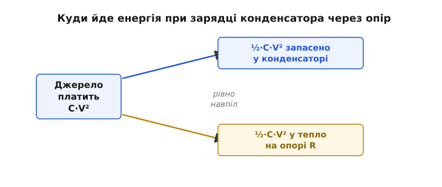
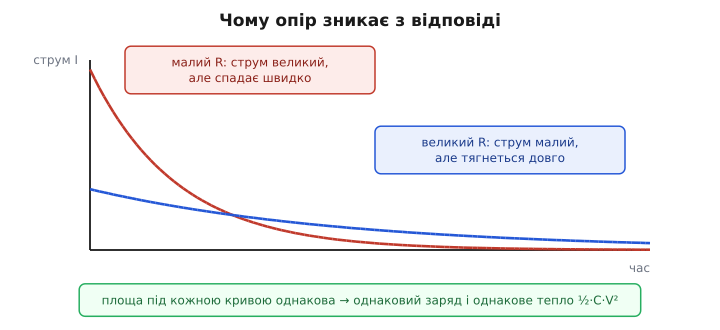
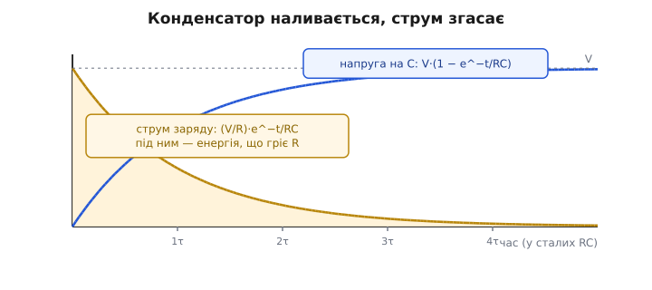
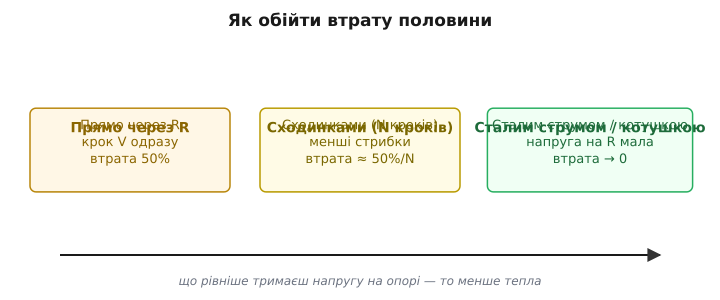

# Парадокс зарядки конденсатора: куди зникає половина енергії

Візьміть порожній конденсатор, увімкніть його через резистор до батарейки й зачекайте, поки зарядиться вщерть. Питання просте: скільки енергії пішло на цю зарядку? Здається, відповідь очевидна: стільки, скільки тепер зберігає конденсатор, ½·C·V². Адже куди ще їй подітися — резистор лише «пропускає» струм, а в кінці, коли все зарядилося, струм спадає до нуля й резистор не гріється зовсім.

Полічімо чесно — і натрапимо на дивне. Батарея віддала вдвічі більше, ніж осіло в конденсаторі. Рівно **половина** всієї енергії, яку дала батарея, перетворилася на тепло в резисторі. І найбентежніше: ця половина гріє резистор **байдуже, який він**. Поставте опір у тисячу разів менший — втрата та сама. Поставте мідну дротину з мізерним опором — та сама половина в тепло. Зменшити втрату, зробивши провід «кращим», не виходить узагалі. Щось тут не сходиться з інтуїцією, і варто розібратися чому — бо за цим стоїть не казус, а закон, який інженер обходить щодня, проєктуючи джерела живлення, заряд-помпи та схеми на перемикачах.


*Баланс енергії при зарядці від джерела сталої напруги. Скільки б енергії не дала батарея, рівно половина осідає в конденсаторі як ½·C·V², а друга половина обов'язково розсіюється теплом на опорі гілки — і ця частка не залежить від того, великий той опір чи мізерний.*

## Спершу — баланс: хто скільки заплатив

Розкладімо рух енергії на три рахунки: скільки дала батарея, скільки лишилося в конденсаторі, скільки згоріло в резисторі. Жодних інтегралів поки що — самі тільки заряд і напруга.

Конденсатор, заряджений до напруги V, тримає заряд Q = C·V. Уся ця порція заряду мусила пройти від батареї крізь коло. Батарея — це джерело **сталої** напруги: вона тримає на своїх клемах V увесь час, поки женеться заряд. Робота, яку виконує джерело, проштовхуючи заряд Q крізь різницю потенціалів V, — це просто добуток:

```
W_бат = Q · V = C · V · V = C · V²
```

Ось перша несподіванка: батарея заплатила C·V², а не ½·C·V². Чому вдвічі більше? Бо джерело тисне на заряд **повними** вольтами від першої миті до останньої — навіть тоді, коли конденсатор уже майже повний і брати від нього вже нічого. А ось скільки [запасає сам конденсатор](book:electronics/capacitor-energy) — то інша річ. Його напруга росте від нуля до V поступово, тож «у середньому» заряд заходив під половину напруги, і збережена енергія виходить удвічі меншою:

```
W_C = ½ · C · V²
```

Різниця між тим, що дала батарея, і тим, що осіло, нікуди не зникає — енергія зберігається. Вона мусила перетворитися на тепло, і єдине місце, де це могло статися, — резистор:

```
W_R = W_бат − W_C = C·V² − ½·C·V² = ½·C·V²
```

Отже половина. Не «приблизно», не «залежно від схеми» — рівно половина того, що дала батарея, завжди стає теплом, щойно ви заряджаєте конденсатор від джерела сталої напруги через будь-який опір. І зверніть увагу: у цьому підрахунку **немає R**. Опір узагалі не з'явився у відповіді — і саме це найдивніше. Розберімо, як таке можливо.

## Чому опір випадає з відповіді

Інтуїція бунтує: якщо тепло виділяється **на резисторі**, то менший резистор мав би гріти менше. У сталому колі так і є — закон Джоуля каже, що потужність на опорі P = I²·R, тож за того самого струму менший R справді гріє слабше. Чому ж тут інакше?

Бо струм не «той самий». Він сам залежить від R, і залежить так, що дві протилежні дії точно гасять одна одну. Простежмо ланцюжок.

Зменшили опір удесятеро. Тієї ж миті струм заряду на старті підскочив удесятеро — адже за законом Ома початковий кидок струму I₀ = V/R, і менший опір пускає більший струм. Потужність втрат P = I²·R тепер начебто більша. Але є друга дія: з таким навальним струмом конденсатор наповнюється удесятеро **швидше**. Уся подія, яка раніше тяглася, тепер пролітає за коротку мить. А повна енергія — це потужність, помножена на час. Потужність зросла, час стиснувся — і добуток лишився тим самим.

Полічимо точніше, щоб переконатися, що це не груба прикидка, а точне скорочення. [Стала RC](book:electronics/rc-time-constant) — характерний час події — дорівнює τ = R·C. Менший R дає менший τ: подія коротша рівно настільки, наскільки більший струм. Енергія, що гріє резистор, — це інтеграл потужності I²·R за весь час. Струм спадає за експонентою i(t) = (V/R)·e^−t/RC, тож

```
W_R = ∫ i²·R dt = ∫₀^∞ (V/R)²·R · e^−2t/RC dt
W_R = (V²/R) · [ −RC/2 · e^−2t/RC ]₀^∞
W_R = (V²/R) · (RC/2)
W_R = ½ · C · V²
```

Дивіться, що сталося в передостанньому рядку: множник V²/R з квадрата струму перемножився з RC/2 з інтеграла, і **R просто скоротився**. Великий струм (дільник R) і довгий час (множник R у сталій часу) — це той самий R, що входить раз у знаменник і раз у чисельник. Він зникає математично, бо фізично дві його дії точно врівноважені. Скільки б ви не міняли опір, площа під кривою тепловиділення лишається тією самою: вища й вужча для малого R, нижча й ширша для великого.


*Чому опір зникає з відповіді. Малий опір (суцільна крива) пускає великий струм, який швидко згасає; великий опір (пунктир) пускає малий струм, що довго тягнеться. Площа під обома кривими однакова — а саме вона задає і перенесений заряд, і виділене тепло. Тому втрата ½·C·V² не залежить від R.*

> 🔧 **Навіщо це.** Це не філософська тонкість — це бюджет потужності, який вирішує, гріється ваш чип чи ні. Кожна [заряд-помпа](book:electronics/charge-pump-conv) переливає енергію, перезаряджаючи конденсатори через опір ключів, і на кожному такому перезаряді вона викидає в тепло частку енергії, яку **не зменшити, поліпшивши ключ**. Це фундаментальна стеля коефіцієнта корисної дії всіх схем, що рухають заряд між ємностями стрибком напруги: комутованих фільтрів, помп, навіть драйверів цифрових затворів. Коли ви бачите, що перетворювач на конденсаторах не дотягує до 100% хоч би які добрі деталі поставити, — це той самий закон ½·C·V². Інженер, який його не знає, шукатиме «кращий конденсатор» там, де треба міняти **спосіб** зарядки.

## Що відбувається в часі

Корисно побачити подію зсередини, бо вона пояснює, **коли** саме гріється резистор. На самому початку конденсатор порожній, напруга на ньому нуль — отже вся напруга батареї падає на резисторі, і саме тоді струм найбільший, а резистор гріється найдужче. Минає час: конденсатор наливається, його напруга підпирає батарею знизу, на резистор лишається дедалі менше — струм згасає, тепловиділення слабшає. Наприкінці конденсатор майже повний, на резисторі майже нуль вольтів, струму майже немає, резистор холодний.

Тобто весь жар виділяється **на старті**, поки на резисторі багато напруги й крізь нього йде великий струм. Саме цей перекіс — велика напруга на резисторі на початку — і є джерелом утрати. Запам'ятайте цю думку: уся стратегія обходу втрат зведеться до того, щоб **не давати напрузі на резисторі бути великою**.


*Конденсатор наливається, струм згасає. Напруга на конденсаторі піднімається за законом V·(1 − e^−t/RC), а струм заряду спадає за (V/R)·e^−t/RC. Заштрихована площа під струмом — це й є енергія, що пішла в тепло; вона зосереджена на старті, коли на резисторі ще багато напруги. За одну сталу RC напруга проходить ~63% шляху, за п'ять — практично доходить до V.*

**Worked-приклад: скільки тепла і скільки часу.** Заряджаємо конденсатор C = 100 мкФ до V = 5 В через резистор R = 100 Ом від стабільного джерела 5 В. Скільки енергії осіло, скільки згоріло, як довго тривало?

```
Запасено в конденсаторі:   W_C = ½·C·V² = ½ · 100e−6 · 5²  = 1.25 мДж
Згоріло в резисторі:       W_R = ½·C·V² = 1.25 мДж   (рівно стільки ж!)
Заплатила батарея:         W_бат = C·V² = 2.5 мДж
Стала часу:                τ = R·C = 100 · 100e−6 = 10 мс
Практично заряджено (5τ):  ≈ 50 мс
```

Половина того, що дала батарея, пішла на нагрів резистора — байдуже, що це за резистор. Поставте 1 Ом замість 100 — згорить ті самі 1.25 мДж, лише за 0.5 мс замість 50 мс. У коді ця арифметика тримається поряд, бо нею часто перевіряють бюджет енергії імпульсних вузлів:

:::tabs

```c
// Енергетичний баланс зарядки конденсатора від джерела сталої напруги.
// Усе в СІ: фаради, вольти, ом → джоулі та секунди.
typedef struct { float w_src, w_cap, w_heat, tau; } charge_budget_t;

charge_budget_t rc_charge_budget(float C, float V, float R)
{
    charge_budget_t b;
    b.w_cap  = 0.5f * C * V * V;   // осіло в конденсаторі
    b.w_heat = 0.5f * C * V * V;   // згоріло в резисторі — НЕ залежить від R
    b.w_src  = C * V * V;          // заплатило джерело = сума двох вище
    b.tau    = R * C;              // стала часу: лише вона залежить від R
    return b;
}
// rc_charge_budget(100e-6f, 5.0f, 100.0f):
//   w_cap = w_heat = 1.25 мДж,  w_src = 2.5 мДж,  tau = 10 мс
```

```python
# Той самий енергетичний баланс. Усе в СІ: фаради, вольти, ом → джоулі, секунди.
from dataclasses import dataclass

@dataclass
class ChargeBudget:
    w_src: float     # заплатило джерело
    w_cap: float     # осіло в конденсаторі
    w_heat: float    # згоріло в резисторі
    tau: float       # стала часу

def rc_charge_budget(C, V, R):
    return ChargeBudget(
        w_cap=0.5 * C * V * V,   # осіло в конденсаторі
        w_heat=0.5 * C * V * V,  # згоріло в резисторі — НЕ залежить від R
        w_src=C * V * V,         # заплатило джерело = сума двох вище
        tau=R * C,               # стала часу: лише вона залежить від R
    )

# rc_charge_budget(100e-6, 5.0, 100.0):
#   w_cap = w_heat = 1.25 мДж,  w_src = 2.5 мДж,  tau = 10 мс
```

:::

Зверніть увагу, що в коді R входить **лише** в сталу часу. Енергії його не бачать. Хочете менше гріти — не чіпайте R, він тут безсилий; треба міняти саму схему зарядки.

## Як обійти втрату половини

Якщо опір не рятує, то що рятує? Повернімося до причини: тепло береться з великої напруги на резисторі на початку. Отже, щоб менше гріти, треба не дозволяти напрузі на резисторі бути великою — підводити заряд маленькими порціями або тонким струмом, щоб резистор завжди мав на собі лише крихту вольтів. Є три практичні шляхи, і всі вони — про одне.

**Зарядка сходинками.** Замість одного стрибка від 0 до V підводьте напругу східцями: спершу до V/2, дайте зрівнятися, тоді до V. На кожному кроці резистор бачить лише пів-стрибок напруги, тож гріється вчетверо менше, але кроків два — разом утрата падає вдвічі. Розбийте шлях на N однакових східців — і втрата впаде приблизно в N разів, бо кожен крок усе менший. Десять східців — і ви викидаєте в тепло не 50%, а близько 5%. Саме так працюють «адіабатичні» схеми зарядки й деякі ощадливі драйвери: дрібнять стрибок, щоб обікрасти цей закон.

**Зарядка сталим струмом.** Гранична межа тих східців — нескінченно дрібні кроки, тобто плавне підведення заряду рівним струмом. Якщо замість батареї поставити [джерело сталого струму](book:electronics/current-source), напруга на резисторі вже не валиться стрибком: струм невеликий і незмінний, тож на резисторі весь час сидить лише крихітне I·R, і його тепловиділення можна зробити як завгодно малим, просто беручи менший струм (ціною довшого часу). Конденсатор при цьому наливається не за експонентою, а **рівною прямою** — бо зі сталим струмом dU/dt = I/C сталий. Утрата вже не прив'язана до ½·C·V²; вона дорівнює I²·R, помноженому на час, і її можна тиснути скільки завгодно близько до нуля.

**Зарядка через котушку.** Найхитріший шлях — підводити енергію не через резистор, а через [котушку індуктивності](book:electronics/inductor-energy). Ідеальна котушка не гріється зовсім: вона на час запасає енергію в магнітному полі й віддає її конденсаторові. Коло «котушка + конденсатор» — це коливальний контур, і енергія в ньому перетікає туди-сюди без утрат. На цьому стоять усі [імпульсні перетворювачі](book:electronics/switching-converter): вони женуть енергію крізь котушку саме тому, що так її можна перекладати з місця на місце майже без нагріву — обходячи стелю ½·C·V², яку ставить резистивна зарядка.


*Три способи зарядити той самий конденсатор і їхні втрати. Прямий стрибок напруги через резистор завжди дарує теплу половину. Розбивши стрибок на N східців, утрату зменшують приблизно в N разів. Гранична межа — підведення сталим струмом (або через котушку): напруга на резисторі лишається малою весь час, і втрату можна звести майже до нуля. Спільна ідея одна: що рівніше тримаєш напругу на опорі, то менше тепла.*

## А якщо опору зовсім немає?

Лишається питання, від якого паморочиться: добре, тепло «не залежить від R». А якщо R **точно нуль** — надпровідна дротина без жодного опору? Формула ½·C·V² нахабно стверджує, що піввтрати станеться все одно. Але ж гріти нема чому: резистора немає. Куди тоді подінеться енергія?

Це справжній парадокс, і чесна відповідь така: ідеального кола «лише ємність плюс ідеальний провід» у природі не буває, бо будь-який контур має ще дві властивості, які зазвичай нехтують. По-перше, у нього є власна **індуктивність**: навіть гола петля дроту — це крихітна котушка. Тоді коло перетворюється на коливальний контур, і заряд не осідає тихо, а **гойдається** туди-сюди між ємностями нескінченно — енергія не зникає, вона просто вічно перетікає між електричним і магнітним полем. По-друге, цей коливальний контур — це **антена**: рухомі заряди, що смикаються туди-сюди, випромінюють електромагнітні хвилі, і саме випромінювання забирає ту половину енергії геть, у простір. Її описують так званим **опором випромінювання** — фіктивним резистором, який нічого не гріє, а представляє потужність, понесену хвилями.

Тобто половина зникає завжди — питання лише, **в якому вигляді**. Є реальний опір — стає теплом. Немає опору, але є провід скінченної довжини — вилітає випромінюванням. Прибрати її геть, лишивши конденсаторові всю енергію джерела, не вдасться: за стрибок напруги доводиться платити, і платня — завжди половина. Сам парадокс відомий і обговорюваний у фізиці щонайменше з 1950-х; різні автори по-різному розкладають, скільки йде в тепло, скільки у випромінювання, але **в сумі завжди виходить та сама половина**. Це усталений результат, а не курйоз окремого підручника.

## Що з усього цього винести

Зарядити конденсатор стрибком напруги — це завжди заплатити вдвічі: половина енергії осідає в конденсаторі, половина зникає. Не тому, що резистор поганий, — а тому, що джерело тисне повними вольтами на заряд, який заходить «під половину напруги». Резистор лише місце, де надлишок розсіюється; зробіть резистор кращим — і надлишок усе одно знайде, де подітися (швидше тепло, або випромінювання), бо причина не в ньому, а в самому стрибку.

Тому-то й існує два світи зарядки. Хочете просто й не шкода енергії — заряджайте через резистор, отримаєте свою половину втрат і не думайте більше. Хочете ощадливо — **не давайте напрузі на опорі бути великою**: ведіть заряд дрібними порціями, тонким сталим струмом або через котушку, що не гріється. Уся силова електроніка з її імпульсними перетворювачами виросла, по суті, з бажання обійти цю просту й невблаганну половину — і саме тому вона жене енергію крізь котушки й ключі, а не ллє її через резистори.
