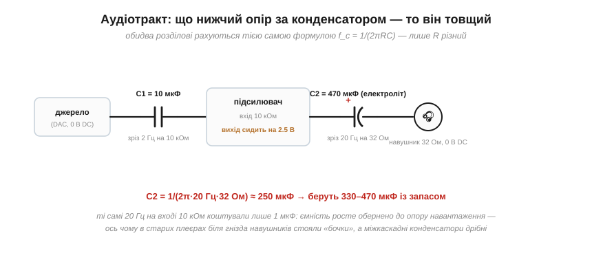
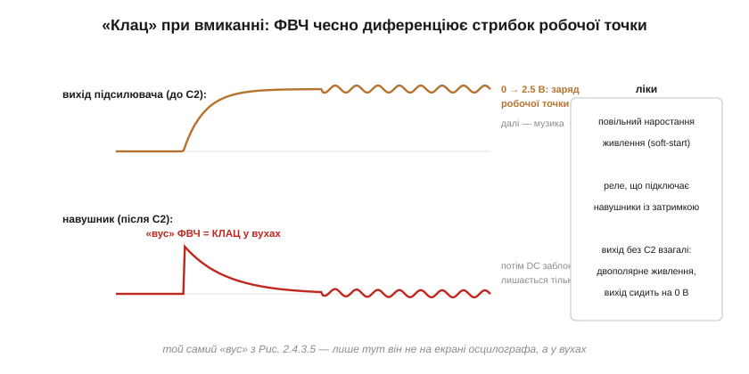

# 🔌 Розділовий конденсатор в аудіотракті: від номіналу до «клацу»

Розділовий конденсатор на вході підсилювача — це RC-фільтр високих частот: пропускає звук, але зрізає постійну складову. Для входу 10 кОм виходять мікрофаради, дрібниця. Але пройдіться очима по платі будь-якого підсилювача: біля гнізда навушників стоїть «бочка» на сотні мікрофарад. Звідки такий розкид номіналів в одному тракті, чому ввімкнення живлення «клацає» у вухах, куди дивиться плюс електроліта в сигнальному шляху — і коли розділовий конденсатор узагалі викидають.

### Один тракт — два дуже різні конденсатори

Формула одна на всіх: f_c = 1/(2πRC), де R — опір **того, що стоїть після** конденсатора. А опори в тракті різняться на три порядки:


*Міжкаскадний C1 працює на вхід 10 кОм — для зрізу 2 Гц досить 10 мкФ. Вихідний C2 працює на навушник 32 Ом: ті самі 20 Гц вимагають уже ~250 мкФ. Ємність росте обернено до опору навантаження.*

```
вхід підсилювача, 10 кОм:  C = 1/(2π·2 Гц·10⁴)  ≈ 8 мкФ    → плівка/кераміка 10 мкФ
навушник, 32 Ом:           C = 1/(2π·20 Гц·32)  ≈ 250 мкФ  → електроліт 330–470 мкФ
```

Звідси правило, яке пояснює вигляд половини аудіоплат світу: **що нижчий опір навантаження — то товщий розділовий конденсатор**. Для 8-омної колонки чесні 20 Гц вимагали б уже за тисячу мікрофарад — тому потужні підсилювачі майже завжди проєктують узагалі без вихідного конденсатора.

### Скупість мститься басами

Поставити менший номінал спокусливо — менший корпус, менша ціна. Платить за це низ діапазону, причому двічі: амплітудою (зріз заліз у смугу — баси зрізані) і фазою (+45° уже на f_c). А в тракті з кількох каскадів зрізи **множаться**, і втрати зручно [складати в децибелах](book:electronics/decibels): три «економні» конденсатори зі зрізом 20 Гц дають на 20 Гц уже −9 дБ — звук, який описують словом «тонкий». Саме тому кожен окремий зріз кладуть на декаду нижче смуги: запас одного каскада виглядає марнотратством, але він працює на весь ланцюжок.

### «Клац» при вмиканні

Увімкніть старий підсилювач у навушниках — і вуха зловлять глухий поштовх. Це не дефект, а чесна робота ФВЧ:


*При подачі живлення вихід підсилювача їде з нуля до своєї робочої точки (тут 2.5 В). Для розділового конденсатора цей повільний стрибок — «сходинка», і він пропускає її коротким «вусом» прямо в навушник. Вус тривалістю в десятки мілісекунд — це і є «клац».*

Стрибок робочої точки — одноразова «постійка», і усталений ФВЧ її заблокує; але **перехід** до усталеного стану він зобов'язаний пропустити. Ліки відомі: повільне наростання живлення (soft-start), реле чи ключ, що підключає навушники з затримкою пів секунди (у сучасних чипах-підсилювачах ця «pop-free» логіка вбудована), — або прибрати саму причину.

### Полярність і тип: дрібний шрифт сигнального шляху

- **Куди плюсом.** [Електроліт полярний](book:electronics/capacitor-parasitics) — у сигнальному колі його ставлять плюсом до точки з **вищим постійним потенціалом** (тут — до виходу підсилювача з його 2.5 В, бо на навушнику нуль). Якщо постійні рівні з обох боків майже рівні чи можуть мінятися знаком — беруть неполярний електроліт або плівку.
- **Кераміка не для звуку.** Дешева кераміка класу 2 (X7R/X5R) у ролі розділового приносить два сюрпризи: ємність пливе від постійного зміщення (зріз їздить!), а п'єзоефект робить конденсатор мікрофоном і динаміком одночасно. В аудіошляху панують плівка, C0G і якісні електроліти.
- **Витік.** Електроліт трохи проводить постійний струм; у високоомних точках цей витік стає джерелом зміщення наступного каскада — ще один аргумент за плівку там, де R велике.

### Коли розділовий викидають

Розділовий конденсатор — плата за **однополярне** живлення, в якому «нуль сигналу» доводиться піднімати до половини шини. Дайте схемі двополярне живлення (±15 В у класичній аудіотехніці) — і виходи каскадів сидітимуть на чесному нулі: з'єднуй напряму, без конденсаторів, без клацу і без втрат басів. Так роблять студійна техніка і потужні підсилювачі (DC-coupled тракт); ціна — складніше живлення і обов'язковий захист від постійки на виході, бо тепер у разі несправності на колонку дивиться повна напруга шини. А в мікросхемних навушникових підсилювачах той самий результат дають інакше — внутрішнім інвертором створюють «віртуальний мінус», і вихід знову гойдається навколо нуля. Розділовий конденсатор нікуди не зник з електроніки — але знати, *чому* він тут стоїть, означає бачити, коли без нього краще.
