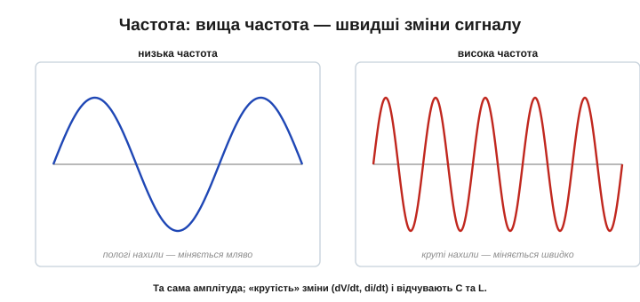
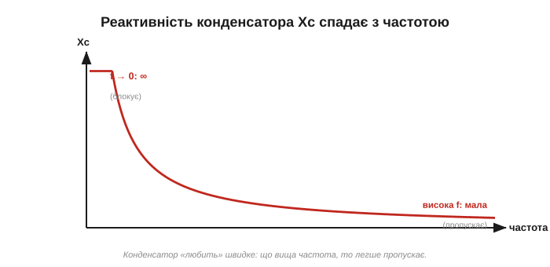
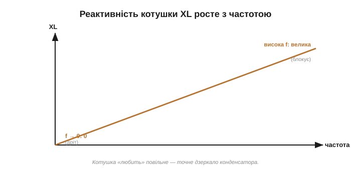

# Чому «опір» C і L залежить від частоти

Резистор поводиться чесно й нудно: його опір однаковий, хоч який сигнал крізь нього пусти — постійний, повільний, швидкий. R — стала величина, і [закон Ома](book:electronics/ohms-law) працює завжди однаково. (Це про **ідеальний** резистор і про частоти, з якими ми тут працюємо. У реального резистора на дуже високих, радіочастотах прокидаються власні паразитна ємність і індуктивність виводів, тож і його імпеданс стає частотно-залежним — але для звичайних схем цим нехтують.) Конденсатор і котушка — інша справа. Їхня «протидія» струмові **залежить від того, як швидко міняється сигнал**. Конденсатор тим легше пропускає, чим швидші коливання; котушка — навпаки. Розберімо, чому так, і дамо цій частотно-залежній протидії ім'я — **реактивність**. Це одна з тих тем, де варто не заучувати формули, а відчути **напрямок**: хто пропускає швидке, хто повільне — і чому. Маючи це чуття, ви читатимете будь-який фільтр чи розв'язку з першого погляду.

### Що означає «частота»

Спершу домовмося, що таке «швидко». Найзручніший змінний сигнал — **синусоїда**: напруга, що плавно гойдається вгору-вниз. Її **частота** (*frequency*, f, у герцах) — це скільки повних коливань за секунду. Зворотна до неї величина — **період** T = 1/f, час одного коливання: висока частота — короткий період. І ось ключове: що вища частота, то **швидше** сигнал міняється — крутіші нахили, різкіші злети й падіння за ту саму секунду.

Діапазон частот вражає: освітлювальна мережа гойдається 50 разів на секунду (50 Гц), звук — від десятків до десятків тисяч разів (Гц–кГц), радіо й цифрові сигнали — мільйони й мільярди (МГц–ГГц). І хоча реальні сигнали бувають складними, будь-який із них можна розкласти на суму синусоїд (це показує [спектральний аналіз](book:math/spectrum)), тож синусоїда — природна «цеглинка», на якій усе й вивчають. Говоримо про одну частоту — а висновки переносяться на будь-який сигнал.

> 🔧 **Навіщо це.** Тримати в голові «де яка частота» дуже практично. Живлення й мережеві завади — десятки-сотні герц; звук — одиниці кілогерц; цифрові шини й перешкоди від них — мегагерци; радіо й Wi-Fi — сотні мегагерц і гігагерци. Та сама деталь поводиться на цих частотах геть по-різному, тож, добираючи конденсатор чи котушку, інженер завжди питає: «на якій частоті вона працюватиме?»

*Та сама амплітуда, різна частота. Низька частота — сигнал міняється мляво, пологі нахили. Висока — ті самі піки, але досягаються набагато швидше, нахили круті. Саме «крутість» зміни (швидкість dV/dt чи di/dt) і відчувають конденсатор та котушка.*

Звідси прямий місток до наших компонентів. [Конденсатор](book:electronics/capacitor) реагує на **швидкість** зміни напруги (i = C·dV/dt), [котушка](book:electronics/inductor-coil) — на швидкість зміни струму (V = L·di/dt). А частота — це і є міра тієї швидкості. Тож не дивно, що від частоти залежить усе.

### Конденсатор: чим швидше, тим легше пропускає

Ось ключова властивість [конденсатора](book:electronics/capacitor): струм у нього тече лише тоді, коли напруга на ньому **міняється**. На постійній напрузі (частота нуль) струму нема зовсім — конденсатор блокує. А тепер уявімо швидкі коливання: напруга весь час стрімко міняється, тож конденсатор увесь час жадібно заряджається-розряджається, і крізь нього тече **великий** струм. Виходить: що вища частота, то **більший** струм за тієї самої амплітуди напруги, а отже, то **менша** протидія.

*Реактивність конденсатора Xc спадає з частотою. На постійному струмі (f → 0) — нескінченна (блокує). На високій частоті — мала (пропускає майже вільно). Конденсатор «любить» швидке й «не любить» повільне.*

Чому саме так — видно з закону конденсатора. Струм i = C·dV/dt пропорційний швидкості зміни напруги; а вища частота означає більшу швидкість зміни. Тож за тієї самої амплітуди напруги вищій частоті відповідає більший струм.

*i = C·dV/dt: струм конденсатора — це швидкість зміни напруги, помножена на C. Круті (високочастотні) схили напруги дають великий струм; пологі (низькочастотні) — малий. Більший струм за тієї ж напруги й означає меншу протидію.*

Відчуймо це числами-орієнтирами (точні дає [реактивність конденсатора](book:electronics/capacitive-reactance)). Той самий конденсатор на постійному струмі — повний розрив; на звукових частотах — уже відчутно пропускає; а на радіочастотах — майже коротке замикання. Тому крихітний конденсатор, цілком невидимий для повільних сигналів, на високій частоті здатен «закоротити» їх у землю — на цьому й стоїть [розв'язка живлення](book:electronics/capacitor-uses): для постійної напруги конденсатор нічого не робить, а швидкий шумовий сплеск відводить убік. Та сама властивість стоїть і за розділовим конденсатором: постійне зміщення він не пропускає (нескінченна Xc на нулі), а змінний сигнал — тим краще, чим вища частота. Звідси видно, що звичне «пропускає зміну» означає саме «має малу реактивність на високих частотах».

### Котушка: чим швидше, тим важче пропускає

У котушки все дзеркально. [Котушка](book:electronics/inductor-coil) наводить напругу, що протидіє **зміні** струму (V = L·di/dt). На постійному струмі (частота нуль) вона не наводить нічого — поводиться як звичайний дріт, пропускає вільно. Та що швидше намагаємося гойдати струм (вища частота), то більшу протидійну напругу котушка наводить — а отже, то **сильніше** вона опирається.

*Реактивність котушки XL росте з частотою. На постійному струмі (f → 0) — нульова (пропускає, як дріт). На високій частоті — велика (блокує). Котушка «любить» повільне й «не любить» швидке — точне дзеркало конденсатора.*

І знову причина — в законі компонента. Напруга V = L·di/dt пропорційна швидкості зміни струму; вища частота — швидша зміна — більша протидійна напруга. Щоб проштовхнути крізь котушку струм тієї самої амплітуди на вищій частоті, потрібна більша напруга — тобто котушка протидіє сильніше.

*V = L·di/dt: напруга котушки — це швидкість зміни струму, помножена на L. Швидкий (високочастотний) струм наводить велику протидійну напругу; повільний — малу. Більша напруга за того ж струму й означає більшу протидію.*

І знову повне дзеркало: та сама котушка на постійному струмі — просто дріт; на звукових частотах — уже відчутно опирається; на радіочастотах — майже розрив. Тому [феритова намистина](book:electronics/inductor-types), невидима для корисного постійного живлення, душить високочастотну заваду. Одна й та сама деталь — геть різна поведінка на різних частотах, і саме в цьому її цінність. Зворотний бік тієї ж медалі: щоб **не пустити** високочастотний сигнал кудись, котушку ставлять послідовно — для нього вона стіна, а для живлення (постійного) прозора. [Дросель у фільтрі живлення](book:electronics/inductor-types) — саме це.

### Реактивність — це «опір», що залежить від частоти

Цю частотно-залежну протидію називають **реактивністю** (*reactance*, позначають **X**). Її, як і опір, міряють в **омах** — бо це теж відношення напруги до струму. Реактивність конденсатора позначають **Xc**, котушки — **XL**. Точні формули для них дають окремі теми про [реактивність конденсатора](book:electronics/capacitive-reactance) та [реактивність котушки](book:electronics/inductive-reactance); тут головне — сам **зміст** і **напрямок**: Xc спадає з частотою, XL росте.

Але реактивність — **не те саме**, що опір, і плутати їх не можна. Між ними дві принципові різниці:

*Опір R — сталий із частотою й **розсіює** енергію на тепло. Реактивність X — **залежить** від частоти й енергію не витрачає, а лише тимчасово запасає в полі та повертає. Обидві міряють в омах, але це різні за природою величини.*

По-перше, опір **сталий** із частотою, а реактивність — **ні** (у цьому вся суть). По-друге, і це глибше: резистор енергію **спалює** на тепло, а конденсатор і котушка її не витрачають — вони лише **запасають** її в полі й повертають назад ([в електричному полі конденсатора](book:electronics/capacitor-energy) та [в магнітному полі котушки](book:electronics/inductor-energy)). За кожен період реактивний елемент бере енергію з кола (напинаючи поле) і повністю віддає її назад (коли поле спадає) — у середньому за цикл він не споживає **нічого**. Резистор же щомиті безповоротно гріється. Тому **ідеальні** котушка чи конденсатор можуть «опиратися» чималому струмові, залишаючись холодними, — те, на що резистор не здатен. Саме через це конденсатори й котушки звуть **реактивними** елементами, а резистор — таким, що розсіює. (Наголос на «ідеальні»: реальні все ж трохи гріються — у конденсатора є [ESR](book:electronics/capacitor-parasitics), у котушки опір обмотки DCR і [втрати в осерді](book:electronics/inductor-types). Просто ці втрати малі проти того, що розсіяв би на тому самому місці резистор, тож у першому наближенні реактивний елемент вважають таким, що енергії не споживає.)

Попри ці відмінності, реактивність грає роль опору в законі Ома **для амплітуд**: амплітуда напруги дорівнює амплітуді струму, помноженій на реактивність (V = I·X), точно як V = I·R для резистора. Тож, знаючи Xc чи XL на даній частоті, ви рахуєте струм так само звично, як із резистором, — лише пам'ятаючи, що X залежить від частоти. Є й тонкість: реактивність не додається до опору так просто, як два резистори, бо реактивний елемент [зсуває струм і напругу в часі](book:electronics/phase-shift). Їхню спільну дію називають **повним опором** (імпедансом), і він розкривається, щойно врахувати ці фази.

**Приклад (без чисел, лише напрямок).** Маємо суміш «постійний струм + високочастотний шум» і хочемо їх розділити. Конденсатор пропустить шум і затримає постійне (його Xc для постійного — нескінченна, для шуму — мала). Котушка зробить навпаки: пропустить постійне, затримає шум. Тому, щоб очистити живлення, постійну складову ведуть **крізь котушку**, а шум скидають **конденсатором у землю** — кожна деталь робить рівно те, що їй «легше». Жодних обчислень — самі напрямки реактивності вже підказують схему.

Одне застереження. Говорити про реактивність має сенс лише **на конкретній частоті**. «Реактивність конденсатора 50 Ом» — неповне твердження, поки не сказано, на якій частоті, бо на іншій вона буде вже інша. Це не вада, а суть: реактивний елемент — це «опір із розкладом», що залежить від того, як швидко гойдається сигнал. Тому в розрахунках і даташитах реактивність завжди прив'язана до частоти, а резистор обходиться без цього уточнення.

### Дзеркальні близнюки

Зведімо головне. Конденсатор і котушка протидіють струмові **протилежно** залежно від частоти: реактивність конденсатора з частотою **падає**, котушки — **росте**.

*На одному графіку: Xc спадає, XL росте з частотою. Конденсатор пропускає високі частоти й блокує низькі; котушка — навпаки. Десь вони перетинаються — і там, де реактивності зрівнюються, ховається резонанс.*

Ця протилежність — не просто симетрична краса, а основа двох найважливіших речей аналогової електроніки. По-перше, **фільтрів**: ставлячи конденсатор чи котушку правильним боком, пропускають потрібні частоти й гасять зайві. Логіка проста: хочете пропустити високі частоти, а низькі зрізати — поставте конденсатор у шлях сигналу (він пропускає швидке); хочете навпаки — або котушку в шлях, або конденсатор у землю (він відведе високі вбік). Комбінуючи їх, дістають фільтри будь-якої форми, а їхню поведінку описують кількісно через [частотну характеристику](book:electronics/frequency-response). По-друге, **резонансу**: на одному графіку криві Xc і XL **перетинаються** — і та частота, де реактивності зрівнюються, виявляється особливою (саме там коло «дзвенить» — це [LC-резонанс](book:electronics/lc-resonance)).

> 🔧 **Навіщо це.** Реактивність — щоденний інструмент. «Конденсатор пропускає високі частоти, блокує постійне; котушка пропускає постійне, блокує високі» — це правило ви застосовуватимете щоразу, проєктуючи фільтр живлення, розв'язку, аудіотракт чи радіокаскад. [Розв'язувальний конденсатор](book:electronics/capacitor-uses) біля чипа і [дросель проти завад](book:electronics/inductor-types) — це і є реактивність у дії: кожен «бачить» сигнали різних частот по-своєму. Найкоротше правило, варте заучування: **C — для високих частот, L — для низьких**; конденсатор шунтує швидке в землю, котушка пропускає лише повільне. З цих двох протилежностей складається будь-який пасивний фільтр.

Підсумуймо. На відміну від сталого опору R, конденсатор і котушка протидіють струмові **частотно-залежно** — це **реактивність X** (в омах, але не розсіює енергії). Реактивність конденсатора **Xc спадає** з частотою (пропускає швидке, блокує постійне), котушки **XL росте** (пропускає постійне, блокує швидке) — бо обидва реагують на **швидкість** зміни сигналу, а частота і є мірою цієї швидкості. Тримайте в голові ці два напрямки — Xc вниз, XL вгору — і ви передбачите поведінку будь-якого реактивного кола з частотою, ще навіть не беручись рахувати. А коли ці «спадає» й «росте» обертаються на точні формули, з них постає все решта: як коло пропускає різні частоти, [зсув фаз](book:electronics/phase-shift) між струмом і напругою і, нарешті, **[резонанс](book:electronics/lc-resonance)** — та сама «власна нота», на якій реактивності конденсатора й котушки зрівнюються.

> 🧮 **Математична вставка:** [комплексні числа й фазори — вся змінна напруга однією стрілкою](book:math/phasors). Мова, якою інженери рахують реактивні кола: число-стрілка, множення на j як поворот на 90°, синусоїда як фазор — і чому реактивності та зсуви фаз стають звичайним законом Ома з комплексними опорами.

---
