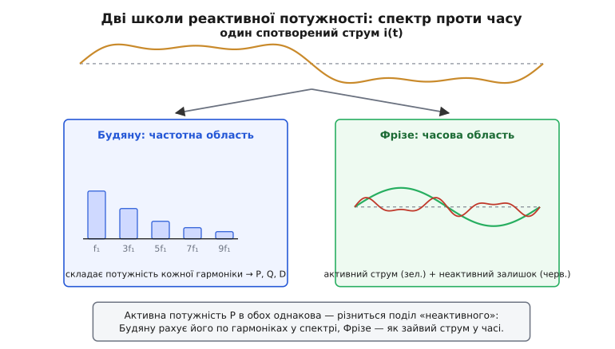
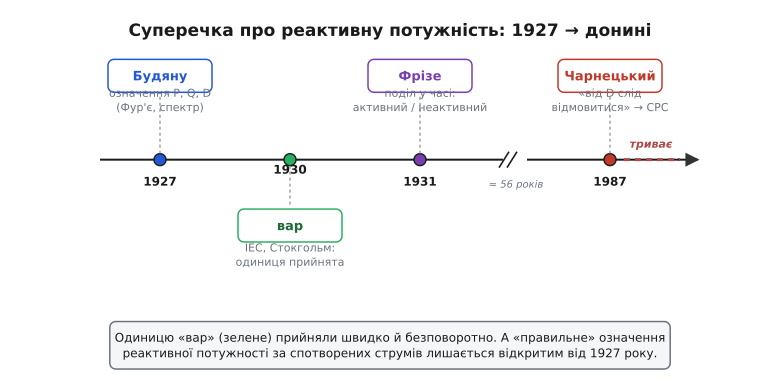

# 📜 Хто назвав «потужність-привид»: вар, Будяну й суперечка, що не вщухає

Уявіть інженера двадцятих років минулого століття, який стоїть перед лічильником і силкується відповісти на дитяче на вигляд питання: скільки потужності в цьому колі? Якщо струм і напруга — чисті синусоїди, відповідь знайома й чепурна: є потужність, що працює (вати), є потужність, що гойдається (її назвуть варами), а їхня геометрична сума дає те, що тече по дротах (вольт-ампери). Прямокутний трикутник, три сторони, жодних питань.

Та реальні кола двадцятих швидко перестали бути чистими. Випрямлячі на ртутних колбах, дугові печі, перші перетворювачі почали **спотворювати** струм: він уже не синусоїда, а щось зубчасте, гостре, з горбами. І тут прекрасний трикутник розсипається. Виявляється, що повна потужність S більша за геометричну суму активної й реактивної — лишається ще якийсь шматок, незрозуміло чий. Що це за потужність? Як її назвати? І головне — чи це взагалі **потужність**, чи просто число, яке вискочило з формул і нічого реального за собою не має?

Ось довкола цього питання й розгорнулася історія, яку варто знати. Бо це рідкісний випадок, коли інженерну величину придумали, дали їй красиву одиницю, записали в міжнародні стандарти — а через шістдесят років авторитетний фахівець напише статтю з заголовком «Що не так із цим поняттям і чому від нього слід відмовитися». І суперечка досі не закрита.

## Навіщо взагалі окреме число для потужності, що не працює

Спершу варто відчути, чому це питання не дріб'язкове. У колі змінного струму миттєва потужність — це добуток миттєвих напруги й струму, p = u·i, у кожну мить. Якщо обидва — синусоїди, зсунуті на кут φ, то цей добуток розкладається на дві частини: сталий доданок (середнє за період — це й є активна потужність, що гріє й крутить) і доданок, що коливається з подвоєною частотою навколо нуля. Другий у середньому дає нуль — це та сама [гойдалка енергії](book:electronics/reactive-power), що тече в навантаження й тут-таки вертається.

Поки все синусоїдне, цю гойдалку легко зміряти одним числом: Q = U·I·sin φ. І це число **корисне** — воно прямо каже, конденсатор якої ємності поставити поряд, щоб гойдалку загасити. Реактивна потужність котушки додатна, конденсатора — від'ємна; зрівняв їх — і мережа більше не возить марний струм. Число має ясний фізичний сенс: воно вимірює енергію, що бігає туди-сюди, і підказує, як її прибрати.

> 🔧 **Навіщо це.** Уся енергетика будується на тому, що реактивну потужність можна **порахувати наперед і скомпенсувати**. Інженер дивиться в паспорт мотора, бачить cos φ, рахує Q у варах, добирає конденсаторну батарею — і струм у лінії падає. Це працює бездоганно, доки струм синусоїдний. Тому питання «а як рахувати Q, коли струм спотворений» — не академічна забавка: від відповіді залежить, чи правильно ти добереш компенсацію в цеху, повному перетворювачів.

А тепер зіпсуймо синусоїду. Хай струм має, окрім основної частоти 50 Гц, ще й третю гармоніку, п'яту, сьому — як у будь-якого випрямляча. Що тепер таке «реактивна потужність»? Просте sin φ більше не годиться: у кожної гармоніки свій кут зсуву, своя амплітуда. Повна потужність S = U·I (добуток середньоквадратичних значень) досі легко рахується. Активна P досі ясна — це середнє від p = u·i. А от усе, що лишилося між ними, — велика загадка. І саме сюди ступив Будяну.

## Будяну: розкласти загадку на гармоніки

**Константин Будяну** (рум. *Constantin I. Budeanu*; 28 лютого 1886, Бузеу — 27 лютого 1959, Бухарест) — румунський інженер-електрик. Здобув диплом інженера 1909 року в бухарестській Школі мостів, доріг і копалень, тоді вивчав електрику в Парижі за стипендією. Французька школа на ньому позначилася: свою головну працю він і написав французькою — **«Puissances réactives et fictives»** («Реактивні та фіктивні потужності»), що вийшла **1927 року**. *(Дати й факти біографії — за усталеними джерелами; румунська ідентичність незаперечна.)*

Будяну зробив природний для математика крок: якщо струм і напруга — не синусоїди, розкладімо їх у **ряд Фур'є** — суму синусоїд різних частот (гармонік). Тоді кожна гармоніка окремо поводиться як знайома чиста синусоїда, для неї sin φ і cos φ мають сенс. Лишається скласти внески всіх гармонік. Активну потужність він склав чесно — це сума активних потужностей усіх гармонік:

```
P = Σ Uₙ·Iₙ·cos φₙ        (сума по всіх гармоніках n)
```

Так само він означив **реактивну потужність** — просту суму реактивних потужностей кожної гармоніки:

```
Q_B = Σ Uₙ·Iₙ·sin φₙ      (реактивна потужність за Будяну)
```

І тут вискочив сюрприз. Якщо порахувати повну потужність S = U·I і відняти від її квадрата квадрати P і Q_B, **залишок не дорівнює нулю**. У синусоїдному колі він був нуль (трикутник сходився), а в спотвореному — ні. Лишається ще одна величина. Будяну дав їй ім'я — **потужність спотворення** (фр. *puissance déformante*; в українській традиції — спотворювальна, або деформівна) — і позначив D:

```
S² = P² + Q_B² + D²
```

Геометрично трикутник перетворився на прямокутний паралелепіпед: три взаємно перпендикулярні ребра P, Q_B, D, а S — просторова діагональ. Звідки взялася третя сторона? Із того, що в спотвореному струмі є гармоніки, яких немає в напрузі (і навпаки): вони дають струм, але не дають ні активної, ні «звичайної» реактивної потужності. Будяну зібрав цей залишок в окреме число й оголосив його потужністю спотворення — мірою того, **наскільки форма струму не схожа на форму напруги**.

> 🔧 **Навіщо це.** Ідея Будяну приваблива саме простотою бухгалтерії: береш струм, женеш через Фур'є, складаєш потужності гармонік — і будь-яке коло описане трьома числами. Жодних інтегралів у часі, жодних тонкощів. Для епохи, коли гармоніки щойно стали проблемою, це був готовий апарат, який одразу пішов у підручники й стандарти. Те, що він **простий і загальний**, і зробило його популярним — і водночас заклало під нього міну, яка вибухне через десятиліття.

Тут-таки Будяну запропонував і одиницю для реактивної потужності — **вар**. Назва складена з початків англійського *volt-ampere reactive* («реактивний вольт-ампер»): та сама розмірність, що й у вата, але навмисне інше слово, щоб з першого погляду відрізняти потужність, яка не робить роботи, від тієї, що робить. Розумний хід: одиниця-омонім збивала б з пантелику, а окреме коротке слово одразу каже, про що мова.

## Вар у Стокгольмі: як назва стала стандартом

Запропонувати назву — мало; щоб вона прижилася, її мав ухвалити хтось, кого слухає весь світ. Таким органом була **Міжнародна електротехнічна комісія** (англ. *International Electrotechnical Commission*, IEC) — створена ще 1906 року організація, що узгоджує електротехнічні поняття й одиниці між країнами, аби ампер у Лондоні дорівнював амперу в Берліні.

**1930 року на засіданні в Стокгольмі** дорадчий комітет IEC з номенклатури рекомендував **вар** як практичну одиницю реактивної потужності. *(Це усталений факт, повторений у довідниках і стандартах; рік і місто збігаються в незалежних джерелах.)* Відтоді «вар» — офіційна одиниця: на шильдиках конденсаторних батарей пишуть квар (кіловари), мережеві диспетчери оперують Мвар (мегаварами), а інженер, побачивши «var», знає без пояснень — це потужність-привид.

Варто відзначити витончену непослідовність, із якою світ ужив спадок Будяну. Одиницю «вар» прийняли всі й назавжди — вона жива, корисна, безпроблемна. А от його **потужність спотворення** D, заради якої значною мірою й писалася праця 1927 року, ухвалили куди обережніше — і саме вона стане осердям багаторічної суперечки. Прижилося просте й корисне; спірне лишилося спірним.

## Фрізе: а як без гармонік?

Майже одночасно з Будяну, але з геть іншого боку до тієї самої загадки підступив поляк. **Станіслав Фрізе** (пол. *Stanisław Fryze*; 1 грудня 1885, Краків — 3 березня 1964, Гливиці) — польський інженер-електрик, один із засновників теоретичних основ електротехніки. Тут важлива точність у питанні ідентичності й місць. Народився Фрізе в Кракові, який тоді належав Австро-Угорщині (це була Галичина в складі імперії Габсбургів — польської держави на мапі ще не існувало). Викладав і захищався у Львівській політехніці: **11 червня 1923 року** він захистив **перший у Польщі докторат з електротехніки**. Львів (пол. *Lwów*) у міжвоєнні роки був польським містом, осередком сильної математично-інженерної школи. *(Біографічні дати — за усталеними польськими джерелами; ідентичність — польська, незаперечна.)*

Доля Фрізе тут проситься в окреме слово, бо вона драматична й добре задокументована. У **січні 1945 року** його разом із кількома іншими львівськими професорами заарештував НКВС і вивіз углиб СРСР, у Донбас, на роботу в шахті. Восени того ж року він зумів вернутися до Львова, а 1946-го перебрався до Гливиць у новій повоєнній Польщі, де й працював до кінця життя в Сілезькій політехніці. *(Депортація до Донбасу силами НКВС — задокументований факт із польських біографічних джерел.)*

Тепер сам підхід. Фрізе вважав фур'є-бухгалтерію Будяну штучною: навіщо розбивати струм на гармоніки, якщо потужність — фізична річ, що твориться в часі, а не в спектрі? Тож він означив усе **в часовій області**, без жодного розкладу на частоти. Логіка така: візьмімо реальний струм навантаження i(t) і спитаймо — яка його **найменша** частина, що передає ту саму активну потужність P за тієї самої напруги? Це **активний струм**: струм тієї ж форми, що й напруга, помножений так, щоб давати рівно P. Усе, що лишилося від справжнього струму понад цей активний, — **неактивний струм**, який активної потужності не несе зовсім. Праця Фрізе так і називалася: «Активна, реактивна й повна потужність у несинусоїдних колах» (пол. *«Moc czynna, bierna i pozorna w obwodach o przebiegach odkształconych prądu i napięcia»*), друкована польською в часописі *Przegląd Elektrotechniczny* **1931 року** (а німецькою в *ETZ* — 1932-го). *(Рік і видання підтверджені кількома джерелами.)*

Різниця між двома підходами глибша, ніж здається, тож її варто проговорити чітко. У Будяну реактивна потужність — це **сума по гармоніках** (частотна область): ти мусиш знати спектр струму. У Фрізе неактивна потужність — це **залишок у часі** (часова область): тобі досить осцилограми струму й напруги, гармоніки рахувати не треба. Перший питає «з яких частот складено цю гойдалку?», другий — «яка частина струму просто зайва?». Дві відповіді на те саме питання, і вони, взагалі кажучи, **дають різні числа**, бо ділять «неактивну» потужність по-різному: Будяну ще й виокремлює всередині неї D, Фрізе лишає її одним нерозчленованим шматком.


*Один спотворений струм — два способи поділу. Будяну розкладає його у спектр і складає потужність кожної гармоніки, виокремлюючи активну P, реактивну Q та спотворення D (частотна область). Фрізе бере струм як є в часі й ділить його на найменшу активну частину та неактивний залишок (часова область). Активна P в обох однакова; «неактивне» вони описують по-різному.*

## У чому ж суперечка

Можна було б думати, що з двох означень переможе те, що влучніше. Натомість обидва прожили десятиліття пліч-о-пліч, потрапили в підручники, породили цілі школи — і саме це найкраще показує, що питання було складніше, ніж «хто має слушність».

Корінь суперечки — у тому, **чого ми хочемо від цього числа**. Якщо просто описати коло (стільки-то ват, стільки-то «решти»), згодиться будь-яке несуперечливе означення; обидва дають S² = P² + (решта)². Та інженерові потрібне не просто описове число — потрібне **дієве**: таке, з якого видно, що поставити в коло, щоб «решту» прибрати. І ось тут означення Будяну почали критикувати дедалі гостріше.

Найрізкіше це сформулював польсько-американський дослідник **Леслав Чарнецький** (пол. *Leszek S. Czarnecki*) у статті **1987 року** з промовистою назвою «What is wrong with the Budeanu concept of reactive and distortion power and why it should be abandoned» («Що не так із поняттям реактивної та спотворювальної потужності Будяну й чому від нього слід відмовитися»). *(Стаття реальна, широко цитована; рік підтверджено.)* Закид був по суті фізичний, а не математичний — формули Будяну правильні, але **за ними нічого не стоїть**:

- Реактивна Q_B за Будяну (сума sin-внесків гармонік) **не каже, як її скомпенсувати**. У синусоїдному колі Q одразу давала ємність конденсатора; у спотвореному сума по гармоніках може вийти малою чи навіть нульовою, тоді як коло насправді потребує серйозної компенсації. Число є — підказки немає.
- Потужність спотворення D **не міряє спотворення**. Назва обіцяє, що D росте зі скривленням форми струму, але можна побудувати коло, де форма помітно спотворена, а D мале, — і навпаки. Тобто число не відповідає тому явищу, іменем якого назване.
- Обидві величини **не пов'язані з жодним фізичним процесом** у колі так, щоб ними можна було керувати чи проєктувати компенсатор.

Натомість Чарнецький запропонував свій поділ — **теорію фізичних складових струму** (англ. *Currents' Physical Components*, CPC), де неактивний струм розкладають не на абстрактні потужності, а на складові з ясним фізичним джерелом: одна від зсуву фаз, друга від того, що навантаження по-різному «бачить» різні гармоніки, третя від несиметрії — і кожну видно, як гасити. Це означення й досі шанують і застосовують.

Чи це означає, що Будяну помилявся, а Фрізе мав рацію? Не зовсім — і тут чесність важливіша за охайний висновок. Підхід Фрізе вільний від головної вади Будяну (він не вигадує неіснуючої «потужності спотворення»), але має свою: його єдиний нерозчленований неактивний струм теж не каже прямо, *чим* саме його гасити, бо змішує різні причини в одну купу. Тому суперечка не звелася до «Фрізе переміг Будяну». Вона породила **третє покоління** теорій — CPC Чарнецького, означення на основі миттєвих величин (так звана p-q теорія Акаґі для трифазних кіл) та інші, — і дискусія про «правильну» реактивну потужність за несинусоїдних струмів **триває донині**. У стандартах урешті закріпили обережний компроміс (зокрема стандарт IEEE 1459, що розрізняє потужність основної гармоніки й решту), та єдиного означення, яке вдовольнило б усіх, так і немає.


*Від першого означення Будяну (1927) до незакритої дискусії. Одиницю «вар» прийняли швидко й назавжди (Стокгольм, 1930); означення ж реактивної потужності за спотворених струмів — від Будяну через Фрізе (1931) до критики Чарнецького (1987) і теорій-нащадків — лишається відкритим питанням.*

## Що з усього цього випливає

Історія вара й Будяну варта запам'ятовування не датами, а уроком про природу інженерних понять. Одиниця «вар» — приклад того, як **просте й корисне** поняття переживає століття без жодних питань: воно точно відповідає реальній речі (енергії, що гойдається в синусоїдному колі) і дає прямий рецепт дії (постав конденсатор такої ємності). Тому його прийняли в Стокгольмі за рік-два й користуються досі.

Потужність спотворення D — приклад протилежного: математично бездоганне число, яке **не чіпляється за фізику**. Воно вискочило з формул як залишок, дістало гарну назву, потрапило в стандарти — і десятиліттями збивало з пантелику, бо обіцяло більше, ніж могло дати. Його доля — нагадування: коли величину означують «бо так сходяться рівняння», варто питати не лише «чи правильна формула», а й «що реального за нею стоїть і що з нею можна **зробити**».

І останнє, найтонше. Те, що дві поважні школи — Будяну з його гармоніками й Фрізе з його часом — дали різні відповіді на одне питання й жодна не перемогла остаточно, означає, що сама «реактивна потужність» за несинусоїдних струмів **не є однією-єдиною фізичною величиною**, яку лишилося правильно зміряти. Це радше **родина різних запитань** («скільки енергії гойдається?», «яка частина струму зайва?», «наскільки скривлена форма?», «що з цим робити?»), і кожне має свою чесну відповідь. Чистий синусоїдний світ маскував цю множинність під одне охайне число Q = U·I·sin φ. Спотворений струм зняв маску — і виявилося, що за одним словом «реактивна потужність» ховається кілька різних речей. Суперечка, що тягнеться від 1927 року, — це, по суті, повільне усвідомлення цього факту.
