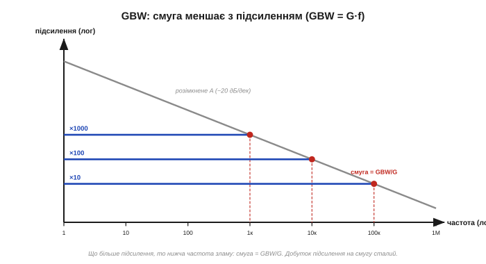
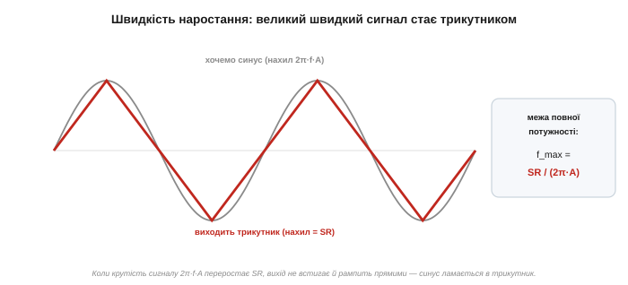

# 🧮 GBW і slew rate у числах: чи встигне ОП за сигналом

> У реального операційного підсилювача дві швидкісні вади — скінченна смуга й обмежена швидкість наростання (див. [межі реального ОП](book:electronics/real-opamp-limits)). Тут — як перевести їх у **числа** й відповісти на просте інженерне питання: «чи встигне мій ОП за цим сигналом?». Стель **дві**, вони незалежні, і кусають різні сигнали.

### Дві різні стелі швидкості

Не плутаймо їх із самого початку. **GBW** (добуток підсилення на смугу) обмежує **малі** сигнали: чим більше підсилення просиш, то вужча смуга. **Швидкість наростання** SR обмежує **великі, швидкі** сигнали: вихід просто не може нарощувати напругу швидше за певну межу. Перша — про підсилення, друга — про розмах. Перевіряти треба **обидві**.

### GBW: смуга меншає з підсиленням

Розімкнене підсилення A не лише велике, а й **спадає з частотою** — рівно на порядок підсилення за порядок частоти (−20 дБ/декаду). Наслідок простий і незмінний:

```
GBW = G · f = const
```

тобто доступна смуга при підсиленні G дорівнює:

```
f(смуга) = GBW / G
```


*Замкнене підсилення тримається пласким до частоти зламу, а далі котиться вниз слідом за розімкненим A. Що вище підсилення, то нижча частота зламу — бо їхній добуток сталий. Підсилення й смугу не можна мати обидва великими.*

Приклад: ОП із GBW = 1 МГц (класичний µА741). На підсиленні 10 маєш смугу 1 МГц/10 = **100 кГц**; на підсиленні 100 — лише **10 кГц**; на 1000 — жалюгідний **1 кГц**. Хочеш і велике підсилення, і широку смугу — бери ОП із більшим GBW.

### Slew rate: вихід не встигає за крутістю

Друга стеля — про **крутість**. Швидкість наростання SR (у В/мкс) — це найбільша швидкість, з якою вихід здатен **змінювати** напругу. А синусоїда розмаху A на частоті f має найбільшу крутість (у точці переходу через нуль):

```
макс. крутість синуса = 2π · f · A
```

Поки ця крутість не переростає SR, вихід слухняно йде за синусом. А щойно 2π·f·A > SR — вихід **не встигає** й починає наростати прямими лініями зі своєю граничною швидкістю: гарний синус ламається в **трикутник**.


*Коли крутість сигналу 2π·f·A переростає SR, вихід наростає максимально швидкими прямими — синус вироджується в трикутник. Звідси й «межа повної потужності»: найвища частота, на якій ще влазить повний розмах, — f_max = SR / (2π·A).*

Звідси й **межа повної потужності** — найвища частота, на якій повний розмах A ще вкладається у швидкість:

```
f_max = SR / (2π · A)
```

### Дві стіни — котра ближча?

Найважливіше — побачити, що дві стелі кусають **різні** сигнали. Візьмімо µА741-клас: GBW = 1 МГц, SR = 0.5 В/мкс.

**Великий сигнал** (розмах A = 5 В). Межа за SR: f_max = 0.5·10⁶ / (2π·5) ≈ **16 кГц**. Тобто повний 5-вольтовий синус не пройде вище ~16 кГц — хоч GBW обіцяла мільйон. Тут стіна — **SR**.

**Малий сигнал** (розмах A = 50 мВ). Межа за SR: f_max = 0.5·10⁶ / (2π·0.05) ≈ **1.6 МГц** — а GBW при підсиленні 1 ріже на 1 МГц раніше. Тут стіна — **GBW**.

Висновок: маленькі сигнали впираються в GBW, великі — у швидкість наростання. Одне число не розповідає всієї історії.

### Рецепт: чи встигне?

Маєш сигнал розмаху A, частоти f, при підсиленні G — перевір **обидві** умови:

```
1) f ≤ GBW / G          (смуга — для малого сигналу)
2) 2π · f · A ≤ SR       (швидкість — для повного розмаху)
```

Пройшли обидві — ОП встигає. Завалив хоч одну — бери швидший прилад (більший GBW і/або SR).

### Звідки беруться ці стелі

Обидві стелі — це прямі наслідки нутра ОП, а саме його [диференційної вхідної пари](book:electronics/opamp-input-stage): GBW росте з того, що підсилення **навмисне** зрізають на високих частотах заради стійкості зворотного зв'язку, а SR — з того, що сталий «хвіст» диференційної пари заряджає внутрішній конденсатор лише з певною швидкістю. Та сама межа, яку [негативний зворотний зв'язок](book:electronics/negative-feedback) бачить як спад петльового підсилення з частотою, тут постала числом.

> 🔧 **Навіщо це.** Дві перевірки перед вибором ОП. **Смуга:** f ≤ GBW/G — бо підсилення й смугу не мати разом. **Швидкість:** 2π·f·A ≤ SR — бо великий розмах на високій частоті вихід не натягне. Маленький сигнал — дивись на GBW, великий — на slew rate. А не впевнений, котра стіна ближча, — порахуй обидві й бери меншу частоту: то й буде справжня стеля твоєї схеми.
