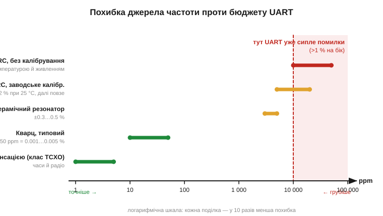
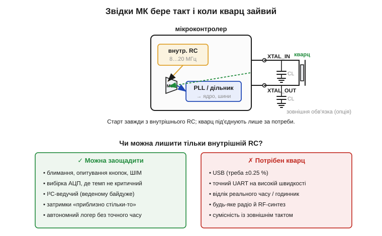

# 🔌 Внутрішній RC-генератор мікроконтролера проти кварцу: коли можна заощадити

> Простого RC-генератора (*RC oscillator*) часто недостатньо для точного відліку — і саме тут постає інженерне рішення: майже кожен мікроконтролер уже **містить** такий RC всередині. То коли на ньому й зупинитися, заощадивши кварц, два конденсатори й місце на платі, а коли це призведе до прикрих відмов?

### Клас «вбудоване джерело такту»

Сучасний мікроконтролер (*microcontroller*, MCU) ніколи не приходить «німим»: у кристалі вже інтегрований внутрішній RC-генератор, і саме від нього чип **стартує** після подачі живлення, ще до того як програма щось налаштувала. Зазвичай таких генераторів навіть кілька — швидкий на 8…20 МГц для ядра й шин і повільний на десятки-сотні кГц для сторожового таймера та режимів сну. Усе це — на тому самому кристалі кремнію, тож зовнішніх деталей **нуль**.

Платою за безкоштовність є точність. RC-генератор задає частоту зарядом конденсатора через резистор (його темп визначає [стала часу RC](book:electronics/rc-time-constant)), а номінали R і C на кристалі «пливуть» від температури й напруги живлення. Звідси й уся розмова про опорні частоти: [добротність](book:electronics/quality-factor) (*Q*) такого кола — одиниці, а в кварцу — десятки тисяч, тому й стабільність відрізняється на порядки.

*Сходи точності. Внутрішній RC без калібрування — ±1…5 %; заводське калібрування при 25 °C підтягує до ±0.5…2 %, але з нагрівом частота однаково повзе. Кварц — ±10…50 ppm (0.001…0.005 %), тобто в сотні-тисячі разів точніший. Червона зона праворуч — де неузгодженість швидкостей уже ламає асинхронний UART.*

### Як це під'єднано: дерево такту

Якщо стабільності RC вистачає, то й підключати нічого не доводиться: розпіновки в RC-режимі немає зовсім — у тому й суть. Виводи, які інакше пішли б на кварц (типово пара `XTAL_IN` / `XTAL_OUT`, *oscillator pins*), лишаються вільними під звичайний GPIO. Усередині чипа стоїть мультиплексор: він вибирає, що подати на петлю ФАПЧ (*PLL*) і далі на ядро — внутрішній RC чи зовнішній резонатор. Кварц із двома навантажувальними конденсаторами CL під'єднують до тих двох виводів **лише тоді**, коли точності RC бракує.

*Старт завжди йде від внутрішнього RC; зовнішній кварц — опційна гілка того самого мультиплексора. Праворуч — коли вільно лишитися на RC, а коли кварц обов'язковий.*

### «Перший байт»: заговорити без кварцу

На практиці підключати тут нічого — лишається тільки нічого не зламати в налаштуваннях. У конфігурації проєкту виберіть внутрішнє джерело такту (на ESP32 це робить SDK за замовчуванням; на дрібних МК — біти-перемикачі джерела в реєстрі такту чи fuse-біти). Якщо точну частоту все ж хочеться, скористайтеся **заводським калібруванням**: виробник міряє кожен кристал і кладе поправку в спеціальний реєстр чи у вшиту OTP-комірку, тож після скидання чип уже ближчий до номіналу, ніж «сирий» RC.

### Типові граблі

Калібрування підтягує частоту, але не робить RC точним резонатором — і там, де закладаються на надто вузький допуск, чекають кілька класичних відмов.

**UART, що сипле сміттям.** Найчастіша з них. Асинхронний обмін терпить сумарну неузгодженість приймача й передавача приблизно до ±2 %, тобто близько ±1 % на кожен бік. «Сирий» RC у ±2…5 % з'їдає цей бюджет повністю — і символи б'ються, особливо на високій швидкості й при нагріві плати. Виміряти на холодному столі й заспокоїтися — класична пастка: у спеку воно відмовить.

**USB не складеться взагалі.** Повношвидкісний USB вимагає ±0.25 % — це поза можливостями навіть каліброваного RC. Тому МК із вбудованим USB або беруть зовнішній кварц, або мають заводський RC спеціально для USB; перевіряйте це в даташиті, а не сподівайтеся.

**«Годинник» бреше.** Відлік реального часу від RC накопичує похибку щосекунди: ±2 % — це понад **пів години** за добу. Для календаря потрібен окремий точний резонатор.

**Дрейф ≠ джиттер.** RC-генератор не лише неточний «у середньому» — його частота ще й гуляє в часі. Для грубих затримок байдуже, для радіо чи точних вимірювань — критично.

### Варіації класу

Але вибір не зводиться до «голий RC або повноцінний кварц» — між цими крайнощами є проміжні щаблі. Заводське калібрування — майже безкоштовний крок угору. Деякі МК вміють **самопідстроювати** RC на льоту, рахуючи його імпульси за зовнішньою опорою (наприклад, по кадрах USB чи від повільного годинникового кристала). А там, де RC замало, а повний кварц ставити не хочеться, беруть керамічний резонатор (*ceramic resonator*) на ±0.3…0.5 % — дешевший і витриваліший за кварц компроміс.

> 🔧 **Навіщо це.** Перш ніж класти на плату кварц, спитайте: чи моїй системі справді потрібна точність краща за кілька відсотків? Для блимання, опитування кнопок, ШІМ і навіть I²C-обміну (ведений підлаштовується під ведучого) вистачає вбудованого RC — і ви заощадите три деталі та клопіт із розведенням. Щойно з'являється UART на високій швидкості, USB, облік часу чи радіо — кварц обов'язковий, і дискусії тут немає.
