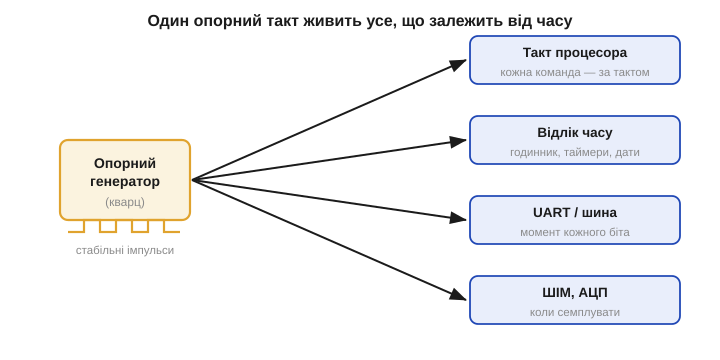
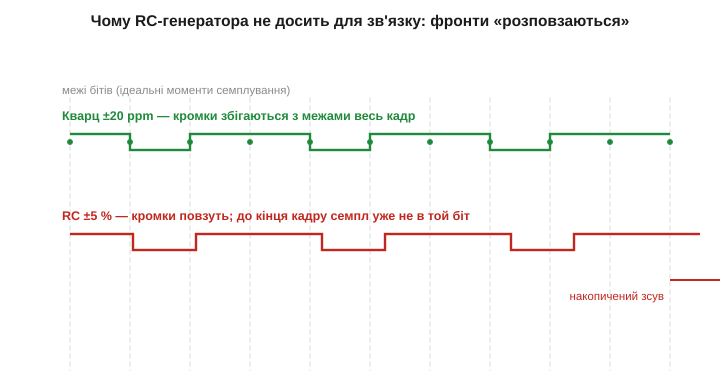

# Навіщо системі опорна частота

Будь-який цифровий пристрій живе за тактом. Процесор виконує команди не «коли захоче», а в чітко відмірені моменти — на фронтах **тактового сигналу** *(clock)*. Лічильник часу нарощує секунди, відлічуючи однакові інтервали. Послідовний інтерфейс посилає біти зі строго заданою швидкістю, щоб приймач знав, коли «дивитися» на лінію. У серці кожного з цих процесів стоїть **опорна частота** — джерело рівних, незмінних «тіків», від яких відраховується все інше. Ключове питання — **навіщо** ця частота має бути такою стабільною: саме вимога стабільності й веде від простих RC-генераторів до кварцового кристала.

### Один генератор живить усе, що залежить від часу

Уявімо мікроконтролер. Усередині нього — арифметичний блок, пам'ять, периферія: таймери, аналого-цифровий перетворювач, послідовні порти. Усі вони синхронізовані одним сигналом — **системним тактом**. Він не робить корисної роботи сам по собі; його єдина задача — бути **метрономом**, рівномірно відраховувати час, щоб решта схеми крокувала в ногу.

Чому метроном узагалі потрібен? Бо цифрова логіка працює **синхронно**: дані переходять з одного регістра в наступний не безперервно, а порціями, на кожному такті. Між фронтами такту схема «думає» — сигнали встигають пройти крізь логічні вентилі й усталитися; на фронті результат **защіпується** в регістр. Прибрати такт — і не буде моменту, коли всі вузли узгоджено роблять крок; схема перетвориться на хаос станів, що міняються будь-коли. Такт — це барабанщик, під чий удар уся команда веслує одночасно. Тому навіть найпростіший мікроконтролер не зробить жодної команди без джерела такту: перше, що він робить, прокидаючись, — запускає генератор.


*Опорний генератор як метроном системи. Один потік стабільних імпульсів живить такт процесора (кожна команда — за тактом), відлік часу (годинник і таймери), послідовну шину (момент кожного біта) і вибірку АЦП/ШІМ. Усе, що має статися «вчасно», відраховується від цих тіків.*

Зверніть увагу: тут важлива не так **висока** частота, як її **постійність**. Процесор не зламається, якщо такт буде трохи повільніший — він просто рахуватиме повільніше. Лихо настає, коли частота **гуляє**: то швидше, то повільніше, непередбачувано. Тоді розсинхронізуються вузли, що мали б крокувати разом, а відлік часу «попливе».

Варто розрізнити дві геть різні вимоги до такту, які часто плутають: **абсолютну точність** (наскільки частота близька до номіналу) і **короткочасну стабільність** (наскільки рівні сусідні періоди). Для самої роботи процесора абсолютна точність майже не важить — він однаково лічитиме команди, хоч би такт був 15.9 чи 16.1 МГц. А от рівність періодів і відсутність «провалів» критичні завжди. Натомість для відліку часу й зв'язку на перший план виходить уже абсолютна точність: тут кожен зайвий проміль перетворюється на втрачені секунди чи биті пакети. Ця відмінність — між «рівні періоди» і «правильна частота» — лежить в основі всього, що далі.

### Чому досить одного джерела на всю систему

Може здатися дивним: процесор тактується десятками чи сотнями мегагерц, USB вимагає своєї частоти, периферія — своєї, а опорний генератор у системі зазвичай **один** і часто навіть невисокої частоти. Як одне джерело задовольняє всіх? Відповідь — у **множенні й діленні** частоти всередині чипа. Поділити частоту просто: один тригер ділить її навпіл, а ланцюжок тригерів дає будь-який степінь двійки нижче. А підняти частоту дозволяє спеціальний вузол — **фазове автопідстроювання частоти** (*phase-locked loop*, PLL), що генерує високу частоту й утримує її в строгій кратності до опорної. Грубо: PLL — це внутрішній генератор, який примусово «крокує в ногу» з опорним, але робить N своїх кроків на кожен крок опорного.

Тут важливий не внутрішній устрій PLL, а його наслідок: **уся точність системи успадковується від одного опорного джерела**. Якщо опорний кварц має ±20 ppm, то й помножена з нього частота процесора матиме ±20 ppm, і поділена частота шини — теж. Множення й ділення зберігають **відносну** точність: вони множать і саму частоту, і її похибку на той самий коефіцієнт. Тому ставити окремий точний генератор на кожну частоту не треба — достатньо одного хорошого опорного, а решту виведе синтез усередині чипа.

Звідси й практика: на платі з потужним процесором часто бачимо лише один зовнішній кварц (іноді ще [окремий годинниковий на 32768 Гц](book:electronics/watch-crystal-rtc)), а всі робочі частоти — це його похідні. Така архітектура й пояснює, чому вибір цього єдиного резонатора такий важливий: він задає планку точності для **всього**, що тактується в системі. Помилишся з ним — попливе одразу все.

### Три задачі, де стабільність критична

Тепер пройдімо по трьох типових задачах, де вимоги до опорної частоти різко зростають, — від найм'якшої до найжорсткішої. Це й окреслить, навіщо взагалі морочитися з кварцом.

Перша — **відлік часу**. Якщо ваш пристрій веде годинник чи ставить мітки часу на дані, то похибка частоти прямо перетворюється на похибку годинника, причому **лінійно з часом**: похибка не усереднюється й не зникає, а невпинно накопичується. Генератор, що поспішає на 1 %, за добу набіжить **майже на чверть години** (86 400 с · 0.01 = 864 с ≈ 14.4 хв). Через тиждень такий годинник годі впізнати — він збіжить більш ніж на півтори години. Для будь-чого, що міряє час, потрібна частота, відома з точністю до часток відсотка, а краще — до часток мільйонної. Саме тому годинник — класичний споживач кварцу, і навіть [кварца буває замало](book:electronics/frequency-accuracy-ppm).

Друга — **такт процесора**. Тут абсолютне значення менш критичне (аби лиш не вище максимуму з даташита), але стабільність усе одно потрібна: уся внутрішня логіка розрахована на конкретний період, і кожен такт має давати схемі досить часу, щоб усталитися. Більшість мікроконтролерів цілком щасливо тактується від внутрішнього RC — для рахунку команд ±2 % несуттєві. Але є винятки, що ламають цю безтурботність. Найвідоміший — **USB**: його протокол вимагає, щоб частота тактування не відхилялася більш ніж на частки відсотка (для повношвидкісного USB — близько ±0.25 %), інакше хост і пристрій не домовляться про біти й з'єднання просто не встановиться. Тому пристрій із USB майже завжди має кварц, навіть якщо для решти вистачило б RC.

Третя, найвимогливіша до точності, — **послідовний зв'язок**. Розгляньмо асинхронний інтерфейс на кшталт UART: два пристрої домовилися про швидкість (скажімо, біт триває певний час) і обмінюються байтами **без окремої лінії такту**. Приймач сам відлічує моменти, коли треба «подивитися» на лінію — у середині кожного біта. Робить він це за **власним** генератором, відраховуючи від стартового фронту: «через півбіта — середина старт-біта, ще через біт — середина першого біта даних» і так далі. Якщо генератори передавача й приймача хоч трохи різняться, моменти семплування поступово **розповзаються** відносно справжніх кромок.


*Чому RC-генератора замало для зв'язку. Зверху — точний кварц: кромки бітів збігаються з ідеальними моментами семплування весь кадр. Знизу — RC ±5 %: похибка накопичується від біта до біта, і до кінця байта приймач семплує вже не той біт. Помилка часу множиться на довжину кадру.*

Ось чому зв'язок особливо чутливий: похибка **накопичується**. Один біт зсунувся на крихту — дрібниця. Але приймач відраховує всі біти кадру від **єдиного** стартового фронту, тож зсуви додаються: до десятого біта накопичений зсув уже може перевалити за половину бітового інтервалу, і приймач прочитає **сусідній** біт. Прикинемо бюджет. Кадр UART — старт-біт, 8 біт даних, стоп-біт, разом близько 10 бітів; семплування має влучати приблизно в середину біта, тож накопичений зсув на останньому біті не повинен перевищувати ±½ біта. Десять бітів, похибка ділиться на десять, та ще й на дві сторони — звідси класичне правило: сумарна різниця частот має бути менша за кілька відсотків.

**Приклад (бюджет розсинхронізації UART).** Кадр — 10 бітів; семплувати треба не далі ніж за ±0.5 біта від кромки на останньому біті.

```
гранична сумарна похибка ≈ 0.5 біта / 10 бітів = 0.05 = 5 %
ділимо на дві сторони (обидві мають свій генератор):
на кожну сторону ≈ 2.5 %
з запасом на форму фронтів беруть    ≲ 2 % на сторону
```

Внутрішній RC із ±5 % сюди **не вкладається** навіть з одного боку — звідси й практика: для надійного UART обидві сторони бажано тактувати кварцом (десятки ppm — мізер проти 2 %), а RC лишають хіба для коротких посилок на невисокій швидкості, та й то ризиковано на краях температури.

Зверніть увагу на спільну рису всіх трьох задач: проблема не в **середній** частоті, а в тому, що похибка **накопичується або зсуває момент**. Годинник набігає, бо похибка частоти інтегрується в час. Зв'язок розсипається, бо зсуви бітів додаються. USB не встановлюється, бо вимога до допуску жорстка від початку. У всіх випадках виручає не «висока» частота, а **передбачувана й стабільна** — і саме її дає кварц. Тому, оцінюючи проєкт, питають не «скільки мегагерц треба», а «наскільки точно й стабільно має триматися частота» — це геть інше питання, і відповідь на нього визначає, чи можна обійтися дешевим вбудованим генератором, чи доведеться ставити зовнішній резонатор.

### Чому RC-генератора недостатньо

Чому ж не обійтися найпростішим генератором на резисторі й конденсаторі? Адже [стала часу RC](book:electronics/rc-time-constant) задає цілком певний період, і зібрати такий генератор — кілька деталей. Найпоширеніший RC-генератор (на основі [тригера Шмітта](book:electronics/schmitt-trigger)) безперервно заряджає й розряджає конденсатор через резистор між двома порогами, і період цих циклів задається добутком R·C. Проблема в тому, що **і R, і C погано тримають своє значення**.

Номінал резистора має допуск (звичайні — ±5 % чи ±1 %), і він повзе з температурою. Ємність конденсатора — ще гірше: керамічні конденсатори класу Y5V втрачають десятки відсотків ємності в робочому діапазоні температур ([🔌 MLCC](book:electronics/capacitor/comp-mlcc.md)), а ще «сідають» під прикладеною напругою. Додайте сюди розкид самих порогів тригера й залежність їх від напруги живлення — і стане ясно, чому RC-генератор принципово не може бути точним: він зібраний з елементів, кожен з яких «дихає». Вбудований у мікроконтролер RC-генератор зазвичай дає точність **близько ±1…5 %** після заводського калібрування — і то лише за кімнатної температури й номінального живлення; на краях діапазону похибка більша. У [одиницях ppm](book:electronics/frequency-accuracy-ppm) це 10 000…50 000 ppm — у тисячу разів грубіше за кварц.

Зробімо проміжний підсумок числами, щоб відчути прірву. RC дає ±1…5 %, тобто 10 000…50 000 ppm. Кварц дає десятки ppm. Різниця — приблизно в **тисячу разів**. Це не «трохи краще» — це інший клас. П'ять відсотків — це і є та сама «чверть години на добу»; двадцять ppm — це менш як дві секунди на добу. Для метронома, що блимає індикатором, RC годиться чудово; для всього, де час або частота мають значення, — ні.

Чому ж RC взагалі тримають у мікроконтролерах, якщо він такий неточний? Бо в нього є дві справжні переваги: він **безкоштовний** (уже всередині чипа, не треба ні зовнішнього компонента, ні місця на платі, ні двох конденсаторів) і **миттєво стартує** — на відміну від [кварцу, що розгойдується мілісекунди](root:embedded/ceramic-mems-resonators). Тому типова схема така: мікроконтролер прокидається на внутрішньому RC (щоб одразу почати працювати), а вже потім, якщо задача того потребує, запускає зовнішній кварц і перемикається на нього. Уміння свідомо обрати між RC і кварцом — окрема практична навичка ([🔌 внутрішній RC проти кварцу](book:electronics/reference-frequency/comp-internal-rc.md)).

> 🔧 **Навіщо це.** Перше технічне рішення кожного проєкту — звідки брати такт, і воно прямо впливає на собівартість і надійність. Дешевий пристрій, що лише блимає і нічого не передає, обійдеться вбудованим RC-генератором: не треба ні кварцу, ні двох конденсаторів, ні місця на платі, ні турбот із розведенням. А от щойно з'являється UART на пристойній швидкості, USB, точний годинник чи радіо — RC вже не годиться, і ставлять кварц. Уміння провести цю межу — заощадити там, де можна, і не зекономити там, де не можна — економить і гроші, і місце, і нерви на налагодженні «чомусь не працює зв'язок». Половина загадкових «пристрій бачить дані, а CRC не сходиться» — це саме розсинхронізація через надто грубий генератор.

Отже, потрібен елемент, чия частота задається не «м'якими» R і C, а чимось **жорстким і відтворюваним** — властивістю самої речовини, що майже не міняється з температурою, напругою чи часом. Таким елементом і виявився кристал кварцу, де частоту визначає не електрична схема, а **механічний резонанс** твердого тіла. Розгойдати цей кристал електричною схемою дозволяє [п'єзоефект](book:physics/piezoelectric-effect) — здатність кристала перетворювати механічну деформацію на напругу і навпаки.
