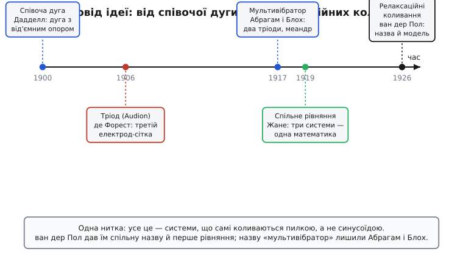
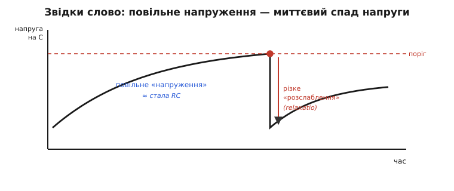

# 📜 Хто й коли назвав ці коливання «релаксаційними»

Назва приходить до явища пізно. Спершу схема просто працює — гуде, блимає, цокає, — і ніхто не має для цього слова. Потім хтось дивиться на десяток несхожих пристроїв, які гудуть однаково негарно, і раптом бачить, що всередині в них коїться те саме. Цей погляд — і є народження поняття. З релаксаційними коливаннями сталося саме так: пилясту, рвучку поведінку лампових і дугових схем інженери знали років тридцять, перш ніж голландський фізик дав їй ім'я й перше рівняння. А практичний пристрій — мультивібратор — устигли збудувати й охрестити ще раніше, посеред Першої світової, зовсім інші люди й зовсім з іншою метою.

Розплутаймо цей вузол по нитці: спершу хто перший назвав сам пристрій, тоді — звідки взялося слово «релаксація», і нарешті — хто зібрав розкидані явища в одне поняття.

## Пилясті схеми, яких ніхто не любив

Кінець ХІХ — початок ХХ століття. Електротехніка вже вміє запалювати дугу між вугільними електродами — це яскраве світло вуличних ліхтарів. Але дуга **співає**: вона гуде, сичить, інколи свистить на якійсь ноті. Інженерам це заважало, для нас же це перша ниточка.

Англієць Вільям Дюделл (William Du Bois Duddell, 1872–1917) узявся 1900 року з'ясувати, **чому дуга гуде**, і знайшов дивовижну річ. Дуга поводиться як елемент із **від'ємним опором** (англ. *negative resistance*): у звичайного резистора більший струм означає більшу напругу на ньому, а в дузі навпаки — піднімаєш струм, а напруга на проміжку падає. Така «навпаки-залежність» означає, що дуга не гасить коливання, а **підкачує** їх енергією. Дюделл під'єднав до дуги коливальний LC-контур — і дуга заспівала чисто й гучно на частоті контуру. Він навіть приробив клавіатуру й зіграв перед інженерним товариством у Лондоні мелодію — це один із найперших електронних музичних інструментів.

Тут важлива чесність із першістю. Сам Дюделл не був першовідкривачем явища: ще 1898 року німець Герман Теодор Симон (Hermann Theodor Simon) описав «співучу дугу» друком. Дюделл дав ясне пояснення через від'ємний опір і яскраву демонстрацію — і саме за ним закріпилася назва «співоча дуга» (англ. *singing arc*). А вже за два роки данець Вальдемар Поульсен (Valdemar Poulsen) із Педерсеном (P. O. Pedersen) підняли частоту цих коливань у радіодіапазон і 1902–1903 запатентували дугове радіо — перший передавач безперервної хвилі. *(Статус: усталено.)*

Паралельно дозрівала друга ниточка — **підсилювальна лампа**. У 1906-му американець Лі де Форест (Lee de Forest, 1873–1961) додав до вакуумного діода третій електрод — сітку (англ. *grid*) між нитку розжарення й анод — і дістав **тріод** (Audion); заявку на «сітковий» варіант він подав 29 січня 1907 року. Тоненький струм на сітці керував великим струмом крізь лампу — уперше з'явився прилад, що **підсилює** електричний сигнал. (Незалежно того ж 1906-го третій електрод запатентував австрієць Роберт фон Лібен — винахід, як завжди, був колективним.) Підсилювач, охоплений зворотним зв'язком, теж починає сам коливатися — це третя схема в нашому ряду. *(Статус: усталено.)*

Отже, до 1910-х уже існував цілий звіринець систем, що **коливаються самі собою**, без зовнішнього поштовху: дуга, тріод зі зворотним зв'язком, а ще раніше — навіть послідовна динамо-машина (її самозбудні поштовхи описав ще 1880 року Гérard-Lescuyer). Усі вони гуділи, але ніхто не бачив у них **спільної природи**. Кожну вивчали окремо, для кожної писали свої рівняння. Слова, яке поєднало б їх, ще не було.


*Родовід ідеї. Кілька несхожих пристроїв коливаються однаково — рвучкою пилкою, а не плавною синусоїдою. Спершу їх вивчають порізно; Поль Жане 1919 року помічає, що три з них описує одне рівняння; ван дер Пол 1926-го дає явищу спільну назву й узагальнену модель. Назву ж самого пристрою-мультивібратора лишили Абрагам і Блох.*

## Мультивібратор: винайшли на війні, щоб міряти частоту

Найпрактичніший крок зробили не задля теорії, а задля цілком конкретної воєнної потреби. Йшла Перша світова, радіозв'язок раптом став зброєю, і військам терміново знадобилося **точно міряти частоту** радіопередавачів. Прилад для цього — хвилемір (англ. *wavemeter*) — сам потребує калібрування за відомими, надійними частотами. А де взяти набір точних опорних частот?

Двоє французьких фізиків із Вищої нормальної школи (École normale supérieure) у Парижі — Анрі Абрагам (Henri Abraham, 1868–1943) і Ежен Блох (Eugène Bloch, 1878–1944) — знайшли елегантну відповідь у 1917 році. Вони з'єднали **два тріоди навхрест**: вихід кожного через RC-ланку керував входом сусіда. Коло не мало стійкого спокою — воно безперервно перекидалося з боку в бік, поки один тріод відмикався, інший замикався, і навпаки. На виході виходив не плавний тон, а різкий **прямокутник** — меандр.

І тут — ключова думка, заради якої винахід і робили. Різкий прямокутний сигнал **багатий на гармоніки**: крім основної частоти, він несе цілий гребінець кратних їй частот — подвоєну, потроєну, уп'ятеро більшу й далі вгору. Саме за цю властивість Абрагам і Блох назвали схему **мультивібратором** (фр. *multivibrateur*, від лат. *multus* — численний, і *vibrare* — коливати): один пристрій видає **багато** частот одразу. Один-єдиний генератор давав цілу «лінійку» опорних позначок, по яких і калібрували хвилемір. *(Статус: усталено; опубліковано в Annales de Physique, т. 12, с. 252, 1919, та у виданні французького військового міністерства.)*

> 🔧 **Навіщо це.** Думка «одне джерело — багато гармонік для калібрування» жива й досі. Коли треба перевірити шкалу частотоміра або приймача, інженер і сьогодні бере генератор гострих імпульсів (так званий *comb generator*, гребінчастий генератор) — прямий нащадок ідеї Абрагама й Блоха. А сам мультивібратор на двох ключах, що перекидаються навхрест, лишився базовою цеглинкою цифрової техніки: рівно так влаштований і астабільний генератор тактів, і тригер-засувка.

Дуже важливо не плутати дві споріднені, але різні французькі й англійські розробки тих самих років. Абрагам і Блох зробили **астабільний** мультивібратор — той, що не має жодного стійкого стану й тому коливається сам (це і є наш релаксаційний генератор). А майже одночасно, 1918–1919, англійці Вільям Еклс (William Eccles) і Френк Джордан (Frank Jordan) збудували **бістабільний** мультивібратор — навпаки, із двома стійкими станами, що сам не коливається, а лише запам'ятовує, у якому він стані. Це вже не генератор, а елемент пам'яті — прабатько тригера. Схеми схожі на вигляд, та роль протилежна; обидві справедливо звуть мультивібраторами. *(Статус: усталено.)*

Зверніть увагу, чого Абрагам і Блох **не зробили**. Вони збудували чудовий пристрій і дали йому влучну назву — за формою сигналу, за гармоніками. Але вони не назвали **сам тип коливань** і не вивели для нього загальної теорії. Їхній мультивібратор був геніальним інструментом, а не поняттям. Поняття народилося пізніше — і в іншій країні.

## Звідки взялося слово «релаксація»

Тепер головна дійова особа — Балтазар ван дер Пол (нід. Balthasar van der Pol, 1889–1959). Голландець, народився в Утрехті в родині заможного торговця чаєм, навчався фізики й математики в Утрехтському університеті, потім поїхав до Лондона працювати з Джоном Амброзом Флемінгом (винахідником вакуумного діода). З 1922 року — головний фізик дослідної лабораторії Philips в Ейндговені, згодом директор наукових радіодосліджень. Людина радіо до кісток: саме за налагодження першого радіотелефонного зв'язку між Нідерландами й Голландською Ост-Індією його 1927-го посвятили в лицарі ордена Оранже-Нассау. *(Статус: усталено.)*

Ван дер Пол робив те саме, що багато хто тоді: вивчав лампові генератори зі зворотним зв'язком. Але він поставив питання глибше за інженерів — **математично**. Він записав рівняння, що описує тріодний генератор, у якому втрати залежать від амплітуди так: малі коливання система **підкачує** (наче від'ємне тертя), а великі — **гасить**. Це його знамените рівняння, яке тепер звуть рівнянням ван дер Поля. У безрозмірному вигляді воно виглядає так:

```math
d²x/dt² − μ·(1 − x²)·dx/dt + x = 0
```

Тут x — це, грубо, напруга чи струм у схемі, а μ (грецька «мю») — єдиний параметр, що міряє, **наскільки сильно** нелінійність керує процесом. І ось у цьому μ — уся сіль історії.

Коли μ мале, член із (1 − x²) майже не заважає, і рівняння дає те, чого всі чекали від генератора, — **майже синусоїду**, плавне гойдання, як у маятника. Але ван дер Пол простежив, що буде при **великому** μ, — і побачив зовсім інше. Коли нелінійність сильна, рух перестає бути плавним: система **довго й мляво** повзе в один бік, а тоді **раптом, стрибком** перекидається в інший. Повільне накопичення — миттєвий зрив — знову повільне накопичення. Та сама пиляста, рвучка форма, що й у дуги, у мультивібратора, у блимавки на конденсаторі.

Залишалося назвати це. І тут ван дер Пол зробив точний хід — **запозичив слово з механіки та фізики суцільних середовищ**, де воно вже жило. Там «час релаксації» (англ. *relaxation time*) — це час, за який система, виведена з рівноваги, **сама спадає** назад: за який напруження «розслаблюється», тиск розсіюється, заряд стікає. Слово походить від латинського *relaxatio* — послаблення, ослаблення напруження. Ван дер Пол помітив, що в його схемі тривалість одного циклу задає не резонансна формула Томсона (де частота йде від √(LC)), а **час розряду конденсатора крізь резистор** — а це і є, дослівно, релаксаційний час, добуток RC. Звідси його власне формулювання: період цих нових коливань визначається тривалістю розряду конденсатора, яку інколи звуть «часом релаксації», — тож такі коливання зручно назвати **релаксаційними**. *(Статус: усталено — це його прямий аргумент у статтях того періоду.)*


*Чому саме «релаксація». Повільна фаза — напруга на конденсаторі плавно наростає, «напружується» зі швидкістю, яку задає стала RC; на порозі настає миттєве «розслаблення» — різкий спад. Це не плавне гойдання маятника, а цикл «накопичив напруження → скинув його». Звідси й назва, перенесена з механіки.*

Назву ван дер Пол увів у статті «On relaxation-oscillations» («Про релаксаційні коливання») у журналі *The London, Edinburgh, and Dublin Philosophical Magazine* — том 2, число 11, сторінки 978–992, **1926 рік**. Це й вважають точкою народження терміна. *(Статус: усталено — конкретна публікація відома й цитується дотепер.)*

> 🔧 **Навіщо це.** Ось чому формула періоду релаксаційного генератора містить добуток R·C, а не √(LC), як у резонансних схем, і чому його частота майже не залежить від напруги живлення: усе тримається на одному «релаксаційному часі» розряду конденсатора. Зрозумівши це слово буквально — «час, за який напруга сама спадає», — ви наперед знаєте, від чого залежить частота такого генератора й від чого ні.

## Чому це було поняттям, а не просто словом

Можна було б подумати: ну, придумав чоловік влучне слово — і що? Але внесок ван дер Поля глибший за вдалу назву, і варто побачити, у чому саме.

До нього кожну самоколивну схему вивчали як окремий випадок зі своїм рівнянням: дугу — одне, динамо-машину — інше, тріод — третє. Француз Анрі Пуанкаре (Henri Poincaré) ще 1908 року розглядав співочу дугу геометрично; Поль Жане (Paul Janet) 1919 року зробив вирішальне спостереження — що **послідовна динамо-машина, дуга й тріод описуються однаковим рівнянням**, тобто це одне явище в трьох подобах; того ж 1919-го Андре Блондель (André Blondel) вивів рівняння для тріода. Ґрунт був готовий. *(Статус: усталено.)*

Ван дер Пол поставив над цим **дах**. Він запропонував одне узагальнене безрозмірне рівняння — те саме з параметром μ, — яке схоплює спільну поведінку всіх цих систем, і показав, що при сильній нелінійності з нього неминуче випливає рвучка, пиляста форма. Він не просто назвав явище — він дав йому **модель і мову**, якими можна було рахувати й передбачати. А далі, у 1926–1930 роках, разом із французом Філіпом Ле Корбейє (Philippe Le Corbeiller) він наполегливо **поширював** це поняття: брав старі досліди — ту саму дугу, той самий мультивібратор — і показував їх як приклади одного й того самого релаксаційного механізму. Так розрізнені інженерні дивовижі перетворилися на **єдине наукове поняття** з ім'ям, рівнянням і колом застосувань. *(Статус: усталено.)*

І ще одна нитка, яку ван дер Пол потягнув несподівано далеко. Помітивши, що релаксаційні коливання — це всюди, де щось повільно накопичується й різко скидається, він припустив, що так само влаштоване й **серцебиття**: повільне наповнення, різкий поштовх, пауза. У 1928 році він із Йоганнесом ван дер Марком (Jan van der Mark) збудував електричну модель серця на трьох зв'язаних релаксаційних генераторах і навіть змоделював на ній серцеві аритмії. Поняття, народжене з гудіння лампових схем, виявилося мовою для живого серця — найкращий доказ, що це справді **поняття**, а не просто слово для одного типу радіодеталей. *(Статус: усталено.)*

## Хто за що відповідає — коротко й чесно

Історія цього терміна — гарний приклад того, як винахід і поняття **народжуються різними руками**, і плутати їхні заслуги не варто.

**Дюделл** (1900) показав, що самоколивання — це від'ємний опір, який підкачує контур; **де Форест** (1906–1907, поряд із фон Лібеном) дав підсилювальний тріод, на якому виросла вся лампова генерація; **Поульсен** підняв дугові коливання в радіодіапазон. Це передісторія — джерела, з яких поставала ідея самоколивної системи.

**Абрагам і Блох** (французи, 1917) збудували перший **астабільний мультивібратор** на двох тріодах задля калібрування хвилемірів і дали назву самому **пристрою** — за багатий на гармоніки прямокутний вихід. Вони ж — автори слова «мультивібратор», але не «релаксаційні коливання».

**Пуанкаре, Жане, Блондель** (1908–1919) підготували математику й, головне, побачили, що різні самоколивні схеми — це **одне** явище.

**Балтазар ван дер Пол** (голландець, 1926) дав цьому явищу **назву** — «релаксаційні коливання», запозичивши «релаксацію» з механіки, бо період тут задає час розряду RC, — і **перше узагальнене рівняння**, перетворивши розкидані інженерні факти на наукове поняття; разом із Ле Корбейє він це поняття утвердив, а моделлю серця показав його широчінь.

Тож коли наступного разу проста схема з резистором і конденсатором блимає світлодіодом, варто пам'ятати: за словом «релаксаційний» стоять і співоча вулична дуга, і воєнний хвилемір під Парижем, і голландський радіофізик, який почув у гудінні лампи відлуння того самого «напруження й розслаблення», що й у напруженій пружині.
