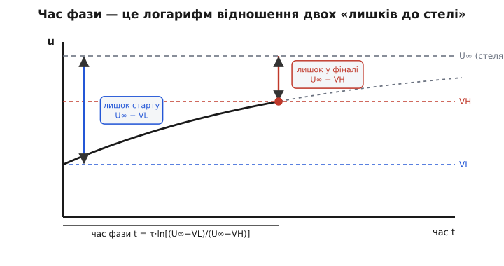
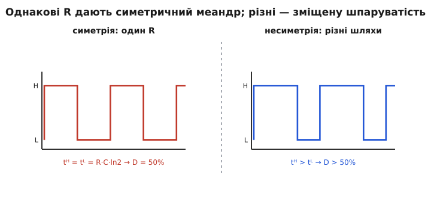

# 🧮 Звідки в періоді береться логарифм і чому живлення скорочується

Готова формула періоду релаксаційного генератора виглядає дивно для того, хто звик до простих добутків. T ≈ 1.386·R·C — звідки тут узявся коефіцієнт 1.386, а не круглі 1 чи 2? Чому в точну формулу заліз **натуральний логарифм**, та ще й логарифм відношення якихось порогів? І найбентежніше: чому напруга живлення, від якої начебто все й залежить — і висота заряду, і самі пороги — у відповіді **взагалі зникає**, тож частота тримається стійко й від свіжої батареї, і від підсілої?

Усі три загадки розв'язує одне-єдине рівняння — те, яким конденсатор заряджається через резистор. Якщо взяти його й чесно знайти час, за який напруга проходить від нижнього порога до верхнього, логарифм вискакує сам, коефіцієнт 1.386 виявляється просто подвоєним ln 2, а живлення скорочується на очах, бо входить і в чисельник, і в знаменник одного дробу. Зробімо це виведення повільно, від самого кореня, бо на ньому стоїть розрахунок будь-якого RC-генератора — від голого компаратора до мікросхеми 555.

## Точка опертя: як заряджається конденсатор

Усе починається з [рівняння заряду RC-кола](topic:electronics/rc-time-constant). Коли конденсатор C заряджається (чи розряджається) через резистор R, прямуючи до якоїсь кінцевої напруги U∞, його напруга в часі змінюється так:

```
u(t) = U∞ + (U₀ − U∞) · e^(−t / RC)
```

Розберімо, що́ тут стоїть, бо кожен символ зараз спрацює.

- **U∞** — та напруга, до якої коло прямує й на якій би **зупинилося**, якби ми чекали нескінченно довго (англ. *final value*, кінцеве значення). Якщо конденсатор заряджається через резистор до плюса живлення, то U∞ — це і є плюс живлення; якщо розряджається на землю — U∞ = 0. Це «стеля» (чи «підлога»), до якої тягнеться крива.
- **U₀** — напруга, з якої коло **стартує** в цей момент (англ. *initial value*). У нашому генераторі це поріг, від якого щойно почалася фаза.
- **R·C = τ** — стала часу (грецька τ, *tau*): не час повного заряду, а лише мітка «за цей час пройдено 63 % шляху від старту до стелі». Великі R чи C — крива повзе ліниво; малі — швидко.
- **e** — основа натурального логарифма, 2.718…

Сенс рівняння інтуїтивно простий, і саме інтуїцію тут треба вхопити міцно, бо з неї виросте все. Подивімося на величину `(U₀ − U∞)·e^(−t/RC)` під іншим кутом. У будь-яку мить **відстань, що лишилася від напруги до стелі**, дорівнює `U∞ − u(t)`. Підставивши рівняння, дістаємо:

```
U∞ − u(t) = (U∞ − U₀) · e^(−t / RC)
```

Ось серце всієї справи. **Лишок до стелі тане за чистою експонентою.** На старті (t = 0) він дорівнює `U∞ − U₀` — повна відстань. Що далі, то менший: за кожні τ секунд він меншає у фіксоване число разів (точніше — у e ≈ 2.718 раза). Крива не «втомлюється» якось хитро — вона рівномірно з'їдає **частку** того, що лишилося. Пройшла половину лишку — далі половину від половини — далі половину від тієї половини, і так без кінця, ніколи стелі не торкаючись.

> 🔧 **Навіщо це.** Погляд «лишок тане в стале число разів за стале τ» — не математична оздоба, а ключ до всього розрахунку. Він каже: час, щоб лишок зменшився з одного рівня до іншого, залежить **лише від відношення цих рівнів**, а не від їхньої абсолютної висоти. Саме звідси вилізе і логарифм, і скорочення живлення. Хто бачить експоненту як «рівномірне поїдання частки лишку», той розв'яже задачу про період за пів хвилини в голові.

## Знаходимо час однієї фази

Тепер — головний хід. У генераторі конденсатор за одну фазу йде від **нижнього порога VL** до **верхнього порога VH**, прямуючи до стелі U∞ (яка стоїть вище за VH, інакше крива до нього просто не дотягнулася б). Скільки часу t на це піде?

Скористаймося рівнянням лишку двічі — на старті фази й у її кінці. На старті напруга дорівнює VL, тож лишок до стелі — `U∞ − VL`. У кінці напруга дорівнює VH, лишок — `U∞ − VH`. Але лишок тане за експонентою, отже відношення «лишок у кінці» до «лишку на старті» — це рівно множник `e^(−t/RC)`:

```
(U∞ − VH) / (U∞ − VL) = e^(−t / RC)
```

Це і є вся фізика задачі, стиснута в один рядок. Ліворуч — чисте відношення двох відстаней до стелі; праворуч — те, на скільки крива встигла «розрядити» лишок за час t. Лишилося витягти t, а з-під експоненти його дістає тільки логарифм. Беремо натуральний логарифм обох боків (натуральний — бо саме він обертає `e^(…)`):

```
−t / RC = ln[ (U∞ − VH) / (U∞ − VL) ]
```

Знак мінус прибираємо, перевернувши дріб усередині логарифма (ln оберненого числа — це мінус ln числа), і дістаємо **головну формулу часу однієї фази**:

```
t = R·C · ln[ (U∞ − VL) / (U∞ − VH) ]
```


*Чому в часі сидить логарифм. Напруга стартує з VL й експонентою тягнеться до стелі U∞, але ми ловимо її на VH і обриваємо (сіра пунктирна частина — куди б вона дійшла, якби ми не клацнули). Синя стрілка — лишок до стелі на старті, U∞ − VL; червона — лишок у момент клацання, U∞ − VH. Час фази визначає тільки відношення цих двох лишків — через натуральний логарифм.*

Звідки тут логарифм, тепер видно наскрізь. Лишок тане **множенням** (за кожні τ — у стале число разів), а питання «скільки τ треба, щоб лишок зменшився з одного значення до іншого» — це завжди питання «у скільки кроків-множників вкластися», а на нього відповідає саме логарифм. Логарифм — це лічильник того, скільки разів треба домножити; тут він рахує, скільки сталих часу вміщається у звуження лишку від `U∞ − VL` до `U∞ − VH`. Те, що множить, обертається логарифмом — це не випадковість, а сама природа [натурального логарифма як мови процесів заряду-розряду](topic:math/logarithms).

## Чому живлення скорочується

Тепер — найкрасивіше. Підставмо в загальну формулу конкретні, типові для класичної схеми пороги: нижній на ⅓ живлення, верхній на ⅔ живлення, а заряд іде до самого живлення V (тобто стеля U∞ = V). Саме так розставляє пороги внутрішній дільник [тригера Шмітта](topic:electronics/schmitt-trigger) чи мікросхеми 555. Порахуймо обидва лишки до стелі:

```
лишок на старті:  U∞ − VL = V − ⅓V = ⅔V
лишок у фіналі:   U∞ − VH = V − ⅔V = ⅓V
```

А тепер ставимо їх у формулу часу — і дивимося, що́ стається з V:

```
t = R·C · ln[ (⅔V) / (⅓V) ]
```

Дріб під логарифмом — `(⅔V)/(⅓V)`. **Літера V стоїть і зверху, і знизу — вона скорочується.** Лишається голе число:

```
t = R·C · ln(2)
ln(2) ≈ 0.6931
t ≈ 0.693 · R·C
```

Ось де ховається славнозвісне 0.693 — це просто `ln 2`, і ось чому напруга живлення з відповіді зникла. Пороги ⅓ і ⅔ — це **частки** живлення, не абсолютні вольти: підняли живлення вдвічі — і пороги поїхали вгору вдвічі, і стеля піднялася вдвічі, **усі три відстані виросли в одне й те саме число разів**. А відношення двох відстаней, що ростуть однаково, не змінюється ані на крихту. Конденсатор завжди долає **рівно половину** залишку до стелі (з ⅔ висоти, що лишалася, до ⅓, що лишилася) — а час пройти половину будь-якої експоненти один і той самий, скільки б вольтів не було під схемою.

> 🔧 **Навіщо це.** Звідси практичний дарунок: частота релаксаційного генератора з порогами-частками **не залежить від напруги живлення**. Батарейка просіла з 5 до 4 вольтів — блимання не змінило темпу. Це велика перевага для автономних пристроїв: не треба ні стабілізатора заради точності такту, ні переживань, що годинник-блимавка «попливе» від розряду батареї. Стабільність тут — безкоштовний наслідок того, що пороги їдуть із живленням разом.

## Складаємо повний період і частоту

Повний цикл — це підйом від VL до VH плюс спад від VH назад до VL. У симетричному випадку (однакові пороги-частки, однаковий R на заряд і розряд) обидві фази тривають однаково — по `R·C·ln2` кожна. Тож період — подвоєна фаза:

```
T = 2 · R·C · ln(2)
T ≈ 2 · 0.693 · R·C ≈ 1.386 · R·C
```

Ось і розгадане загадкове 1.386 — це просто `2·ln2`. А частота — обернений період:

```
f = 1 / T = 1 / (2·R·C·ln2)
f ≈ 0.7213 / (R·C)
```

(Звідки 0.7213? Це `1 / (2·ln2)`. Той самий ln 2, лише перевернутий і поділений навпіл.) Головне, що варто винести: **частота обернено пропорційна добутку R·C**, а логарифм лише задає сталий числовий коефіцієнт. Хочете вдвічі повільніше блимання — удвічі більший R або C; коефіцієнт 1.386 при цьому не ворухнеться.

**Перевірка зворотним ходом: який R дасть 2 Гц при C = 1 мкФ.** Треба період T = 0.5 с. З формули T = 1.386·R·C виражаємо R:

```
R = T / (1.386 · C)
R = 0.5 / (1.386 · 1·10⁻⁶)
R ≈ 360 700 Ом ≈ 360 кОм
```

Збігається з тим, що дає пряма формула, — і це зручно тримати в прошивці одним рядком, щоб на льоту прикидати номінали:

:::tabs
```c
// Період і резистор релаксаційного генератора з порогами 1/3 і 2/3 живлення.
// τ = R·C; кожна фаза = τ·ln2; період = 2·τ·ln2.
#include <math.h>

float relax_period(float r_ohm, float c_farad)  // період T, секунди
{
    const float LN2 = 0.6931472f;
    return 2.0f * r_ohm * c_farad * LN2;         // T = 2·R·C·ln2 ≈ 1.386·R·C
}

float relax_resistor(float f_hz, float c_farad)  // R під бажану частоту
{
    const float K = 1.386294f;                   // 2·ln2
    return 1.0f / (K * f_hz * c_farad);          // R = 1 / (2·ln2 · f · C)
}

// Приклад: 2 Гц при 1 мкФ
float R = relax_resistor(2.0f, 1.0e-6f);         // ≈ 360 700 Ом → ставимо 360 кОм
```
```python
# Період і резистор релаксаційного генератора з порогами 1/3 і 2/3 живлення.
# τ = R·C; кожна фаза = τ·ln2; період = 2·τ·ln2.
from math import log

LN2 = log(2)  # 0.6931472…


def relax_period(r_ohm, c_farad):      # період T, секунди
    return 2 * r_ohm * c_farad * LN2   # T = 2·R·C·ln2 ≈ 1.386·R·C


def relax_resistor(f_hz, c_farad):     # R під бажану частоту
    return 1 / (2 * LN2 * f_hz * c_farad)  # R = 1 / (2·ln2 · f · C)


# Приклад: 2 Гц при 1 мкФ
r = relax_resistor(2.0, 1.0e-6)        # ≈ 360 700 Ом → ставимо 360 кОм
```
:::

## Несиметричний випадок: різні R, різна шпаруватість

Симетрія — окремий щасливий випадок. Загальна формула `t = R·C·ln[(U∞−VL)/(U∞−VH)]` нічого не вимагає від того, щоб заряд і розряд ішли однаковим шляхом, — і варто шляхам розійтися, як фази стають різними за тривалістю. А це міняє вже не частоту саму по собі, а **шпаруватість** (англ. *duty cycle*) — частку періоду, коли вихід тримає високий рівень.


*Дві ситуації виходу. Ліворуч заряд і розряд ідуть крізь однаковий опір — фази рівні, меандр симетричний, шпаруватість рівно 50%. Праворуч шляхи різні (заряд крізь більший опір) — фаза підйому довша за фазу спаду, тож вихід довше сидить угорі, і шпаруватість більша за половину.*

Найвідоміше втілення цього — астабільний режим [таймера 555](topic:electronics/555-astable). Там одна тонкість заліза розводить шляхи: конденсатор **заряджається крізь два резистори Rₐ + R_b** (струм тече з живлення через обидва), а **розряджається крізь один R_b** (вивід розряду закорочує Rₐ на землю, лишаючи в колі тільки R_b). Пороги ті самі ⅓ і ⅔, тож кожна фаза дає свій `ln2`, але стала часу в них різна:

```
підйом (заряд):  tᴴ = ln2 · (Rₐ + R_b) · C
спад (розряд):   tᴸ = ln2 ·  R_b       · C
```

Період — сума двох часів, і ось як народжується «канонічна» формула 555:

```
T = tᴴ + tᴸ = ln2 · (Rₐ + R_b)·C + ln2 · R_b·C
T = ln2 · (Rₐ + 2·R_b) · C
T ≈ 0.693 · (Rₐ + 2·R_b) · C
```

Видно, що це не якась окрема магічна формула, а **той самий період 2·R·C·ln2**, лише з різними опорами у двох доданках: множник «2» при R_b — це слід того, що R_b працює в **обох** фазах, а Rₐ — тільки в заряді. Симетрична формула — її частковий випадок: коли заряд і розряд ідуть однаковим R, обидва доданки рівні, і `(Rₐ + 2R_b)` обертається на `2R`. Частота тоді:

```
f = 1 / T = 1 / (ln2 · (Rₐ + 2·R_b)·C)
f ≈ 1.44 / ((Rₐ + 2·R_b) · C)
```

(Коефіцієнт 1.44 — це `1/ln2 ≈ 1.4427`; коли всі опори рівні, він ділиться навпіл назад до знайомих 0.722.) А шпаруватість — частка періоду під високим рівнем — виходить дробом самих опорів, без жодного ln, бо `ln2` стоїть у кожному часі й при діленні скорочується:

```
D = tᴴ / T = (Rₐ + R_b) / (Rₐ + 2·R_b)
```

Подивіться на цей дріб: чисельник `(Rₐ + R_b)` завжди **менший** за знаменник `(Rₐ + 2R_b)` рівно на R_b. Тож поки R_b > 0, шпаруватість строго більша за половину — додатний імпульс голого 555 фізично не може бути коротшим за від'ємний, бо заряд тягне зайвий резистор Rₐ, якого нема в шляху розряду. Як це вирівняти одним діодом, докладно розбирає [вставка з формулами астабільного 555](topic:electronics/555-astable/math-astable-formulas.md); нам тут важливо побачити інше — що **вся ця сім'я формул, симетрична й ні, виросла з одного рівняння заряду конденсатора**, і відрізняється лише тим, які напруги ми поставили на місце U∞, VL, VH і який опір стоїть у кожній фазі.

## Що з цього винести

Період релаксаційного генератора — не формула, яку треба зазубрити, а наслідок одного фізичного факту: напруга на конденсаторі женеться до стелі по експоненті, а лишок до стелі тане **множенням**. Звідси троє наслідків, що варто тримати в голові разом.

Перше — **логарифм** у формулі неминучий: час фази дорівнює `R·C · ln[(U∞−VL)/(U∞−VH)]`, бо питання «скільки сталих часу вкласти у звуження лишку» завжди має відповіддю логарифм відношення. Друге — **скорочення живлення**: коли пороги задані частками живлення, V стоїть і в чисельнику, і в знаменнику логарифмованого дробу й зникає, тож частота від напруги не залежить; для класичних ⅓–⅔ це дає чисте `T = 2·R·C·ln2 ≈ 1.386·R·C` і `f ≈ 0.722/(R·C)`. Третє — **несиметрія**: щойно заряд і розряд ідуть різними опорами, фази стають різної довжини, і період узагальнюється до `ln2·(Rₐ+2R_b)·C` (формула 555), а шпаруватість — до дробу самих опорів. Опануєш цей один хід «лишок тане за експонентою → логарифм відношення лишків», і порахуєш період будь-якого RC-генератора, який лиш трапиться.
