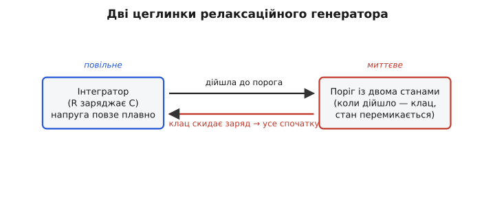
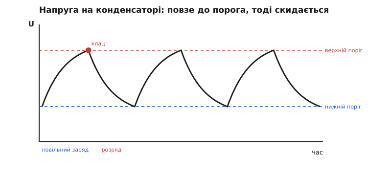
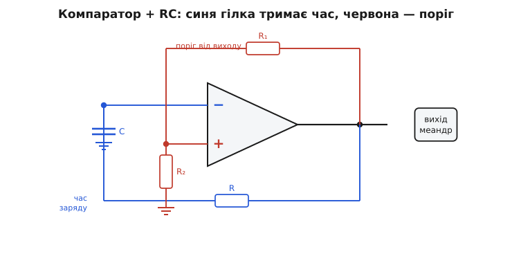

# Релаксаційний генератор

Уявіть бачок зливу в туалеті. Вода тонкою цівкою наповнює його повільно й рівномірно. Рівень повзе вгору — поки не дійде до краю поплавкового важеля, і тоді одним різким рухом усе перекидається: засувка відкривається, бачок спорожняється за секунду, важіль падає назад — і повільне наповнення починається спочатку. Повільне накопичення, миттєвий зрив, повтор. Якщо цівка тече сталим струменем, бачок перекидатиметься через рівні проміжки часу сам собою, без жодного годинника.

Це і є **релаксаційний генератор** — схема, що породжує коливання не гойданням туди-сюди, а саме таким циклом «повільно накопичив → різко скинув → знову». Накопичує не воду, а **заряд на конденсаторі**; край важеля — це **поріг напруги**, який вмикає швидке скидання. Назва «релаксаційний» (від лат. *relaxatio* — послаблення, спад напруження) прийшла з механіки: повільна фаза — це наростання напруги, а різкий скид — її «розслаблення», спад до нуля. [Хто й коли так назвав ці коливання](book:electronics/relaxation-oscillator/hist-relaxation-name.md) — окрема й цікава історія: термін увів голландський фізик Балтазар ван дер Пол у 1920-х, вивчаючи дивну поведінку лампових схем, а перший практичний генератор такого типу — мультивібратор — побудували французи Абрагам і Блох ще під час Першої світової.

Чому це взагалі окремий клас? Бо є **два геть різні способи змусити схему коливатися**. Перший — резонансний: конденсатор і котушка перекидають енергію один одному, як маятник перекидає її між висотою й швидкістю; виходить плавна синусоїда, а частоту задає [резонанс LC-контуру](book:electronics/lc-resonance). Другий — релаксаційний: ніякого маятника, лише наповнення-зрив; виходить не синусоїда, а пиляста або прямокутна форма, і частоту задає вже не резонанс, а **час заряду RC**. Перший спосіб — про красиву синусоїду й точну частоту; другий — про простоту, дешевизну й форму сигналу, схожу на цокання годинника. Розберімо саме другий — з самих його коренів.

## Дві цеглинки, з яких усе складається

Щоб схема сама перекидалася туди-сюди, потрібні рівно дві речі, і кожна робить свою половину роботи.

**Перша цеглинка — щось, що змінюється повільно й плавно.** У бачку це наповнення водою. В електроніці найдешевший «повільно наповнюваний бак» — це конденсатор, який заряджають через резистор. Підключіть конденсатор C до напруги живлення через резистор R — і напруга на ньому не стрибне миттєво, а поповзе вгору плавно, бо резистор обмежує струм, яким тече заряд. Швидкість цього повзання задає [стала часу RC](book:electronics/rc-time-constant) — добуток τ = R·C, що показує, за скільки секунд конденсатор устигає підзарядитися «помітно». Великий R чи великий C — повзе ліниво; малі — швидко. Це наш «годинниковий механізм»: саме він відлічує час між клацаннями.

**Друга цеглинка — щось, що різко перемикається, коли повільна величина дійшла до межі.** У бачку це поплавковий важіль зі своєю засувкою. В електроніці це **пороговий перемикач**: пристрій, який сидить в одному зі станів і **стрибком** перескакує в інший, щойно вхідна напруга перетне поріг. Ключова тонкість — він мусить мати **два різні пороги**: один, щоб перекинутися вгору, інший, нижчий, щоб перекинутися назад. Інакше, ледь торкнувшись єдиного порога, схема почала б нескінченно тремтіти на самій межі. Розрив між «увімкнути» й «вимкнути» зветься **гістерезисом** (гр. *hysterēsis* — відставання), і саме він робить перемикання чистим. Готовий вузол із таким умисним гістерезисом — це [тригер Шмітта](book:electronics/schmitt-trigger): схема з двома порогами, що клацає рішуче й не дрижить біля межі.


*Дві частини й петля між ними. Зліва напруга на конденсаторі повзе вгору повільно. Щойно вона дійшла до порога — правий вузол миттєво перемикається і скидає заряд назад униз. Скид перезапускає повільне повзання — цикл замкнувся й крутитиметься сам.*

Тепер з'єднаймо їх у коло — і коливання народиться саме собою. Конденсатор повзе вгору; дійшов до верхнього порога — перемикач клацнув і **почав розряджати** конденсатор; напруга поповзла вниз; дійшла до нижнього порога — перемикач клацнув назад і знову **пустив заряд**. Угору-вниз, угору-вниз — нескінченно, доки є живлення. Ніхто не штовхає схему ззовні; вона коливається тому, що **її власний вихід керує її власним входом**: стан перемикача вирішує, заряджати чи розряджати конденсатор, а напруга конденсатора вирішує, коли перемикачеві клацнути. Це замкнена петля, у якій кожна частина підганяє іншу.

> 🔧 **Навіщо це.** Така петля — найдешевший спосіб одержати такт там, де не треба надточності: блимання світлодіода, пищання зумера, тактовий сигнал для простого лічильника, генерація ШІМ. Жодного кварцу, жодної котушки — лише резистор, конденсатор і копійчаний перемикач. Коли ви бачите схему, де один резистор і один конденсатор задають частоту блимання, — майже напевно всередині релаксаційний генератор.

## Форма сигналу: чому пиляк і меандр, а не синусоїда

Подивімося, що саме малює напруга на конденсаторі в часі, — і стане видно, чому релаксаційний генератор ніколи не дає чистої синусоїди.

Поки конденсатор заряджається через резистор, напруга на ньому повзе не по прямій, а по **експоненті**: спершу швидко, далі дедалі повільніше, ніби наближаючись до стелі живлення й гальмуючи перед нею. Так само й розряд: спершу різко, потім усе млявіше. Між двома порогами ми бачимо шматки цих експоненційних кривих — угору, вниз, угору, вниз.


*Напруга на конденсаторі в часі. Між нижнім (синім) і верхнім (червоним) порогами вона рухається відрізками експоненти, а на верхньому порозі — різкий зрив униз («клац»). Виходить характерний несиметричний «зуб»: повільний підйом, стрімкий спад. Сам вихід перемикача за цей час — прямокутник: він сидить в одному стані всю фазу підйому й в іншому всю фазу спаду.*

Звідси й дві типові форми. На самому конденсаторі — **пиляк** (англ. *sawtooth*): плавний нахил, тоді обрив. А на виході перемикача — **меандр**, тобто прямокутні імпульси (назва — від звивистого грецького орнаменту й однойменної річки Меандр у Малій Азії): поки конденсатор повзе вгору, вихід тримає один рівень; почався розряд — вихід стрибнув на інший, і так весь час. Це різкі, кутасті сигнали з багатьма гармоніками, а не одна чиста частота.

І тут — головна чесна межа аналогії з маятником. Маятник гойдається плавно тому, що сила, яка повертає його до середини, **наростає поступово**; звідси синусоїда. Релаксаційний генератор працює навпаки: повільна фаза взагалі ні до чого не «повертає», вона просто тягне напругу в один бік, а потім один різкий зрив усе перекидає. Через цю різкість сигнал багатий на високочастотні складові — він гострий, а не гладкий. Якщо вам потрібна радіочастота чи звук без призвуків — релаксаційний генератор не годиться, тут панують [LC-генератори](book:electronics/lc-resonance). Але якщо потрібен простий надійний такт або прямокутні імпульси — кращого й дешевшого не вигадаєш.

## Збираємо своїми руками: компаратор плюс RC

Найпрозоріша реалізація показує всю ідею як на долоні — це [компаратор](book:electronics/comparator) (вузол, що порівнює дві напруги й видає на виході «вище» або «нижче») із двома хитро прокладеними гілками. Розгляньмо її уважно, бо тут видно, **звідки беруться обидва пороги й звідки час**.


*Канонічна схема. Синя гілка веде вихід назад на інвертувальний вхід через резистор R, а конденсатор C на тому вузлі заряджається й розряджається — це «годинник». Червона гілка веде вихід на неінвертувальний вхід через дільник R₁–R₂ — вона задає поріг, причому поріг стрибає разом із виходом, створюючи два рівні замість одного.*

Стежмо за логікою. Нехай вихід компаратора щойно стрибнув **угору**, до плюса живлення. Дві речі стаються одночасно. По-перше, червоний дільник R₁–R₂ передає частину цієї високої вихідної напруги на «плюсовий» вхід — і встановлює там **високий поріг**. По-друге, той самий високий вихід починає **заряджати конденсатор** C через синій резистор R: напруга на «мінусовому» вході повільно повзе вгору, женучись за порогом.

Доки конденсаторна напруга нижча за поріг, компаратор бачить «мінус нижчий за плюс» і вперто тримає вихід угорі. Конденсатор повзе, повзе — і ось наздогнав поріг. Цієї ж миті «мінус» став вищим за «плюс», компаратор перекидає вихід **униз**, до мінуса живлення. І знову одночасно дві речі: дільник тепер передає на «плюс» **низьку** напругу — поріг упав до нижнього рівня; а конденсатор, відчувши на тому кінці резистора вже низьку напругу, починає **розряджатися** — повзе вниз, доганяючи новий, нижній поріг. Доповз — компаратор знову перекинувся вгору. Коло замкнулося.

Ось де народжуються рівно два пороги: вони **стрибають разом із виходом**, бо дільник живиться від виходу. Вихід угорі — поріг високий; вихід унизу — поріг низький. Конденсатор вічно женеться за порогом, що завжди тікає в протилежний бік, — тому й не зупиняється ніколи. А час між клацаннями задає синя RC-гілка: чим більші R і C, тим лінивіше повзе конденсатор від порога до порога, тим нижча частота. Дві гілки поділили обов'язки начисто: **червона тримає пороги, синя тримає час**.

## Скільки триває один цикл

Тепер найпрактичніше питання: як порахувати частоту? Період цілком визначається тим, **скільки часу конденсатор повзе від нижнього порога до верхнього й назад**, а швидкість цього повзання задає стала часу τ = R·C.

Точна тривалість виходить із рівняння експоненційного заряду й дає логарифм — повне [виведення формули періоду](book:electronics/relaxation-oscillator/math-relaxation-period.md) показує, звідки там береться натуральний логарифм відношення порогів і чому період прямо пропорційний RC. Для практики тримаймо в голові головне й точну робочу формулу для типового симетричного випадку, де пороги стоять на ⅓ і ⅔ живлення (саме так їх ставить внутрішній дільник класичної схеми):

```
T = 2 · R · C · ln(2)
ln(2) ≈ 0.693
T ≈ 1.386 · R · C
f = 1 / T ≈ 0.722 / (R · C)
```

Суть формули проста: **частота обернено пропорційна добутку RC**. Хочете вдвічі повільніше блимання — удвічі більший R або C. А логарифм там лише тому, що повзе конденсатор по експоненті, і час підйому до фіксованої частки живлення завжди дає той самий сталий множник ln(2), хоч яка напруга живлення. Це й гарне: **частота не залежить від напруги живлення** — пороги й конденсатор «їдуть» з нею разом, і множник лишається тим самим. Тому навіть простенький релаксаційний генератор не «попливе» від просідання батарейки з 5 до 4 вольтів.

**Розрахунок під ціль: блимаємо світлодіодом двічі на секунду.** Треба частота 2 Гц, тобто період T = 0.5 с. Беремо зручний конденсатор C = 1 мкФ і знаходимо R:

```
R = T / (1.386 · C)
R = 0.5 / (1.386 · 1·10⁻⁶)
R ≈ 360 700 Ом  ≈ 360 кОм
```

Ставимо резистор 360 кОм — і світлодіод блимає приблизно двічі на секунду. Хочете вдесятеро швидше? Поділіть R на десять — 36 кОм дадуть 20 Гц. У прошивці зручно тримати цей зв'язок під рукою, щоб на льоту прикинути номінали:

:::tabs
```c
// Підбір резистора R для бажаної частоти релаксаційного генератора
// на компараторі з порогами 1/3 і 2/3 живлення.
// C — у фарадах, f — у герцах; повертає опір в омах.
float relax_resistor(float f_hz, float c_farad)
{
    const float K = 1.386f;            // 2·ln(2): множник для порогів 1/3..2/3
    return 1.0f / (K * f_hz * c_farad);
}

// Приклад: 2 Гц при 1 мкФ
float R = relax_resistor(2.0f, 1.0e-6f);   // ≈ 360 700 Ом → ставимо 360 кОм
```
```python
# Підбір резистора R для бажаної частоти релаксаційного генератора
# на компараторі з порогами 1/3 і 2/3 живлення.
# C — у фарадах, f — у герцах; повертає опір в омах.
def relax_resistor(f_hz, c_farad):
    K = 1.386                          # 2·ln(2): множник для порогів 1/3..2/3
    return 1.0 / (K * f_hz * c_farad)


# Приклад: 2 Гц при 1 мкФ
R = relax_resistor(2.0, 1.0e-6)        # ≈ 360 700 Ом → ставимо 360 кОм
```
:::

> 🔧 **Навіщо це.** Цей зв'язок R·C ↔ частота — те, що ви крутитимете найчастіше. Підправити швидкість блимання, темп пищання, частоту ШІМ для регулювання яскравості — усе зводиться до підбору одного резистора чи конденсатора. А оскільки частота не залежить від живлення, такий генератор однаково працює і від свіжої, і від підсілої батареї — велика перевага для автономних пристроїв.

## Готовий генератор в одному корпусі: мікросхема 555

Збирати релаксаційний генератор щоразу з компаратора, дільника й конденсатора нудно — тому цю саму ідею давно «запакували» в одну дешеву мікросхему. Усередині [таймера 555 в астабільному режимі](book:electronics/555-astable) сидять рівно ті частини, які ми щойно розібрали вручну: два компаратори зі сталими порогами на ⅓ і ⅔ живлення, перемикач-тригер, що ними керує, і вивід для розряду конденсатора. Зовні ви лишаєте тільки резистори й конденсатор — ті самі, що задають RC і, отже, частоту.

555 — мабуть, найвідоміша мікросхема за всю історію аналогової техніки; її випускають мільярдами штук щороку й донині. Вона ідеально втілює релаксаційний принцип: ви бачите ту саму петлю «конденсатор повзе до порога → перемикач клацає → конденсатор скидається», тільки внутрішня механіка вже зібрана за вас, а назовні виведено лише три-чотири номінали, якими ви крутите частоту й шпаруватість. Якщо треба швидко одержати такт або імпульси без зайвого паяння — це робоча конячка на всі випадки.

## Де релаксаційний генератор сильний, а де ні

Зведімо чесно його сильні й слабкі сторони — бо вибір генератора завжди є вибором компромісу.

Сильний він там, де цінують **простоту й дешевизну**. Два-три пасивні елементи плюс копійчаний перемикач — і ви маєте такт. Жодних котушок, жодного кварцу, жодного припасування. Він невибагливий до напруги живлення, легко перебудовується одним резистором, чудово видає прямокутні імпульси для логіки й ШІМ. Для блимання, відліку, генерації звукового тону, простих таймерів — це перший вибір.

Слабкий він там, де потрібна **точна й стабільна частота**. Період тримається на номіналах R і C, а вони пливуть від температури, від старіння, від розкиду партії; та й самі пороги перемикача не ідеально стабільні. Тому частота релаксаційного генератора «гуляє» на відсотки — для блимання це невидимо, а для годинника чи радіо неприпустимо. Там, де частота має бути як вкопана, ставлять кварцовий резонатор, чия частота тримається на механічному резонансі кристала з точністю в мільйонні частки. І форма сигналу — кутаста, багата на гармоніки; якщо вам потрібна чиста синусоїда, релаксаційна схема не підійде в принципі — її стихія саме різкі, рішучі перемикання.

Отже, правило вибору просте. Потрібен дешевий невибагливий такт, прямокутні імпульси, перебудовуваний темп — беріть релаксаційний генератор. Потрібна точна стабільна частота або чиста синусоїда — шукайте в інший бік, до резонансних схем. Кожен інструмент гострий під свою задачу, і сила релаксаційного генератора саме в тому, що він робить просту роботу майже задарма.
