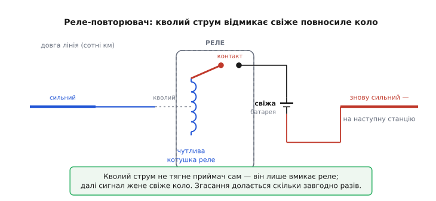

# 📜 Як телеграф породив реле — і чому цей перемикач став прабатьком підсилення й цифри

Є винаходи, що згодом виявляються набагато більшими за задачу, заради якої їх зробили. Реле — саме такий. Його змайстрували, щоб полагодити цілком приземлену неприємність: на довгому телеграфному дроті струм згасав так, що на дальньому кінці вже не міг клацнути приймач. Розв'язок виявився настільки загальним, що з нього потім виросли дві колосальні гілки техніки — підсилення сигналу й цифрова логіка. У слабкому струмі, який керує сильним колом, уже схована й ідея підсилювача, і ідея логічного вентиля. Тому варто пройти цю історію уважно: не як список дат, а як ланцюжок «що бентежило → що зробили → що з цього вийшло». І тут-таки відразу домовмося про чесність: чимало «хто перший» у цій історії спирається на спогади учасників, записані десятиліттями пізніше, а один із головних дійовців не опублікував майже нічого. Розрізнятимемо усталений факт і пізніший переказ там, де це справді важливо.

## Спершу був магніт, який можна вмикати

Щоб струм міг рухати залізо, потрібен був електромагніт — і його теж спочатку не було. До 1820-х магніт був даністю природи: брусок намагніченого заліза, який або притягує, або ні, і вимкнути його не можна. Усе змінив 1820 рік, коли данець Ганс Крістіан Ерстед (дан. Hans Christian Ørsted) випадково помітив на лекції, що дріт зі струмом відхиляє магнітну стрілку поряд. Уперше виявилося, що електрика й магнетизм — не дві окремі сили, а одна: пустив струм — народилося магнітне поле, обірвав — зникло. Це усталений факт, добре задокументований і відразу гучний на всю Європу.

З цього спостереження до керованого магніту лишався один крок, і його зробив англієць Вільям Стерджен (англ. William Sturgeon), колишній швець і солдат, що сам вивчив науку. У 1825 році він узяв зігнутий підковою залізний прут, полакував його (щоб ізолювати залізо від дроту), намотав поверх кілька витків голого мідного дроту й пустив струм. Підкова на час притягувала вантаж у кілька кілограмів — і відпускала його, щойно струм уривався. Це й був перший практичний електромагніт: магніт, яким керує вимикач.

> 🔧 **Навіщо це.** Уся механіка реле тримається саме на цій властивості: магнітне поле з'являється й зникає за командою струму. Без вмикабельного магніту Стерджена якоря нічим тягнути — реле просто не існувало б як ідея. Усе подальше — лише як зробити це тягнення сильнішим і керованішим.

Слово «полакував» тут не дрібниця, а вузол усієї подальшої історії. Ізольованого дроту тоді ще не продавали, тож Стерджен мусив ізолювати не дріт, а осердя під ним, і витки клав рідко, щоб не торкалися. Через це він не міг намотати багато витків — а саме кількість витків визначає силу магніту. Стерджен зупинився приблизно на півтора десятка вільних петель. Хто намотає більше — отримає магніт незрівнянно сильніший. Це й зробив наступний герой.

## Генрі робить магніт, що тримає тонну

Американець Джозеф Генрі (англ. Joseph Henry), шкільний учитель з Олбані (штат Нью-Йорк), узявся вдосконалити підкову Стерджена приблизно наприкінці 1820-х. Його думка була точна й проста: якщо ізолювати не осердя, а сам дріт, то витки можна класти щільно, шар на шар, тисячами — і поле зросте багатократно. Ізольованого дроту в продажу не було, тож Генрі власноруч обмотав мідний дріт шовком (за переказами — порвавши на смужки шовкову сукню дружини; цю деталь варто брати як гарну легенду, бо джерело її пізнє й непевне). Результат вражав: де Стерджен мав кілька петель, Генрі намотав сотні щільних витків — і його магніти почали тримати спершу десятки, потім сотні кілограмів, а один із пізніших — понад 900 кілограмів заліза від однієї батареї. Це усталений факт: Генрі опублікував опис свого потужного магніту в 1831 році, і саме ця публікація лишила по собі надійний слід.

Тут Генрі зробив другий, тонший крок, без якого реле не працювало б. Він розрізнив, що електрику можна «накачувати» по-різному, і будувати магніт під різну задачу:

```
магніт «на кількість» (quantity):  мало витків товстого дроту,
                                    близька потужна батарея
                                    → велика сила, але «глухий» до слабкого струму

магніт «на напругу» (intensity):    багато витків тонкого дроту,
                                    батарея з багатьох елементів
                                    → слабка сила, зате чує кволий струм
                                       навіть наприкінці довгого дроту
```

Сучасною мовою «intensity» — це радше про напругу, «quantity» — про струм; тодішня термінологія ще не розрізняла їх так чітко, як ми, тож читати ці слова треба обережно, не накладаючи на них сьогоднішнє визначення сили струму чи напруги буквально. Та суть Генрі вловив правильно: магніт із багатьма витками реагує на кволий струм, який пройшов крізь довгий опірний дріт, тоді як магніт із кількома витками такий струм просто не помічає. Одне «чує» здалеку, інше «б'є» сильно. Тримайте цю пару в голові — за хвилину вона стане реле.

## Дзвоник за півтори милі — і ідея, що з нього випливає

Близько 1831 року Генрі влаштував у своїй школі демонстрацію, яку згодом називатимуть зародком телеграфу: протягнув по класу понад милю (за різними переказами — близько 1.5 км) тонкого дроту, на дальньому кінці поставив магніт «на напругу», а біля нього підвісив залізний стрижень-молоточок навпроти дзвоника. Пускаєш струм на ближньому кінці — кволий струм, добігши крізь довжелезний дріт, усе ж намагнічує чутливий магніт, той притягує молоточок, і дзвоник на тому кінці дзвонить. Обірвав струм — молоточок відпадає. Уперше слабкий електричний поштовх з одного кінця лінії викликав механічну дію на іншому. Це усталений епізод, хоча точна дата подається з пізніших згадок і трохи плаває в джерелах.

Тепер придивімося, що Генрі тут фактично побудував, бо до реле лишився буквально один логічний поворот. У нього вже були **обидва** інгредієнти: чутливий магніт, який ловить кволий струм здалеку, і знання, як збудувати поряд інший, потужний магніт. Лишалося поставити їх разом так, щоб слабкий керував сильним.

## Народження реле: слабкий магніт перемикає сильне коло

Десь близько 1835 року (датування — за пізнішими свідченнями самого Генрі та переказами його учнів, бо він цього не патентував і докладно не публікував — тримаймо це в умі) Генрі склав демонстрацію, яку сьогодні впізнаємо як реле. Схема така: чутливий магніт «на напругу» наприкінці довгого дроту притягує не дзвоник, а маленький важілець — рухомий контакт. Цей контакт замикає й розмикає **друге, окреме коло** зі своєю потужною батареєю та магнітом «на кількість», що тримає підвішений важкий вантаж. Поки в довгому дроті йде кволий струм — чутливий магніт тримає контакт замкненим, потужне коло живе, вантаж висить. Уриваєш кволий струм на дальньому кінці — чутливий магніт відпускає контакт, потужне коло рветься, і сотні кілограрів із гуркотом падають на підлогу.

Вдумайтеся, що тут сталося. **Крихітний струм у керувальному колі розпоряджається величезною силою в окремому силовому колі.** Слабкий вхід керує сильним виходом — а вони між собою не з'єднані жодним спільним дротом, лише магнітним полем. Генрі влучно назвав це «електричним важелем»: як механічний важіль дає малою силою зрушити велике, так його пристрій дає кволому струмові розпоряджатися могутнім. Це і є реле в чистому вигляді — і водночас, якщо вдуматися, перший начерк ідеї підсилення.

> 🔧 **Навіщо це.** Саме цей крок — «слабке коло керує окремим сильним, кола розв'язані» — лишається серцем реле донині, через двісті років. Усе подальше в техніці реле (форми контактів, гасіння дуги, котушки під різну напругу) — лише обробка цієї однієї думки. А сама думка ширша за реле: тримаючи її, ви впізнаєте її потім у транзисторі, в підсилювачі, у будь-якому ключі.

Чому ж реле, а не дзвоник, став ключем до телеграфу? Бо дзвоник — це глухий кут: кволий струм віддав усе, що мав, на один удар і помер. А реле кволим струмом лише **відмикає кран** до свіжого, повносилого кола — і це повносиле коло може гнати сигнал далі скільки завгодно. Один кволий вхід породжує новий повноцінний вихід. Саме цю властивість і вхопить телеграф.

## Морзе, довга лінія й проблема згасання

Тепер на сцену виходить телеграф як практична справа — і людина, чиє ім'я з ним зрослося: американський художник Семюел Морзе (англ. Samuel F. B. Morse). Він не був ні фізиком, ні електриком; його сила була в іншому — довести систему до робочого, придатного для життя стану й пробити її у світ. Працював він не сам: фізику йому пояснював професор Леонард Гейл (англ. Leonard Gale), а механіку й тонку техніку тягнув молодий і вмілий Альфред Вейл (англ. Alfred Vail). Це важливо одразу зафіксувати, бо «телеграф Морзе» насправді — праця щонайменше трьох, плюс наукова основа Генрі. Винаходи такого штибу майже ніколи не належать одній людині.

Перед Морзе постала стіна, об яку розбивалася сама ідея телеграфу на великі відстані. Дріт має опір; що довший дріт, то слабший струм добігає до кінця. На столі, на кількох метрах, телеграф клацав бадьоро. Простягни лінію на десятки кілометрів — і струм на дальньому кінці слабшав настільки, що вже не міг ворухнути приймач. Виходило, що телеграф годиться для кімнати, а не для країни. А країні (і залізницям, і урядам) потрібні були саме сотні кілометрів.

Розв'язок підказав Гейл, який знав роботи Генрі: на лінію треба ставити те саме «електричне важеля» Генрі — реле. Поставити проміжні станції; на кожній кволий струм, що ледь добіг, живить лише чутливу котушку реле, а реле своїм контактом замикає **свіже, повносиле коло з новою батареєю**, яке жене сигнал до наступної станції. Там — знову реле, знову свіже коло, і так естафетою через усю відстань. Сигнал на лінії ніби біжить не сам, а раз у раз пересідає на свіжого коня — точнісінько як на поштовій станції (фр. *relais*) міняли стомлених коней на відпочилих. Звідси, до речі, і саме слово «реле».


*Реле як телеграфний повторювач. Кволий струм, що ледь добіг крізь довгу лінію, не тягне приймач сам — він лише живить чутливу котушку реле. Реле своїм контактом замикає свіже коло з новою батареєю, і вже воно жене повносилий сигнал на наступну ділянку. Так згасання долається не один раз, а скільки завгодно — естафетою свіжих кіл.*

Морзе вхопив цю ідею як власну ключову й вибудував на ній систему. У патенті 1840 року реле (він звав його приймальним магнітом, що керує місцевим колом) стало одним із наріжних елементів. У 1844 році лінія Вашингтон — Балтимор (близько 60 км) запрацювала наживо — і телеграф вийшов з лабораторії в життя. Те, що зробило його можливим на такій відстані, — це реле, що раз у раз відроджувало згаслий сигнал.

## Чесно про «хто перший»: переказ, патент і присяга

Тепер найделікатніше місце цієї історії — і саме тут варто бути особливо акуратним, бо легенда про «Генрі винайшов реле в 1835-му» розповідається часто й упевнено, а під нею хитка опора.

Почнімо з твердого. **Усталений факт:** Генрі справді першим побудував потужні електромагніти з багатьма витками ізольованого дроту й опублікував це в 1831 році; справді розрізнив магніти «на напругу» й «на кількість»; справді показав, як кволим струмом здалеку керувати окремим сильним колом. Його наукова основа під телеграфом — поза сумнівом.

А тепер хитке. Генрі **нічого з цього не патентував і не публікував як винахід** — він узагалі вважав, що наукові відкриття мають належати людству, а не приносити патентний зиск (так само, як його сучасник Майкл Фарадей у Англії свідомо не патентував своїх відкриттів). Через це конкретні дати його телеграфних і релейних демонстрацій ми знаємо переважно **зі спогадів — його власних і його учнів, записаних роками й десятиліттями пізніше**. А спогад, записаний через двадцять-тридцять років, — це не лабораторний журнал: дати в ньому округлюються, послідовність підрівнюється, важливість заднім числом підкреслюється. Тому «близько 1835» варто читати саме як «близько», а не як точку на осі.

Далі — гірка частина. Коли телеграф Морзе став славою й грошима, між Генрі та Морзе спалахнула затяжна сварка про першість. І ось що варто знати точно, бо це часто перекручують в обидва боки. Сам Генрі під присягою у 1857 році, даючи свідчення в патентній справі, **не претендував на винахід телеграфу як системи**. Він казав інше: що Морзе заслуговує на визнання не за первинну ідею й не за наукове відкриття, а за вміння довести телеграф до робочої, дієвої системи; а наукову основу — потужний магніт, принцип керування слабким струмом — заклав він, Генрі. Морзе ж у відповідь звинувачував Генрі мало не в привласненні. Розглянувши все, рада Смітсонівського інституту у 1857 році визнала звинувачення Морзе проти Генрі **спростованими**. Тобто історія тут не «Генрі проти Морзе — хто винайшов телеграф», а тонша: один заклав фізику й сам визнавав, що системи не будував; другий побудував систему, але хотів, щоб і фізику записали на нього.

Розкладімо по поличках, бо в цьому й увесь урок про атрибуцію винаходів:

```
ідея, що слабкий струм може керувати окремим сильним колом
   → Джозеф Генрі (наукова основа; усталено, опубліковано 1831 для магніта,
     релейна демонстрація — з пізніших переказів, дата непевна)

те саме, незалежно й під іншу мету, у Британії ~1837
   → Едвард Деві (англ. Edward Davy): «електричний відновлювач» (electric renewer),
     практичне реле make-and-break; патент 1838; покинув телеграф 1839, від'їхавши
     до Австралії, тож його внесок надовго забули
   → Вільям Кук (англ. William Cooke) і Чарльз Вітстон (англ. Charles Wheatstone):
     телеграф із магнітним керуванням, патент 1837 (інша мета — не повторювач)

телеграф як ДІЄВА СИСТЕМА з реле-повторювачем, доведена до життя
   → Семюел Морзе з Леонардом Гейлом і Альфредом Вейлом; патент 1840;
     лінія Вашингтон–Балтимор 1844
```

Висновок із цієї таблиці чесний і не на чию користь: реле «винайшли кілька разів незалежно протягом 1830-х». Так буває, коли ідея дозріла, а інгредієнти (Ерстедів зв'язок, Стердженів магніт, Генрієві витки) уже лежать у всіх на столі — тоді кілька людей у різних країнах роблять той самий крок майже одночасно. Приписувати реле одній людині чи одній країні було б спрощенням, яке історія не підтверджує. Найточніше казати так: наукову основу заклав Генрі, практичні реле-повторювачі незалежно зробили й Деві, і коло Морзе, а в робочу систему телеграфу це звів Морзе зі своїми співавторами.

## З підсилювача в логіку: друге життя реле

Поки реле тихо стукотіло на телеграфних станціях, у ньому визрівала друга, ще більша роль — і щоб її побачити, повернімося до тієї самої думки «слабке коло керує окремим сильним». Якщо вихідне коло одного реле спрямувати не на лінію, а на **котушку іншого реле**, то перше реле починає вмикати й вимикати друге. А це вже не передавання сигналу — це **керування одним пристроєм з боку іншого**. На цьому стоїть уся логіка.

Подивімося, як з реле складаються логічні дії — без жодної електроніки, самим металом і магнітом:

```
послідовно: реле A та реле B на одному шляху струму
   струм пройде, лише якщо спрацювали І A, І B          → це логічне «І» (AND)

паралельно: реле A та реле B, кожне саме може замкнути коло
   струм пройде, якщо спрацювало A АБО B (чи обидва)     → це логічне «АБО» (OR)

нормально замкнений контакт (NC): у спокої замкнено,
   спрацювання РОЗМИКАЄ                                  → це логічне «НЕ» (NOT)
```

> 🔧 **Навіщо це.** Маючи «І», «АБО» й «НЕ», можна скласти **будь-яку** логічну функцію, а отже й арифметику, пам'ять, керування — усю обчислювальну машину. Реле тут — не метафора логіки, а її фізичне втілення: замкнено = одиниця, розімкнено = нуль, контакт = вентиль. Та сама розв'язка кіл, що рятувала телеграфний сигнал, тут дозволяє вибудовувати вентилі ярусами, не пускаючи їх плутати один одного.

І на цьому реле побудували перші справжні обчислювальні машини — ще до доби ламп і транзисторів. У Німеччині інженер Конрад Цузе (нім. Konrad Zuse) завершив у 1941 році машину Z3 — першу у світі цілком дієву програмовану обчислювальну машину, зібрану приблизно на 2600 реле, що рахувала у двійковій системі (її знищило бомбардування 1944 року). У США математик Джордж Стібіц (англ. George Stibitz) у лабораторії Белла ще 1939-го зробив релейний обчислювач комплексних чисел на понад 400 реле, а Говард Айкен (англ. Howard Aiken) у Гарварді на початку 1940-х збудував велетенський Mark I, де реле теж відігравали свою роль поряд із механікою. Ці машини були повільні (реле перемикається мілісекунди, а не наносекунди) і гучні — зали стояли в безперервному стрекоті, — але вони рахували по-справжньому, і саме на них людство вперше навчилося будувати програмовані обчислення з простих двійкових перемикачів.

Реле зрештою поступилися лампі, а тоді транзистору — не тому, що принцип був хибний, а тому, що рухомий контакт надто повільний і зношуваний проти безінерційного напівпровідника. Але принцип лишився той самий, що його заклав Генрі своїм «електричним важелем»: малий сигнал на вході розпоряджається великим на виході, а перемикач «увімкнено/вимкнено» — це фізична одиниця й нуль. Транзистор просто робить те саме незрівнянно швидше й тихіше.

## Що з цього лишається в руках

Якщо стиснути всю цю історію в одну думку, вона буде така: **реле — це момент, коли слабкий сигнал уперше навчився розпоряджатися сильним, не змішуючись із ним**. Усе інше — наслідки. З цієї думки в один бік виростає підсилення (кволий вхід породжує повносилий вихід — спершу щоб відродити телеграфний сигнал, потім скрізь). У другий бік — цифрова логіка (перемикач керує перемикачем, замкнено/розімкнено стає одиницею/нулем, з вентилів складається машина). Телеграф був лише першою задачею, на якій ця думка проявилася; вона виявилася куди більшою за свою задачу.

І остання, методична нота — про те, як ми цю історію розповіли. Тверде ми називали твердим (Ерстед 1820, магніт Стерджена 1825, потужний магніт Генрі опубліковано 1831, патент Морзе 1840, лінія 1844, машина Z3 у 1941); непевне — непевним (точні дати релейних демонстрацій Генрі, що йдуть зі спогадів десятиліттями пізніше; легенда про шовкову сукню; саме слово «intensity», яке не варто читати сьогоднішнім визначенням); а суперечку про першість — не як просте «хто переміг», а як вона була насправді, аж до того, що сам Генрі під присягою не претендував на винахід системи телеграфу. Винаходи такого штибу майже завжди колективні й розмазані в часі — і реле тут зразковий приклад того, як ідея дозріває в кількох головах одразу, щойно інгредієнти лягають усім на стіл.
