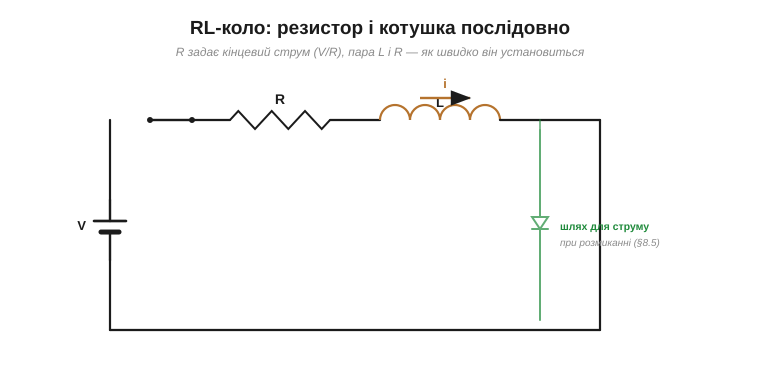
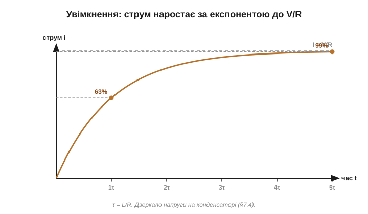
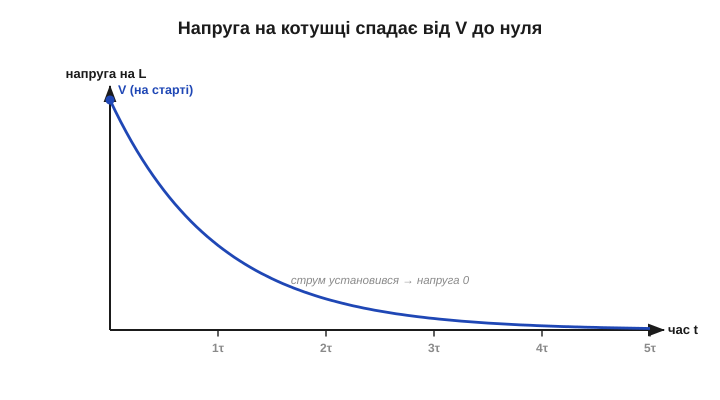

# Перехідні процеси RL: стала часу L/R

[Заряджання конденсатора](book:electronics/rc-time-constant) відбувається не миттєво, а за експонентою зі сталою часу R·C. У котушки все дзеркальне: не миттєво змінюється не напруга, а **струм**, і темп задає інша стала — **L/R**. Ця тема пояснює, чому котушка «розганяє» струм поступово, чому її не можна різко спинити й звідки береться сумнозвісний сплеск при вимиканні. Більшість потрібного апарату вже знайома: математика експоненти, правило 5τ, інтуїція «що далі від мети — то швидша зміна» переносяться з конденсатора майже без змін. Нове тут — лише дзеркальні ролі струму, напруги й резистора.

### Струм не стрибає

Головний принцип, дзеркальний до конденсатора: **струм у котушці не може змінитися миттєво**. Причина — [інерція котушки](book:electronics/inductance): миттєва зміна струму означала б нескінченне di/dt, а отже (за V = L·di/dt) нескінченну напругу, що неможливо. Тому струм крізь **ідеальну** котушку завжди наростає й спадає **плавно**, без стрибків. Це правило — прямий близнюк конденсаторного «[напруга не стрибає](book:electronics/rc-time-constant)»: обидва реактивні компоненти роблять свою величину неперервною в часі. (Точніше — неперервний саме струм *крізь саму котушку*. У реальному вузлі з його паразитними ємностями та перемиканнями струми в *гілках* можуть і різко перерозподілятися: коли ключ раптом рве коло, струм котушки миттю «перестрибує» в інший шлях — діод чи іскру, — а не зникає; це і є [сплеск при обриві](book:electronics/inductor-kickback).)


*Рис. Дзеркало конденсатора. На конденсаторі не може стрибнути **напруга** (бо i = C·dV/dt), у котушці не може стрибнути **струм** (бо V = L·di/dt). Який би різкий не був перемикач, струм котушки повзе плавно — миттєвий стрибок вимагав би нескінченної напруги.*

Ця «незмінність умить» — те саме, що інерція маси: важкий маховик не розкрутити й не спинити вмить. Звідси й уся поведінка RL-кола.

Практично це означає, що котушка **згладжує** будь-який ривок струму: різкий стрибок напруги джерела вона перетворює на плавне наростання струму, а спробу різко обірвати струм — на сплеск напруги. Скрізь, де є котушка, струм поводиться інерційно, з «розгоном» і «вибігом», а не клацає миттєво. Ця інерційність буває і дуже корисною (згладжування пульсацій, м'який старт), і небезпечною (сплеск при обриві) — залежно від того, чи дали ми струмові куди подітися.

### Увімкнення: струм наростає

Зберімо найпростіше коло: джерело, резистор R і котушка L послідовно. Замкнімо вимикач. У перший момент струм був нульовий — і він **не може** стрибнути, тож лишається близьким до нуля. Уся напруга джерела при цьому падає на котушці (вона щосили опирається наростанню струму). Та потроху струм наростає; що більший він стає, то більша частина напруги припадає на резистор і то менша лишається котушці, — тож наростання сповільнюється. Зрештою струм виходить на сталий рівень **I = V/R**, коли вся напруга вже на резисторі, а на котушці — нуль (для сталого струму [котушка поводиться як простий дріт](book:electronics/inductance)). Простежте за «передачею естафети»: на старті вся напруга на котушці, а струму нема; наприкінці вся напруга на резисторі, а струм повний. Котушка плавно «віддає» напругу резистору в міру того, як струм наростає. Це точне дзеркало конденсатора, де навпаки — напруга поступово переходила з резистора на конденсатор, поки спадав зарядний струм.


*Рис. Резистор R і котушка L послідовно з джерелом. R обмежує кінцевий струм (I = V/R), а пара L і R задає, **як швидко** він установлюється. Окремий шлях (через діод чи резистор) потрібен, щоб струм мав куди податися при розмиканні.*


*Рис. Струм у котушці при вмиканні: круто росте спочатку, далі все повільніше, асимптотично наближаючись до I = V/R. За одну сталу часу досягає 63% кінцевого, за п'ять — практично всього. Дзеркало напруги на конденсаторі.*

А що з напругою на котушці? Дзеркально до струму: на старті вона максимальна (вся напруга джерела), а в міру наростання струму спадає до нуля.


*Рис. Напруга на котушці при вмиканні: найбільша в перший момент (струм рветься змінитися найшвидше), далі спадає за тією самою експонентою до нуля, коли струм установився. Точне дзеркало струму заряджання конденсатора.*

### Стала часу τ = L/R

Темп усього процесу задає **стала часу** RL-кола:

```
τ = L / R
```

Вона теж одразу виходить у **секундах**. Перевірмо: індуктивність у генрі (В·с/А), опір в омах (В/А):

```
[L/R] = (В·с/А) / (В/А) = с   ✓
```


*Рис. Стала часу RL. Більша індуктивність L — повільніше наростання (більша інерція). Але більший R — навпаки, **швидше**! Бо τ = L/R: опір у знаменнику. Це тонке дзеркало RC, де більший R **сповільнював** заряджання (там τ = R·C).*

Тут ховається тонка, але важлива відмінність від RC. У конденсатора більший резистор **сповільнював** процес (τ = R·C росте з R). У котушки більший резистор його **пришвидшує** (τ = L/R спадає з R). Інтуїція: більший опір швидше «гасить» струм до його кінцевого рівня — щоправда, і сам цей кінцевий рівень V/R стає меншим. Тобто «швидше» тут означає швидше дійти до **нового, меншого** усталеного струму, а не швидше набрати той самий струм: якщо вам потрібне конкретне значення струму, більший R його лише зменшить (а то й зробить недосяжним), хоч і встановиться воно хутчіше. Опір у RL-колі грає роль, дзеркальну до RC.

Чому так дзеркально? У RC резистор обмежує струм, яким **заряджається** конденсатор: більший R — менший зарядний струм — повільніше заповнення. У RL же кінцевого струму котушка досягає, коли вся напруга перейде на резистор; більший R «забирає» цю напругу раніше (менший кінцевий струм досягається швидше), тож і котушка встановлюється хутчіше. Корінь дзеркальності — у тому, що в RC ми ганяємо **заряд**, а в RL «розганяємо» **струм**, і резистор стоїть у цих двох процесах по-різному.

**Приклад (стала часу RL).** Котушка L = 10 мГн послідовно з резистором R = 10 Ом:

```
τ = L / R = (10 × 10⁻³ Гн) / (10 Ом) = 0.001 с = 1 мс
```

Одна мілісекунда: за 1 мс струм набере 63% кінцевого значення, а повністю встановиться (≈ 99%) приблизно за 5 мс. Якби той самий дросель стояв із меншим опором 1 Ом, стала часу зросла б до 10 мс — процес у десять разів повільніший (зате кінцевий струм був би в десять разів більший).

На практиці стала L/R зазвичай дуже мала — мікро- чи мілісекунди, бо індуктивності невеликі, а опори чималі. Тому в звичайних колах котушка «розганяє» струм майже миттєво, і RL-затримку помічають хіба що в потужних обмотках із малим опором (електромагніти, мотори, реле) або там, де її навмисне роблять великою. Це теж дзеркало: у RC легко дістати секунди (ємності й опори бувають великими), а в RL секунди — рідкість.

### Та сама експонента: 63% і правило 5τ

Закон наростання струму — зростальна експонента до кінцевого I = V/R:

```
i(t) = (V/R) · (1 − e^(−t/τ)),   τ = L/R
```

Це той самий вигляд, що й заряджання конденсатора, тож і знайома таблиця наближення тут чинна без змін:

```
за 1·τ  →  63%        за 4·τ  →  98%
за 2·τ  →  86%        за 5·τ  →  99% ≈ «повністю»
за 3·τ  →  95%
```


*Рис. Та сама універсальна крива, що й у RC: за кожну сталу часу струм закриває 63% залишку до мети, а за **5·τ** доходить до 99% — це й беруть за «встановлено». Уся математика експоненти переноситься з RC один в один.*

Причина експоненти — теж знайома: швидкість зміни струму пропорційна тому, скільки ще лишилося до кінцевого значення (велика різниця → велика напруга на котушці → швидка зміна), тож процес самоподібний і за кожну τ долає однакову частку залишку.

> 🧮 **Математична вставка:** [диференціальне рівняння RL — розв'язок, дзеркальний до RC](math-rl-ode.md). Те саме рівняння «темп ∝ залишок» з іншими літерами: звідки строго береться τ = L/R, чому R опинився в знаменнику і повний словник перекладу RC ↔ RL.

**Приклад (коли струм досягне рівня).** За τ = 1 мс струм набере 86% кінцевого за 2 мс, 95% — за 3 мс, а «практично весь» (99%) — за 5 мс. Якщо потрібно, скажімо, 90% — це приблизно 2.3·τ ≈ 2.3 мс (той самий зворотний відлік через τ·ln, що й при [заряджанні конденсатора](book:electronics/rc-time-constant)). Таблиця читається прямо в мілісекундах, щойно відома τ = L/R.

> ⚙️ **Алгоритмічна вставка:** [вимірюємо індуктивність — за сталою часу L/R і за резонансом](proj-inductance-meter.md). Сходинка на відомий резистор і час до половини рівня дають великі L; «стук» по контуру з відомим конденсатором і лічба періодів дзвону — малі. Псевдокод, приклади й пастки від DCR до насичення.

### Вимкнення: струм спадає (і шукає шлях)

Тепер найцікавіше. Якщо в усталеному RL-колі замкнути котушку з резистором на петлю (а джерело від'єднати), струм почне спадати — теж за експонентою, з тією ж сталою L/R, віддаючи накопичену енергію поля в резистор:

```
i(t) = I₀ · e^(−t/τ)
```


*Рис. Якщо струму дати куди текти (петля з резистором), він спадає плавно за експонентою: за 1·τ лишається 37%, за 5·τ — майже нуль. Енергія поля ½·L·I² перетворюється на тепло в резисторі. Але якщо шляху НЕ дати — котушка [брикається](book:electronics/inductor-kickback).*

Числа дзеркальні до розряду конденсатора: за 1·τ лишається 37%, за 5·τ — менш як 1%. Уся [накопичена енергія поля ½·L·I²](book:electronics/inductor-energy) під час цього спаду перетворюється на тепло в резисторі — рівно як заряджений конденсатор віддавав ½·C·V² у свій розрядний резистор. Та є критичне «але». Усе це справедливо, **якщо струму є куди текти**. А коли ви просто **розриваєте** коло вимикачем, котушка опиняється без шляху для свого струму — і, обстоюючи його (струм не стрибає!), наводить скільки завгодно високу напругу, аж поки не проб'є повітря іскрою чи не спалить ключ. Це і є [«брикання» котушки](book:electronics/inductor-kickback): сплеск, який треба приборкувати.

> 🔧 **Навіщо це.** Стала L/R — це реальний годинник у багатьох вузлах. Реле спрацьовує й відпускає не миттєво, а за кілька L/R своєї обмотки, тож має відчутну затримку. Котушка запалювання навмисне накопичує струм, а потім різко його рве, щоб дати високовольтну іскру (це кероване [«брикання»](book:electronics/inductor-kickback)). А плавне наростання струму через дросель рятує живлення від кидків струму при ввімкненні. Загальне правило: хочете швидшого встановлення — більший послідовний опір (менша τ); хочете згладити різкі зміни — більша індуктивність.

### Дзеркало RC

Зведімо перехідні процеси обох компонентів поруч, поставивши RL поряд із [RC](book:electronics/rc-time-constant).


*Рис. RC: не стрибає напруга, вона наростає до V зі сталою τ = R·C; більший R — повільніше. RL: не стрибає струм, він наростає до V/R зі сталою τ = L/R; більший R — швидше. Та сама експонента, ті самі 63% і 5τ — лише напруга та струм помінялися ролями, а R грає протилежну роль.*

Ця дзеркальність — не випадковість, а наслідок глибокої [двоїстості між котушкою і конденсатором](book:electronics/inductance). Кожне твердження про RC має близнюка про RL: «напруга на конденсаторі неперервна» ↔ «струм у котушці неперервний»; «конденсатор заряджається струмом, що спадає» ↔ «у котушці наростає струм, поки спадає напруга на ній»; «за 5·τ практично готово» — однаково для обох. Засвоївши одне коло, ви фактично знаєте й друге.

**Приклад (час vs кінцевий струм).** Хочемо швидкого встановлення струму — беремо більший R (мала τ = L/R), але миримося з меншим кінцевим струмом V/R. Хочемо більшого струму — менший R, та чекаємо довше. Цей компроміс між швидкістю й рівнем — дзеркало того, як у RC більший R давав повільніше заряджання, але не міняв кінцевої напруги. Деталі завжди підказує τ = L/R.

Підсумуймо. У RL-колі **струм не стрибає**: він наростає до V/R (і спадає) за **експонентою** зі сталою часу **τ = L/R**. За одну τ долається 63% шляху, за 5·τ процес практично завершено — та сама математика, що й у RC. Тонка відмінність: більший опір тут **пришвидшує** установлення (бо R у знаменнику), а не сповільнює. Цю інерційність струму інженер використовує на свою користь — для згладжування пульсацій і м'якого старту, — а там, де вона небезпечна, мусить її приборкувати. І головне практичне попередження: якщо при вимкненні струму не дати йому шляху, котушка відповість небезпечним сплеском напруги, бо струм не може зникнути вмить. Саме цей сплеск — [«брикання» котушки](book:electronics/inductor-kickback) — і є тим, чим інерція струму найнебезпечніша, і саме його доводиться приборкувати окремими засобами.

---
