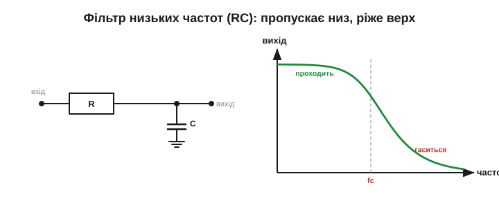
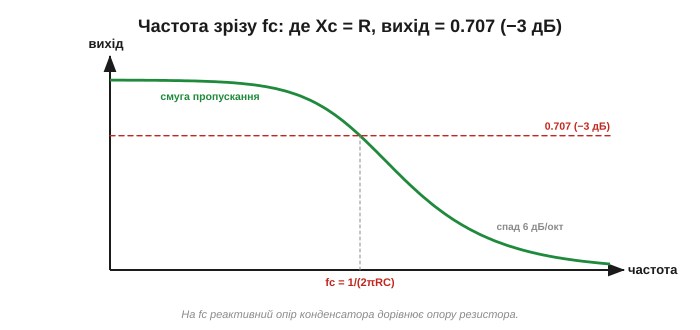
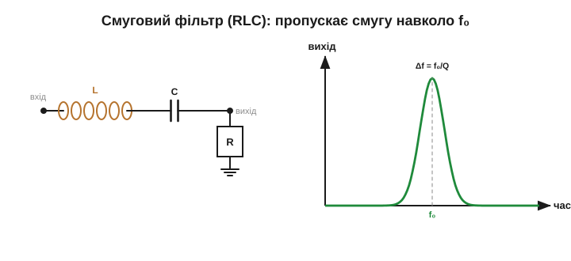
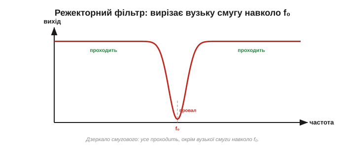
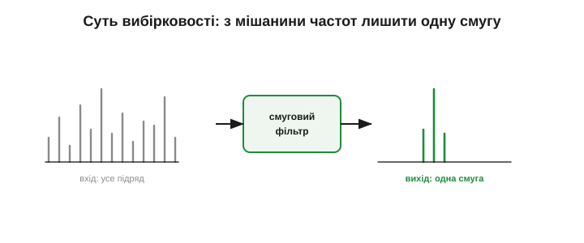

# RLC і частотна вибірковість

«Опір» конденсатора й котушки залежить від частоти: у них є частотозалежна [реактивність](book:electronics/reactance), [ємнісна](book:electronics/capacitive-reactance) спадає з частотою, [індуктивна](book:electronics/inductive-reactance) — росте; обидві ще й [зсувають фазу](book:electronics/phase-shift), а разом дають [резонанс](book:electronics/lc-resonance) із певною гостротою — [добротністю Q](book:electronics/quality-factor). Складімо все це докупи. Якщо «опір» компонента залежить від частоти, то коло з нього **по-різному пропускає різні частоти** — одні легко, інші притлумлює. Коло, що навмисне це робить, звуть **фільтром** (filter), а саму здатність — **частотною вибірковістю** (frequency selectivity). Це й є головна ідея теми: схема, яка **обирає** частоти.

### Найпростіший фільтр: лише R і C

Цікаво, що для вибірковості навіть не потрібні всі три елементи — досить резистора й конденсатора. У звичайному [дільнику напруги](book:electronics/voltage-divider) два опори ділять напругу в пропорції своїх величин. А тепер замінімо нижнє плече конденсатором. Його [реактивний опір](book:electronics/capacitive-reactance) Xc = 1/(2·π·f·C) **залежить від частоти** — отже, і коефіцієнт поділу залежатиме від частоти. Дільник перестає бути сталим: він пропускає одні частоти й тисне інші.

Поставмо резистор послідовно, а конденсатор — з виходу на землю, і знімімо вихід саме з конденсатора:

- На **низькій** частоті Xc велике (конденсатор — майже розрив): майже вся напруга лишається на ньому, вихід ≈ вхід. **Низькі частоти проходять.**
- На **високій** частоті Xc мале (конденсатор — майже коротке): він «садить» вихід на землю, напруга на ньому падає. **Високі частоти гасяться.**

Маємо **фільтр низьких частот** (ФНЧ, low-pass filter, LPF): пропускає повільне, ріже швидке.


*Резистор послідовно, конденсатор на землю, вихід — з конденсатора. На низьких частотах велике Xc віддає майже всю напругу на вихід; на високих мале Xc замикає сигнал на землю. Характеристика: рівно «полиця» внизу, потім спад угорі — це фільтр низьких частот.*

> Інтуїція: конденсатор не встигає за швидкими змінами лишатися зарядженим до повного — це та сама млявість [RC-сталої часу](book:electronics/rc-time-constant). Швидкий сигнал «розмазується» на R і не доходить до виходу.

Є й часовий погляд на той самий фільтр. Повільно заряджаючись і розряджаючись, конденсатор фактично **усереднює** сигнал — згладжує різкі стрибки, лишаючи плавну основу. Тому фільтр низьких частот і [згладжувач пульсацій](book:electronics/capacitor-uses) — це **одне й те саме** коло, побачене з двох боків: у частотній мові воно ріже верх, у часовій — усереднює. Це варто закарбувати: для **цього самого** першопорядкового RC «фільтр низьких частот» і «згладжувач пульсацій» — дві назви одного кола, залежно від того, дивитесь ви на герци чи на секунди. (З двома застереженнями: «інтегратором» це коло працює лише у відповідному режимі — для частот **набагато вищих** за зріз, де воно справді усереднює; і не всякий згладжувач узагалі є RC — пульсації гасять і LC-фільтром, і активним стабілізатором.)

### Частота зрізу

Де саме «проходить» перетворюється на «гаситься»? Там, де реактивний опір конденсатора зрівнюється з опором резистора: Xc = R. Цю межу звуть **частотою зрізу** (cutoff / corner frequency, fc):

```
Xc = R   →   fc = 1 / (2·π·R·C)
```

На цій частоті вихід падає до 0.707 від входу — тих самих **−3 дБ**, що позначають край [смуги пропускання за добротністю](book:electronics/quality-factor). Нижче fc сигнал проходить майже без втрат; вище — спадає дедалі сильніше, приблизно **вдвічі на кожне подвоєння частоти** (6 дБ/октаву). Зверніть увагу: fc = 1/(2·π·R·C) — **обернена** до [сталої часу](book:electronics/rc-time-constant) τ = R·C. Швидке коло (мала τ) має високу частоту зрізу; повільне — низьку. Той самий RC, два погляди: у часі це швидкість заряду, у частоті — межа пропускання.


*На частоті зрізу fc реактивний опір конденсатора дорівнює опору резистора, і вихід падає до 0.707 (−3 дБ) від входу. Нижче fc — смуга пропускання, вище — спад 6 дБ на октаву (удвічі на кожне подвоєння частоти).*

**Приклад. Де зріз у RC-кола з R = 1.6 кОм і C = 100 нФ?**
```
fc = 1 / (2·π·R·C)
   = 1 / (2·π · 1600 · 100·10⁻⁹)
   = 1 / (1.005·10⁻³)
   ≈ 995 Гц ≈ 1 кГц
```
Сигнали приблизно до 1 кГц пройдуть, вищі — притлумляться. Хочете зсунути межу вище — зменшіть R чи C.

Один такий RC-ступінь спадає доволі полого — 6 дБ на октаву. Якщо потрібен різкіший край (швидше відсікти небажане), ставлять кілька ланок поспіль або вводять резонанс: два каскади дають уже 12 дБ/октаву, три — 18, і так далі. Кількість таких ланок звуть **порядком** (order) фільтра. Тут і ховається інженерний компроміс: круте коліно коштує більше деталей, а надто агресивний фільтр псує форму сигналу на різких перепадах. Тому проста згладжувальна ланка часто й лишається одним RC, а гострий радіоконтур будують на резонансі з високою Q.

### Дзеркало: фільтр високих частот

Поміняймо R і C місцями (конденсатор — послідовно, вихід знімаємо з резистора) — і все перевертається. Тепер на низькій частоті велике Xc не пускає сигнал, а на високій мале Xc вільно його проводить. Виходить **фільтр високих частот** (ФВЧ, high-pass filter, HPF) із тією самою формулою зрізу. Власне, [розділовий конденсатор](book:electronics/capacitor-uses), що пропускає сигнал, але блокує постійну складову, — це і є фільтр високих частот із дуже низькою частотою зрізу: «постійка» (0 Гц) не проходить, а корисний сигнал — так.


*Поміняти R і C місцями — і характеристика перевертається: низ гаситься, верх проходить. Це фільтр високих частот. Розділовий (coupling) конденсатор — його окремий випадок: блокує постійну складову, пропускає змінний сигнал.*

### Додаємо котушку: смуговий фільтр

Поки що R і C дали нам «згори» або «знизу». Щоб вибрати **одну смугу** посередині, потрібен резонанс — а отже, котушка. У послідовному [LC-контурі](book:electronics/lc-resonance) на резонансній частоті f₀ реактивності L і C гасять одна одну, і повний опір контуру падає до мінімуму (лишається тільки R). Тобто **саме частота f₀ проходить найлегше**, а сусідні — гірше, бо для них лишається непогашена реактивність. Це **смуговий фільтр** (band-pass filter, BPF): пропускає вузьку смугу навколо f₀ й тисне решту.

А наскільки вузьку? Рівно настільки, як каже [добротність](book:electronics/quality-factor): ширина смуги Δf = f₀/Q. Висока Q — гострий фільтр, що виділяє одну станцію; низька — широкий, що пропускає цілий діапазон. **Це і є радіоприймач**: змінним конденсатором рухаємо f₀ по діапазону, а Q задає, наскільки чисто відділяється сусідня станція.

**Приклад. Яку смугу пропустить контур на f₀ = 1 МГц із Q = 100?**
```
Δf = f₀ / Q
   = 1 000 000 / 100
   = 10 000 Гц = 10 кГц
```
Якраз ширина AM-**каналу** (~10 кГц рознесення; самого аудіо там близько 5 кГц через дві бічні смуги): фільтр пропустить цілу станцію й відітне сусідні за 10 кГц. Підняли б Q удесятеро — смуга звузилася б до 1 кГц: сусіди відділялися б краще, та краї сигналу вже обрізалися б. Знову той самий компроміс вибірковість↔смуга — лише тепер ми бачимо його як ширину **пропускання фільтра**.


*Послідовний RLC на резонансі має мінімальний опір — тож смуга навколо f₀ проходить, а решта гаситься непогашеною реактивністю. Ширина смуги Δf = f₀/Q. Це фізика радіонастройки: f₀ задають L і C, гостроту — Q.*

> 🔧 **Навіщо це.** Смуговий фільтр — серце будь-якого приймача: радіо, Wi-Fi, мобільного. Антена ловить тисячі сигналів одночасно; смуговий контур пропускає лише потрібну смугу, відкидаючи решту, перш ніж сигнал піде на підсилення. Без частотної вибірковості радіозв'язку просто не існувало б — усі станції злилися б у суцільний шум.

### Навпаки: режекторний фільтр

Іноді треба не вибрати частоту, а **викинути** її. Поставмо резонансний контур так, щоб саме на f₀ він замикав сигнал на землю (або, навпаки, ставив максимальний опір на шляху сигналу). Тоді одна вузька смуга провалюється, а решта проходить. Це **режекторний фільтр** (band-stop / notch filter). Класичне застосування — прибрати фон мережі 50 Гц із чутливого підсилювача або забити одну заважальну несучу, не чіпаючи решти спектра. Глибина й вузькість провалу теж залежать від Q: висока Q дає глибокий, але тонкий «зуб», що вирізає рівно одну частоту, майже не торкаючись сусідніх. Тому режектор на 50 Гц можна зробити таким вузьким, що корисний звук поряд лишиться недоторканим.


*Режекторний (notch) фільтр — дзеркало смугового: усе проходить, окрім вузької смуги навколо f₀, яка провалюється. Так вирізають одну заважальну частоту (наприклад, фон 50 Гц), не чіпаючи корисний сигнал.*

### Чотири типи — одна ідея

Отже, чотири базові фільтри — це чотири форми того, як коефіцієнт передачі залежить від частоти: ФНЧ (пропускає низ), ФВЧ (пропускає верх), смуговий (пропускає середину), режекторний (вирізає середину). Усі вони — лише різні комбінації того самого: частотозалежних реактивностей C і L та резистора, що задає затухання й гостроту коліна.


*Чотири базові частотні характеристики. Низькочастотний і високочастотний відсікають половину спектра; смуговий і режекторний працюють навколо f₀ — один пропускає смугу, інший вирізає. Усе це — гра тих самих Xc, XL та R.*

> Що задає різкість «коліна»? Для простого RC — **порядок** фільтра (число полюсів): один RC дає пологий спад 6 дБ/октаву, два каскади — 12, і так далі. А **Q** окремо керує піком і демпфуванням у **резонансних** (другого порядку) ланках — для одного RC поняття Q взагалі не визначене. Тому край роблять різкішим двома способами: нарощують порядок (більше RC-ланок) або вводять резонанс, де високе Q дає гострий пік на коліні. Але надто гострий фільтр (висока Q) ризикує обрізати корисну смугу й «дзвеніти» на перехідних — той самий компроміс вибірковість↔смуга, що його задає [добротність](book:electronics/quality-factor).

### Частотна вибірковість — велика ідея

Здатність кола **обирати частоти** — усюди:

- **Радіо** — смуговий контур виділяє одну станцію з ефіру.
- **Звук** — регулятори тембру (бас/високі), кросовери в колонках, що шлють низькі частоти на динамік-бас, а високі — на твітер.
- **Живлення** — [згладжування пульсацій](book:electronics/capacitor-uses) — це фільтр низьких частот: пропускає постійку, тисне змінну «брижу»; а фільтри завад (EMI) ріжуть високочастотний шум, не пускаючи його в мережу й з мережі.
- **Вимірювання й зв'язок** — виділити корисний сигнал із шуму, розкласти багатоканальну лінію на окремі смуги.

Усі ці фільтри зібрані з пасивних деталей — R, L, C. Ту саму вибірковість роблять і «активно», з [підсилювачами](book:electronics/ideal-opamp): тоді можна обійтися без громіздких котушок і отримати кращу форму характеристики. А в цифровій техніці фільтр узагалі стає **програмою**, що рахує над відліками сигналу. Та хоч би як його втілили — пасивно, активно чи в коді, — у основі лежить та сама ідея цього розділу: різні частоти зустрічають різний «опір».


*Суть вибірковості: на вхід — мішанина частот (багато станцій, шум, завади), фільтр пропускає лише потрібну смугу. Той самий принцип — у радіо, кросовері колонок, згладжувачі живлення й фільтрі завад.*

> 🔧 **Навіщо це.** Сама ідея «розкласти все за частотами й працювати з кожною окремо» — фундамент техніки зв'язку. Перші **хвильові фільтри** в Bell System створив **Джордж Кемпбелл** (працював над ними з початку 1910-х, патент подав 1915-го, видали 1917-го) — саме щоб «упакувати» багато телефонних розмов в один дріт, рознісши їх по частотах. Трохи згодом **Отто Цобель** розвинув теорію складених фільтрів (класична праця — 1923 р.), додавши гнучкіші узгоджені ланки. Тобто Кемпбелл заклав, а Цобель розвинув — не одночасно. Та сама думка сьогодні дає тисячі каналів в одному оптоволокні й десятки мереж Wi-Fi в одній кімнаті — кожна на своїй смузі.

Резистор, конденсатор і котушка вміють зберігати, ділити, зсувати фази й обирати частоти — і саморобними словами «передає стільки-то», «глушить удесятеро» цю гру частот уже видно цілком. Професійну мову, якою підписано кожен графік у даташиті — [частотні характеристики, децибели й діаграму Боде](book:electronics/frequency-response) — будують поверх рівно цієї картини.
