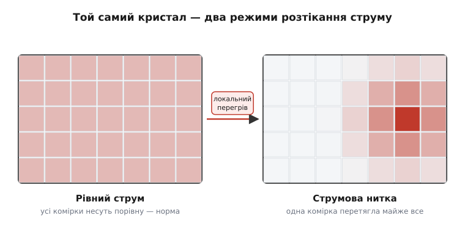
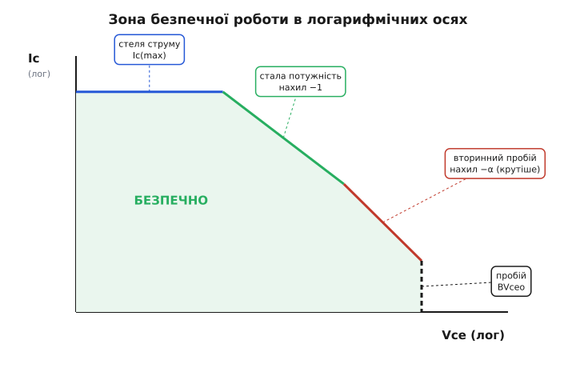

# Зона безпечної роботи (SOA) і вторинний пробій

Розкрийте даташит будь-якого потужного транзистора — і серед звичних чисел («струм не більше», «напруга не більше», «потужність не більше») ви натрапите на графік, який бентежить новачка. По одній осі — напруга колектор–емітер Vce, по другій — струм колектора Ic, обидві в логарифмічному масштабі, а всередині — крива химерної форми: ламана лінія, що оточує дозволену область. Звуть її **зоною безпечної роботи** (англ. *safe operating area*, SOA — «зона безпечної роботи»). І перше питання, яке вона ставить: чому межа не прямокутна?

Адже здавалося б, усе просто: не перевищуй максимальний струм, не перевищуй максимальну напругу, не перевищуй максимальну потужність — і живи спокійно. Три числа, три прямі обмеження. Але графік каже інше. У ньому є ділянка, де транзистор гине **раніше**, ніж досягне будь-якої з цих трьох межі окремо: і струм у нормі, і напруга в нормі, і добуток-потужність у нормі — а прилад уже мертвий. Ця ділянка існує через окремий, особливо підступний механізм загибелі — **вторинний пробій** (англ. *second breakdown*). Зрозуміти SOA — означає зрозуміти, звідки на графіку береться той зрізаний по діагоналі кут і чому його не можна переступати навіть на мить.

## Чотири стіни безпечної області

Почнімо з того, що було б, якби існували лише «очевидні» обмеження. Уявіть осі: вгору — струм Ic, праворуч — напруга Vce. Кожне просте обмеження — це одна стіна на цьому полі.

**Стеля за струмом.** Крізь дроти всередині корпусу й самі провідники кристала можна пустити лише певний струм — більший їх просто перепалить, як запобіжник. Це горизонтальна стеля: Ic не вище за Ic(max), хай яка напруга.

**Стіна за напругою.** Якщо підняти Vce надто високо, зворотно зміщений перехід колектора лавинно пробивається — як іскра в надто сильному полі. Це вертикальна стіна праворуч: Vce не більше за напругу пробою (її позначають BVceo — напруга пробою колектор–емітер при відкритій базі). За нею прилад втрачає здатність тримати напругу.

**Похила межа за потужністю.** Між цими двома стінами лежить третє обмеження, і воно вже не пряме й не горизонтальне, а **похиле**. Транзистор розсіює потужність P = Ic·Vce — і вся вона перетворюється на тепло в кристалі. Якщо тепловідвід дозволяє безпечно скинути, скажімо, 50 Вт, то дозволені всі точки, де добуток Ic·Vce не перевищує 50: чи то 5 А при 10 В, чи то 1 А при 50 В, чи то 50 А при 1 В. Усі ці точки лежать на одній кривій сталої потужності — гіперболі Ic = P(max)/Vce. У звичайних осях це дуга; а ось чому в логарифмічних вона стає **прямою з нахилом униз** — окрема гарна деталь, до якої ми ще повернемось.

> 🔧 **Навіщо це.** Логарифмічні осі на графіку SOA — не примха креслярів. Потужні транзистори працюють у діапазоні струмів і напруг, що тягнеться на кілька **порядків**: від міліампер до десятків ампер, від часток вольта до сотень вольт. На звичайній лінійній сітці нижній край діапазону зім'явся б у непомітну смужку біля нуля. Логарифм розтягує кожну декаду однаково, тож і слабкі, і потужні режими видно з однаковою чіткістю — а заразом усі обмеження за потужністю стають рівними прямими, які легко проводити й читати.

Якби на цьому історія кінчалася, безпечна область була б простим прямокутником зі зрізаним по гіперболі кутом — три стіни плюс одна похила «стеля потужності». Багато слабких сигнальних транзисторів саме так і поводяться: їхня SOA — це просто «струм, напруга, потужність», і нічого більше. Але з потужними приладами при великій напрузі коїться щось іще — і саме воно вирізає в куті ту додаткову, найнебезпечнішу зону.

## Вторинний пробій: коли струм збирається в нитку

Ось вузол усієї теми. При **великій напрузі** Vce на графіку з'являється ще одна межа — крутіша за лінію потужності, що зрізає правий нижній кут і не дає підняти струм навіть туди, де за потужністю ще нібито можна. Ця межа — слід **вторинного пробою**, і його природа геть інша, ніж у звичайного перегріву.

Щоб зрозуміти його, згадаймо, що потужний транзистор — це не один прилад, а **безліч крихітних транзисторів, увімкнених паралельно** на спільному кристалі, аби разом нести великий струм. У ідеалі струм розтікався б між ними порівну. Але кристал ніколи не буває ідеально однорідним: десь домішок трохи більше, десь тепловідвід трохи гірший, десь край комірки гарячіший за середину. І ось у чому пастка: **гарячіша ділянка напівпровідника проводить охочіше**. Нагрітий перехід відкривається за меншої напруги, тож при спільній для всіх комірок напрузі бази найгарячіша з них перетягує на себе **більший** струм. Більший струм у ній — ще сильніший локальний нагрів — ще охочіше вона проводить — ще більше струму збирається саме в ній.

Це петля додатного зворотного зв'язку, але цього разу не в масштабі всього приладу, а **всередині** кристала: струм, замість розтікатися рівно, стягується у вузьку розжарену **нитку** (англ. *current filament*, струмову нитку). Інженери звуть це перетягуванням струму (англ. *current hogging*, «загарбання» струму). У тій нитці густина струму й температура злітають так, що локально кремній переходить у власну провідність, опір падає, струм у нитці зростає ще різкіше — і за частки мікросекунди в точці утворюється проплавлений канал, що замикає колектор на емітер. Транзистор гине миттєво й безповоротно.


*Чому однорідний на вигляд кристал гине в точці. Ліворуч струм розтікається рівно між паралельними комірками — нормальний режим. Праворуч одна комірка виявилась трохи гарячішою, перетягла більше струму, від того нагрілась іще дужче й стягнула майже весь струм у себе — утворилась струмова нитка. Середня температура кристала при цьому ще цілком безпечна, а локальна точка вже плавиться.*

Назву «вторинний» цей пробій дістав на противагу «первинному» — звичайному лавинному пробою за напругою (тій вертикальній стіні справа). Хронологічно на характеристиці спершу настає лавинний (первинний) пробій, а вже за ним, при дальшому зростанні струму, характеристика різко «провалюється» в другий, руйнівний режим — звідси й «другий», вторинний. Уперше цей особливий високострумовий режим спостерегли [1958 року, і кілька років пішло, доки зрозуміли його теплову природу](book:electronics/safe-operating-area/hist-second-breakdown.md).

> 🔧 **Навіщо це.** Запам'ятати треба одне: вторинний пробій — це не «занадто гаряче в середньому», а **концентрація струму в точці**. Тому жоден термодатчик на корпусі вас не врятує — він міряє середню температуру кристала, а гине той мікроскопічний острівець, що вже розплавився, поки термометр показує безпечні 60 °C. І саме тому вторинний пробій вимагає **окремої** межі на графіку: контроль самої лише потужності його не ловить.

Чому ж ця небезпека загострюється саме при **великій Vce**? Бо висока напруга на колекторі робить петлю перетягування набагато злішою. По-перше, при великій напрузі та сама добавка струму в нитку дає набагато більше локального тепла (потужність — це струм, **помножений** на напругу). По-друге, у сильному полі високої напруги вмикаються додаткові механізми народження носіїв (ударна іонізація біля колектора), які самі по собі стягують струм у пляму. Тому при низькій Vce комірки вирівнюються й живуть дружно, а при високій Vce навіть **короткий імпульс** струму здатен зірвати прилад у нитку. Через це межа вторинного пробою — крутіша за лінію потужності: вона забирає струм тим агресивніше, чим вища напруга.

## Чому межа потужності — пряма, а вторинного пробою — крутіша

Тепер можна зрозуміти геометрію графіка повністю — і вона на диво проста, щойно перейти на логарифмічні осі.

Візьмімо межу сталої потужності Ic·Vce = P. Прологарифмуймо обидва боки:

```
Ic · Vce = P
log Ic + log Vce = log P
log Ic = log P − log Vce
```

В осях, де по горизонталі відкладено log Vce, а по вертикалі log Ic, останній рядок — це рівняння **прямої з нахилом −1**: підняв напругу вдесятеро (на одну декаду праворуч) — мусиш опустити струм рівно вдесятеро (на одну декаду вниз). Ось чому гіпербола сталої потужності на лог-осях розпрямляється в акуратну пряму під одним і тим самим кутом. Зручність повна: будь-яку лінію сталої потужності можна провести однією лінійкою під нахилом −1.

А межа вторинного пробою описується схожим законом, тільки напруга в ньому стоїть у **вищому** степені: Ic·Vce^α = const, де показник α більший за одиницю (для типових кремнієвих BJT — десь від 1.5 до 4). Логарифм дає:

```
Ic · Vce^α = const
log Ic = const − α · log Vce
```

Це знову пряма — але з нахилом **−α**, тобто **крутішим** за −1. Геометрично це означає: лінія вторинного пробою спадає швидше за лінію потужності й при достатньо великій напрузі неминуче **опускається нижче** за неї, зрізаючи правий нижній кут безпечної області. Ось та сама діагональна «фаска», що бентежила на початку: вона є рівно там, де вторинний пробій починає обмежувати сильніше, ніж потужність.


*Зона безпечної роботи в логарифмічних осях. Зверху — горизонтальна стеля струму; ліворуч за малих напруг тримає похила лінія сталої потужності (нахил −1); далі праворуч її перехоплює крутіша лінія вторинного пробою (нахил −α), що зрізає кут; крайня права вертикаль — лавинний пробій за напругою BVceo. Безпечно лише всередині цього багатокутника. Сигнальні транзистори лінії вторинного пробою не мають — у них кут лишається повним.*

Зведімо всі чотири межі в одну картину. Зона безпечної роботи — це багатокутник, обмежений:

```
зверху      — стеля струму:        Ic = Ic(max)            (горизонталь)
зліва-вгору — стала потужність:    Ic = P(max) / Vce       (нахил −1)
справа-вниз — вторинний пробій:    Ic = const / Vce^α      (нахил −α, крутіше)
справа      — пробій за напругою:  Vce = BVceo             (вертикаль)
```

Чотири різні фізичні причини загибелі — перепал провідника, перегрів кристала, стягування струму в нитку, лавина в полі — кожна окреслює свою стіну, а разом вони замикають дозволену область. Жодну зі стін не можна переступити, але найпідступніша саме третя: до решти інтуїція звикла, а вторинний пробій вбиває там, де «за числами» ще був запас.

## Імпульсний режим: чому короткому сплеску дозволено більше

На графіку SOA рідко буває одна крива. Зазвичай їх кілька, підписаних різним часом: «DC» (постійний режим) і поряд «10 мс», «1 мс», «100 мкс» — і що коротший імпульс, то **вище** й **ширше** проходить його межа. Чому транзистору дозволено короткочасно набагато більше, ніж тривало?

Відповідь — у тепловій інерції кристала. Тепло не виникає й не зникає миттєво: щоб нагрітися, кристалу й корпусу потрібен час, бо вони мають теплоємність — здатність поглинати тепло, лише поступово підвищуючи температуру. Якщо ви подали велику потужність **на коротку мить**, температура переходу просто не встигає піднятися до небезпечної: сплеск тепла «розмазується» по тепловій масі приладу й розсмоктується пізніше. Тому межа за потужністю для коротких імпульсів лежить набагато вище — кристал переживе короткий перегрів, який у тривалому режимі його б убив.

> 🔧 **Навіщо це.** Цим живуть цілі класи схем. Підсилювач класу B віддає пікову потужність лише на вершинах звукового сигналу — частки секунди; ключ, що заряджає велику ємність, бачить кидок струму лише в перші мілісекунди. Якби ці прилади доводилося обирати за **постійним** режимом на найгірший миттєвий сплеск, вони були б утричі більші й дорожчі. Імпульсні криві SOA дозволяють чесно врахувати, що пік короткий, — і взяти менший, дешевший транзистор, не виходячи за межу.

Але тут чигає пастка, про яку забувають найчастіше. Інерція рятує **тільки** від теплової межі — від перегріву, що накопичується. А вторинний пробій від часу майже не залежить: струмова нитка стягується за частки мікросекунди, тепловій масі кристала нема як цьому завадити. Тому на більшості графіків SOA імпульсні криві піднімають межу потужності, але **діагональ вторинного пробою лишається майже на місці** — її зрізаний кут переслідує вас навіть на найкоротшому імпульсі. Подаси короткий, але потужний сплеск при високій напрузі — і прилад загине у вторинному пробої, хоча за тепловою кривою для цього часу він ніби витримав би.

```
       Ic
        │  ── стеля струму ──
        │ ╲
        │  ╲←─ 100 мкс  (потужність — найвища межа)
        │   ╲╲
        │    ╲ ╲←─ 1 мс
        │     ╲  ╲
        │      ╲   ╲←─ DC (постійно — найнижча)
        │       ╲    ╲
        │        ╲╳╳╳╳╳  ← діагональ вторинного пробою:
        │        ╲ ╳╳╳╳    майже НЕ піднімається з імпульсом
        └──────────────────── Vce
```
*Сімейство кривих SOA для різної тривалості. Теплова межа (нахил −1) тим вища, чим коротший імпульс, — кристал не встигає прогрітися. А межа вторинного пробою (заштрихована, праворуч-внизу) майже спільна для всіх тривалостей: концентрацію струму інерція не гасить.*

## А як у польових транзисторів

Може скластися враження, що вторинний пробій — вада суто біполярних приладів, а MOSFET від нього вільний. Це **наполовину** правда, і плутати тут небезпечно.

У звичайному ключовому режимі (повністю відкритий або повністю закритий) польовий транзистор справді поводиться інакше й набагато безпечніше. Причина елегантна: у MOSFET опір відкритого каналу з нагрівом **зростає**, а отже, гарячіша комірка проводить **гірше**, а не краще. Це робить зворотний зв'язок усередині кристала **від'ємним**: ділянка, що перетягла зайвий струм і нагрілась, сама себе осаджує й віддає струм сусідам. Паралельні комірки вирівнюються автоматично, без зовнішніх хитрощів — тому в ключових застосуваннях у MOSFET немає класичного вторинного пробою, і його SOA в цій ролі — майже повний прямокутник.

Але — і це критично — у **лінійному** режимі, коли транзистор тримають напіввідкритим (велика напруга на стоці **й** помітний струм одночасно: лінійні стабілізатори, активні навантаження, повільні «м'які» вмикачі живлення), сучасний MOSFET має **власну** зону теплової нестійкості. Біля порога відкривання конкурує два протилежні ефекти: поріг із нагрівом падає (це **штовхає** струм угору, як у біполярного), а опір каналу з нагрівом росте (це **тримає** струм). При малих струмах перемагає перший — і гаряча комірка знову перетягує струм, стягуючи його в нитку. Тому в даташитах сучасних потужних MOSFET теж малюють SOA зі зрізаним кутом, а в графі тривалого лінійного режиму прямо позначають «зону теплової нестійкості», куди заходити не можна.

> 🔧 **Навіщо це.** Звідси випливає поширена й дорога помилка. Інженер бачить, що MOSFET «не має вторинного пробою», бере його за лінійний регулятор чи плавний вмикач живлення — і прилад несподівано гине, хоча за струмом, напругою й потужністю «все в межах». Розгадка в тому, що ключова стійкість MOSFET **не переноситься** на лінійний режим. Для лінійних застосувань треба читати саме лінійну ділянку SOA (часто окрему криву для постійного струму) і обирати прилад, спеціально на це розрахований, — або повертатися до біполярного з баластними резисторами.

## Як читати й застосовувати SOA на практиці

Зберімо все докупи в робочий порядок дій. SOA — не теоретична прикраса, а інструмент вибору: вона прямо каже, виживе обраний транзистор у вашій схемі чи ні.

**Крок перший — знайдіть свою робочу точку.** Визначте найбільшу напругу Vce й найбільший струм Ic, що збігаються **одночасно** в найгіршому режимі схеми. Саме одночасність вирішальна: пара «велика напруга + великий струм водночас» небезпечна, навіть якщо порізно кожне значення скромне. Поставте цю точку (Vce; Ic) на графік.

**Крок другий — врахуйте тривалість.** Якщо ваш найгірший режим — короткий імпульс (пік сигналу, кидок заряду ємності), берете відповідну імпульсну криву; якщо навантаження тривале — лише криву DC. Не піддавайтеся спокусі скористатися імпульсною кривою для постійного режиму: для тривалого струму чинна **тільки** найнижча, постійна межа.

**Крок третій — лишіть запас і охолоджуйте.** Усі криві в даташиті нарисовані для якоїсь опорної температури корпусу (часто 25 °C). У реальній схемі корпус гарячіший — отже, дозволену потужність треба **знизити** (це називають derating, [зниження допустимого навантаження за температурою](book:electronics/power-derating)): чим гарячіший корпус, тим нижче сповзає теплова частина SOA. Тому добрий радіатор не просто «приємний додаток» — він фізично **піднімає** доступну вам частину зони. Точку розташовуйте з ясним запасом до межі, а не впритул.

**Окремо пильнуйте діагональ.** Якщо ваша робоча точка лежить у правій частині — велика напруга при помітному струмі, — це царина вторинного пробою. Тут не покладайтеся ні на середню потужність, ні на тепловий запас: межу вторинного пробою треба шанувати окремо, бо вона вбиває швидко й мовчки.

Порахуймо типову перевірку на числах, щоб порядок дій став відчутним.

**Умова.** Лінійний регулятор на потужному біполярному транзисторі скидає різницю напруг: на вході 40 В, на виході 12 В, через прохідний транзистор тече струм навантаження 1.5 А. Даташит дає при температурі корпусу 25 °C: Ic(max) = 8 А, теплова межа Pmax = 60 Вт, а лінія вторинного пробою при Vce = 28 В проходить на рівні струму 1.2 А. Корпус транзистора в роботі гріється до 80 °C, і виробник вимагає знижувати потужність на 0.5 Вт на кожен градус понад 25 °C. Чи виживе прилад?

:::tabs
```c
// Перевірка робочої точки лінійного регулятора на вписування в SOA.
// Усі три межі — струм, теплова потужність (з derating), вторинний пробій —
// мусять виконуватися ОДНОЧАСНО.
#include <stdio.h>

int main(void) {
    // 1. Робоча точка: напруга на транзисторі = вхід − вихід, струм навантаження.
    float Vce = 40.0f - 12.0f;        // = 28 В падає на прохідному транзисторі
    float Ic  = 1.5f;                 // А — тече весь струм навантаження
    float P   = Vce * Ic;             // = 42 Вт реально розсіюється

    // 2. Теплова межа з поправкою на гарячий корпус (derating).
    float Pmax25  = 60.0f;            // Вт при корпусі 25 °C
    float dP_dT   = 0.5f;             // Вт/°C — наскільки знижувати за градус
    float Tcase   = 80.0f;            // реальна температура корпусу, °C
    float Pmax    = Pmax25 - dP_dT * (Tcase - 25.0f); // = 60 − 27.5 = 32.5 Вт

    // 3. Межа вторинного пробою в цій точці (з даташита для Vce = 28 В).
    float Ic_sb   = 1.2f;             // А — максимум за вторинним пробоєм при 28 В

    printf("Робоча точка: Vce=%.0f В, Ic=%.1f А, P=%.0f Вт\n", Vce, Ic, P);
    printf("Теплова межа з derating: %.1f Вт  -> %s\n", Pmax,
           (P <= Pmax) ? "OK" : "ПЕРЕВИЩЕНО");
    printf("Межа вторинного пробою: %.1f А  -> %s\n", Ic_sb,
           (Ic <= Ic_sb) ? "OK" : "ПЕРЕВИЩЕНО");
    return 0;
}
```
```python
# Перевірка робочої точки лінійного регулятора на вписування в SOA.
# Усі три межі — струм, теплова потужність (з derating), вторинний пробій —
# мусять виконуватися ОДНОЧАСНО.

# 1. Робоча точка: напруга на транзисторі = вхід − вихід, струм навантаження.
Vce = 40.0 - 12.0        # = 28 В падає на прохідному транзисторі
Ic  = 1.5                # А — тече весь струм навантаження
P   = Vce * Ic           # = 42 Вт реально розсіюється

# 2. Теплова межа з поправкою на гарячий корпус (derating).
Pmax25 = 60.0            # Вт при корпусі 25 °C
dP_dT  = 0.5             # Вт/°C — наскільки знижувати за градус
Tcase  = 80.0           # реальна температура корпусу, °C
Pmax   = Pmax25 - dP_dT * (Tcase - 25.0)  # = 60 − 27.5 = 32.5 Вт

# 3. Межа вторинного пробою в цій точці (з даташита для Vce = 28 В).
Ic_sb  = 1.2            # А — максимум за вторинним пробоєм при 28 В

print(f"Робоча точка: Vce={Vce:.0f} В, Ic={Ic:.1f} А, P={P:.0f} Вт")
print(f"Теплова межа з derating: {Pmax:.1f} Вт  -> "
      f"{'OK' if P <= Pmax else 'ПЕРЕВИЩЕНО'}")
print(f"Межа вторинного пробою: {Ic_sb:.1f} А  -> "
      f"{'OK' if Ic <= Ic_sb else 'ПЕРЕВИЩЕНО'}")
```
:::

Простежмо результат по суті:

```
Робоча точка:  Vce = 28 В,  Ic = 1.5 А,  P = 42 Вт

Стеля струму:        1.5 А проти 8 А          → запас величезний, OK
Теплова межа:        42 Вт проти 32.5 Вт      → ВЖЕ ПЕРЕВИЩЕНО (гарячий корпус!)
Вторинний пробій:    1.5 А проти 1.2 А при 28 В → ПЕРЕВИЩЕНО теж
```

Висновок промовистий. За струмом запас восьмикратний — «очевидне» обмеження спокійнісінько пройдене. Та коли врахувати гарячий корпус, теплова межа просіла з 60 до 32.5 Вт, а реальні 42 Вт її пробивають. І навіть якби тепловідвід був ідеальний, точка все одно за межею **вторинного пробою**: 1.5 А при 28 В лежить правіше від діагоналі, де дозволено лише 1.2 А. Прилад приречений одразу за двома незалежними причинами — хоча наївна перевірка «струм у нормі» цього не побачила. Рятунок: або взяти потужніший транзистор із вищою діагоналлю SOA, або зменшити Vce (поставити перед регулятором проміжний ступінь, щоб падало менше за раз), або взагалі піти від лінійного скидання до імпульсного перетворення, де транзистор працює ключем — у безпечних кутах SOA, а не в спопеляючій середині.

Ось чому зона безпечної роботи — головний графік у даташиті силового приладу. Її ламана форма — це чесна мапа чотирьох різних смертей, і найважливіша наука в ній така: **сам лише добуток напруги на струм не гарантує виживання.** Велика напруга при помітному струмі заводить транзистор у царину вторинного пробою, де він стягує струм у розжарену нитку й гине в точці швидше, ніж устигне нагрітися весь кристал. Хто читає SOA цілком — з її діагоналлю, з поправкою на гарячий корпус, з різницею між імпульсом і постійним режимом, — той обирає прилад, що працює роками. Хто дивиться лише на три «очевидні» числа — рано чи пізно дістає почорнілий кристал, який «за розрахунком мав жити».
