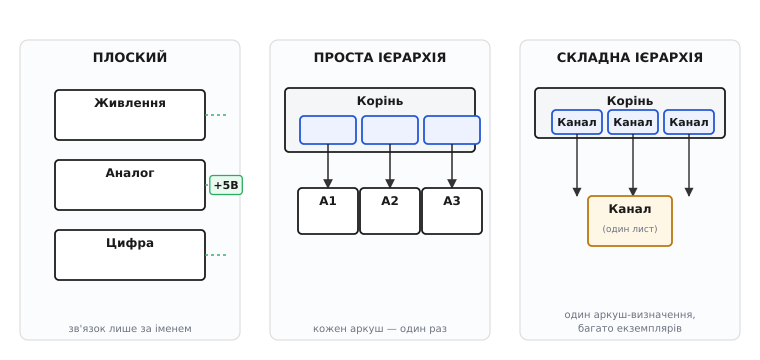
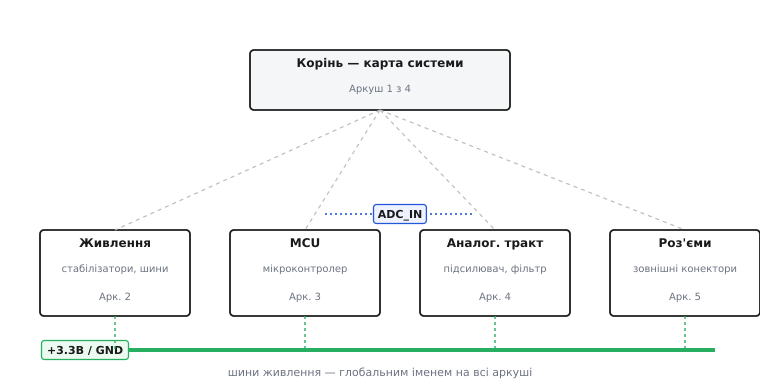

# Ієрархічні та багатоаркушні схеми

Будь-який реальний пристрій — це не один аркуш зі схемою, а **набір аркушів**. Плата з мікроконтролером, живленням, аналоговим трактом і десятком роз'ємів просто не вміщається на одну читабельну сторінку: вийде павутина, де ні автор, ні рецензент за тиждень не розбереться. Тож велику [принципову схему](topic:electronics/schematic-purpose) **розкладають по аркушах** — і питання не в тому, *чи* розкладати, а *за яким устроєм* і *як зшити сигнали* між сторінками так, щоб набір лишився єдиним кресленням, а не купою непов'язаних картинок.

Тут плутають дві різні речі. «Багатоаркушна» схема — це просто про те, що сторінок кілька. «Ієрархічна» — це про те, що між сторінками є **підпорядкування**: верхній аркуш показує систему блоками, а кожен блок ховає окремий аркуш із деталями. Багатоаркушна схема **може** бути ієрархічною, а може бути плоскою; ієрархія — це один зі способів зробити її багатоаркушною, причому не єдиний. Розберімо від першопричини: які бувають устрої набору аркушів, як реальний пристрій ділять на сторінки, що тримає набір купи (нумерація, кутовий штамп, посилання між аркушами) і як одне коло лишається собою, хоч намальоване на десяти сторінках.


*Три способи зробити схему багатоаркушною. **Плоский**: рівні аркуші, зв'язані лише спільними іменами ланцюгів. **Проста ієрархія**: дерево, де кожен аркуш-блок ужито рівно раз. **Складна ієрархія**: один аркуш-визначення поставлено кількома екземплярами. Усі три на платі дають однакове коло.*

## Три устрої набору аркушів

Коли редактор схем питає «додати аркуш», за цим стоїть вибір одного з трьох устроїв — і їх варто бачити чітко, бо плутанина тут породжує більшість безладу у великих проєктах. Класифікація, яку зручно тримати в голові, така сама, як її формулюють самі редактори (зокрема [KiCad](https://docs.kicad.org/) ділить багатоаркушні схеми саме на ці три типи).

**Плоский набір** (англ. *flat*) — аркуші **однакового рангу**, як розділи в книзі. Аркуш 1 — живлення, аркуш 2 — аналог, аркуш 3 — цифра; жоден не «головніший». Між собою вони не з'єднані жодним «деревом» — зв'язок лише за **спільним іменем ланцюга**: глобальна мітка «+5В» на аркуші 1 і така сама «+5В» на аркуші 3 — це один ланцюг, хоч дроту між сторінками немає. Формально це навіть можна оформити як вироджену ієрархію: верхній аркуш-обкладинка просто тримає підлеглі сторінки, але **не з'єднує** їх своїми виводами — сторінки існують як додаткові аркуші, не як блоки.

**Проста ієрархія** (англ. *simple hierarchy*) — справжнє **дерево**, де кожен аркуш-блок ужито **рівно один раз**. Верхній аркуш показує систему [блоками-символами](topic:electronics/hierarchical-schematics): прямокутник «Підсилювач» із виводами, за яким схований окремий аркуш зі схемою підсилювача. Сигнал перетинає межу блоку через пару «вивід блоку ↔ ієрархічний порт», зшиту за іменем. Кожна частина пристрою — свій аркуш, усі сполучені планом-деревом на верхній сторінці.

**Складна ієрархія** (англ. *complex hierarchy*) — те саме дерево, але деякі аркуші **повторюються**: один аркуш-визначення поставлено **кількома екземплярами**. Чотири однакові канали приладу — це один намальований аркуш «Канал» і чотири блоки на верхній сторінці, що вказують на нього. Тут вступає тонкість із позиційними номерами деталей, бо чотири копії «R1» мусять дістати чотири різні номери; як саме редактор розводить екземпляри й чому це головний виграш ієрархії — у статті про [ієрархічні схеми та повторне використання](topic:electronics/hierarchical-schematics).

> 🔧 **Навіщо це.** Вибір устрою — це насамперед рішення про **командну роботу й ревізію**. Плоский набір легко прочитати, але важко поділити між людьми: усе зв'язано глобальними іменами, тож двоє інженерів постійно чіпають спільний простір імен. Дерево ж ділиться природно — один веде аналог, інший живлення, третій цифру, кожен на своєму аркуші, не наступаючи на чужий. А складну ієрархію беруть, щойно в пристрої з'являються однакові частини: малюєш канал раз, ставиш чотири рази, і правка номіналу робиться **в одному місці**, а не в чотирьох (де четверте легко забути).

## Як реальний пристрій лягає на аркуші

Теорія устроїв — це добре, та постає практичне питання: **де провести межі**? Дати кожній деталі свій аркуш безглуздо; зігнати все на один — повернутися до павутини. Хороший поділ виростає з простого принципу: **аркуш = функціональний вузол**, який має сенс розглядати окремо. Не «двісті деталей помістилося», а «ось живлення, ось аналоговий фронтенд, ось цифра» — кожен аркуш відповідає на одне питання про пристрій.

Типовий набір реальної плати складається приблизно так. **Верхній (кореневий) аркуш** (англ. *root sheet*, *top sheet*) — це **карта**: на ньому або блоки-символи всіх частин зі зв'язками між ними (в ієрархії), або просто перелік-зміст із роз'ємами живлення (у плоскому наборі). На корінь дивляться першим, щоб зрозуміти, **з чого** пристрій складається й **як** частини сполучені, перш ніж пірнати в деталі. **Аркуш живлення** — усі стабілізатори, перетворювачі, послідовність увімкнення, фільтри по входу: усе, що робить шини +3.3В, +5В, ±12В і роздає їх. **Аркуші функцій** — по одному на самостійний вузол: аналоговий тракт, інтерфейс зв'язку, давачі, силова частина. **Аркуш роз'ємів** часто виносять окремо: усі зовнішні конектори в одному місці, щоб зручно звіряти розпіновку з кабелями.


*Звичайний поділ реальної плати: корінь-карта зверху, під ним функціональні аркуші. Шини живлення (+3.3В, GND) розводяться глобальними іменами на всі аркуші; сигнали між вузлами йдуть іменованими ланцюгами через межі сторінок.*

Чому такий поділ працює? Бо він збігається з тим, як про пристрій **думають**. Інженер не тримає в голові двісті деталей одночасно — він міркує вузлами: «живлення дає чисті шини», «фронтенд підсилює сигнал давача», «АЦП мікроконтролера його оцифровує». Коли аркуші повторюють цю структуру думки, схема читається як пояснення, а не як ребус. І навпаки: поділ «аби влізло» (перші сто деталей на аркуш 1, наступні сто на аркуш 2) дає сторінки, по яких сигнал стрибає туди-сюди без логіки, — формально багатоаркушно, а читати неможливо.

> 🔧 **Навіщо це.** Хороші межі аркушів окупаються найперше під час **пошуку несправності**. Коли «немає +3.3В на давачі», ви відкриваєте аркуш живлення й аркуш давача — два місця, а не двадцять, — і простежуєте ланцюг від стабілізатора до споживача. Якщо ж живлення розмазане по всіх сторінках разом із рештою, та сама пошуковка перетворюється на полювання по всьому проєкту. Межа аркуша — це не лише охайність креслення, це **локалізація проблеми**.

## Що тримає набір аркушів єдиним: штамп і нумерація

Десять окремих сторінок легко перетворюються на десять загублених файлів. Те, що робить із них **один документ**, — пара службових механізмів, які на схемі майже непомітні, але без них набір розсипається: **кутовий штамп** і **наскрізна нумерація аркушів**.

**Кутовий штамп** (англ. *title block*) — рамка в **правому нижньому куті** кожного аркуша з даними про креслення: назва пристрою, номер документа, **назва цього аркуша**, його номер і скільки всього аркушів («Аркуш 3 з 12»), дата, автор, **версія** (англ. *revision*). Поля штампа не самодіяльність — їх задають стандарти креслення: розміри й формат аркуша описує [ASME Y14.1](https://en.wikipedia.org/wiki/ANSI/ASME_Y14.1) (в дюймовій системі) та його метричний відповідник, а склад полів і порядок ревізій — [ASME Y14.100](https://www.asme.org/) і міжнародний [IEC 61082](https://webstore.iec.ch/). Чому штамп критичний для набору? Бо коли роздруківку розсипали по столу або відкрили один аркуш із десяти, саме штамп каже, **яка це сторінка, якого пристрою й якої версії**. Без нього аркуш 7 — анонімний шматок ліній.

Найважче в багатоаркушному наборі — **версії**. Уся схема живе як одне ціле, але правлять її аркуш за аркушем; якщо номери версій на сторінках розповзуться (аркуш 3 версії B, аркуш 5 застряг на версії A), пристрій зберуть за **несумісними** кресленнями. Тому версію ведуть дисципліновано: або єдину на весь набір, або з **журналом змін** (англ. *revision block*) на кожному аркуші, де записано, що й коли змінилося. Розбіжність версій між аркушами — класична причина «зібрали не те, що накреслили».

**Наскрізна нумерація** дає кожному аркушу унікальний номер і робить можливими **посилання між сторінками**. Запис «Аркуш 3 з 12» одразу каже: сторінок дванадцять, ця — третя, жодної не загубили. А коли сигнал іде з аркуша 3 на аркуш 7, на місці переходу ставлять не голу мітку, а **міжаркушевий конектор** (англ. *off-page connector*, «конектор поза сторінкою») із вказівкою **номера аркуша-адресата**: «сигнал ADC_OUT іде на аркуш 7». На аркуші 7 — дзеркальний конектор «ADC_OUT приходить з аркуша 3». Так межа аркуша стає **видимою й простежуваною**: читач не гадає, звідки взялася однойменна мітка, а йде по стрілці на конкретну сторінку. Цей механізм мітки-«за іменем» детальніше — у статті про [лінії та з'єднання на схемі](topic:electronics/schematic-line-conventions).

> 🔧 **Навіщо це.** Нумерація з перехресними посиланнями — це **навігація** по схемі, як зміст і номери сторінок у книзі. На паперовій роздруківці без них простежити сигнал через десять аркушів неможливо: дійшов до краю сторінки — і слід обірвався. Конектор із номером аркуша веде далі: «продовження на аркуші 7, зона B3». У редакторі це часто клікабельне — тицьнув конектор і перестрибнув на парну сторінку. Без цієї дисципліни багатоаркушна схема читабельна лише на екрані одного редактора й розсипається, щойно її роздрукувати чи передати.

## Одне коло на десяти аркушах: ім'я ланцюга наскрізне

Тут лежить найважливіша річ, яку треба зрозуміти про багатоаркушну схему, і її легко проґавити: **поділ на аркуші — це поділ креслення, а не кола**. Електрично пристрій — одне суцільне коло; аркуші лише ріжуть **картинку**, не саму електрику. Ланцюг живлення +3.3В, що йде через сім сторінок, — це **один** вузол, одна точка з єдиним потенціалом, а не сім окремих «+3.3В».

Працює це знову через **збіг імен**. Намальованого дроту через межу аркуша не буває; натомість однакове **ім'я ланцюга** на різних сторінках зшиває їх в один. «GND» на кожному аркуші — той самий спільний нуль; «SPI_CLK» на аркуші давача й «SPI_CLK» на аркуші мікроконтролера — той самий тактовий сигнал. Редактор, складаючи [нетлист](topic:electronics/schematic-line-conventions/proj-netlist-build.md), зводить усі однойменні мітки з усіх аркушів в один ланцюг — так само, як зводив би їх на одному аркуші.

Постає тонке питання: якщо той самий ланцюг на різних аркушах підписано по-різному (на одному «OUT», на іншому, в ієрархії, «AUDIO»), **яким** іменем він зрештою зветься? Редактори розв'язують це правилом старшинства: ланцюг бере ім'я **з найвищого рівня ієрархії**, де в нього є мітка, причому локальна мітка має пріоритет над ієрархічною. Простіше кажучи — ім'я з верхнього аркуша «перемагає». Це не дрібниця: під цим іменем ланцюг потрапить у нетлист, у звіти, у прошивку, тож від нього залежить, чи впізнаєте ви сигнал у списку.

І звідси — головна пастка багатоаркушної схеми. Зв'язок «за іменем» **глобальний і невидимий**: будь-яка «+5В» сполучається з будь-якою «+5В» по всьому проєкту, де б вони не були. Поки імена унікальні й акуратні — це зручно. Та два збіги тихо ламають коло. **Однакове ім'я там, де не треба**: «CLK» у двох незалежних вузлах на різних аркушах **закоротить** два різні тактові сигнали в один, і обидва перестануть працювати, а схема виглядатиме бездоганно. **Різне ім'я там, де треба одне**: «VCC» на одному аркуші й «Vcc» (інший регістр) на іншому — для редактора **два різні ланцюги**, тож частина схеми лишиться без живлення. Жодна з цих помилок не кричить. Тому імена ланцюгів у багатоаркушному наборі — предмет дисципліни: єдиний словник назв, звірка, опора на **електричну перевірку правил** (англ. *Electrical Rule Check*, ERC), яка ловить ланцюг без джерела, конектор без пари на іншому аркуші, два виходи в одному ланцюзі — незалежно від того, на яких сторінках вони намальовані.

**Worked-приклад: ланцюг через два аркуші — один пін у коді.** Нехай сигнал `READY` давача намальовано на аркуші давача й заведено на вивід мікроконтролера на аркуші MCU. На схемі це два конектори «READY» на двох сторінках; електрично — **один** ланцюг, що доходить до конкретного піна. У прошивці вся ця наскрізна мережа стискається до **одного номера піна** — читати стан давача означає читати цей пін, байдуже, скільки аркушів перетнув ланцюг.

```c
// Ланцюг READY намальовано на аркуші давача й на аркуші MCU
// (два міжаркушеві конектори з тим самим іменем) — електрично це ОДНА мережа,
// заведена на вивід 14 мікроконтролера. У коді вся мережа = один пін.
#define READY_PIN  14            // куди ланцюг READY заходить на аркуші MCU

gpio_set_direction(READY_PIN, GPIO_IN);

bool sensor_ready(void)
{
    return gpio_get_level(READY_PIN) == 1;   // увесь ланцюг READY, через усі аркуші
}
```

Логіка та сама, що в схемі: ім'я `READY` зшило два аркуші в один ланцюг, а той ланцюг — це один фізичний пін. Скільки сторінок він перетнув, прошивці байдуже; вона бачить лише кінцевий вивід. Так само шину `DATA[0..7]`, проведену через кілька аркушів, у коді задають одним записом у регістр порту — те, що на схемі розкидано по сторінках, апаратура виставляє разом:

```c
#define DATA_PORT  GPIOB         // порт, на який заведено шину DATA[0..7]
DATA_PORT->ODR = 0xA5;           // 1010 0101 — усі вісім ліній DATA0..DATA7 за раз
```

## Плоско чи деревом: як обрати устрій

Маючи три устрої й розуміння, що електрично вони рівноцінні, лишається тверезо обрати — і вибір випливає з двох питань: **скільки повторень** і **наскільки складно бачити пристрій планом**.

**Плоский набір доречний**, коли пристрій великий, але **різнорідний** і невеликий числом аркушів: три-чотири функціональні сторінки, що не повторюються (живлення, аналог, цифра, роз'єми). Тягнути сюди дерево — зайва церемонія; рівні аркуші, зшиті кількома зрозумілими глобальними іменами, читаються чудово, а правити їх простіше, бо немає блоків-символів, які треба тримати в синхроні з дочірніми сторінками.

**Проста ієрархія виправдана**, коли пристрій настільки великий, що його треба **бачити планом**: верхній аркуш-карта з блоками, по якому орієнтуєшся, перш ніж пірнати в деталі. Дерево додає рівень навігації — згори видно структуру, всередині блоку видно реалізацію. Ціна — дисципліна синхронізації виводів блоку з портами дочірнього аркуша: перейменував порт усередині, не оновив вивід на символі — і з'єднання тихо розірвалося.

**Складна ієрархія незамінна**, щойно з'являється **повторення**: кілька однакових каналів, фаз, портів. Тут виграш найбільший і прямий — малюєш аркуш раз, ставиш багато екземплярів, правка робиться в одному місці, а редактор сам розводить унікальні номери деталей по екземплярах. Чим більше однакових частин — тим дужче дерево окупається.

А ось чого **жоден** устрій не робить — він не змінює саме коло й не економить деталей на платі. Чотири екземпляри каналу — це чотири повні набори фізичних компонентів, скільки б разів аркуш не був намальований. Помилка думати, що «вклав у блок — стало менше заліза». Менше стає **роботи й місць для помилки на кресленні**; деталей на платі рівно стільки, скільки їх у сплющеному нетлисті. Те саме коло можна накреслити плоско на двадцяти аркушах або деревом — нетлист вийде той самий, плата та сама. Устрій набору — це суто про те, як **людині** зручніше це коло описати, прочитати, поділити між собою й повторити.

> 🔧 **Навіщо це.** На практиці складна ієрархія перетворює одноразову схему на **бібліотеку перевірених вузлів**. Відлагоджений аркуш живлення, аналоговий фронтенд чи інтерфейсний роз'єм оформлюють окремою сторінкою — і переносять із проєкту в проєкт як готову цеглинку, не перемальовуючи й не ризикуючи повторити стару помилку. Це той самий хід, що бібліотека функцій у програмуванні: один раз зробив добре — користуєшся багато разів. А плоский набір на три аркуші лишається плоским саме тому, що бібліотека там зайва: різнорідні сторінки нема куди повторювати.

## Коротко про устрій багатоаркушної схеми

Реальна схема завжди багатоаркушна, бо пристрій не вміщається на читабельну сторінку, — і розкладають її одним із трьох устроїв. **Плоский набір** кладе аркуші поряд як рівні розділи, зшиваючи сигнали між ними **за іменем**; він простий, але без структури й зі стелею при багатьох сторінках. **Проста ієрархія** будує **дерево** з блоків-символів, кожен з яких ховає окремий аркуш, і дає згори план системи. **Складна ієрархія** додає **повторення**: один аркуш-визначення, багато екземплярів, правка в одному місці. Поділ на аркуші завжди ріже **картинку**, а не **коло**: ланцюг через десять сторінок — це один вузол, зшитий **збігом імені**, тож наскрізні імена ланцюгів — предмет суворої дисципліни (зайвий збіг закоротить, друкарська помилка розірве). Тримають набір купи **кутовий штамп** (хто, що, який аркуш, яка версія) і **наскрізна нумерація з міжаркушевими конекторами** (навігація по сторінках). А обираючи устрій, дивляться на одне: є повторення — дерево з екземплярами; немає, але велике — дерево-карта; мале й різнорідне — плоский набір. Хоч як накреслено, на платі це одне коло; устрій живе для людини.

Ширша абетка, на якій це тримається: [що таке принципова схема й навіщо вона](topic:electronics/schematic-purpose), [граматика ліній, міток і шин](topic:electronics/schematic-line-conventions), [механіка блоків-символів і повторного використання](topic:electronics/hierarchical-schematics), [електричний зміст вузла та з'єднання](topic:electronics/nodes-connections). Як і коли інженерне креслення навчилося розкладати документ на пронумеровані аркуші зі штампом і перехресними посиланнями — у нарисі [звідки взялися багатоаркушні креслення](topic:electronics/schematic-hierarchy/hist-sheet-numbering.md).
