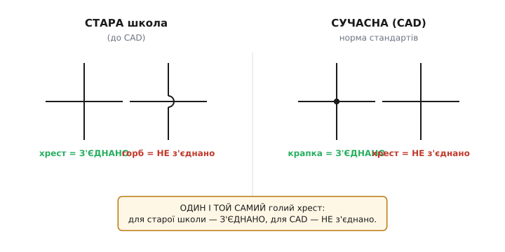
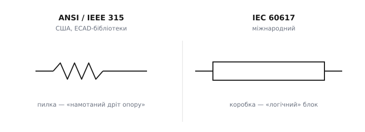

# 📜 Звідки взялися умовні позначення на схемах

Сьогодні правило «жирна крапка — це з'єднання» здається таким самим природним, як крапка в кінці речення. Але ж його хтось мусив придумати, а потім переконати весь світ креслити однаково. І найцікавіше: світ **так і не домовився до кінця**. Дві найбільші системи позначень — північноамериканська й міжнародна — досі малюють деякі однакові речі по-різному, і коли ви відкриваєте схему з резистором-«пилкою» замість резистора-«коробки», ви бачите слід суперечки, що тягнеться майже сто років. Розберімо, як народилася ця мова, чому крапку довелося рятувати горбом-містком і звідки взялися два стандарти, що й нині не зійшлися в одному.

## Питання на копійку, від якого все почалося

Уявіть інженера початку XX століття за кульманом. Він креслить електричне коло, і перед ним постає задача, яка здається безглуздо простою, поки не спробуєш. Два дроти на папері перетинаються. Як **на папері** сказати, що в цій точці вони **сполучені** в один вузол — а не просто пройшли один повз одного, як дві труби на різній висоті?

Жодна риска сама по собі цього не каже. Хрест із двох ліній виглядає однаково в обох випадках. А різниця ж колосальна: сполучені дроти — це одна електрична точка, спільний потенціал, вільний струм; несполучені — два незалежні кола, що випадково наклалися геометрично. Прочитати схему означає **відрізнити одне від іншого в кожній точці перетину** — інакше креслення нічого не варте.

Перші схеми розв'язували це наївно. Якщо дроти перетинаються — значить, **з'єднані**; це здавалося очевидним. А коли треба було показати, що вони **не** торкаються, один із них малювали з маленькою дугою-горбиком, що «перестрибує» другий. Дуга наочно казала: «дивись, цей дріт проходить **над** тим, вони не чіпаються». Так народився **місток** (англ. *hop*, *crossover* — «перестрибування»), і логіка тут була проста, як у двох доріг на естакаді: хто горбиться, той зверху, отже, не з'єднаний.

Ця рання система — **«перетин = з'єднано, горб = не з'єднано»** — панувала довго й мала здоровий глузд за собою. Та в ній ховалася пастка, яка згодом усе перевернула.

## Крапка приходить на допомогу — і породжує нову плутанину

Проблема старої системи в тому, що вона навантажує **звичайний хрест** значенням «з'єднано». А звичайний хрест трапляється на кресленні постійно — щоразу, коли два дроти просто мусять перетнутися, нічого не сполучаючи. Виходило, що **за замовчуванням** будь-який перетин «з'єднує», і щоб цього уникнути, доводилося раз у раз малювати горб. Складна схема перетворювалася на поле з десятками дуг.

Логічніше було б зробити навпаки: хай **за замовчуванням** перетин нічого не з'єднує (це частіший випадок), а з'єднання позначаймо окремим, навмисним знаком. Цим знаком і стала **жирна крапка** на місці злиття. Правило перевернулося на сучасне: **є крапка — з'єднано; немає крапки — голий перетин, кола різні.**

Крапка геніальна своєю дешевизною: одна цятка чорнила несе все рішення. Але тут історія робить злий жарт. Той самий **голий хрест**, який у старій школі означав «**з'єднано**», у новій став означати рівно протилежне — «**не з'єднано**». Один і той самий малюнок читається в двох системах навспак.

*Ліворуч стара школа: хрест означав з'єднання, а горб-місток — що дроти розминулися. Праворуч сучасна норма стандартів: з'єднання несе крапка, а голий хрест означає, що кола різні. Унизу — суть конфлікту: один і той самий голий хрест у двох системах читається протилежно.*

Поки кожен інженер усе життя сидів в одній традиції, проблеми не було. Але креслення подорожували — між фірмами, країнами, поколіннями, із старих архівів у нові проєкти. І ось вам схема невідомого віку з голим хрестом без крапки. **З'єднано чи ні?** Відповідь залежить від того, за якою школою її малювали, — а цього з аркуша не видно. Двозначність, яку домовленість мала вбити, повернулася з іншого боку.

> 🔧 **Навіщо це.** Ця історія — не музейний експонат, вона жива щодня. Беручи в роботу **стару схему** (із даташита 1970-х, з ремонтної документації, із відсканованого підручника), ви мусите спершу зрозуміти, **за якою конвенцією** її креслили, інакше прочитаєте перетини навпаки й полагодите не те. Найнадійніший спосіб — знайти на тому ж аркуші заздалегідь однозначне місце: де є **і** крапки, **і** голі хрести поряд, школа очевидна — це сучасна. Якщо ж усюди горби, перед вами стара система, і голий хрест там означає з'єднання.

## Чому крапку довелося рятувати горбом

Крапка перемогла як стандарт, та інженери швидко відчули в ній **слабке місце**, і знову через фізику паперу, а не електрики.

Крапка — це **дрібний** знак. На неякісному друку, поганому ксероксі, факсі, мікрофільмі вона легко **блякне або зникає**. А зникнення крапки — катастрофа: з'єднання, яке має бути, **тихо випаровується**, і схема з помилкою виглядає бездоганно. Гірше: випадкова цятка бруду чи розтік чорнила можуть **додати** крапку там, де її не було, закоротивши два окремі кола. Обидві помилки — і втрата, і поява крапки — не кричать; їх ловить лише той, хто свідомо перевіряє кожен перетин.

Звідси розумний компроміс, який дехто застосовує й досі: **гібрид**, що не покладається на саму лише наявність чи відсутність крапки. З'єднання показують крапкою (однозначно з'єднано), а **несполучений перетин — горбом-містком** (однозначно не з'єднано). Тоді **жоден** перетин не лишається «німим»: кожен має активний знак, і втрата крапки вже не перетворює з'єднання на ніщо — бо несполучені перетини теж марковані горбом, і голого хреста на схемі просто немає. Старий горб повернувся — але вже не як основне правило, а як страховка від блідої крапки.

Тут варто назвати ще одну тонкість, яку породила доба автоматизованого креслення. У редакторах схем (англ. *CAD* — *computer-aided design*, «проєктування за допомогою комп'ютера») значок «ізольованого перетину» — голий хрест без крапки — **збігся** з тим самим малюнком, який у старій паперовій традиції означав з'єднання. Через цей збіг у багатьох настановах для **паперових** (не-CAD) схем радять про всяк випадок усе ж малювати **горб** на несполучених перетинах: щоб креслення читалося однаково, хоч за старою школою, хоч за новою. *(Статус: усталена інженерна практика; зафіксована, зокрема, у довідкових матеріалах до символьних стандартів.)*

## Чотири дроти в точці: чому редактори бояться цього хреста

Із крапки виростає ще одне правило, яке на перший погляд видається примхою, а насправді — пряма відповідь на її ламкість. Це заборона зводити **чотири дроти в одну точку з крапкою**.

Подумаймо, чому. Крапка на перехресті **чотирьох** ліній мусить означати, що всі чотири злиті в один вузол. Але саме тут крапка найуразливіша. Якщо вона зблякне, читач побачить голий 4-хрест — і прочитає його як **два незалежні** дроти, що просто перетнулися. Одна втрачена цятка перетворює «все з'єднано» на «нічого не з'єднано», і то в точці, від якої залежить ціле коло. Двозначність максимальна.

Розв'язок, що став нормою: **не зводити чотири дроти в одну точку**, а розводити те саме з'єднання на **два трійники** (Т-з'єднання), трохи зміщені вздовж лінії. Трійник — три дроти з крапкою — лишається однозначним навіть без крапки тільки наполовину: око бачить, що одна лінія **впирається** в іншу (літера «Т»), а не проходить наскрізь. Тому редактори схем за замовчуванням **самі** перетворюють чотиристоронній стик на два трійники, а на чистому 4-перехресті крапку **не ставлять** взагалі, трактуючи його як перетин без з'єднання. *(Статус: усталено; така поведінка прямо описана в документації промислових ECAD-редакторів — наприклад, автоматична заміна 4-стику на два сусідні 3-стики.)*

Отже, ціле сімейство правил — крапка, відмова від 4-стику на користь трійників, гібрид із горбом — виросло з **однієї** реальної біди: дрібний знак з'єднання надто легко загубити чи додати. Домовленості тут не естетика, а **захист від тихої помилки**.

## Народження стандартів: коли пора домовлятися всім

Поки електротехніка була ремеслом окремих майстрів, кожна фірма креслила по-своєму, і це сяк-так працювало. Та з масовим виробництвом, авіацією, зв'язком, а далі й електронікою схема перестала бути особистою запискою: її читали постачальники, армія, ремонтні майстерні, інші країни. Виникла гостра потреба, щоб «жирна крапка», «земля», «резистор» означали **одне й те саме** для всіх. Так із розрізнених звичок народилися **стандарти умовних позначень** — узгоджені переліки символів, обов'язкові до вжитку.

Тут лінія історії роздвоюється на дві великі гілки, що тривають донині: **північноамериканську** й **міжнародну**.

## Північноамериканська гілка: ANSI Y32.2 та IEEE 315

У США роботу зі стандартизації символів вели спільно інженерні товариства й національний орган стандартів. Канонічним документом став **IEEE Std 315**, він же **ANSI Y32.2** (а в канадському виданні — **CSA Z99**): «Графічні символи для електричних та електронних схем».

Найвідоміша редакція — **315-1975**. Її **схвалив** Інститут інженерів електротехніки та електроніки (IEEE) **4 вересня 1975 року**, а **опублікували 29 грудня 1975-го**. Вона була ревізією й розширенням попередньої — Y32.2-1970 (IEEE 315-1971), тобто стояла на плечах редакцій, що тяглися ще з повоєнних років. Важлива деталь, яку прямо зазначено в самому стандарті: автори свідомо намагалися **узгодити** його з рекомендаціями Міжнародної електротехнічної комісії — тодішньою публікацією **IEC 117** (у багатьох частинах). Тобто вже тоді американці тягнулися до сумісності з міжнародною системою, хоч і не злилися з нею. *(Статус: усталено — дати й факт узгодження з IEC 117 узяті з офіційної картки стандарту IEEE та з його тексту.)*

Доля цього стандарту повчальна. Його **реафірмували** (підтвердили чинність без змін) **2 грудня 1993 року** — і відтоді не чіпали. А 25 років по тому, **7 листопада 2019-го**, IEEE перевів його в статус **«Inactive-Reserved»** (неактивний-зарезервований) — формально **інактивувавши без заміни**. Тобто документ зняли з активного супроводу, але **не** видали натомість новий американський стандарт символів. *(Статус: усталено — за офіційною карткою IEEE Std 315.)*

І ось парадокс, який варто засвоїти, щоб не плутатися: **інактивований ≠ забутий**. Попри відсутність формальної чинності, символіка ANSI/IEEE 315 **досі домінує** у США й глибоко вшита в бібліотеки систем автоматизованого проєктування (ECAD). Інженер, що відкриває американський даташит чи стандартну бібліотеку редактора, бачить саме ці символи — резистор-«пилку», характерні позначення. Стандарт «помер» на папері, але живе в кожному кресленні; традиція виявилася сильнішою за свій же документ. *(Статус: усталено як практика галузі; «домінує» — констатація поширеності, не юридичний статус.)*

## Міжнародна гілка: IEC 60617

Паралельно свою систему будувала **Міжнародна електротехнічна комісія** (IEC) — орган, що узгоджує електротехнічні стандарти між країнами. Її сучасний звід символів — **IEC 60617** «Графічні символи для схем».

Коріння тут так само глибоке. Згадана публікація **IEC 117** була ранньою міжнародною спробою; на її основі та на основі національних доробків (зокрема британського ряду BS 3939) у **1983 році** вийшли друковані частини **IEC 60617** — окремими томами за темами (провідники й з'єднання, пасивні компоненти, напівпровідники тощо). Новий звід **заступив** стару публікацію 117, і в самому стандарті навіть подали **таблиці відповідності** між символами 117 і 617 — щоб старі креслення можна було перечитати за новим. *(Статус: усталено щодо року 1983 і факту заміни IEC 117; ширша «родовідна» через британський BS 3939 — правдоподібна, але точні ранні дати британської гілки в джерелах різняться, тож подаю її як контекст, а не як тверду дату.)*

Згодом IEC зробив крок, що відрізняє його долю від американської. Замість періодичних паперових ревізій усі частини (від 2-ї до 13-ї) **звели в єдину онлайн-базу символів** — живий, регулярно оновлюваний реєстр, що нині містить близько **1900 графічних символів**. Кожен символ дістав метадані (назву, призначення, ключові слова, примітки) і доступний у машинних форматах. Свіже видання цієї бази — **2025 року**. Тобто там, де американський стандарт застиг і був інактивований, міжнародний **перетворився на живу базу даних**, яку підтримує команда валідації від національних комітетів. *(Статус: усталено — за каталогом IEC: формат бази, ~1900 символів, видання 2025.)*

## Чому резистор досі малюють по-різному

І тепер — найнаочніший слід того, що світ **не** дійшов спільної мови: **резистор**. Та сама деталь, той самий фізичний сенс, але два геть різні значки залежно від того, за яким стандартом креслено.

*Та сама деталь — два символи. ANSI/IEEE 315 малює резистор зигзагом-«пилкою»; IEC 60617 — простим прямокутником-«коробкою». Електрично вони тотожні: у будь-якому редакторі обидва дають однаковий вузол у нетлисті.*

**Північноамериканська школа** (ANSI/IEEE 315) малює резистор **зигзагом** — гострою «пилкою» з кількох зламів. Цей символ **зображальний**: він натякає на фізику ранніх резисторів — **намотаний дріт опору**, котушку з тонкого дроту, що звивається туди-сюди. Малюнок ніби показує саму річ.

**Міжнародна школа** (IEC 60617) малює резистор **простим прямокутником** — «коробкою». Цей символ **логічний**, а не зображальний: він нічого не каже про будову деталі, лише про її роль — «тут стоїть опір». Прямокутник легше креслити однаково, у нього зручно вписувати номінал чи позначення, і він не прив'язаний до якоїсь однієї технології виготовлення.

За цією дрібницею — різниця **філософій**. Американська традиція тяжіла до **піктографічних** символів, що нагадують реальний предмет; міжнародна — до **абстрактних, схематичних** блоків, що передають функцію. Жодна не «правильніша»: зигзаг інтуїтивніший для новачка, коробка строгіша й технологічно нейтральна. Електрично ж вони **абсолютно тотожні** — у будь-якому сучасному редакторі і «пилка», і «коробка» дають у нетлисті один і той самий резистор, той самий вузол, ту саму поведінку. *(Статус: усталено — походження зигзага від намотаного дроту опору й контраст «зображальне ANSI ↔ логічне IEC» фігурують у багатьох технічних оглядах; функціональна тотожність очевидна з самого означення символу.)*

Чому ж розбіжність **дожила** до наших днів, якщо обидва стандарти десятиліттями тягнулися до сумісності? Бо символ — це **звичка ока цілих поколінь та інерція бібліотек**. Американський інженер «читає» зигзаг як резистор миттєво, не думаючи; для нього коробка — щось чуже. Десятки років даташитів, підручників, готових бібліотек у редакторах закріпили місцеву норму так міцно, що змінити її означало б перевчити всю галузь і переробити мільйони креслень. Тому редактори схем просто дають **обидва набори символів** на вибір, а інженер ставить той, до якого звик його регіон. Сучасний загальний рух — **поступове поширення IEC-символів** навіть там, де історично панував ANSI (через глобальні бібліотеки й міжнародні проєкти), але повного злиття досі немає. *(Статус: правдоподібно й усталено як тенденція; «поступове поширення IEC» — спостереження галузевих оглядів, а не формальне рішення.)*

## Що з усього цього винести

Уся мова ліній і символів на схемі — не дана згори абетка, а **результат столітнього торгу** між зручністю, надійністю друку й національними звичками. Жирна крапка перемогла стару систему «хрест = з'єднано», бо за замовчуванням розумніше **не** з'єднувати; але її дрібнота породила цілий захисний почет — горб-місток як страховку, заборону 4-стику на користь трійників, гібридні правила. Два великі стандарти — північноамериканський **IEEE 315 / ANSI Y32.2** (1975, реафірмований 1993, інактивований без заміни 2019-го, та досі панівний у США й ECAD) і міжнародний **IEC 60617** (база символів, видання 2025) — десятиліттями зближувалися, але так і не злилися, і резистор-«пилка» проти резистора-«коробки» — найвидиміший шов між ними.

Практичний висновок простий. Читаючи схему, спершу впізнайте **школу**: за якою конвенцією перетинів вона креслена і чи зигзагом, чи коробкою позначено резистор, — і далі читайте її послідовно за цією системою. А креслячи власну — тримайтеся **однієї** конвенції на весь проєкт і не змішуйте: бо вся цінність цих знаків у тому, що вони **однозначні**, а однозначність живе тільки доти, доки система одна.
