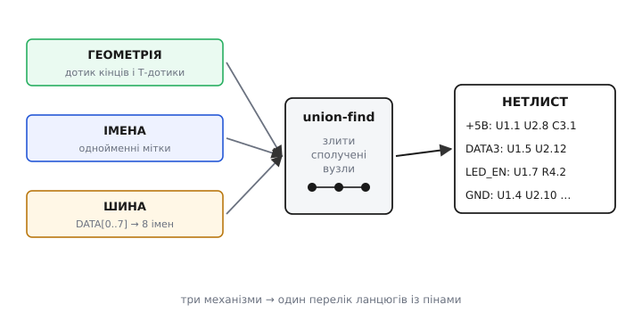

# ⚙️ Як редактор збирає нетлист із ліній, міток і шин

> Схема в редакторі — це купа намальованих об'єктів: відрізки дротів, написи-мітки, товсті шини, символи деталей із пінами. Око людини читає її як коло, та програмі картинка нічого не каже сама собою. Щоб вивести плату, редактор мусить **звести намальоване в нетлист** — перелік ланцюгів (англ. *net*), де для кожного зібрано всі піни, які мусять стати однією мідною точкою. Тут розберемо саме **складання** ланцюга: як із розкиданих відрізків виходить один дріт, як однойменні мітки зливаються в одну мережу попри відсутність лінії між ними, як `DATA[0..7]` розгортається у вісім окремих ланцюгів — і як на цьому ж кроці ловляться друкарські помилки в іменах та одинокі (висячі) ланцюги. Це не перевірка правил уже готового нетлиста — це сам момент, коли геометрія та імена перетворюються на електрику.

### Задача

Перед редактором лежить аркуш. На ньому — десятки **відрізків дроту** (кожен заданий двома кінцями, бо користувач веде лінію кусень за куснем і ставить злами), **піни** деталей (точка на аркуші, де символ під'єднується до кола), **мітки ланцюгів** (напис, прив'язаний до точки: локальний у межах аркуша чи глобальний на весь проєкт), **шини** (товста лінія з ім'ям-діапазоном) і **відгалуження від шин**. Жоден із цих об'єктів не несе в собі готового номера ланцюга — ланцюги треба **вирахувати**.

Питання, на яке має відповісти програма, одне: **які точки аркуша електрично сполучені?** І відповідь складається з трьох незалежних механізмів, що діють разом:

- **геометрія** — два об'єкти сполучені, якщо вони **дотикаються** координатами (кінець дроту лежить на іншому дроті, на піні чи на крапці-з'єднанні);
- **ім'я** — дві точки сполучені, якщо на них висять **однакові мітки** (того самого радіуса дії), навіть коли лінії між ними немає взагалі;
- **шина** — член шини `DATA3` сполучений з усім, що теж зветься `DATA3`, а сама шина — це лише компактний запис восьми таких імен.

Зібравши все це, програма мусить ще й **застерегти**: якщо ланцюг складається з єдиної точки (дріт у нікуди), або якщо ім'я схоже на сусіднє, але не збігається до символу (друкарська помилка), — це майже напевно недогляд, і про нього треба сказати, доки помилка не поїхала на плату.

> 🔧 **Навіщо це.** Цей крок — **межа між «намалював» і «спаяв»**. Усе, що редактор зрозуміє неправильно тут, далі поїде в розведення й у фотошаблон без жодного опору: доріжка ляже не туди або не ляже зовсім. Тому варто розуміти не лише, *що* робить ця машинерія, а й *де* вона мовчки помиляється, — бо саме там народжуються плати, що «зібрані точно за схемою, а не працюють».

### Ідея: спершу склеїти за дотиком, потім долити за іменем

Перший механізм — геометрія — це класична задача про **зв'язні компоненти**: уявімо піни й кінці дротів вершинами, а кожен дотик — ребром; тоді ланцюг є групою вершин, усе всередині якої сполучене. Знаходять такі групи **системою неперетинних множин** (англ. *union-find*): спершу кожна точка — окрема множина, далі за кожним дотиком дві множини **зливають**, наприкінці кожна множина, що лишилась, — окремий ланцюг. (Сам цей рушій і перевірка правил уже готового нетлиста — окрема тема: [нетлист і ERC очима редактора](book:electronics/nodes-connections/proj-netlist-erc.md). Тут нас цікавить не він, а те, **що саме** ми в нього зливаємо.)

Уся сіль — у тому, як із намальованого добути ребра. І тут є три тонкощі, через які наївне «склеїти кінці, що збіглися» не працює.

**Перша: дріт — це не один відрізок.** Користувач веде лінію зламами, і навіть пряма ділянка може складатися з кількох відрізків, що лежать **на одній прямій впритул**. Якщо просто шукати збіги кінців, два колінеарні відрізки, чий спільний кінець нікуди більше не веде, склеяться правильно. Та є гірший випадок — **Т-дотик**: кінець одного дроту впирається не в кінець, а в **середину** іншого. На схемі це трійник із крапкою. Геометрично кінець C лежить десь усередині відрізка A–B, і якщо звіряти лише «кінець до кінця», цей дотик загубиться. Отже, ребро треба ставити не лише коли збіглися кінці, а й коли **точка лежить на відрізку**.

**Друга: дотик — це збіг на сітці, а не «майже».** Координати на аркуші дискретні: редактори притягують усе до сітки саме для того, щоб «дотик» був точною рівністю двох цілих чисел, а не порівнянням дробів із допуском. Два кінці, що розійшлися на піксель, — це **різні** точки й **різні** ланцюги, хоч на око «все сполучено». Тому в коді координата — ціле число кроків сітки, а збіг — звичайне `==`.

**Третя: крапка-з'єднання теж об'єкт.** Жирна крапка на 4-перехресті — це окремий елемент, що каже «усі чотири дроти, які тут сходяться, з'єднати». Без неї перетин двох дротів **не** дає ребра: лінії просто проходять одна повз одну.

Коли геометрію зведено, додають **другий механізм — імена**. Збираємо всі мітки, групуємо за `(ім'я, радіус_дії)` і всередині кожної групи зливаємо ланцюги точок, на яких ці мітки висять. Радіус дії важливий: дві локальні мітки `SDA` на **різних** аркушах — то різні ланцюги, а дві глобальні `+5В` — той самий, де б вони не стояли. Тому ключ групування — не саме ім'я, а пара «ім'я + область видимості».

**Третій механізм — шина** — це, по суті, той самий механізм імен, лише з попереднім **розгортанням**. Запис `DATA[0..7]` не ланцюг — це **скорочення** для восьми імен `DATA0…DATA7`. Редактор спершу розгортає діапазон, а далі поводиться з кожним членом як зі звичайною міткою: `DATA3` на шині та `DATA3` на піні деталі зливаються за збігом імені — рівно так само, як зливаються дві мітки `+5В`. Сама товста лінія й скісні «зриви» з неї **не несуть струму** в нетлисті: вони лише носять імена. Саме тому дріт, упертий прямо в товсту лінію без мітки, редактор **проігнорує** — він не знає, до якої з восьми внутрішніх ліній ви тягнетеся.


*Три потоки, що сходяться в один нетлист. **Геометрія**: кінці й Т-дотики дротів дають ребра, які union-find зливає у зв'язні групи. **Імена**: однойменні мітки доливають ребра «без лінії». **Шина**: `DATA[0..7]` розгортається у вісім імен, кожне зливається як звичайна мітка. На виході — перелік ланцюгів із пінами.*

### Робоче ядро: від об'єктів до ланцюгів

Зберемо це в код. Тон — як у справжньому редакторі схем (це настільна програма на C++), тож структури тримають геометрію та імена, а union-find зводить усе докупи. Почнемо з типів і координатної арифметики на сітці.

:::tabs
```cpp
#include <cstdint>
#include <string>
#include <vector>
#include <unordered_map>
#include <algorithm>

// Точка на аркуші — у КРОКАХ СІТКИ (цілі!), щоб «дотик» був точним ==, а не «майже».
struct Point {
    int32_t x, y;
    bool operator==(const Point& o) const { return x == o.x && y == o.y; }
};
struct PointHash {                       // щоб Point міг бути ключем у хеш-таблиці
    size_t operator()(const Point& p) const {
        return (uint64_t(uint32_t(p.x)) << 32) ^ uint32_t(p.y);
    }
};

struct Wire { Point a, b; };             // відрізок дроту: два кінці
struct Pin  { Point at; int part, num; std::string name; };  // вивід деталі

// Мітка ланцюга. scope розрізняє радіус дії: локальна діє в межах аркуша,
// глобальна — по всьому проєкту. Тому ключ збігу — ПАРА (ім'я, область).
enum class Scope { Local, Global };
struct Label { Point at; std::string name; Scope scope; int sheet; };
```
```python
from dataclasses import dataclass
from enum import Enum

# Точка на аркуші — у КРОКАХ СІТКИ (цілі!), щоб «дотик» був точним ==, а не «майже».
# frozen=True робить точку незмінною й хешованою — тож вона годиться в ключ dict/set,
# а рівність двох точок — це збіг обох координат (Python дає __eq__/__hash__ даром).
@dataclass(frozen=True)
class Point:
    x: int
    y: int

@dataclass
class Wire:                              # відрізок дроту: два кінці
    a: Point
    b: Point

@dataclass
class Pin:                               # вивід деталі
    at: Point
    part: int
    num: int
    name: str

# Мітка ланцюга. scope розрізняє радіус дії: локальна діє в межах аркуша,
# глобальна — по всьому проєкту. Тому ключ збігу — ПАРА (ім'я, область).
class Scope(Enum):
    LOCAL = 0
    GLOBAL = 1

@dataclass
class Label:
    at: Point
    name: str
    scope: Scope
    sheet: int
```
:::

Координати — цілі кроки сітки, бо «дотик» мусить бути рівністю, а не наближенням. Тепер геометричний предикат — серце склеювання. Кінець дроту дотикається до іншого дроту або тоді, коли збігається з його кінцем, або коли **лежить на ньому всередині** (Т-дотик). Для ортогональних (горизонтальних/вертикальних) дротів — а на схемі такі майже всі — перевірка «точка на відрізку» зводиться до простого порівняння координат.

:::tabs
```cpp
// Чи лежить точка p на ВІДРІЗКУ дроту w (включно з кінцями)?
// Дроти на схемі ортогональні, тож достатньо розглянути H- і V-випадки.
static bool point_on_wire(const Point& p, const Wire& w) {
    if (w.a.y == w.b.y) {                                  // горизонтальний
        if (p.y != w.a.y) return false;
        return p.x >= std::min(w.a.x, w.b.x) && p.x <= std::max(w.a.x, w.b.x);
    }
    if (w.a.x == w.b.x) {                                  // вертикальний
        if (p.x != w.a.x) return false;
        return p.y >= std::min(w.a.y, w.b.y) && p.y <= std::max(w.a.y, w.b.y);
    }
    // навскісний дріт — рідкість; повна перевірка колінеарності + меж:
    int64_t cross = int64_t(p.x - w.a.x) * (w.b.y - w.a.y)
                  - int64_t(p.y - w.a.y) * (w.b.x - w.a.x);
    if (cross != 0) return false;
    return p.x >= std::min(w.a.x, w.b.x) && p.x <= std::max(w.a.x, w.b.x)
        && p.y >= std::min(w.a.y, w.b.y) && p.y <= std::max(w.a.y, w.b.y);
}
```
```python
# Чи лежить точка p на ВІДРІЗКУ дроту w (включно з кінцями)?
# Дроти на схемі ортогональні, тож достатньо розглянути H- і V-випадки.
def point_on_wire(p: Point, w: Wire) -> bool:
    if w.a.y == w.b.y:                                     # горизонтальний
        if p.y != w.a.y:
            return False
        return min(w.a.x, w.b.x) <= p.x <= max(w.a.x, w.b.x)
    if w.a.x == w.b.x:                                     # вертикальний
        if p.x != w.a.x:
            return False
        return min(w.a.y, w.b.y) <= p.y <= max(w.a.y, w.b.y)
    # навскісний дріт — рідкість; повна перевірка колінеарності + меж:
    cross = (p.x - w.a.x) * (w.b.y - w.a.y) \
          - (p.y - w.a.y) * (w.b.x - w.a.x)
    if cross != 0:
        return False
    return (min(w.a.x, w.b.x) <= p.x <= max(w.a.x, w.b.x)
            and min(w.a.y, w.b.y) <= p.y <= max(w.a.y, w.b.y))
```
:::

Тепер union-find. Він короткий, але саме він робить «склеювання»: спершу кожен об'єкт сам собі ланцюг, далі за кожним дотиком два ланцюги зливаються в один.

:::tabs
```cpp
struct DSU {
    std::vector<int> parent, rank_;
    explicit DSU(int n) : parent(n), rank_(n, 0) {
        for (int i = 0; i < n; ++i) parent[i] = i;   // кожен — сам собі корінь
    }
    int find(int x) {
        while (parent[x] != x) x = parent[x] = parent[parent[x]];  // стиснення шляху
        return x;
    }
    void unite(int a, int b) {                       // злити два ланцюги
        a = find(a); b = find(b);
        if (a == b) return;
        if (rank_[a] < rank_[b]) std::swap(a, b);
        parent[b] = a;
        if (rank_[a] == rank_[b]) ++rank_[a];
    }
};
```
```python
class DSU:
    def __init__(self, n: int):
        self.parent = list(range(n))     # кожен — сам собі корінь
        self.rank = [0] * n

    def find(self, x: int) -> int:
        while self.parent[x] != x:
            self.parent[x] = self.parent[self.parent[x]]  # стиснення шляху
            x = self.parent[x]
        return x

    def unite(self, a: int, b: int) -> None:             # злити два ланцюги
        a, b = self.find(a), self.find(b)
        if a == b:
            return
        if self.rank[a] < self.rank[b]:
            a, b = b, a
        self.parent[b] = a
        if self.rank[a] == self.rank[b]:
            self.rank[a] += 1
```
:::

Зведімо геометрію. Кожному пінові й кожному кінцю дроту дамо **вузол** — індекс у DSU. Щоб не плодити вузлів-двійників на тих самих координатах, заведемо мапу `Point → вузол`: усе, що сходиться в одну точку сітки, дістає **той самий** вузол — і цим уже автоматично злите. Лишається додати Т-дотики, яких збігом координат не зловиш.

:::tabs
```cpp
struct NodeMap {
    std::unordered_map<Point, int, PointHash> id;
    std::vector<Point> pt;                    // вузол → координата (для діагностики)
    int node_at(const Point& p) {
        auto it = id.find(p);
        if (it != id.end()) return it->second; // уже є вузол на цій точці
        int n = (int)pt.size();
        id.emplace(p, n);
        pt.push_back(p);
        return n;                              // новий вузол на новій точці
    }
};

// Будуємо геометричні ланцюги: спільна координата → спільний вузол;
// кінці кожного дроту зливаємо; Т-дотики ловимо окремим проходом.
static DSU build_geometry(const std::vector<Wire>& wires,
                          const std::vector<Pin>&  pins,
                          NodeMap& nm)
{
    // 1) Заводимо вузли на всіх кінцях дротів і всіх пінах (збіг точок = той самий вузол).
    for (const auto& w : wires) { nm.node_at(w.a); nm.node_at(w.b); }
    for (const auto& p : pins)  { nm.node_at(p.at); }

    DSU dsu((int)nm.pt.size());

    // 2) Кінці того самого дроту — очевидно один ланцюг.
    for (const auto& w : wires)
        dsu.unite(nm.node_at(w.a), nm.node_at(w.b));

    // 3) Т-ДОТИКИ: вузол (пін чи кінець дроту), що лежить УСЕРЕДИНІ іншого дроту.
    //    Без цього кроку трійник «кінець у середину» загубився б.
    for (int v = 0; v < (int)nm.pt.size(); ++v) {
        const Point& p = nm.pt[v];
        for (const auto& w : wires) {
            if (p == w.a || p == w.b) continue;        // кінці вже злиті в кроці 2
            if (point_on_wire(p, w)) {                 // p сидить на тілі дроту w
                dsu.unite(v, nm.node_at(w.a));         // приєднати до того дроту
            }
        }
    }
    return dsu;
}
```
```python
class NodeMap:
    def __init__(self):
        self.id: dict[Point, int] = {}       # точка → вузол
        self.pt: list[Point] = []            # вузол → координата (для діагностики)

    def node_at(self, p: Point) -> int:
        n = self.id.get(p)
        if n is not None:                    # уже є вузол на цій точці
            return n
        n = len(self.pt)
        self.id[p] = n
        self.pt.append(p)
        return n                             # новий вузол на новій точці


# Будуємо геометричні ланцюги: спільна координата → спільний вузол;
# кінці кожного дроту зливаємо; Т-дотики ловимо окремим проходом.
def build_geometry(wires: list[Wire], pins: list[Pin], nm: NodeMap) -> DSU:
    # 1) Заводимо вузли на всіх кінцях дротів і всіх пінах (збіг точок = той самий вузол).
    for w in wires:
        nm.node_at(w.a)
        nm.node_at(w.b)
    for p in pins:
        nm.node_at(p.at)

    dsu = DSU(len(nm.pt))

    # 2) Кінці того самого дроту — очевидно один ланцюг.
    for w in wires:
        dsu.unite(nm.node_at(w.a), nm.node_at(w.b))

    # 3) Т-ДОТИКИ: вузол (пін чи кінець дроту), що лежить УСЕРЕДИНІ іншого дроту.
    #    Без цього кроку трійник «кінець у середину» загубився б.
    for v, p in enumerate(nm.pt):
        for w in wires:
            if p == w.a or p == w.b:         # кінці вже злиті в кроці 2
                continue
            if point_on_wire(p, w):          # p сидить на тілі дроту w
                dsu.unite(v, nm.node_at(w.a))  # приєднати до того дроту
    return dsu
```
:::

Геометрія склеєна. Тепер **долити імена**. Збираємо мітки в групи за ключем «ім'я + радіус дії» і всередині кожної групи зливаємо вузли точок, на яких ці мітки висять. Локальні мітки додатково розрізняємо за номером аркуша — щоб `SDA` з аркуша 1 не злився з `SDA` з аркуша 2.

```cpp
// Ключ збігу мітки: ім'я + область видимості (+ аркуш для локальних).
static std::string label_key(const Label& L) {
    if (L.scope == Scope::Global) return "G:" + L.name;          // на весь проєкт
    return "L:" + std::to_string(L.sheet) + ":" + L.name;         // лише цей аркуш
}

// Зливаємо за іменами: усі точки з однаковим ключем мітки → один ланцюг.
static void merge_by_labels(const std::vector<Label>& labels,
                            NodeMap& nm, DSU& dsu)
{
    std::unordered_map<std::string, int> first_node;   // ключ → перший побачений вузол
    for (const auto& L : labels) {
        int v = nm.node_at(L.at);                      // вузол точки, де висить мітка
        std::string k = label_key(L);
        auto it = first_node.find(k);
        if (it == first_node.end()) first_node.emplace(k, v); // перша з цим іменем
        else dsu.unite(it->second, v);                 // решта — зливаємо з першою
    }
}
```

Тепер **шина**. Запис `DATA[0..7]` — це скорочення; розгорнімо його у вісім окремих імен. Розбір простий: префікс, відкрита дужка, два числа через `..`, закрита дужка. Кожне розгорнуте ім'я далі — звичайна мітка, тож шина не потребує окремого механізму злиття, лише цього розгортання.

```cpp
// Розгорнути векторну шину "DATA[0..7]" → ["DATA0","DATA1",...,"DATA7"].
// Якщо запис не схожий на шину — повертаємо саме ім'я як єдиний член.
static std::vector<std::string> expand_bus(const std::string& name) {
    size_t lb = name.find('[');
    size_t dd = name.find("..", lb == std::string::npos ? 0 : lb);
    size_t rb = name.find(']', dd == std::string::npos ? 0 : dd);
    if (lb == std::string::npos || dd == std::string::npos || rb == std::string::npos
        || !(lb < dd && dd < rb)) {
        return { name };                               // не шина — звичайна мітка
    }
    std::string prefix = name.substr(0, lb);
    int lo = std::stoi(name.substr(lb + 1, dd - lb - 1));
    int hi = std::stoi(name.substr(dd + 2, rb - dd - 2));
    int step = (lo <= hi) ? 1 : -1;                    // діапазон може й спадати
    std::vector<std::string> members;
    for (int i = lo; ; i += step) {
        members.push_back(prefix + std::to_string(i)); // DATA0, DATA1, ...
        if (i == hi) break;
    }
    return members;
}
```

Маючи розгортання, відгалуження від шини обробляємо як звичайні мітки: на кінці кожного «зриву» стоїть мітка члена (`DATA3`), і вона зливається з однойменним пином деталі через `merge_by_labels`. А мітку на самій шині (`DATA[0..7]`) розгортаємо й кожному членові ставимо точку на шині — щоб `DATA3`-член і `DATA3`-пін зустрілися за іменем.

Лишається **зібрати нетлист** — згрупувати піни за коренем DSU — і **дати ланцюгам імена**. Ім'я ланцюга бере мітка, якщо вона на ньому є; інакше редактор присвоює службове на кшталт `Net-(U1-Pad3)`.

```cpp
struct Net {
    std::string name;                 // ім'я з мітки або службове
    std::vector<int> pins;            // індекси пінів у цьому ланцюзі
};

static std::vector<Net> build_netlist(const std::vector<Wire>&  wires,
                                      const std::vector<Pin>&   pins,
                                      const std::vector<Label>& labels)
{
    NodeMap nm;
    DSU dsu = build_geometry(wires, pins, nm);   // 1) склеїти за дотиком
    merge_by_labels(labels, nm, dsu);            // 2) долити за іменами (й членами шин)

    // 3) Згрупувати ПІНИ за коренем ланцюга.
    std::unordered_map<int, Net> by_root;
    for (size_t i = 0; i < pins.size(); ++i) {
        int root = dsu.find(nm.node_at(pins[i].at));
        by_root[root].pins.push_back((int)i);
    }
    // 4) Дати ланцюгам імена з міток, що на них висять.
    for (const auto& L : labels) {
        int root = dsu.find(nm.node_at(L.at));
        auto it = by_root.find(root);
        if (it != by_root.end() && it->second.name.empty())
            it->second.name = L.name;            // перша мітка дає ім'я ланцюгу
    }
    std::vector<Net> nets;
    for (auto& kv : by_root) {
        if (kv.second.name.empty())
            kv.second.name = "Net-" + std::to_string(kv.first); // службове ім'я
        nets.push_back(std::move(kv.second));
    }
    return nets;
}
```

Це повний кістяк: координатний дотик (включно з Т-дотиками й крапками), злиття за іменами з урахуванням радіуса дії, розгортання шин — і збір ланцюгів із іменами. Усе разом — лінійно швидке, бо union-find із стисненням шляху працює майже за сталий час на операцію.

### Ловля помилок просто на цьому кроці

Найцінніше — що **той самий прохід** дає матеріал, щоб застерегти про дві типові біди ще до плати. Перша — **одинокий ланцюг**: точка, що нікуди не сполучена. Друга, підступніша — **друкарська помилка в імені**: мітка, схожа на сусідню, але не та сама, тихо рве з'єднання й заразом створює зайвий «майже однойменний» ланцюг.

Висячий ланцюг видно одразу: у ньому рівно один пін і жодної мітки, що тяглася б далі.

```cpp
// Ланцюг із єдиного піна без мітки — майже напевно «дріт у нікуди».
static void warn_singletons(const std::vector<Net>& nets) {
    for (const auto& n : nets)
        if (n.pins.size() == 1 && n.name.rfind("Net-", 0) == 0)
            printf("ПОПЕРЕДЖЕННЯ: одинокий ланцюг %s — пін нікуди не під'єднано\n",
                   n.name.c_str());
}
```

Друкарська помилка — тонше. Редактор не знає, що `LED_EN` і `LED_NE` мали бути одним ланцюгом. Та він **може** запідозрити: якщо два **різні** ланцюги мають імена, що відрізняються на крихту (одна літера), і кожен при цьому «бідний» (мало пінів) — це підозра на одрук. Корисна евристика — **відстань Левенштайна** (англ. *Levenshtein distance* — мінімум вставок/вилучень/замін літер, щоб зробити один рядок іншим): імена на відстані 1 варто показати інженерові.

```cpp
// Відстань Левенштайна: скільки правок (вставити/вилучити/замінити літеру)
// перетворюють a на b. Імена з відстанню 1 — кандидати на одрук.
static int lev(const std::string& a, const std::string& b) {
    std::vector<int> d(b.size() + 1);
    for (size_t j = 0; j <= b.size(); ++j) d[j] = (int)j;
    for (size_t i = 1; i <= a.size(); ++i) {
        int prev = d[0]; d[0] = (int)i;
        for (size_t j = 1; j <= b.size(); ++j) {
            int cur = d[j];
            d[j] = std::min({ d[j] + 1,                       // вилучити
                              d[j - 1] + 1,                   // вставити
                              prev + (a[i-1] != b[j-1]) });   // замінити
            prev = cur;
        }
    }
    return d[b.size()];
}

// Попередити про пари іменованих ланцюгів, чиї імена відрізняються на 1 правку.
static void warn_typos(const std::vector<Net>& nets) {
    for (size_t i = 0; i < nets.size(); ++i)
        for (size_t j = i + 1; j < nets.size(); ++j) {
            const std::string& a = nets[i].name, & b = nets[j].name;
            if (a.rfind("Net-",0)==0 || b.rfind("Net-",0)==0) continue; // лише іменовані
            if (a.size() == b.size() && lev(a, b) == 1)
                printf("ПОПЕРЕДЖЕННЯ: '%s' і '%s' схожі — одрук в імені?\n",
                       a.c_str(), b.c_str());
        }
}
```

Ця евристика не безгрішна (`D0` і `D1` — теж відстань 1, а це навмисно різні ланцюги), тож вона лише **підказує**, а не забороняє. Але саме вона ловить найкаверзніший випадок із наступного розділу — кириличну літеру в латинському імені, бо для неї `VCC` і `VСС` — два рядки на відстані заміни.

### Складність і пастки

**Складність.** Розгортання шин і збір ланцюгів лінійні. Союз-пошук із стисненням шляху дає майже сталу вартість на дотик, тож геометричне склеювання — практично лінійне від числа дротів і пінів. Дорожчий — наївний прохід по Т-дотиках (для кожного вузла — усі дроти, тобто O(вузли·дроти)); справжні редактори замінюють його просторовим індексом (сіткою чи R-деревом), що зводить пошук дотику до майже сталого. Перевірка одруків квадратична по числу **імен** (порівнюємо кожну пару), але імен набагато менше за піни, тож це дешево.

А ось пастки — і саме вони псують реальні плати:

- **Кирилична літера в латинському імені.** `VCC` латинськими й `VСС`, де друга й третя «С» — кирилична С (Unicode U+0421, тоді як латинська C — U+0043), для людини **однакові**, а для редактора це два різні рядки байтів і два різні ланцюги. Деталь лишиться без живлення, а схема виглядатиме бездоганно. Це той самий механізм, що й у фішингових доменах-двійниках; Консорціум Unicode навіть веде окремий перелік таких «плутаників» (`confusables.txt`). На рівні нетлиста рятує лише звірка байтів імен (саме її й робить евристика Левенштайна вище) та звичка не змішувати розкладки в іменах ланцюгів. *(Походження U+0421/U+0043 і перелік `confusables.txt` — підтверджено документацією Unicode.)*

- **Прямий дріт у товсту шину.** Дріт, упертий просто в лінію шини без мітки члена, редактор **проігнорує**: він не знає, до якого з `DATA0…DATA7` ви тягнетеся. Під'єднання до шини — **лише за іменем члена**, ніколи геометрією дотику. У старих редакторах (KiCad 5 і раніше) було ще й зворотне джерело сюрпризів: дозволялося стикувати **по-різному названі** шини, а їхні члени мовчки зливались під час складання нетлиста — і яке ім'я дістане сигнал, передбачити було важко. У KiCad 6 цю поведінку **прибрали** саме через непередбачуваність результату. *(Зміну поведінки шин у KiCad 6 підтверджено офіційною документацією KiCad.)*

- **Дроти, що ЛЕДЬ не торкаються.** Якщо кінці двох дротів розійшлися на крок сітки, спільної координати немає — і union-find їх **не** зіллє. Вийдуть два ланцюги там, де на око «все сполучено». Тому координати тримають цілими кроками сітки, а кінці притягують до сітки **під час малювання**, а не звіряють із допуском при складанні: «майже дотик» — це не дотик.

- **Забута крапка на 4-перехресті.** Перетин двох дротів без крапки — **коректна** топологія (лінії просто проходять одна повз одну), тож складач нетлиста все зробить «правильно» й **нічого не запідозрить**. Якщо крапку забули там, де хотіли з'єднати, матимете тихий обрив, якого цей крок не зловить — він вірний геометрії, а не задуму. Через це гарне креслення взагалі **уникає** чотирьох дротів в одній точці, розводячи з'єднання на два трійники.

- **Випадково однакове ім'я.** Дзеркало одруку: дали двом незв'язаним ланцюгам **одну** мітку — і злиття за іменем стулило їх в один. Закоротка, якої ви не малювали, причому без жодної лінії між ними. Евристика подібності тут не порятує (імена **однакові**, не схожі); ловить це вже перевірка правил готового нетлиста — два виходи в одному ланцюзі.

- **Радіус дії мітки.** Локальна мітка `SDA` діє лише в межах аркуша; чекати, що вона дотягнеться до сусіднього, — помилка, і складач чесно лишить два ланцюги. І навпаки: **глобальна** мітка з надто загальним іменем (скажімо, `CLK`) може ненавмисно злитися з однойменною з геть іншого вузла схеми. Ключ злиття — пара «ім'я + область», і плутанина областей дає або зайвий обрив, або зайве з'єднання.

Отже, складання нетлиста — це три прості механізми, що діють разом: дотик координат зливає лінії в ланцюг, збіг імен доливає з'єднання без ліній, а розгортання `DATA[0..7]` зводить шину до тих самих імен. Уся хитрість — у крайових випадках: Т-дотик, який легко проґавити; «майже дотик», який дотиком не є; і ім'я, що для ока збігається, а для байтів — ні. Хто розуміє ці три механізми й знає, де вони мовчать, той довіряє нетлисту рівно настільки, наскільки той заслуговує, — і ловить тихі помилки на схемі, а не на платі.
