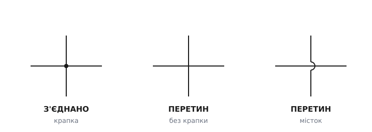
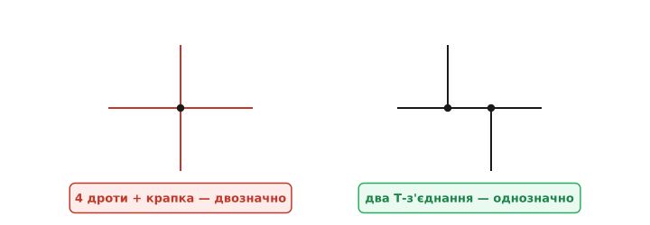
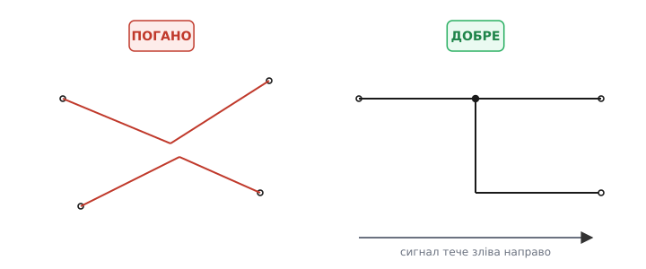
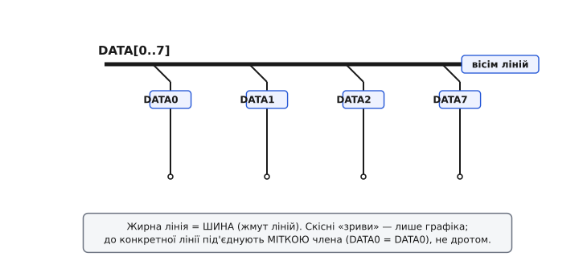
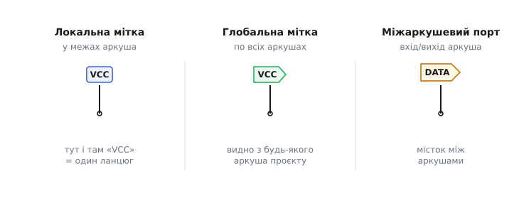

# Лінії та з'єднання на схемі

На принциповій схемі **лінія — це дріт**: ідеальне з'єднання без опору, без падіння напруги, без затримки. Усе, що сполучено лінією, — електрично **одна точка**. Звучить просто, та саме навколо ліній виростає ціла мова креслення: як їх вести, як показати, що два дроти **з'єднані** (а не просто перетнулися на папері), як зв'язати половини великої схеми, не тягнучи провід через увесь аркуш, і як упакувати вісім однакових ліній в одну товсту. Ця граматика ліній — те, що відрізняє схему, яку прочитає будь-хто, від плутанини, у якій сам автор за тиждень не розбереться. Розберімо її від першопричини: чому домовленості саме такі й що йде не так, коли їх порушити.

### Чому потрібна домовленість, а не просто «провести лінію»

Уявіть, що ви креслите коло й вам треба провести сигнал від виходу однієї деталі до входу іншої. Здавалося б, проведи риску — і готово. Але щойно на аркуші більше п'яти-шести деталей, лінії починають **перетинатися**. І тут постає питання на копійку, від якого залежить уся схема: коли дві лінії накладаються, вони **сполучені** в цій точці чи просто проходять одна повз одну?

Електрично це дві геть різні речі. Сполучені — значить, [один спільний вузол](topic:electronics/nodes-connections), одна точка з єдиним потенціалом, струм перетікає вільно. Не сполучені — два незалежні кола, що випадково перетнулися геометрично, як дві дороги на естакаді. На папері ж обидва випадки виглядають однаково: хрест із двох ліній. Якби не було чіткого знаку, що відрізняє одне від іншого, схему **неможливо було б прочитати однозначно** — а однозначність і є вся її цінність.

> 🔧 **Навіщо це.** Граматика ліній — не естетика й не педантизм. Це **захист від тихих помилок**. «Схема правильна, а не працює» — класична ситуація, і дуже часто причина саме в лініях: загублений знак з'єднання, зайвий знак з'єднання, двозначний перетин, який автор і читач прочитали по-різному. Жодна з цих помилок не кричить — схема виглядає робочою. Знаючи домовленості й тримаючись їх, ви прибираєте цілий клас багів ще до того, як вони з'являться.

### Крапка вирішує: з'єднано чи перетнулося

Знак, що несе всю різницю, — **жирна крапка** на місці перетину.


*Три випадки в одному правилі: крапка на перетині означає **з'єднано** (один вузол); голий хрест без крапки означає **перетин** без з'єднання; «місток»-горб — той самий перетин, лише підкреслено наочно, що дроти не торкаються.*

Правило просте й залізне. **Є крапка** — дроти в цій точці **з'єднані**, це один спільний вузол. **Немає крапки** — лінії лише перетинаються на папері, а електрично належать **різним** колам. Крапка тут — найважливіший знак пунктуації на всій схемі: вона коштує однієї цятки чорнила, а визначає, чи стане коло тим, що задумав автор.

Непоєднаний перетин показують двома способами, і обидва означають одне — **немає з'єднання**. Сучасний стиль — **просто навхрест**: голий хрест без крапки, і цього досить. Старіший (досі вживаний) — **«місток»**: один дріт малюють із маленьким горбиком-дугою, що «перестрибує» другий, наочно показуючи, що вони не торкаються. Місток нічого не додає електрично; він лише прибирає будь-який сумнів там, де крапку легко проґавити або де її випадкова відсутність могла б збити з пантелику.

Чому це так критично? Бо **обидві можливі помилки тихі**. **Забута** крапка означає, що два дроти, які мали злитися в один вузол, насправді роз'єднані — частина схеми не живиться або «висить у повітрі». **Зайва** крапка, навпаки, закорочує те, що мало лишитися окремим. Схема в обох випадках виглядає бездоганно; помилку видно лише тому, хто свідомо перевіряє кожен перетин. Тому в незрозумілій схемі найперше перевіряють саме крапки: усі на місці, жодної зайвої.

### Уникайте чотирьох дротів в одній точці

Є одна пастка, яку гарне креслення обходить навмисне, — **чотири дроти, що сходяться в одній точці з крапкою**.


*Крапка на схрещенні **чотирьох** дротів двозначна: чи це з'єднання всіх чотирьох, чи хтось забув крапку, чи лишив зайву? Те саме з'єднання розводять на **два Т-з'єднання** (трійники), трохи зміщені, — і кожне читається однозначно.*

Чому така крапка погана? Бо вона **читається непевно**. Дивлячись на хрест із крапкою, читач не може бути впевнений: чи це справді навмисне з'єднання всіх чотирьох ліній, чи автор забув її прибрати, чи, навпаки, зайва цятка потрапила випадково? А якщо крапка дрібна або друк неякісний, її легко взагалі не помітити — і тоді з'єднання «зникає». Двозначність у точці, від якої залежить ціле коло, — це запрошення до помилки.

Розв'язок елегантний: **не зводьте чотири дроти в одну точку**. Те саме з'єднання розведіть на **два Т-з'єднання** (трійники), трохи зміщені одне від одного по лінії. Кожен трійник — три дроти з крапкою — однозначний: тут просто немає іншого прочитання. Це не примха, а усталена інженерна практика; недарма редактори схем за замовчуванням **не** ставлять крапку на чистому 4-перехресті, дозволяючи зводити кілька ліній без крапки лише там, де вони сходяться прямо на **виводі деталі**, де двозначності не виникає.

### Ведіть лінії під прямим кутом

Окрема домовленість стосується **форми** самих ліній. На принциповій схемі дроти ведуть **ортогонально** (гр. *orthós* — «прямий» + *gōnía* — «кут») — лише горизонталями й вертикалями, із поворотами під прямим кутом. Навскісні лінії й злами під випадковими кутами уникають.


*Ліворуч навскісні дроти під випадковими кутами — око не вловлює, що куди йде. Праворуч ті самі зв'язки **прямими кутами**, із сигналом, що тече **зліва направо**: трасу видно з першого погляду, а трійник із крапкою однозначний.*

Чому прямі кути? Тут спрацьовує те, як працює людське око. Аркуш зі строгими горизонталями й вертикалями **сканується** легко: погляд біжить уздовж лінії, повороти помітні, паралельні дроти не зливаються. Хаос навскісних ліній під різними кутами око мусить «розплутувати» свідомо, лінію за лінією, — і саме там народжуються помилки прочитання. Прямокутна сітка робить трасу кожного дроту очевидною.

До форми додається **напрям**. За доброю звичкою сигнал на схемі тече **зліва направо**: входи — ліворуч, виходи — праворуч; живлення зверху, «земля» знизу. Це не закон фізики, а зорова домовленість, та вона потужна: читач, який звик до неї, охоплює функцію кола **за загальним напрямком**, навіть не вчитуючись у деталі. Схема, накреслена «проти течії», читається важко саме тому, що ламає це очікування.

> 🔧 **Навіщо це.** Прямі кути й течія зліва направо окупаються щодня — найперше під час **пошуку несправності**. Коли треба простежити, куди йде підозрілий сигнал, охайна ортогональна траса веде око від піна до піна без зусиль; навскісний клубок змушує водити пальцем по екрану й помилятися. Та сама охайність полегшує **рев'ю**: колега знаходить ваш баг швидше, коли схема читається, як текст, а не як ребус.

### Шина: одна товста лінія замість багатьох однакових

Коли від однієї частини схеми до іншої йде не один сигнал, а ціла група однотипних — скажімо, вісім ліній даних `DATA0…DATA7` пам'яті чи мікроконтролера, — вести вісім окремих паралельних дротів через пів-аркуша марнотратно й неохайно. Тут рятує **шина**.


*Жирна лінія — шина: жмут однотипних ліній, записаний компактно як `DATA[0..7]`. Скісні «зриви» з неї — **лише графіка**; до конкретної лінії під'єднуються не дротом, а **міткою члена**: де стоїть «DATA0», там і ця лінія шини.*

**Шина** (англ. *bus*, від лат. *omnibus* — «для всіх», бо вона спільна для багатьох сигналів) на схемі — це **жирна лінія**, що зображає **жмут окремих ліній**, згорнутих в одну для охайності. Саму шину підписують діапазоном: запис `DATA[0..7]` означає, що всередині неї вісім ліній — `DATA0`, `DATA1`, … аж до `DATA7`. Одна товста риска замість восьми тонких — і аркуш дихає вільно.

Тепер тонкість, у якій плутаються початківці. Скісні риски, що «зриваються» з шини до деталей, — це **лише графічне оздоблення**, натяк «звідси відгалужується лінія». Самі по собі вони **нічого не з'єднують**. До конкретної лінії всередині шини під'єднуються **за іменем**: на кінці відгалуження ставлять **мітку члена** (наприклад, `DATA0`), і саме збіг імен — `DATA0` на шині та `DATA0` на піні деталі — створює електричне з'єднання. Прямо «врізати» дріт у товсту лінію не можна: редактор таке з'єднання **проігнорує**, бо не знатиме, до якої з восьми внутрішніх ліній ви тягнетеся. Шина працює не геометрією дотику, а **збігом імен** — і саме тому вона така зручна.

### З'єднання за іменем: коли дроту немає взагалі

Логіка шини — «однакове ім'я означає одне коло» — насправді ширша за шину. Це окремий потужний прийом: **сполучати точки не лінією, а спільною назвою**.


*Три рівні «бездротового» з'єднання за іменем: **локальна мітка** діє в межах одного аркуша; **глобальна мітка** — по всьому проєкті з багатьох аркушів; **міжаркушевий порт** явно показує вхід/вихід аркуша як місток до сусіднього.*

Коли схема велика, тягнути дроти через весь аркуш незручно — лінії плутаються, перетинів стає забагато. Тому точки сполучають **міткою ланцюга** (англ. *net label*; *net* — «мережа», бо ланцюг сплітає багато виводів в одну мережу). Напис «+5В» тут і «+5В» там означає, що ці точки **електрично з'єднані**, хоч дроту між ними й не намальовано. Так роблять насамперед для **живлення** (+5В, GND, VCC) і для сигналів, що йдуть далеко. Замість плутанини проводів — кілька зрозумілих імен; схема стає чистою.

Мітки бувають різного «радіуса дії», і їх корисно розрізняти. **Локальна мітка** діє лише **в межах одного аркуша**: два «SDA» на цьому аркуші — один ланцюг, але на сусідньому аркуші «SDA» — уже інше коло. **Глобальна мітка** видима **по всьому проєкту**: однойменні глобальні мітки на будь-яких аркушах — той самий ланцюг (саме так зазвичай розводять живлення на багатоаркушевих схемах). А **міжаркушевий порт** (англ. *off-page connector*, «конектор поза сторінкою») — це явний значок-«прапорець», що каже: «цей сигнал виходить із цього аркуша й входить в інший». Він робить **видимими** межі аркуша — читач одразу бачить, де сигнал перетинає кордон сторінки, замість того щоб гадати, звідки взялася однойменна мітка.

Окремий, найважливіший випадок мітки — **[«земля»](topic:electronics/ground-power-rails)**. Значки «GND» у різних кутах схеми — це той самий прийом «з'єднання за іменем»: усі вони **один** спільний ланцюг, спільна точка відліку, від якої міряють усі напруги, навіть якщо лінією не сполучені. Тому, побачивши кілька символів землі, читайте їх як одну точку.

> 🔧 **Навіщо це.** Мітки ланцюгів — головний інструмент **чистоти** великих схем. Без них аркуш тоне в довжелезних проводах; з ними структура читається. Але є й зворотний бік: мітка — це «невидимий дріт», тож **друкарська помилка в імені тихо рве з'єднання**. «VCC» та «VСС» (із кириличною «С») — для людини однакові, для редактора два різні ланцюги; деталь лишиться без живлення, а схема виглядатиме правильною. Тому імена ланцюгів пишуть однаково, звіряють і покладаються на автоматичну перевірку, а не на око.

### Лінія, мітка, шина — і всі вони лише ланцюг

Варто звести три способи з'єднання докупи, бо в основі вони — **одне й те саме**. Намальований дріт, спільна мітка й лінія всередині шини роблять одну роботу: оголошують, що певні виводи належать **одному ланцюгу** (англ. *net*) — одній електричній точці. Як саме це показано на папері — лінією, іменем чи жмутом — справа охайності, а не електрики.

Це видно, щойно схему починають **перетворювати на плату**. Редактор не «дивиться на картинку» — він зводить усе накреслене в **нетлист**: перелік ланцюгів, де для кожного зібрано всі піни, що мусять бути сполучені, незалежно від того, з'єднано їх дротом, спільною міткою чи через шину. Як саме програма обходить намальовані лінії, склеює однойменні мітки в один ланцюг і ловить друкарські помилки в іменах ще до плати — у вставці [як редактор будує нетлист](topic:electronics/schematic-line-conventions/proj-netlist-build.md). На готовій платі кожен такий ланцюг утілюється **мідною доріжкою**; а доти редактор показує ланцюги тонкими сірими прямими «пін-до-піна» — **сіткою з'єднань** (англ. *ratsnest*, букв. «щуряче гніздо» — за сплутаний вигляд), яку розведення й замінює реальними доріжками.

### Як це порахувати

Перевірити, що намальоване справді склалося в один ланцюг, можна **на платі** мультиметром у режимі «продзвонювання». Уявімо вузол живлення +3.3 В, до якого на схемі підходять чотири лінії: від стабілізатора-джерела й до трьох споживачів — мікроконтролера, давача та світлодіода з резистором. На схемі це показано двома трійниками, а в нетлисті — одним рядком ланцюга. Торкнувшись щупами будь-яких двох із цих чотирьох виводів, маємо почути писк (опір ≈ 0) — отже, це таки один вузол. А струми в ньому зводить [закон струмів Кірхгофа](topic:electronics/kcl): струм у вузол дорівнює струмові з нього.

```
I_рег = I_мк + I_давач + I_світлодіод       # струм у вузол = струм із вузла
80 мА = 30 мА + 10 мА + 40 мА               # баланс сходиться
```

Для прошивки «бездротове» з'єднання за іменем виглядає природно: мітка ланцюга, заведена на вивід порту, стає просто номером піна в коді. Якщо ланцюг `LED_EN` доходить до виводу 5, то увімкнути світлодіод — це задати високий рівень на тому піні; **весь** ланцюг `LED_EN`, хоч куди розведений по аркушах, підхопить цей потенціал:

```c
#define LED_EN_PIN  5            // пін, на який заведено ланцюг LED_EN

gpio_set_direction(LED_EN_PIN, GPIO_OUT);
gpio_set_level(LED_EN_PIN, 1);  // +3.3 В на весь ланцюг LED_EN, де б він не йшов
```

Так само адресу `DATA[0..7]` шини в коді задають одним записом у регістр порту: апаратура виставляє всі вісім ліній разом — те, що на схемі намальовано однією товстою лінією, у прошивці є одним 8-бітним значенням.

```c
#define DATA_PORT  GPIOB        // порт, до якого підключено шину DATA[0..7]

DATA_PORT->ODR = 0xA5;          // 1010 0101 — усі вісім ліній DATA0..DATA7 за раз
```

### Коротко про граматику ліній

Принципова схема стоїть на жмені домовленостей про лінії, і всі вони служать одному — **однозначності**. Лінія — це ідеальний дріт; **крапка** на перетині означає з'єднання, її відсутність — голий перетин; **чотирьох дротів в одній точці уникають**, розводячи на два трійники; лінії ведуть **прямими кутами** з сигналом **зліва направо**; групу однотипних ліній згортають у **шину** й під'єднують до неї **за іменем**; а далекі точки сполучають **мітками ланцюгів** — локальними, глобальними чи через міжаркушеві порти — замість довгих проводів. За всіма трьома способами — лінією, шиною, міткою — ховається одне поняття: **ланцюг**, одна електрична точка. Хто читає ці знаки впевнено, той бачить за схемою коло; хто креслить за ними охайно, того схему прочитає будь-хто й полагодить будь-що.

Самі ці знаки — частина ширшої абетки схеми: [умовні позначення компонентів](topic:electronics/component-symbols), [електричний зміст вузла й з'єднання](topic:electronics/nodes-connections), [«земля» та шини живлення](topic:electronics/ground-power-rails). Хто винайшов жирну крапку-з'єднання, чому національні та міжнародні стандарти й досі малюють перетин по-різному й як домовленості закріпилися — у нарисі [звідки взялися умовні позначення на схемах](topic:electronics/schematic-line-conventions/hist-schematic-standards.md).
