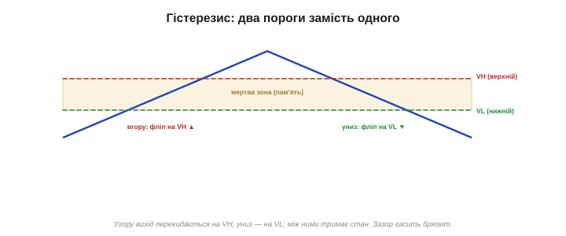
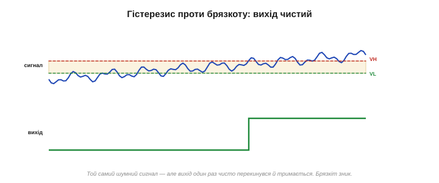
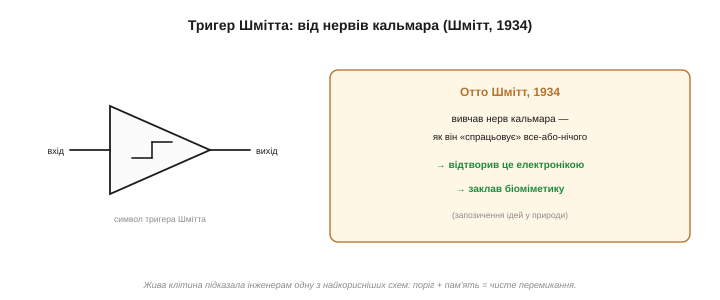

# Гістерезис і тригер Шмітта

Простий [компаратор](book:electronics/comparator-2) має прикру ваду: він потерпає від **дребезгу**, коли сигнал зависає біля свого єдиного гострого порога — найменший шум совгає вихід туди-сюди. Полагодити це можна красивим прийомом — **гістерезисом**. А реалізує його той самий **додатний** зворотний зв'язок, що для лінійних схем був би [ворогом](book:electronics/negative-feedback). Тут він стає рятівником.

### Ідея: два пороги замість одного

Корінь дребезгу — у тому, що поріг **один**. Сигнал гуляє довкола нього — і вихід гуляє слідом. А що, як зробити **два** пороги?

- щоб **увімкнути** (перекинути вихід угору), сигнал має піднятися до **верхнього** порога VH;
- щоб **вимкнути** назад, він має опуститися аж до **нижнього** порога VL;
- а **між** ними вихід **тримає** свій стан, не звертаючи уваги на дрібні коливання.

Ось ця «нечутлива» смуга між двома порогами — і є **гістерезис** *(hysteresis)*. У ній вихід немовби **пам'ятає**, куди він уже перекинувся, і не передумує, поки сигнал не зайде рішуче з іншого боку. Дребезг зникає: щоб вихід перекинувся назад, сигналові тепер замало крихітного шуму — треба пройти **всю** відстань між порогами.

*Рис. Два пороги замість одного. Угору вихід перекидається на верхньому порозі, униз — на нижньому; між ними тримає стан. Ця «нечутлива смуга» — гістерезис; вона й гасить дребезг.*

### Як це робить додатний зворотний зв'язок

Звідки беруться два пороги? Із **додатного** зворотного зв'язку — коли частину виходу повертають не на «−» (як у лінійних схемах), а на **неінвертуючий «+»**. І ось що тоді стається.

Поріг компаратора — це напруга на «+». Якщо туди підмішати частину **виходу**, то поріг почне **залежати від стану виходу**:

- вихід **угорі** → він підмішує **плюс** до «+» → поріг **піднявся** (став VH);
- вихід **унизу** → підмішує **мінус** → поріг **опустився** (став VL).

Тобто щойно вихід перекинувся, поріг **відсувається геть** від сигналу — у бік, куди пішов вихід. Сигналові, щоб повернути вихід назад, доводиться долати вже **дальший** поріг. Це і є додатний зв'язок у дії: він **підштовхує** зміну, через що перемикання стає різким («клац»), а стан — **липким**.

*Рис. Реалізація. Частину виходу повертають на «+». Вихід угорі — поріг піднявся; вихід унизу — опустився. Поріг тікає від сигналу в бік виходу — звідси й два рівні спрацювання.*

Ширину гістерезису задає, яку **частку** виходу повертають на «+»: більша частка — дальші один від одного пороги, ширший зазор. А ще додатний зв'язок дає схемі **лавинність**: щойно вихід рушив, він підмішує собі ще, що штовхає його далі, що підмішує ще більше — і вихід **зривається** до рейки за мить, без жодного зависання посередині. Тому перехід виходить блискавично різким — справжній «клац», а не повільне сповзання.

### Петля на передатній кривій

Якщо намалювати «вихід від входу», гістерезис проступає як **петля**. Ведемо сигнал угору — вихід тримається низько аж до VH, там стрибає вгору. Ведемо назад униз — вихід тримається високо аж до VL, там падає. Шлях «туди» й «назад» **не збігається** — між ними зяє та сама нечутлива смуга. Саме ця незбіжність (петля) і означає, що прилад **пам'ятає** свою історію: його стан залежить не лише від того, де сигнал **зараз**, а й від того, **звідки** він прийшов.

*Рис. Гістерезисна петля. Угору перемикання на VH, униз — на VL; шляхи не збігаються. Ширина петлі — глибина гістерезису. Незбіжність означає «пам'ять»: стан залежить і від того, звідки прийшов сигнал.*

Простежмо на числах. Хай нижній поріг VL = 2.0 В, верхній VH = 3.0 В. Сигнал повзе знизу вгору: вихід тримається низько — 1 В, 2 В, 2.9 В усе ще низько — і лише на 3.0 В перекидається вгору. Тепер сигнал повзе назад: вихід тримається високо — 2.5 В, 2.1 В усе ще високо — і падає аж на 2.0 В. Зазор 1 В між порогами — і є гістерезис: у цій смузі вихід «глухий» до сигналу, хоч би як той колихався.

Скільки ж брати? Правило просте: зазор роблять помітно **більшим за розмах шуму**. Тремтить сигнал на ±20 мВ — постав зазор хоча б 100–200 мВ, і шум зникне безслідно. Завеликий зазор теж недобрий: поріг розмивається, а реакція стає млявою (треба чекати, поки сигнал пройде всю широку смугу). Тож обирають найвужчий зазор, який ще певно перекриває шум.

> 🧮 **Як порахувати пороги.** Звідки беруться VH і VL і як їх дібрати двома резисторами — у формулі ΔV = (Voh − Vol)·R1/R2 (ширину задає відношення резисторів, центр — опора): покрокова методика й приклад на цих самих 2…3 В — у математичній вставці [«Розрахунок порогів гістерезису»](book:electronics/schmitt-trigger/math-hysteresis-calc.md).

### Чому дребезг зникає

Тепер видно, чому шум більше не страшний. Хай вихід щойно перекинувся вгору на VH. Щоб перекинути його назад, сигнал має впасти аж до VL — на всю ширину гістерезису. Якщо шум **менший** за цю ширину (а її задають навмисне більшою за очікуваний шум), він просто **не дотягне** до нижнього порога — і вихід стоятиме твердо. Один чистий перехід замість сотні брудних.

*Рис. Гістерезис проти дребезгу. Зашумлений сигнал, що раніше тремтів на одному порозі: тепер, перекинувшись, вихід тримається, бо шум менший за зазор між порогами. Один чистий перехід замість тремтіння.*

> 🔧 **Навіщо це.** Запам'ятайте суть гістерезису: **два пороги й пам'ять стану**, реалізовані **додатним** зворотним зв'язком (на «+»). Ширину зазору ставлять трохи **більшою за очікуваний шум** — тоді дрібні коливання вихід ігнорує, а на справжню зміну реагує чітко. Плата за це — поріг уже не одне точне число, а смуга; тож для дуже точного порога гістерезис роблять вузьким, для брудного сигналу — широким. Баланс між завадостійкістю й точністю.

> ⚙️ **Зберімо наживо.** Повний робочий пристрій із цієї ідеї — автоматичний нічник із фоторезистора й тригера Шмітта, що вмикається в сутінках і **не миготить** від хмар чи фар (усе на аналоговому залізі, без коду): покрокова збірка й логіка стану — в [алгоритмічній вставці «Нічник без миготіння»](book:electronics/schmitt-trigger/proj-light-threshold.md).

### Знайома річ: термостат

Ви користуєтеся гістерезисом щодня, навіть не думаючи. **Термостат** опалення вмикає котел, скажімо, на 19 °C, а вимикає аж на 21 °C — і навмисне **не** перемикається рівно на 20°. Якби поріг був один (20°), котел брязкав би ввімк-вимк щохвилини, ледь температура колихнеться. Два пороги (19° і 21°) дають спокійні, рідкі цикли. Ця «мертва зона» *(deadband)* між увімкненням і вимкненням — і є гістерезис у чистому вигляді, тільки для температури.

*Рис. Гістерезис, який ви знаєте. Термостат гріє до 21 °C, тоді вимикається; знову вмикається лише як охолоне до 19 °C. «Мертва зона» 19–21° не дає котлу брязкати на межі. Те саме, що в електронному тригері.*

### Тригер Шмітта — і трохи біології

Компаратор із гістерезисом має власну назву — **тригер Шмітта** *(Schmitt trigger)*. За нею стоїть гарна історія. 1934 року американський біофізик **Отто Шмітт** *(Otto H. Schmitt)*, тоді ще аспірант, вивчав, як нервовий імпульс біжить уздовж нервів — зокрема велетенських нервів кальмара. Він захотів **відтворити електронікою** ту саму «все-або-нічого» поведінку нейрона: нерв або «спрацьовує» цілком, або мовчить, і не тремтить на півдорозі. Так народився тригер Шмітта — схема, що бере приклад із живої клітини. Шмітт же згодом і ввів слово **«біоміметика»** *(biomimetics)* — запозичення інженерних ідей у природи.

*Рис. Тригер Шмітта — компаратор із гістерезисом. Його позначають трикутником зі значком петлі всередині. Народився 1934-го з вивчення «все-або-нічого» нервового імпульсу кальмара; Отто Шмітт відтворив поведінку нейрона електронікою й заклав біоміметику.*

Аналогія з нервом глибша, ніж здається. Нейрон теж має **поріг** збудження й «все-або-нічого» відповідь, а після спрацювання — короткий період нечутливості, коли його годі змусити спрацювати знову. Це жива гістерезис-петля: рішуча реакція плюс «пам'ять», що не дає тремтіти. Шмітт побачив у цьому інженерний прийом. До речі, йому належать — одноосібно чи в співавторстві — і **диференційний підсилювач** — основа входу кожного [операційного підсилювача](book:electronics/ideal-opamp), — і чопер-стабілізований підсилювач: один біофізик, що порався з нервами кальмара, подарував електроніці кілька наріжних схем заразом.

### Де він стає в пригоді

Тригер Шмітта — усюди, де треба зробити з брудного або повільного сигналу **чисте** перемикання:

- **очистити** зашумлений сигнал давача чи кнопки (усунути дребезг);
- зробити **різкі цифрові фронти** з повільно наростаючої напруги (входи логічних мікросхем часто мають вбудований тригер Шмітта саме для цього);
- **усунути брязкіт кнопки** *(debounce)*: механічний контакт, замикаючись, кілька мілісекунд **відскакує** й дає не один чистий перехід, а пачку — без гістерезису мікроконтролер нарахував би десяток натискань замість одного;
- збудувати **генератор**: тригер Шмітта плюс [RC-ланка](book:electronics/rc-time-constant) самозбуджуються й видають прямокутні імпульси — простий релаксаційний генератор, де гістерезис і RC задають частоту.

Як саме тригер Шмітта генерує? Вихід заряджає конденсатор крізь резистор; коли напруга на ньому доходить до верхнього порога — вихід перекидається й починає конденсатор **розряджати**; той падає до нижнього порога — вихід знову перекидається, і так без кінця. Конденсатор гойдається між двома порогами, а вихід видає прямокутні імпульси. Жодного зовнішнього сигналу не треба — схема «дзвонить» сама. Так роблять найпростіші генератори тактів, блимавки й пищалки. Частоту такого генератора задають [стала часу RC](book:electronics/rc-time-constant) і ширина гістерезису: більший R чи C — повільніше блимання. Жодного кварцу чи зовнішнього такту — кілька копійчаних деталей, і маєш джерело імпульсів.

Готові тригери Шмітта продають і окремими мікросхемами (класична 74HC14 — шість штук в одному корпусі): ними зручно «причесати» будь-який брудний чи повільний цифровий сигнал, перш ніж віддати його логіці, без жодної зовнішньої обв'язки. Тож тригер Шмітта — не лише схема на ОП, а й щоденна готова цеглинка, що тихо стоїть на входах безлічі чипів і береже їх від брудних фронтів.

> 🔧 **Навіщо це.** Практичне правило: **бачиш дребезг — додай гістерезис**. Майже щоразу, коли компаратор чи поріг «брязкає», лікують це двома порогами (тригером Шмітта) — у залізі парою резисторів додатного зв'язку, а в коді мікроконтролера — програмним гістерезисом (вмикай на одному значенні, вимикай на іншому). Це той самий принцип, що й у термостата, і він уберігає від мерехтіння, тріску реле та хибних спрацювань.

У коді мікроконтролера це виглядає буквально як дві умови: «якщо T > 21 — вимкни», «якщо T < 19 — увімкни», а між 19 і 21 — нічого не міняй. Жодного заліза, та сама ідея. Тому, читаючи давач у проєкті, варто одразу закладати гістерезис у логіку — інакше «розумний» вимикач мерехтітиме на межі так само, як голий компаратор.

### Найпростіша пам'ять — і два обличчя зв'язку

Цікаво й те, що тригер Шмітта — по суті **найпростіша пам'ять** в електроніці: він тримає свій стан (один біт — «увімкнено» чи «вимкнено»), доки сигнал не зайде рішуче з іншого боку. Звідси один крок до тригерів і клітинок пам'яті цифрової техніки, де «залипання» стану роблять навмисне й надовго.

А ще тут проступають **обидва обличчя** зворотного зв'язку. [Від'ємний](book:electronics/negative-feedback) (на «−») — вгамовує, дає точні [лінійні схеми](book:electronics/summing-difference-amp), де ОП тримає входи рівними. **Додатний** (на «+») — навпаки, розганяє й «защіпає» стан, дає різке перемикання та пам'ять (тригер Шмітта). Та сама петля, протилежний знак — і два цілі світи застосувань ОП. Сплутати їх — болюча помилка; розуміти різницю — половина майстерності роботи з операційним підсилювачем.

### Коротко про головне

Гістерезис — це два пороги й пам'ять, що їх дає додатний зворотний зв'язок; компаратор із гістерезисом — тригер Шмітта, родом із нервів кальмара. Він гасить дребезг і робить чисті переходи з брудних сигналів. Усе це тримається на простій ідеї: повертаєш частину виходу на «+» — і єдиний поріг розщеплюється на два, між якими вихід глухий до шуму. Бачиш брязкіт на межі — згадай про два пороги, і він зникне.
