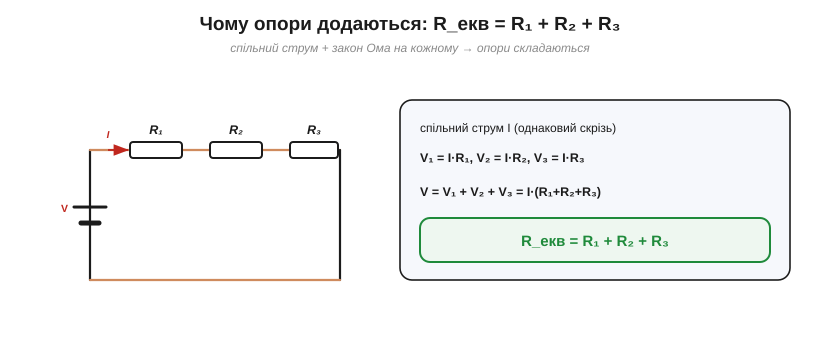
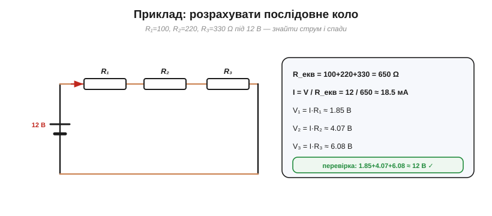
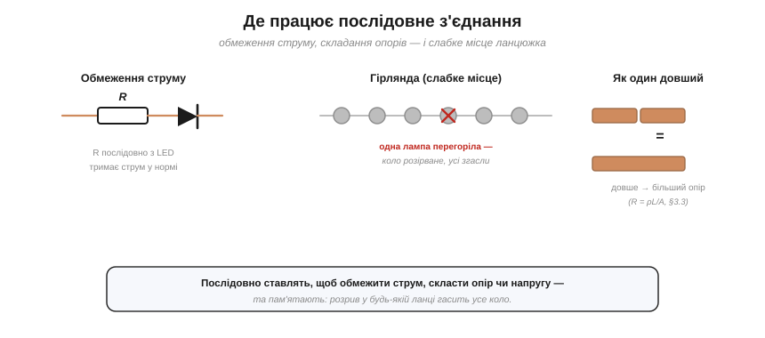

# Послідовне з'єднання

Найпростіший спосіб з'єднати елементи — **послідовний**, коли вони стоять **одне за одним** в одній гілці, як вагони потяга. Послідовно — означає [спільна гілка](book:electronics/nodes-branches-loops): розгалужень нема. З цього випливає головний практичний результат — як рахувати опір такого ланцюжка.

### Два факти: спільний струм, напруги додаються

Послідовне коло має дві визначальні властивості, і обидві — прямі наслідки законів Кірхгофа.


*Рис. Послідовне коло: елементи стоять одне за одним в одній гілці. Звідси два факти — ① струм I однаковий у кожному (закон струмів), ② повна напруга дорівнює сумі спадів, V = V₁ + V₂ + V₃ (закон напруг).*

**Перше: струм скрізь однаковий.** Оскільки гілка одна й розгалужень нема, той самий струм I тече крізь усі елементи поспіль — це прямо з [закону струмів](book:electronics/kcl). **Друге: напруги додаються.** Обходячи контур, повна напруга джерела розподіляється між елементами: V = V₁ + V₂ + V₃ — це [закон напруг](book:electronics/kvl). Запам'ятайте цю пару: **спільний струм, сумарна напруга** — вона визначає все інше.

Образ простий: послідовні елементи — як намистини на одній нитці чи машини на вузькій однорядній дорозі. Пройти можна лише **гуськом**, тож потік (струм) крізь кожну ланку однаковий, а загальний спротив дорозі складається з усіх ділянок поспіль.

### Опори додаються: R_екв = R₁ + R₂ + …

Тепер головне. Із цих двох фактів випливає напрочуд проста відповідь на питання «який опір у всього ланцюжка?».


*Рис. Чому опори додаються: струм спільний, тож V = V₁+V₂+V₃ = I·R₁ + I·R₂ + I·R₃ = I·(R₁+R₂+R₃). Порівнявши з V = I·R_екв, дістаємо R_екв = R₁ + R₂ + R₃.*

Виведення коротке. Спад на кожному резисторі — за законом Ома: V₁ = I·R₁, V₂ = I·R₂, V₃ = I·R₃ (струм I **спільний**). Сума їх дає повну напругу:

V = V₁ + V₂ + V₃ = I·R₁ + I·R₂ + I·R₃ = I·(R₁ + R₂ + R₃).

Порівняймо це з законом Ома для всього кола, V = I·R_екв, — і відповідь очевидна: **послідовні опори просто додаються**.

R_екв = R₁ + R₂ + R₃ + …

Правило діє для скількох завгодно резисторів — просто додавайте опори по черзі. А для n **однакових** резисторів воно дає зручне R_екв = n·R: п'ять резисторів по 100 Ω, увімкнені поспіль, — це рівно 500 Ω.

### Один еквівалентний резистор

Це означає, що ціле гроно послідовних резисторів можна замінити **одним** еквівалентним — і джерело «не помітить» різниці: той самий струм, та сама напруга.


*Рис. Для джерела ланцюжок із трьох резисторів нічим не відрізняється від одного еквівалентного R_екв = R₁+R₂+R₃ = 650 Ω. Послідовне з'єднання завжди **збільшує** опір — R_екв більший за будь-який окремий.*

Зверніть увагу на важливий наслідок: **послідовне з'єднання завжди збільшує опір**. Кожен доданий у ланцюжок резистор лише нарощує R_екв, тож він неминуче **більший за будь-який окремий** опір у ньому. (Інтуїтивно — як подовжити провідник: довше → більший опір, рівно як у формулі [R = ρL/A](book:physics/resistivity).) Заміна групи елементів одним еквівалентним — це й є основний прийом **спрощення** кіл. Велике плетиво резисторів [розплутують](book:electronics/circuit-analysis) саме **крок за кроком**: знайшли послідовну групу — згорнули її в один R_екв; знайшли [паралельну](book:electronics/parallel-connection) — згорнули й її; і так, доки від цілої схеми не лишиться єдиний еквівалентний опір, з яким струм від джерела рахується одним діленням.

### Приклад: розрахувати коло

Зведімо все в типовий розрахунок.

**Приклад. Три резистори 100, 220 і 330 Ω з'єднані послідовно під 12 В. Знайти струм і спад на кожному.**

```
Еквівалентний опір:  R_екв = 100 + 220 + 330  = 650 Ω
Спільний струм:      I = V / R_екв = 12 / 650  ≈ 18.5 мА
Спади:               V₁ = I·100 ≈ 1.85 В
                     V₂ = I·220 ≈ 4.07 В
                     V₃ = I·330 ≈ 6.08 В
Перевірка:           1.85 + 4.07 + 6.08 ≈ 12 В  ✓
```


*Рис. Розрахунок: спершу R_екв = 650 Ω, потім спільний струм I = 12/650 ≈ 18.5 мА, далі спад на кожному V = I·R. Сума спадів повертає 12 В — перевірка зійшлася.*

Алгоритм універсальний: **складаємо опори → знаходимо спільний струм → шукаємо спади**. І завжди корисно перевірити себе: сума спадів **мусить** дорівнювати напрузі джерела (KVL). Якщо не сходиться — десь помилка.

### Прихований послідовний опір

Послідовні опори бувають не лише навмисні. Будь-яке реальне джерело має [внутрішній опір](book:electronics/internal-resistance), увімкнений послідовно з навантаженням; саме на ньому «губиться» частина напруги, і тому батарейка під навантаженням **просідає**. Так само послідовно додається [опір довгих дротів](book:physics/resistivity) — звідси падіння напруги на лінії. Тому, рахуючи реальне коло, не забувайте про ці **сховані** послідовні опори: вони цілком справжні, хоч і не намальовані окремим резистором, і теж **додаються** в загальну суму.

### Де це працює


*Рис. Послідовне з'єднання: обмежують струм (резистор перед світлодіодом), складають опір (як один довший провідник, R = ρL/A) — але мають слабке місце: розрив у будь-якій ланці гасить усе коло (класична гірлянда).*

Послідовне з'єднання — щоденний прийом. У ньому ставлять [струмообмежувальний резистор](book:electronics/resistor) перед світлодіодом: додатковий опір зменшує струм до безпечного. Скільки саме додати — рахують просто: зайву напругу поділити на бажаний струм (R = V_зайве / I). Так само складають опори чи напруги, коли потрібного номіналу нема під рукою. Але є й **слабке місце**: оскільки струм тече одним шляхом, **розрив у будь-якій ланці гасить усе коло**. Класика — старі ялинкові **гірлянди**: перегоріла одна лампочка — і темніє вся низка, а шукай потім винну. Це зворотний бік «спільного струму»: ланцюг міцний рівно настільки, наскільки міцна його найслабша ланка. Тому в сучасних гірляндах лампи доповнюють крихітним **шунтом**: щойно нитка перегоряє, струм іде в обхід неї, і решта низки світить далі.

> 🔧 **Навіщо це.** Три речі варто винести. Перше: **послідовно опори додаються** (R_екв = ΣR) — і завжди дають більше за кожен; це найшвидший спосіб підняти опір чи **обмежити струм** (згадайте резистор для LED). Друге: напруга в ланцюжку **ділиться** (звідси [подільник](book:electronics/voltage-divider)). Третє, практичне: послідовне коло **крихке** — будь-який обрив зупиняє все; тому, до речі, **запобіжник** і вмикають послідовно (хай рветься він, а не цінне навантаження). Бачите низку елементів «гуськом» — одразу думайте «спільний струм, опори й напруги додаються».

---

Підсумок: у **послідовному** колі струм **спільний**, напруги **додаються** (V = ΣVᵢ), а опори — теж **додаються**: R_екв = R₁ + R₂ + …, і завжди більший за кожен окремий. Звідси простий алгоритм (скласти опори → струм → спади) і прийом спрощення схем заміною групи на еквівалент. Послідовно обмежують струм і складають напругу, та платять крихкістю: один обрив гасить усе. **Протилежне** з'єднання — [паралельне](book:electronics/parallel-connection), де спільною стає напруга.

---
