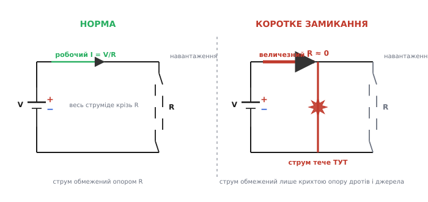
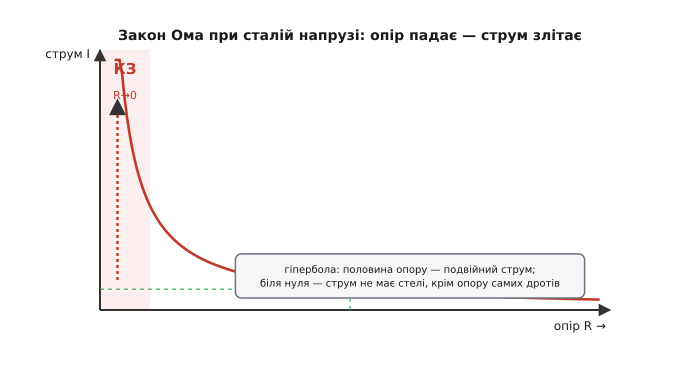
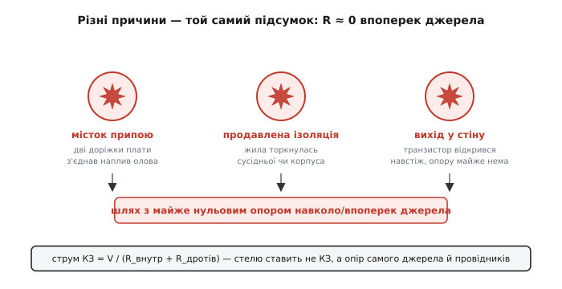

# Коротке замикання

Слово тут описує не поломку, а геометрію. «Коротке» (англ. *short* — короткий) у назві означає, що струм знайшов **коротший шлях**, ніж той, яким мав іти: замість пройти крізь навантаження, він перескочив навпростець із одного полюса джерела на інший майже без опору на дорозі. Сам термін *short circuit* усталився в англійській технічній мові ще в середині XIX століття (за словниками, «shunt» — обвідний шлях низького опору — датується 1854 роком), коли інженери телеграфу помітили: варто двом дротам випадково зіткнутися, і струм ринув повз апарат, гріючи все на своєму скороченому шляху.

Уся драма короткого замикання ховається в одному законі, який тут працює безжально прямо. [Закон Ома](topic:electronics/ohms-law) каже, що струм крізь ділянку дорівнює напрузі, поділеній на опір:

```
I = V / R
```

Погляньте, що станеться, коли опір шляху падає майже до нуля. Напруга джерела нікуди не ділася — вона й далі, скажімо, 12 вольтів. А опір у знаменнику стає крихітним. Ділення на щось близьке до нуля дає число, що злітає вгору без стелі. Ось і вся суть: **коротке замикання — це поява шляху з майже нульовим опором, і закон Ома негайно перетворює цей нуль у знаменнику на величезний струм**. Не «щось зламалося абстрактно» — а конкретна арифметика, у якій мале число внизу дробу породжує велике число зверху.


*Два стани однієї схеми. У нормі весь струм проходить крізь навантаження R, і саме R задає його величину: I = V/R. При короткому замиканні виникає обвідний шлях з опором майже нуль; струм кидається в нього, бо там йому «легше», і його вже не стримує навантаження — лишається тільки крихта опору самих дротів і джерела.*

## Чому струм злітає, а не просто трохи зростає

Легко подумати, ніби менший опір дає пропорційно більший струм — удвічі менший опір, удвічі більший струм. Так і є, поки опір лишається помітним. Але зв'язок тут не лінійний, а **гіперболічний**: I = V/R — це крива, що біля нуля опору здіймається дедалі крутіше. Пройдіть по ній подумки. Опір 6 ом при 12 вольтах дає 2 ампери. Опір 1 ом — уже 12 ампер. Опір 0.1 ома — 120 ампер. Опір 0.01 ома — 1200 ампер. Кожне десятикратне зменшення опору десятикратно збільшує струм, і кінця цьому нема, поки в знаменнику лишається хоч якийсь опір.


*Гіпербола закону Ома при незмінній напрузі. Права частина, де опір великий, — спокійна: струм малий і слухняний. Що ближче опір до нуля (ліворуч), то крутіше здіймається крива. У точці справжнього короткого замикання опір навантаження вже не тримає струм зовсім — стелю ставить лише те, що завжди лишається: опір самих дротів і внутрішній опір джерела.*

Саме тому коротке замикання таке підступне. Не буває «легкого» короткого — щойно опір падає нижче за опір самого навантаження, струм починає рости лавиноподібно. Різниця між «дріт трохи торкнувся» і «дріт торкнувся щільно» — це різниця між десятками й тисячами ампер.

> 🔧 **Навіщо це.** Коли ви проєктуєте будь-що з живленням, ви фактично весь час запитуєте: «а що станеться, якщо ось тут опір раптом стане нулем?». Це не паранойя — це те, як думає інженер про надійність. Провід перетреться об гострий край корпуса, крапля припою з'єднає дві сусідні доріжки на платі, вологa наведе місток між контактами, транзистор пробʼється — і схема, що спокійно тягла свій ампер, раптом мусить віддати сотні. Питання лише в тому, чи ви це передбачили й поставили заслін, чи все згорить першим.

## Що насправді таке «майже нульовий опір»

У формулі I = V/R приваблива фантазія, ніби опір може стати справжнім нулем, а струм — справжньою нескінченністю. У реальному світі нуля не буває. Навіть найтовщий мідний дріт має якийсь опір; навіть краплина припою, що з'єднала дві доріжки, має свої міліоми. Тож струм короткого замикання не нескінченний — він упирається в те, що лишається в колі, коли навантаження вже вибуло з гри.

А лишаються дві речі. Перша — опір самих провідників: дротів, доріжок плати, контактів, тієї ж перемички. Друга, і головна, — [внутрішній опір джерела](topic:electronics/internal-resistance). Жодне джерело не є ідеальним: батарея, блок живлення, вихід мікросхеми — усі мають усередині свій невеликий опір, крізь який їхній струм мусить пройти, перш ніж вийти назовні. У нормальній роботі цей внутрішній опір непомітний, бо він набагато менший за опір навантаження й майже не впливає на струм. Але при короткому замиканні навантаження зникає, і саме внутрішній опір раптом стає **єдиним, що стримує струм**. Він і задає стелю:

```
I_кз = V / (R_внутр + R_дротів)
```

> Що треба знати про внутрішній опір: будь-яке реальне джерело поводиться як ідеальне джерело напруги, послідовно з яким сидить невеликий опір, схований усередині (для батареї — опір її хімії й електродів, для блока живлення — опір його вихідних кіл). Через цей опір проходить увесь струм джерела, тож на ньому падає напруга, яка тим більша, чим більший струм. У нормі він малий проти навантаження й непомітний; при короткому замиканні саме він визначає, скільки ампер джерело здатне віддати, і скільки з цих ампер осяде теплом усередині нього самого.

Ось чому природа короткого замикання так залежить від джерела. Закоротьте маленьку батарейку від пульта — вона гріється, сідає, але великої біди нема: її внутрішній опір чималий, тож струм КЗ невеликий. Закоротьте автомобільний акумулятор — його внутрішній опір мізерний, лічені міліоми, тож струм КЗ сягає сотень ампер, дріт спалахує, як волосок лампи, а сам акумулятор може закипіти й луснути. Те саме джерело напруги на клемах — але зовсім різна здатність вивергати струм, і різниця вся в тому опорі, що схований усередині.


*Причини бувають різні, а фізика — одна. Наплив олова між доріжками, притерта до корпуса жила без ізоляції, транзистор, що відкрився навстіж без обмеження, — усе це той самий обвідний шлях майже без опору навколо джерела. І що б не спричинило замикання, величину струму визначає не воно, а те, що завжди лишається в колі: внутрішній опір джерела плюс опір провідників.*

## Дві біди, що приходять із коротким замиканням

Великий струм сам собою ще не пояснює, чому коротке замикання — це небезпека. Небезпек насправді дві, і вони різні за природою.

Перша — **тепло**. Будь-який провідник зі струмом виділяє теплову потужність, і росте вона не з струмом, а з його **квадратом**:

```
P = I² · R
```

Квадрат тут вирішує все. Подвоївся струм — потужність учетверо; вдесятеро більший струм — у сто разів більше тепла на тому самому шматку дроту. Тому струм короткого замикання, у десятки разів більший за робочий, гріє провідники не в десятки, а в сотні й тисячі разів сильніше. Тонкий дротик, розрахований на свій ампер, при короткому замиканні дістає стільки тепла, що не встигає його віддати — і розжарюється, плавить ізоляцію, підпалює все довкола. Саме на цьому квадратичному законі, до речі, тримається й порятунок: [запобіжник](topic:electronics/fuse-types) — це навмисне найтонше й найлегкоплавкіше місце кола, яке перегріється й перегорить першим, розірвавши коло, поки решта ще ціла.

> 🔧 **Навіщо це.** Квадратична залежність — причина, чому переріз проводу й ширину доріжки на платі рахують саме під струм короткого замикання, а не під робочий. Провід, що спокійно несе робочі 3 ампери, у режимі КЗ мусить кілька мілісекунд протримати, скажімо, 200 ампер, поки спрацює захист, — і не перегоріти раніше за запобіжник. Розрахунок на струм КЗ — це розрахунок на найгіршу мить, а не на буденну.

Друга біда тонша й часто небезпечніша за саме тепло — **обвал напруги**. Коли джерело віддає величезний струм КЗ, на його внутрішньому опорі падає велика напруга (адже падіння на ньому — це той самий I·R, а струм тепер шалений). А що більше напруги осідає всередині джерела, то менше лишається на клемах. У межі, при жорсткому короткому, напруга на виході джерела просідає майже до нуля. І ось тут криється підступ: коротке замикання в одному кутку схеми **садить напругу для всіх інших**, хто живиться від того самого джерела. Закоротило один вузол — а перезавантажився весь пристрій, бо просіла шина живлення, від якої годується й процесор, і пам'ять, і все решта. Ця «просадка» шини — часта причина загадкових збоїв, коли справжнє коротке ховається зовсім не там, де проявляється лихо.

## Коротке замикання не завжди аварія

Досі йшлося про коротке замикання як про поломку. Але той самий прийом — навмисно з'єднати дві точки провідником з нехтовно малим опором — інженери щодня використовують свідомо, і тоді це не біда, а інструмент.

Найпростіший приклад — **перемичка** (англ. *jumper*): шматок дроту чи крапля припою, якою навмисне закорочують два контакти, щоб задати режим плати або замкнути непотрібну ділянку. Дротова перемичка на платі — це буквально навмисне коротке замикання з корисною метою. Так само чинить будь-який замкнений вимикач чи реле: замкнув контакти — і зробив між ними шлях майже без опору, тобто коротке замикання того проміжку.

Різниця між корисним замиканням і аварійним — не у фізиці, а в тому, **де** воно й **чи передбачене**. Замкнути вимикачем дві точки, між якими стоїть навантаження, — робота за призначенням. Замкнути навпростець полюси джерела, повз усяке навантаження, — аварія. Фізика однакова (шлях майже без опору), наслідок протилежний, бо в першому разі струм усе одно тече крізь корисний опір десь у колі, а в другому йому нíчого стримувати.

Є й прийом, де замикання рятує навмисно й агресивно — **обмежувальний ланцюг** (англ. *crowbar*, «лом»): захисна схема, що при небезпечному стрибку напруги сама навмисне закорочує живлення напряму, свідомо викликаючи потужне коротке замикання. Здавалося б, самогубство — та мета саме така: різкий струм КЗ миттю садить напругу й спалює запобіжник, і крихке навантаження не встигає постраждати від перенапруги. Замикання тут — не аварія, а керована пожежна сокира, якою рубають живлення, щоб урятувати те, що дорожче.

## Скільки струму насправді потече: приклад

**Умова.** Літій-полімерний акумулятор має напругу на клемах 3.7 В і внутрішній опір 30 міліом (0.030 Ом). Хтось випадково закоротив його клеми шматком дроту, опір якого 20 міліом (0.020 Ом). Який струм потече в момент замикання і яку теплову потужність доведеться розсіювати цьому дротику?

Порахуймо це прямо в коді прошивки — так, як міг би оцінити небезпеку контролер батареї, знаючи параметри елемента:

:::tabs
```c
// Оцінка струму й тепла при короткому замиканні клем акумулятора.
// Усе в СІ: вольти, оми, ампери, вати.
float v_cell   = 3.7f;      // напруга елемента на клемах
float r_intern = 0.030f;    // внутрішній опір елемента, Ом
float r_wire   = 0.020f;    // опір дроту-перемички, Ом

float r_total = r_intern + r_wire;   // усе, що стримує струм при КЗ
float i_short = v_cell / r_total;    // закон Ома: I = V / R

// Тепло виділяється всюди, де є опір і струм (P = I²·R).
float p_wire  = i_short * i_short * r_wire;      // гріється дріт
float p_cell  = i_short * i_short * r_intern;    // гріється сам елемент усередині
```
```python
# Оцінка струму й тепла при короткому замиканні клем акумулятора.
# Усе в СІ: вольти, оми, ампери, вати.
v_cell   = 3.7      # напруга елемента на клемах
r_intern = 0.030    # внутрішній опір елемента, Ом
r_wire   = 0.020    # опір дроту-перемички, Ом

r_total = r_intern + r_wire    # усе, що стримує струм при КЗ
i_short = v_cell / r_total     # закон Ома: I = V / R

# Тепло виділяється всюди, де є опір і струм (P = I²·R).
p_wire = i_short**2 * r_wire       # гріється дріт
p_cell = i_short**2 * r_intern     # гріється сам елемент усередині
```
:::

Підставмо числа крок за кроком:

```
r_total = 0.030 + 0.020 = 0.050 Ом
i_short = 3.7 / 0.050    = 74 А          ← струм короткого замикання
p_wire  = 74² · 0.020   = 5476 · 0.020 ≈ 110 Вт   ← на тонкому дроті
p_cell  = 74² · 0.030   = 5476 · 0.030 ≈ 164 Вт   ← усередині елемента
```

Сімдесят чотири ампери з елемента завбільшки з сірникову коробку. Дріт-перемичка, що в нормі й ватта не бачив, мусить розсіяти сотню з гаком — він розжариться до жару за частку секунди й спалить усе, чого торкнеться. Але страшніше інше: понад півтори сотні ватів виділяється **всередині самого акумулятора**, на його внутрішньому опорі, де тепло дітися нікуди. Саме тому закорочений літієвий елемент не просто гріється, а може піти в тепловий розгін і спалахнути — небезпека тут не в дроті, а в тому, що джерело пече само себе зсередини. Ось чому в кожен літієвий акумулятор вбудовують схему захисту, що обриває струм, щойно він перевищить безпечну межу.

## Як від нього захищаються

Раз коротке замикання зводиться до «завеликий струм крізь замалий опір», то й усі способи оборони зводяться до одного: **не дати струму рости безмежно** або **встигнути розірвати коло, поки не сталося лиха**.

Найдавніший і найпростіший заслін — **запобіжник**: навмисно ослаблена ланка, тонка дротинка, розрахована перегоріти від перегріву раніше за все інше в колі. [Ідея жертовної дротинки старша за Едісона](topic:electronics/short-circuit/hist-fuse-lineage.md) — плавкі запобіжники захищали ще телеграфні лінії в 1860-х, а до розетки їх привів патент Едісона 1890 року. Струм КЗ розжарює її за мілісекунди, вона плавиться, коло рветься — і решта схеми ціла. Плату такого «слабкого місця» окупає простота: запобіжник не має логіки, він просто мусить згоріти першим. Спорідненик його — **автоматичний вимикач**, що при надструмі не згоряє, а розмикається механізмом і потім вмикається знову; та сама ідея розриву кола, лише багаторазова.

Розумніший підхід — **обмеження струму** (англ. *current limiting*): не чекати аварії, а поставити на шляху струму активний елемент, який стежить за струмом і не пускає його вище за поріг, хай би опір навантаження впав хоч до нуля. Багато мікросхем живлення роблять це самі, вбудовано: у них є [захист від надструму](topic:electronics/overcurrent-protection), що при короткому замиканні або обмежує струм безпечним значенням, або взагалі вимикає вихід і чекає, поки замикання приберуть. На цій ідеї збудований і [електронний запобіжник](topic:electronics/efuse) — активний ключ, що вимикає навантаження за мікросекунди й вмикається сам, коли небезпека минула, не потребуючи заміни, як звичайний плавкий.

Найтонший рівень оборони — самі властивості джерела. Джерело з великим внутрішнім опором фізично не здатне віддати руйнівний струм — воно «м'яке», і закоротити його не так страшно. Тому там, де це прийнятно, живлення роблять свідомо слабким, щоб коротке замикання просто садило напругу, а не спалювало все. Це не завжди можливо (потужним споживачам потрібне «жорстке» джерело), але сама ідея важлива: **іноді найкращий захист від короткого замикання — джерело, якому воно не страшне**.

За всіма цими способами стоїть та сама думка, з якої почалася стаття. Коротке замикання — це нуль, що з'явився в знаменнику закону Ома. Уся інженерія захисту — це способи не дати цьому нулю перетворитися на нескінченність: або обмежити струм зверху, або розірвати коло, або зробити джерело таким, щоб навіть закорочене воно не наробило біди.
