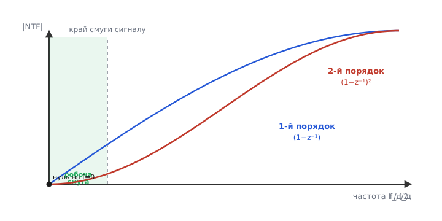
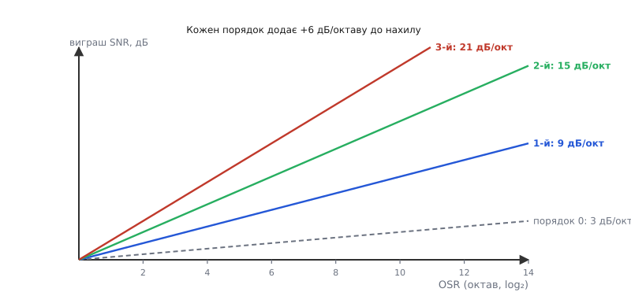

# 🧮 Математика формування шуму: звідки беруться 9 дБ на октаву

Формування шуму (англ. noise shaping) — фокус, який звучить майже як шахрайство: грубий однобітний компаратор, що сам по собі дає сміховинне відношення сигнал/шум, у петлі раптом віддає двадцять чесних розрядів. Перша ідея, передискретизація, пояснює лише частину виграшу — і то скупу: учетверо швидше міряти, щоб виграти один-єдиний розряд. Звідки решта? Уся вона захована в одному слові «формування»: шум квантування не лишають рівним шаром, а навмисне **викривлюють** так, щоб у смузі сигналу його стало мізерно мало. Розберімо цей фокус до останнього гвинтика — означимо, що таке передавальна функція шуму, виведемо її з будови петлі, і доведемо до конкретних чисел: чому саме 9 дБ на октаву для першого порядку, 15 для другого, і чому не можна просто нарощувати порядок до нескінченності.

## Дві передавальні функції: одна для сигналу, інша для шуму

Почнімо з означення, без якого далі ніяк. Модулятор — лінійна (майже; до «майже» повернемося) система з **двома** входами і одним виходом. Перший вхід — корисний сигнал U. Другий вхід — помилка квантування E: та неминуча різниця між тим, що накопичив інтегратор, і грубим «0 або 1», яке віддав компаратор. Вихід Y — потік бітів. І ключова думка: на ці два входи система реагує **по-різному**.

> 🔧 **Навіщо це.** Уся стратегія sigma-delta тримається на тому, що сигнал і шум можна обробити нарізно. Якби петля однаково підсилювала обидва, фокус не вийшов би — точність визначав би сам компаратор. А оскільки реакції різні, інженер націлює одну з них (для шуму) так, щоб у робочій смузі вона була близька до нуля. Це і є «формування»: ви не прибираєте шум, ви ним керуєте — викидаєте туди, де він не заважає.

Реакцію лінійної системи на вхід описують **передавальною функцією** — множником, на який система помножує вхід, узятий частота за частотою. У дискретних системах цей множник записують через змінну z (про неї за хвилину), і функцій тут дві:

```
STF — signal transfer function — як петля передає СИГНАЛ U
NTF — noise  transfer function — як петля передає ШУМ E
```

Якщо позначити вхід-сигнал, шум і вихід їхніми образами U(z), E(z), Y(z), то весь модулятор у лінійному наближенні — одне-єдине рівняння:

```
Y(z) = STF(z) · U(z) + NTF(z) · E(z)
```

Вихід — це сигнал, пропущений крізь STF, плюс шум, пропущений крізь NTF. Уся гра — зробити так, щоб **STF ≈ 1** (сигнал проходить як є, неспотворений), а **NTF у смузі сигналу ≈ 0** (шум там придушено). Решта вставки — як цього домогтися самою лиш будовою петлі й що з цього випливає в числах.

## Що таке z⁻¹ і чому інтегратор — це 1/(1−z⁻¹)

Перш ніж виводити, треба чесно домовитися про одну позначку, бо без неї формули — порожні символи. У дискретному світі все відбувається тактами: відлік, наступний відлік, наступний. Операцію «взяти значення на **один такт раніше**» позначають множником **z⁻¹**. Це вся таємниця: z⁻¹ — це затримка на один крок.

```
якщо x[n] — значення зараз,
то  z⁻¹ · x  — це  x[n−1]  (те саме значення такт тому)
```

Звідки взялася саме така позначка? Вона приходить із Z-перетворення — дискретного родича перетворення Лапласа, де послідовність відліків згортають в одну функцію змінної z, і зсув у часі рівно на один такт стає множенням на z⁻¹. Нам не потрібна вся теорія; досить однієї властивості: **затримка = множення на z⁻¹**, а будь-яку дискретну схему можна записати алгеброю над z⁻¹.

Тепер найважливіше — інтегратор. Інтегратор (накопичувач) робить просту річ: до своєї суми додає нинішній вхід. Його вихід зараз — це вихід такт тому плюс вхід зараз:

```
y[n] = y[n−1] + x[n]
```

Перепишемо через z⁻¹ (y[n−1] = z⁻¹·y):

```
Y = z⁻¹·Y + X      →      Y − z⁻¹·Y = X      →      Y·(1 − z⁻¹) = X
```

Звідси передавальна функція інтегратора:

```
        Y        1
H(z) = ─── = ─────────
        X      1 − z⁻¹
```

Ось де народжується вся подальша магія. У знаменнику стоїть **(1 − z⁻¹)**. Запам'ятаймо цей вираз — він з'явиться ще не раз, і саме він даватиме шуму highpass-нахил. Інтуїтивно: знаменник (1 − z⁻¹) на дуже повільному (сталому) вході майже занулюється — бо для сталого x значення «зараз» і «такт тому» однакові, їхня різниця крихітна, і ділення на цю крихту дає величезне підсилення. На сталу складову інтегратор має нескінченне підсилення; на швидкі коливання — мале. Це формальний запис тієї фрази зі статті: «інтегратор сильно підсилює повільне й майже не реагує на швидке».

> 🔧 **Навіщо це.** Запис H = 1/(1−z⁻¹) — не математична краса заради краси. Саме він дозволяє передбачити форму спектра шуму **олівцем на папері**, ще до того як паяти модулятор. Інженер дивиться на (1−z⁻¹) у потрібному місці й одразу знає: тут буде нуль на нулі частоти, highpass, нахил +6 дБ на октаву на кожен такий множник. Уся проєктна робота над sigma-delta — це розставляння таких множників так, щоб шум придушити внизу й не розхитати петлю вгорі.

## Виводимо петлю першого порядку: звідки STF≈1 і NTF=(1−z⁻¹)

Тепер зберімо петлю з блоків і пройдімо сигнал по колу. Схема першого порядку складена так: на вході **суматор** віднімає від U зворотний сигнал (а зворотний — це сам вихід Y, бо однобітний ЦАП у простій моделі ідеальний). Різниця йде в **інтегратор** H(z) = 1/(1−z⁻¹). Вихід інтегратора потрапляє в **квантувач** (компаратор), який ми моделюємо чесно: він додає до свого входу помилку E. Тобто вихід квантувача = (його вхід) + E. Випишемо це ланцюжком.

Хай W — вихід інтегратора. Вхід інтегратора — це (U − Y), тож:

```
W = H(z)·(U − Y)              інтегратор бачить різницю вхід-вихід
Y = W + E                     квантувач: бере W і додає свою помилку E
```

Підставимо перше в друге і розв'яжемо відносно Y:

```
Y = H·(U − Y) + E
Y = H·U − H·Y + E
Y + H·Y = H·U + E
Y·(1 + H) = H·U + E

       H              1
Y = ─────── · U  +  ─────── · E
     1 + H           1 + H
```

Ось воно — те саме базове рівняння Y = STF·U + NTF·E, тільки тепер ми бачимо обидві функції явно:

```
        H                1
STF = ─────── ,   NTF = ───────
       1 + H             1 + H
```

Підставмо інтегратор H = 1/(1−z⁻¹). Множимо чисельник і знаменник на (1−z⁻¹), щоб позбутися дробу в дробі:

```
        1/(1−z⁻¹)             1                  1
STF = ───────────── = ───────────────── = ───────────────  →  при z→1 (DC):  STF = 1
       1 + 1/(1−z⁻¹)    (1−z⁻¹) + 1          2 − z⁻¹
```

Точніше, STF = 1/(2 − z⁻¹) — не зовсім одиниця, але в робочій смузі (повільні частоти, z ≈ 1) знаменник ≈ 2 − 1 = 1, тож STF ≈ 1. Сигнал проходить практично неспотвореним; невелику сталу затримку й крихітне підсилення цифровий фільтр потім легко врахує. А тепер — головне, NTF:

```
          1                 1                       1 − z⁻¹
NTF = ─────────── = ───────────────── = ───────────────────── = 1 − z⁻¹
       1 + H          1 + 1/(1−z⁻¹)        (1−z⁻¹) + 1 ... 
```

Зробімо цей крок акуратно, бо він — серце всього:

```
        1            1                (1 − z⁻¹)            1 − z⁻¹
NTF = ─────── = ─────────────── = ───────────────── = ─────────────
       1 + H     1 + 1/(1−z⁻¹)     (1 − z⁻¹) + 1         2 − z⁻¹
```

Знову той самий знаменник 2 − z⁻¹, що в робочій смузі ≈ 1. Тож із точністю до цього (близького до одиниці) множника:

```
NTF(z) ≈ 1 − z⁻¹
```

**Ось де народжується формування.** NTF шуму вийшла рівно (1 − z⁻¹) — той самий вираз, що стояв у знаменнику інтегратора, тепер вискочив у **чисельник** функції шуму. Інтегратор у прямій вітці, обернений зворотним зв'язком навиворіт, перетворив своє «нескінченне підсилення на DC» на **нуль на DC** для шуму. Подивіться: при z = 1 (стала складова, нульова частота) NTF = 1 − 1 = 0. Шум на нулі частоти зникає повністю. Що далі від нуля частоти — то більший (1 − z⁻¹) за модулем, то менше шум придушено. Це і є highpass: шум випущено вгору, придушено внизу. Сигнал тим часом проходить як STF ≈ 1, бо для нього (1 − z⁻¹) опинився в знаменнику й там же скоротився.

Зверніть увагу на чисту красу механізму: **один і той самий блок** дає протилежні речі двом входам. Для сигналу інтегратор — підсилювач у прямій вітці, петля заводить STF до одиниці. Для шуму, що входить **після** інтегратора (у точці квантувача), той самий інтегратор у зворотному зв'язку працює як фільтр, що зануляє низькі частоти. Жодного окремого «фільтра шуму» в схемі немає — є інтегратор, поставлений у правильне місце петлі.

## Скільки шуму лишилося в смузі: рахуємо нахил

Передавальна функція — це добре, але нам потрібні **числа**: на скільки тихіше стало внизу. Для цього треба знати модуль NTF як функцію частоти. Перейдемо від z до частоти. На колі одиничного радіуса z = e^(j·2π·f/f_д), де f — частота, f_д — частота вибірки модулятора. Підставивши в (1 − z⁻¹) і взявши модуль (викладку з формулою Ейлера опускаємо, лишаємо результат — він класичний):

```
|NTF(f)| = |1 − e^(−j·2π·f/f_д)| = 2·|sin(π·f/f_д)|
```

Для частот, набагато менших за f_д (а саме там сидить сигнал — це і є сенс передискретизації), синус малого кута ≈ сам кут, тож:

```
|NTF(f)| ≈ 2·π·f/f_д        (для f ≪ f_д)
```

Модуль NTF росте **лінійно з частотою**. У спектрі потужності (квадрат модуля) це означає, що густина шуму внизу падає як f²: удвічі нижча частота — учетверо менше шуму. Тепер порахуймо, скільки шуму лишилося в робочій смузі від 0 до f_см. Повна потужність шуму квантування (вона стала, її дає сам компаратор — крок кванта поділити на √12) розмазана рівним шаром аж до f_д/2; формування домножує цю рівну густину на |NTF(f)|². Шум у смузі — інтеграл густини, помноженої на формувальний множник, від 0 до f_см.

Введемо коефіцієнт передискретизації OSR = f_д/(2·f_см) — у скільки разів частота вибірки перевищує подвоєну смугу сигналу. Інтеграл f² від 0 до f_см дає f_см³/3, і після підстановок шум у смузі для першого порядку виходить пропорційним:

```
шум_у_смузі² ∝ (π² / 3) · (1 / OSR³)
```

Ключове тут — степінь OSR. Без формування (просто передискретизація) шум у смузі падав би як 1/OSR — лінійно. З формуванням першого порядку він падає як **1/OSR³** — кубічно. Ось чому формування таке потужне: воно додало до показника степеня два, перетворивши скупе 1/OSR на щедре 1/OSR³.

Переведемо в децибели й «октави» (октава = подвоєння OSR). Потужність шуму ∝ 1/OSR³, тож відношення сигнал/шум ∝ OSR³. У децибелах це 10·log10(OSR³) = 30·log10(OSR). А одна октава — це множення OSR на 2, тобто +30·log10(2) = +9.03 дБ. Ось вони, **дев'ять децибел на октаву** для першого порядку — не магічне число з нізвідки, а прямий наслідок того, що NTF = (1−z⁻¹) дала кубічне падіння шуму. А 9 дБ — це рівно півтора розряду (бо один розряд ≈ 6.02 дБ): кожне подвоєння OSR додає півтора чесних розряди.


*|NTF| першого й другого порядку проти частоти. Обидві мають нуль на DC (зліва) і ростуть угору; другий порядок (крутіший) тисне внизу сильніше, тож у затіненій робочій смузі під ним шуму ще менше — ціною вищого піка вгорі.*

## Порядок L: круте занулення коштом стабільності

Якщо один інтегратор дав множник (1 − z⁻¹) у NTF, що буде від **двох** інтеграторів поспіль? Той самий хід повторюється, і кожен інтегратор додає свій (1 − z⁻¹). Для модулятора порядку L (L інтеграторів у петлі) передавальна функція шуму:

```
NTF(z) = (1 − z⁻¹)ᴸ
```

Це — узагальнене серце noise shaping. Степінь L — і є **порядок** модулятора. Біля нуля частоти така NTF поводиться як (2·π·f/f_д)ᴸ: тепер не лінійний нуль, а нуль L-го порядку. Це означає набагато крутіше занулення внизу — крива притискається до осі дуже щільно біля DC й злітає тим стрімкіше вгору. Повторивши викладку з інтегралом (тепер шум ∝ f^(2L)), дістаємо узагальнення:

```
шум_у_смузі² ∝  π^(2L) / (2L+1)  ·  1 / OSR^(2L+1)
```

Показник степеня OSR став (2L+1). Для L=1 це 3 (наше кубічне падіння), для L=2 — п'ятий степінь, для L=3 — сьомий. У децибелах на октаву це:

```
виграш на октаву = 10·log10( 2^(2L+1) ) = (2L+1)·3.01 дБ = (6L+3) дБ
```

Перевіримо на знайомих числах:

```
L = 1:  6·1 + 3 = 9  дБ/октаву  (1.5 розряду)   ← перший порядок
L = 2:  6·2 + 3 = 15 дБ/октаву  (2.5 розряду)   ← другий порядок
L = 3:  6·3 + 3 = 21 дБ/октаву  (3.5 розряду)   ← третій порядок
```

Кожен доданий порядок додає рівно 6 дБ (один розряд) до виграшу на октаву. Картина проста й спокуслива: хочеш більше точності — додай інтегратор, нахил стане крутішим, шуму внизу ще менше.


*Що вищий порядок, то крутіша лінія виграшу: за того самого OSR третій порядок виграє в SNR куди більше за перший. Але реальні модулятори високих порядків не можна гнати на повну шкалу через нестабільність — ефективний нахил трохи положистіший за ідеальний.*

Чому ж тоді не роблять модулятори двадцятого порядку й не знімають сотні розрядів з мізерним OSR? Бо тут стіна — **стабільність петлі**. Кожен інтегратор у петлі зі зворотним зв'язком — це затримка й накопичення, а петля з багатьма накопичувачами схильна **піти в рознос**: внутрішні стани розгойдуються, ростуть без меж, і однобітний компаратор перестає їх стримувати. Це та сама біда, що в будь-якій багатоланковій системі з оберненим зв'язком — забагато інтеграторів, забагато зсуву фази, і замість того щоб гасити похибку, петля її роздуває. Перший і другий порядок стабільні майже завжди. Третій і вище вимагають хитрощів: масштабувальних коефіцієнтів усередині, обмеження амплітуди сигналу (модулятор високого порядку не можна гнати на повну шкалу — лише до 60–70 %), або зовсім іншої архітектури (каскад MASH — кілька стабільних модуляторів першого-другого порядку, зчеплених так, щоб разом дати крутий нахил без спільної нестабільної петлі). Тому формула (6L+3) — це **ідеальна стеля**; реальний виграш трохи менший, бо частину динамічного діапазону доводиться віддати заради того, щоб петля не зірвалася.

## Повна формула SNR і де її межа

Зберімо все в одну робочу формулу. Базовий ідеальний АЦП на N розрядів дає при синусоїдному вході на повну шкалу відношення сигнал/шум:

```
SNR_база = 6.02·N + 1.76  дБ
```

Цю формулу — 6.02 на розряд плюс 1.76 — виводять із того самого шуму квантування (рівномірна помилка на кроці кванта дає √12 у знаменнику); докладно це в темі [квантування та шум АЦП](topic:electronics/adc-quantization). Для sigma-delta до неї додається виграш формування: (2L+1) розрядів на кожну октаву OSR, мінус стала, що враховує множник π^(2L)/(2L+1) перед степенем OSR:

```
                                                       ⎛  π^(2L)  ⎞
SNR ≈ 6.02·N + 1.76 + 3.01·(2L+1)·log2(OSR) − 10·log10 ⎜ ─────── ⎟
                                                       ⎝   2L+1   ⎠
```

Останній доданок — це і є «стала від порядку L»: вона **росте** з L (бо π^(2L) у чисельнику росте швидше за (2L+1) у знаменнику), тобто платня за крутіший нахил. Порахуймо її для перших порядків:

```
L = 1:  10·log10(π²/3)  = 10·log10(3.29)  ≈  5.17 дБ
L = 2:  10·log10(π⁴/5)  = 10·log10(19.5)  ≈ 12.9  дБ
L = 3:  10·log10(π⁶/7)  = 10·log10(137)   ≈ 21.4  дБ
```

Тож повні формули для перших двох (найужитковіших) порядків, що їх ви побачите в даташитах і підручниках:

```
1-й порядок:  SNR ≈ 6.02·N + 1.76 +  9.03·log2(OSR) −  5.17   дБ
2-й порядок:  SNR ≈ 6.02·N + 1.76 + 15.05·log2(OSR) − 12.9    дБ
```

(N тут — розрядність внутрішнього квантувача; для однобітного компаратора N = 1, тож перший доданок — лише 6.02·1 + 1.76 ≈ 7.78 дБ, мізер, який і дає весь решту виграшу саме формування й передискретизація.) Стала віднімається, але нахил при OSR її швидко перебиває — досить кільканадцяти октав, і член із log2(OSR) дає сотню децибел, а стала з'їдає лише 5–13 з них.

## Worked-приклад: 24-бітна вага на другому порядку

**Умова.** Промисловий АЦП для тензодавача: однобітний модулятор **другого порядку**, частота вибірки модулятора f_д = 4.096 МГц, потрібна смуга сигналу f_см = 10 Гц (вага реагує повільно, нам досить десятка герц). Скільки чесних розрядів і яке SNR дає сама математика формування? Чи дотягуємо до заявлених «24 біт»?

Спершу коефіцієнт передискретизації й число октав у ньому:

```c
// OSR = f_д / (2 · f_см); число октав = log2(OSR)
float f_mod = 4.096e6f;          // частота модулятора, Гц
float f_bw  = 10.0f;             // смуга сигналу, Гц
float OSR   = f_mod / (2.0f * f_bw);          // = 4 096 000 / 20 = 204 800
float oct   = log2f(OSR);                      // ≈ 17.64 октави
```

```
OSR   = 4 096 000 / 20 = 204 800
октав = log2(204 800) ≈ 17.64
```

Тепер виграш формування для другого порядку — 15.05 дБ на октаву, мінус стала 12.9 дБ, плюс база однобітного квантувача:

```
SNR ≈ 6.02·1 + 1.76 + 15.05·17.64 − 12.9
    ≈ 7.78 + 265.5 − 12.9
    ≈ 260.4 дБ        ← ідеальна (нереальна) стеля
```

Двісті шістдесят децибел — очевидно завелика цифра, і це повчально: **математика формування сама по собі межі не має**, вона пообіцяє скільки завгодно, аби тільки нарощувати OSR. Перекладемо в ефективні розряди, щоб побачити абсурд ясніше:

```
ENOB = (SNR − 1.76) / 6.02 = (260.4 − 1.76) / 6.02 ≈ 43 розряди
```

Сорок три розряди! Зрозуміло, що реальний 24-бітний чип стільки не віддасть — і ось **чому**, рядок за рядком. По-перше, формула рахує лише шум **квантування**; у справжньому колі є ще тепловий шум резисторів і конденсаторів (шум Джонсона), шум опорного джерела, наведення — і саме вони, а не квантування, кладуть стелю десь на 21–23 ефективних розрядах. По-друге, модулятор другого порядку не можна гнати на повну шкалу: щоб петля не зірвалася, вхід обмежують десь до 70 % діапазону, і це з'їдає кілька децибел. По-третє, цифровий фільтр децимації не ідеальний і лишає трохи шуму. Тож реальний результат — близько 22–23 чесних розрядів, а «24 біти» в назві означають лише ширину вихідного слова, а не кількість розрядів, яким можна вірити.

**Висновок.** Математика формування пояснює, **звідки** беруться десятки розрядів — з кубічного (і крутішого) падіння шуму в смузі, NTF = (1−z⁻¹)ᴸ, нахилу (6L+3) дБ на октаву. Вона ж чесно показує **межу** свого пояснення: формула шуму квантування обіцяє нездійсненні сорок розрядів, а реальну стелю (двадцять із гаком) кладе зовсім інший шум — тепловий, від якого жодне формування не рятує. Саме тому проєктувальник sigma-delta дивиться на дві речі нарізно: формуванням і вибором OSR притискає шум квантування **нижче** теплового, а далі бореться вже з тепловим — низькошумними опорами, добрим опорним джерелом, екрануванням. Формування виграє стільки розрядів, скільки треба, щоб квантування перестало бути проблемою; усе, що понад те, — марнування OSR і швидкодії.
