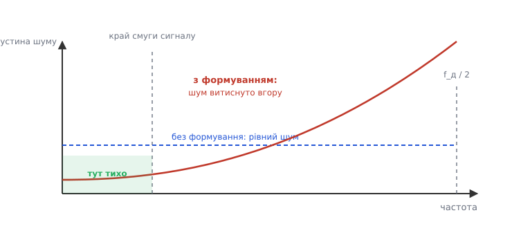
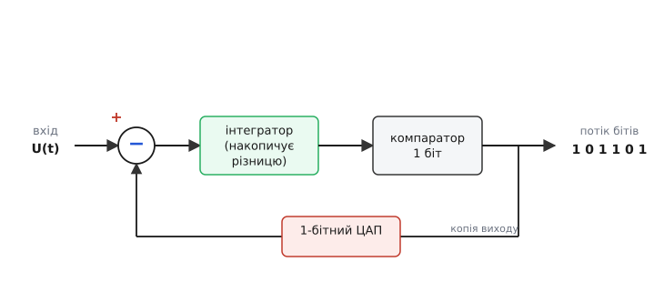
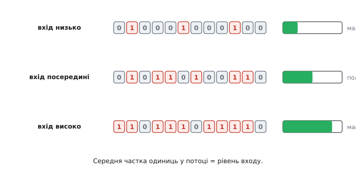
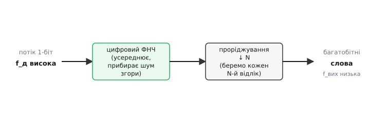

# Sigma-delta АЦП

Уявіть, що вам треба зміряти напругу з точністю однієї частини на мільйон — двадцять розрядів і більше. Очевидний шлях: зробити лінійку з мільйона поділок і подивитися, проти якої стоїть стрілка. В електроніці «лінійка» — це набір точно підігнаних опорів або конденсаторів, проти яких порівнюють вхід. Але підігнати мільйон поділок так, щоб кожна стояла рівно там, де треба, фізично неможливо: компоненти мають розкид, гріються, старіють. Чим більше розрядів, тим дорожче й безнадійніше стає сама лінійка.

Sigma-delta перетворювач (грецькі літери Σ — сума, Δ — різниця) обходить цю стіну зовсім інакше. Він не будує точну лінійку. Він бере **грубий** інструмент — компаратор на один-єдиний біт, що вміє лише сказати «вхід вищий чи нижчий за поріг», — і вимірює ним **дуже-дуже швидко й багато разів**, а тоді усереднює. Точність народжується не з якості одного вимірювання, а з кількості й хитрого способу їх збирати. Саме тому такі АЦП стоять усюди, де потрібні високі розряди на не надто швидких сигналах: у вагах і тензодавачах, у звукових кодеках, у вимірювачах температури, у промислових модулях збору даних.

> 🔧 **Навіщо це.** Коли в задачі стоїть «24 біти», «термопара», «тензоміст», «звук 24/96» — це майже завжди sigma-delta всередині. Розуміючи, як він робить точність із грубого компаратора, ви правильно читаєте даташит (звідки беруться «ефективні розряди», чому є частота вибірки модулятора й окремо — частота виходу) і не дивуєтеся, чому 24-бітний АЦП насправді віддає не 24 чесних біти.

## Дві ідеї, що роблять точність із грубості

Уся магія тримається на двох простих думках. Розберімо кожну окремо, бо разом вони дають ефект, який поодинці не дає жодна.

**Перша ідея — передискретизація (англ. oversampling).** Будь-який АЦП, округлюючи неперервну напругу до найближчого доступного рівня, робить помилку — її називають шумом квантування. У звичайному перетворювачі ви робите один відлік на потрібний момент, і ця помилка лишається у вашому відліку повністю. Але якщо взяти відліків не один, а сотні на той самий проміжок часу, помилка кожного — майже випадкова, і її загальна «потужність» розмазується тонким шаром по всій смузі частот аж до половини частоти вибірки. Корисний сигнал тим часом сидить лише у вузькій смузі знизу. Виходить, що в **робочій** смузі шуму лишається маленька частка — рівно стільки, скільки припадає на цю вузьку смугу від усього розмазаного шару.

Платимо за це швидкістю вибірки. Подвоїти кількість відліків на проміжок — означає вдвічі ширше розмазати шум, тобто прибрати з робочої смуги ще трохи. Але сама по собі передискретизація скупа: щоб виграти один розряд точності, треба збільшити частоту вибірки вчетверо. Десять зайвих розрядів коштували б збільшення в мільйон разів — нереально. Потрібна друга ідея, що робить виграш набагато крутішим.

**Друга ідея — формування шуму (англ. noise shaping).** Що, якби шум квантування не розмазувався рівним шаром, а навмисне **витискався** з робочої смуги вгору — у високі частоти, де сигналу немає й де його не шкода? Тоді знизу, де живе сигнал, стало б тихо-тихо, а весь бруд скупчився б угорі, звідки його потім легко зрізати цифровим фільтром.


*Без формування шум розкладений рівним шаром по всій смузі; формування витискає його вгору частотою — у робочій смузі сигналу лишається мізерна частка.*

Саме так формування шуму перетворює скупу передискретизацію на потужну. Тепер кожне подвоєння частоти вибірки прибирає з робочої смуги не трошки, а помітно більше: для модулятора першого порядку — близько дев'яти децибел (півтора розряду) за кожне подвоєння; для другого порядку — близько п'ятнадцяти децибел (два з половиною розряди). Звідки беруться саме ці числа й чому крутість залежить від «порядку», показано в [математиці формування шуму](topic:electronics/sigma-delta-adc/math-noise-shaping.md).

## Петля, що робить обидві справи разом

Найкрасивіше те, що обидві ідеї дає **одна** проста схема — петля зі зворотним зв'язком. Подивімося, з чого вона складена і чому працює.


*Вхід порівнюється з копією власного виходу; різниця накопичується в інтеграторі; компаратор віддає 1 біт; цей біт через ЦАП вертається й віднімається — петля сама себе підганяє.*

Ланцюжок такий. Спершу **суматор** бере вхідну напругу й віднімає від неї те, що петля віддала на попередньому кроці (звідси Δ — різниця). Ця різниця йде в **інтегратор** — накопичувач, що додає її до своєї суми крок за кроком (звідси Σ). Накопичену суму дивиться **компаратор** — однобітний АЦП: якщо сума вище порога, він видає 1, якщо нижче — 0. І, нарешті, цей один біт проходить через **однобітний ЦАП** (повертає або «повну плюсову опору», або «повну мінусову») і подається назад у суматор на віднімання.

Тепер простежмо, **чому** ця петля сама себе тримає в покорі. Хай на вході три чверті від повної шкали. Компаратор може віддати лише чисту 1 або чистий 0 — проміжку «три чверті» в нього немає. Тож він починає видавати одиниці частіше, ніж нулі: десь три одиниці на кожен нуль. Кожна видана 1 повертається й **віднімається** з входу, тягнучи накопичену в інтеграторі суму вниз; кожен 0 нічого не віднімає, і сума знову повзе вгору. Петля весь час балансує сама себе так, щоб **середнє** з її виходу дорівнювало входові. Інтегратор тут — пам'ять помилки: він стежить, щоб жодна дрібна неузгодженість не загубилася, а неодмінно колись виправилася протилежним бітом.

А де ж тут формування шуму? Воно виходить **задарма**, з самої будови петлі. Інтегратор сильно підсилює повільні (низькочастотні) складові, бо накопичує їх довго, і майже не реагує на швидкі. Помилка квантування, обернена цим підсиленням навиворіт через зворотний зв'язок, отримує протилежний нахил: її **придушено внизу й випущено вгору**. Сигнал петля передає як є, а шум — вивертає вгору частотою. Дві ідеї з одного механізму.

## Що на виході: ріка одиниць і нулів

Подивімося на сам потік, що виходить із модулятора. Це не числа — це безконечна стрічка бітів, де вся інформація захована в **тому, як часто трапляються одиниці**.


*Чим вищий вхід, тим густіший потік одиниць; уся аналогова величина закодована середньою часткою одиниць.*

Якщо вхід — рівно посередині шкали, потік скидається на чергування «один-нуль-один-нуль» приблизно навпіл. Якщо вхід поповз угору — одиниці густішають. Біля самого верху — суцільні одиниці з рідкими нулями. Тобто **середня густина одиниць у потоці і є виміряна напруга**. А кожна окрема 1 чи 0 саме по собі — груба, на один біт; точність ховається тільки в усередненні довгого шматка стрічки. Це й є та сама думка з початку, тепер у залізі: грубий інструмент плюс багато швидких вимірів плюс усереднення.

## Від ріки бітів — до числа: децимація

Потік одиниць і нулів комп'ютерові не віддаси — йому потрібні нормальні багаторозрядні числа й з розумною частотою, не з мегагерцовою. Перетворити стрічку в числа — робота цифрової частини, і робить вона це у два кроки, які разом звуть **децимацією** (лат. decimus — десятий; історично «брати кожного десятого»).


*Цифровий ФНЧ усереднює потік і зрізає винесений угору шум; проріджування знижує частоту, лишаючи рідкі багатобітні слова.*

Спершу **цифровий фільтр низьких частот** проходить по потоку й усереднює його. Це робить дві справи заразом: дістає з густини одиниць багаторозрядне число й **зрізає весь шум, що формування витиснуло вгору**. Саме тут остаточно збирається висока точність — фільтр складає тисячі грубих однобітних відліків у одне чесне багатобітне слово.

Потім **проріджування**: фільтр видає числа все ще на високій частоті модулятора, а нам стільки не треба — після того як шум угорі вже зрізано, зайві відліки нічого не додають. Тому лишаємо кожен N-й, а решту відкидаємо. На виході — рідкий потік багаторозрядних слів на спокійній частоті, яку процесор легко прочитає. Відношення високої частоти модулятора до низької частоти виходу називають коефіцієнтом передискретизації — це він задає, скільки грубих відліків ляже в одне точне число.

## Worked-приклад: скільки чесних розрядів дає передискретизація

**Умова.** Модулятор працює на частоті 2.56 МГц, а на виході нам треба 1 кГц (звичайна вага чи термодавач). Скільки додаткових ефективних розрядів дає сама лише передискретизація другого порядку (15 дБ на октаву), якщо базовий однобітний компаратор без жодного усереднення дає мізерне відношення сигнал/шум?

Спершу порахуймо коефіцієнт передискретизації й скільки в ньому «октав» (подвоєнь):

```
OSR = f_мод / (2 · f_смуги) = 2 560 000 / (2 · 1000) = 1280
октав = log2(1280) ≈ 10.3
```

Кожна октава для другого порядку додає 2.5 розряду, тож:

```
Δрозрядів ≈ 2.5 · 10.3 ≈ 25.7 розряду
```

**Висновок.** Передискретизація з формуванням другого порядку додає двадцять із гаком ефективних розрядів **поверх** грубого однобітного компаратора. Ось чому однобітний АЦП у петлі врешті дає 20–24 чесних розряди — не якістю заліза, а кількістю швидких вимірів і нахилом, під яким витиснуто шум. У реального чипа це число трохи менше через теплові шуми й неідеальність, але порядок саме такий.

## Як це виглядає у прошивці

З погляду коду sigma-delta АЦП напрочуд простий: уся аналогова хитрість захована в кремнії, а вам лишається налаштувати частоту виходу (через коефіцієнт передискретизації) і читати готові слова. Ось типовий каркас для зовнішнього 24-бітного АЦП на шині SPI:

:::tabs
```cpp
// Налаштування: коефіцієнт передискретизації задає вихідну частоту.
// Більший OSR -> повільніше, але тихіше (більше чесних розрядів).
void adc_init(void) {
    adc_write_reg(REG_MODE, OSR_1024);   // 1024 грубих відліки на одне слово
    adc_write_reg(REG_CHAN, CH_AIN0);    // канал вимірювання
}

// Читання одного готового 24-бітного слова (модулятор + децимація вже в чипі).
int32_t adc_read(void) {
    while (!adc_data_ready()) { }         // чекаємо, доки фільтр зібрав слово
    uint8_t b[3];
    adc_read_bytes(REG_DATA, b, 3);       // три байти = 24 біти
    int32_t code = ((int32_t)b[0] << 16) | (b[1] << 8) | b[2];
    if (code & 0x800000)                  // знаковий 24-бітний код
        code |= 0xFF000000;               // розширюємо знак до 32 біт
    return code;                          // готове число, можна масштабувати в вольти
}
```
```micropython
from machine import SPI, Pin

spi = SPI(1, baudrate=1_000_000, polarity=1, phase=1)
cs = Pin(5, Pin.OUT, value=1)
drdy = Pin(4, Pin.IN)

# Налаштування: коефіцієнт передискретизації задає вихідну частоту.
# Більший OSR -> повільніше, але тихіше (більше чесних розрядів).
def adc_init():
    adc_write_reg(REG_MODE, OSR_1024)    # 1024 грубих відліки на одне слово
    adc_write_reg(REG_CHAN, CH_AIN0)     # канал вимірювання

# Читання одного готового 24-бітного слова (модулятор + децимація вже в чипі).
def adc_read():
    while drdy.value():                  # чекаємо, доки фільтр зібрав слово
        pass
    b = adc_read_bytes(REG_DATA, 3)      # три байти = 24 біти
    code = (b[0] << 16) | (b[1] << 8) | b[2]
    if code & 0x800000:                  # знаковий 24-бітний код
        code -= 0x1000000                # розширюємо знак
    return code                          # готове число, можна масштабувати в вольти
```
```python
# Налаштування: коефіцієнт передискретизації задає вихідну частоту.
# Більший OSR -> повільніше, але тихіше (більше чесних розрядів).
def adc_init():
    adc_write_reg(REG_MODE, OSR_1024)    # 1024 грубих відліки на одне слово
    adc_write_reg(REG_CHAN, CH_AIN0)     # канал вимірювання

# Читання одного готового 24-бітного слова (модулятор + децимація вже в чипі).
def adc_read():
    while not adc_data_ready():           # чекаємо, доки фільтр зібрав слово
        pass
    b = adc_read_bytes(REG_DATA, 3)       # три байти = 24 біти
    code = (b[0] << 16) | (b[1] << 8) | b[2]
    if code & 0x800000:                   # знаковий 24-бітний код
        code -= 0x1000000                 # розширюємо знак
    return code                           # готове число, можна масштабувати в вольти
```
:::

Зверніть увагу на дві речі. По-перше, частота, з якою з'являється «дані готові», набагато нижча за внутрішню частоту модулятора — це наслідок децимації; ви читаєте вже рідкі багатобітні слова, а не сиру ріку бітів. По-друге, вибір коефіцієнта передискретизації — це прямий компроміс **швидкість проти тиші**: більший OSR дає менше шуму (більше чесних розрядів), але рідші відліки. Це той самий компроміс, що ми бачили в петлі, тільки тепер у вигляді одного рядка налаштування.

> 🔧 **Навіщо це.** У реальному проєкті вибір OSR — головне рішення для sigma-delta каналу. Ставите завеликий — система «гальмує», не встигає за сигналом; замалий — у даних шум, «стрибають» молодші розряди. Орієнтир простий: знайдіть найповільнішу частоту виходу, яку терпить ваша задача (для ваги це десятки герц, для звуку — десятки кілогерц), і беріть максимальний OSR під неї — отримаєте найтихіший результат, який чип здатен дати.

## Чим за це платимо

Жодне рішення не безкоштовне, і чесно назвати ціну важливо. Sigma-delta перетворювач **повільний на старті**: коли ви перемкнули канал чи щойно ввімкнули його, цифровий фільтр має набрати повну стрічку відліків, перш ніж віддасть перше чесне слово — кілька «холостих» циклів пропадають. Тому для швидкого перемикання між багатьма каналами він підходить гірше, ніж архітектури, що дають готовий відлік одразу.

Друга риса — він **найкращий на вузькій смузі**. Уся його точність побудована на тому, що сигнал сидить знизу, а шум витиснуто вгору; розширте робочу смугу — і ви почнете захоплювати дедалі більше винесеного нагору шуму, точність падає. Тому це інструмент високих розрядів на **не надто швидких** сигналах, а не для радіочастот.

І все ж там, де ці обмеження не болять, sigma-delta дає те, чого не дає жоден інший підхід: десятки чесних розрядів **без** жодного точно підігнаного компонента, на самій лиш швидкості й розумно витиснутому шумі. Це інженерне рішення в найкращому сенсі — обернути слабкість грубого інструмента на силу, додавши йому кількості й хитрого механізму. Тих, кому цікаво, як ця ідея взагалі народилася — від першого патенту Белла до групи в Токіо, що дала їй ім'я, — чекає [історія появи sigma-delta](topic:electronics/sigma-delta-adc/hist-origins.md).
