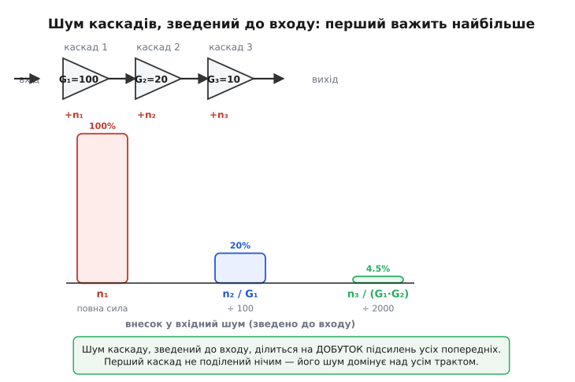
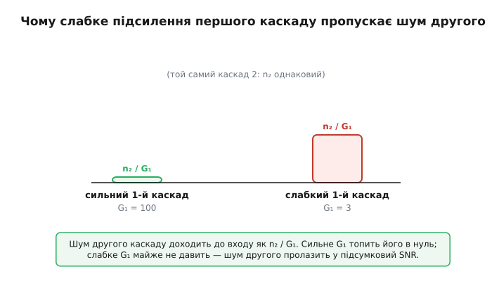

# 🧮 Як шум накопичується вздовж ланцюга каскадів

Реальний аналоговий тракт майже ніколи не складається з одного елемента. Між давачем і числом, яке зрештою прочитає програма, стоїть ланцюжок: підсилювач, фільтр, ще один підсилювач, буфер, АЦП. Кожна з цих ланок щось корисне робить — і кожна, на додачу, **підмішує власний шум**. Питання, яке вирішує цей апарат, звучить просто: якщо я знаю підсилення й власний шум кожної ланки окремо, який SNR матиму на виході всього ланцюга? І чому, хоч би скільки ланок я поставив, доля кожної в підсумку аж ніяк не однакова — а перша важить так, що решта поряд із нею майже не видно?

Відповідь — не таблиця і не «складемо всі шуми». Це коротке, але точне виведення, після якого золоте правило входу («тиша вирішується в найпершому елементі») перестає бути гаслом і стає формулою, яку видно очима. Доведемо його з першопричини, а тоді порахуємо двокаскадний тракт у числах і в коді — і подивимося, як слабке підсилення першого каскаду власноруч відчиняє двері шумові другого.

## Один трюк, що тримає все: звести шум до входу

Складність ланцюга в тому, що шум кожної ланки народжується **в різному місці** і потім ще й по-різному підсилюється тим, що йде далі. Шум першого каскаду пройде крізь усі наступні підсилення; шум останнього — ні крізь що. Порівнювати їх «де народилися» безглуздо: вони міряні в несумісних точках. Потрібна спільна точка відліку.

Така точка — **вхід тракту**, поряд із самим джерелом сигналу. Домовмося будь-який шум, де б він не виник, **перерахувати** в еквівалентну напругу, яку довелося б подати **на вхід**, щоб на виході дістати точнісінько той самий шумовий внесок. Це й називають «шумом, зведеним до входу» (*input-referred noise*). Сенс трюку: щойно і сигнал, і весь шум стоять в одній точці — на вході, — їх можна чесно порівняти, і вийде той самий SNR, що й на виході. Чому той самий — бо все, що після входу, множить сигнал і шум на однакове підсилення, а спільний множник із відношення скорочується. Цю властивість — що SNR не залежить від того, де його міряти, на вході чи на виході, — стаття-власник виводить окремо; тут вона наша робоча основа.

> 🔧 **Навіщо це.** Зведення до входу — не математична забаганка, а те, як читають даташити. Виробник підсилювача не пише «шум на виході» (він залежав би від підсилення, яке ставите ви), а пише **щільність шуму, зведеного до входу** — у нановольтах на корінь із герца. Саме тому, проєктуючи тракт, ви можете взяти цифру з даташита кожної ланки, поставити всі в одну точку й одразу побачити, хто скільки додає. Без спільної точки відліку порівнювати ланки нічим.

Тепер головне питання: коли я зводжу до входу шум **не першої**, а наступної ланки — що з ним стається?

## Виведення: шум ланки ділиться на підсилення всього, що перед нею

Розгляньмо два каскади поспіль. Перший має підсилення (за напругою) G₁ і власний шум, зведений **до свого входу**, рівний n₁. Другий має підсилення G₂ і власний шум, зведений до **свого** входу, n₂. «Зведений до свого входу» означає: n₁ — це напруга, яку треба подати на вхід першого каскаду, щоб пояснити весь його власний шум; n₂ — те саме для другого. Це звичайний спосіб, яким шум ланки задають у даташиті, тож почнімо з нього.

Простежмо, де опиниться кожен шум на спільному виході, а тоді зведімо все до спільного входу.

**Шум першого каскаду.** Він народжується на вході першого каскаду (так його й задано — n₁ зведено туди). Отже, до входу тракту він уже зведений: він **і є** на вході. Внесок n₁ у вхідний шум — рівно n₁.

**Шум другого каскаду.** Він народжується на вході другого каскаду. Але вхід другого — це вже **після** першого підсилення: туди сигнал приходить підсиленим у G₁ разів. Щоб пояснити шум n₂, який сидить **там**, через еквівалентний шум **на вході тракту**, спитаймо: яку напругу x треба подати на самий вхід, щоб після проходження першого каскаду вона перетворилася на n₂? Перший каскад множить на G₁, тож

```
x · G₁ = n₂   ⟹   x = n₂ / G₁
```

Ось воно. Шум другого каскаду, зведений до входу тракту, — це **n₂, поділене на підсилення першого каскаду**. Перший каскад стоїть між входом і місцем, де народжується n₂; усе, що джерело подає на вхід, він підсилює в G₁ разів, перш ніж воно зустрінеться з n₂, — тож і навпаки, n₂ у перерахунку на вхід стискається в ті самі G₁ разів. Чим сильніше підсилює перший каскад, тим меншим виглядає шум другого з точки зору входу.

Тепер додаймо третій каскад із підсиленням G₃ і власним шумом n₃ (зведеним до його входу). Його шум народжується ще далі — **після** і першого, і другого підсилення. Перед ним стоять уже два каскади, що разом множать на G₁·G₂. Тією самою логікою:

```
x · G₁ · G₂ = n₃   ⟹   x = n₃ / (G₁ · G₂)
```

Шум третього каскаду, зведений до входу, ділиться вже на **добуток** підсилень обох попередніх. Закономірність проступила й вона єдина можлива: шум кожної ланки, зведений до входу тракту, ділиться на добуток підсилень **усіх ланок, що стоять перед нею** (а перед першою не стоїть нічого, тож її шум не поділений). Це не випадковість і не правило, яке треба запам'ятати, — це прямий наслідок того, що «зведення до входу» означає «прокрутити назад крізь усе проміжне підсилення».


*Угорі — ланцюг каскадів, кожен зі своїм підсиленням і власним шумом. Унизу — ті самі шуми, зведені до входу: n₁ стоїть на повну силу, n₂ поділено на G₁, n₃ — на G₁·G₂. Перший стовпчик панує над рештою — у цьому вся суть правила входу.*

## Складаємо шуми правильно: коренем із суми квадратів

Маючи всі внески зведеними до входу, треба скласти їх в один сумарний вхідний шум. Тут є пастка: шуми **не додаються прямо**. Власний шум кожного каскаду — окреме фізичне джерело (теплове ворушіння в одних резисторах, дробовий шум в інших переходах), і ці джерела між собою **не пов'язані** — статистично незалежні. А незалежні випадкові напруги складаються не сумою, а **коренем із суми квадратів** (бо складаються їхні потужності, а потужність ∝ квадрат напруги). Сумарний вхідний шум двокаскадного тракту:

```
n_вх = √( n₁² + (n₂ / G₁)² )
```

для трьох каскадів —

```
n_вх = √( n₁² + (n₂ / G₁)² + (n₃ / (G₁·G₂))² )
```

і так далі: кожна нова ланка додає під корінь свій квадрат, поділений на квадрат добутку всіх попередніх підсилень. Те, що складати треба квадрати, а не самі напруги, — окрема важлива тонкість шумової арифметики (вона ж пояснює, чому два однакові джерела шуму дають не вдвічі, а лише в √2 ≈ 1.41 раза більший шум); її розгортає тема про тепловий шум як елемент схеми.

> Чому незалежні шумові напруги складаються коренем із суми квадратів, а не прямою сумою, чому це випливає з додавання потужностей і коли таке додавання порушується (корельовані джерела, наводки) — у статті [резистор як джерело шуму](topic:electronics/resistor-noise). Тут ми беремо це правило складання як готове.

Працювати зручніше **в потужностях** — тоді корінь зникає, а ділення на добуток підсилень стає діленням на добуток **квадратів** підсилень (бо потужнісне підсилення — це квадрат напругового). Позначмо потужність власного шуму ланок N₁ = n₁², N₂ = n₂², N₃ = n₃², а потужнісні підсилення A₁ = G₁², A₂ = G₂². Тоді сумарна потужність шуму, зведена до входу:

```
N_вх = N₁ + N₂/A₁ + N₃/(A₁·A₂) + …
```

У цьому вигляді закон видно найчистіше: **повна шумова потужність на вході — це шум першого каскаду плюс шум кожного наступного, придушений потужнісним підсиленням усього, що перед ним.** Саме цю суму — для шумових **факторів** замість абсолютних потужностей — 1944 року записав інженер лабораторій Белла Гаральд Фрііс; нижче побачимо, що це одна й та сама структура.

## Чому перший каскад домінує — це прямо видно з формули

Тепер правило входу не треба проголошувати — його видно. Поглянемо ще раз на потужнісну суму й уявімо типовий тракт, де перший каскад має пристойне підсилення, скажімо A₁ = G₁² = 100² = 10 000:

```
N_вх = N₁ + N₂/10 000 + N₃/(10 000 · A₂) + …
```

Шум другого каскаду входить у підсумок **поділеним на десять тисяч**. Навіть якби другий каскад сам по собі шумів **у сто разів дужче** за перший (N₂ = 100·N₁), на вході його внесок був би 100·N₁/10 000 = N₁/100 — соті частки першого. Шум третього, поділений на добуток уже двох підсилень, зникає й зовсім. Виходить, що в добре спроєктованому тракті **майже весь** вхідний шум — це шум першого каскаду, а решта губиться під рискою ділення:

```
N_вх ≈ N₁     (коли перший каскад має достатнє підсилення)
```

Ось чому проєктування тихого тракту завжди впирається в перший елемент. Він — єдиний, чий шум входить у підсумок **без жодного дільника**, на повну силу. Усі інші ланки боротьба з шумом може ігнорувати майже задарма; перша ланка визначає шумову підлогу всього каналу, і помилитися в ній не можна нічим, що стоїть далі. Тому туди ставлять найтихіший і зазвичай найдорожчий каскад — малошумний підсилювач (LNA, *low-noise amplifier*), — а економлять там, де великий перший дільник прощає будь-який шум.

> 🔧 **Навіщо це.** Звідси випливає практичне правило компонування, яке економить і гроші, і нерви: **тихе — наперед, дешеве — назад.** Не варто ставити прецизійний малошумний підсилювач другим чи третім каскадом — там його тиша марнується, бо його шум однаково поділиться на підсилення попередніх. А от перший каскад на цьому не зекономиш ніколи: будь-яка його шумова неохайність лягає на сигнал у повну силу й уже непоправна. Інженер, який це бачить, не розмазує бюджет тихості рівно по тракту, а вкладає його весь у вхід.

## Підсумковий SNR із параметрів кожної ланки

Тепер зберімо все в одну відповідь. Нехай джерело подає корисний сигнал потужністю S₀ і несе разом із ним власний шум джерела потужністю N₀ (наприклад, тепловий шум вихідного опору давача — той самий √(4kTRₛB) у квадраті). Сигнал і шум джерела ми вже маємо на вході. Додаємо до вхідного шуму внески всіх каскадів, зведені до входу, — і ділимо потужність сигналу на повну потужність шуму на вході. Підсумковий SNR усього тракту:

```
            S₀
SNR = ─────────────────────────────────────────
        N₀ + N₁ + N₂/A₁ + N₃/(A₁·A₂) + …
```

де Sₖ і Nₖ — потужності, Aₖ = Gₖ² — потужнісні підсилення ланок. Ця формула — повна відповідь на питання, з якого ми починали: знаючи підсилення й власний (зведений до входу) шум кожної ланки, дістаємо SNR на виході, не тягнучи сигнал крізь увесь ланцюг руками. Знаменник чесно показує, хто винен у шумі: джерело (N₀), перший каскад (N₁ на повну), і дедалі слабші голоси решти.

Якщо хочемо в децибелах — як його майже завжди й подають, — береться десять логарифмів від цього відношення потужностей:

```
SNR[дБ] = 10 · log₁₀ ( S₀ / (N₀ + N₁ + N₂/A₁ + N₃/(A₁·A₂) + …) )
```

> Чому в потужнісному SNR множник перед логарифмом саме 10, а в напруговому — 20, і як перекладати рази в децибели по драбині опорних рядків — у статті [децибели: логарифмічна шкала відношень](topic:electronics/decibels). Тут ми беремо дБ як готову мову.

## Скільки це в числах: двокаскадний тракт

Абстракцію варто посадити на конкретні цифри й побачити, як перший дільник усе вирішує.

**SNR двокаскадного тракту з тихим першим каскадом.** Давач віддає сигнал потужністю, яку зручно взяти за умовну одиницю S₀ = 1 (відносні рівні нам і потрібні — SNR від абсолютного масштабу не залежить). Власний шум джерела N₀ = 1·10⁻⁶ (тих самих умовних одиниць потужності). Перший каскад: підсилення G₁ = 100 (потужнісне A₁ = 10 000), власний шум N₁ = 4·10⁻⁶. Другий каскад: G₂ = 20, власний шум N₂ = 9·10⁻⁶ — він шумить помітно дужче за перший. Який SNR на виході?

```
дано:  S₀ = 1
       N₀ = 1.0×10⁻⁶
       N₁ = 4.0×10⁻⁶ ,  A₁ = G₁² = 10 000
       N₂ = 9.0×10⁻⁶
внесок другого каскаду, зведений до входу:
       N₂ / A₁ = 9.0×10⁻⁶ / 10 000 = 9.0×10⁻¹⁰
сумарний шум на вході:
       N_вх = N₀ + N₁ + N₂/A₁
            = 1.0×10⁻⁶ + 4.0×10⁻⁶ + 9.0×10⁻¹⁰
            ≈ 5.0009×10⁻⁶
SNR = S₀ / N_вх = 1 / 5.0009×10⁻⁶ ≈ 199 964
SNR[дБ] = 10 · log₁₀(199 964) ≈ 53.0 дБ
```

Подивіться на знаменник: 4·10⁻⁶ від першого каскаду — і мізерні 9·10⁻¹⁰ від другого, хоч його **власний** шум був більший. Великий перший дільник (10 000) стиснув шумного другого до нечутного. SNR тракту майже повністю продиктований джерелом і першим каскадом; другого в підсумку наче й немає.

А тепер змінимо **одну-єдину** річ — послабимо підсилення першого каскаду — і подивимося, як той самий другий каскад оживе.

## Як слабке підсилення першого каскаду пропускає шум другого

**Той самий тракт, але перший каскад підсилює слабко.** Усе те саме, тільки G₁ = 3 (потужнісне A₁ = 9) замість 100. Власний шум першого каскаду N₁ той самий, шум другого N₂ той самий — змінилося лише його підсилення. Що зі знаменником?

```
дано (зміна одна):  G₁ = 3 ,  A₁ = 9   (було 10 000)
внесок другого каскаду, зведений до входу:
       N₂ / A₁ = 9.0×10⁻⁶ / 9 = 1.0×10⁻⁶
сумарний шум на вході:
       N_вх = N₀ + N₁ + N₂/A₁
            = 1.0×10⁻⁶ + 4.0×10⁻⁶ + 1.0×10⁻⁶
            = 6.0×10⁻⁶
SNR = 1 / 6.0×10⁻⁶ ≈ 166 667
SNR[дБ] = 10 · log₁₀(166 667) ≈ 52.2 дБ
```

Внесок другого каскаду підскочив із 9·10⁻¹⁰ до 1·10⁻⁶ — **більш ніж у тисячу разів**, — і тепер він уже не пил під рискою, а повноцінний доданок, нарівні з шумом джерела. Дільник A₁ упав з десяти тисяч до дев'яти, і двері, які велике підсилення тримало зачиненими, прочинились: шум другого каскаду пройшов на вхід майже без придушення. SNR просів менш драматично, ніж сам внесок (бо в знаменнику панує N₁), але напрям недвозначний: **слабкий перший каскад впускає в тракт шум усього, що стоїть за ним.**

Саме в цьому — глибша причина правила входу. Перший каскад мусить не просто мало шуміти; він мусить **достатньо підсилювати**, бо його підсилення — це той самий дільник, яким він душить шум усіх наступних ланок. Тихий, але слабкий перший каскад — гірший за трохи гучніший, але сильний: перший впускає чужий шум, другий його глушить.


*Шум другого каскаду доходить до входу як n₂/G₁. При сильному першому каскаді (зліва) він стиснутий у нечутне; при слабкому (праворуч) — майже не придушений і пролазить у підсумковий SNR. Сам каскад 2 в обох випадках однаковий — різниця лише в підсиленні першого.*

## Те саме в коді

Зберімо обидва сценарії в робочий C, який рахує SNR двокаскадного тракту з параметрів ланок і одразу показує контраст «сильний vs слабкий перший каскад». Код працює в потужностях (так формула найпряміша) і наприкінці переводить у децибели.

:::tabs
```c
#include <stdio.h>
#include <math.h>

// Підсумковий SNR двокаскадного тракту, зведений до входу.
// Усе — у відносних потужностях:
//   s0   — потужність корисного сигналу джерела
//   n0   — потужність власного шуму джерела (напр., тепловий шум опору давача)
//   g1   — підсилення 1-го каскаду ЗА НАПРУГОЮ (потужнісне = g1*g1)
//   n1   — потужність власного шуму 1-го каскаду, зведеного до ЙОГО входу
//   g2,n2 — те саме для 2-го каскаду
// Повертає SNR як відношення потужностей (рази).
float cascade_snr(float s0, float n0,
                  float g1, float n1,
                  float g2, float n2) {
    float a1 = g1 * g1;                 // потужнісне підсилення 1-го каскаду
    // шуми, зведені до входу: 1-й — як є, 2-й — поділений на A1
    float n_in = n0 + n1 + n2 / a1;     // повна потужність шуму на вході
    (void) g2;                          // g2 на SNR двокаскадника не впливає (скорочується)
    return s0 / n_in;
}

static float to_db(float ratio) {
    return 10.0f * log10f(ratio);       // потужнісне відношення → дБ
}

int main(void) {
    // Спільні параметри: сигнал, шум джерела, обидва каскади
    float s0 = 1.0f;          // сигнал джерела (умовна одиниця потужності)
    float n0 = 1.0e-6f;       // власний шум джерела
    float n1 = 4.0e-6f;       // шум 1-го каскаду (тихий)
    float g2 = 20.0f, n2 = 9.0e-6f;   // 2-й каскад шумить дужче за 1-й

    // Сценарій А: сильний перший каскад
    float g1_strong = 100.0f;
    float snrA = cascade_snr(s0, n0, g1_strong, n1, g2, n2);

    // Сценарій Б: слабкий перший каскад (змінили ЛИШЕ g1)
    float g1_weak = 3.0f;
    float snrB = cascade_snr(s0, n0, g1_weak, n1, g2, n2);

    // Внесок 2-го каскаду, зведений до входу, в кожному сценарії
    float contribA = n2 / (g1_strong * g1_strong);   // ≈ 9.0e-10
    float contribB = n2 / (g1_weak  * g1_weak);       // ≈ 1.0e-6

    printf("Сильний 1-й каскад (G1=%.0f): SNR = %.0f разів = %.1f дБ\n",
           g1_strong, snrA, to_db(snrA));
    printf("   внесок 2-го каскаду на вхід: %.2e\n", contribA);
    printf("Слабкий 1-й каскад (G1=%.0f):  SNR = %.0f разів = %.1f дБ\n",
           g1_weak, snrB, to_db(snrB));
    printf("   внесок 2-го каскаду на вхід: %.2e\n", contribB);
    printf("Послаблення 1-го каскаду підняло шум 2-го на вході у %.0f разів\n",
           contribB / contribA);
    return 0;
}
```
```python
import math

# Підсумковий SNR двокаскадного тракту, зведений до входу.
# Усе — у відносних потужностях:
#   s0    — потужність корисного сигналу джерела
#   n0    — потужність власного шуму джерела (напр., тепловий шум опору давача)
#   g1    — підсилення 1-го каскаду ЗА НАПРУГОЮ (потужнісне = g1*g1)
#   n1    — потужність власного шуму 1-го каскаду, зведеного до ЙОГО входу
#   g2, n2 — те саме для 2-го каскаду
# Повертає SNR як відношення потужностей (рази).
def cascade_snr(s0, n0, g1, n1, g2, n2):
    a1 = g1 * g1                       # потужнісне підсилення 1-го каскаду
    # шуми, зведені до входу: 1-й — як є, 2-й — поділений на A1
    n_in = n0 + n1 + n2 / a1           # повна потужність шуму на вході
    # g2 на SNR двокаскадника не впливає (скорочується)
    return s0 / n_in


def to_db(ratio):
    return 10.0 * math.log10(ratio)    # потужнісне відношення → дБ


# Спільні параметри: сигнал, шум джерела, обидва каскади
s0 = 1.0            # сигнал джерела (умовна одиниця потужності)
n0 = 1.0e-6         # власний шум джерела
n1 = 4.0e-6         # шум 1-го каскаду (тихий)
g2, n2 = 20.0, 9.0e-6   # 2-й каскад шумить дужче за 1-й

# Сценарій А: сильний перший каскад
g1_strong = 100.0
snr_a = cascade_snr(s0, n0, g1_strong, n1, g2, n2)

# Сценарій Б: слабкий перший каскад (змінили ЛИШЕ g1)
g1_weak = 3.0
snr_b = cascade_snr(s0, n0, g1_weak, n1, g2, n2)

# Внесок 2-го каскаду, зведений до входу, в кожному сценарії
contrib_a = n2 / (g1_strong * g1_strong)   # ≈ 9.0e-10
contrib_b = n2 / (g1_weak * g1_weak)       # ≈ 1.0e-6

print(f"Сильний 1-й каскад (G1={g1_strong:.0f}): SNR = {snr_a:.0f} разів = {to_db(snr_a):.1f} дБ")
print(f"   внесок 2-го каскаду на вхід: {contrib_a:.2e}")
print(f"Слабкий 1-й каскад (G1={g1_weak:.0f}):  SNR = {snr_b:.0f} разів = {to_db(snr_b):.1f} дБ")
print(f"   внесок 2-го каскаду на вхід: {contrib_b:.2e}")
print(f"Послаблення 1-го каскаду підняло шум 2-го на вході у {contrib_b / contrib_a:.0f} разів")
```
:::

Очікуваний вивід:

```
Сильний 1-й каскад (G1=100): SNR = 199964 разів = 53.0 дБ
   внесок 2-го каскаду на вхід: 9.00e-10
Слабкий 1-й каскад (G1=3):  SNR = 166667 разів = 52.2 дБ
   внесок 2-го каскаду на вхід: 1.00e-06
Послаблення 1-го каскаду підняло шум 2-го на вході у 1111 разів
```

Два рядки внеску — серце всієї вставки. Той самий другий каскад, той самий його власний шум; змінили лише підсилення першого з 100 на 3 — і його шум, зведений до входу, виріс у понад тисячу разів. Функція `cascade_snr` навмисно бере `g2` й нічим його не вживає: у двокаскадному тракті підсилення **останньої** ланки на SNR не впливає взагалі (їй нікого більше душити, а спільний множник із відношення сигнал/шум скорочується). Важить лише підсилення ланок, **перед якими ще є шум, що треба придушити**, — тобто всіх, крім останньої. Це ще один бік тієї самої думки: цінність підсилення для тиші — не в тому, що воно піднімає сигнал, а в тому, що воно стає дільником для чужого шуму, який іде слідом.

> 🔧 **Навіщо це.** Така функція — основа «шумового бюджету» тракту, який інженер прикидає ще до паяння. Підставивши в неї цифри з даташитів (підсилення й зведений до входу шум кожної ланки), видно наперед, чи витягне канал потрібний SNR і де вузьке місце. Найчастіший висновок такого підрахунку один і той самий: підсилення першого каскаду замало, треба його підняти — і тоді шум усіх наступних ланок провалюється під поріг чутності сам собою.

## Звідки це: формула Фрііса й коефіцієнт шуму

Той самий закон — шум ланки, поділений на добуток підсилень попередніх, — у радіотехніці записують не через абсолютні шумові потужності, а через **коефіцієнт шуму** (точніше, його лінійну форму — **шумовий фактор** F). Шумовий фактор ланки означують як відношення SNR на її вході до SNR на її виході: F = SNR_вх / SNR_вих — наскільки ланка псує сигнал/шум, проходячи крізь себе. Для ідеальної (нешумної) ланки F = 1; реальна завжди F > 1.

Накопичення цих факторів уздовж ланцюга описує **формула Фрііса**:

```
F = F₁ + (F₂ − 1)/G₁ + (F₃ − 1)/(G₁·G₂) + (F₄ − 1)/(G₁·G₂·G₃) + …
```

де Gₖ — потужнісні підсилення ланок. Структура — буква в букву та сама, що ми вивели: перший каскад (F₁) входить повністю, кожен наступний — поділений на добуток підсилень усіх попередніх. Доданок «−1» лише прибирає з кожної ланки внесок ідеального резистора-джерела (одиничний фактор), щоб не лічити шумову підлогу двічі; механіка ділення на попередні підсилення — ідентична нашій. І висновок із неї той самий, лише іншою мовою: **перший каскад визначає коефіцієнт шуму всієї системи**, тож на вхід приймача ставлять малошумний підсилювач із достатнім підсиленням, аби «сховати» шум усього, що йде за ним.

Цю формулу 1944 року вивів **Гаральд Трап Фрііс** (Harald Trap Friis, 1893–1976) — дансько-американський інженер, який народився в Нестведі (Данія), здобув освіту в Данському технічному університеті й усю кар'єру працював у лабораторіях Белла; її надрукували в журналі *Proceedings of the IRE* у статті «Noise Figures of Radio Receivers». (Це **усталений** результат; на честь Фрііса названо й другу його відому формулу — рівняння передачі радіохвиль вільним простором, тож «формула Фрііса» без уточнення двозначна.) Те, як коефіцієнт шуму вимірюють і застосовують до цілих приймачів, — окрема велика тема.

> Як шумовий фактор означують точно, як його міряють (метод холодного/гарячого джерела, Y-фактор), і чому для приймача важить саме коефіцієнт шуму першого каскаду — у статті [коефіцієнт шуму](topic:electronics/noise-figure). Формула накопичення, виведена тут із перших засад, — її математичний кістяк.

## Що варто винести

Шум уздовж ланцюга каскадів накопичується не як проста сума, а за єдиним законом, що випливає з одного трюку — звести всі шуми до спільної точки, входу тракту. Зведений туди шум кожної ланки **ділиться на добуток підсилень усіх ланок, що стоять перед нею**: перший каскад — на нічого (повна сила), другий — на A₁, третій — на A₁·A₂, і так далі; складаються ці внески коренем із суми квадратів (у потужностях — просто сумою). Звідси прямо видно, чому **перший каскад домінує**: він єдиний без дільника, і в тракті з пристойним першим підсиленням майже весь шум — це його шум. Підсумковий SNR читається з параметрів ланок: S₀ поділити на (N₀ + N₁ + N₂/A₁ + …). Найтонше місце — що перший каскад мусить не лише мало шуміти, а й **достатньо підсилювати**: його підсилення — це дільник, яким він глушить шум усього наступного, і варто йому ослабнути, як шум другого каскаду оживає (×1000 у нашому прикладі від падіння G₁ зі 100 до 3). Той самий закон у мові коефіцієнта шуму — це формула Фрііса 1944 року, і вона каже те саме: бийся за тишу й за підсилення в найпершому елементі тракту, бо далі тиша майже задарма, а ось чужий шум — уже непоправний.
