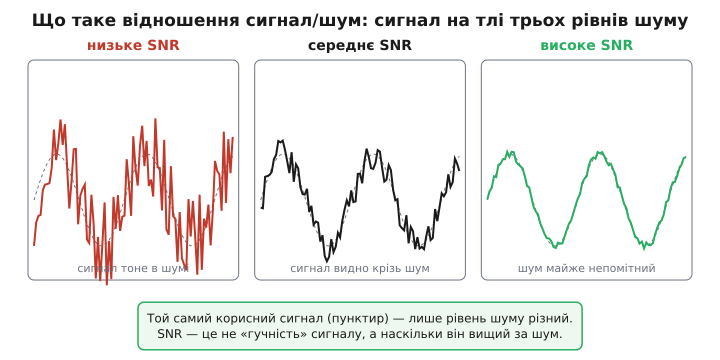
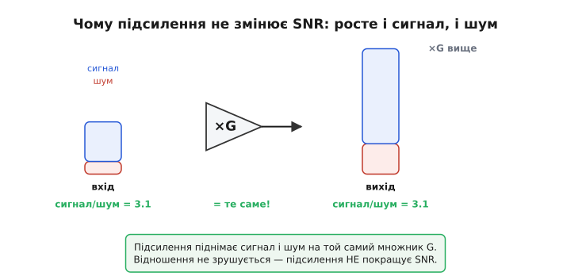
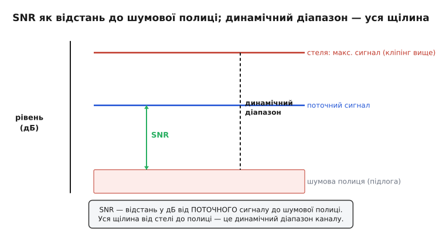

# Відношення сигнал/шум: коли важить не висота сигналу, а наскільки він вищий за шум

Поставте поряд два аналогові тракти. Один видає на виході могутні п'ять вольтів корисного сигналу, але разом із ним повзе піввольта шуму. Другий ледь чутний — сто мілівольтів, — зате шуму в ньому лиш один мілівольт. Котрий кращий? Майже завжди — другий, хоч сигнал у нього в п'ятдесят разів менший. Бо якість аналогового каналу вирішує не те, **який гучний** сигнал, а те, **наскільки впевнено його видно над шумом**. Саме це й міряє відношення сигнал/шум.

**Відношення сигнал/шум** (англ. *signal-to-noise ratio*, скорочено SNR) — це відношення потужності корисного сигналу до потужності шуму в тому самому місці тракту. Одне число, що відповідає на найголовніше питання слабкосигнальної техніки: чи розгледимо ми сигнал, чи він потонув. У першому тракті відношення напруг 5 / 0.5 = 10, у другому 0.1 / 0.001 = 100 — удесятеро краще, попри мізерну амплітуду. Тому, коли інженер каже «канал має SNR 60 дБ», він каже про **запас між корисним і паразитним**, а не про рівень гучності.

> 🔧 **Навіщо це.** Без цієї мірки оцінювати тракт нічим. Хтось хвалиться «вихід п'ять вольтів!», а толку з тих вольтів, якщо в них тоне корисна частина. SNR зводить усе до однієї чесної цифри: на скільки сигнал перевищує шум. За нею порівнюють підсилювачі, давачі, АЦП, цілі прилади; за нею кажуть, чи годиться канал для задачі; нею ставлять межу, нижче якої виміру вже не вірять. Хто мислить у термінах SNR, той не женеться за гучністю там, де треба ганятися за тишею.

### Спершу — два рівні, тоді відношення

Уявімо собі осцилограф, під'єднаний до виходу якогось каналу, і подивімося, що там реально живе на екрані. Ми побачимо дві накладені речі: рівну, передбачувану форму корисного сигналу — і поверх неї дрібне нервове тремтіння, що його не передбачиш. Перше — те, заради чого канал існує. Друге — шум: усе, чого ми не хотіли, а воно є. Тепловий шум резисторів, дробовий шум переходів, наводки, власний шум підсилювача — звідки воно взялося, для самого відношення байдуже; важить лише **скільки** його.

Щоб порівнювати ці дві речі чесно, обидві треба зміряти однією міркою. Для змінних сигналів така мірка — **середньоквадратичне значення** (RMS, від англ. *root mean square* — корінь із середнього квадрата). Воно бере «розмах» хаотичної форми й зводить його до одного числа, яке чесно відбиває її енергетичний внесок: синусоїда амплітудою 1 В має RMS 0.707 В — рівно стільки, скільки треба, щоб вона грала ту саму потужність, що й постійні 0.707 В. Шум RMS-ом теж описується природно — він по суті і є випадкова напруга з певним середньоквадратичним рівнем.

Маючи два RMS-рівні, відношення складається само собою:

```
SNR = Pсигн / Pшум          (за потужністю)
SNR = (Uсигн / Uшум)²       (бо потужність ∝ квадрат напруги)
```

Друге випливає з першого прямо: на тому самому опорі потужність пропорційна квадрату напруги, тож відношення потужностей — це квадрат відношення напруг. Звідси й тонкість, об яку спотикаються: відношення **напруг** і відношення **потужностей** — різні числа. Сигнал, удесятеро вищий за шум за напругою, перевищує його у **сто** разів за потужністю. Коли кажуть «SNR = 100», майже завжди мають на увазі потужнісне відношення; коли осцилограф показує «сигнал у 10 разів вищий за траву» — це відношення напруг. Сплутати їх — типова помилка перших розрахунків.

### Чому це майже завжди в децибелах

Голі рази тут незручні з тієї самої причини, що й усюди в трактах: SNR буває і три (на межі видимості), і сто тисяч (у доброму вимірювальному каналі). Дев'ять порядків між поганим і чудовим на лінійну вісь не лягають. Тому SNR майже завжди подають **у децибелах** — і завдяки тому, що потужність уже сидить під логарифмом, вираз стає звичним:

```
SNR[дБ] = 10 · log₁₀ (Pсигн / Pшум) = 20 · log₁₀ (Uсигн / Uшум)
```

Множник 10 — для потужностей, 20 — для напруг; це не два різні означення, а одне й те саме число, бо квадрат відношення напруг під логарифмом дає множник два. Якщо ця двійка й логіка драбини «3–6–20–40 дБ» поки муляють, варто мати під рукою саму ідею децибела як логарифмічної міри відношення.

> Чому потужнісним відношенням множник 10, а напруговим 20, звідки −3 дБ = половина потужності, і як перекладати дБ у рази усно по драбині опорних рядків — у статті [децибели: логарифмічна шкала відношень](book:electronics/decibels). Тут ми беремо дБ як готову мову й читаємо в ній рівні SNR.

Кілька орієнтирів варто просто закарбувати, бо вони повертаються щодня. **0 дБ** — сигнал і шум рівні (їх однаково чути, виміру майже не довіряй). **20 дБ** — сигнал у десять разів вищий за шум за напругою: помітно, але грубо. **60 дБ** — у тисячу разів: добрий аудіотракт, чистий вимір. **100 дБ і вище** — у сто тисяч: прецизійна техніка, межа гарних АЦП. Перекладати між дБ і разами тут доводиться постійно, тож драбина децибелів — не примха, а робочий інструмент.


*Корисний сигнал (пунктир) однаковий на всіх трьох панелях — змінюється лише рівень шуму. Зліва він тоне (низьке SNR), праворуч майже чистий (високе SNR). Відношення сигнал/шум описує саме цей запас, а не «гучність» сигналу.*

### Головна несподіванка: підсилення не покращує SNR

Здавалося б, найпростіший спосіб «дістати» слабкий сигнал — підсилити його. Поставив підсилювач із підсиленням сто — і там, де було сто мікровольтів, тепер десять мілівольтів. Сигнал виріс, рятунок? Ні. І це одна з найважливіших, найменш очевидних істин усієї аналогової техніки, тож проживімо її повільно.

Підсилювач не вміє розрізняти, де сигнал, а де шум: на його вхід приходить **сума** того й того по одному дроту, і він чесно множить **усе** на свій коефіцієнт G. Сигнал стане в G разів більшим — і шум стане в G разів більшим. А їхнє відношення?

```
SNR(вихід) = (G · Uсигн) / (G · Uшум) = Uсигн / Uшум = SNR(вхід)
```

G скоротився. Сигнал піднявся, шум піднявся, **відстань між ними лишилась та сама**. На осцилографі картинка стала вищою, але «трава» на сигналі — такою самою часткою. Підсилення робить сигнал зручнішим для наступних каскадів, гучнішим для динаміка, придатним для АЦП — але **не додає жодного децибела SNR**. Якщо корисне вже потонуло в шумі на вході, жодне підсилення його не витягне: множиться і те, що тоне, і те, в чому воно тоне.


*На вході маленькі стовпчики сигналу й шуму, на виході — обидва вищі в G разів. Відношення сигнал/шум на вході й на виході те саме. Підсилення робить сигнал зручнішим, але не покращує SNR.*

Звідси випливає золоте правило входу, на якому стоїть уся слабкосигнальна схемотехніка: **SNR вирішується в найпершому елементі тракту, і далі його можна лише погіршити.** Той перший резистор, той перший каскад, що бачить сигнал ще крихітним, ставить шумову підлогу всього каналу. Усе, що після нього, додає свій шум згори — але прибрати вже домішаного не може. Тому проєктування тихого тракту завжди починають із входу: туди ставлять найтихіше й найдорожче, а економлять далі, де SNR уже великий і трохи зайвого шуму нічого не псує.

> 🔧 **Навіщо це.** Це правило рятує від найтиповішої помилки початківця: «сигнал слабкий — підсилю його посильніше». Гучніше стане, краще — ні. Якщо термопара тоне в шумі, треба не накручувати підсилення, а зробити тихішим **вхід**: знизити опори, звузити смугу, узяти малошумний перший каскад. Інженер, що це засвоїв, не крутить ручку гучності там, де болить тиша, — він іде до першого елемента й працює там.

### Чому відношення рахують зведеним до входу

З того, що G скорочується, випливає зручний прийом: SNR можна рахувати **на вході**, наведеним до джерела, і відповідь буде та сама, що на виході. Це звільняє від мороки тягнути обидві величини крізь усі каскади — досить порівняти корисний сигнал джерела з шумом, який стоїть поруч із ним на вході.

А головний внесок у той вхідний шум часто дає не екзотика, а звичайнісінький опір. Будь-який резистор, навіть той, крізь який нічого не тече, сам породжує на виводах крихітну випадкову напругу — **тепловий шум** (*thermal noise*), бо його електрони ворушаться від тепла. Якщо давач має вихідний ([внутрішній](book:electronics/internal-resistance)) опір Rs, то цей Rs шумить, і його шум сидить **послідовно з корисним сигналом** ще до будь-якого підсилювача. Він і виявляється тим знаменником, що часто обмежує SNR:

```
SNR(вх) = Uсигн / √(4·k·T·Rs·B)
```

де k — стала Больцмана, T — температура в кельвінах, Rs — опір джерела, B — смуга частот. Звідси видно дві ручки, якими реально крутять тишу: менший опір джерела (шум росте як √Rs) і вужча смуга (шум росте як √B). Жодного підсилення в цьому виразі немає — і це ще раз та сама думка під іншим кутом.

> Звідки береться √(4kTRB), чому кожен резистор у схемі — ще й джерело шумової ЕРС, як шуми резисторів складаються коренем із суми квадратів і чому паралельне з'єднання стишує — у статті [резистор як джерело шуму](book:electronics/resistor-noise). Там тепловий шум уведено в апарат теорії кіл як елемент схеми; тут ми беремо його як готову підлогу, що ставить знаменник SNR.

> Чому в цю формулу підставляють не звичайну смугу −3 дБ, а трохи ширшу «еквівалентну шумову смугу» (бо плавний спад фільтра пропускає трохи більше шуму, ніж ідеальна прямокутна межа) — окрема тонкість, винесена в тему [шумова смуга](book:electronics/noise-bandwidth).

### Скільки це в числах

Абстракція стає відчутною, щойно підставити цифри. Візьмімо типову для аналогового входу ситуацію й порахуймо SNR двома способами — за напругою й у децибелах.

**SNR давача з опором 10 кОм у звуковій смузі.** Тензодавач віддає корисний сигнал 2 мВ (RMS), його вихідний опір 10 кОм, слухаємо смугу до 20 кГц при кімнатній температурі. Який SNR ставить уже сам тепловий шум опору?

```
дано:  Uсигн = 2.0×10⁻³ В,  Rs = 10 000 Ом,  T = 300 К,  B = 20 000 Гц
шум:   Uшум = √(4·1.38×10⁻²³·300·10 000·20 000)
       4kTR = 1.656×10⁻¹⁶ ;  ·B = 3.31×10⁻¹²  В²
       Uшум = √(3.31×10⁻¹²) ≈ 1.82×10⁻⁶ В ≈ 1.82 мкВ (rms)
відношення за напругою:  Uсигн / Uшум = 2.0×10⁻³ / 1.82×10⁻⁶ ≈ 1099
SNR[дБ] = 20 · log₁₀(1099) ≈ 60.8 дБ
```

Майже 61 дБ — і це ще **до** будь-якого підсилювача, лише від теплового шуму самого опору джерела. Для звуку цілком пристойно. Та зверніть увагу на важіль: захочемо вшестеро тихіший шум — звузити смугу вшестеро не досить, бо шум іде як √B; звужувати треба аж у 36 разів. Корінь і дарує, і скупиться: легких перемог над шумом не буває.

А тепер та сама схема, але про що жодне підсилення **не** скаже:

**Те саме після підсилювача ×100.** Поставили малошумний підсилювач із G = 100. Сигнал на виході 200 мВ, шум опору на виході 182 мкВ. Який тепер SNR?

:::tabs
```c
#include <math.h>
// Обидві величини множаться на те саме G — відношення не зрушується
float Usig_in  = 2.0e-3f;     // сигнал на вході, В rms
float Unoise_in = 1.82e-6f;   // тепловий шум опору джерела, В rms
float G = 100.0f;             // підсилення

float Usig_out   = G * Usig_in;     // 0.200 В
float Unoise_out = G * Unoise_in;   // 1.82e-4 В

float snr_in_db  = 20.0f * log10f(Usig_in  / Unoise_in);   // ≈ 60.8 дБ
float snr_out_db = 20.0f * log10f(Usig_out / Unoise_out);  // ≈ 60.8 дБ — те саме!
```
```python
from math import log10
# Обидві величини множаться на те саме G — відношення не зрушується
Usig_in   = 2.0e-3      # сигнал на вході, В rms
Unoise_in = 1.82e-6     # тепловий шум опору джерела, В rms
G = 100.0               # підсилення

Usig_out   = G * Usig_in      # 0.200 В
Unoise_out = G * Unoise_in    # 1.82e-4 В

snr_in_db  = 20.0 * log10(Usig_in  / Unoise_in)    # ≈ 60.8 дБ
snr_out_db = 20.0 * log10(Usig_out / Unoise_out)   # ≈ 60.8 дБ — те саме!
```
:::

Та сама 60.8 дБ — байт у байт. Сигнал виріс у сто разів, шум виріс у сто разів, відношення не зрушилось ані на децибел. Реальний підсилювач навіть **погіршить** ці 61 дБ, бо домішає трохи власного шуму; ідеальний — лише збереже. Покращити — не зможе ніякий.

### SNR у дискретному світі: чому в АЦП він заданий розрядністю

Досі сигнал жив у неперервних напругах. Та щойно його оцифровує АЦП, з'являється джерело шуму, якого раніше не було: **шум квантування**. Перетворювач мусить округлити кожен відлік до найближчого зі своїх рівнів, і ця похибка округлення — теж шум, теж зменшує SNR. Цікаве тут те, що для ідеального АЦП цей SNR заздалегідь відомий і залежить лише від розрядності.

Виходить чудово стисле правило, яке варто знати напам'ять. Для ідеального N-розрядного АЦП на повношкальній синусоїді найкращий можливий SNR дорівнює:

```
SNR[дБ] = 6.02 · N + 1.76
```

Це **усталений результат** теорії квантування: кожен зайвий розряд додає рівно 6.02 дБ (бо подвоює число рівнів — а це ×2 за напругою, +6 дБ), а доданок 1.76 дБ виходить із форми похибки округлення (рівномірний «пилкоподібний» шум дає RMS, що дорівнює кроку рівня, поділеному на √12) проти повношкальної синусоїди. Звідси одразу видно ціну розрядів: 8-бітний АЦП дає в кращому разі ≈ 49.9 дБ, 12-бітний ≈ 74 дБ, 16-бітний ≈ 98 дБ. Більше тихих розрядів коштує дорожче, але кожен купує ті самі 6 дБ.

**Граничний SNR 12-розрядного АЦП.** Скільки SNR щонайбільше витисне ідеальний 12-бітний перетворювач?

:::tabs
```c
// Граничний SNR ідеального N-розрядного АЦП (повношкальна синусоїда)
float ideal_adc_snr_db(int bits) {
    return 6.02f * bits + 1.76f;   // дБ
}

float snr12 = ideal_adc_snr_db(12);   // 6.02*12 + 1.76 = 74.0 дБ
```
```python
# Граничний SNR ідеального N-розрядного АЦП (повношкальна синусоїда)
def ideal_adc_snr_db(bits):
    return 6.02 * bits + 1.76    # дБ

snr12 = ideal_adc_snr_db(12)    # 6.02*12 + 1.76 = 74.0 дБ
```
:::

Сімдесят чотири децибели — стеля, до якої реальний 12-бітник лише наближається (його псують власний шум, нелінійність, джиттер). Тому в даташитах АЦП поряд із номінальними розрядами стоїть **ефективна кількість розрядів** (ENOB, англ. *effective number of bits*): беруть реально виміряний SNR (точніше — SINAD, що враховує ще й спотворення) і обертають формулу назад, N = (SINAD − 1.76) / 6.02. Якщо 16-бітний АЦП показує ENOB 13.5 — два з половиною його розряди тонуть у власному шумі, і платити за них немає сенсу.

> Як саме народжується шум квантування, чому його RMS дорівнює кроку рівня, поділеному на √12, і коли округлення можна вважати «білим» шумом — у темі [квантування та шум АЦП](book:electronics/adc-quantization). Там виводиться той самий доданок 6.02·N + 1.76 від першопричини.

### SNR і динамічний діапазон — спорідненість, але не тотожність

SNR легко сплутати з близьким поняттям — **динамічним діапазоном**, — і їх корисно розвести, бо змішують їх постійно. Уявімо вертикальну шкалу рівнів каналу. Унизу — **шумова полиця**: рівень власного шуму, нижче якого нічого не видно. Угорі — **стеля**: найбільший сигнал, який канал передає ще без спотворень (вище починається кліпінг). SNR — це відстань від **поточного, реального** сигналу до полиці; вона їздить угору-вниз разом із сигналом. Динамічний діапазон — це **вся щілина** від стелі до полиці, властивість самого каналу, від рівня сигналу незалежна.


*Стеля — максимальний неспотворений сигнал, підлога — шумова полиця. SNR міряється від поточного сигналу до полиці й рухається разом із ним. Динамічний діапазон — постійна відстань від стелі до полиці, характеристика каналу.*

Зв'язок простий: **максимальний SNR каналу дорівнює його динамічному діапазону** — це коли сигнал піднято до самої стелі. Опустіть сигнал на 20 дБ нижче за стелю — і SNR теж упаде на ті 20 дБ, хоча динамічний діапазон каналу не змінився ні на децибел. Тому за тихих сигналів так важливо не лишати «запас» дарма: кожен незаповнений децибел до стелі — це втрачений децибел SNR. Звідси правило роботи з АЦП і трактами: підбирай підсилення так, щоб найбільший очікуваний сигнал майже діставав стелі — тоді ти користуєшся всім динамічним діапазоном і витискаєш максимум SNR.

> Чому динамічний діапазон — окрема характеристика каналу, як його рахують для АЦП, аудіотракту, давача, і чим він відрізняється від SNR на конкретному сигналі — у темі [динамічний діапазон](book:electronics/dynamic-range).

### Коли каскадів багато: де SNR справді псується

Реальний канал — це не один елемент, а ланцюжок: давач, перший підсилювач, фільтр, другий каскад, АЦП. Кожен щось додає до шуму. Як складається підсумковий SNR — і чому правило входу таке суворе?

Ключ у тому, що шум кожного каскаду, **зведений до входу**, ділиться на сумарне підсилення **всіх каскадів до нього**. Власний шум першого підсилювача додається до входу як є. Шум другого, щоб порівняти його з вхідним сигналом, треба поділити на підсилення першого — а воно велике, тож на вході цей шум виглядає вже маленьким. Шум третього ділиться на добуток підсилень першого й другого — і майже зникає. Виходить, що **перший каскад, який ще нічим не підсилений, важить найбільше**: його шум лягає на сигнал у повну силу, тоді як шум дальших каскадів придушений підсиленням попередніх.

Звідси й конструкція тихих трактів: попереду ставлять каскад із великим підсиленням і малим власним шумом (малошумний підсилювач), а тоді вже все решта. Великим підсиленням він «утоплює» шум усіх наступних каскадів, своїм малим шумом не псує вхід — і весь канал успадковує SNR, заданий цим першим елементом. Якщо ж перший каскад тихо підсилює слабко, шум другого вже не придушений як слід — і пролазить у підсумок.

> Точний підрахунок, як шуми каскадів складаються й діляться на підсилення попередніх — формула накопичення шуму вздовж тракту з робочим прикладом на C — у вставці [як SNR проходить крізь ланцюг каскадів](book:electronics/signal-noise-ratio/math-cascade-snr.md). Там показано, чому перший каскад домінує, і як порахувати підсумковий SNR із параметрів кожної ланки.

Те, як цю саму ідею «скільки тракт додає шуму» оформлюють в одне число для радіоприймачів — **коефіцієнт шуму** (наскільки SNR на виході гірший за SNR на вході) — окрема велика тема: [коефіцієнт шуму](book:electronics/noise-figure). Корінь у неї саме тут: ідеальний елемент SNR зберігає, реальний — погіршує, і це погіршення можна виміряти.

### Що варто винести

Відношення сигнал/шум — наскрізна мірка якості аналогового каналу: не «який гучний сигнал», а **наскільки він вищий за шум**. Рахують його як відношення потужностей (або квадрат відношення RMS-напруг) і майже завжди подають у децибелах — 10·log за потужністю, 20·log за напругою. Головна, найменш очевидна істина: **підсилення SNR не покращує** — воно множить сигнал і шум на той самий коефіцієнт, тож відношення стоїть на місці; тиша вирішується в найпершому елементі тракту, а далі може лише гіршати. Тому SNR зручно рахувати зведеним до входу, де знаменником часто стає тепловий шум опору джерела √(4kTRsB). У цифровому світі ідеальний АЦП дає SNR = 6.02·N + 1.76 дБ — кожен розряд коштує 6 дБ. SNR не плутати з динамічним діапазоном: SNR — відстань від поточного сигналу до шумової полиці, динамічний діапазон — уся щілина від стелі до полиці; найбільший SNR дорівнює діапазону. А в ланцюгу каскадів підсумковий SNR диктує перший каскад, бо його шум не придушений жодним попереднім підсиленням. Хто бачить тракт очима SNR, той знає, де битися за тишу, а де вона вже задарма.

---
