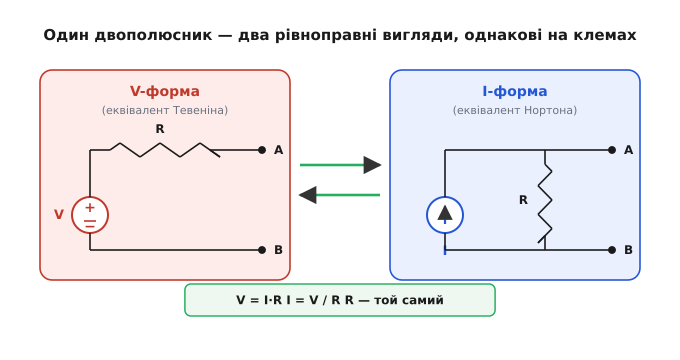
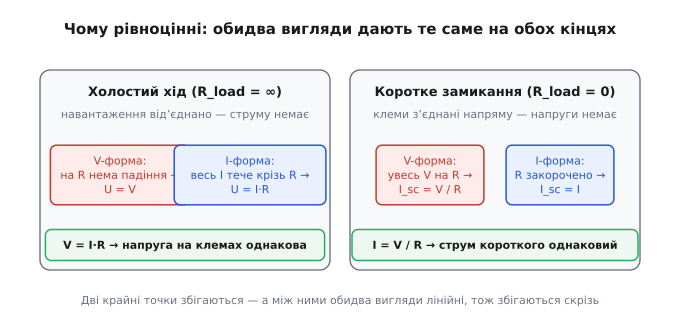
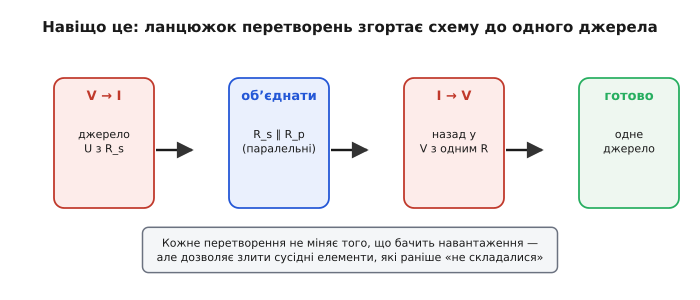

# Перетворення джерел

Уявіть, що на столі перед вами — невелика коробка з двома клемами, а всередині батарейка з резистором у ланцюжку. Ви міряєте, як вона поводиться: чим більший струм тягнете, тим помітніше просідає напруга на клемах. А тепер вам кажуть: цю саму коробку можна замінити іншою — з джерелом **струму** й резистором збоку, не в ланцюжку, а паралельно. І жоден прилад, під'єднаний до клем, **не відрізнить** одну коробку від іншої. Дивно? На перший погляд так: всередині геть різні деталі. Але на клемах — там, де живе ваше навантаження, — вони поводяться однаково, бо обидві описують **ту саму** залежність напруги від струму.

Оце і є **перетворення джерел** (англ. *source transformation* — перетворення джерела): право взяти джерело напруги з послідовним опором і замінити його джерелом струму з паралельним опором так, щоб назовні нічого не змінилося. Два різні обличчя одного й того самого двополюсника. І коли вмієш вільно перемикатися між ними, багато схем, що здавалися заплутаними, раптом «згортаються» в кілька дій.


*Один двополюсник — два рівноправні вигляди. Ліва форма: джерело напруги V послідовно з R. Права: джерело струму I паралельно з тим самим R. Перехід туди-сюди задають дві прості формули V = I·R та I = V/R, причому опір R у двох формах **однаковий**. Будь-яке навантаження, під'єднане до клем A–B, бачить ту саму вольт-амперну поведінку.*

## Чому взагалі дві форми описують одне й те саме

Щоб не вірити на слово, погляньмо, що саме «бачить» зовнішній світ із клем. Реальне джерело — будь-яке, чи батарейка, чи вихід підсилювача — це не ідеальна напруга, а напруга з [внутрішнім опором](book:electronics/internal-resistance) усередині. Тягнеш струм — частина напруги осідає на цьому опорі, і на клемах лишається менше. Уся поведінка двополюсника на клемах вичерпується **однією прямою лінією**: як напруга на клемах падає зі зростанням струму. Дві точки задають пряму повністю, тож досить перевірити поведінку в двох зручних крайнощах — і якщо обидві форми збігаються там, вони збігаються скрізь (обидві ж лінійні).

**Перша крайність — холостий хід:** до клем нічого не під'єднано, струм назовні нульовий.
- У формі з джерелом напруги струм крізь послідовний R дорівнює нулю, отже на R нема падіння, і на клемах стоїть повна напруга джерела: `U = V`.
- У формі з джерелом струму весь струм джерела тече крізь паралельний R (більше йому нікуди подітися), і на ньому набігає напруга `U = I·R`.

Щоб обидві форми дали **однакову** напругу холостого ходу, мусить бути `V = I·R`. Ось перша половина зв'язку.

**Друга крайність — коротке замикання:** клеми з'єднано напряму, напруга на них нульова, міряємо струм, що піде в перемичку.
- У формі з джерелом напруги вся напруга V лягає на R (бо паралельно йому тепер закоротка з нульовою напругою), і струм короткого: `I_sc = V/R`.
- У формі з джерелом струму паралельний R закорочено, тож увесь струм джерела йде в перемичку: `I_sc = I`.

Щоб і тут збіглося, треба `I = V/R`. Ось друга половина — і вона, як бачите, та сама рівність, лише переписана навпаки.


*Чому форми рівноцінні. Ліворуч — холостий хід: у V-формі на R нема падіння (U = V), у I-формі весь струм тече крізь R (U = I·R); рівність V = I·R робить напругу на клемах однаковою. Праворуч — коротке: у V-формі весь V падає на R (I_sc = V/R), у I-формі R закорочено (I_sc = I); та сама рівність робить струм короткого однаковим. Два кінці збіглися — між ними обидва двополюсники лінійні, тож збігаються всюди.*

Звідси й уся «магія» зводиться до двох дзеркальних формул, які варто закарбувати:

```
V = I · R          (з I-форми в V-форму: напруга = струм × опір)
I = V / R          (з V-форми в I-форму: струм = напруга / опір)
R — той самий в обох формах
```

> 🔧 **Навіщо це.** Перетворення джерел — не теоретична забавка, а робочий важіль спрощення. Часто в схемі стоять поряд джерело напруги з резистором і ще один резистор, і вони «не складаються»: один послідовний, другий паралельний, безпосередньо їх не об'єднати. Перетворили джерело — і обидва резистори опинилися паралельно (або послідовно), злилися в один, схема стала на елемент простішою. Так крок за кроком можна згорнути цілу драбину джерел і опорів до єдиного еквівалентного джерела — і відразу побачити, що насправді отримає навантаження.

## Ключове застереження: опір нікуди не зникає

Найперша пастка, на якій спотикаються, — спокуса думати, що перетворення «прибирає» опір. Не прибирає. Опір **залишається на місці**, той самий за величиною; змінюється лише його **роль у схемі**: був послідовно з джерелом напруги — став паралельно джерелу струму. Деталь та сама, увімкнення інше.

Це має глибокий сенс. Саме цей опір задає, наскільки джерело «м'яке»: як сильно просідає напруга під навантаженням. Якби перетворення його стирало, ми б отримали ідеальне джерело — а такого реальність не дає. Тому опір — носій усієї неідеальності двополюсника — переходить разом із джерелом, лише вмикається інакше. Перетворення не робить джерело кращим чи гіршим, воно лише **перемальовує** те саме.

І звідси — межа застосовності. Перетворити можна **тільки** пару «джерело + його послідовний (чи паралельний) опір». Якщо опору при джерелі нема — джерело ідеальне, — то перетворення **неможливе**: ідеальне джерело напруги не має нортонівського відповідника (паралельний опір був би нескінченний, струм короткого — нескінченний), а ідеальне джерело струму не має тевененівського (послідовний опір нульовий — стоп, нескінченний; напруга холостого ходу нескінченна). На щастя, реальні джерела завжди мають при собі опір, тож на практиці це обмеження зрідка заважає.

## Worked-приклад: туди й назад

**Перетворимо джерело напруги в джерело струму.** Маємо батарейку 9 В з послідовним опором 3 кОм (скажімо, такий у неї внутрішній опір під цим навантаженням). Який еквівалент Нортона?

```
Дано:  V = 9 В,  R = 3 кОм = 3000 Ом
I = V / R
I = 9 / 3000
I = 0.003 А = 3 мА
R лишається 3 кОм, але тепер ПАРАЛЕЛЬНО джерелу струму
```

Отже еквівалент: джерело струму 3 мА з паралельним опором 3 кОм. Перевірмо обидва кінці. Холостий хід: усі 3 мА течуть крізь 3 кОм, напруга `0.003 · 3000 = 9 В` — збігається з батарейкою. Коротке: струм короткого у джерела струму просто 3 мА, а в батарейки `9/3000 = 3 мА` — теж збігається. Дві форми нерозрізненні, як і має бути.

**А тепер назад, у коді.** Зручно мати під рукою обидва переходи — це чиста арифметика проєктування, яку приємно тримати поряд зі схемою:

:::tabs
```c
// Перетворення джерел: V-форма (джерело напруги + послідовний R)
//                    ⇄ I-форма (джерело струму + паралельний R).
// Опір однаковий в обох формах — передаємо його без змін.
// Усе в базових одиницях: вольти, ампери, оми.

float v_to_i_source(float v_thev, float r)   // V-форма → струм Нортона
{
    return v_thev / r;                        // I = V / R
}

float i_to_v_source(float i_norton, float r) // I-форма → напруга Тевеніна
{
    return i_norton * r;                      // V = I · R
}

// v_to_i_source(9.0f, 3000.0f) -> 0.003 А (3 мА), R лишається 3 кОм
// i_to_v_source(0.003f, 3000.0f) -> 9.0 В,        R лишається 3 кОм
```
```python
# Перетворення джерел: V-форма (джерело напруги + послідовний R)
#                    ⇄ I-форма (джерело струму + паралельний R).
# Опір однаковий в обох формах — передаємо його без змін.
# Усе в базових одиницях: вольти, ампери, оми.

def v_to_i_source(v_thev, r):    # V-форма → струм Нортона
    return v_thev / r            # I = V / R

def i_to_v_source(i_norton, r):  # I-форма → напруга Тевеніна
    return i_norton * r          # V = I · R

# v_to_i_source(9.0, 3000.0) -> 0.003 А (3 мА), R лишається 3 кОм
# i_to_v_source(0.003, 3000.0) -> 9.0 В,        R лишається 3 кОм
```
:::

Зверніть увагу: функції не чіпають R — вони лише перераховують «силу» джерела. Сам опір ви переносите в схему незмінним, змінюючи тільки його ввімкнення (послідовне ↔ паралельне). Це і є вся механіка перетворення, зведена до двох множень.

## Як цим згортають схеми

Тепер найкорисніше — навіщо все це в реальному аналізі. Перетворення джерел — це **інструмент спрощення**, і працює воно як важіль, що раз за разом зменшує схему на один елемент.

Уявімо типову ситуацію: джерело напруги, послідовно з ним резистор R_s, а далі до тих самих вузлів причеплений ще один резистор R_p — паралельно навантаженню. Безпосередньо R_s і R_p не об'єднати: один послідовний із джерелом, другий паралельний виходу, вони «в різних площинах». Але варто перетворити джерело напруги з R_s на джерело струму з паралельним R_s — і раптом R_s опиняється **паралельно** R_p. Два паралельні резистори миттю зливаються в один. Схема стала простішою, а навантаження так само нічого не помітило.

Часто вигідно зробити кілька кроків поспіль: перетворити V у I, злити паралельні опори, перетворити назад I у V, злити вже послідовні, і так згорнути цілу драбину до єдиного джерела з єдиним опором — тобто до [еквівалента Тевеніна](book:electronics/thevenin) всієї схеми. Кожен окремий крок не змінює того, що бачать клеми; змінюється лише форма запису, зручніша для наступного злиття.


*Навіщо перемикати форми. Перетворили джерело напруги на струмове — сусідні резистори стали паралельними й злилися. Перетворили назад — стали послідовними й знову злилися. Жоден крок не міняє поведінки на клемах, але кожен дозволяє об'єднати елементи, які «прямо не складалися», аж поки від схеми не лишиться одне еквівалентне джерело з одним опором.*

Це не єдиний спосіб згортати схеми — той самий результат дають [метод вузлових потенціалів](book:electronics/nodes-branches-loops) чи прямий пошук [еквівалента](book:electronics/thevenin-equivalent). Але перетворення джерел часто **найшвидше для ока**: воно не вимагає писати й розв'язувати систему рівнянь, а робиться графічно, перемальовуванням, і добре пасує, коли в схемі чергуються джерела напруги та струму з їхніми опорами.

**Worked-приклад: дві гілки в одну.** Хай до спільного вузла приходять дві паралельні гілки. Перша: джерело 12 В послідовно з 4 кОм. Друга: джерело 6 В послідовно з 2 кОм. Хочемо одне еквівалентне джерело на цьому вузлі. Прямо їх не зведеш — обидва у вигляді «напруга + послідовний опір», а паралельно об'єднуються легко лише струмові джерела. Тож перетворимо обидві в I-форму:

```
Гілка 1:  I₁ = 12 / 4000 = 3 мА,  паралельний опір 4 кОм
Гілка 2:  I₂ = 6  / 2000 = 3 мА,  паралельний опір 2 кОм

Тепер обидва — джерела струму, паралельні. Складаємо:
I_сум = I₁ + I₂ = 3 + 3 = 6 мА
R_сум = 4 кОм ∥ 2 кОм = (4·2)/(4+2) = 8/6 ≈ 1.333 кОм

За бажання — назад у V-форму:
V_екв = I_сум · R_сум = 0.006 · 1333 ≈ 8.0 В,  послідовний опір ≈ 1.333 кОм
```

Дві гілки з різними напругами й опорами злилися в одне джерело 8 В з опором близько 1.33 кОм. Жодних рівнянь — лише два перетворення, додавання та паралельне з'єднання.

> 🔧 **Навіщо це.** Коли в реальній схемі сходяться кілька живлень із різними внутрішніми опорами — скажімо, кілька джерел зміщення на спільному вузлі, — перетворення в струмову форму дозволяє додати їхні струми просто як числа, а опори об'єднати паралельно. Це найшвидший спосіб дізнатися, яку напругу й який еквівалентний опір «відчує» вузол, без громіздкого розв'язання системи. Інженер, що вільно перемикає форми, читає такі схеми майже усно.

## Де ця ідея відлунює далі

Перетворення джерел — мала, але глибока ідея, і її коріння та наслідки сягають ширше за просте спрощення схем.

По-перше, це жива ілюстрація **двоїстості** (англ. *duality* — двоїстість) у теорії кіл: напрузі відповідає струм, послідовному з'єднанню — паралельне, опору — провідність. Дві форми джерела — найпростіший приклад того, як одне й те саме явище можна однаково правдиво описати «з боку напруги» або «з боку струму». Та сама двоїстість потім проступає скрізь — у [теоремах Тевеніна й Нортона](book:electronics/internal-resistance/hist-thevenin-norton.md), у методах [вузлів і контурів](book:electronics/nodes-branches-loops), в [імпедансі та адмітансі](book:electronics/admittance).

По-друге, обидві форми безпосередньо пов'язані з двома вимірюваннями, які легко зробити на реальному двополюснику: напруга холостого ходу (нічого не під'єднуєш, міряєш вольтметром) і струм короткого замикання (замикаєш клеми амперметром). Перша дає V-форму, друга — I-форму, а їхнє відношення — той самий внутрішній опір. Тому перетворення джерел — це не лише спосіб перемалювати схему на папері, а й місток між тим, що ви **виміряли** на клемах, і тим, якою еквівалентною моделлю це описати. Цікаво, що історично саме [струмову форму](book:electronics/internal-resistance/hist-thevenin-norton.md) помітили на пів століття пізніше за напругову, хоча тепер вони здаються однаково очевидними.

По-третє, ідея не обмежена постійним струмом і резисторами. Точно так само перетворюються джерела зі **складеним опором** — [імпедансом](book:electronics/reactance) — у колах змінного струму: V-джерело з послідовним імпедансом Z стає I-джерелом із паралельним тим самим Z, за тими ж формулами, лише з комплексними величинами. І [залежні джерела](book:electronics/dependent-sources), якими моделюють транзистори та підсилювачі, теж перетворюються — обережно, бо їхня «сила» залежить від іншої величини в схемі, але механіка та сама.

Перетворення джерел добре тим, що думати про нього можна гранично просто: одне джерело з опором збоку має два рівноправні вигляди, а перехід між ними — це множення чи ділення на той самий опір. Усе, що ускладнює картину — двоїстість, імпеданси, залежні джерела, — лише розширює цю саму думку на нові випадки. Суть же лишається тією коробкою з двома клемами, яку зовнішній світ не годен відрізнити від її двійника.
