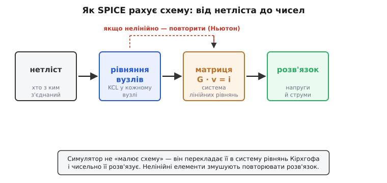
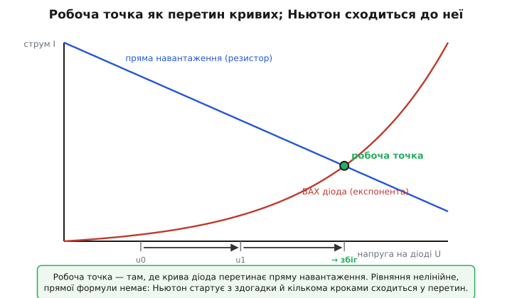
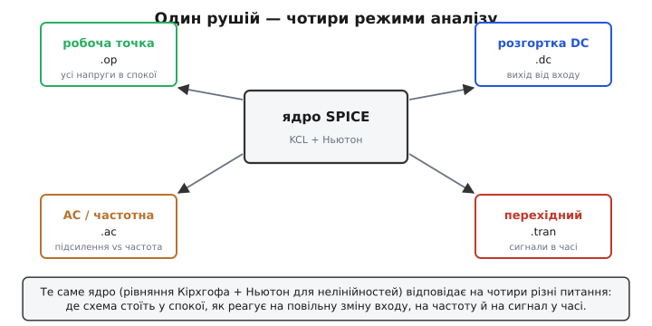
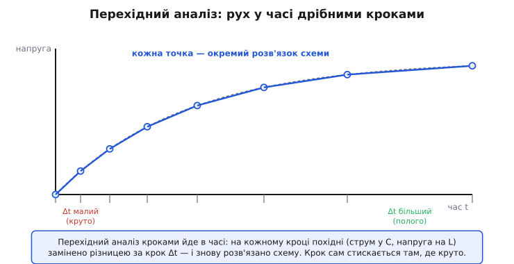

# Симуляція кіл (SPICE)

Уявіть, що ви накреслили підсилювач — десяток транзисторів, жменя резисторів і конденсаторів — і хочете знати, що з нього вийде, **не паяючи макета**. Яка напруга стоятиме в кожному вузлі? Як вихід піде за входом, коли той гойднеться синусоїдою на десять кілогерц? Чи не «попливе» робоча точка, коли транзистор нагріється? Зробити це олівцем означало б розв'язати руками систему з десятків нелінійних рівнянь — за кожної зміни номіналу заново. Саме цю каторгу й знімає **SPICE** (англ. *Simulation Program with Integrated Circuit Emphasis* — програма симуляції з наголосом на інтегральні схеми): ви описуєте схему текстом, а програма рахує, які напруги й струми в ній справді встановляться, за законами фізики.

Назва скромна, та за нею — спосіб, у який сьогодні проєктують майже всю аналогову електроніку. Жоден мікрочип не йде у виробництво, поки його не «прогнали» в симуляторі: кремній коштує надто дорого, щоб помилятися на залізі. Розберімо, що насправді робить SPICE усередині, чому це не магія, а чесна арифметика, і де ця арифметика спотикається.


*Шлях від схеми до чисел. SPICE не «розуміє» картинку — він читає нетліст (хто з ким з'єднаний), складає для кожного вузла рівняння за законами Кірхгофа, збирає їх у матричну систему й чисельно її розв'язує. Нелінійні елементи (транзистори, діоди) змушують повторювати розв'язок, поступово вточнюючи відповідь.*

## Звідки взагалі взялася потреба

У 1960-х схеми перестали вміщатися в голову. Один інженер ще міг прикинути поведінку підсилювача на двох транзисторах олівцем; але інтегральна схема з сотнею елементів, де все взаємодіє з усім, руками не лічиться — рівнянь забагато, і вони нелінійні. А переробляти кремнієву пластину, щоб виявити помилку, коштувало тижнів і грошей. Потрібен був спосіб **перевірити схему до того, як її зробили**.

> 🔧 **Навіщо це.** Симуляція економить не зручність, а цикли заліза. Кожна ітерація «спроєктував — виготовив — поміряв — виправив» на справжньому чипі коштує тижні й десятки тисяч доларів за маску фотолітографії. Прогнавши схему в SPICE, інженер ловить більшість помилок за хвилини на екрані: бачить, що каскад входить у насичення, що фільтр зрізає не там, що струм спокою втричі більший за задуманий. На залізо йде вже вивірена схема. Тому вміння читати результат симуляції — і не довіряти йому сліпо — це базовий навик кожного, хто проєктує аналог.

Перші такі програми народилися в університетах. У Берклі студент **Лоренс Нейгел** (Laurence W. Nagel) під керівництвом професора **Рональда Рорера** (Ronald A. Rohrer) зробив програму **CANCER** — «Computer Analysis of Nonlinear Circuits, Excluding Radiation» (комп'ютерний аналіз нелінійних кіл, без радіації); назву обрали навмисно зухвалою, щоб підкреслити: програму **не** фінансує військова промисловість і вона ніколи не рахуватиме вплив радіації на схеми. Переписана й звільнена від обмежень, ця програма 1973 року стала **SPICE** — і її, на наполягання професора **Дональда Педерсона** (Donald O. Pederson), віддали в суспільне надбання безкоштовно. Як саме SPICE виріс із CANCER, чому Берклі роздавав його задарма й як з нього виросли комерційні нащадки — у [короткій історії SPICE](book:electronics/spice-simulation/hist-spice-berkeley.md).

## Головна ідея: схема — це система рівнянь

Уся симуляція тримається на одному перекладі. Схема, хоч би яка складна, підкоряється [законам Кірхгофа](book:electronics/kirchhoff-laws): у кожному вузлі сума струмів, що втікають, дорівнює сумі, що витікають (струм нікуди не дівається), а вздовж будь-якого контуру сума напруг — нуль. Це не евристика, а закон збереження заряду й енергії, тож він виконується завжди й точно.

Візьмемо вузол схеми й запишемо для нього баланс струмів. Кожен струм виражається через напруги: крізь резистор тече `I = U/R` (закон Ома), крізь конденсатор `I = C·dU/dt`, крізь діод — за експонентою від напруги. Підставивши все це, ми дістаємо для кожного вузла рівняння, де невідомі — **напруги вузлів**. Скільки вузлів — стільки рівнянь. А система рівнянь, де невідомих рівно стільки, скільки рівнянь, у принципі розв'язна. Ось і вся стратегія: **перетворити схему на систему рівнянь і розв'язати її чисельно**.

Для лінійних елементів (резистори, джерела) ці рівняння лінійні, і їх можна записати компактно в матричному вигляді `G · v = i`, де `v` — стовпчик невідомих напруг вузлів, `i` — відомі струми джерел, а `G` — матриця провідностей, складена прямо з топології схеми. Розв'язати таку систему — стандартна задача лінійної алгебри. Спосіб, яким SPICE будує цю матрицю просто з переліку елементів (його називають **модифікованим вузловим аналізом**, MNA — він уміщає в ту саму систему й елементи, струм яких не виражається через напругу, як-от ідеальні джерела напруги та котушки), розписано в [математиці вузлового аналізу](book:electronics/spice-simulation/math-nodal-mna.md).

> 🔧 **Навіщо це.** Розуміти, що під капотом — звичайна система лінійних рівнянь, корисно практично: стає ясно, **чому** велика схема рахується повільно (розв'язання матриці N×N росте круто з N) і **чому** симулятор іноді каже «singular matrix» (вироджена матриця). Останнє майже завжди означає реальну ваду схеми: вузол, що ні до чого не під'єднаний, або петлю з самих ідеальних джерел напруги — тобто рівняння, у якого нема єдиного розв'язку. Симулятор не вередує; він чесно повідомляє, що така схема фізично невизначена.

## Камінь спотикання: нелінійність

Якби в схемах були самі резистори, на цьому історія б скінчилася — розв'язав матрицю раз, дістав відповідь. Але вся цікава електроніка тримається на **нелінійних** елементах: струм крізь діод залежить від напруги по експоненті, струм транзистора — теж круто й нелінійно. А коли рівняння нелінійні, прямої формули «розв'язати» вже немає. Не можна просто поділити: невідома напруга сидить усередині експоненти.

Подивімося на найпростіший випадок — діод, увімкнений послідовно з резистором від джерела живлення. Який струм потече? З одного боку, резистор накладає лінійний зв'язок: чим більша напруга залишилась на діоді, тим менший струм проходить (`I = (Vdd − U)/R`) — це **пряма навантаження**. З іншого боку, сам діод накладає свій, експоненційний зв'язок між тим самим струмом і тією самою напругою. Обидва мають виконуватися **одночасно**. Отже, справжня робоча точка — там, де ці дві криві **перетинаються**: єдина пара (U, I), яка задовольняє і резистор, і діод.


*Робоча точка нелінійної схеми. Резистор задає спадну пряму навантаження, діод — круту експоненту; справжній режим там, де вони перетинаються — це єдина точка, що задовольняє обидва закони. Прямої формули для перетину немає, тож симулятор стартує з грубої здогадки й кількома кроками методу Ньютона підходить до перетину дедалі ближче.*

Як знайти перетин, коли формули немає? Тут SPICE застосовує класичний прийом чисельної математики — [метод Ньютона](book:algorithms/newtons-method). Ідея проста й майже фізична: візьми будь-яку **здогадку** про напругу. Вона майже напевно неправильна — баланс струмів у вузлі не сходиться, є нев'язка. Але поряд зі здогадкою нелінійну криву можна замінити **дотичною прямою** (її нахил — то похідна, локальна провідність елемента). Прямі перетинаються легко — знаходимо, де нев'язка занулилася б на дотичній, і це наша **наступна, краща** здогадка. Повторюємо. Що ближче до справжнього перетину, то точніше дотична збігається з кривою, і кроки шалено коротшають: похибка приблизно підноситься до квадрата щокроку. Кілька проходів — і нев'язка падає під мізерний поріг. Цю точку SPICE і оголошує робочою.

Отже, для нелінійної схеми один розв'язок матриці перетворюється на **цикл**: лінеаризуй біля поточної здогадки → розв'яжи лінійну систему → дістань кращу здогадку → повтори, доки збігається. Саме ці повтори малювала пунктирна петля на першій фігурі.

**Worked-приклад: ручна ітерація Ньютона для діода.** Знайдемо напругу на кремнієвому діоді в колі з джерелом 5 В і резистором 1 кОм. Діод описуємо спрощеним рівнянням Шоклі `I = Is·(e^(U/Vt) − 1)`, де теплова напруга Vt ≈ 0.02585 В, а зворотний струм Is = 1·10⁻¹⁴ А. Резистор дає `I = (5 − U)/1000`. Прирівнюємо й шукаємо U ітераціями:

```
рівняння балансу:  f(U) = Is·(e^(U/Vt) − 1) − (5 − U)/1000 = 0
старт:    U₀ = 0.6 В
крок 1:   струм діода ≈ 1.0e-14·e^(0.6/0.02585) ≈ 1.30e-4 А (мало)
          струм резистора = (5−0.6)/1000 = 4.4e-3 А
          нев'язка велика → Ньютон піднімає U
крок 2:   U₁ ≈ 0.66 В  → струми зближуються
крок 3:   U₂ ≈ 0.676 В → майже збіг
збіг:     U ≈ 0.678 В,  I ≈ 4.32 мА
```

За три-чотири кроки напруга стала на ~0.68 В — звідки й береться «приблизно 0.7 В на кремнієвому діоді», тільки тут це не завчене число, а **знайдений перетин**. Ось та сама ітерація в робочому C, де видно, як нев'язка стискається щокроку:

:::tabs
```cpp
#include <cstdio>
#include <cmath>

// Одна нелінійна ланка: діод послідовно з резистором від Vdd.
// Шукаємо напругу на діоді методом Ньютона — як це робить SPICE у вузлі.
int main() {
    const double Vt = 0.02585;   // теплова напруга при ~27 °C
    const double Is = 1e-14;     // зворотний струм насичення
    const double Vdd = 5.0, R = 1000.0;

    double U = 0.6;              // початкова здогадка
    for (int k = 0; k < 8; k++) {
        double Id  = Is * (std::exp(U / Vt) - 1.0);   // струм діода
        double Ir  = (Vdd - U) / R;                   // струм резистора
        double f   = Id - Ir;                         // нев'язка балансу струмів
        double dfd = Is / Vt * std::exp(U / Vt);      // похідна струму діода (провідність)
        double df  = dfd + 1.0 / R;                   // повна похідна f по U
        U = U - f / df;                               // крок Ньютона: зсунути здогадку
        std::printf("крок %d: U = %.4f В, нев'язка = %+.2e А\n", k, U, f);
        if (std::fabs(f) < 1e-12) break;              // збіглося — виходимо
    }
    std::printf("робоча точка: U = %.4f В, I = %.3f мА\n",
                U, (Vdd - U) / R * 1000.0);
    return 0;
}
```
```python
import math

# Одна нелінійна ланка: діод послідовно з резистором від Vdd.
# Шукаємо напругу на діоді методом Ньютона — як це робить SPICE у вузлі.
Vt = 0.02585    # теплова напруга при ~27 °C
Is = 1e-14      # зворотний струм насичення
Vdd, R = 5.0, 1000.0

U = 0.6         # початкова здогадка
for k in range(8):
    Id = Is * (math.exp(U / Vt) - 1.0)   # струм діода
    Ir = (Vdd - U) / R                   # струм резистора
    f = Id - Ir                          # нев'язка балансу струмів
    dfd = Is / Vt * math.exp(U / Vt)     # похідна струму діода (провідність)
    df = dfd + 1.0 / R                   # повна похідна f по U
    U = U - f / df                       # крок Ньютона: зсунути здогадку
    print(f"крок {k}: U = {U:.4f} В, нев'язка = {f:+.2e} А")
    if abs(f) < 1e-12:                   # збіглося — виходимо
        break

print(f"робоча точка: U = {U:.4f} В, I = {(Vdd - U) / R * 1000.0:.3f} мА")
```
:::

Те, що тут зроблено для однієї напруги, SPICE робить одночасно для **всіх** вузлів схеми: на кожному кроці Ньютона він лінеаризує кожен нелінійний елемент, перезбирає матрицю провідностей і розв'язує всю систему разом. Тому транзисторна схема на сотні вузлів — це сотня рівнянь, які крутяться в ньютонівському циклі, аж доки всі вузли одночасно не дійдуть балансу.

## Чотири питання, які ставлять схемі

Знайти одну робочу точку — лише початок. Інженера цікавить різне, і SPICE тим самим ядром відповідає на кілька різних питань. Це не різні програми, а різні **режими** над тією самою машинерією рівнянь.


*Один рушій — чотири режими. Ядро (рівняння Кірхгофа плюс Ньютон для нелінійностей) лишається тим самим; змінюється лише питання: де схема стоїть у спокої (.op), як вихід іде за повільною зміною входу (.dc), як підсилення залежить від частоти (.ac) і як сигнали поводяться в часі (.tran). Кожен режим — інший спосіб опитати ту саму систему рівнянь.*

**Робоча точка (.op).** Найпростіше: за яких сталих напруг і струмів схема стоїть у спокої, коли вхід не ворушиться. Це рівно той перетин, який ми щойно шукали Ньютоном, тільки для всіх вузлів. З нього починається будь-який інший аналіз — бо схему треба спершу «поставити» в робочий режим.

**Розгортка по постійному струму (.dc).** Повільно проганяємо вхід (напругу джерела чи опору) від однієї межі до іншої й на кожному кроці знаходимо нову робочу точку. Виходить характеристика «вихід від входу» — наприклад, передавальна крива підсилювача чи вольт-амперна характеристика транзистора. По суті, це низка задач на робочу точку поспіль.

**Частотний аналіз (.ac).** Тут питання інакше: як схема підсилює й зсуває **синусоїду** залежно від її частоти. Щоб не морочитися з нелінійністю, SPICE робить хитрий хід — **лінеаризує** схему навколо робочої точки (замінює кожен нелінійний елемент його дотичною провідністю, як на одному кроці Ньютона) і далі рахує її як лінійну, але з **комплексними** опорами для конденсаторів і котушок. Так він одразу, без перебору в часі, дає [частотну характеристику](book:electronics/frequency-response) — підсилення й фазу на кожній частоті. Це швидко й точно, але працює лише для **малого** сигналу, бо лінеаризація чесна тільки поряд з робочою точкою.

**Перехідний аналіз (.tran).** Найбагатший режим: як схема поводиться **в часі** — як заряджається конденсатор, як виглядає форма сигналу на виході, як гасне дзвін у контурі. Тут уже не уникнути ні нелінійності, ні похідних `dU/dt`, тож це найважчий для рахунку режим. Як SPICE долає час — окрема гарна ідея.

## Як симулюється час

Конденсатор і котушка вносять у рівняння **похідні**: струм крізь конденсатор `I = C·dU/dt`, напруга на котушці `U = L·dI/dt`. Похідна — це швидкість зміни «прямо зараз», а симулятор оперує не неперервним часом, а окремими **миттєвостями**. Як порахувати миттєву швидкість, маючи лише окремі моменти?

Прийом старий, як числення: розбити час на дрібні **кроки** Δt і замінити похідну на **різницю за крок**. Швидкість зміни напруги `dU/dt` стає приблизно `(U_тепер − U_було)/Δt`. Підставивши це, ми перетворюємо рівняння з похідними на звичайне алгебричне рівняння, де невідома — стан **на новому кроці**, а стан на попередньому вже відомий. Тобто на кожному кроці часу SPICE знову розв'язує ту саму нелінійну задачу (Ньютоном), тільки з доданком, що пам'ятає, де схема була крок тому. Так, крок за кроком, він проходить увесь відрізок часу й вибудовує форму сигналу.


*Перехідний аналіз. Час ділиться на кроки, і на кожному похідні (струм у конденсаторі, напруга на котушці) замінено різницею за крок Δt — рівняння з похідними стає алгебричним, і схема розв'язується знову. Кожна точка — окремий повний розв'язок. Крок не сталий: симулятор стискає його там, де сигнал міняється круто, і подовжує на пологих ділянках — щоб і точно, і не марнувати рахунок.*

Тонкість у тому, **який саме** спосіб заміни похідної обрати — це визначає, наскільки точно й стійко симулятор іде в часі. Найпростіший (різниця назад) грубуватий; точніший (трапецієвий) зберігає енергію краще, але може «дзвеніти» на різких перепадах; а для «жорстких» схем із дуже різними сталими часу беруть метод Гіра. SPICE уміє всі три й сам добирає величину кроку — стискає його там, де сигнал міняється швидко, і подовжує на спокійних ділянках. Звідки беруться ці формули заміни похідної, чому трапеція точніша за різницю назад і де вона зраджує — у [математиці чисельного інтегрування в часі](book:electronics/spice-simulation/math-time-integration.md).

> 🔧 **Навіщо це.** Розуміння, що час дискретний, рятує від типової пастки: якщо в перехідному аналізі сигнал виглядає «драбинкою» чи дзвенить там, де не мав би, винен зазвичай завеликий крок, а не схема. Тоді в команді .tran задають менший максимальний крок — і артефакт зникає. І навпаки: безпідставно крихітний крок робить симуляцію годинами там, де вистачило б хвилин. Знати, що під капотом покрокове інтегрування, означає вміти ним керувати.

## Звідки SPICE знає, як поводиться транзистор

Лишається питання, без якого все попереднє повисло б: щоб скласти рівняння для транзистора, симулятор мусить **знати його закон** — як струм залежить від напруг. Ці закони задають **моделі**: набір формул із підгінними параметрами, що описують поведінку конкретного класу приладів. У моделі діода — зворотний струм і теплова напруга; у моделі транзистора їх десятки (порогова напруга, крутість, ємності переходів, температурні коефіцієнти). Виробник реального транзистора публікує **модельну картку** — рядок параметрів, виміряних із його кремнію, — і SPICE, підставивши їх у формули моделі, відтворює саме цей прилад.

Через те симуляція точна **рівно настільки, наскільки точна модель**. Гарна модель транзистора відтворює його поведінку чудово; груба — бреше, особливо на краях режимів. Тому досвідчений інженер ставиться до результату SPICE з повагою, але без сліпої віри: симулятор чесно розв'язує рівняння, які ви йому дали, — а наскільки ці рівняння відповідають справжньому залізу, залежить від моделі й від того, що в неї **не** заклали (паразитні ємності монтажу, розкид параметрів, нагрівання). SPICE не знає про схему нічого, крім того, що ви описали; усе неописане для нього не існує.

> 🔧 **Навіщо це.** Звідси головне правило користування симулятором: **довіряй, але перевіряй межі моделі**. Якщо результат підозріло гарний — ідеально чисто, без жодних завад і просідань, — швидше за все, у моделі чогось бракує: опору доріжок, ємності корпусу, шуму. SPICE покаже рівно ту фізику, яку ви в нього вклали. Тому симуляцію використовують, щоб **зрозуміти й відсіяти грубі помилки**, а остаточну впевненість дає вже вимірювання на залізі — на тому самому макеті, який симуляція дозволила не перепаювати десять разів.

## Що з цього виросло

Берклівський SPICE був безкоштовним і відкритим, тож із нього виросла ціла родина. Академічний код пройшов через версії: **SPICE2** (1975, ще на Фортрані) додав змінний крок у часі й метод Гіра; **SPICE3** (кінець 1980-х) переписали мовою C і дали йому графіку. А комерційні фірми взяли те саме ядро й обросли його зручностями, моделями та інтерфейсами — так з'явилися PSpice, HSPICE, LTspice та інші; усі вони «розмовляють» по суті тією самою мовою нетліста й рахують за тими самими принципами, що ми розібрали. Те, що інженери досі кажуть «прогнати в спайсі» про будь-який схемний симулятор, — слід тієї берклівської роздачі задарма.

Раз зрозумівши механіку, ви читатимете будь-який із них однаково. Опис схеми текстом, команда аналізу (.op, .dc, .ac чи .tran), моделі для активних приладів — і на виході числа чи криві, що їх симулятор **вирахував**, а не вгадав. Під капотом завжди те саме: закони Кірхгофа перетворюють схему на систему рівнянь, Ньютон ламає нелінійність ітераціями, покрокове інтегрування проводить схему крізь час, а моделі підказують, як поводяться транзистори.

> 🔧 **Навіщо це.** SPICE — це «віртуальний макет», де лабораторний день стискається в хвилини, а помилка коштує не маски за десятки тисяч доларів, а одного перезапуску. Він не замінює розуміння схеми — він його **підсилює**: дає миттєво побачити наслідок кожної зміни номіналу, спіймати насичення, зрив генерації, не той струм спокою ще до паяння. Інженер, який уміє і поставити правильне питання симулятору, і не повірити йому там, де модель тонка, проєктує швидше й надійніше за того, хто або не симулює зовсім, або вірить SPICE як одкровенню.

Уся складність симулятора — лінеаризації, вибір кроку, тонкощі моделей — лише обслуговує одну просту думку, з якої ми почали: **схема підкоряється рівнянням, а рівняння можна розв'язати числами**. SPICE робить це швидко й чесно. Решта — питання того, наскільки добре ви описали йому схему й наскільки тверезо читаєте відповідь.
