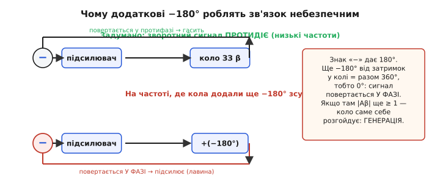
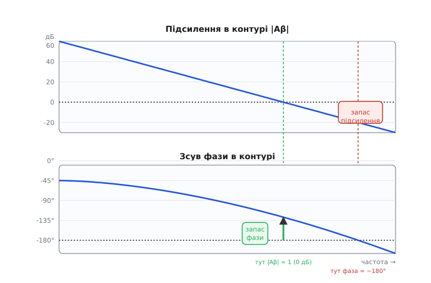
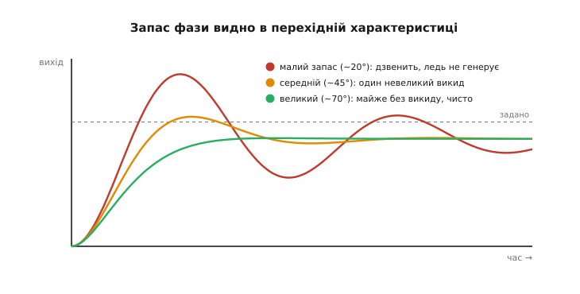

# Запас підсилення і запас фази: наскільки далеко від генерації

[Від'ємний зворотний зв'язок](book:electronics/negative-feedback) — наріжний прийом усієї точної аналогової техніки: повертаємо частину виходу на вхід у протифазі, і коло саме гасить власні відхилення. Та в цьому прийомі ховається пастка. За певних умов той самий зв'язок, що мав **заспокоювати**, раптом починає **розгойдувати** — і замість рівного підсилювача виходить генератор, який дзвенить на якійсь своїй частоті, хоч ви його про це не просили. Підсилювач, кажуть інженери, **«заспівав»**.

Питання, на яке відповідає ця тема, дуже практичне: як здалеку побачити, що коло **близько** до цього зриву — ще до того, як воно зірветься? Відповідь — два числа, **запас підсилення** *(gain margin)* і **запас фази** *(phase margin)*. Вони міряють, скільки «безпечної відстані» лишилося між робочим станом кола й тією межею, за якою воно перетворюється на генератор. Розберімо, звідки ця межа береться, і як ці два запаси її стережуть.

### Звідки взагалі небезпека: коли «мінус» стає «плюсом»

Згадаймо, чому зв'язок звуть **від'ємним**. Сигнал із виходу повертають на вхід так, щоб він **віднімався** — протидіяв змінам. Це віднімання і є той самий «мінус»; математично воно те саме, що додати до сигналу **180°** зсуву фази (півперіоду): протифаза — це і є зсув на 180°.

А тепер ключове спостереження. Будь-який реальний підсилювач і будь-яке реальне коло зворотного зв'язку **не передають сигнал миттєво**. Усередині є ємності, є скінченна швидкодія — і через них на високих частотах сигнал не просто слабшає, а ще й **запізнюється**, тобто набуває **додаткового зсуву фази**. Кожен такий вузол, що накопичує енергію (а отже, дає спад −20 дБ/декаду в [АЧХ](book:electronics/frequency-response)), додає на високих частотах до −90° зсуву. Два такі вузли — уже до −180°.

Простежмо, що з цього виходить. На низьких частотах зв'язок чесно від'ємний: вихід повертається в протифазі (180°) і **віднімається**. Але піднімаймо частоту. Десь кола додають іще −90°, потім −180° власної затримки. Додаймо до них ті «вбудовані» 180° знака «мінус» — і разом виходить **360°**. А зсув на 360° — це те саме, що зсув на 0°: сигнал повертається **точно у фазі** з тим, що вже є на вході. Віднімання непомітно перетворилося на **додавання**. Зв'язок, що мав гасити, тепер **підсилює** сам себе.


*Знак «мінус» зворотного зв'язку — це вже 180°. Коли кола й підсилювач додають ще −180° власної затримки, разом виходить 360° (тобто 0°): сигнал повертається у фазі. Якщо на цій частоті підсилення по контуру ще не впало нижче одиниці — коло саме себе розгойдує в генерацію.*

Чи зірветься коло насправді — залежить від другої умови: **скільки лишилося підсилення** на тій небезпечній частоті. Якщо сигнал, обійшовши весь контур (підсилювач → коло зв'язку → назад на вхід), повертається не тільки **у фазі**, а ще й **не меншим**, ніж вийшов, — кожен оберт додає, амплітуда росте лавиною, аж поки не впреться в рейку живлення. Це і є **самозбудження** — генерація. А якщо сигнал повертається у фазі, але вже **ослаблений** (менший за себе), то кожен оберт його меншає, і сплеск згасає сам. Коло лишається стійким.

Звідси — двоє воріт, крізь які мусить пройти зрив, і коло зривається, лише коли **обоє** відчинені водночас:

```
ворота 1 (фаза):  додатковий зсув сягнув −180°  (разом 360°, сигнал у фазі)
ворота 2 (рівень): на ТІЙ САМІЙ частоті підсилення по контуру |Aβ| ≥ 1
```

Тут `A` — власне (розімкнене) підсилення підсилювача, а `β` — частка виходу, яку коло повертає назад; їхній добуток `Aβ` зветься **підсиленням у контурі** *(loop gain)* — це те, у скільки разів сигнал міняється за один повний оберт по петлі. Уся гра стійкості точиться навколо цих двох умов; докладніше про сам добуток — у темі [підсилення в контурі](book:electronics/loop-gain).

> 🔧 **Навіщо це.** Це не теоретична страшилка — це найпоширеніша причина, чому свіжозібрана плата «дзвенить». Стабілізатор напруги з ємнісним навантаженням, операційний підсилювач, що жене сигнал на довгий кабель чи на вхід АЦП, аудіопідсилювач зі зворотним зв'язком — усі вони мають петлю, і всі можуть зірватися в генерацію на сотнях кілогерц чи мегагерцах, де ви її навіть не побачите простим вольтметром. Запас фази — те єдине число, яке наперед каже, чи переживе ваша петля реальні розкиди деталей, нагрів і навантаження, чи зірветься в полі.

### Два запаси: скільки лишилося до зриву

Раз зрив вимагає **двох** збігів одночасно — фази −180° і підсилення ≥ 1 на тій самій частоті, — то й «безпечну відстань» розумно міряти у **двох** точках. У кожній з них ми тримаємо одну умову зриву виконаною й дивимося, **наскільки не виконана друга**. Та невиконаність і є запас.

**Запас фази** беруть у точці, де підсилення в контурі падає рівно до одиниці — `|Aβ| = 1`, тобто 0 дБ (цю частоту звуть **частотою зрізу контуру**, або частотою одиничного підсилення). На цій частоті ворота рівня вже відчинені: підсилення саме граничне. Лишається спитати: **наскільки далеко фаза від фатальних −180°?** Цю відстань і називають запасом фази:

```
запас фази  =  180°  −  |фактичний зсув фази на частоті, де |Aβ| = 1|
```

Якщо на частоті зрізу фаза накрутила вже −135°, то до −180° їй бракує 45° — запас фази 45°. Якщо фаза вже −175°, запас лише 5°: коло на волосину від зриву. А якщо фаза дійшла −180° саме там, де підсилення впало до одиниці, запас нульовий — коло на самій межі й дзвенить незгасним тоном.

**Запас підсилення** беруть у дзеркальній точці — там, де зсув фази вперше досягає −180° (цю частоту звуть **частотою фазового зрізу**). Тут уже відчинені ворота фази: сигнал повертається точно у фазі. Лишається спитати: **наскільки підсилення в контурі вже нижче одиниці?** Цей запас по рівню й називають запасом підсилення:

```
запас підсилення  =  0 дБ  −  |Aβ| на частоті, де фаза = −180°   (у дБ)
```

Якщо на цій частоті `|Aβ|` уже впало до −12 дБ (учетверо менше за одиницю), запас підсилення 12 дБ: підсилення кола мусило б зрости вчетверо, щоб коло зірвалося. Якщо ж `|Aβ|` там усе ще 0 дБ — запас нульовий, коло на межі.

Обидва запаси відповідають на одне й те саме питання з двох боків: **наскільки треба погіршити справи, щоб обоє воріт відчинилися разом і коло зірвалося?** Запас фази каже це мовою градусів, запас підсилення — мовою децибел.

### Як прочитати обидва запаси з однієї діаграми Боде

Уся принада в тому, що обидва числа видно **з одного графіка** — [діаграми Боде](book:electronics/bode-plot) підсилення в контурі. Це дві панелі під спільною віссю частоти: вгорі — величина `|Aβ|` у децибелах, унизу — зсув фази в градусах. Намалювавши (чи вимірявши) ці дві криві для свого контуру, запаси знімають буквально лінійкою.


*Один графік дає обидва запаси. Знайди частоту, де величина перетинає 0 дБ (зелена вертикаль), і опустись на панель фази — відстань від кривої фази до −180° там і є запас фази. Знайди частоту, де фаза проходить −180° (червона вертикаль), піднімись на панель величини — відстань від кривої до 0 дБ там і є запас підсилення.*

Рецепт читання простий і завжди той самий:

```
1. знайди частоту, де крива |Aβ| перетинає 0 дБ
   → спустись на панель фази на цій частоті
   → ЗАПАС ФАЗИ = 180° − (наскільки фаза вже сповзла)
2. знайди частоту, де крива фази проходить −180°
   → піднімись на панель величини на цій частоті
   → ЗАПАС ПІДСИЛЕННЯ = 0 дБ − (де там крива |Aβ|)
```

Знак запасу одразу каже вирок. **Обидва додатні** — коло стійке: коли підсилення доходить до межі (0 дБ), фаза ще не фатальна; а коли фаза доходить до −180°, підсилення вже безпечно мале. **Хоч один від'ємний** — коло нестійке: знайдеться частота, де відчинені **обоє** ворота, і там воно зірветься. Саме тому даташит будь-якого пристрою зі зворотним зв'язком — операційного підсилювача, стабілізатора, драйвера — наводить графік фази або одразу число запасу фази: це паспорт стійкості.

### Що означає запас фази на практиці: дзвін у перехідній характеристиці

Додатний запас — це «не зірветься». Та інженери женуться не просто за «не зірветься», а за **доброю** поведінкою, і тут запас фази каже куди більше, ніж просте «так чи ні». Він напряму керує тим, як коло реагує на **різку зміну** — на стрибок сигналу на вході.

Інтуїція така. Малий запас фази означає, що коло **ледь-ледь** утримується по той бік межі генерації. Сама генерація — це незгасні коливання; а стан «ось-ось зірветься» — це коливання, що **згасають дуже повільно**. Тож коло з малим запасом на будь-який стрибок відповідає довгим **дзвоном** *(ringing)* — вихід перескакує ціль, вертається, знову перескакує, і так кілька разів, поки заспокоїться. Великий запас фази, навпаки, тримає коло далеко від межі — коливатися йому «нема з чого», і на стрибок воно виходить майже без перельоту, гладко.


*Той самий стрибок на вході, три різні запаси фази. Малий запас (~20°) — вихід довго дзвенить, перескакуючи ціль; коло ледь не генерує. Середній (~45°) — один невеликий викид і швидке заспокоєння. Великий (~70°) — майже без перельоту, чистий вихід. Запас фази керує перельотом і дзвоном напряму.*

Звідси усталені орієнтири, які варто тримати в голові. **Запас фази нижче ~45°** — коло вже помітно дзвенить, перехід негарний; для більшості схем це межа прийнятного. **Близько 45°** — розумний компроміс: невеликий викид (відсотків із двадцять), швидке заспокоєння. **60° і більше** — переліт мізерний, перехід майже ідеально гладкий; це ціль для прецизійних і вимірювальних кіл. **Понад ~70–75°** коло вже надмірно «в'яле»: стійкість бездоганна, але швидкодію ви віддали задарма — переходи стають повільнішими, ніж могли б. Кількісний зв'язок запасу фази з перельотом і згасанням — через модель кола другого порядку — розібрано у вставці [«Запас фази через згасання»](book:electronics/stability-margins/math-second-order-margins.md).

Для запасу підсилення орієнтир грубіший: зазвичай хочуть щонайменше **6 дБ** (удвічі), а краще **10 дБ**, щоб розкид деталей і нагрів не з'їли весь запас. Та на практиці інженери дивляться передусім на **запас фази**: він тісніше пов'язаний із якістю перехідного процесу, і саме його найчастіше наводять і вимірюють.

### Чому запас, а не просто «стійке»

Може здатися: навіщо ці градуси й децибели, коли досить перевірити, що коло стійке тут і зараз? Бо «тут і зараз» — оманливе. Підсилення `A` реального підсилювача **повзе** з температурою й різниться від екземпляра до екземпляра. Ємність навантаження міняється, коли ви чіпляєте до виходу інший кабель чи інший вхід. Кожна з цих змін **зсуває** криві Боде — а отже, і точки перетину, і запаси. Коло, що ледь трималося з запасом 5°, у полі при іншій температурі чи з трохи довшим дротом легко перейде в нуль і **заспіває**.

Тому запас — це не оцінка «стійке/нестійке», а **подушка** на всі майбутні негаразди, яких на столі ще немає. Проєктувати з запасом фази 45–60° означає закласти стільки безпеки, щоб коло пережило найгірший збіг розкидів і лишилося чемним. Це та сама дисципліна, що й [запас завадостійкості](book:electronics/noise-margin) у цифрових схемах: не «працює на моєму столі», а «працюватиме скрізь і завжди».

> 🔧 **Навіщо це.** Класична пастка — операційний підсилювач, що жене сигнал на ємнісне навантаження (довгий кабель, п'єзодавач, вхід АЦП із вхідною ємністю). Ця ємність разом із вихідним опором ОП додає в петлю **ще один** вузол із затримкою, а отже зайвих −90° фази — і запас фази, що був здоровими 60°, провалюється мало не в нуль. Коло, бездоганне без навантаження, починає дзвеніти або генерувати, щойно його під'єднали до реального світу. Знаючи механізм, лік очевидний: повернути запас фази назад — невеликим резистором у вихід (розв'язує ємність) або корекцією контуру.

### Worked-приклад: оцінити запас фази з виміряних точок

Найчастіше запас фази не виводять формулою, а **знімають** із виміряної чи симульованої характеристики контуру. Уявімо, що аналізатор дав нам криву фази контуру кількома точками, і ми хочемо знайти запас фази на частоті зрізу 80 кГц (там, де `|Aβ|` перетинає 0 дБ). Лінійно інтерполюємо фазу між двома сусідніми виміряними точками й рахуємо запас.

**Дано:** на 50 кГц фаза контуру −120°, на 100 кГц −150°; частота зрізу (де |Aβ| = 0 дБ) виміряна як 80 кГц. Знайти запас фази.

:::tabs
```c
#include <stdio.h>

// лінійна інтерполяція фази (у градусах) на частоті f_x
// за двома виміряними точками (f1,ph1) і (f2,ph2)
static float phase_at(float fx,
                      float f1, float ph1,
                      float f2, float ph2) {
    float k = (fx - f1) / (f2 - f1);   // частка шляху від точки 1 до 2
    return ph1 + k * (ph2 - ph1);      // фаза на fx
}

int main(void) {
    float f_cross = 80.0e3f;           // частота зрізу контуру (|Aβ| = 1)

    // фаза на частоті зрізу — інтерполяцією між 50 кГц і 100 кГц
    float ph = phase_at(f_cross,
                        50.0e3f, -120.0f,
                        100.0e3f, -150.0f);

    // запас фази = 180° − |фаза на частоті зрізу|
    float pm = 180.0f - (ph < 0 ? -ph : ph);

    printf("phase at crossover: %.1f deg\n", ph);  // -138.0
    printf("phase margin:       %.1f deg\n", pm);  //  42.0
    return 0;
}
```
```python
# лінійна інтерполяція фази (у градусах) на частоті f_x
# за двома виміряними точками (f1, ph1) і (f2, ph2)
def phase_at(fx, f1, ph1, f2, ph2):
    k = (fx - f1) / (f2 - f1)          # частка шляху від точки 1 до 2
    return ph1 + k * (ph2 - ph1)       # фаза на fx


f_cross = 80.0e3                       # частота зрізу контуру (|Aβ| = 1)

# фаза на частоті зрізу — інтерполяцією між 50 кГц і 100 кГц
ph = phase_at(f_cross,
              50.0e3, -120.0,
              100.0e3, -150.0)

# запас фази = 180° − |фаза на частоті зрізу|
pm = 180.0 - abs(ph)

print(f"phase at crossover: {ph:.1f} deg")  # -138.0
print(f"phase margin:       {pm:.1f} deg")  #  42.0
```
:::

Покрокова арифметика, щоб бачити, звідки числа:

```
частка шляху:   k = (80 − 50) / (100 − 50) = 30 / 50 = 0.6
фаза на 80 кГц: −120 + 0.6·(−150 − (−120)) = −120 + 0.6·(−30) = −138°
запас фази:     180 − 138 = 42°
```

Висновок: запас фази 42°. Це трохи нижче за бажані 45° — коло стійке, але перехідна характеристика вже даватиме помітний переліт із невеликим дзвоном. Якщо ціль — прецизійна схема з гладким переходом, цей контур варто трохи **скомпенсувати**: посунути криву так, щоб на частоті зрізу лишалося ближче до 60°. Те саме число — 42° — одразу попереджає й про вразливість: варто розкиду деталей чи нагріву додати ще десяток градусів зсуву, і запас сповзе в небезпечну зону.

### Корінь історії: підсилювачі, що співали через континент

Ця наука народилася не за столом, а з дорогої практичної біди. У 1920–30-х роках Bell Labs тягнули телефонний сигнал через увесь континент; щоб голос не згас, його пропускали крізь десятки підсилювачів поспіль, і кожен тримав своє підсилення сталим завдяки зворотному зв'язку. Та раз по раз така лінія замість передавати мову **зривалася в свист** — підсилювачі «співали». Зрозуміти, **за якої умови** петля заспіває і як цього певно уникнути, стало питанням на мільйони доларів — і саме звідти виросли і критерій стійкості, і поняття запасів фази та підсилення.

> 📜 **Ціла історія.** Як Гаррі Найквіст (швед-американець у Bell Labs, 1932) дав графічний критерій, коли петля заспіває, як ту саму умову незалежно знайшов німець Фелікс Штреккер у Siemens, і як Гендрік Боде (американець голландського роду, той самий, чиїм ім'ям названо діаграму) перетворив це на практичні «запаси», якими щодня користуються інженери, — в [історичній вставці «Хто навчив петлю не співати»](book:electronics/stability-margins/hist-nyquist-bode.md).

### Суть у двох числах

Від'ємний зворотний зв'язок носить у собі зерно власної загибелі: на високих частотах затримки в петлі докручують зайвих −180° фази, «мінус» обертається «плюсом», і якщо там ще лишилося підсилення — коло зривається в генерацію. Зрив вимагає **двох** збігів одночасно: фаза −180° **і** підсилення в контурі ≥ 1 на тій самій частоті. Два запаси міряють, наскільки далеко ми від цього подвійного збігу: **запас фази** — скільки градусів до −180° лишилося там, де підсилення впало до одиниці; **запас підсилення** — на скільки децибел підсилення вже нижче одиниці там, де фаза дійшла −180°. Обидва читаються з однієї діаграми Боде; обидва мусять бути додатні для стійкості, а здорові значення (запас фази 45–60°, запас підсилення 6–10 дБ) лишають подушку на розкид деталей, нагрів і навантаження — щоб коло було чемним не лише на столі, а скрізь і завжди.
