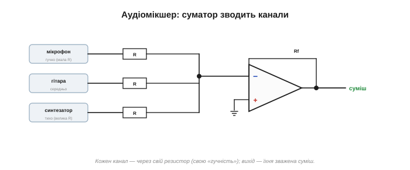
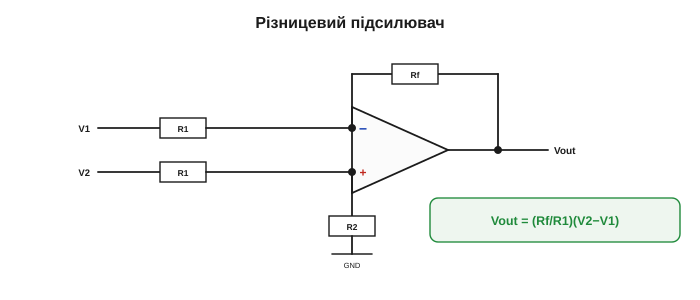
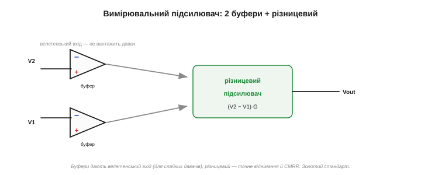

# Суматор і різницевий підсилювач

Операційний підсилювач уміє не лише підсилювати чи [повторювати](topic:electronics/voltage-follower) сигнал — його можна змусити робити справжню **математику**: **складати** й **віднімати** напруги. Це не екзотика, а корінь самої назви: саме для таких операцій операційний підсилювач і створили в аналогових обчислювачах ([📜 історія](topic:electronics/ideal-opamp/hist-opamp.md)). І, що приємно, обидві схеми виводяться тими самими [двома правилами ідеального ОП](topic:electronics/virtual-short).

### Суматор: складаємо напруги

Суматор — це просто [інвертуючий підсилювач](topic:electronics/inverting-noninverting) з **кількома входами**. Замість одного резистора Rin до віртуальної землі ведуть **кілька** — R1, R2, R3 — кожен зі своїм сигналом V1, V2, V3; зворотний зв'язок, як завжди, через Rf; вхід «+» заземлено.

Розрахунок — за тим самим рецептом. Вузол «−» — віртуальна земля (0 В), тож кожен вхід жене в неї свій струм:

```
I1 = V1/R1,   I2 = V2/R2,   I3 = V3/R3
```

У вхід ОП струм не тече (правило 1), тож усі ці струми **складаються** й цілком ідуть крізь Rf. А струм крізь Rf — це −Vout/Rf. Прирівнявши:

```
V1/R1 + V2/R2 + V3/R3 = −Vout/Rf

Vout = − Rf·( V1/R1 + V2/R2 + V3/R3 )
```


*Кілька входів крізь свої резистори ведуть у спільну віртуальну землю; струми там складаються й ідуть крізь Rf. Вихід — зважена сума входів зі знаком «мінус».*

Якщо всі вхідні резистори **однакові** (R1 = R2 = R3 = R), формула спрощується до `Vout = −(Rf/R)·(V1+V2+V3)` — **сума** входів, помножена на спільний коефіцієнт. А якщо ще й Rf = R, то `Vout = −(V1+V2+V3)` — **чиста сума** (з інверсією). Операційний підсилювач буквально склав напруги.

Порахуймо на числах. Три входи 1.0 В, 2.0 В і 0.5 В, усі вхідні резистори по 10 кОм, Rf = 10 кОм: Vout = −(1 + 2 + 0.5) = **−3.5 В**. Чиста сума зі знаком «мінус». А ще зручний родич суматора — **усереднювач**: візьми Rf у N разів меншим за вхідні резистори (де N — кількість входів), і сума поділиться на N — вихід дасть **середнє** входів. Складати, усереднювати, масштабувати — усе тим самим вузлом, лише міняючи резистори.

### Чому це працює: струми додаються

Найгарніше тут — **механізм**. Складання відбувається не «в підсилювачі», а на **віртуальній землі**: кожен вхід незалежно ллє туди свій струм (бо вузол на 0 В, і входи «не бачать» один одного), а закон Кірхгофа просто **підсумовує** ці струми в одному вузлі. ОП же лише забирає сумарний струм крізь Rf й обертає його на напругу. Саме так додавали числа аналогові обчислювачі: **напруги → струми → сума струмів → напруга** ([📜 історія](topic:electronics/ideal-opamp/hist-opamp.md)).


*Магія суматора — у вузлі. Кожен вхід ллє свій струм у віртуальну землю незалежно від інших; закон Кірхгофа складає їх, а Rf обертає суму на напругу. Додавання «руками природи».*

> 🔧 **Навіщо це.** Класичне застосування суматора — **аудіомікшер**. Кілька джерел звуку (мікрофон, гітара, синтезатор) заводять на входи через окремі резистори, і вихід — їхня суміш. Більше: підбираючи окремі вхідні резистори, кожному каналу задають **свою гучність** (свій коефіцієнт у зваженій сумі). Той самий принцип — у цифро-аналогових перетворювачах на зважених резисторах: біти подають на суматор через резистори R, R/2, R/4…, і сума дає аналогову напругу, пропорційну двійковому числу.


*Мікшер на суматорі. Кілька джерел звуку заходять на спільну віртуальну землю через свої резистори; вихід — їхня суміш. Менший вхідний резистор → більший внесок каналу, тобто його «гучність».*

Розгорнімо приклад **цифро-аналогового перетворювача**. Два біти двійкового числа подають як 0 або 5 В: молодший біт — крізь резистор 2R, старший — крізь удвічі менший R (тобто удвічі більший струм). Суматор складе їхні струми у відношенні 1 : 2 — і вихід дасть рівно чотири рівні (00, 01, 10, 11) однаковими сходинками. Більше бітів — більше градацій; так із суматора й кількох резисторів виходить простий ЦАП.

### Різницевий підсилювач: віднімаємо

Тепер протилежна операція — **віднімання**. Сам [ідеальний ОП](topic:electronics/ideal-opamp) за природою підсилює **різницю** входів; різницевий підсилювач лише вгамовує цю шалену здатність резисторами до **точного, заданого** підсилення різниці.

Схема: один сигнал V1 заходить на інвертуючий бік (через R1, з Rf у зворотному зв'язку), а другий, V2, — на неінвертуючий «+» через дільник (R1 і R2, такі самі, як в інвертуючому боці). За умови **узгоджених** резисторів (однакові пари) виходить:

```
Vout = (Rf/R1)·(V2 − V1)
```

Тобто схема бере **різницю** двох входів і підсилює її в Rf/R1 разів. Якщо різниці нема (V1 = V2) — на виході нуль, хоч би якими великими були самі напруги.


*Різницевий підсилювач. V1 — на інвертуючий бік, V2 — на неінвертуючий через однаковий дільник. За узгоджених резисторів вихід = (Rf/R)(V2−V1): чиста різниця, помножена на коефіцієнт.*

Звідки ця формула? Найлегше — через [накладання](topic:electronics/superposition) *(superposition)*. Заземли V2 — і лишиться чистий інвертуючий підсилювач для V1: внесок −(Rf/R1)·V1. Тепер заземли V1 — V2 заходить на «+» через дільник, а далі працює неінвертуюча схема; за узгоджених резисторів її внесок виходить рівно +(Rf/R1)·V2. Склавши обидва, дістаємо Vout = (Rf/R1)(V2 − V1). По суті, це два знайомі підсилювачі в одному корпусі — інвертуючий для одного входу й неінвертуючий для другого.

### Придушення синфазного — головна чеснота

Навіщо віднімати? Бо це дає **придушення синфазного сигналу** — найцінніше для вимірювань. Уявіть давач, увімкнений двома довгими дротами; на обидва дроти наводиться однакова **завада** від мережі. Корисний сигнал — це **різниця** напруг на дротах, а завада — **спільна** (синфазна) частина. Різницевий підсилювач підсилює різницю й **викидає** спільне — тож завада зникає, а сигнал лишається.

Покажемо на числах. Хай на входах 3.0 В і 3.1 В, підсилення Rf/R = 10:

```
спільна (синфазна) частина: ~3 В — ВІДКИДАЄТЬСЯ
різниця: 3.1 − 3.0 = 0.1 В
Vout = 10 · 0.1 = 1.0 В
```

Великі однакові 3 В зникли без сліду, а підсилилася лише корисна різниця 0.1 В. У цьому й уся цінність: корисне часто і є тією крихітною різницею, що ховається під великою спільною напругою.


*Придушення синфазного. На входах 3.0 і 3.1 В: спільні ~3 В схема відкидає, а різницю 0.1 В підсилює в 10 разів до 1 В. Так корисний сигнал витягують з-під однакової на обох входах завади.*

Де це рятує на практиці? У вимірюванні струму двигуна (крихітне падіння на шунті, що «висить» на силовій шині), у зчитуванні сигналу ЕКГ (мікровольти корисного на тлі наведених від мережі вольтів на тілі), у мостових давачах тиску й ваги. Скрізь, де корисна різниця тоне у великій спільній напрузі чи заваді, різницевий підсилювач незамінний — він єдиний уміє «не бачити» спільне.

Наскільки критична узгодженість резисторів? Грубо: розбіжність пар на 1% псує придушення синфазного приблизно до 1:100 — соту частку спільного сигналу схема пропустить на вихід. Для точних вимірів це багато, тому й беруть пари з допуском 0.1% або готові мікросхеми, де пари підігнані лазером до тисячних часток відсотка. Точність вимірювання різниці — це насамперед точність **рівності** резисторів.

> 🔧 **Навіщо це.** Уся сила різницевого підсилювача тримається на **узгодженості резисторів**. Якщо пари не точно однакові, частина синфазного сигналу «протече» на вихід — і завада повернеться. Тому тут беруть прецизійні резистори (0.1% і краще) або готові мікросхеми, де пари підігнано лазером. Міру того, наскільки добре схема давить спільне, звуть **коефіцієнтом придушення синфазного** *(CMRR)* — що він вищий, то чистіший вимір.

Віднімання потрібне не лише для боротьби із завадами. Воно — серце будь-якої **системи керування**: щоб щось регулювати, спершу обчислюють **похибку** — різницю між бажаним і фактичним (як у термостаті, що тримає температуру через [від'ємний зворотний зв'язок](topic:electronics/negative-feedback)). Різницевий підсилювач дає цю похибку напряму, а далі її «відпрацьовують». Тож суматор і відніматель — це не лише «калькулятор», а й цеглинки автоматики: додай бажане, відніми фактичне, підсили похибку — і маєш регулятор.

Часто віднімають навіть не два сигнали, а сигнал і **сталу опорну напругу**: відняв 2.5 В — і змістив сигнал так, щоб він гойдався навколо нуля (це знадобиться, скажімо, щоб «відцентрувати» сигнал перед АЦП). Те саме віднімання, лише один із входів — сталий. Гнучкість тут безмежна: на входи різницевого можна подати будь-що.

> ⚙️ **Як це порахувати.** А коли треба не просто відцентрувати, а **втиснути** один діапазон в інший — скажімо, ±5 В у 0…3.3 В для АЦП: проста методика «два кінці → пряма Vout = m·Vin + b → один ОП» — в [алгоритмічній вставці «Зміщення й масштабування»](topic:electronics/summing-difference-amp/proj-signal-scaling.md).

### Золотий стандарт: вимірювальний підсилювач

У простого різницевого підсилювача є вада: його вхідний опір **помірний** (сигнал заходить крізь резистори), тож слабкий давач він підвантажує. Розв'язок напрошується сам: спершу [буфери](topic:electronics/voltage-follower) на кожен вхід (велетенський опір, не вантажать давач), а вже за ними — різницевий підсилювач. Така зв'язка з трьох ОП зветься **вимірювальним підсилювачем** *(instrumentation amplifier)* — золотий стандарт точного вимірювання слабких диференційних сигналів. Її не треба запам'ятовувати схемою: важливо бачити, що вона **складена** з уже знайомих блоків — буфера й різницевого підсилювача.


*Вимірювальний підсилювач. Два повторювачі (велетенський вхід, не вантажать давач) плюс різницевий підсилювач — золотий стандарт для слабких диференційних сигналів. Складено з простих, добре розв'язаних блоків.*

Зручність такого підсилювача ще й у тому, що все його підсилення задають **одним** резистором (між вхідними каскадами), не чіпаючи решти точно узгоджених пар. Тому готові мікросхеми-[вимірювальні підсилювачі](topic:electronics/instrumentation-amp) мають вивід саме для цього одного резистора: поставив його — і вибрав підсилення, а високий CMRR виробник забезпечив, підігнавши пари лазером усередині. Знову той самий урок: складна функція — з простих, добре розв'язаних блоків.

Варто на мить охопити всю картину. З одного трикутника-ОП і жменьки резисторів виходить напрочуд багато: **підсилити** сигнал ([інвертуючий і неінвертуючий](topic:electronics/inverting-noninverting)), **розв'язати** опори ([буфер](topic:electronics/voltage-follower)), **скласти** напруги (суматор) і **відняти** їх (різницевий), а з парою конденсаторів — ще й інтегрувати та диференціювати. Це фактично повний набір для аналогової обробки сигналу. Будь-який реальний тракт — давач, підсилення, віднімання фону, фільтр, буфер перед АЦП — складають саме з цих небагатьох цеглинок, з'єднуючи їх у ланцюг. У них — суть аналогової схемотехніки на операційних підсилювачах. Скажімо, цифрові ваги всередині — це міст-давач, вимірювальний підсилювач, фільтр і АЦП; кардіограф — вимірювальний підсилювач із могутнім придушенням мережевої завади, фільтр і підсилення; і те, і те зібрано з тих самих кількох блоків.

### І ще дві операції — натяк

А якщо замість резистора Rf поставити **конденсатор**? Тоді сумарний струм у віртуальній землі заряджатиме його, і вихід відбиватиме вже не миттєву суму, а **накопичену з часом** величину — ОП почне **інтегрувати** сигнал. А конденсатор на **вході** дасть протилежне — **диференціювання**. Це решта операцій аналогового обчислювача ([📜 історія](topic:electronics/ideal-opamp/hist-opamp.md)), і виходять вони з тих самих двох правил: треба лише пам'ятати, що струм [конденсатора](topic:electronics/capacitor) залежить від **швидкості зміни** напруги на ньому. У ці схеми ми не заглиблюватимемося, та приємно знати: додавання, віднімання, інтегрування й диференціювання — це все той самий ОП, лише з різною обв'язкою. Аналоговий «калькулятор» зібрано.

Усі ці схеми поєднує одне: ОП тут працює під від'ємним зворотним зв'язком — слухняний, лінійний, точно скований резисторами. Та якщо зв'язок **прибрати**, той самий трикутник стає шаленим, але по-корисному: без зворотного зв'язку він блискавично **порівнює** дві напруги й каже, котра більша. На цьому тримається [компаратор](topic:electronics/comparator) — вхід в іншу, нелінійну половину світу операційних підсилювачів.
