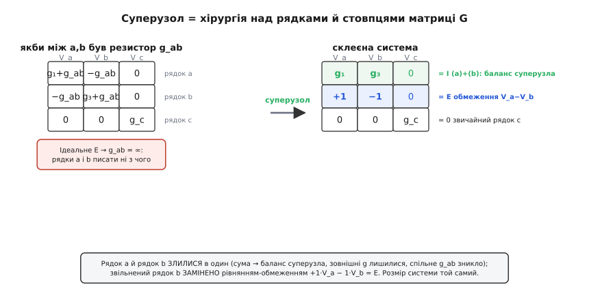

# 🧮 Суперузол на матриці: склеювання рядків і стовпців

Прийом суперузла можна тримати в голові як картинку — обвести два вузли межею, скласти струми крізь неї, дописати рівняння джерела. Картинка чесна й її досить, щоб розв'язати задачу руками. Але симулятор кіл картинок не малює: він складає **матрицю** і розв'язує систему виключенням Гаусса. І щойно перейти на мову матриць, суперузол відкриває своє друге, точніше обличчя — він виявляється не «обведенням межі», а цілком конкретною **операцією над рядками й стовпцями матриці провідностей**: два рядки додаються в один, а на звільнене місце лягає рівняння-обмеження. Те саме за змістом, та в формі, яку машина виконує без жодної інтуїції — і саме так її й виконує SPICE.

Розберімо це з самого низу: як матриця провідностей узагалі **народжується** з огляду гілок, чому ідеальне джерело напруги робить у ній діру, як суперузол цю діру акуратно зашиває переписуванням рядків — і як той самий результат виходить ще чистіше, коли струм джерела взяти за повноцінну невідому. Наприкінці — робочий C, що збирає систему стампами й розв'язує її.

## Звідки береться матриця: стамп кожної гілки

Метод вузлових потенціалів каже: у кожному не-опорному вузлі сума витоків дорівнює нулю, а кожен виток виражено через [закон Ома](topic:electronics/ohms-law) як `(V_i − V_j)/R`. Зберімо ці рівняння для кола з вузлами 1…n і подивімося, що з них складається.

Візьмімо один резистор провідністю g = 1/R між вузлами i та j. Він дає виток `g·(V_i − V_j)` з вузла i — і рівний за модулем виток `g·(V_j − V_i)` з вузла j. У рівнянні вузла i це додає доданок `+g·V_i − g·V_j`; у рівнянні вузла j — `+g·V_j − g·V_i`. Випишімо, **куди** в матриці лягають ці чотири коефіцієнти, якщо систему записати як G·V = I:

```
            стовпець i   стовпець j
рядок i:       +g           −g
рядок j:       −g           +g
```

Це й називають **стампом** (англ. *stamp* — відбиток) резистора. Кожна гілка лишає такий відбиток у матриці: **додає** свою провідність на дві діагональні клітинки (i,i) та (j,j) і **віднімає** її з двох позадіагональних (i,j) та (j,i). Уся матриця G збирається тупим проходом по списку гілок — узяв гілку, відштампував чотири числа, перейшов до наступної. Жодних рівнянь писати не треба; матриця **накопичується** доданок за доданком.

> 🔧 **Навіщо це.** Стамп — це те, як симулятор будує систему насправді: не «складає рівняння вузлів», а пробігає нетлист і для кожного елемента додає його відбиток у спільну матрицю. Резистор, конденсатор, котушка, керована провідність транзистора — у кожного свій стамп; складність кола ніяк не ускладнює сам процес складання, лише робить його довшим. Хто бачить матрицю як суму стампів, той розуміє, чому додати в схему ще тисячу резисторів симуляторові так само легко, як один, і де народжується розрідженість (англ. *sparsity*) матриці — більшість пар вузлів не з'єднані прямо, тож більшість позадіагональних клітинок лишаються нулями.

Коли гілка йде на опорний вузол (землю), її другий індекс «випадає»: стовпця й рядка землі в матриці немає (її потенціал — нуль, відлік), тож із чотирьох коефіцієнтів лишається один — `+g` на діагоналі того вузла, що висить над землею. Тому **діагональ** матриці G — це завжди сума **всіх** провідностей, причеплених до вузла (зокрема й тих, що йдуть на землю), а **позадіагональ** (i,j) — це зі знаком мінус провідність прямої гілки між i та j. Матриця виходить **симетрична** (бо резистор не розрізняє, з якого боку на нього дивитися: g між i та j — те саме, що g між j та i) і **діагонально переважна** — на діагоналі сума того, що по рядку розкидане позадіагонально. Ця структура не випадкова: вона гарантує, що систему завжди можна розв'язати, і пояснює, чому метод вузлових потенціалів такий безвідмовний.

Права частина I — вектор струмів, що **втікають** у вузли від [джерел струму](topic:electronics/current-source): джерело струму, яке жене ампер у вузол i, додає `+I` у i-й рядок правої частини. От і вся система: G — зі стампів резисторів, I — від джерел струму.

> Чому матриця, зібрана зі стампів, завжди має єдиний розв'язок (доки коло не «плаває» цілими острівцями без зв'язку із землею), як її розв'язують прямим ходом і коли вона стає виродженою — у статтях [лінійні системи](topic:math/linear-systems) та [метод Гаусса](topic:math/gauss-elimination). Тут ми беремо розв'язування як готовий механізм і дивимося, що з матрицею робить джерело напруги.

## Де джерело напруги ламає матрицю

Тепер поставмо між вузлами a та b ідеальне [джерело напруги](topic:electronics/dependent-sources) E замість резистора. І спробуймо його відштампувати — а нічого не виходить. Стамп резистора будувався на провідності g = 1/R; в ідеального джерела опір нульовий, тож провідність **нескінченна**, і чотири коефіцієнти стампа — `±∞`. Матрицю з нескінченностями не розв'язати.

Подивімося на це ближче, бо тут уся суть. Якби між a та b стояв резистор g_ab, рядки a та b мали б такий вигляд (зовнішні провідності вузлів позначу g_a і g_b — це сума всього, що чіпляється до a та b **крім** спільної гілки):

```
рядок a:   (g_a + g_ab)·V_a  −  g_ab·V_b   = (втік у a ззовні)
рядок b:    −g_ab·V_a  +  (g_b + g_ab)·V_b = (втік у b ззовні)
```

Спрямуймо g_ab → ∞ (резистор перетворюється на ідеальний провід із заданою на ньому напругою): коефіцієнти при V_a та V_b в обох рядках розлітаються в нескінченність. Рядки a та b **обидва зіпсовані** — у кожному сидить нескінченний коефіцієнт, який нема чим замінити. Це і є матричний образ тієї самої біди: невідомий струм крізь джерело, що в розповіді про межу рвав баланс струмів, тут обертається на нескінченну провідність, яку не відштампуєш.


*Матричний бік суперузла. Якби між a та b стояв резистор g_ab, рядки a і b мали б його коефіцієнти; для ідеального E це g_ab → ∞ — рядки писати ні з чого. Суперузол додає рядок a й рядок b в один (нескінченні коефіцієнти спільної гілки взаємно знищуються, лишаються самі зовнішні провідності — баланс суперузла), а звільнений рядок замінює рівнянням-обмеженням V_a − V_b = E. Розмір системи незмінний.*

## Склеювання: додай два рядки, заміни один на обмеження

Ось ключове спостереження, з якого все випливає. Подивіться на зіпсовані коефіцієнти спільної гілки в двох рядках: у рядку a при V_a стоїть `+g_ab`, у рядку b при V_a стоїть `−g_ab`. **Протилежні за знаком.** Те саме з коефіцієнтами при V_b: `−g_ab` у рядку a і `+g_ab` у рядку b. А тепер **додаймо ці два рядки** — рядок a плюс рядок b — у один новий рядок:

```
(рядок a) + (рядок b):
  (g_a + g_ab − g_ab)·V_a  +  (g_b + g_ab − g_ab)·V_b  = (втік ззовні в a) + (втік ззовні в b)
            g_a·V_a        +            g_b·V_b         = (зовнішні струми обох)
```

Нескінченні коефіцієнти спільної гілки **взаємно знищилися** — `+g_ab` від одного рядка погасив `−g_ab` від іншого, і то незалежно від того, скінченне g_ab чи нескінченне. Лишилися самі **зовнішні** провідності g_a та g_b. А це ж — рівно баланс струмів **суперузла**: сума витоків обох вузлів крізь зовнішні гілки дорівнює сумі струмів, що ззовні в них втікають. Алгебра відтворила картинку з межею **сама**: коли додаєш рядки двох вузлів, внутрішня гілка між ними (хоч резистор, хоч джерело) випадає з рівняння автоматично, бо її коефіцієнти в цих двох рядках завжди протилежні. Ось чому «струм крізь джерело не перетинає межу» — це не геометрична випадковість, а наслідок того, що внутрішня гілка вкладає в баланси двох своїх вузлів рівні й протилежні струми.

Тепер у нас новий рядок-сума замість двох старих — отже, **одне** рівняння замість двох, а невідомих усе ще n. Бракує одного рядка. Його дає саме джерело: воно жорстко зв'язує V_a і V_b. Ставимо цей зв'язок на **звільнене** місце (туди, де був, скажімо, рядок b) — рівняння-обмеження з коефіцієнтами +1 та −1:

```
рядок-обмеження:   (+1)·V_a  +  (−1)·V_b  =  E
```

І все. Замість двох зіпсованих рядків матриця тепер має **рядок-суму** (баланс суперузла, самі скінченні зовнішні провідності) і **рядок-обмеження** (+1, −1 у двох потрібних стовпцях, E у правій частині). Розмір системи **не змінився** — як було n×n, так і лишилося; ми не викинули рядок, а замінили його змістовнішим. Уся «хірургія» суперузла — це **дві операції над рядками**: рядок_a ← рядок_a + рядок_b, потім рядок_b ← рівняння-обмеження. Стовпці чіпати не доводиться — вони лишаються тими самими стовпцями V_a, V_b, … Симетрію ми при цьому втрачаємо (рядок-обмеження несиметричний), але розв'язності це не шкодить: виключення Гаусса симетрії й не вимагає.

> 🔧 **Навіщо це.** Ось чому в симуляторі ідеальне джерело напруги між двома вузлами — не «особливий випадок, який треба обходити стороною», а штатна операція над матрицею: складання двох рядків і вписування рівняння-обмеження. Розуміння, що це рівнозначно склеюванню рядків, дає правильну картину того, чому ідеальне джерело напруги «зшиває» два вузли в один ступінь свободи: з двох незалежних потенціалів лишається один вільний (другий жорстко за ним слідує через E). Звідси й діагностика: якщо двома такими джерелами замкнути контур (E₁ між a,b і E₂ між b,a з несумісними значеннями) — рядки-обмеження стануть суперечливими, матриця виродиться, і симулятор кине «singular matrix».

## Загальний випадок: кілька суперузлів і залежне джерело

Усе сказане масштабується без жодних нових ідей. Якщо в колі **кілька** «плаваючих» джерел напруги, кожне дарує свою пару операцій: пара вузлів складається в рядок-суму, один зі звільнених рядків заповнюється обмеженням цього джерела. Суперузли можуть навіть **зчіплюватися** — коли два джерела діляться спільним вузлом (E₁ між a,b і E₂ між b,c), усі три вузли a, b, c вливаються в один великий суперузол: складаються **три** рядки в один баланс, а два звільнені рядки дістають два обмеження `V_a − V_b = E₁` та `V_b − V_c = E₂`. Рахунок завжди сходиться: скільки джерел напруги забрали рядків-балансів, стільки ж віддали рядків-обмежень.

Коли всередині суперузла сидить **залежне** джерело — кероване струмом чи напругою деінде в колі, — змінюється лише **права частина** рядка-обмеження, та й то не завжди залишається праворуч. Хай джерело задає `V_a − V_b = k·V_x`, де V_x — напруга якогось вузла x (керування за напругою). Тоді рівняння-обмеження — `V_a − V_b − k·V_x = 0`: керівну величину виражаємо через ті самі вузлові потенціали й переносимо в **ліву** частину, додаючи −k у стовпець x того ж рядка. Праворуч лишається нуль. Так само з керуванням за струмом: струм-керівник `I_y = g_y·(V_p − V_q)` (якщо тече крізь резистор) теж розкладається у вузлові потенціали й лягає коефіцієнтами в ліву частину. Структура матриці не псується — просто рядок-обмеження дістає більше ненульових клітинок, ніж прості +1/−1.

> Як саме означують і читають керовані джерела — джерело напруги, кероване напругою (VCVS), струмом (CCVS) тощо — і навіщо вони потрібні для моделей транзисторів та підсилювачів, розгортає тема [залежні джерела](topic:electronics/dependent-sources). Тут важливе одне: керування завжди можна виразити через вузлові потенціали, тож обмеження лишається лінійним рівнянням і охоче лягає в матрицю.

Той самий хід має дзеркало в [методі контурних струмів](topic:electronics/mesh-analysis): там матрицю складають **опори**, невідомі — контурні струми, а проблемним елементом стає ідеальне джерело струму на спільній гілці — і його лікують **суперконтуром**, тобто складанням двох рядків матриці опорів і рівнянням-обмеженням за струмом джерела. Алгебра буква в букву та сама, лише слова «провідність/потенціал» міняються на «опір/контурний струм».

Промислові симулятори доходять до того самого результату ще однорідніше — беруть невідомий струм джерела за повноцінну невідому й додають під кожне джерело напруги свій рядок і стовпець, тож суперузол виходить сам собою, без розпізнавання конфігурацій; як саме складається ця блокова система, чому ідеальне джерело напруги додає в неї рядок і звідки метод узявся — розгорнуто в окремому розборі [вузлового аналізу та його модифікації (MNA)](topic:electronics/spice-simulation/math-nodal-mna.md).

## Робочий C: зібрати матрицю стампами й розв'язати

Зведімо все докупи в код, що збирає систему **рівно так, як симулятор** — стампами, — і розв'язує її виключенням Гаусса. Візьмімо ту саму схему, що в темі-власнику числово: джерело струму I жене 6 мА у вузол a; резистори R₁ (a→земля) і R₃ (b→земля); ідеальне джерело E = 3 В між a і b, плюсом до a. Замість руками виводити дві формули суперузла, складемо повну матрицю — спершу стампи резисторів і джерела струму, потім **дві операції суперузла над рядками** (склеювання + обмеження) — і розв'яжемо. Так видно сам механізм, а не готову відповідь.

:::tabs
```cpp
#include <stdio.h>

// Розв'язання лінійної системи A·x = b методом Гаусса з частковим вибором
// головного елемента (n рівнянь, n невідомих). A руйнується на місці.
// Повертає 0, якщо матриця вироджена (singular) — як це робить симулятор.
static double dabs(double v) { return v < 0 ? -v : v; }

static int gauss_solve(int n, double A[][8], double b[], double x[])
{
    for (int col = 0; col < n; ++col) {
        // вибір головного елемента: найбільший за модулем у стовпці
        int piv = col;
        for (int r = col + 1; r < n; ++r)
            if (dabs(A[r][col]) > dabs(A[piv][col]))
                piv = r;
        if (dabs(A[piv][col]) < 1e-15) return 0;   // вироджена матриця
        // переставити рядки piv та col (і праву частину)
        for (int c = 0; c < n; ++c) { double t = A[col][c]; A[col][c] = A[piv][c]; A[piv][c] = t; }
        { double t = b[col]; b[col] = b[piv]; b[piv] = t; }
        // виключити змінну col з усіх інших рядків
        for (int r = 0; r < n; ++r) {
            if (r == col) continue;
            double f = A[r][col] / A[col][col];
            for (int c = col; c < n; ++c) A[r][c] -= f * A[col][c];
            b[r] -= f * b[col];
        }
    }
    for (int i = 0; i < n; ++i) x[i] = b[i] / A[i][i];   // діагональ → розв'язок
    return 1;
}

int main(void)
{
    // Вузли: 0 = a, 1 = b. Земля — опорна, у матриці її немає.
    const int n = 2;
    double G[8][8] = {{0}};     // матриця провідностей (См)
    double I[8]    = {0};       // права частина: струми, що ВТІКАЮТЬ у вузли (А)
    double V[8]    = {0};

    const double R1 = 2e3, R3 = 3e3;   // Ом
    const double Iin = 6e-3;           // А, джерело струму у вузол a
    const double E  = 3.0;             // В, джерело напруги між a і b (плюс до a)

    // ── стампи гілок на землю: лишають +g лише на діагоналі свого вузла ──
    G[0][0] += 1.0 / R1;        // R1: a → земля
    G[1][1] += 1.0 / R3;        // R3: b → земля
    // (якби між a і b стояв РЕЗИСТОР g_ab, тут був би повний стамп:
    //  G[0][0]+=g_ab; G[1][1]+=g_ab; G[0][1]-=g_ab; G[1][0]-=g_ab; )

    // ── стамп джерела струму: +I у рядок правої частини того вузла ──
    I[0] += Iin;                // 6 мА втікає у вузол a

    // На цьому етапі рядки a і b були б готові, АЛЕ між ними — ідеальне E.
    // Робимо дві операції суперузла прямо над матрицею:

    // 1) СКЛЕЮВАННЯ: рядок a ← рядок a + рядок b  (баланс суперузла).
    //    Спільної гілки тут і немає, тож складаються самі зовнішні провідності
    //    та зовнішні струми — рядок стає рівнянням  g1·V_a + g3·V_b = Iin.
    for (int c = 0; c < n; ++c) G[0][c] += G[1][c];
    I[0] += I[1];

    // 2) ОБМЕЖЕННЯ: звільнений рядок b ← рівняння джерела  V_a − V_b = E.
    G[1][0] = +1.0;  G[1][1] = -1.0;  I[1] = E;

    if (!gauss_solve(n, G, I, V)) { printf("singular matrix\n"); return 1; }

    printf("V_a = %.3f В,  V_b = %.3f В\n", V[0], V[1]);   // -> 8.400, 5.400
    return 0;
}
```
```python
# Вузли: 0 = a, 1 = b. Земля — опорна, у матриці її немає.


def gauss_solve(A, b):
    """Розв'язання лінійної системи A·x = b методом Гаусса з частковим
    вибором головного елемента (n рівнянь, n невідомих). A і b руйнуються
    на місці. Повертає None, якщо матриця вироджена (singular) — як симулятор."""
    n = len(b)
    for col in range(n):
        # вибір головного елемента: найбільший за модулем у стовпці
        piv = max(range(col, n), key=lambda r: abs(A[r][col]))
        if abs(A[piv][col]) < 1e-15:
            return None                      # вироджена матриця
        # переставити рядки piv та col (і праву частину)
        A[col], A[piv] = A[piv], A[col]
        b[col], b[piv] = b[piv], b[col]
        # виключити змінну col з усіх інших рядків
        for r in range(n):
            if r == col:
                continue
            f = A[r][col] / A[col][col]
            for c in range(col, n):
                A[r][c] -= f * A[col][c]
            b[r] -= f * b[col]
    return [b[i] / A[i][i] for i in range(n)]  # діагональ → розв'язок


def main():
    n = 2
    G = [[0.0] * n for _ in range(n)]   # матриця провідностей (См)
    I = [0.0] * n                       # права частина: струми, що ВТІКАЮТЬ у вузли (А)

    R1, R3 = 2e3, 3e3                   # Ом
    Iin = 6e-3                          # А, джерело струму у вузол a
    E = 3.0                            # В, джерело напруги між a і b (плюс до a)

    # ── стампи гілок на землю: лишають +g лише на діагоналі свого вузла ──
    G[0][0] += 1.0 / R1                # R1: a → земля
    G[1][1] += 1.0 / R3                # R3: b → земля
    # (якби між a і b стояв РЕЗИСТОР g_ab, тут був би повний стамп:
    #  G[0][0]+=g_ab; G[1][1]+=g_ab; G[0][1]-=g_ab; G[1][0]-=g_ab; )

    # ── стамп джерела струму: +I у рядок правої частини того вузла ──
    I[0] += Iin                        # 6 мА втікає у вузол a

    # На цьому етапі рядки a і b були б готові, АЛЕ між ними — ідеальне E.
    # Робимо дві операції суперузла прямо над матрицею:

    # 1) СКЛЕЮВАННЯ: рядок a ← рядок a + рядок b  (баланс суперузла).
    #    Спільної гілки тут і немає, тож складаються самі зовнішні провідності
    #    та зовнішні струми — рядок стає рівнянням  g1·V_a + g3·V_b = Iin.
    for c in range(n):
        G[0][c] += G[1][c]
    I[0] += I[1]

    # 2) ОБМЕЖЕННЯ: звільнений рядок b ← рівняння джерела  V_a − V_b = E.
    G[1][0] = +1.0
    G[1][1] = -1.0
    I[1] = E

    V = gauss_solve(G, I)
    if V is None:
        print("singular matrix")
        return

    print(f"V_a = {V[0]:.3f} В,  V_b = {V[1]:.3f} В")   # -> 8.400, 5.400


if __name__ == "__main__":
    main()
```
:::

Серце прикладу — не розв'язувач (звичайний Гаусс), а **п'ять рядків стампів і дві операції суперузла**. Спершу матриця накопичується відбитками гілок — точнісінько як у симуляторі: кожна гілка на землю кладе своє `+g` на діагональ, джерело струму кладе свій струм у праву частину. Якби між a та b стояв резистор, повний стамп (закоментований) поклав би провідність ще й на дві позадіагональні клітинки. А далі — суперузол **як він є в матриці**: рядок a вбирає рядок b (склеювання, після якого внутрішня гілка випала б сама), а звільнений рядок b переписується на рівняння-обмеження. Виключення Гаусса дає V_a = 8.400 В, V_b = 5.400 В — ті самі числа, що й ручний суперузол у темі-власнику, лише дістані механічним шляхом, яким їх дістає машина.

Помітьте, що цей самий каркас — матриця-стампи + Гаусс — розв'яже коло **будь-якого** розміру: побільшити `n`, додати стампів за гілками, доробити пари операцій під кожне плаваюче джерело — і конвеєр поїде так само. Це і є, у мініатюрі, те, що крутиться всередині симулятора: складання системи з відбитків і один розв'язувач на все. (Промисловий MNA йде ще однорідніше — замість двох окремих операцій суперузла він додає рядок і стовпець під струм джерела й покладає склеювання на сам Гаусс; результат той самий, а код стампів стає геть однорідним.)

## Що варто винести

Матричний бік суперузла знімає з прийому всю «магію межі» й показує його справжню природу — операцію над рядками й стовпцями. Матриця провідностей G народжується не з рівнянь, а зі **стампів**: кожна гілка додає `+g` на дві діагональні клітинки своїх вузлів і `−g` на дві позадіагональні; діагональ виходить сумою всіх провідностей вузла, матриця — симетричною й діагонально переважною. Ідеальне джерело напруги цей механізм ламає: його провідність нескінченна, рядки обох вузлів стають незаписувані. Суперузол лагодить це **двома операціями над рядками**: рядок_a ← рядок_a + рядок_b (нескінченні коефіцієнти спільної гілки взаємно гинуть, лишається баланс суперузла — і це доводить, чому внутрішня гілка випадає з рівняння сама), а звільнений рядок_b ← рівняння-обмеження V_a − V_b = E. Розмір системи незмінний; кілька джерел дають кілька таких пар, зчеплені суперузли зливають по три й більше рядки, залежне джерело лише наповнює рядок-обмеження додатковими коефіцієнтами. А SPICE ту саму систему складає ще однорідніше — модифікованим вузловим аналізом, де струм джерела стає окремою невідомою й суперузол виходить сам. Хто бачить суперузол як склеювання рядків, той читає і ручний розв'язок, і вивід SPICE як одну й ту саму алгебру.
