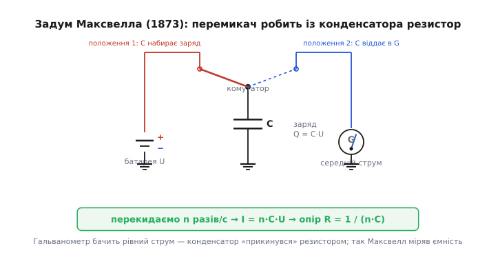

# 📜 Як Максвелл зробив із конденсатора резистор — і чому світ згадав про це аж через сто років

Є ідеї, що народжуються раніше за світ, у якому могли б знадобитися. Їх записують, друкують, навіть користуються ними — а потім вони лягають у запас на десятиліття, бо немає матеріалу, на якому вони ожили б. Думка про комутований конденсатор — рівно така. Її чітко, з формулою, виклав Джеймс Клерк Максвелл (James Clerk Maxwell) ще 1873 року, у тій самій книзі, де світ уперше побачив рівняння електромагнетизму. А по-справжньому запрацювала вона лише наприкінці 1970-х, коли з'явився кремній, що вмів робити дрібні конденсатори й швидкі ключі майже задарма. Між записом ідеї та її втіленням лягло понад століття — і це не випадковість, а ключ до того, **чому** ідея саме така, як є.

Розберімо цю історію не як перелік дат, а як ланцюг: що бентежило людей, який фокус вони знайшли, чому фокус довго нікому не був потрібен — і що раптом зробило його незамінним.

## Задача, з якої все почалося: як зважити конденсатор

Щоб зрозуміти думку Максвелла, треба стати на його місце й відчути його клопіт. А клопіт був дуже конкретний: **як виміряти ємність конденсатора?**

Сьогодні це натиск кнопки на мультиметрі. У 1860–70-х роках жодного такого приладу не існувало. Що в лабораторії того часу вміли вимірювати **добре** — то це опір. Для опору були мости (мостова схема Вітстона), були еталонні котушки опору, була ціла культура точних порівнянь: невідомий опір зрівнюють із відомим, і стрілка гальванометра застигає на нулі. Опір був «твердою валютою» електричних вимірів.

> 🔧 **Навіщо це.** Зрозуміти цю історію — означає зрозуміти, **звідки взялася сама формула** R = 1/(f·C), яку ви бачите в кожному фільтрі на комутованих ємностях. Вона не вигадка інженерів кремнієвої доби: це фізична тотожність, яку Максвелл вивів, щоб **звести вимір ємності до виміру опору** — бо опір міряти вміли, а ємність ні. Інженери ХХ століття просто прочитали ту саму тотожність навпаки: не «зробімо з конденсатора еталон опору», а «зробімо з конденсатора керований резистор у кремнії».

А ось ємність — річ незручна. Конденсатор не пропускає сталого струму, на ньому не «висить» опору, який можна вкинути в міст. Він **накопичує** заряд і **віддає** його — і обидві дії короткі, імпульсні, їх не зловиш звичайним гальванометром, що показує усереднене. Конденсатор сам по собі — не та річ, яку прямо порівняєш із котушкою опору. Потрібен був місток між двома світами: між світом імпульсного заряду й світом сталого струму, яким лабораторія вже володіла.

Максвелл цей місток і збудував. І збудував його приголомшливо просто: **змусив конденсатор віддавати заряд так часто й рівномірно, що в середньому крізь нього потік сталий струм — точнісінько як крізь резистор.**

## Фокус Максвелла: перемикач, що перетворює конденсатор на провідник

У другому томі «Трактату про електрику й магнетизм» (*A Treatise on Electricity and Magnetism*, 1873, т. 2, с. 374–375) Максвелл описує таку схему. Конденсатор C під'єднано через **перекидний перемикач** — він тоді звався *commutator*, комутатор, бо «комутує», перекидає з'єднання. Перемикач має два положення. В одному конденсатор торкається джерела (батареї) і **набирає** заряд до напруги джерела. У другому — конденсатор перекидають на інше коло (через гальванометр) і він **віддає** накопичене.

Тепер головне: цей перемикач **хитають туди-сюди швидко й рівномірно**, n разів на секунду. (Максвелл позначав частоту перекидань буквою n; ми у статті писали f — це те саме.) Що бачить зовнішнє коло? Воно бачить, що щомиті конденсатор то набирає, то віддає однакову порцію заряду. А порція ця — добре відома: повністю заряджений конденсатор несе заряд

```
Q = C · U
```

де U — напруга, до якої його заряджають. За кожне повне коло перемикача ця порція проходить крізь коло. Якщо перемикач робить n повних циклів за секунду, то за секунду крізь коло протече

```
I = n · Q = n · C · U
```

Зупиніться тут на мить — у цій короткій формулі сидить уся ідея. Зліва — **середній струм**, та сама стала величина, яку гальванометр чесно покаже стрілкою. Справа — добуток частоти перемикань, ємності й напруги. А тепер прочитаймо цей самий вираз очима людини, що шукає опір. Закон Ома каже: струм дорівнює напрузі, поділеній на опір, I = U/R. Порівняймо два записи струму:

```
I = U / R          (резистор)
I = n · C · U      (наш перемикуваний конденсатор)
```

Щоб вони збіглися, опір має бути

```
R = U / I = U / (n·C·U) = 1 / (n · C)
```

Напруга скоротилася — і лишилося чисте, разюче: **конденсатор, який перекидають n разів на секунду, поводиться для зовнішнього кола як резистор з опором 1/(n·C).** Не приблизно, не для якогось окремого випадку, а як точна тотожність для середнього струму. Максвелл здобув те, чого прагнув: він зробив із незручної ємності **звичайний опір** — а опір лабораторія вже вміла міряти з будь-якою бажаною точністю.

Далі — діло техніки його доби. Маючи цей еквівалентний опір, Максвелл зрівнює його з відомою котушкою опору (тим самим мостом, тими самими методами, що вже описані в попередніх частинах його книги), знаходить R, а тоді з тотожності R = 1/(n·C) обчислює невідому ємність:

```
C = 1 / (n · R)
```

Ось і весь задум. Батарея заряджає, гальванометр показує середній струм, перемикач хитається з відомою частотою — і **вимір ємності зведено до виміру опору**. Незручне обернули на звичне. Це класичний хід ученого: не міряти важку величину напряму, а **перетворити її на ту, яку міряти легко**.


*Задум Максвелла 1873 року. Перекидний перемикач (commutator) хитається n разів на секунду: в одному положенні конденсатор C набирає заряд Q = C·U від батареї, у другому — віддає його в коло з гальванометром. Гальванометр бачить рівний середній струм I = n·C·U — той самий, що тік би крізь резистор R = 1/(n·C). Зрівнявши цей «резистор» із відомою котушкою опору, Максвелл обчислював невідому ємність. Та сама тотожність через сто років стала «резистором», керованим тактом, усередині мікросхеми.*

Зверніть увагу на статус цього твердження: це **усталений історичний факт**, не легенда. Опис стоїть друкованим текстом у другому томі «Трактату» — книзі, яку перевидавали безліч разів і яка доступна посторінково донині. Максвелл не «здогадувався» й не «передбачав» — він **користувався** цим як робочим лабораторним методом виміру ємності. Те, що згодом із цього виросла ціла галузь мікроелектроніки, Максвеллові, звісно, й не снилося: він розв'язував свою задачу свого часу.

## Хто такий Максвелл — і чого тут немає жодного «імперського» сліду

Кілька слів про самого автора, бо ім'я це варте точності. Джеймс Клерк Максвелл — **шотландець**, народився 13 червня 1831 року в Единбурзі, на вулиці Індія-стріт, 14. Учився в Единбурзькій академії, потім в Единбурзькому університеті, далі — у Кембриджі (Триніті-коледж). Він — постать світового масштабу: його рівняння об'єднали електрику, магнетизм і світло в єдину теорію, і це друге велике об'єднання у фізиці після Ньютонового.

Тут немає жодних спірних питань атрибуції — авторство «Трактату» й самого методу комутатора однозначне й документоване, тож нічого «розплутувати». Згадуємо походження лише для точності: Максвелл — шотландський фізик британської доби, і це все, що про національний бік історії треба сказати. Решта дійових осіб цієї розповіді — американські та канадські дослідники другої половини ХХ століття, теж із прозорою, незаперечною атрибуцією. Жодних кампаній «першості», жодних приписувань — рідкісно чистий випадок в історії техніки.

## Чому геніальна думка пролежала майже сто років

Тепер — найцікавіше питання всієї історії. Якщо тотожність R = 1/(n·C) була відома з 1873 року, друкована в найвідомішій книзі з електрики, — **чому світ не кинувся будувати на ній схеми?** Чому вона мовчала майже століття?

Відповідь не в тому, що про неї забули, — про неї знали й користувалися нею у вимірах. Відповідь у тому, що **довго не було задачі, яку вона розв'язувала б краще за наявні засоби**. А це найважливіший урок про природу винаходів: ідея оживає не тоді, коли її придумали, а тоді, коли світ доростає до потреби в ній і дає матеріал для втілення.

Подумаймо, чого вимагає фокус Максвелла, щоб із лабораторного трюку стати корисною деталлю. Потрібен перемикач, що клацає **тисячі й мільйони разів на секунду** без зносу, без іскри, без дребезгу контактів. Механічний комутатор Максвелла на таке нездатний у принципі — металеві контакти швидко вигоряють, а на високих частотах механіка просто не встигає. Потрібні **дрібні, дешеві, точні конденсатори** — багато однакових поряд. Потрібен **підсилювач**, щоб порції заряду не губилися й не спотворювалися. Аж до середини ХХ століття жодного з трьох складників у потрібній якості не існувало. А головне — не існувало й **потреби**: на платі, де деталі великі й окремі, резистор — найдешевша річ у світі, навіщо вимудровувати його з конденсатора й перемикача?

Усе перевернулося з приходом **інтегральної схеми** — коли ціле коло стали вирощувати на одному шматочку кремнію. Тут раптом виявилося, що на кристалі все навпаки: точний резистор — дорога й ненадійна біда (його абсолютне значення «гуляє» на десятки відсотків і він з'їдає площу), а конденсатор, надто **відношення** двох сусідніх конденсаторів, — навпаки, найточніше, що кремній уміє. Уперше за сто років з'явився світ, де «зробити резистор із конденсатора» було не дивацтвом, а **рятунком**. Матеріал дозрів, і стара тотожність Максвелла враз стала на вагу золота.

## Перша згадка для нової доби: Д. Л. Фрід і думка «не туди, куди всі»

Першим, хто витяг ідею з лабораторного небуття й повернув її обличчям до сучасної електроніки, був американський фізик **Девід Л. Фрід** (David L. Fried). Постать це сама по собі цікава й несподівана в цьому контексті: Фрід (1933–2022) — не схемотехнік, а оптик, людина з зовсім іншого світу. Його головний слід в історії — у вимірі атмосферної турбулентності для астрономії: величину, що каже, наскільки «тремтить» зображення зорі крізь повітря, досі звуть **параметром Фріда** (r₀), і на ній стоїть уся адаптивна оптика великих телескопів.

І ось саме такий «чужий» для схемотехніки розум 1972 року опублікував коротку, але засадничу працю «Аналогові фільтри на дискретизованих даних» (*Analog Sample-Data Filters*, IEEE Journal of Solid-State Circuits, т. 7, серпень 1972). У ній Фрід запропонував будувати дискретні (sampled-data) аналогові фільтри **лише з ключів, конденсаторів і підсилювачів** — без жодного резистора. Думка ця тоді була настільки незвична, що її прямо називали «доволі цікавою й досі нерозпізнаною» — тобто світ схемотехніки про неї ще не думав.

> 🔧 **Навіщо це.** Випадок Фріда — наочний урок, як народжуються винаходи: часто їх приносить людина **збоку**, не обтяжена звичками галузі. Схемотехнік, вихований на платі, бачить резистор як даність і не питає, чи можна без нього. Оптик, що звик мислити дискретними вибірками сигналу (бо так влаштовані його прилади), глянув на аналоговий фільтр свіжим оком — і побачив, що замість резистора там може стояти конденсатор, який перемикають. Те, що було тотожністю Максвелла для виміру, Фрід прочитав як **спосіб будувати фільтри**. Ідея та сама — кут зору новий.

Зверніть увагу: між Максвеллом і Фрідом — пряма змістова лінія, та сама фізика «перемикуваний конденсатор = резистор». Але мета різна. Максвелл робив із конденсатора **еталон опору**, щоб виміряти ємність. Фрід запропонував робити з конденсатора **робочий елемент фільтра**, щоб обробляти сигнал. Між цими двома прочитаннями однієї тотожності — сто років і ціла зміна того, що людству від неї треба.

## Реалізація: Берклі, 1977 рік, перший фільтр на чипі

Фрід дав думку, але думка — ще не залізо. Щоб перемикуваний конденсатор став деталлю мікросхеми, потрібні були **швидкі електронні ключі** (не механічний комутатор!) і **дрібні точні конденсатори** на одному кристалі з підсилювачем. Усе це дала технологія **МОН** (метал–оксид–напівпровідник; MOS) — та сама, на якій росла вся цифрова мікроелектроніка. У МОН-процесі ключ — це крихітний польовий транзистор, що відмикається й замикається тактовим сигналом мільйони разів на секунду без жодного зносу; а конденсатор — пара провідних шарів, розділених тонким оксидом, і два таких поряд тримають відношення ємностей до часток відсотка. Максвеллів механічний перемикач нарешті дістав гідну заміну.

Перший повноцінний **«фільтр на чипі»** на комутованих конденсаторах зробили в **Університеті Каліфорнії в Берклі** (University of California, Berkeley). Праця називалася «МОН-фільтри на дискретизованих даних з рекурсією на комутованих інтеграторах» (*MOS Sampled Data Recursive Filters Using Switched Capacitor Integrators*), автори — **Бедріх Й. Гостіка** (Bedrich J. Hosticka), **Роберт В. Бродерсен** (Robert W. Brodersen) і **Пол Р. Грей** (Paul R. Gray); надрукована в IEEE Journal of Solid-State Circuits, т. 12, № 6, с. 600–608, у грудні 1977 року. У ній автори показали, що ціле коло фільтра можна повністю інтегрувати в МОН-кремнії, що схема виходить простою, малочутливою до розкиду параметрів і ощадливою до площі кристала, — і підтвердили це робочими мікросхемами фільтрів і з низькою (Q = 1), і з високою (Q = 73) добротністю.

Важлива чесна деталь: це був **не одинокий ривок, а одночасний крок кількох груп**. У тому самому грудневому випуску того самого журналу 1977 року вийшла паралельна праця **Дж. Т. Кейвза, М. А. Коупленда, К. Ф. Рагіма й С. Д. Розенбаума** (J. T. Caves, M. A. Copeland, C. F. Rahim, S. D. Rosenbaum) «Дискретизована аналогова фільтрація з комутованими конденсаторами як еквівалентами резисторів» (*Sampled Analog Filtering Using Switched Capacitors as Resistor Equivalents*, IEEE JSSC, с. 592–599, грудень 1977). Уже сама назва вимовляє стару тотожність уголос: конденсатор **як еквівалент резистора**. Дві групи незалежно довели на кремнії одне й те саме — ознака, що ідея на той момент **дозріла в повітрі**: матеріал (МОН-процес) і потреба (точний фільтр на кристалі) зійшлися, і відкриття стало майже неминучим для будь-кого, хто дивився в той бік.

Так замикається коло цієї історії. Тотожність, що 1873 року слугувала Максвеллові терезами для ємності, через сто чотири роки стала **серцем інтегрального фільтра** — і саме в тій формі, R = 1/(f·C), яку він вивів. Змінилося не рівняння, а світ навколо нього: механічний комутатор обернувся на польовий ключ, що клацає мегагерцами; еталонна котушка опору — на сусідній конденсатор; а мета з «виміряти ємність» — на «зробити точний керований опір там, де кремній не вміє інакше».

## Що з цієї історії варто винести

Три речі, кожна вагоміша за саму дату.

**Перше — формула не нова, новий лише її вжиток.** Коли наступного разу побачите R = 1/(f·C) у даташиті фільтра, знайте: це буквально Максвеллова тотожність 1873 року, тільки прочитана задом наперед. Він робив із конденсатора **опір, щоб зважити ємність**; інженери кремнієвої доби роблять із конденсатора **керований опір, щоб обробити сигнал**. Фізика одна, намір протилежний — і в цьому вся різниця між наукою та інженерією.

**Друге — винахід має дві дати народження: ідею та потребу.** Думка про комутований конденсатор з'явилася 1873-го, а ожила в 1972–77-х. Сто років вона не «спала через дурість нащадків» — просто не було ні матеріалу (швидких ключів, дрібних точних ємностей, підсилювачів на одному кристалі), ні задачі, яку вона розв'язувала б краще за звичайний резистор. Винахід — це не лише розумна думка, а й **світ, що доріс до потреби в ній**. Без МОН-технології Максвеллів перемикач так і лишився б лабораторним курйозом.

**Третє — свіже око приходить збоку.** Старій тотожності дав друге життя оптик Фрід, а не схемотехнік, — бо чужинець у галузі не приймає її звичок за даність. А далі дві незалежні групи майже одночасно довели це на кремнії — бо ідея вже **витала в повітрі** дозрілої технології. Великі кроки в техніці рідко бувають подвигом одинака: частіше це збіг готового матеріалу, назрілої потреби й кількох розумів, що глянули на стару істину новим поглядом.
