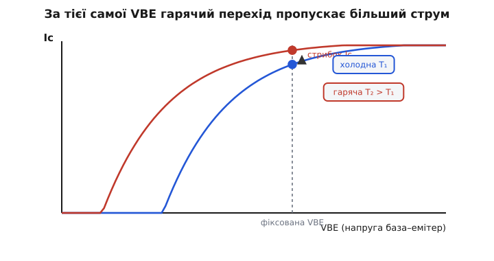
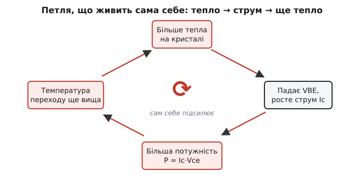
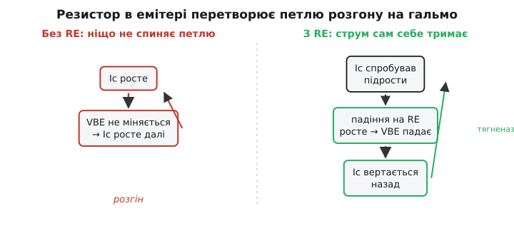

# Тепловий розгін транзистора

Транзистор пропрацював у схемі тиждень — а тоді тихо помер, хоча «за розрахунком» усе сходилося: струм у нормі, потужність нижча за паспортну, радіатор не обпікає пальці. Розкриваєш корпус — кристал почорнів, наче його спалили зсередини. Ніхто його не перевантажував. Він **спалив сам себе** — і зробив це не випадково, а за невблаганною логікою, закладеною в саму фізику напівпровідника. Ця логіка зветься **тепловим розгоном** (англ. *thermal runaway*, буквально «теплова втеча», коли процес «утікає» з-під керування), і зрозуміти її варто кожному, хто пускає крізь транзистор бодай помітний струм.

Суть — у пастці зворотного зв'язку. Транзистор гріється від власної роботи; від нагріву він починає пропускати **більший** струм; більший струм виділяє **ще більше** тепла; тепло знову піднімає струм. Коло замкнулося саме на себе — і якщо нічим його не розірвати, струм і температура женуть угору, доки кристал не зруйнується. Це не дефект конкретної деталі, а вбудована схильність, з якою інженер мусить рахуватися свідомо.

## Чому транзистор «тепліє в небезпечний бік»

Щоб петля закрутилася, потрібен перший поштовх: нагрівшись, прилад має сам почати проводити сильніше. У транзистора така властивість є — і навіть не одна.

Головна причина — **напруга відкривання переходу падає з температурою**. Перехід база–емітер відкривається приблизно при 0.7 В, але це число «при кімнаті». Нагрійте кристал — і той самий ступінь відкритості настає вже за **меншої** напруги. Кількісно: напруга база–емітер VBE, потрібна для того самого струму, спадає приблизно на **2 мВ на кожен градус** нагріву (точніше, від −1.8 до −2.0 мВ/°C для кремнію — усталена величина, що прямо випливає з фізики p-n-переходу).

> 🔧 **Навіщо це.** Цей коефіцієнт −2 мВ/°C — не екзотика для теоретиків, а число, яке щодня псує життя розробникам зміщення. Якщо ви задали транзистору робочу точку, **жорстко** зафіксувавши напругу на базі, то кристал, нагрівшись на 25 °C, «побачить» на переході зайвих 50 мВ — наче ви самі піддали напруги. А для експоненційної залежності струму від VBE 50 мВ — це вже **помітне** збільшення струму. Саме тому фіксоване зміщення напругою вважають поганим тоном: воно пливе від тепла.

Перекладемо це на струм. У транзистора струм колектора залежить від VBE **експоненційно** — невелика добавка напруги дає велике зростання струму. Отже, є два рівноправні способи описати ту саму небезпеку: за **сталої VBE** струм колектора з нагрівом росте сам по собі; або, навпаки, щоб утримати струм сталим, треба з нагрівом VBE **зменшувати**. Обидва формулювання про одне — нагрітий перехід «жадібніший» до струму.


*Дві характеристики Ic(VBE) того самого транзистора: холодна (синя) і гаряча (червона). Нагрів зсуває криву **вліво** — перехід відкривається за меншої напруги. Якщо схема тримає VBE фіксованою (пунктир), робоча точка перестрибує з нижньої кривої на верхню: за тієї самої напруги тече більший струм. Це й є перший поштовх петлі.*

Є й другий, незалежний поштовх — **струм витоку** зворотно зміщеного переходу база–колектор (його позначають ICBO). Це паразитний струм, що тече навіть «закритим» переходом за рахунок теплового народження носіїв, і він теж додається до струму колектора. Витік **різко** росте з температурою: грубо кажучи, **подвоюється на кожні 8–10 °C** у германію й трохи повільніше в кремнію. Колись, в епоху германієвих приладів, саме цей витік був головним винуватцем розгону; у сучасних кремнієвих транзисторів витік крихітний, тож провідну роль грає вже описане сповзання VBE. Але механізм петлі від цього не міняється — обидва ефекти штовхають струм у той самий небезпечний бік.

> 📜 Германій горів від теплового розгону так охоче, що це стало однією з причин, чому індустрія масово перейшла на кремній: чому германієві транзистори надійні лише до ~70 °C, як це палило перші підсилювачі й хто це здолав — у [короткій історії германієвого розгону](topic:electronics/thermal-runaway/hist-germanium-runaway.md).

## Петля, що живить сама себе

Тепер з'єднаймо ланки в коло — і відразу стане видно, чому це небезпечно. Складімо ланцюжок причин і наслідків крок за кроком.

Транзистор у роботі розсіює потужність: на ньому одночасно є напруга (між колектором і емітером, Vce) і тече струм (Ic), а добуток `P = Ic · Vce` перетворюється на тепло прямо в кристалі. Це тепло мусить кудись витекти — у корпус, у радіатор, у повітря, — і доки воно витікає повільніше, ніж народжується, **температура переходу росте**. Наскільки росте — задає [тепловий опір](topic:physics/thermal-resistance) шляху Rθ: найгарячіша точка кристала тепліша за довкілля рівно на P·Rθ.

> Тепловий опір — стрижень усієї цієї теми. Коротко: температура переходу Tj = Ta + P·Rθ, де Ta — температура довкілля, Rθ (°C/Вт) — опір шляху для тепла від кристала назовні. Що гірший тепловідвід (більший Rθ — кепський радіатор, тісний корпус), то вищий підйом температури від тієї самої потужності. Докладніше — у [тепловому опорі й ланцюжку Rθ](topic:physics/thermal-resistance).

А далі замикається коло. Піднялася температура переходу — спрацював той самий поштовх, що тепліє в небезпечний бік: впала VBE (і підрос витік), тож **струм колектора Ic зріс**. Більший Ic за тієї самої напруги Vce означає **більшу потужність** P = Ic·Vce. Більша потужність — **ще вища** температура переходу. Вища температура — **ще більший** струм. І так по колу.


*Замкнений ланцюг теплового розгону. Кожна ланка підсилює наступну, а остання повертається до першої. Якщо кожен оберт додає до струму більше, ніж попередній, петля «розкручується» — струм і температура біжать угору лавиною, доки кристал не згорить.*

Ось чому це **зворотний зв'язок**, та ще й **додатний**: наслідок повертається на вхід і підсилює власну причину. Усе, що ми любимо у [від'ємному зворотному зв'язку](topic:electronics/negative-feedback) — самостабілізацію, — тут обертається протилежністю. Додатний зв'язок не заспокоює систему, а розгойдує її.

## Чому одне коло втікає, а інше — ні

Найважливіше питання: коли петля справді «втікає», а коли просто трохи піднімає струм і заспокоюється? Адже будь-який транзистор у роботі гріється й трошки збільшує струм — але більшість при цьому чудово живуть роками. Де межа?

Межа — у **підсиленні за один оберт петлі**. Уявімо, що температура переходу випадково підскочила на крихітний крок. Цей крок підняв струм, струм підняв потужність, потужність повернулася добавкою до температури. Питання одне: **ця нова добавка до температури більша чи менша за початковий крок?**

- Якщо **менша** — кожен наступний оберт слабший за попередній. Збурення затухає, система сама вертається до рівноваги. Транзистор стабільний.
- Якщо **більша** — кожен оберт сильніший. Збурення наростає лавиною, струм і температура біжать угору без упину. Це й є тепловий розгін.

Тобто розгін — це не «занадто гаряче» саме по собі, а **петля з коефіцієнтом підсилення більшим за одиницю**. А від чого залежить це підсилення? Від кількох речей одразу: наскільки круто струм реагує на температуру (та сама чутливість −2 мВ/°C), наскільки велика напруга Vce (вона множить струм у потужність), і — найважливіше — наскільки **поганий тепловідвід** Rθ (він перетворює потужність назад у температуру). Великий Rθ і велика Vce роблять петлю «сильною»; добрий радіатор і низька напруга — «слабкою».

> Звідки точно береться умова «підсилення петлі > 1», як її записати через похідні струму за температурою й теплового опору, і де лежить точний поріг стійкості — у [виведенні критерію теплової стійкості](topic:electronics/thermal-runaway/math-runaway-criterion.md). Там та сама ідея, що тут на пальцях, доведена формулою до робочого числа.

Звідси вже видно і всі ліки: щоб петля не втекла, треба зробити її підсилення меншим за одиницю. А значить — або послабити чутливість струму до тепла (додати в коло власний від'ємний зворотний зв'язок), або поліпшити тепловідвід (зменшити Rθ), або не заганяти транзистор у режим великих Vce й Ic одночасно. Розгляньмо найдієвіший спосіб.

## Головне гальмо: резистор в емітері

Найпростіший і найнадійніший спосіб розірвати петлю — дати схемі **власний від'ємний зворотний зв'язок за струмом**, який протидіятиме тепловому. Робить це один резистор, увімкнений в емітер, — RE.

Ідея елегантна. Увесь струм емітера (а він майже дорівнює струму колектора) тече крізь RE й створює на ньому падіння напруги U = Ic·RE. Тепер придивімося, що насправді відкриває транзистор. Напруга на базі задана зовні й тримається сталою. А відкриває перехід **різниця** між напругою бази й напругою емітера — а емітер уже не «на землі», він піднятий падінням на RE. Тож реальна керувальна напруга на переході — це напруга бази **мінус** Ic·RE.

І ось де народжується протидія. Хай тепло спробувало підняти струм Ic. Більший струм — більше падіння на RE — вище піднявся емітер. А якщо емітер піднявся, а база лишилась на місці, то різниця між ними **зменшилась** — тобто перехід **прикрився**. Прикритий перехід тягне струм **назад униз**. Транзистор сам себе осадив: спроба струму зрости породжує силу, що цей струм гасить.


*Ліворуч — голий каскад: VBE фіксована, ніщо не заважає струму рости, петля розкручується. Праворуч — той самий каскад із RE: щойно струм пробує підрости, падіння на RE піднімає емітер, реальна напруга на переході падає, і струм вертається назад. Замість додатного зв'язку, що розганяє, з'явився від'ємний, що тримає.*

Це той самий [від'ємний зворотний зв'язок](topic:electronics/negative-feedback), тільки тепер він свідомо вбудований у схему, щоб **переважити** тепловий додатний зв'язок. Поки гальмівна дія RE сильніша за розганяльну дію температури — петля стабільна, і транзистор тримає струм майже незмінним хоч у мороз, хоч у спеку. Це робить емітерний резистор наріжним каменем будь-якого пристойного зміщення підсилювача.

> 🔧 **Навіщо це.** Правило з цього просте й залізне: ніколи не зміщуй потужний каскад **жорсткою напругою на базі без резистора в емітері**. Достатньо падіння на RE хоча б у кілька десятих вольта — і теплове сповзання VBE (ті −2 мВ/°C) тоне на тлі набагато більшого гальмівного падіння Ic·RE. Платиш за це невеликою втратою напруги й трохи меншим підсиленням, але натомість дістаєш робочу точку, що не пливе й не втікає. У переважній більшості схем це найкраща угода, яку можна укласти.

Інші ліки доповнюють резистор, а не замінюють його. **Кращий радіатор** (менший Rθ) прямо послаблює останню ланку петлі — те саме тепло дає менший підйом температури. **[Зниження допустимого навантаження за температурою](topic:electronics/power-derating)** (derating) тримає робочу точку подалі від краю, лишаючи запас на найгарячіший день. **Спільний тепловий контакт** транзистора з елементом, що задає його зміщення (наприклад, із діодом чи іншим транзистором у схемі стабілізації струму), змушує зміщення «сповзати» синхронно з приладом і компенсувати дрейф. У відповідальних схемах ці заходи поєднують.

## Power-транзистори: розгін усередині кристала

Досі ми вважали кристал однією гарячою точкою. У потужного транзистора це не так — і там чигає особливо підступний різновид розгону.

Потужний транзистор — це насправді **багато крихітних транзисторів, увімкнених паралельно** на одному кристалі, щоб разом нести великий струм. Біда в тому, що вони не зовсім однакові й не однаково охолоджуються: якась ділянка кристала виявляється трохи гарячішою за сусідні. А гарячіша ділянка, як ми вже знаємо, проводить **охочіше** — тож вона перетягує на себе більше спільного струму. Більший струм у ній — ще більший локальний нагрів — ще більше перетягнутого струму. Це той самий розгін, але **всередині** кристала: струм збирається у вузьку гарячу пляму замість розтікатися рівно. Інженери звуть це **перетягуванням струму** (англ. *current hogging*, «загарбання» струму).

Найгірше, що **середня** температура кристала при цьому може здаватися цілком безпечною — а локальна пляма вже розплавляє кремній. Це явище називають **вторинним пробоєм** (англ. *second breakdown*): транзистор гине від концентрації струму в точці, хоча за паспортом «усе в межах». Саме тому потужні транзистори мають у даташиті окрему межу — **зону безпечної роботи** (англ. *safe operating area*, SOA): не просто «не більше стільки струму й не більше стільки напруги», а заборонену область, де **добуток** напруги й струму вже може зірватися у вторинний пробій, навіть якщо кожна величина окремо в нормі.

> Зона безпечної роботи й вторинний пробій — окрема важлива тема: чому межа на графіку Ic–Vce не прямокутна, а зрізана по діагоналі, і як читати ці криві з даташита. Що треба знати тут: для потужних BJT існує область великих Vce, де навіть короткий імпульс струму вбиває прилад через концентрацію струму, тож сам лише контроль середньої потужності не рятує. Детальніше — у [зоні безпечної роботи й вторинному пробої](topic:electronics/safe-operating-area).

Боротися з цим на рівні приладу допомагають **баластні емітерні резистори**: крихітний резистор у кожної елементарної комірки робить для неї те саме, що великий RE робить для всього каскаду, — щойно комірка перетягує зайвий струм, її власне падіння напруги прикриває її й вирівнює струм між сусідами. Тому в добрих потужних транзисторах ця стабілізація закладена прямо в структуру кристала. (Це одна з причин, чому потужні **польові** транзистори часто стійкіші: у певному режимі їхній струм із нагрівом, навпаки, **падає**, тож паралельні комірки самі вирівнюються без зовнішніх хитрощів. Але це справедливо не завжди, і в лінійному режимі MOSFET теж має свою зону небезпеки.)

## Порахуймо: коли петля втікає, а коли заспокоюється

Сухий критерій «підсилення петлі більше чи менше за одиницю» оживає на числах. Промоделюймо петлю прямо — крок за кроком, як вона крутиться в реальному часі, — і подивімося, від чого залежить результат.

**Умова.** Транзистор розсіює потужність за фіксованої напруги Vce = 10 В. Струм колектора при +25 °C дорівнює 100 мА. Чутливість струму до температури візьмемо просту: кожен градус нагріву додає до струму 0.6 % (це наближено відбиває сповзання VBE на −2 мВ/°C за фіксованого зміщення напругою). Тепловий опір кристал–довкілля Rθ, температура довкілля +25 °C. Промоделюймо, що буде з температурою переходу за поганого тепловідводу (Rθ = 200 °C/Вт) і за доброго (Rθ = 30 °C/Вт).

:::tabs
```c
// Проста ітеративна модель теплового розгону:
// на кожному кроці перераховуємо струм за поточною температурою,
// з нього — потужність, з неї — нову температуру переходу.
#include <stdio.h>

float settle(float rth) {          // rth — тепловий опір, °C/Вт
    const float Vce   = 10.0f;     // фіксована напруга колектор–емітер, В
    const float Ta    = 25.0f;     // температура довкілля, °C
    const float Ic25  = 0.100f;    // струм при +25 °C, А
    const float tc    = 0.006f;    // приріст струму на градус (+0.6 %/°C)

    float Tj = Ta;                 // старт: кристал ще не нагрітий
    for (int step = 0; step < 100; step++) {
        float Ic = Ic25 * (1.0f + tc * (Tj - 25.0f)); // струм за поточної T
        float P  = Ic * Vce;                          // розсіювана потужність
        float Tj_new = Ta + P * rth;                  // нова температура переходу
        if (Tj_new > 500.0f) return 999.0f;           // кристал зруйновано — розгін
        Tj = Tj_new;
    }
    return Tj;                      // петля зійшлася — стала температура
}

int main(void) {
    printf("Rth=30:  Tj = %.0f C\n",  settle(30.0f));   // добрий радіатор
    printf("Rth=200: Tj = %.0f C\n",  settle(200.0f));  // кепський тепловідвід
    return 0;
}
```
```python
# Проста ітеративна модель теплового розгону:
# на кожному кроці перераховуємо струм за поточною температурою,
# з нього — потужність, з неї — нову температуру переходу.

def settle(rth):                   # rth — тепловий опір, °C/Вт
    Vce  = 10.0                    # фіксована напруга колектор–емітер, В
    Ta   = 25.0                    # температура довкілля, °C
    Ic25 = 0.100                   # струм при +25 °C, А
    tc   = 0.006                   # приріст струму на градус (+0.6 %/°C)

    Tj = Ta                        # старт: кристал ще не нагрітий
    for _ in range(100):
        Ic = Ic25 * (1.0 + tc * (Tj - 25.0))  # струм за поточної T
        P  = Ic * Vce                          # розсіювана потужність
        Tj_new = Ta + P * rth                  # нова температура переходу
        if Tj_new > 500.0:
            return 999.0                       # кристал зруйновано — розгін
        Tj = Tj_new
    return Tj                      # петля зійшлася — стала температура


if __name__ == "__main__":
    print(f"Rth=30:  Tj = {settle(30.0):.0f} C")    # добрий радіатор
    print(f"Rth=200: Tj = {settle(200.0):.0f} C")   # кепський тепловідвід
```
:::

Простежмо логіку обома шляхами вручну, щоб побачити розвилку.

```
Добрий тепловідвід, Rθ = 30 °C/Вт:
  старт:   Tj = 25 °C,  Ic = 100 мА,  P = 1.00 Вт → Tj = 25 + 1.00·30 = 55 °C
  крок 2:  Ic = 100·(1+0.006·30) = 118 мА, P = 1.18 Вт → Tj = 25 + 35.4 ≈ 60 °C
  ...      кожен крок додає дедалі менше — петля ЗГАСАЄ
  підсумок: Tj стабілізується близько 62 °C. Транзистор живий.

Кепський тепловідвід, Rθ = 200 °C/Вт:
  старт:   Tj = 25 °C,  Ic = 100 мА,  P = 1.00 Вт → Tj = 25 + 1.00·200 = 225 °C
  крок 2:  Ic = 100·(1+0.006·200) = 220 мА, P = 2.20 Вт → Tj = 25 + 440 = 465 °C
  крок 3:  Ic ще більший, P ще більша → Tj за 500 °C
  підсумок: кожен крок додає БІЛЬШЕ за попередній — РОЗГІН, кристал гине.
```

Висновок промовистий: **та сама схема, той самий транзистор, та сама потужність на старті — а доля протилежна**, і вирішив її лише тепловий опір. За доброго тепловідводу підсилення петлі менше за одиницю, збурення згасає, температура осідає на безпечних 62 °C. За поганого — підсилення більше за одиницю, кожен оберт сильніший, і за три кроки кристал за межею виживання. Між цими двома випадками лежить критичний Rθ, за якого петля рівно на грані; усе, що гірше за нього, — приречене. Ось чому радіатор у силовій схемі — не «про всяк випадок», а часто **сама межа** між робочим приладом і вугликом.

## Як це не допустити: коротко по суті

Зведімо всю механіку в кілька практичних правил, і кожне з них прямо випливає з петлі, яку ми розібрали.

**Розривай петлю від'ємним зв'язком.** Резистор в емітері (баластний — у потужних приладах) — найдешевший і найнадійніший запобіжник: він гасить спробу струму зрости, перш ніж вона встигне розкрутитися. Жорстке зміщення напругою без нього — пряме запрошення до розгону.

**Полегшуй останню ланку — тепловідвід.** Менший Rθ (радіатор, мідь на платі, тепловий контакт із корпусом) прямо зменшує підсилення петлі. Часто саме він вирішує, втече система чи ні.

**Лишай запас.** [Зниження навантаження за температурою](topic:electronics/power-derating) тримає робочу точку подалі від краю, де петля стає крихкою. Найгірший передбачений день — спека, забитий пилом корпус, розкид параметрів — має лишати транзистор усередині безпечної зони.

**Шануй зону безпечної роботи.** У потужних каскадах не сам лише середній ват визначає виживання: великий Vce при помітному струмі може зірватися у вторинний пробій крізь концентрацію струму, навіть коли середня потужність у межах.

Тепловий розгін — не рідкісна екзотика, а постійна тінь будь-якого приладу, що проводить струм і гріється від нього. Уся його загроза вміщається в одну фразу: **транзистор тепліє в небезпечний бік, і без гальма це коло замикається саме на себе.** А весь захист зводиться до того, щоб або послабити поштовх, або не дати петлі підсилення перевалити за одиницю — резистором, радіатором і запасом. Хто тримає це в голові, той не дивується почорнілому кристалу, що «за розрахунком мав жити».
