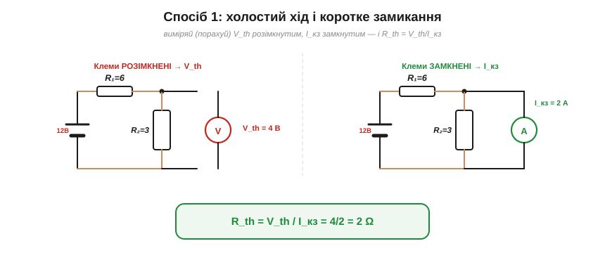
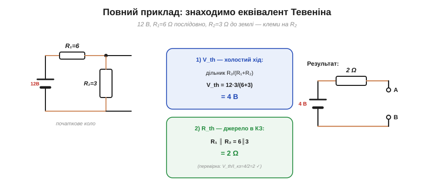

# Як знайти Vth, Rth

Теореми [Тевеніна](book:electronics/thevenin) й [Нортона](book:electronics/norton) кажуть, що будь-який лінійний двополюсник зводиться до пари чисел — напруги V_th і опору R_th. Залишається практичний бік: **як саме** знайти ці заповітні два числа для конкретного кола. V_th дається легко й однаково завжди; для R_th є **три способи** — і варто володіти всіма, бо кожен зручний у своїй ситуації.

### Знаходимо V_th: напруга холостого ходу

Тут усе просто й однозначно: **V_th — це завжди напруга на розімкнених клемах** (холостий хід). Прибираємо навантаження, лишаємо клеми вільними — і рахуємо (чи міряємо) напругу між ними звичайними методами [аналізу кіл](book:electronics/circuit-analysis). Це і є напруга Тевеніна. Жодних варіантів — V_th завжди так.

На реальному пристрої V_th знімають вольтметром із дуже високим вхідним опором — щоб сам прилад не став навантаженням і не зіпсував той «холостий хід». Це той самий нюанс, що з [дільником напруги](book:electronics/voltage-divider): будь-яке навантаження (зокрема й вимірювач) трохи занижує напругу, тож для чесного V_th воно має бути якомога «легшим».

### Три способи знайти R_th


*Рис. Три способи дістати R_th: (1) поділити напругу холостого ходу на струм короткого, R_th = V_th/I_кз — універсально (якщо I_кз ≠ 0); (2) вимкнути джерела й згорнути опір послідовно/паралельно — для незалежних джерел; (3) подати пробне джерело й поділити V/I — для залежних джерел.*

Опір Тевеніна можна дістати трьома шляхами, що дають однакову відповідь. Розгляньмо кожен.

### Спосіб 1: холостий хід ÷ коротке


*Рис. Спосіб 1: розімкнувши клеми, дістаємо V_th (напруга холостого ходу); замкнувши — I_кз (струм короткого). Опір Тевеніна — їхнє відношення: R_th = V_th/I_кз = 4/2 = 2 Ω.*

Найуніверсальніший спосіб: знайти **обидва** граничні режими — напругу холостого ходу V_th (клеми розімкнені) і струм короткого замикання I_кз (клеми замкнені дротом), — а тоді поділити:

R_th = V_th / I_кз.

Логіка прозора: для самого еквівалента Тевеніна холостий хід дає V_th, а коротке замикання — струм V_th/R_th; їхнє відношення й повертає R_th. Цей спосіб працює майже **завжди** (навіть із залежними джерелами) — за умови, що I_кз ≠ 0. (Якщо в колі немає незалежного збудження, буває V_th = 0 і I_кз = 0 водночас, а R_th усе одно скінченний; ділити «0 ÷ 0» не можна — тоді беруть спосіб 3 із пробним джерелом.)

Та з ним є практична засторога: реально замикати клеми потужного джерела **небезпечно** (потече величезний струм). Тому I_кз для сильних кіл частіше **рахують**, а не міряють; для слабких — міряють амперметром, який сам майже коротке замикання.

> ⚙️ **А як виміряти на столі, не замикаючи клем?** Безпечніший спосіб для **чорної скриньки** (батареї, блока живлення): подати ДВА різні нешкідливі навантаження, зміряти дві пари (I, V) — і з них обчислити Vth і Rth. Цей «метод двох навантажень» легко автоматизує мікроконтролер: [Виміряти Vth і Rth на столі](proj-two-load-method.md).

### Спосіб 2: вимкнути джерела й згорнути


*Рис. Спосіб 2: вимикаємо джерело (напругу в КЗ), і тоді з клем уся мережа — просто пасивні опори. Тут R₁ і R₂ опиняються паралельними: R_th = R₁∥R₂ = 6∥3 = 2 Ω.*

Найшвидший спосіб для звичайних кіл: **вимкнути всі джерела** (за правилом [суперпозиції](book:electronics/superposition): напругу — в коротке замикання, струм — у розрив) і подивитися з клем на те, що лишилось, — а лишилися **самі опори**. Згорнувши їх [послідовно](book:electronics/series-connection) чи [паралельно](book:electronics/parallel-connection), дістаємо R_th напряму. Це найприродніший шлях, коли джерела **незалежні** (звичайні батареї, блоки живлення), а коло зводиться згортанням, — тобто в переважній більшості задач.

### Спосіб 3: пробне джерело


*Рис. Спосіб 3 (для залежних джерел, які не «вимкнути»): власні джерела зануляють, а до клем прикладають пробне джерело V_проб, міряють струм I_проб — і R_th = V_проб/I_проб.*

Третій спосіб потрібен там, де згортання не виходить, — у колах із **залежними** джерелами (їх дають підсилювачі, транзистори; такі джерела не можна просто «вимкнути»). Тоді власні незалежні джерела зануляють, а до клем прикладають **пробне** джерело — скажімо, напругу V_проб — і дивляться, який струм I_проб воно жене. Відношення й дає опір:

R_th = V_проб / I_проб.

Це той самий закон Ома, лише застосований до **всієї мережі** з клем. Спосіб трохи марудніший, зате працює там, де перші два безсилі. Залежні джерела з'являються в колах із [транзисторами](book:electronics/transistor-idea) та [операційними підсилювачами](book:electronics/ideal-opamp) — там цей прийом і знадобиться.

### Повний приклад


*Рис. Повний приклад: V_th = напруга холостого ходу = дільник 12·3/(6+3) = 4 В; R_th = R₁∥R₂ (джерело в КЗ) = 2 Ω. Еквівалент: 4 В за 2 Ω.*

Зведімо все в один наскрізний розрахунок.

**Приклад. Джерело 12 В через R₁ = 6 Ω приходить у вузол A; від A до землі ввімкнено R₂ = 3 Ω. Клеми — на A й землі. Знайти еквівалент Тевеніна.**

```
V_th — напруга холостого ходу (на A без навантаження), це дільник:
        V_th = 12 · R₂/(R₁+R₂) = 12·3/9             = 4 В
R_th — спосіб 2 (джерело 12 В → КЗ): R₁ і R₂ стають паралельними:
        R_th = R₁ ∥ R₂ = 6∥3 = 18/9                 = 2 Ω
Перевірка способом 1: I_кз = 12/R₁ = 12/6 = 2 А
        R_th = V_th/I_кз = 4/2                       = 2 Ω  ✓
Еквівалент Тевеніна:  V_th = 4 В,  R_th = 2 Ω
```

Два способи дали однакові 2 Ω — як і має бути. Тепер коло описане парою **4 В / 2 Ω**, і з цим [еквівалентом Тевеніна](book:electronics/thevenin) вмить рахується будь-яке навантаження, а сама пара миттю переводиться в [еквівалент Нортона](book:electronics/norton) (I_n = 4/2 = 2 А).

Зверніть увагу, як **мало** роботи це коштувало: дві короткі викладки замість повного аналізу мережі окремо для кожного майбутнього навантаження. У цьому й уся принада еквівалента — раз звів коло до пари чисел, далі все легко.

> 🔧 **Навіщо це.** Тримайте в голові, який спосіб коли брати. **Спосіб 2** (вимкнути й згорнути) — ваш робочий кінь для звичайних кіл із незалежними джерелами: найшвидший. **Спосіб 1** (V_th/I_кз) — коли згортання незручне, але обидва граничні режими порахувати легко; ним і **перевіряють** результат. **Спосіб 3** (пробне джерело) — для кіл із залежними джерелами (підсилювачі, транзистори), де перші два не годяться. А V_th — завжди напруга холостого ходу. Маючи цю трійцю прийомів, ви знайдете еквівалент Тевеніна (а отже, й Нортона) для будь-якого реального вузла — і далі гратиметеся з навантаженнями скільки завгодно.

---

Підсумок: **V_th** — завжди напруга холостого ходу. **R_th** знаходять трьома способами: (1) R_th = V_th/I_кз — універсально (коли I_кз ≠ 0); (2) вимкнути джерела й згорнути опір — найшвидше для незалежних джерел; (3) пробне джерело R_th = V_проб/I_проб — для залежних. У наскрізному прикладі всі способи дали той самий результат (4 В / 2 Ω). Звівши будь-яку мережу до еквівалента, природно спитати й про межу її віддачі — за якого навантаження джерело передає [найбільшу потужність](book:electronics/power-matching).

---
