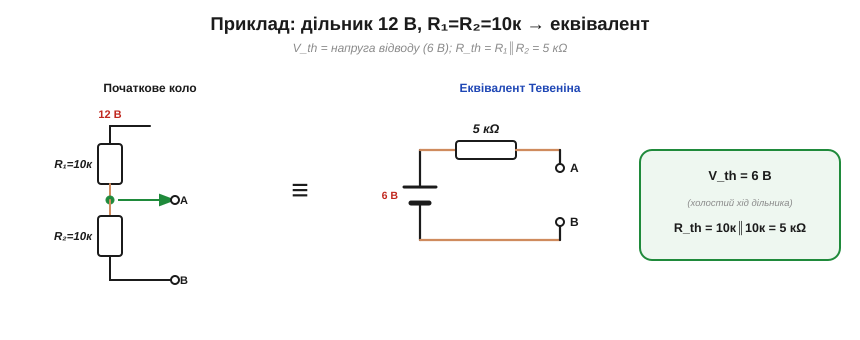
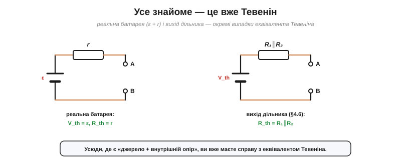

# Теорема Тевеніна

**Теорема Тевеніна** каже річ, що спершу здається занадто гарною: **будь-яку** лінійну мережу з джерел і опорів, хоч яку заплутану, якщо дивитися на неї **з двох клем**, можна замінити **одним джерелом напруги й одним опором**.

### Що каже теорема


*Теорема Тевеніна: будь-яку лінійну мережу, хоч яку складну, з двох клем можна замінити **одним** джерелом напруги V_th послідовно з **одним** опором R_th. Для навантаження різниці немає.*

Формально: будь-яка лінійна двополюсна мережа еквівалентна джерелу напруги **V_th** (напруга Тевеніна) послідовно з опором **R_th** (опір Тевеніна). «Еквівалентна» означає, що **жодне** навантаження, приєднане до клем, не відрізнить оригінальну мережу від цієї простої схемки з двох елементів — вони дадуть йому однакові напругу й струм. Уся внутрішня складність — десятки резисторів, кілька джерел — стискається у **два числа**.

Дві умови варто закарбувати. По-перше, мережа має бути **лінійною** (резистори, лінійні джерела — без діодів і транзисторів у нелінійному режимі); саме лінійність, через [суперпозицію](book:electronics/superposition), і робить теорему правдивою. По-друге, еквівалент завжди прив'язаний до **конкретної пари клем**: дивишся на ту саму мережу з інших двох виводів — матимеш інші V_th та R_th.

### Два числа: V_th і R_th


*Два числа задають еквівалент. **V_th** — напруга на **розімкнених** клемах (холостий хід, навантаження нема). **R_th** — опір мережі, виміряний із клем, коли всі **незалежні** джерела **вимкнено** (напругу в КЗ, струм у розрив).*

Що ж це за два числа? **V_th — це напруга холостого ходу**: та, що на клемах, коли навантаження ще не приєднане (як ε в реального джерела). **R_th — це опір самої мережі з клем**, виміряний тоді, коли всі її **незалежні** джерела **вимкнено** за правилом [суперпозиції](book:electronics/superposition) (джерела напруги — в коротке замикання, струму — в розрив; внутрішні опори лишаються). Якщо ж у колі є **залежні** джерела (підсилювачі, транзистори), їх не вимикають, а R_th дістають [пробним джерелом](book:electronics/thevenin-equivalent). Два числа — і ціла плата описана. Тут важлива сама **ідея**; детальну [техніку їх знаходження](book:electronics/thevenin-equivalent) відпрацьовують окремо.

Обидва числа, до речі, цілком **вимірні** на реальному пристрої. V_th знімають вольтметром із високим вхідним опором — щоб не навантажити вузол і не зіпсувати той самий «холостий хід». А R_th дістають або з розрахунку, або непрямо — за просіданням під відомим навантаженням, точнісінько як [внутрішній опір батареї](book:electronics/internal-resistance).

### Чому це потужно: легко міняти навантаження

Може здатися, що звести мережу до двох чисел — лише косметика. Та насправді це дає величезну практичну вигоду.


*Сила теореми: маючи V_th і R_th, вихід для **будь-якого** навантаження — це простий дільник V_вих = V_th·R_нав/(R_нав+R_th). Одне знайдене V_th, R_th — і десятки навантажень рахуєш миттєво.*

Щойно ви знайшли V_th і R_th, відповідь для **будь-якого** навантаження R_нав стає тривіальною — це звичайний [дільник напруги](book:electronics/voltage-divider): V_вих = V_th·R_нав/(R_нав + R_th). Хочете спробувати десять різних навантажень? Замість десять разів розв'язувати всю мережу, ви рахуєте десять простих дільників. Це і є сенс еквівалента: **складну роботу робиш один раз**, а далі користуєшся готовим результатом скільки завгодно. Саме тому інженери так люблять Тевеніна.

Особливо це цінно під час **проєктування**: підбираючи навантаження чи прикидаючи, як вузол поведеться за різних умов, ви крутите одну просту формулу замість щоразу перелопачувати цілу схему. А ще еквівалент Тевеніна — спільна «валюта», якою різні частини системи домовляються між собою: вихід одного блока описано V_th і R_th, вхід наступного — своїм опором, і їх легко зіставити.

### Приклад: дільник → еквівалент


*Приклад: дільник 12 В з R₁=R₂=10 кΩ. Його еквівалент Тевеніна: V_th = 6 В (напруга відводу на холостому ході), R_th = R₁∥R₂ = 5 кΩ.*

Візьмімо знайомий дільник напруги й знайдімо його еквівалент Тевеніна.

**Приклад. Джерело 12 В живить дільник R₁ = 10 кΩ і R₂ = 10 кΩ; вихід знімаємо з відводу між ними. Який його еквівалент Тевеніна?**

```
V_th = напруга холостого ходу (відводу):  V_th = 12·R₂/(R₁+R₂) = 12·10/20 = 6 В
R_th = опір із клем при вимкненому джерелі (12 В → КЗ):
       тоді R₁ і R₂ виявляються паралельними:  R_th = R₁∥R₂ = 10к∥10к = 5 кΩ
```

Тепер уся «сила» дільника описана двома числами: **6 В за 5 кΩ**. Приєднаймо навантаження R_нав = 5 кΩ — і одразу бачимо просідання: V_вих = 6·5/(5+5) = **3 В**. Це і є кількісне пояснення [«ефекту навантаження»](book:electronics/voltage-divider): вихід просів удвічі, бо навантаження дорівнює R_th. Жодних повторних розрахунків усього кола — самий дільник з еквівалентом.

### Усе знайоме — це Тевенін


*Усе знайоме виявляється Тевеніном: реальна батарея — це V_th = ε, R_th = r; вихід дільника — це V_th = напруга відводу, R_th = R₁∥R₂.*

Багато знайомих схем виявляються Тевеніном, хоч і не названі так прямо. [Реальна батарея](book:electronics/internal-resistance) — це еквівалент Тевеніна з V_th = ε та R_th = r. [Вихід дільника](book:electronics/voltage-divider) — теж: його V_th — напруга відводу, а R_th = R₁∥R₂ (той самий «вихідний опір»). Будь-який реальний вихід — блока живлення, давача, каскаду підсилювача — це «джерело + внутрішній опір», себто Тевенін. Теорема лише підвела під цю звичну картину строгий фундамент: **так можна з будь-якою лінійною мережею**.

> 🔧 **Навіщо це.** Тевенін — це інженерний рентген: він бачить за плетивом схеми просте «джерело + опір». Практична вигода трояка. Перше: **аналіз навантажень** стає тривіальним (один дільник замість усієї мережі). Друге: R_th — це **вихідний опір** вузла, що каже, чи витримає він навантаження без просідання (малий R_th — «жорстке», добре джерело). Третє: це мова **стикування блоків** — щоб з'єднати два каскади, досить знати V_th та R_th першого й вхідний опір другого. Звикніть питати про будь-який вихід: «а який у нього еквівалент Тевеніна?» — і складні системи стануть зрозумілими блоками.

У теореми Тевеніна є точне дзеркало для струму — [теорема Нортона](book:electronics/norton): та сама мережа, але як джерело струму з паралельним опором.
